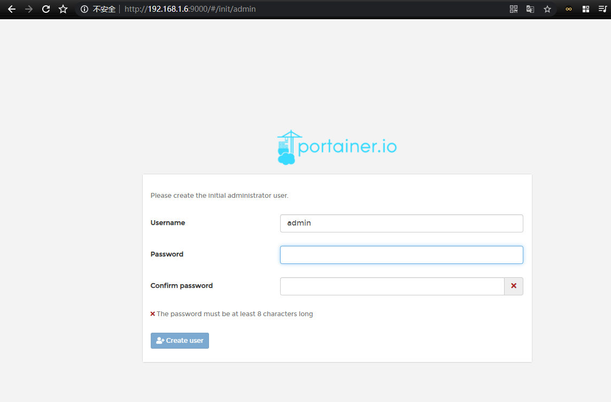
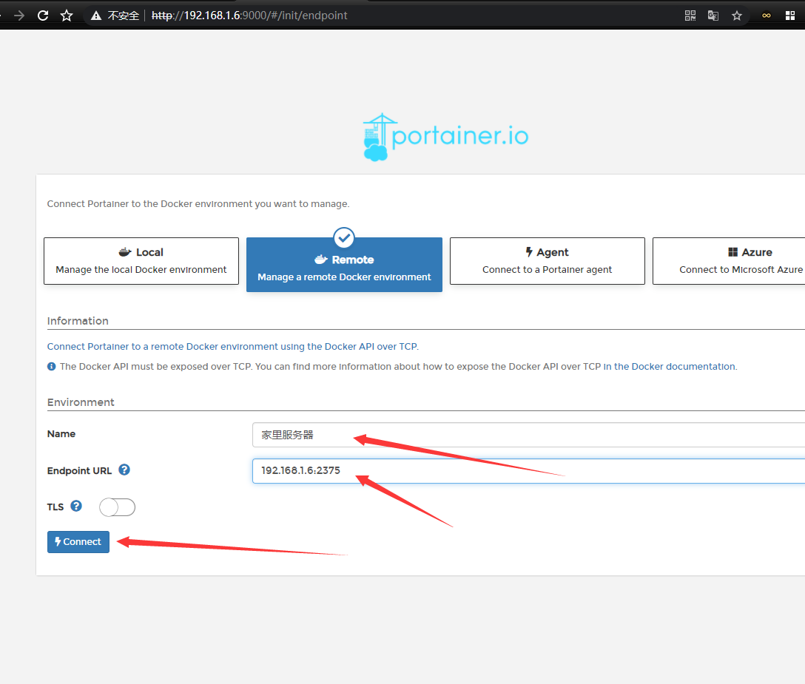
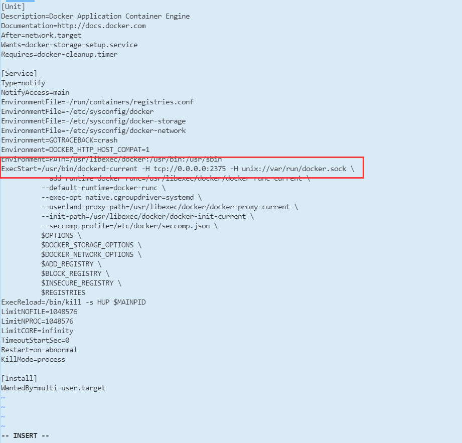

# Docker相关
> Docker是一个环境容器，我把他当虚拟机用的，里面可以虚拟出各种环境，互不影响，强大的离谱。需要啥环境，下一个镜像就能虚拟出来一个容器用。
## Linux安装部署Docker
1. 安装
```
yum install -y docker
```
2. 启动
```
systemctl start docker.service
```
3. 查看安装结果
```
docker version
```
4. 开机启动
```
systemctl enable docker.service
```

## 配置Docker加速
1. 编辑配置文件
```
vim /etc/docker/daemon.json
```
2. 加入加速源
```
{
 "registry-mirrors": ["https://72idtxd8.mirror.aliyuncs.com"]
}
```
3. 重新加载配置并重启
```
systemctl daemon-reload
systemctl restart docker.service
```

## 配置Docker可视化Portainer
> Portainer是一个Docker部署的组件
1. 查找Portainer镜像
```
docker search portainer
```
2. 拉取镜像
```
docker pull portainer/portainer
```
3. 使用上边镜像启动一个容器
```
docker run -d -p 9000:9000 --restart=always -v /var/run/docker.sock:/var/run/docker.sock --name prtainer-test portainer/portainer
```
4. 访问服务器IP:9000,第一次登陆需要创建一个Portainer用户（要是访问不了看看防火墙的9000端口，要是云服务器看看运营商管理平台的安全组）  
  
5. 连接主机   
   
6. 如果连接不上，进行下面的操作  
编辑`docker.service`
```
vim /usr/lib/systemd/system/docker.service
```
找到`ExecStart`字段修改如下
```
ExecStart=/usr/bin/dockerd-current -H tcp://0.0.0.0:2375 -H unix://var/run/docker.sock 
```
  
重启`docker`重新读取配置文件，重新启动`docker`服务
```
systemctl daemon-reload
systemctl restart docker
```  
试试还不行的话，看下防火墙开着没，确认开放防火墙端口
``` 
firewall-cmd --zone=public --add-port=2375/tcp --permanent
```
刷新防火墙
```
firewall-cmd --reload
```


