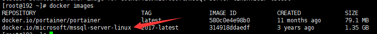
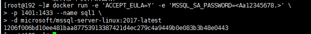
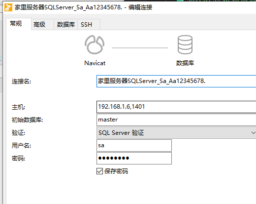

## 一、Docker部署SQLServer
1. 拉取镜像

```
docker pull microsoft/mssql-server-linux:2017-latest
```
2. 查看镜像

```
docker images
```  
  
3. 使用镜像运行一个容器(中间我的密码Aa12345678.有强度限制必须满足长度大于8大小写数字特殊字符等)

```
docker run -e 'ACCEPT_EULA=Y' -e 'MSSQL_SA_PASSWORD=Aa12345678.' \
   -p 1401:1433 --name sql1 \
   -d microsoft/mssql-server-linux:2017-latest
```  
   
4. 测试连接  
