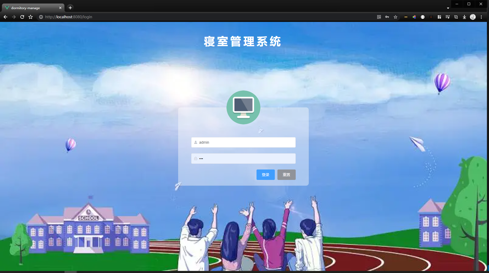
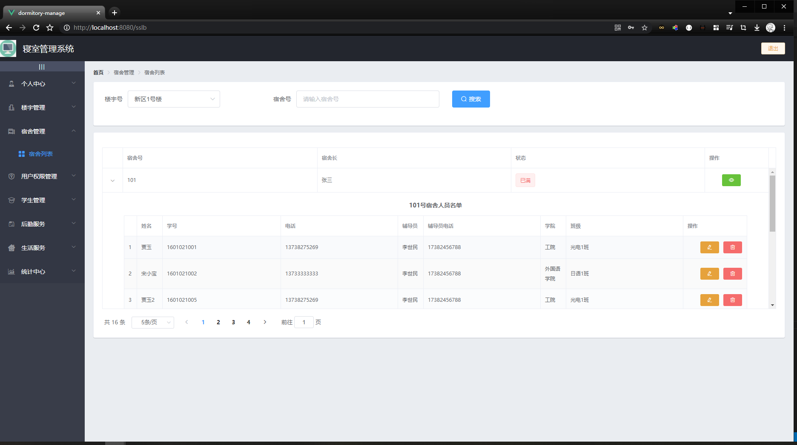
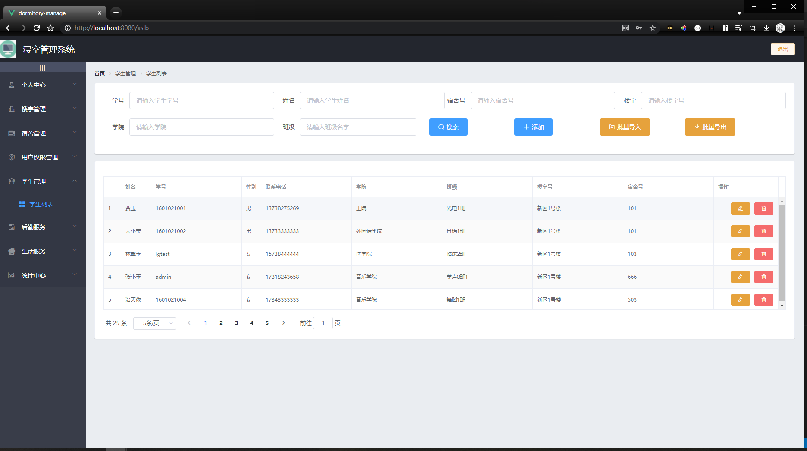
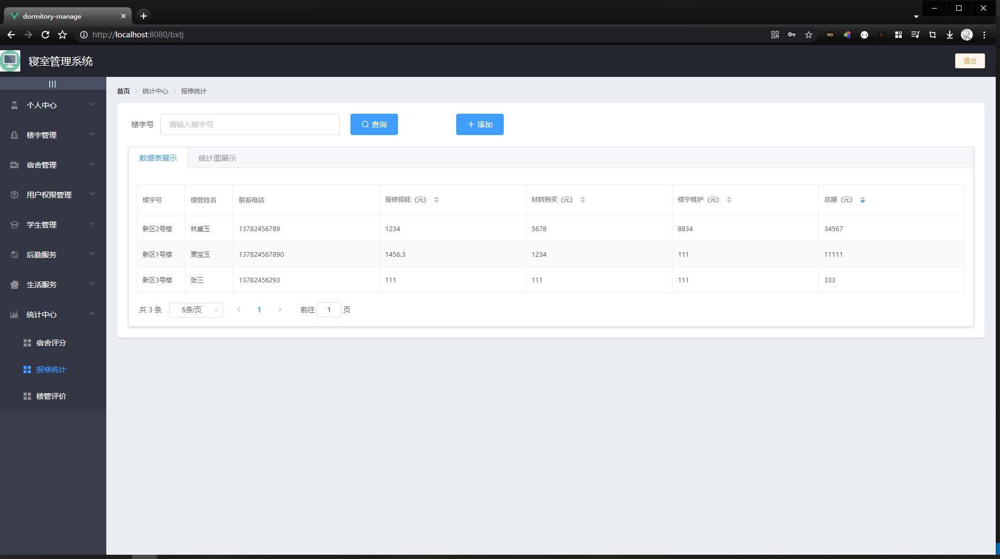
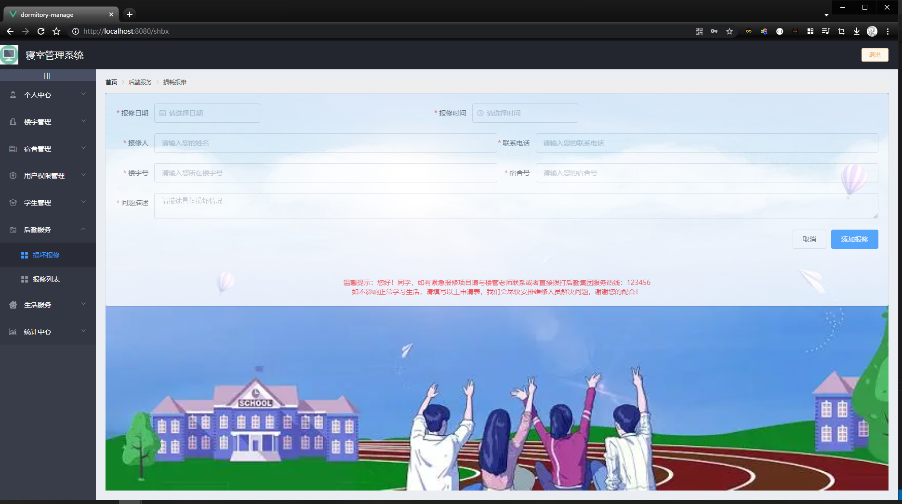
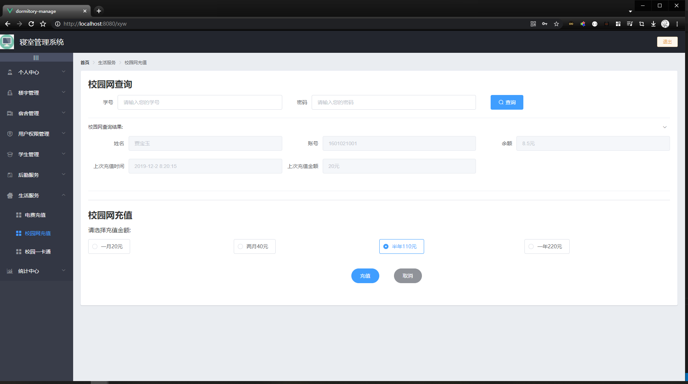
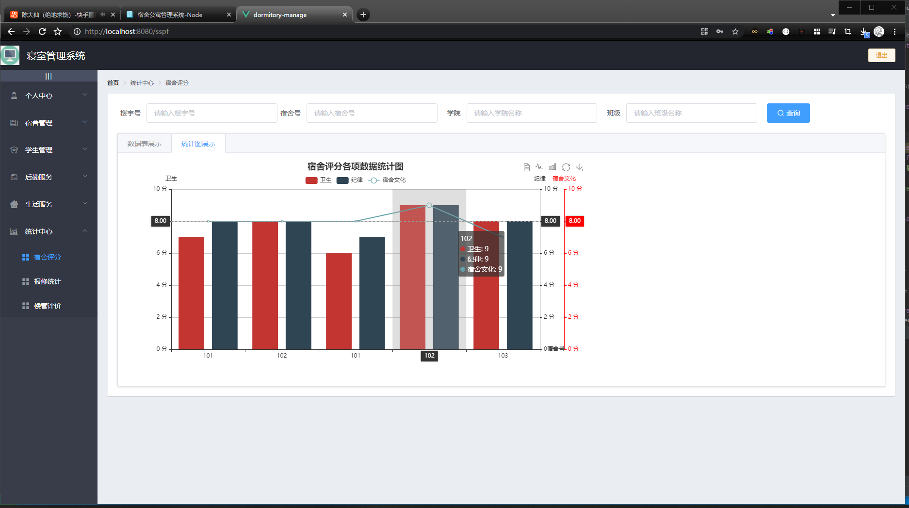

# 宿舍公寓管理系统Node


## 技术栈
宿舍公寓管理系统Node
## 功能描述
```
宿舍公寓管理系统Node+Vue前后端分离（二开项目，部分基础业务不是很了解，介意勿拍）
（包运行成功,需要远程辅助运行请说明，环境部署如Nodejs、MySQL安装配置加20）
技术栈：
后端：Node，Koa2框架
前端：ElementUi组件
数据库:Mysql5.7

功能描述：
┌── 学生
│   ├── 登录
│   ├── 个人信息查看修改
│   ├── 寝室设备损坏报修
│   ├── 电费充值（仅做页面展示）
│   ├── 校园网充值（仅做页面展示）
│   └── 校园一卡通（仅做页面展示）
├── 宿管员
│   ├── 登录
│   ├── 个人信息查看修改
│   ├── 宿舍列表展示操作
│   ├── 学生列表展示操作
│   ├── 损坏报修
│   ├── 报修列表展示操作
│   ├── 电费充值（仅做页面展示）
│   ├── 校园网充值（仅做页面展示）
│   ├── 校园一卡通（仅做页面展示）
│   ├── 宿舍评分
│   ├── 报修统计
│   └── 楼管评价
└── 系统管理员
    ├── 登录
    ├── 个人信息查看修改
    ├── 寝室楼列表查看操作
    ├── 宿舍列表展示操作
    ├── 用户权限列表展示操作
    ├── 学生列表展示操作
    ├── 损坏报修
    ├── 报修列表展示操作
    ├── 电费充值（仅做页面展示）
    ├── 校园网充值（仅做页面展示）
    ├── 校园一卡通（仅做页面展示）
    ├── 宿舍评分
    ├── 报修统计
    └── 楼管评价
```






