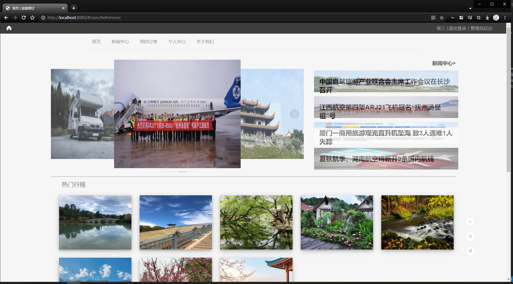
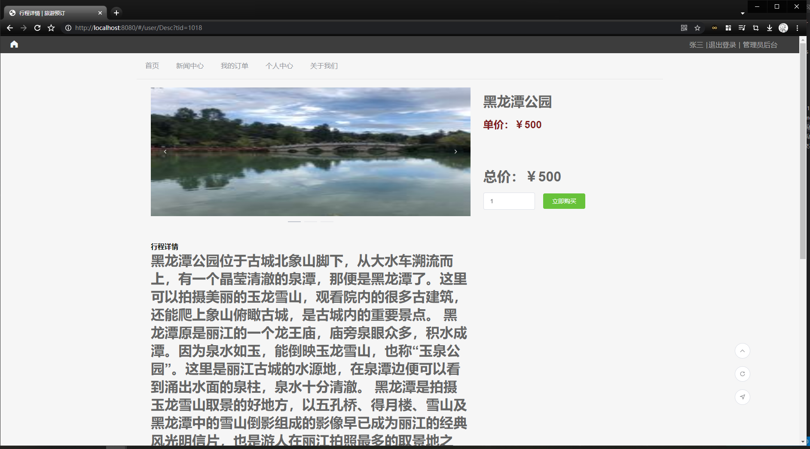
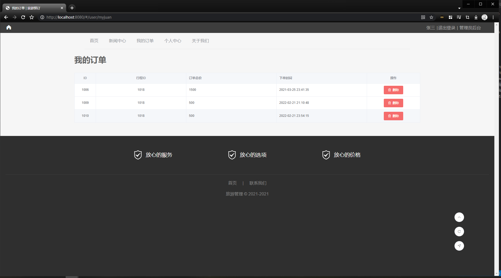
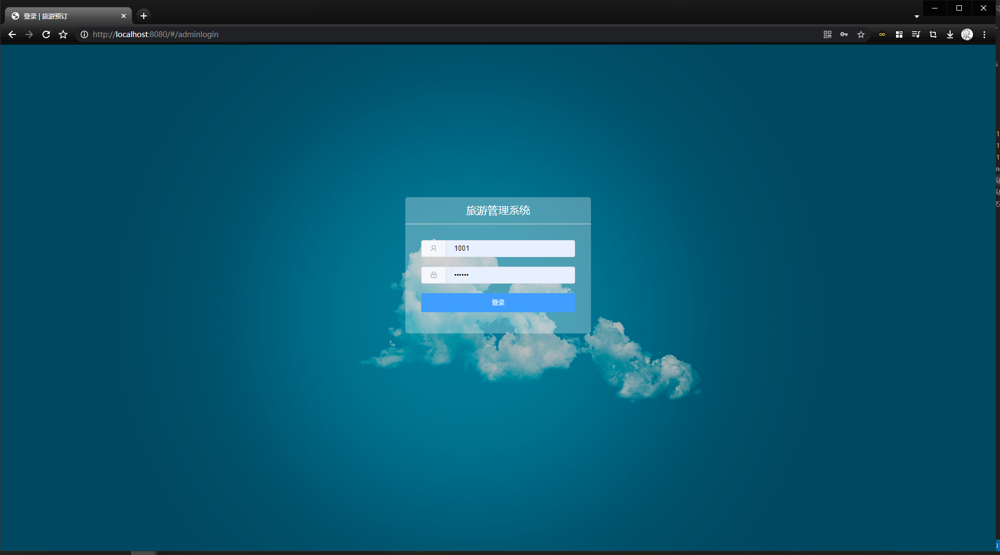
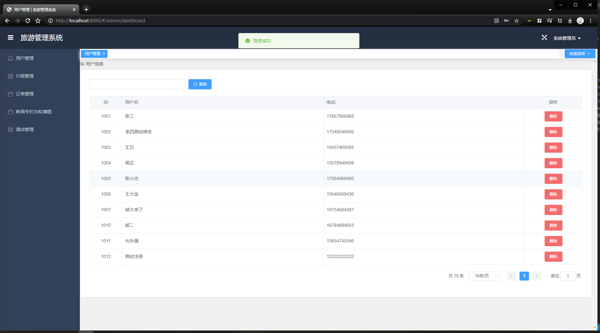
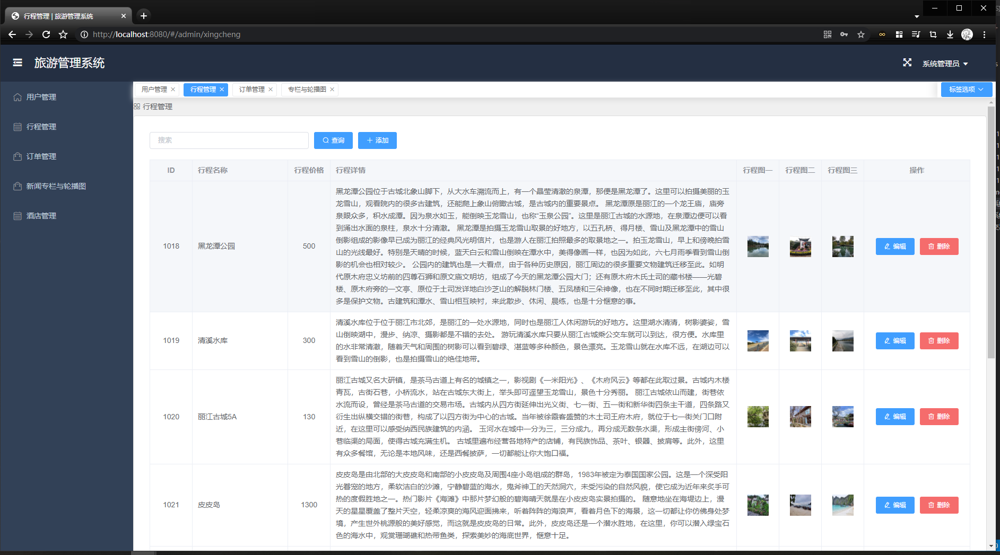
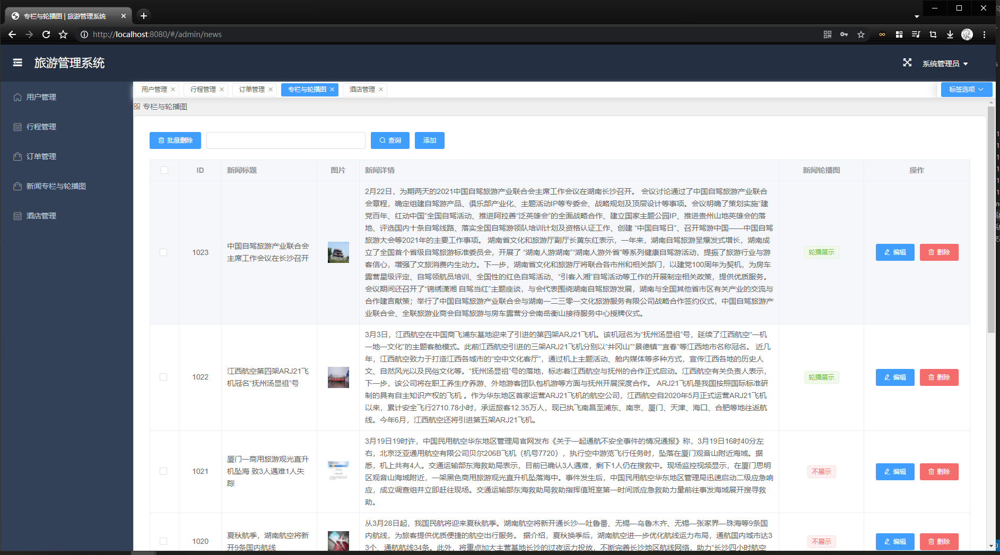

# 旅游管理系统

## 详细描述
```
SpringBoot+MyBatis+MySQL+Vue前后端分离旅游管理系统

基本功能如下（包运行成功，其他环境部署如Java、MySQL、Nodejs环境安装配置加20）：
┌── 普通用户
│   ├── 注册登录
│   ├── 首页展示新闻栏、轮播图、行程展示
│   ├── 创建查看订单
│   ├── 新闻中心
│   ├── 行程信息展示并下单
│   ├── 酒店信息展示
│   ├── 修改个人信息
│   └── 退出登录
└── 管理员
    ├── 登录
    ├── 用户账号管理
    ├── 行程信息管理
    ├── 订单查看查询
    ├── 首页轮播图管理、新闻栏目管理
    ├── 上下架商品
    └── 酒店信息管理
```

## 主要图片展示






