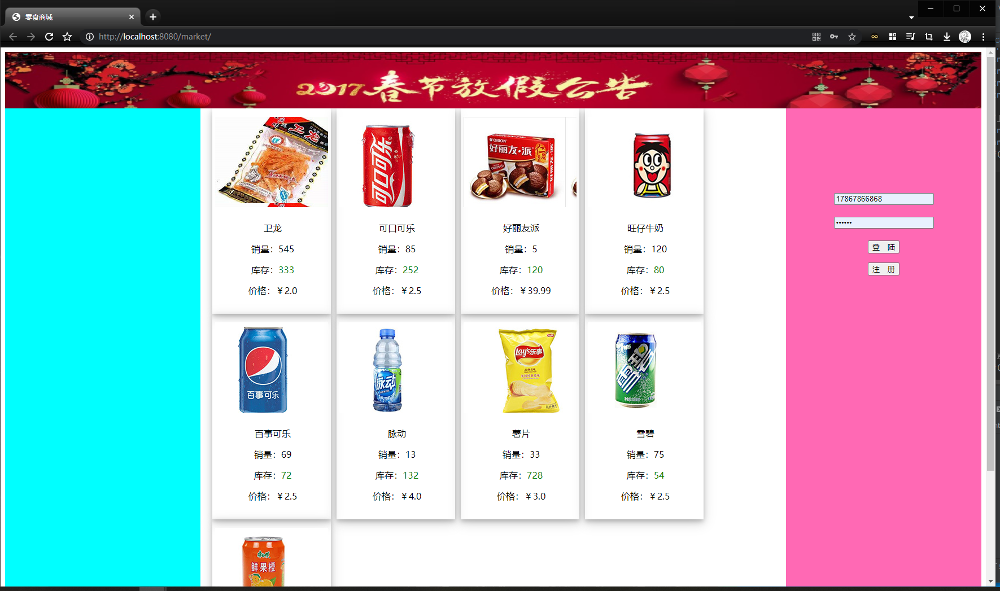
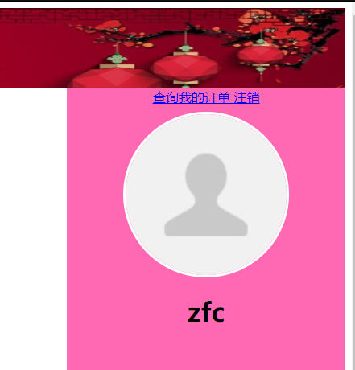
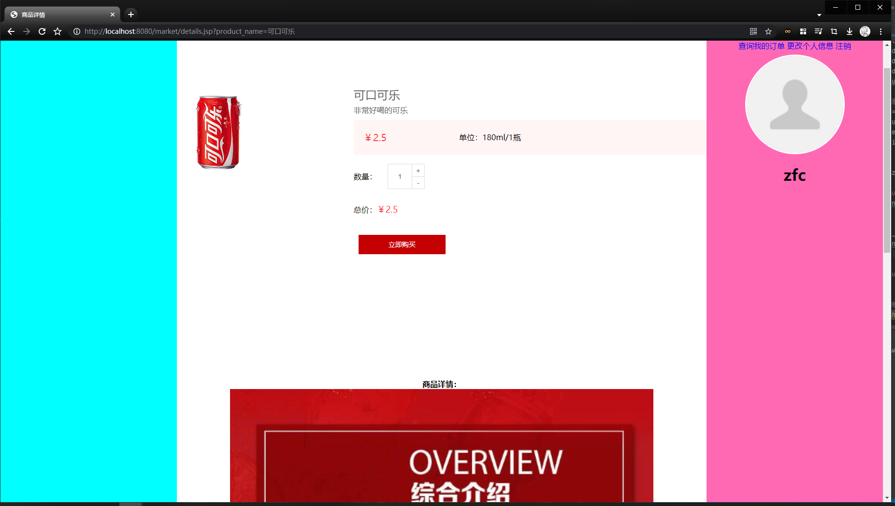
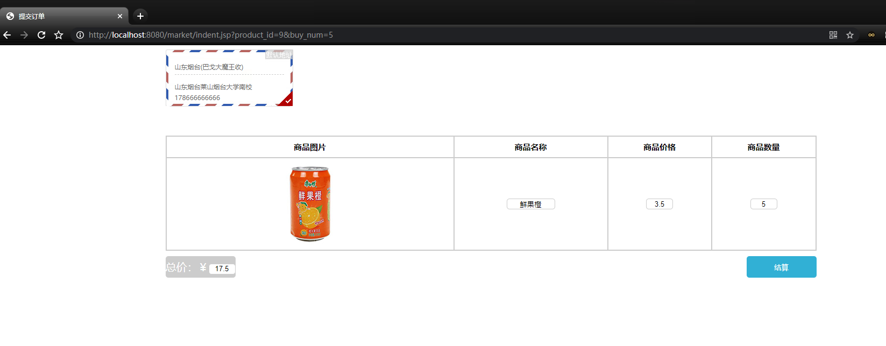
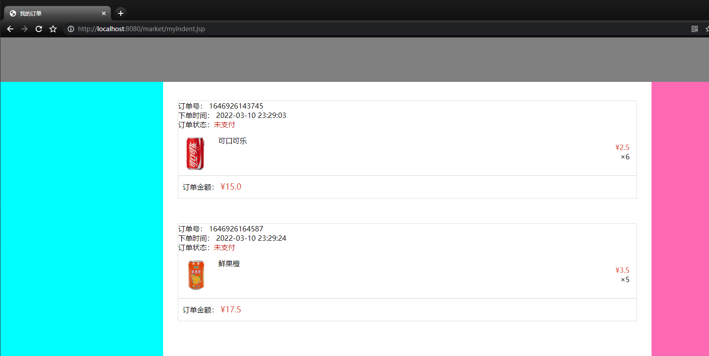
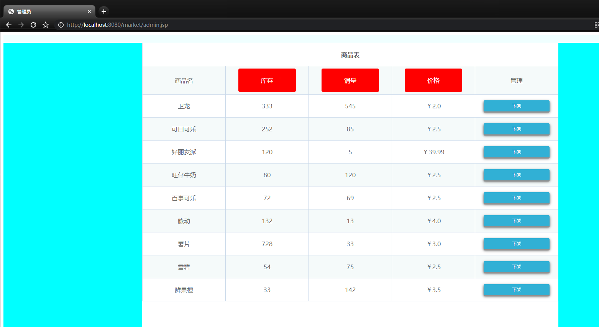
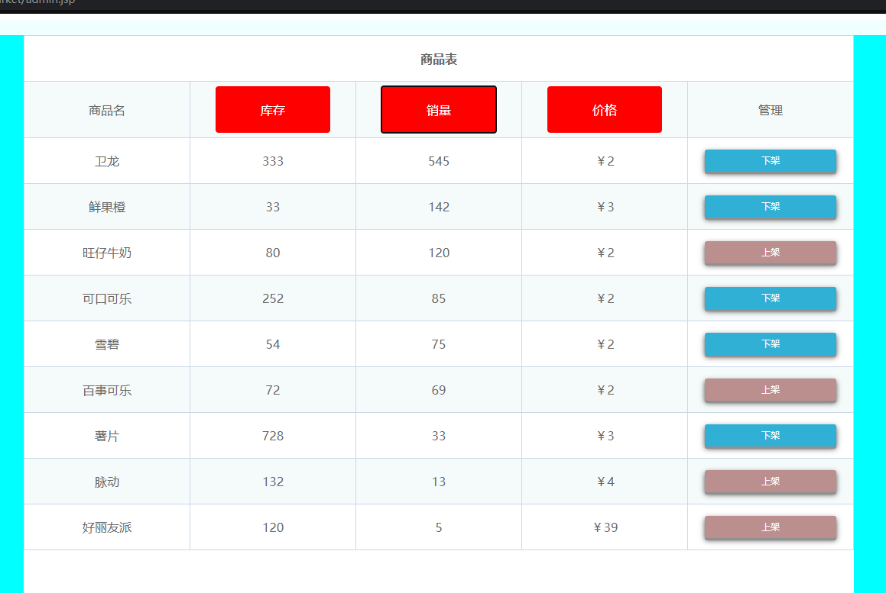

# 基于JavaEE的网上商城——零食商城


## 技术栈
基于JavaEE的网上商城——零食商城
## 功能描述
```
基于JavaEE的网上商城——零食商城(Servlet+Jsp)
（包运行成功，其他环境部署如Java、MySQL、tomcat环境安装配置加20）
购买须知：纯原创，页面比较简陋，适合新学Java的参考，有较高美观要求提前私聊说一下。

开发环境：
Java:JDK1.8
IDE:intellij IDEA 
数据库：Mysql5.7
应用服务器：Tomcat8.5

功能描述：
┌── 普通用户
│   ├── 浏览主页商品
│   ├── 查看商品详情
│   ├── 下单商品
│   ├── 查看我的订单
│   └── 注册用户等功能
└── 管理员
    ├── 查看商品列表
    ├── 进行销量或售价或库存进行排序
    └── 商品上下架
```







