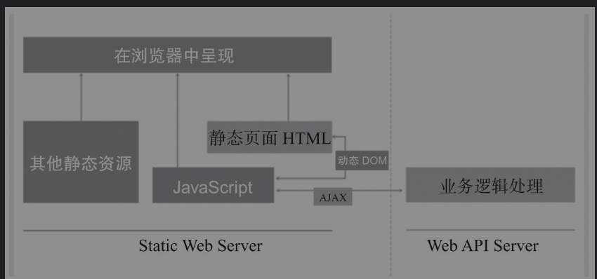
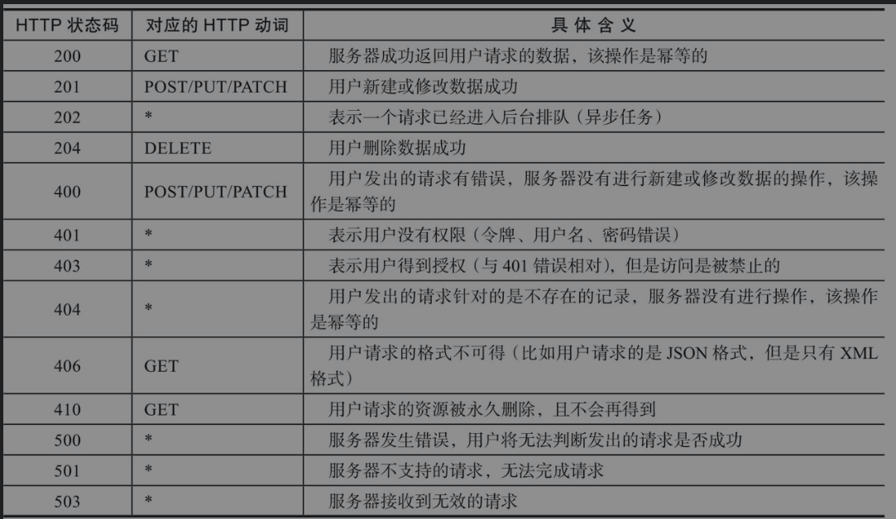
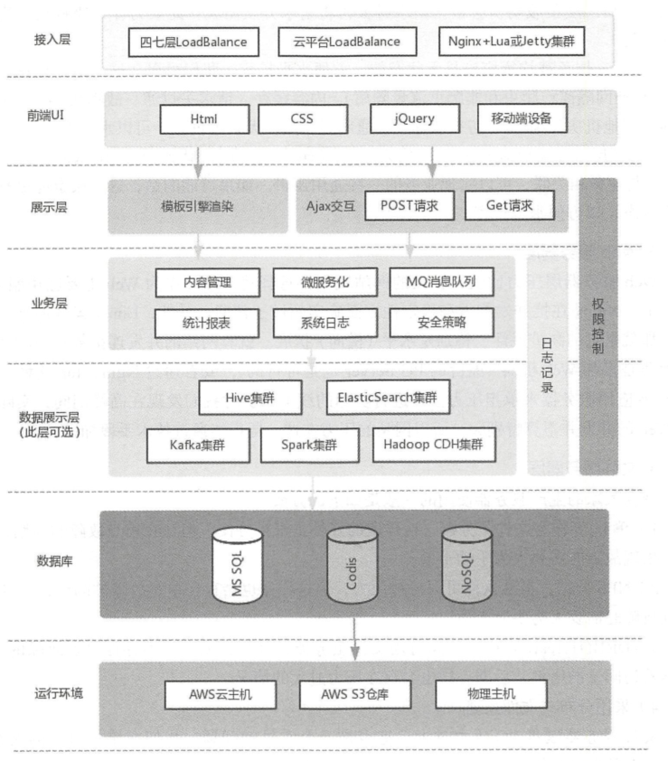
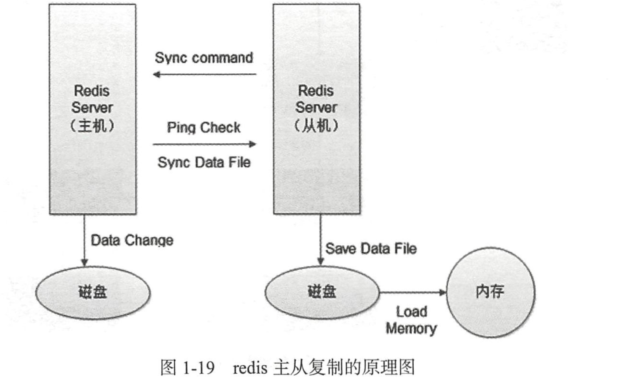
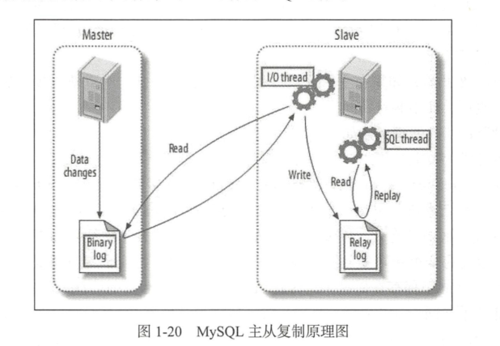

# Devops与自动化运维的意义


## 1 为什么企业需要自动化运维

> 总结一下自动化运维可能带来的好处？


**消除无效率**： 运维工作的手动工作，如果可以实现自动化，将显著提升效率水平

**减少错误**：使用自动化运维工具来完成常规操作可以将错误率大大降低

**最大化员工使用**：避免雇佣更多的员工来应对工作量增加的需求，同样一批人有自动化运维，就有更大的能量创造价值。

**提高满意度水平**: 自动化运维工具帮助IT运维，可以为内部员工和外部客户提供高水平支持，更好地拥抱SLA。

**降低成本**：系统中断、人为错误、重复工作，会导致不菲的费用和代价，而自动化运维几乎可以将这些成本完全消除。


## 2 Web编程相关体系知识点


### 2.1 为什么要前后端分离



前后端分离的Web架构图示

对于传统的一体式Web架构，大家会发现，业务逻辑处理单独分离出来了，交由后端统一处理，如果从软件开发的层面上来理解，则前端与后端分别处理如下内容。

```
前端：负责View和Controller层。

后端：只负责Model层，进行业务处理和数据处理等。
```

（1）前后职责分离

前端倾向于呈现，着重处理用户体验相关的问题；后端则倾向于处理业务逻辑、数据处理和持久化等相关的问题。在设计清晰的情况下，后端只需要以数据为中心对业务处理算法负责，并按约定为前端提供API；而前端则使用这些接口对用户体验负责即可。

（2）前后技术分离

前端可以不用了解后端技术，也不必关心后端具体的实现技术，只需要会HTML、CSS、JavaScript就能入手；而后端只需要关心后端的开发技术，这样就省去了学习前端技术的麻烦，连Web框架的学习研究都只需要关注Web API即可，而不用去关注基于页面视图的MVC技术（并不是说不需要MVC技术，Web API的数据结构呈现也是View），不用考虑特别复杂的数据组织和呈现。

（3）前后分离带来了用户体验和业务处理解耦

前端可以根据用户不同时期的体验需求迅速改版，对后端毫无影响。同理，后端进行的业务逻辑升级，数据持久方案变更，只要不影响到接口，前端也可以毫不知情。当然如果是需求变更引起了接口变化，那么前后端又需要在一起进行信息同步了。

（4）前后分离，可以分别归约两端的设计

后端只提供API服务，而不必考虑页面呈现的问题。实现SOA架构的API可以服务于各种前端，而不仅仅是Web前端，可以做到一套服务，各端使用。

```
注意

自动化运维的开发工作很多都会涉及API的封装，所以其更偏后端开发一些。
```

### 2.2 什么是RESTful

什么是REST？

REST（Representational State Transfer）这个概念首次出现是在2000年RoyThomas Fielding（他是HTTP规范的主要编写者之一）的博士论文中，它指的是一组架构约束条件和原则。满足这些约束条件和原则的应用程序或设计就是RESTful的。

要理解什么是REST，我们需要理解如下的几个概念。REST是"表现层状态转化"，它省略了主语。其实"表现层"指的是"资源"的"表现层"。
那么什么是资源（Resources）呢？就是我们平常上网访问的一张图片、一个文档、一个视频等。这些资源我们通过URI来定位，也就是一个URI表示一个资源。


（1）表现层（Representation）

资源是做一个具体的实体信息，其可以有很多种展现方式。而把实体展现出来就是表现层，例如一个txt文本信息，可以输出成html、json、xml等格式，一个图片可以通过jpg、png等方式展现，这个就是表现层的意思。URI确定一个资源，但是如何确定它的具体表现形式呢？应该在HTTP请求的头信息中用Accept和Content-Type字段进行指定，这两个字段才是对"表现层"的描述。


（2）状态转化（State Transfer）

访问一个网站，就代表了客户端和服务器的一个互动过程。这个过程肯定会涉及数据和状态的变化。而HTTP是无状态的，那么这些状态肯定会保存在服务器端，所以如果客户端想要通知服务器端改变数据和状态的变化，则肯定是需要通过某种方式来通知它。客户端能通知服务器端的手段，只能是HTTP。

具体来说，就是HTTP里面，有几个操作方式的动词。


HTTP动词具体包括如下几个。

- GET：从服务器端取出资源（一项或多项）。
- POST：在服务器端新建一个资源。
- PUT：在服务器端更新资源（客户端提供改变后的完整资源）。
- PATCH：在服务器端更新资源（客户端提供改变的属性）。
- DELETE：从服务器端删除资源。
- HEAD：获取资源的元数据。
- OPTIONS：获取信息，关于资源的哪些属性是客户端可以改变的。


RESTful用一句话可以总结为URL定位资源，用HTTP动词描述操作。符合REST原则的架构方式即称之为RESTful。

综合上面的解释，我们下面来总结一下什么是RESTful架构。

1. 每一个URI代表一种资源。
2. 在客户端和服务器之间传递这种资源的某种表现层。
3. 客户端通过HTTP动词，对服务器端资源进行操作，实现"表现层状态转化"。

（3）HTTP状态码对于HTTP状态码，大家应该已经很熟了，即服务器向用户返回的状态码和提示信息，常见的HTTP状态码如表

HTTP状态码详细定义图表




### 2.3 Web 后台认证机制

(1) HTTP Basic Auth

简言之， HTTP Basic Auth简单点说就是每次请求 API时都提供用户的username和password ，是配合 RESTful API使用的最简单的认证方式，只需提供用户名和密码即可，
但由于存在将用户名和密码暴露给第三方客户端的风险，因此在生产环境下， HTTP BasicAuth 被使用得越来越少 。
因此，在开发对外开放的 RESTful API 时，应尽量避免采用HTTP Basic Auth 。


(2) OAuth

OAuth(开放授权）是一个开放的授权标准，允许用户让第 三 方应用访问该用户在某－Web 服务上存储的私密的资源（如照片、视频、联系人列表），而无须将用户名和密码提供给第三方应用。

OAuth 允许用户提供一个令牌，而不是根据用户名和密码来访问他们存放在特定服务提供者处的数据 。
每一个令牌授权一个特定的第 三方系统（例如，视频编辑网站）在特定的时间段（例如，接下来的 2 个小时内 ）内访问特定的资源（例如仅仅是某一相册中的视频） 。
这样， OAuth 就使得用户可以授权第 三方网站访问他们存储在另外服务提供者处的某些特定信息，而非所有内容 。


(3) Cookie Auth

Cookie认证机制就是为一次请求认证在服务器端创建一个Session对象，同时在客户端的浏览器端创建一个Cookie对象；
通过客户端发送的 Cookie 对象与服务器端的 Session对象进行匹配来实现状态管理。
默认情况下，当我们关闭浏览器的时候，Cookie会被删除，但是可以通过修改Cookie的expire time使Cookie在一定时间内有效。


(4) Token Auth

使用基于 Token 的身份验证方法时，服务器端不需要存储用户的登录记录。大概的流程如下所示 。

1). 客户端使用用户名与密码请求登录。


2). 服务器端收到请求，去验证用户名与密码

3). 验证成功后，服务器端会签发一个Token，再把这个Token发送给客户端。

4). 客户端收到Token之后可以把它存储起来， 比如放在Cookie里或者Local Storage里。

5). 客户端每次向服务器端请求资源的时候都需要带着服务器端签发的 Token 。

6). 服务器端收到请求，然后去验证客户端请求中所携带的 Token ，如果验证成功，就向客户端返回请求的数据 。


(5) Token Auth 的优点

Token 机制相对于 Cookie 机制来说，具有如下好处 。

**支持跨域访问**： Cookie是不允许跨域访问的，这一点对Token机制来说是不存在的，Token 机制支持跨域访问的前提是用户认证信息通过 HTTP 头传输 。

**无状态(也称服务器端可扩展行)** : Token机制在服务器端不需要存储Session信息，因为Token自身包含了所有登录用户的信息，因此只需要在客户端的Cookie或本地介质中存储状态信息即可 。

**更适用CDN** ：可以通过内容分发网络请求你服务器端的所有资料（如 JavaScri pt 、HTML 及图片等），而你的服务器端只要提供 API 即可。

**去藕** ：不需要绑定到 一个特定 的身份验证方案 。 Token 可以在任何地方生成，当你的API 被调用的时候， 直接进行 Token 生成调用即可。

**更适用于移动应用**： 当我们的客户端是一个原生平台(iOS 、 Android 或 Wi ndows 8 等时， Cookie 是不被支持的（需要通过Cookie容器进行处理），这时采用Token认证机制就会简单得多。

**CSRF**：因为不再依赖于Cookie，所以Token机制不需要考虑对CSRF(跨站请求伪造)的防范。

**性能**： 一次网络往返时间（通过数据库查询 Session 信息）总比做一次HMACSHA256计算的Token 验证和解析要费时得多。

**不需要为登录页面做特殊处理**： 如果使用的是 Protractor 做功能测试，那么我们 不再需要为登录页面做特殊处理。

**基于标准化**： 这个标准已经存在多个后端库（如 .NET 、 Ruby 、 Java 、 Python 和 PHP)和多家公司的支持（如 Firebase 、 Google 和 Microsoft） 。


参考文档：
http://www.cnblogs.com/xiekeli/p/5607107.html


### 2.4 同步和异步、阻塞与非阻塞的区别

(1)同步与异步

所谓的同步，就是在发出一个"调用"时，在没有得到结果之前，该"调用"不返回；
但是一旦调用返回，就会得到返回值了。换句话来说就是"调用者"主动等待这个"调用"的结果。


而异步则正好相反，在发出"调用"之后这个"调用"就直接返回了，所以没有返回结果。

换句话说当一个异步过程发出"调用"之后，"调用者"不会立即得到结果，而是在"调用"发出之后，
"被调用者"通过状态、通知来通知调用者，或通过回调函数来处理这个调用。


举例：
```
同步：
     你打电话去报刊亭买报纸，你问报刊亭的老板,有抖音相关的报纸吗？老板就跟你说：我去查阅一下，你在电话这边一直等着。
然后老板开始找报纸，找报纸的过程可能是1个小时，也可能是1天，期间你一直等待着。老板找到后告诉你找到了，让你过来买。


异步：
     你去报刊亭买报纸，你问报刊亭的老板,有抖音相关的报纸吗？老板就跟你说：你回去等我电话，我找到了就打你电话，就挂了电话，给了你一个通知，
老板找到后主动给你打电话，让你带钱过来拿报纸。
```


（2）阻塞与非阻塞

阻塞与非阻塞关注的是程序在等待调用结果（消息、返回值）时的状态。

阻塞调用是指调用结果返回之前，当前线程会被挂起，调用线程只有在得到结果之后才返回。

非阻塞调用是指在不能立刻得到结果之前，该调用不会阻塞当前线程。

还是上面的例子：

```
阻塞： 当你打电话到报刊亭问有没有抖音相关的报纸的时候，你会一直把自己"挂起"，知道得到有没有这本书的结果。

非阻塞： 你不用考虑老板有没有找到报纸，你自己先去做别的事，当然偶尔过几分钟也会来检查老板有没有返回结果，这里的阻塞与非阻塞与是否同步异步无关，也与老板回答你结果的方式无关。
期间你是可以处理其他事情的。
```


## 4 从事Devops应该掌握的语言

1. shell
2. Python
3. Go

比较Python与Go，看看Go语言的优势在哪里：

**1）部署简单**：Go语言编译生成一个静态可执行文件，除了glibc之外再没有其他的外部依赖，这也是部署变得异常方便：目标机器上只需要一个基础的系统和必要的管理、监控工具，完全不用操心应用所需的各种包、库的依赖关系，大大减轻了维护的负担。

**2）并发性好，天生支持高并发**：Goroutine和Channel使得编写高并发的服务端软件变得相当容易，很多情况下完全不需要考虑锁机制以及由此带来的各种问题。

单个Go应用也能有效地利用多个CPU核，其并行执行能力很好。是Python不能相比的，多线程和多进程的服务编写起来并不简单，而且由于Python全局锁GIL的原因，多线程并不能有效利用多核，只能用多进程的方式进行部署，在很多场景下这并不能有效的利用计算机资源，这也是饱受Python爱好者诟病的地方。

**3）良好的语言设计**：有其他语言基础能迅速上手，有大量标准库和三方库。Go自带完善的工具链。

**4)执行性能好**: Go语言虽然不如C和Java，但是比原生Pyhton应用还是高一个数量级的，适合编写一些瓶颈业务，内存占用也非常低。

Go语言的应用场景:

1. 服务器编程，如果之前使用C或者C++进行服务器编程，那么使用Go来做也很合适。例如日志处理系统、数据打包、虚拟机处理、文件系统等
2. 分布式存储、数据库代理器等
3. Key-Value存储，例如工作中常见的etcd
4. 网络编程，目前这一块应用最广，包括Web应用、API应用、下载应用等
5. 内存数据库、前一段时间google开发groupcache等。
6. 游戏服务端的开发。
7. 云平台，目前国内很多云平台都使用Go开发，例如国外的CloudFoundy、Apcera云平台和国内的青云、七牛云等。


**平常的Devops中，除了使用Python之外，还可以使用Go语言来编写某些项目需求，或自动化运维的API。**

## 5 从事DevOps工作应该掌握的工具

**版本控制管理（SCM）**

Github、GitLab、SubVersion，考虑到汉化和网络方面的原因，国内企业在Github和GitLab之间进行选择的时候，一般是选择GitLab


**构建工具**

Ant、Gradle、Maven。Maven除了以程序构建能力为特色之外，还提供了高级项目管理工具。


**持续集成**

Jenkins，大名鼎鼎的软件，基本上是CI的代名词。Jenkins是全球最留下的持续集成工具，国内某社区曾经调研Jenkins在国内的使用率为70%左右。


**配置管理**

Ansible、Chef、Puppet、SaltStack，这些都是自动化运维工作中常见的工具。


**虚拟化**

Xen或KVM、Vagrant


**容器**

 Docker 、LXC 、第三方厂商如AWS ,这里需要注意Docker 与Vagrant 的区别。


**服务注册与发现**

 zookeeper 、etcd 。


**日志管理**

 大家都很熟悉的ELK。


**日志收集系统**

 Fluentd 、Hekao。


**压力测试**

JMeter 、Blaze Meter 、loader.io。


**消息中间件**

ActiveMQ 、RabbitMQ 。


## 6 了解网站系统架构设计和高并发场景

*网站性能评估指标*

```
网站设计得好还是不好,我们可以参考吞吐量、每秒查询率（ QPS) 、响应时间(Response Time) 、并发用户数， PV 等作为辅助指标， 但它们并不能真实地反映网站的性能。

​QPS: 每秒响应请求数。

​吞吐量： 单位时间内处理的请求数量， 在互联网领域， 这个指标与QPS 的区分并没有那么明显。

​响应时间： 系统对请求做出的响应时间， 例如系统处理一个HTTP 请求需要200ms ，那么这里的200ms 就是系统的响应时间。

​并发用户数： 同时承载正常使用系统功能的用户数量。
```


### 6.1细分五层解说网站架构

#### 6.1.1 网页缓存层

专业的CDN租赁比自行部署Squid、Varnish更好，更专业。很多朋友喜欢尝试自建CDN，这是一个比较吃力不讨好的活。这一层有很多优秀的开源软件能胜任这个工作，比如传统的Squid，后起之秀Nginx、Varnish因为性能优异，越来越多开发者尝试在自己网站使用Nginx和Varnish，作为自己的网页缓存。事实上，Nginx已经具备Squid所拥有的Web缓存加速功能。

此外Nginx对多核CPU的利用也胜过了Squid，现在越来越多的架构师都喜欢将Nginx同时作为"负载均衡器"与"Web缓存服务器"来使用，可以根据自己网站的情况，决定究竟使用哪种软件来对自己的网站提供反向代理加速服务。

网站系统架构设计图



#### 6.1.2 负载均衡层

我们熟悉的开源软件包括：LVS、HAProxy、Nginx，它们的性能全部都非常优异。


建议将负载均衡分成两级来处理， 一级是流量四层分发， 二级是应用层面七层转发（ 即业务层面） 。


  首先我们可以通过或HAProxy 将流量转发给二层负载均衡（ 一般为Nginx), 即实现了流量的负载均衡， 此处可以使用如轮询、权重等调度算法来实现负载的转发； 


然后二层负载均衡会根据请求特征再将请求分发出去。此处为什么要将负载均衡分为两层呢？

1 ） 第一层负载均衡应该是无状态的， 方便水平扩容。我们可以在这一层实现流量分组（ 内网和外网隔离、爬虫和非爬虫流量隔离） 、内容缓存、请求头过滤、故障切换（ 机房故障切换到其他机房）、限流、防火墙等一些通用型功能， 无状态设计， 可以水平扩容。


2 ） 二层Nginx 负载均衡可以实现业务逻辑， 或者反向代理到如Tomcat ， 这一层的Nginx 与业务相关联， 可以实现业务的一些通用逻辑。如果可能的话， 这一层也应尽量设计成无状态， 以方便水平扩容。


#### 6.1.3 Web服务层

web 服务器层压力比较大， 大的网站现在都选择将Nginx 作为web 主要应用服务器，事实上， Nginx 在抗并发能力和稳定性方面确实超过了预期。另外， 集群还有一个优势， 那就是它的高扩展性， 特别是水平（ 横向） 扩展。就算网站的并发连接数有1 0 万以上，也无非是多加web 机器（ 廉价的PC server 也是可行的） ， 或者通过Nginx+lua 这种高性能的web 应用服务器来承担压力。


在进行实际的线上维护时我们发现在高峰期间， 实际上每台web 的并发并不算特别大， 所以网站的压力在这一层也能通过技术手段加以克服。


#### 6.1.4 文件服务器层

1)单NFS作为文件服务器，存在单点故障，NFS机器出现故障时需要人为手动干预


2）NFS分组，虽然这样可以分担压力，但是也会存在单点故障，NFS机器出现故障时需要人为手动干预


3）DRBD+Heartbeat+NFS高可用文件服务器，维护方便，不存在单点故障问题，但是随着访问量的增大，后期一样会存在压力过大的情况


4) 采用分布式文件系统

例如MooseFS、MooseFS易用、稳定，对于海量肖文杰的处理很高效，而且新版MooseFS解决了Master Server存在单点故障的问题，稳定和社区也非常成熟，国内越来越多的公司也在使用MFS。


#### 6.1.5 数据库层

Oracle RAC是很成熟的分布式方案，但是价格非常昂贵。

Redis+RabbitmQ+Mysql方案较为常见


## 7 了解数据库集群主从复制的基本原理


在数据库层面上，我们一般使用redis + MySQL比较多。


### 7.1 redis主从复制的原理





**redis主从复制的具体流程:**

1）若启动一个Slave机器进程，则它会向Master机器发送一个"synccommand"命令，请求同步连接。

2）无论是第一次连接还是重新连接，Master机器都会启动一个后台进程，将数据快照保存到数据文件中（执行rdb操作），同时Master还会记录修改数据的所有命令并缓存在数据文件中。

3）后台进程完成缓存操作之后，Maste机器就会向Slave机器发送数据文件，Slave端机器将数据文件保存到硬盘上，然后将其加载到内存中，接着Master机器就会将修改数据的所有操作一并发送给Slave端机器。若Slave出现故障导致宕机，则恢复正常后会自动重新连接。

4）Master机器收到Slave端机器的连接后，将其完整的数据文件发送给Slave端机器，如果Mater同时收到多个Slave发来的同步请求，则Master会在后台启动一个进程以保存数据文件，然后将其发送给所有的Slave端机器，确保所有的Slave端机器都正常。


支持断点续传吗？

从redis 2.8开始，如果在主从复制过程中遭遇连接断开，则重新连接之后可以从中断处继续进行复制，而不必重新同步。

**断点续传的工作原理具体如下。**

主服务器端为复制流维护一个内存缓冲区（in-memory backlog）。主从服务器都维护一个复制偏移量（replication offset）和master run id。当连接断开时，从服务器会重新连接上主服务器，然后请求继续复制，假如主从服务器的两个master run id相同，并且指定的偏移量在内存缓冲区中还有效，则复制就会从上次中断的点开始继续。如果其中一个条件不满足，就会进行完全重新同步（在2.8版本之前就是直接进行完全重新同步）。

因为主运行id不保存在磁盘中，因此如果从服务器重启了的话就只能进行完全同步了。对于部分重新同步这个新特性，redis 2.8版本内部使用PSYNC命令，旧版本的实现中使用的是SYNC命令。redis2.8版本可以检测出它所连接的服务器是否支持PSYNC命令，若不支持则使用SYNC命令。


redis主从复制的效果是很不错的，在很多跨机房的业务中其稳定性也很不错。另外，如果业务需要采用redis集群的话，则生产环境下不建议使用redis-cluster，建议采用codis、zookeeper来保证各节点之间的数据一致性。

### 7.2  MySQL数据库主从Replication同步

MySQL数据库的主从Replication同步（又称为主从复制）是一个很成熟的架构，笔者的许多电商平台线上环境采用的都是这种方案。


优点：

1）在业务繁忙阶段，我们可以在从服务器上执行查询工作（即我们常说的读写分离），降低主服务器的压力。

2）在从服务器上进行备份，以避免备份期间影响主服务器服务。

3）当主服务器出现问题时，可以迅速切换到从服务器，这样就不会影响线上环境了。

4）数据分布。由于MySQL复制并不需要很大的带宽，因此可以在不同的数据中心实现数据的复制。




**原理**


主从复制是MySQL数据库提供的一种高可用、高性能的解决方案，其原理其实并不复杂，它并不是完全的实时，**其实际上是一种异步的实时过程**，如果由于网络的原因而导致延迟比较严重，这时候就需要考虑将其延迟时间作为报警系统的选项参数了，主从复制同步的具体工作步骤如下。


1）主服务器将数据更新记录到二进制日志中。

2）从服务器会开启两个线程，即I/O线程和SQL线程。

3）从服务器将主服务器的二进制日志（Binary log）复制到自己的中继日志（Relay log）中，这个是由从服务器的I/O线程来负责的。

4）从服务器执行中继日志，将其更新应用到自己的数据库上，这个是由从服务器的SQL线程来负责的。


MySQL主从Replication复制非常快，加上我们一般是将其同时置于同一机房的同一交换机之上，因此网络方面的影响非常小，小数据量的改变几乎感觉不到延迟（但还是属于异步同步），通常在Master端发生改动以后，Slave端也会立即改动，非常方便；不过，MySQL的Replication也有其弊端，**如果Master端进行误操作，Slave也会进行误操作，这样就会非常麻烦。所以，如果是作为备份机使用，我们应该采取延时Replication的方法**，通常是延迟一天，这种工作的具体需求大家可以自行研究。


另外，对于跨机房的MySQL主从复制，如果是数据量比较大的情况，那将是一件非常具有挑战性的工作，大家可以关注下阿里巴巴的开源项目otter。

我们在很多业务场景中都遇到过在不改动代码的前提下实施MySQL读写分离的操作，这个时候我们可以考虑使用开源的**数据库中间件Mycat，它不仅能实现此需求，还能支持分库分表，自带强大的Web监控，**大家在有此业务需求时可以考虑下它。


## Linux服务器的安全防护


### 1.8.1 DDoS攻击和运营商劫持


一般网站防御DDoS攻击的方法：

`一般会通过前端LVS切量的方式来转移DDoS流量，从而减少DDoS攻击所带来的损失。`


### 1.8.2 运营商劫持


运营商劫持分为DNS劫持和HTTP劫持两种。

运营商劫持的常见操作：

```
❑ 向正常网站加入额外的广告，包括网页内浮层或弹出广告窗口。

❑ 针对一些广告联盟或带推广链接的网站，加入推广尾巴。
```

##### 1. DNS劫持

一般而言，用户上网的DNS服务器都是运营商分配的，所以，在这个节点上，运营商可以为所欲为。

例如，访问http://jiankang.qq.com/index.html，正常DNS应该返回腾讯的IP，而遭到DNS劫持后，其会返回一个运营商的中间服务器IP。访问该服务器会一致性地返回302，使用户浏览器跳转到预处理好的带广告的网页，在该网页中再通过iframe打开用户原来访问的地址。这种情况在小ISP运营商处比较常见，这种情况比较难以处理，尤其是托管了DNS服务的，一般的做法是更改我们DNS设备的常规服务端口，比如将常规的53改成5353。最直接有效的措施是直接进行投诉处理，一般情况下，运营商是会处理的（投诉到工信部，这也是ISP运营商最不愿意看到的）。

解决办法：`投诉`


##### 2.HTTP劫持

在运营商的路由器节点上，设置协议检测，一旦发现是HTTP请求，而且是HTTP类型请求，则进行拦截处理。

后续做法往往分为两种，第一种是类似DNS劫持返回302让用户浏览器跳转到另外的地址，另外一种做法是在服务器返回的HTML数据中插入JS或DOM节点（广告）。


从用户的角度出发，这些劫持的表现具体如下。

❑ 网址无辜跳转，多了推广尾巴。

❑ 页面出现额外的广告（IFRAM模式或者直接同页面插入了DOM节点）。


解决方法：`最根本解决办法是使用HTTPS，不过这将会涉及很多业务的修改，成本很高。`


### 1.8.3 Linux服务器基础防护篇

从以下几个方面着手：

1）首先要保证自己的Linux服务器的密码绝对安全，笔者一般将root密码设置为28位以上，而且某些重要的服务器只有几个人知道root密码，这将根据公司管理层的权限来进行设置，如果有系统管理员级别的相关人员离职，那么一定要更改root密码。现在我们的做法一般是禁止root远程登录，只分配一个具有sudo权限的用户。服务器的账号管理一定要严格，服务器上除了root账号之外，系统用户越少越好，如果非要添加用户来作为应用程序的执行者，那么请将他的登录Shell设为nologin，即此用户是没有权利登录服务器的。

建议使用：堡垒机作为入口，因为可以审计人员操作。


2）防止SSH暴力破解是一个老生常谈的问题，解决这问题的方法有许多种：有的朋友喜欢用iptables的recent模块来限制单位时间内SSH的连接数，有的则用DenyHost防SSH暴力破解工具，尽可能地采用部署服务器密钥登录的方式，这样就算是对外开放SSH端口，暴力破解也完全没有用武之地。

建议：修改SSH端口，设置ssh登录超时时间、登录次数等。


3）分析系统的日志文件，寻找入侵者曾经试图入侵系统的蛛丝马迹。last命令是另外一个可以用来查找非授权用户登录事件的工具。


4）建议不定期使用grep error /var/log/messages检查自己的服务器是否存在硬件损坏的情况。

5）建议不定期使用Chkrootkit应用程序对rootkit的踪迹和特征进行查找，从它的报告中我们可以分析服务器是否已经感染木马。

6）推荐使用Tiprwire开源软件来检查文件系统的完整性，并做好相应的日志分析工作。

7）停掉一些系统不必要的服务，强化内核。多关注一下服务器的内核漏洞，现在Linux的很多攻击都是针对内核的，因此应尽量保证内核版本是最新的。

### 1.8.4 Linux服务器高级防护篇

我们还可以设计代码级别的WAF软件防火墙，主要是通过ngx_lua模块来实现的，由于LUA语言的性能是接近于C的，而且ngx_lua模块本身就是基于为Nginx开发的高性能的模块，所以性能方面表现良好。其可以实现如下功能的安全防护，具体如下。

❑ 支持IP白名单和黑名单功能，直接拒绝黑名单的IP访问。

❑ 支持URL白名单，对不需要过滤的URL进行定义。

❑ 支持User-Agent的过滤，匹配自定义规则中的条目，然后进行处理，返回403。

❑ 支持CC攻击防护，若单个URL指定时间内的访问次数，超过了设定值，则直接返回403。

❑ 支持Cookie过滤，匹配自定义规则中的条目，然后进行处理，返回403。

❑ 支持URL过滤，匹配自定义规则中的条目，如果用户请求的URL包含了这些，则返回403。

❑ 支持URL参数过滤，原理同上。

❑ 支持日志记录，将所有拒绝的操作记录到日志中去。


#### WAF的特点

```
❑ 异常检测协议：Web应用防火墙会对HTTP的请求进行异常检测，拒绝不符合HTTP标准的请求。并且，其可以只允许HTTP的部分选项通过，从而减少攻击的影响范围。甚至，一些Web应用防火墙还可以严格限定HTTP中那些过于松散或未被完全制定的选项。

❑ 增强的输入验证：增强输入验证，可以有效防止网页篡改、信息泄露、木马植入等恶意的网络入侵行为，从而减小Web服务器被攻击的可能性。

❑ 及时补丁：修补Web安全漏洞，是Web应用开发者最为头痛的问题，没人知道下一秒会出现什么样的漏洞，会为Web应用带来什么样的危害。WAF可以为我们做这项工作了—只要有全面的漏洞信息，WAF就能在不到一个小时的时间内屏蔽掉这个漏洞。当然，这种屏蔽漏洞的方式并不是非常完美的，并且没有安装对应的补丁其本身就是一种安全威胁，但我们在没有选择的情况下，任何保护措施都比没有保护措施更好。

❑ 基于规则的保护和基于异常的保护：基于规则的保护可以提供各种Web应用的安全规则，WAF生产商会维护这个规则库，并时时为其更新。用户可以按照这些规则对应用进行全方面检测。还有一些产品可以基于合法应用数据建立模型，并以此为依

❑ 状态管理：WAF能够判断用户是否第一次访问，并且将请求重定向到默认登录页面并记录事件。通过检测用户的整个操作行为，我们可以更容易地识别出攻击行为。状态管理模式还能检测出异常事件（比如登录失败），并且在达到极限值时进行处理。这对暴力攻击的识别和响应是十分有利的。

❑ 其他防护技术：WAF还具有一些安全增强的功能，可以用来解决Web程序员过分信任输入数据所带来的问题。比如，隐藏表单域保护、抗入侵规避技术、响应监视和信息泄露保护。
```


#### WAF与网络防火墙的区别

```
网络防火墙作为访问控制设备，主要工作在OSI模型的三、四层，基于IP报文进行检测。只对端口做限制，对TCP做封堵。

其产品设计无须理解HTTP会话，这也就决定了其无法理解Web应用程序语言，如HTML、SQL等。因此，它不可能对HTTP通信进行输入验证或攻击规则分析。针对Web网站的恶意攻击，绝大部分都将封装为HTTP请求，从80或443端口顺利通过防火墙检测。

一些定位比较综合、提供功能比较丰富的防火墙，也具备一定程度的应用层防御能力，如果能够根据TCP会话异常性及攻击特征阻止网络层的攻击，那么通过IP分拆和组合也能够判断是否有攻击隐藏在多个数据包中，但从根本上说其仍然无法理解HTTP会话，难以应对如SQL注入、跨站脚本、Cookie窃取、网页篡改等应用层攻击。Web应用防火墙能在应用层理解分析HTTP会话，因此其能有效地防止各类应用层攻击，同时它还向下兼容，具备网络防火墙的功能。
```


