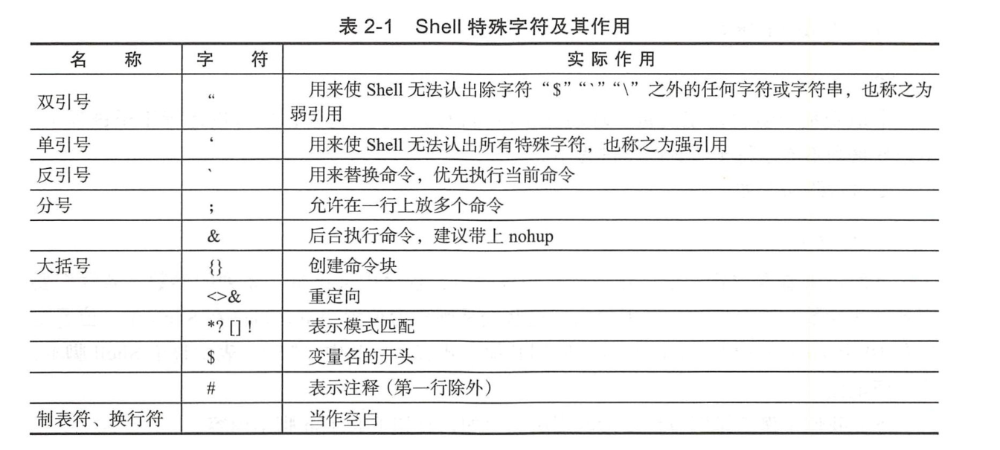

# Shell脚本在Devops下的应用


Shell脚本成为运维开发人员的“瑞士军刀”。所以不管是系统管理员，还是运维开发人员或者开发人员，掌握Shell脚本语言，对我们的工作能够起到很大的帮助作用。


## 2.1 Shell脚本的基本元素

单行注释
```bash
#!/bin/bash     //第一行
#               // 表示单行注释

```
多行注释
``` bash
:<<BLOCK
中间部分为要省略的内容
BLOCK
```

Shell脚本文件的命令解释程序

```shell
#! /bin/bash
```


## 2.2 Shell基础正则表达式

参考玩转shell脚本编程的 `正则表达式章节

[Shell中的正则表达式](https://www.jb51.net/tools/shell_regex.html )


## 2.3 Shell特殊字符


## 2.4 变量和运算符

```shell
变量名=“变量”
readonly 变量名=“变量”		#设置只读变量
echo $变量名
set 		#显示本地所有的变量
unset 		#变量名清除变量
readonly	#显示当前Shell下有哪些只读变量
```


设置环境变量，环境变量可以用于所有的子shell中，其包括编辑器、脚本和应用。

环境变量的主目标如下：

```shell
$HOME/.bash_profile(/etc/profile)
```

设置环境变量，例句如下：

```bash
export test="123"
```

查看环境变量，命令如下：

```bash
env
```

或者使用

```
export
```

变量清除命令：

```
unset 变量名
```


**内部变量**

Shell提供了丰富的内部变量，为用户的Shell编程提供支持，具体如下。

```
❑ PWD：表示当前的工作目录，其变量值等同于pwd内部命令的输出。
❑ RANDOM：每次引用这个变量时，将会生成一个均匀分布的0～32767范围内的随机整数。
❑ SCONDS：脚本已经运行的时间（秒）。
❑ PPID：当前进程的父进程的进程ID。
❑ $? ：表示最近一次执行的命令或Shell脚本的出口状态。
```


**环境变量**

```
Shell提供的主要环境变量如下所示。
❑ EDITOR：用于确定命令行编辑所用的编辑程序，通常为vim。
❑ HOME：用户主目录。
❑ PATH：指定命令的检索路径。
```

### 写入环境变量

例如，要将/usr/local/mysql/bin目录添加进系统默读的PATH变量中

```shell
PATH=$PATH:/usr/local/mysql/bin
export PATH
echo $PATH
```

Linux中含有两个重要的文件，

`/etc/profile`和`$HOME/.bash_profile`，每当系统登录时都要读取这两个文件，用来初始化系统所用到的变量，其中`/etc/profile`是超级用户所用，

`$HOME/.bash_profile`是每个用户自己独立的，可以通过修改该文件来设置PATH变量。

注意

`这种方法也只能使当前用户生效，而并非所有用户。`

如果要让所有用户都能够用到此PATH变量，则可以用vim命令打开“/etc/profile”文件，在适当位置添加“PATH=$PATH:/usr/local/mysql/bin”，然后执行“source /etc/profile”使其生效。


**位置变量的用法**

```shell
#!/usr/bin/env bash
echo "第1个参数为：" $0
echo "第2个参数为：" $1
echo "第3个参数为：" $2
echo "第4个参数为：" $3
echo "第5个参数为：" $4
```

执行结果如下:

```shell
$ ./aaa.sh 1 2 3 4 5
第1个参数为： ./aaa.sh
第2个参数为： 1
第3个参数为： 2
第4个参数为： 3
第5个参数为： 4
```

从第10个参数开始就要使用花括号将编号括起来，如“${10}”。

| 表示方法 | 描述                                   |
| -------- | -------------------------------------- |
| $n       | $1 表示第一个参数，$2 表示第二个参数 … |
| $#       | 命令行参数的个数                       |
| $0       | 当前程序的名称                         |
| $?       | 前一个命令或函数的返回码               |
| $*       | 以"参数1 参数2 …” 形式保存所有参数     |
| $@       | 以“参数1”"参数2"  … 形式保存所有参数   |
| $$       | 本程序的(进程ID号)PID                  |
| $_       | 表示上一个命令的最后一个参数           |
| $!       | 表示最后执行的后台命令的PID            |

`$*`和`$@`都是表示所有的位置参数，但是区别如下：

**相同点**：都是引用所有参数。
**不同点**：只有在双引号中体现出来。

假设在脚本运行时写了三个参数 1、2、3

` $* 等价于 “1 2 3”（传递了一个参数）`

`而$@等价于 “1” “2” “3”（传递了三个参数）`


`$#命令行参数的个数`

**关于位置参数shift的常见用法**

例如，脚本publishconf依次对后面的IP进行操作，代码如下：

```shell
./publishconf -p 192.168.11.2 192.168.11.3 192.168.11.4 192.168.11.5 192.168.11.6
```

部分代码不如

``` shell
#!/usr/bin/env bash
#usage:xxx
#scripts_name:${NAME}.sh
# author：xiaojian
if [ "$#" >=3 ]; then
    shift 1
#    echo "此次需要更新的机器IP为$@"
    for flat in $@ ; do
           echo "此次需要更新的机器IP为$flat"
           # 操作动作
    done
fi
```


## 2.5 运行、调试Shell脚本

调试Shell脚本
```shell
· -n: 不会执行该脚本，仅查询脚本语法是否有问题，并给出错误提示。
· -v：在执行脚本时，先将脚本的内容输出到屏幕上，然后执行脚本。如果有错误，也会给出错误提示。
· -x:  将执行的脚本内容输出显示到屏幕上，这是对调试很有用的参数。
```

参数-x是追踪脚本执行过程的一种非常好的方法，其可以在执行前列出所执行的所有程序段。

```
bash -x 调试Shell脚本，bash会先打印出每行脚本，再打印出每行脚本的执行结果，如果只调试其中几行脚本，
可以采用“set -x”和“set +x”把要测试的部分包含进来。示例代码如下：

set -x
脚本部分内容
set +x
```


set命令最大的优点是：

与“bash -x”相比，“set -x”可以缩小调试的作用域，这个功能在工作中是非常有用的功能，可以帮助我们调试变量，找出Bug的位置并打印。


**退出或出口状态**

在Shell脚本中，可以利用`"exit[n]"` n在0~255范围之内。向脚本的父进程返回一个数值为n的shell脚本出口状态。

如果Shell脚本是以不带参数的exit语句结束的，则Shell脚本的出口状态就是脚本最后一条命令的出口状态。

在Unix中，为了测试一个命令或Shell脚本的执行结果，`"$?"`内部变量将返回执行执行的最后一条命令的出口状态。其中0位正确值，其他非零为错误值。


## 2.6 test语句

#### 2.6.1 文件测试运算符

下面是文件属性测试表达式。

```shell
❑ -e file：如果给定的文件存在，则条件测试的结果为真。

❑ -r file：如果给定的文件存在，且其访问权限是当前用户可读的，则条件测试的结果为真。

❑ -w file：如果给定的文件存在，且其访问权限是当前用户可写的，则条件测试的结果为真。

❑ -x file：如果给定的文件存在，且其访问权限是当前用户可执行的，则条件测试的结果为真。

❑ -s file：如果给定的文件存在，且其大小大于0，则条件测试的结果为真。

❑ -f file：如果给定的文件存在，且是一个普通文件，则条件测试的结果为真。

❑ -d file：如果给定的文件存在，且是一个目录，则条件测试的结果为真。

❑ -L file：如果给定的文件存在，且是一个符号链接文件，则条件测试的结果为真（注意：此处的L为大写）。

❑ -c file：如果给定的文件存在，且是字符特殊文件，则条件测试的结果为真。

❑ -b file：如果给定的文件存在，且是块特殊文件，则条件测试的结果为真。

❑ -p file：如果给定的文件存在，且是命名的管道文件，则条件测试的结果为真。
```


文件测试运算符常见代码举例如下：

``` shell
BACKDIR=/data/backup

[ -d ${BACKDIR} ] || mkdir -p ${BACKDIR}
[ -d ${BACKDIR}/${DATE} ] || mkdir -p ${BACKDIR}/${DATE}
[ ! -d ${BACKDIR}/${OLDDATE} ] || rm -rf ${BACKDIR}/${OLDDATE}
```


#### 2.6.2 字符串测试运算符

```
❑ -z str：如果给定的字符串的长度为0，则条件测试的结果为真。
❑ -n str：如果给定的字符串的长度大于0，则条件测试的结果为真。要求字符串必须加引号。
❑ s1=s2：如果给定的字符串s1等同于字符串s2，则条件测试的结果为真。
❑ s1! =s2：如果给定的字符串s1不等同于字符串s2，则条件测试的结果为真。
❑ s1<s2，如果给定的字符串s1小于字符串s2，则条件测试的结果为真。例如：if[[ "$a"<"Sb" ]]注意，if[ "$a"/<"$b"]，在单方括号情况下，字符“<”和“>”前须必加转义符号“\”。

❑ s1>s2：若给定的字符串s1大于字符串s2，则条件测试的结果为真。
```

在比较字符串的test语句中，变量或字符串表达式的前后一定要加双引号。


#### 2.6.3 整数值测试运算符

整数测试表达式为

```
“-eq”（等于）
“-ne”（不等于)
“-gt”（大于）
“-lt”（小于）
“-ge”（大于等于）
“-le”（小于等于）
```


#### 2.6.4 逻辑运算符

Shell中的逻辑运算符，具体说明如下所示。

```
❑ (expression)：用于计算括号中的组合表达式，如果整个表达式的计算结果都为真，则测试结果也为真。

❑! exp：可对表达式进行逻辑非运算，即对测试结果求反。例如“test ! -ffile1”。

❑ 符号-a或&&：表示逻辑与运算。

❑ 符号-o或||：表示逻辑或运算。
```


## 2.7 Shell中的自定义函数


自定义语法比较简单，语法结构如下：

```shell
function 函数名() {
	action;
	[return 数值;]
}
```

❑ 自定义函数既可以带function函数名()定义，也可以直接用函数名()定义，不带任何参数。

❑ 参数返回时，可以显式加return返回；如果不加，则将以最后一条命令的运行结果作为返回值。return后跟数值，取值范围为0～255。


Shell不像Python及Go语言，其没有OOP的概念，因此Shell肯定也是没有Class（类）的，所以我们若想以Class的方式来封装多个Shell函数，那是不可能实现的。但是我们在编写Shell需求工作时会有一种很常见的需求.

现在为了减少代码复用，各业务功能需求就是多个函数的组合，具体应该怎么实现呢？这里其实可以结合case语句来实现。

脚本名称为`automanage.sh`。部分内容如下：

```shell
--mirror-interac)
	rg_Checkrelease
	rg_RebootCheck && rg_BasicCheck && rg_InitBasic && rg_mkpart && rg_mkfs_inerac && rg_info 0 '完成'
```

事实上我们执行以下命令：

```
automanage.sh --mirror-interac
```

此命令会依次调用rg_ChkRelease()、rg_RebootCheck()、rg_BasicCheck()、rg_InitBasic()、rg_mkpart()、rg_mkfs_interac()及rg info一系列函数，实现工作需求。

## 2.8 Shell中的字符串截取

```
| Expression                                | Meaning                                                      |
| ----------------------------------------- | ------------------------------------------------------------ |
| ${#string}                              | $string 的长度                                               |
|                                           |                                                              |
| ${string:position}                   | 在 $string 中, 从位置 $position 开始提取子串                 |
| ${string:position:length}               | 在 $string 中, 从位置 $position 开始提取长度为 $length 的<br/>子串 |
|                                           |                                                              |
| ${string#substring}                        | 从变量 $string 的开头, 删除最短匹配 $substring 的子串        |
| ${string##substring}                      | 从变量 $string 的开头, 删除最长匹配 $substring 的子串        |
| ${string%substring}                       | 从变量 $string 的结尾, 删除最短匹配 $substring 的子串        |
| ${string%%substring}                    | 从变量 $string 的结尾, 删除最长匹配 $substring 的子串        |
|                                           |                                                              |
| ${string/substring/replacement}         | 使用 $replacement , 来代替第一个匹配的 $substring            |
| ${string//substring/replacement}        | 使用 $replacement , 代替 所有 匹配的 $substring              |
| ${string/#substring/replacement}        | 如果 $string 的 前缀 匹配 $substring , 那么就<br/>用 $replacement 来代替匹配到的 $substring |
| ${string/%substring/replacement}        | 如果 $string 的 后缀 匹配 $substring , 那么就<br/>用 $replacement 来代替匹配到的 $substring |
|                                           |                                                              |
| expr match "$string" '$substring'          | 匹配 $string 开头的 $substring *的长度                       |
| expr "$string" : '$substring'                   | 匹配 $string 开头的 $substring *的长度                       |
| expr index "$string" $substring             | 在 $string 中匹配到的 $substring 的第一个字符出现的位置      |
| expr substr $string $position $length   | 在 $string 中从位置 $position 开始提取长度为 $length 的子<br/>串 |
| expr match "$string" '\($substring\)'     | 从 $string 的开头位置提取 $substring *                       |
| expr "$string" : '\($substring\)'              | 从 $string 的开头位置提取 $substring *                       |
| expr match "$string" '.*\($substring\)'  | 从 $string 的结尾提取 $substring *                           |
| expr "$string" : '.*\($substring\)'           |                                                              |
```


## 2.9 Shell参数替换和扩展

```
| Expression        | Meaning                                                      |
| ----------------- | ------------------------------------------------------------ |
| ${var}          | 变量 var 的值, 与 $var 相同                                  |
|                   |                                                              |
| ${var-DEFAULT}  | 如果 var 没有被声明, 那么就以 $DEFAULT 作为其值 *            |
| ${var:-DEFAULT} | 如果 var 没有被声明, 或者其值为空, 那么就以 $DEFAULT 作为其值 * |
|                   |                                                              |
| ${var=DEFAULT}  | 如果 var 没有被声明, 那么就以 $DEFAULT 作为其值 *            |
| ${var:=DEFAULT} | 如果 var 没有被声明, 或者其值为空, 那么就以 $DEFAULT 作为其值 * |
|                   |                                                              |
| ${var+OTHER}    | 如果 var 声明了, 那么其值就是 $OTHER , 否则就为null字符串    |
| ${var:+OTHER}   | 如果 var 被设置了, 那么其值就是 $OTHER , 否则就为null字符串  |
|                   |                                                              |
| ${var?ERR_MSG}  | 如果 var 没被声明, 那么就打印 $ERR_MSG *                     |
| ${var:?ERR_MSG}  | 如果 var 没被设置, 那么就打印 $ERR_MSG *                     |
|                   |                                                              |
| ${!varprefix*}  | 匹配之前所有以 varprefix 开头进行声明的变量                  |
| ${!varprefix@}  | 匹配之前所有以 varprefix 开头进行声明的变量                  |
```


## 2.10 Shell应用于Devops开发中音掌握的系统知识点


### 2.10.1 Shell多进程并发

1）进程。若采用这种方法，则每个逻辑控制流都是一个进程，由内核来调度和维护。因为进程有独立的虚拟地址空间，因此要想与其他流进行通信，控制流必须使用进程间通信（IPC）。


2）I/O多路复用。若采用这种形式的并发，则应用程序在一个进程的上下文中显式地调度它们自己的逻辑流。逻辑流被模拟为“状态机”，数据到达文件描述符之后，主程序显式地从一个状态转换到另一个状态。因为程序是一个单独的进程，所以所有的流都共享一个地址空间。


3）线程。线程是运行在一个单一进程上下文中的逻辑流，由内核进行调度。线程可以看作是进程和I/O多路复用的合体，像进程一样由内核调度，像I/O多路复用一样共享一个虚拟地址空间。


默认情况下，Shell脚本中的命令是串行执行的，必须等到前一条命令执行完毕之后才执行接下来的命令，
但是如果有一大批的命令需要执行，而且相互之间没有影响的情况下，此时就要使用命令的并发执行了。

正常的程序`echo_hello.sh`代码如下所示：
```shell
#!/usr/bin/env bash
#usage:xxx
#scripts_name:${NAME}.sh
# author：xiaojian
for (( VAR = 0; VAR < 5; VAR++ )); do
    {
    sleep 3
    echo "hello,world" >> aa & echo "done!"
    }
done

cat aa |wc -l
rm aa
```
使用time计算脚本的执行时间，命令结果如下：
```
$ time sh echo_hello.sh
done!
done!
done!
done!
done!
5

real    0m18.873s
user    0m0.091s
sys     0m0.214s
```
并发执行的代码如下：
``` shell
#!/usr/bin/env bash
#usage:xxx
#scripts_name:${NAME}.sh
# author：xiaojian
for (( VAR = 0; VAR < 5; VAR++ )); do
    {
    sleep 3
    echo "hello,world" >> aa & echo "done!"
    } &
done
# wait 命令有一个很重要的用途就是在Shell的并发编程中，可以在Shell脚本中启动多个后台进程（使用“&”），然后调用wait命令，等待所有后台进程都运行完毕，
# shell脚本再继续向下执行，
wait            
cat aa |wc -l
rm aa

```
使用time计算脚本执行时间，如下：
``` shell
$ time sh echo_hello2.sh
done!
done!
done!
done!
done!
5

real    0m5.689s
user    0m0.062s
sys     0m0.244s

```
当多个进程可能会对同样的数据执行操作时，这些进程需要保证其他进程没有在操作，
以免损坏数据，通常，这样的进程会使用一个“锁文件”，也就是创建一个文件告诉别的进程之间在运行，
如果检测到这个文件存在，就认为操作同样数据的进程在工作。这样做有个问题，当进程不小心意外死亡了，没有清理掉那个文件，
只能由用户手工的去清理了。

###  2.10.2 Shell脚本中执行另一个Shell脚本

在运行Shell脚本的时候，可采用下面两种方式来调用外部的脚本，即exec方式和source方式。

（1）exec方式

> 使用exec方式来调用脚本，被执行的脚本会继承当前Shell的环境变量。但事实上，exec产生了新的进程，**其会占用主Shell的进程资源并替换脚本内容**，继承原主Shell的PID号，即原主Shell剩下的内容不会再执行。

（2）source方式

> 使用source或者“. ”来调用外部脚本，不会产生新的进程继承当前Shell环境变量，而且被调用的脚本运行结束之后，**它所拥有的环境变量和声明变量会被当前Shell保留，这点类似于将调用脚本的内容复制过来直接执行，执行完毕后原主Shell将继续运行。**


（3）fork方式

> 直接运行脚本，会以当前shell为父进程，产生新的进程，并且继承主脚本的环境变量和声明变量。执行完毕后，主脚本不会保留其环境变量和声明变量。


总结：这样来看fork最灵活，source次之，exec最诡异。


*工作中推荐使用source的方式来调用外部的Shell脚本*，该方式稳定性高，不会出现一些诡异的问题和bug，从而影响主程序的业务逻辑（大家也可以参考下Linux系统中的Shell脚本，如/etc/init.d/network等，基本上采用的都是这种处理方式）。

### 2.8.3  flock文件锁

Linux中的例行性工作排程Crontab会定时执行一些脚本，但脚本的执行时间往往会无法控制，若脚本执行时间过长，则可能会导致上一次任务的脚本还没执行完毕，下一次任务的脚本又开始执行了。这种情况下可能会出现一些并发问题，严重时还会导致出现脏数据、性能瓶颈的恶性循环。

使用flock建立排它锁可以规避这个问题，如果一个进程对某个任务加持了独占锁（排他锁），则其他进程会无法加锁，可以选择等待超时或马上返回。

脚本`file_lock.sh`的内容如下：

```shell
#!/bin/bash
echo "----------------------------------"
echo "start at $(date "+%Y-%m-%d %H:%M:%S")...."
sleep 100s
echo "finished at $(date "+%Y-%m-%d %H:%M:%S")...."
```

每隔一分钟执行一次该脚本，并将输出信息写入到/tmp/test_tmp.log，下面简单介绍下flock在这里用到的选项，具体如下所示。

❑ -x, --exclusive：获得一个独占锁。

❑ -n, --nonblock：如果没有立即获得锁，则直接失败而不是等待。

❑ -c, --command：在Shell中运行一个单独的命令。

```shell
[root@localhost home]# crontab -l
*/1  * * * * flock -xn /dev/shm/test.lock -c "sh /home/file_lock.sh >> /tmptest_tmp.log"
```

输出日志如下：

```shell
tail -f /tmptest_tmp.log  -f
----------------------------------
start at 2020-06-10 13:26:01....
finished at 2020-06-10 13:28:21....
----------------------------------
start at 2020-06-10 13:29:01....
finished at 2020-06-10 13:30:41....
```


## 2.10 什么是并行（parallellism）

目前大部分语言都能瞒住并发执行，当多核CPU出现后，多CPU的场景下开始产生并行的概念。

（1）总体概念
``` 
在单CPU系统中，系统调度在某一时刻只能让一个线程运行，虽然这种调试机制具有多种形式（大多数是以时间片轮询为主），
但无论如何，需要通过不断切换需要运行的线程让其运行的方式就称为并发(concurrent)。

在多CPU系统中，可以让两个以上的线程同时运行，这种可以让两个以上的线程同时运行的方式称为并行(parallel)。
```

CPU到了多核时代，那么就出现了新的概念：并行。

并行是真正细粒度上的同时进行，即同一时间点上同时发生着多个并发；更加确切并且简单地讲就是，每个CPU上运行一个程序，以达到同一时间点上各个CPU上均在运行一个程序。

**并行和并发的具体区别**

1）并行是指两个或者多个事件在同一时刻发生，而并发是指两个或多个事件在同一时间间隔发生。

2）并行是在不同实体上的多个事件，而并发是在同一实体上的多个事件。

3）在一台处理器上“同时”处理多个任务，在多台处理器上同时处理多个任务。


## 2.11 什么是管道

管道的特点：

```
1）管道是半双工的，数据只能向一个方向流动；双方需要进行通信时，需要建立起两个管道。

2）只能用于父子进程或者兄弟进程之间（具有亲缘关系的进程）。

3）单独构成一种独立的文件系统：管道对于管道两端的进程而言，就是一个文件，但它不是普通的文件，它不属于某种文件系统，而是自立门户，单独构成一种文件系统，并且只存在于内存之中。

4）数据的读出和写入：一个进程向管道中写的内容被管道另一端的进程读出。写入的内容每次都添加在管道缓冲区的末尾，并且每次都是从缓冲区的头部读出数据。
```


示例代码

```
echo "hello"| cat 
```

需要注意以下几点。

1）管道命令只处理前一个命令的正确输出，不处理错误输出。

2）管道右边的命令，必须能够接收标准输入流命令才行。

3）管道触发两个子进程执行“|”两边的程序。


