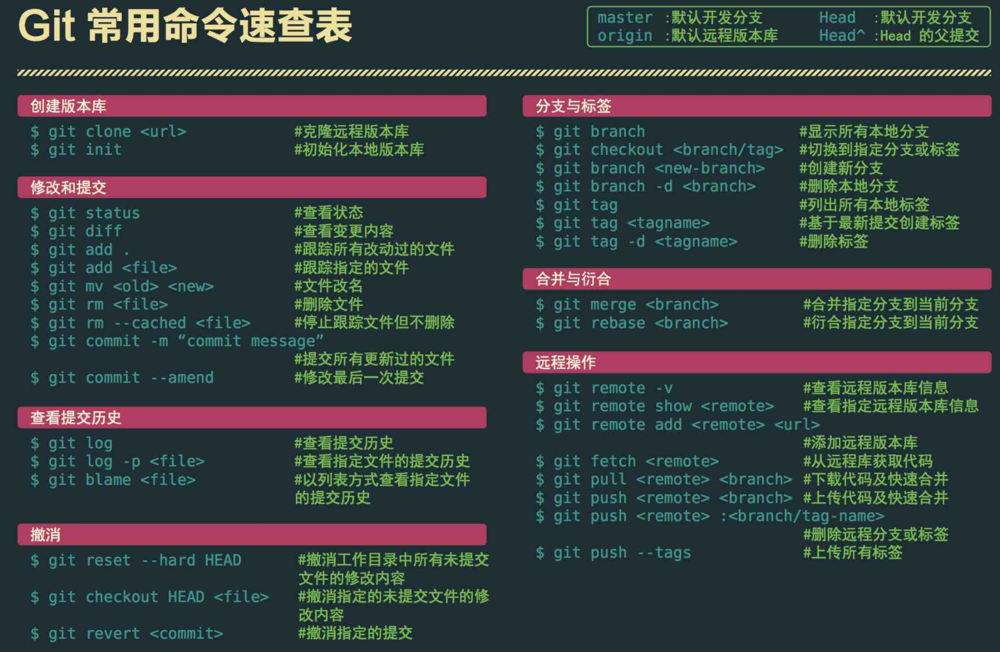
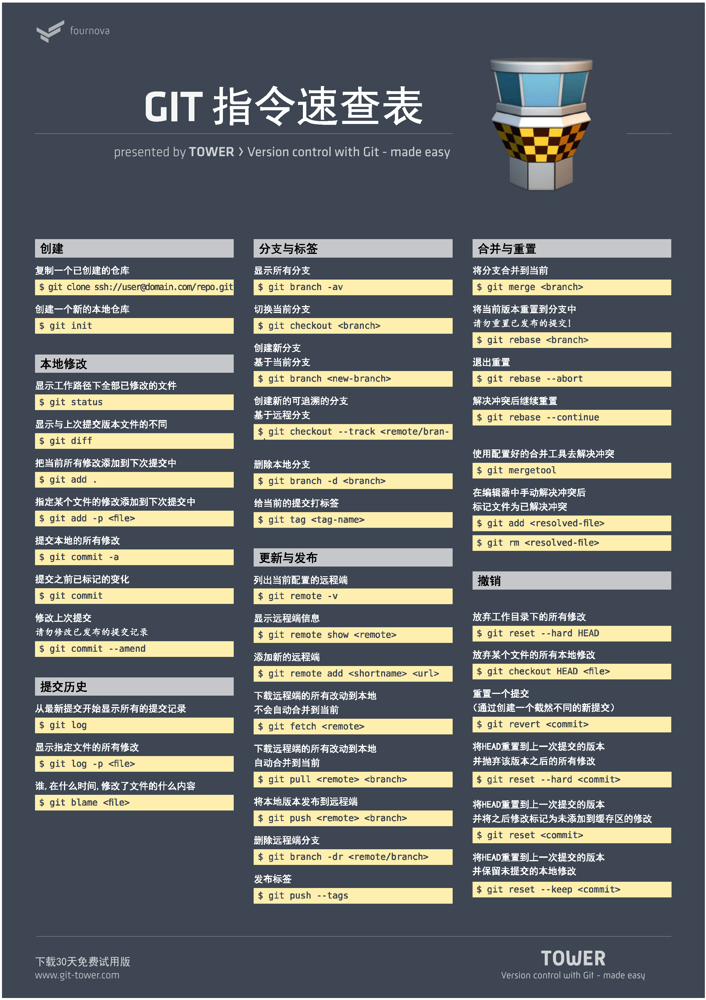

# Git仓库的使用

## 安装git
``` bash
$ sudo yum install git-all           #Centos7
$ sudo apt-get install git-all      #Ubuntu
```

## 创建新的 git 仓库
``` bash
$ mkdirMyProject
$ cdMyProject
$ git init


# 如果你想让远程用户也能够访问这个仓库，需要使用 update-server-info 命令：
$ git update-server-info

```

## 克隆远程 git 仓库
git clone 命令可以将文件从远程站点复制到本地系统中。远程站点可以是匿名仓库（如GitHub），也可以是需要用户名和密码登录的系统。
```bash
从已知的远程站点（如GitHub）克隆：
$ git clone http://github.com/ProjectName


从需要用户名和密码的站点（可能是你自己的服务器）克隆：
$ git clone clif@172.16.183.130:gitTest
```

## 使用 git 添加与提交变更
``` bash
git add 命令可以将工作代码（working code）中的变更添加到暂存区。该命令并不会改变仓库内容，它只是标记出此次变更，将其加入下一次提交中：

$ vim SomeFile.sh
$ git add SomeFile.sh

如果你希望在提交所有变更的时候不会遗漏某一个，最好在每次编辑之后都执行 git add 。
$ echo "my test file" >testfile.txt
$ git add testfile.txt

也可以一次添加多个文件：
$ git add *.c

git commit 命令可以将变更提交至仓库：
$ vim OtherFile.sh
$ git add OtherFile.sh
$ git commit


以利用 -a 和 -m 选项缩短add/commit操作的输入。
  -a ：在提交前加入新的代码。
  -m ：指定一条信息，不进入编辑器。
git commit -am "Add and Commit all modified files."
```

## 使用 git 创建与合并分支
``` bash
切换到之前创建的分支：
$ git checkout OldBranchName

可以使用 checkout 的选项 -b 来创建新的分支：
$ git checkout -b MyBranchName
Switched to a new branch 'MyBranchName'

该命令将当前工作分支定义为 MyBrachName 。它将 MyBrachName 的指针指向前一个分支。随着
变更的添加和提交，该指针会离最初的分支越来越远。


git branch 命令可以查看分支：
$ git branch

* MyBranchName
master
当前分支由星号（*）着重标出。
```

## 实战演练
``` bash
创建了新分支，添加并提交过变更之后，切换回起始分支，然后使用 git merge 命令将变更合并入新分支：

$ git checkout originalBranch
$ git checkout -b modsToOriginalBranch

#  编辑，测试
$ git commit -a -m "Comment on modifications to originalBranch"
$ git checkout originalBranch
$ git merge modsToOriginalBranch


(2) 工作原理
第一个 git checkout 命令检索起始分支的快照。第二个 git checkout 命令将当前的工作
代码标记为新的分支。
git commit 命令移动新分支的快照指针，使其远离起始分支。第三个 git checkout 命令
将代码恢复到进行编辑和提交之前的初始状态。
git merge 命令将起始分支的快照指针移动至正在合并的分支快照。


(3) 补充内容
如果合并完分支之后不再需要该分支，可以使用选项 -d 进行删除：
$ git branch -d MyBranchName
```

## 新建仓库后的操作
```bash
Git 全局设置
git config --global user.name "Administrator"
git config --global user.email "admin@example.com"


创建一个新仓库
git clone ssh://git@192.168.1.131:10022/root/lenav.git
cd lenav
git switch -c main
touch README.md
git add README.md
git commit -m "add README"
git push -u origin main


推送现有文件夹
cd existing_folder
git init --initial-branch=main
git remote add origin ssh://git@192.168.1.131:10022/root/lenav.git
git add .
git commit -m "Initial commit"
git push -u origin main


推送现有的 Git 仓库
cd existing_repo
git remote rename origin old-origin
git remote add origin ssh://git@192.168.1.131:10022/root/lenav.git
git push -u origin --all
git push -u origin --tags
```


## 一个完整的git提交流程

### 1.本地配置

- 提交用户信息

```bash
git config --global user.name "username"
git config --global user.email "user@email.com"
```

- GPG 配置

参考：[GPG 验证提交](https://www.chenshaowen.com/blog/git-skills-you-do-not-notice.html#4-GPG-验证提交)


### 2.克隆代码

- 首先 fork 原仓库
- 克隆 fork 的仓库代码

```bash
git clone https://github.com/yourname/django-xss-cleaner.git
```

- 添加原仓库

```bash
git remote add upstream https://github.com/shaowenchen/django-xss-cleaner.git
```


- 查看本地配置的远程源

```bash
git remote -v

origin xxx
upstream xxx
```


### 3.日常开发


- 拉取最新代码

```bash
git fetch upstream
```

- [可选]非 master 分支集成时操作

```bash
git checkout -b IntegratedBranch upstream/IntegratedBranch
```


非 master 分支集成，下面使用 IntegratedBranch 替换 master 即可。

- 切换集成分支

```bash
git checkout master
```

- Rebase 更新到自己的仓库

```bash
git rebase upstream/master
```

- 新建一个开发分支

```bash
git checkout -b feature_1 master
```

- 开发

coding


- 提交代码

```bash
git add .
git commit -s -m "message"
```

这里如果忘记加 `-s`，会缺少签名信息。可以通过 `git commit --amend --no-edit -s` 进行补救。


- 提交 PR

选择将自己的 feature_1 分支合并到原仓库的 master 分支


- 评论、修改，来回切磋，继续提交

```bash
git add .
git commit -s -m "message"
```


- Rebase PR 中的 Commit 记录，仅留一条

```bash
git rebase -i HEAD~2
```

进入交互模式后，合并之前的两个 Commit 记录，保留第一个 pick，其他改成 f 或 s 。多条 Commit 时，将 2 修改为相应数值。


- 强制推送

```bash
git push -f feature_1
```

由于远程已经有相关的 commit 记录，这里需要强制推送。

- PR 合并之后，删除开发分支


如果没有合并直接删除远端开发分支，会导致 PR 关闭。

```bash
git checkout master
git branch -D feature_1
git push origin :feature_1
```


参考文献：

https://www.chenshaowen.com/blog/a-complete-git-submission-process.html


## Git常用操作查询图1



## Git常用操作查询图2


