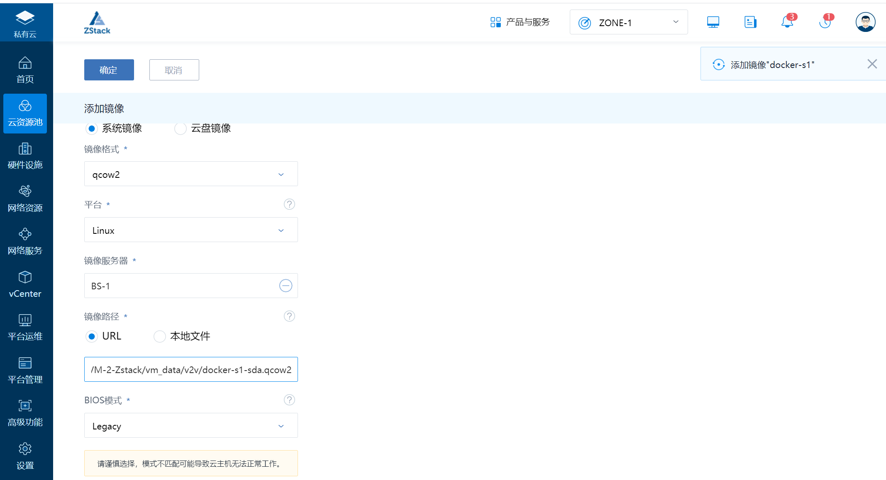

# 镜像转换V2V


## P2V工具

wget [http://oirase.annexia.org/virt-p2v/RHEL-7.3/virt-p2v-1.32.7-2.el7.iso](javascript:void())


P2V、V2V迁移总结

https://blog.51cto.com/wangzc/2133439

https://blog.51cto.com/h11345/1565345


## qemu-img工具转换镜像格式

https://support.huaweicloud.com/bestpractice-ims/ims_bp_0030.html


简单看看几种镜像的转化：

## VMware转换为KVM

## vmdk转换为qcow2

```
 [root@localhost migration]# qemu-img info SLES11SP1-single.vmdk 
 image: SLES11SP1-single.vmdk 
 file format: vmdk 
 virtual size: 20G (21474836480 bytes) 
 disk size: 3.9G 

 [root@localhost migration]# qemu-img convert -f vmdk -O qcow2 SLES11SP1-single.vmdk SLES11SP1-single.img 

 [root@localhost migration]# qemu-img info SLES11SP1-single.img 
 image: SLES11SP1-single.img 
 file format: qcow2 
 virtual size: 20G (21474836480 bytes) 
 disk size: 3.9G 
 cluster_size: 65536
```


virt-v2v工具来做迁移，实现将VMware ESX中的一个客户机迁移到KVM上。利用virt-v2v
迁移VMware客户机的命令行示例如下：

kvm安装命令支持包

```
mkdir -p /data/vmfs
virsh pool-define-as vmdisk --type dir --target /data/vmfs
virsh pool-build vmdisk
virsh pool-autostart vmdisk
virsh pool-start vmdisk
```

创建ESXI 验证文件

```
vim /root/.netrc
machine 192.168.1.58 login root password 123456
chmod 0600 ~/.netrc
```

```
// 测试KVM连接ESXI
# virsh  -c esx://root@192.168.1.58?no_verify=1 list --all
Enter root's password for 192.168.1.58:
 Id    Name                           State
----------------------------------------------------
 1     Gitee-GO-k8s-master1           running
 3     Gitee-GO-k8s-node2             running
 4     Gitee-GO-k8s-node1             running
 22    centos7                        running
 -     docker-s1                      shut off


// 直接迁移转换exsi
virt-v2v -ic esx://root@192.168.1.58/?no_verify=1 -os vmdisk -of qcow2 -b br0 docker-s1

// 直接迁移转换vcenter
virt-v2v -ic vpx://administrator%40vsphere.local@192.168.1.40/OSChina/192.168.1.58?no_verify=1 docker-s1 -o libvirt -of qcow2


// 如果直接迁移报错了，就需要将vmdk复制到本地进行手动转换的方式进行迁移，硬盘文件+xml文件创建虚拟机


具体实现方式如下：
// 迁移到本地
# virt-v2v-copy-to-local -ic esx://root@192.168.1.58/?no_verify=1 docker-s1
  % Total    % Received % Xferd  Average Speed   Time    Time     Time  Current
                                 Dload  Upload   Total   Spent    Left  Speed
  1  100G    1 1096M    0     0  38.6M      0  0:44:06  0:00:28  0:43:38 44.1M
  
  
// 本地转换
# mkdir ./out2
# virt-v2v -i libvirtxml docker-s1.xml -o local --os  ./out2/ --of qcow2
[   0.0] Opening the source -i libvirtxml docker-s1.xml
[   0.0] Creating an overlay to protect the source from being modified

// 进入到out2输出目录，修改xml文件
// 这里首先自定义了一个桥 br1（之前已创建）

//重启网卡
# virsh iface-bridge br_em1 br1

# vim centos7-2.xml   修改桥接
 <interface type='bridge'>
      <mac address='fa:be:ba:da:5d:00'/>
      <source bridge='br_em1'/>
      <target dev='vnic1.0'/>
      <model type='virtio'/>
      <driver name='vhost' txmode='iothread' ioeventfd='on' event_idx='off' queues='2' rx_queue_size='256' tx_queue_size='256'/>
      <mtu size='1500'/>
      <address type='pci' domain='0x0000' bus='0x00' slot='0x03' function='0x0'/>
    </interface>


// 创建、启动虚拟机
# virsh define docker-s1.xml
# virsh start docker-s1
```


### 总结

使用virt-v2v-copy-to-local这个工具来做迁移

```
1.前提：关闭vm虚拟机
virt-v2v-copy-to-local -ic esx://root@192.168.20.158/?no_verify=1 es-node2-192.168.20.105

* exsi地址 -ic esx://root@192.168.20.158/?no_verify=
* 虚拟机名称  es-node2-192.168.20.105


将迁移后的虚拟机文件和配置文件通过virt-v2v工具转化成kvm可以识别的虚拟机文件和xml配置文件
2.virt-v2v -i libvirtxml es-node2-192.168.20.104.xml -o local -os /var/kvm/images/ -of qcow2


将xml跑配置文件转移到kvm默认配置文件目录下
3.mv /var/kvm/images/es-node2-192.168.20.105.xml /etc/libvirt/qemu


通过xml文件注册虚拟机
4.virsh define /etc/libvirt/qemu/es-node2-192.168.20.105.xml

5.需要修改下kvm虚拟机配置文件。目前需要修改下虚拟机使用的桥接网卡一般将桥接网卡改成br0
virsh edit es-node2-192.168.20.105

6.虚拟机启动后需要修改下虚拟机网卡名称 ifcfg-ens192
virsh start es-node2-192.168.20.105
通过ip a 获取网卡的名称，然后/etc/sysconfig/network-scripts/ifcfg-ens192 改成ip a 获取到的网 络文件
```


### 转换格式

迁移VMware的镜像到zstack主要使用到两款工具：

- vmware-vdiskmanager（VMware自带工具，精简磁盘）
- qemu-img（镜像转换格式）

#### 1. 精简磁盘

命令案例如下：

```
vmware-vdiskmanager -r D:\CentOS64\CentOS-64.vmdk -t 0 D:\CentOS64\CentOS-64-new.vmdk
```

vmware-vdiskmanager使用：

```
用法：vmware-vdiskmanager.exe选项<disk-name> | <mount-point>


脱机磁盘操作实用程序
  操作，一次只能指定一个：
     -c：创建磁盘。必须有其他创建选项
                            被指定。仅本地虚拟磁盘可以
                            创建。
     -d：对指定的虚拟磁盘进行碎片整理。仅有的
                            本地虚拟磁盘可能已碎片整理。
     -k：收缩指定的虚拟磁盘。仅本地
                            虚拟磁盘可能会缩小。
     -n <源磁盘>：重命名指定的虚拟磁盘；需要
                            指定目标磁盘名称。仅本地虚拟
                            磁盘可能会重命名。
     -p：准备由指定的已挂载的虚拟磁盘
                            缩小的安装点。
     -r <源磁盘>：转换指定的磁盘；需要指定
                            目标磁盘类型。对于本地目标磁盘
                            必须指定磁盘类型。
     -x <新容量>：将磁盘扩展到指定容量。仅有的
                            本地虚拟磁盘可能会扩展。
     -R：检查稀疏虚拟磁盘的一致性并尝试
                            修复任何错误。
     -e：检查磁盘链的一致性。
     -D：使磁盘可删除。仅应在磁盘上使用
                            已从另一产品复制的文件。
     -U：删除/取消链接单个磁盘链接。

  其他选项：
     -q：不记录消息

  用于创建和转换的其他选项：
     -a <适配器> ：（仅与-c一起使用）适配器类型
                            （ide，buslogic，lsilogic）。将lsilogic传递给其他适配器
     -s <大小>：虚拟磁盘的容量
     -t <磁盘类型>：磁盘类型标识

  磁盘类型：
      0：单个可增长虚拟磁盘
      1：可增长的虚拟磁盘拆分为多个文件
      2：预分配的虚拟磁盘
      3：将预分配的虚拟磁盘拆分为多个文件
      4：预分配的ESX型虚拟磁盘
      5：针对流进行了优化的压缩磁盘
      6：精简配置的虚拟磁盘-ESX 3.x及更高版本

     可以以扇区，KB，MB或GB来指定容量。
     
     可接受范围：
                           ide / scsi适配器：[1MB，8192.0GB]
                           buslogic适配器：[1MB，2040.0GB]
        例1：vmware-vdiskmanager.exe -c -s 850MB-助手-t 0 myIdeDisk.vmdk
        例2：vmware-vdiskmanager.exe -d myDisk.vmdk
        例3：vmware-vdiskmanager.exe -r sourceDisk.vmdk -t 0 destinationDisk.vmdk
        例4：vmware-vdiskmanager.exe -x 36GB myDisk.vmdk
        例5：vmware-vdiskmanager.exe -n sourceName.vmdk destinationName.vmdk
        例6：vmware-vdiskmanager.exe -k myDisk.vmdk
        例7：vmware-vdiskmanager.exe -p <挂载点>
              （首先需要在<mount-point>挂载虚拟磁盘）
```


#### 2. 转换格式

命令案例如下：

```
qemu-img convert -f vmdk -O qcow2 CentOS-64-new.vmdk CentOS-64-new.qcow2
## -f 指定文件格式
## -o 需要转成的格式

```

检查上一步精简后的镜像是否存在问题，使用如下命令：

```
qemu-img info CentOS-64-new.vmdk
## 检查镜像完整性
```

主要流程如下：

```
首先安装
yum install qemu-img –y

qemu-img info source-name.vmdk 查看虚拟机信息
qemu-img info Ubuntu-64-bit_12.04_EJBCA.vmdk

转换虚拟机格式，将vmdk转换为qcow2
qemu-img convert -f vmdk -O qcow2 source-name.vmdk target-name.qcow2

转换虚拟机定义文件
vmware2libvirt -f Metasploitable.vmx > Metasploitable.xml

KVM中定义虚拟机
virsh -c qemu://system define Metasploitable.xml

打开KVM虚拟机管理软件
sudo virt-manager
```


#### 3. 导入

qcow2为安装好的系统打包成的镜像，qcow2镜像格式直接导入创建云主机就可以了，无需在进行系统安装。


参考文献：

https://www.cnblogs.com/she11s/p/14587920.html


https://blog.csdn.net/tantexian/article/details/42677427

https://blog.csdn.net/annita2019/article/details/108758953?utm_medium=distribute.pc_relevant.none-task-blog-2%7Edefault%7EBlogCommendFromMachineLearnPai2%7Edefault-10.control&depth_1-utm_source=distribute.pc_relevant.none-task-blog-2%7Edefault%7EBlogCommendFromMachineLearnPai2%7Edefault-10.control


### windows迁移流程

window2012、window2016最终可行的方案是下面这个流程：
1.使用qemu-img将vmdk文件转换成qcow2文件

2.通过图形化界面的virt-manager打开这个文件为虚拟机

3.添加软盘设备

4.添加virtio格式的硬盘

5.启动虚拟机，更新网卡驱动，新磁盘的驱动

6.关机，删除临时磁盘，将源磁盘格式改为virtio格式


具体过程如下：

https://blog.csdn.net/qq_33317586/article/details/85613254?ops_request_misc=%257B%2522request%255Fid%2522%253A%2522162080602816780269825776%2522%252C%2522scm%2522%253A%252220140713.130102334.pc%255Fall.%2522%257D&request_id=162080602816780269825776&biz_id=0&utm_medium=distribute.pc_search_result.none-task-blog-2~all~first_rank_v2~rank_v29-12-85613254.pc_search_result_before_js&utm_term=ESXI+%E8%BF%81%E7%A7%BB%E8%87%B3KVM+%28V2V%E8%BF%81%E7%A7%BB%29&spm=1018.2226.3001.4187


参考文献：

https://blog.csdn.net/minxihou/article/details/52950125

https://myfirstwon.com/esxi-kvm/

https://blog.csdn.net/zstack_org/article/details/90082062

https://www.cnblogs.com/deelaaay/p/14138751.html


**Centos7系统下KVM虚拟化Migration(06)--企业迁移案例**

https://blog.csdn.net/weixin_48504920/article/details/106662490?spm=1001.2014.3001.5502

**Centos7系统下KVM虚拟化Migration(07)--企业迁移案例**

https://blog.csdn.net/weixin_48504920/article/details/106662493?spm=1001.2014.3001.5502

**Centos7系统下KVM虚拟化Migration(08)--企业迁移案例**

https://blog.csdn.net/weixin_48504920/article/details/106662416?spm=1001.2014.3001.5502


**ESXI 迁移至KVM (V2V迁移)**

参考文献：
https://www.cnblogs.com/clsn/p/8510670.html


## Kvm转换为vmdk

https://blog.csdn.net/weixin_48504920/article/details/106662416?spm=1001.2014.3001.5502


## qcow2转换为raw

```bash
~$ qemu-img convert -O qcow2 image-raw.raw image-raw-converted.qcow
```


### raw格式和qcow2格式的转化

1. raw –> qcow2

   ```
   qemu-img convert -f raw -O qcow2 centos.raw centos.qcow2
   ```

2. qcow2 –> raw

   ```
   qemu-img convert -f qcow2 -O raw centos.qcow2 centos.raw
   ```


## raw转换为qcow2

```shell
# 参数说明
[root@kvm data]# qemu-img  --help |grep convert 
qemu-img convert [-f fmt] [-O output_fmt] filename  output_filename
```

转换原有磁盘格式

```shell
[root@kvm data]# qemu-img convert -f raw -O qcow2 clsn.raw clsn.qcow2

# 带有进度条的转换
# qemu-img convert Centos7.5.vmdk -O qcow2 Centos7.5.qcow2 -p
    (100.00/100%)
    
# 安装qcow2镜像的的虚拟机
virt-install --name VM01 --ram 4096 --vcpus=2 --disk path=/home/Centos7.5.qcow2 --network=bridge:virbr0 --force --import --autostart
```


## ova转换为ovf

```bash
ovftool --lax Centos6.6-lamp.ova Centos6.6-lamp.ovf
ovftool --overwrite --shaAlgorithm=sha1 --lax Centos6.6-lamp.ova Centos6.6-lamp.ovf

#修改.ovf文件
<vssd:VirtualSystemType>virtualbox-2.2</vssd:VirtualSystemType>

#修改为
<vssd:VirtualSystemType>vmx-07</vssd:VirtualSystemType>

#修改mf文件的sha1
echo sha1(file_get_contents('xxx.mf'))
```


## VirtualBox迁移到KVM

也可以将VirtualBox客户机镜像文件转化为QEMU/KVM中最常用的qcow2或raw格式
的镜像文件，然后在qemu命令行启动转化后的镜像文件。命令行操作如下：

```shell
[root@kvm-host ~]# qemu-img convert ubuntu.vdi -O qcow2 ubuntu.qcow2
[root@kvm-host ~]# qemu-img -m 1024 ubuntu.qcow2
```


## KVM虚机迁移到VMware

```
1.将kvm下虚拟机关机；

2.将kvm下img文件格式的虚拟机转换成vmdk格式，命令如下：

# qemu-img convert testvm1.img –O vmdk /tmp/testvm1.vmdk 

3.在VMware vSphere环境里创建一个虚拟机和kvm环境虚拟机配置相同，不用创建磁盘使用刚刚转换的vmdk文件，开启虚拟机即可
```

KVM虚拟机迁移至VMware参考：

```
https://blog.csdn.net/zhongbeida_xue/article/details/95072123
```


## KVM镜像转vmware esxi

1.将kvm下虚拟机关机；


2.将kvm下img文件格式的虚拟机转换成vmdk格式，命令如下：
```shell
# 该命令只转换为vmware workstation的兼容.

yum install qemu-img –y
qemu-img info source-name.vmdk 查看虚拟机信息

qemu-img convert -f qcow2 file.qcow2 -O vmdk file.vmdk  
```


3.将镜像文件传递到 esxi 中


4. 转换esxi兼容的硬盘格式.
对于不同版本的ESXi服务器来说，这里转换的格式会有差异，比如ESXi6.7上默认是zeroedthick，通过vsphere web client访问添加磁盘，无法修改：“scsi0:0”的磁盘类型 2 不受支持或无效。请确保磁盘已导入。
``` 
zeroedthick          厚置备延迟置零
thin                  精简置备
eagerzeroedthick      厚置备置零

```


```shell
# 转换为esxi兼容.
vmkfstools -i myImage.vmdk outputName.vmdk -d thin
```


注意这样转换出来的是两个文件：一个outputName.vmdk 是元数据，一个outputName-flat.vmdk是硬盘数据，
二者必须保持一致的命名，如果要移动必须一起移动。不要自己给硬盘文件取名的时候在后面加-flat，这会导致问题。


5.在 esxi 环境里创建一个虚拟机和kvm环境虚拟机配置相同，不用创建磁盘使用刚刚转换的vmdk文件，开启虚拟机即可.
如果找不到启动项，请修改启动引导固件（Bios,EFI）然后在试试

>
> KVM虚拟机迁移到VMWare ESXi
https://blog.csdn.net/avatar_2009/article/details/117769202

## openstack 平台P2V迁移

> 参考文献
>
> https://www.cnblogs.com/yanling-coder/p/11814045.html


## Openstack下云迁移(raw转vmdk)

阿里云ECS系统盘镜像备份恢复到本地VMware

https://blog.csdn.net/weixin_44312328/article/details/106265890


导出镜像备份阿里ECS并在本地虚拟机中运行

https://blog.csdn.net/iSunwish/article/details/118438359


openstack环境虚拟机（KVM）到vsphere环境的手动迁移（Linux系统）

http://blog.sina.com.cn/s/blog_c094640c0102wpyi.html


## Vmware esxi虚拟机冷迁移至各虚拟化平台方案

https://www.cnblogs.com/deelaaay/p/14138751.html


## Vmware exsi vm迁移到Zstack实战

### 方法1

**virt-v2v-copy-to-local这个工具**


1. 将exsi主机上的虚拟机关机，将虚拟机硬盘迁移到本地

```
// 测试KVM连接ESXI
# virsh  -c esx://root@192.168.1.58?no_verify=1 list --all

// 迁移到本地
# virt-v2v-copy-to-local -ic esx://root@192.168.1.58/?no_verify=1 docker-s1
  % Total    % Received % Xferd  Average Speed   Time    Time     Time  Current
                                 Dload  Upload   Total   Spent    Left  Speed
  1  100G    1 1096M    0     0  38.6M      0  0:44:06  0:00:28  0:43:38 44.1M
  
# mkdir -p ./vm_data/v2v/

# virt-v2v -i libvirtxml docker-s1.xml -o local -os vm_data/v2v/ -of qcow2
[   0.0] Opening the source -i libvirtxml docker-s1.xml
[   0.0] Creating an overlay to protect the source from being modified
[  25.0] Opening the overlay
[  50.8] Inspecting the overlay
[  78.2] Checking for sufficient free disk space in the guest
[  78.2] Estimating space required on target for each disk
[  78.2] Converting CentOS Linux release 7.9.2009 (Core) to run on KVM
virt-v2v: This guest has virtio drivers installed.
[ 219.8] Mapping filesystem data to avoid copying unused and blank areas
[ 220.9] Closing the overlay
[ 221.1] Assigning disks to buses
[ 221.1] Checking if the guest needs BIOS or UEFI to boot
[ 221.1] Initializing the target -o local -os vm_data/v2v/
[ 221.1] Copying disk 1/1 to vm_data/v2v/docker-s1-sda (qcow2)
    (100.00/100%)
[ 253.3] Creating output metadata
[ 254.1] Finishing off

[root@192-168-1-21 VM-2-Zstack]# cd vm_data/v2v/
[root@192-168-1-21 v2v]# ll
total 4578760
-rw-r--r-- 1 root root 4688707584 May 12 22:42 docker-s1-sda
-rw-r--r-- 1 root root       1501 May 12 22:42 docker-s1.xml
[root@192-168-1-21 v2v]# du -sh *
4.4G    docker-s1-sda
4.0K    docker-s1.xml

// 更改后缀名为qcow2
[root@192-168-1-21 v2v]# mv docker-s1-sda docker-s1-sda.qcow2
```

然后在进行接下来的添加镜像操作
选择云资源池->镜像->添加镜像

```
URL: file:///root/VM-2-Zstack/vm_data/v2v/docker-s1-sda.qcow2
```





添加完毕镜像以后再来到云主机的创建流程
云资源池->云主机->创建云主机

这里我选择了不由ZStack分配IP，来验证之前的由主路由器来分配IP，体验无修改迁移。
创建完毕以后自动运行云主机，然后通过控制台访问，查看云主机IP以及是否能通过局域网ping通。

整个VMware下的虚拟机也完整的无缝迁移到了ZStack，本以为很麻烦、工作量很大的迁移，就在ZStack的加持下让一切变得如此简单。


#### Linux修改网卡名称

迁移完毕后，修改网卡名称

编辑配置文件/etc/sysconfig/network-scripts/ifcfg-eno16777736

将DEVICE=eno16777736修改成DEVICE=eth0

重命名该配置文件。

```
# cd /etc/sysconfig/network-scripts/
# mv ifcfg-eno16777736 ifcfg-eth0
```

编辑/etc/default/grub并加入

```
net.ifnames=0 biosdevname=0
```

重新生成GRUB配置并更新内核参数

```
grub2-mkconfig -o /boot/grub2/grub.cfg
```

使用reboot命令重启操作系统。


修改网卡名称参考文献：

https://i4t.com/3723.html


参考文献

virt-v2v 使用指南

https://blog.csdn.net/qq_33932782/article/details/53997023


https://blog.csdn.net/zstack_org/article/details/90082062


### 方法2

**直接连接vcenter转换**

1. 登录到zstack服务器后台，执行如下命令

将vcenter虚拟机转换为kvm虚拟机

```
# export LIBGUESTFS_BACKEND=direct

- local模式, %40为@
- 192.168.1.40 为vcenterIP
- OSChina  数据中心名称
- 192.168.1.58 为待转换虚拟机所在的esxi服务器IP

# virt-v2v -ic vpx://administrator%40vsphere.local@192.168.1.40/OSChina/192.168.1.58?no_verify=1 docker-s1 -o libvirt -of qcow2
```


**如何将KVM上的云主机迁移到ZStack中？**

```
A：
1. 通过libvirt导出云主机的镜像（.qcow2文件）。
2. 将镜像上传至一个http服务器中。
3. 使用ZStack镜像服务器导入镜像。
4. 通过镜像创建云主机。
注:如果原来的云主机挂载了数据云盘，如何将数据云盘也迁移过来呢?

• 方法一：
与上述操作类似，需要先将数据盘生成镜像，同理导入，ZStack使用该镜像创建数据
云盘，再将数据云盘挂载到云主机即可。

• 方法二:
先在ZStack中创建一个相同大小的数据云盘，找到对应的路径，将原云盘数据直接复
制到新的路径下，最后再挂载到云主机上。
```

参考文献：

https://www.cnblogs.com/jinyuanliu/p/10488033.html


## 参考文献

> vmware迁移到zstack
>
> https://www.cnblogs.com/she11s/p/14587920.html
>
> https://blog.csdn.net/zstack_org/article/details/90082062
>
> 
>
> vmware转kvm格式
>
> https://blog.csdn.net/zstack_org/article/details/90082062
> https://www.cnblogs.com/she11s/p/14587920.html

