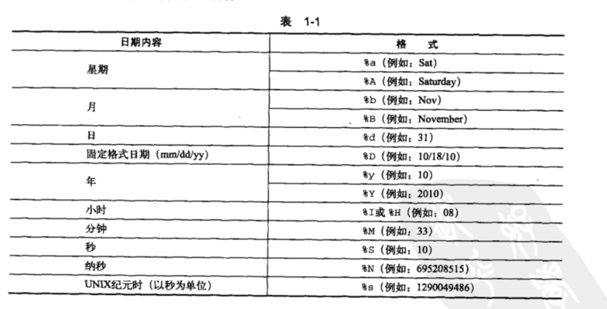

# date
### 功能

    打印或设置系统日期和时间



### 常用选项：

    -d string 显示指定字符串所描述的时间，而非当前时间
    -f datefile 从日期文件中按行读入时间描述
    -I 输出 ISO 8601 格式的日期和时间
    -r 显示文件的最后修改时间
    -R 输出 RFC 2822 格式的日期和时间
    -s string 设置时间所描述的字符串
    -u 打印或设置 UTC 时间
    控制输出格式：
    %% 一个文字的 %
    %a 当前 locale 的星期名缩写(例如： 日，代表星期日)
    %A 当前 locale 的星期名全称 (如：星期日)
    %b 当前 locale 的月名缩写 (如：一，代表一月)
    %B 当前 locale 的月名全称 (如：一月)
    %c 当前 locale 的日期和时间 (如：2005 年 3 月 3 日 星期四 23:05:25)
    %C 世纪；比如 %Y，通常为省略当前年份的后两位数字(例如：20)
    %d 按月计的日期(例如：01)
    %D 按月计的日期；等于%m/%d/%y
    %e 按月计的日期，添加空格，等于%_d
    %F 完整日期格式，等价于 %Y-%m-%d
    %g ISO-8601 格式年份的最后两位 (参见%G)
    %G ISO-8601 格式年份 (参见%V)，一般只和 %V 结合使用
    %h 等于%b
    %H 小时(00-23)
    %I 小时(00-12)
    %j 按年计的日期(001-366)
    %k 时(0-23)
    %l 时(1-12)
    %m 月份(01-12)
    %M 分(00-59)
    %n 换行
    %N 纳秒(000000000-999999999)
    %p 当前 locale 下的"上午"或者"下午"，未知时输出为空
    %P 与%p 类似，但是输出小写字母
    %r 当前 locale 下的 12 小时时钟时间 (如：11:11:04 下午)
    %R 24 小时时间的时和分，等价于 %H:%M
    %s 自 UTC 时间 1970-01-01 00:00:00 以来所经过的秒数
    %S 秒(00-60)
    %t 输出制表符 Tab
    %T 时间，等于%H:%M:%S
    %u 星期，1 代表星期一
    %U 一年中的第几周，以周日为每星期第一天(00-53)
    %V ISO-8601 格式规范下的一年中第几周，以周一为每星期第一天(01-53)
    %w 一星期中的第几日(0-6)，0 代表周一
    %W 一年中的第几周，以周一为每星期第一天(00-53)
    %x 当前 locale 下的日期描述 (如：12/31/99)
    %X 当前 locale 下的时间描述 (如：23:13:48)
    %y 年份最后两位数位 (00-99)
    %Y 年份

### 示例：
```
设置系统日期和时间：
# date -s "2016-12-15 00:00:00"
查看当前系统时间戳：
# date +%s
查看当前系统时间：
# date +'%F %T'
把日期和时间转换成时间戳：
# date -d "2016-12-15 18:00:00" +%s
把时间戳转成时间：
# date -d '@1481842800' '+%F %T'

# 本月和下个月
$ date +%Y%m
$ date -d '1month' +%Y%m


时间加减：
显示前 30 秒：date -d '-30 second' +'%F %T'
显示前一分钟：date -d '-1 minute' +'%F %T'
显示前一个时间：date -d '-1 hour' +'%F %T'
显示前一个天：date -d '-1 day' +'%F %T'
显示上一周：date -d '-1 week' +'%F %T'
显示上一个月日期：date -d '-1 month' +%F
显示上一年日期：date -d '-1 year' +%F
或
显示前一天日期：date -d yesterday +%F
显示后一天日期：date -d tomorrow +%F

# 昨天，前一天
date +%Y%m%d --date "-1 day"


#明天，后一天
date +%Y%m%d -d "+1 day"
date +%Y%m%d --date "+1 day"


时间比较：
NOW_DATE=$(date +%s)
AGO_DATE=$(date -d "2016-12-15 18:00:00" +%s)
[ $NOW_DATE -gt $AGO_DATE ] && echo yes || echo no
```