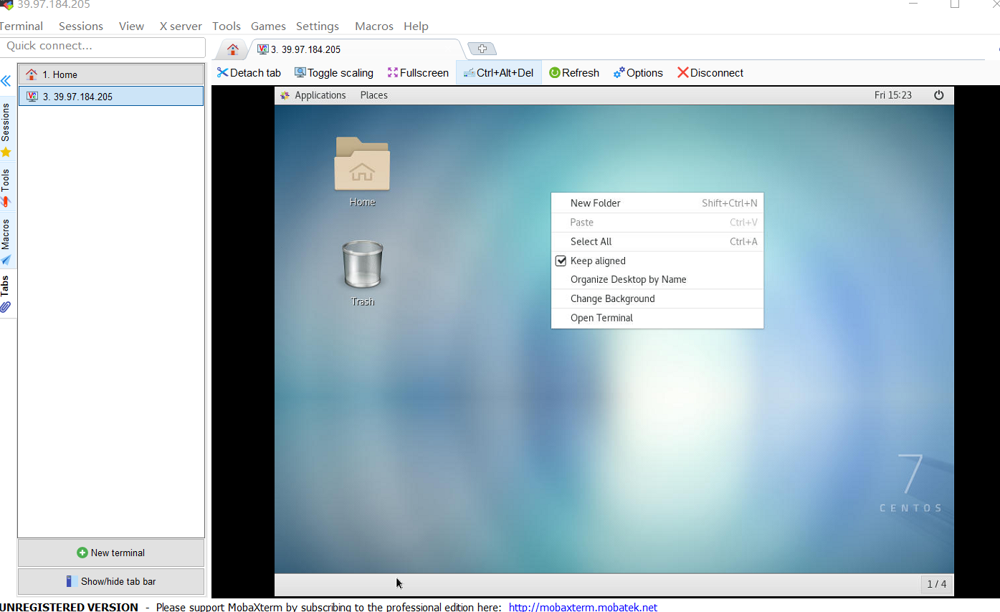
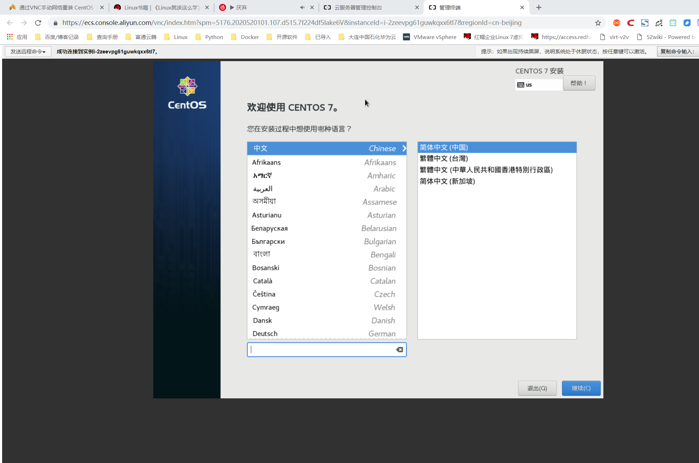

# Centos7安装VNC，手动网络重装VPS

## 开始操作前准备
```
1、检出是否安装VNC
rpm -q tigervnc tigervnc-server


2、安装安装X-Window
yum check-update
yum groupinstall "X Window System"
yum install gnome-classic-session gnome-terminal nautilus-open-terminal control-center liberation-mono-fonts
unlink /etc/systemd/system/default.target
ln -sf /lib/systemd/system/graphical.target /etc/systemd/system/default.target
reboot #重启机器
```

## 安装VNC服务器
```

#第一步，安装VNC packages：
[root@linuxidc ~]# yum install tigervnc-server -y


#第二步，修改配置信息，在/etc/systemd/system/下建立文件夹vncserver@:1.service 把example config 文件从/lib/systemd/system/vncserver@.service复制到里面
[root@linuxidc ~]# cp /lib/systemd/system/vncserver@.service /etc/systemd/system/vncserver@:1.service


#第三步，修改vncserver@:1.service文件

# grep -n "^[^#]" /etc/systemd/system/vncserver@\:1.service 
33:[Unit]
34:Description=Remote desktop service (VNC)
35:After=syslog.target network.target
37:[Service]
38:Type=forking
39:User=root
42:ExecStartPre=-/usr/bin/vncserver -kill %i
43:ExecStart=/sbin/runuser -l root -c "/usr/bin/vncserver %i" 
44:PIDFile=/root/.vnc/%H%i.pid
45:ExecStop=-/usr/bin/vncserver -kill %i
47:[Install]
48:WantedBy=multi-user.target


#修改文件使配置生效：
systemctl daemon-reload


#第四步,为vncserver@:1.service设置密码
vncpasswd


systemctl enable vncserver@:1.service #设置开机启动
systemctl start vncserver@:1.service #启动vnc会话服务
systemctl status vncserver@:1.service #查看nvc会话服务状态
systemctl stop vncserver@:1.service #关闭nvc会话服务

netstat -lnt | grep 590*      #查看端口
tcp        0      0 0.0.0.0:5901            0.0.0.0:*               LISTEN     
tcp        0      0 0.0.0.0:5901            0.0.0.0:*               LISTEN   

```




## 手动网络重装VPS

### 查看网络信息
```
#----------------------------------------------------------
如果要手动重装VPS，请确保你具备有以下条件

	VPS当前系统是 CentOS 7（因为要用到 grub2）
	可以连接 VNC （没有 VNC 就无法使用安装界面）
	VPS架构只支持KVM不支持OVZ
#-----------------------------------------------------------
```

```

# 获取网络信息
[root@iZ2zeevpg61guwkqxx6tl7Z ~]# ifconfig
eth0: flags=4163<UP,BROADCAST,RUNNING,MULTICAST>  mtu 1500
        inet 192.168.0.36  netmask 255.255.255.0  broadcast 192.168.0.255
        ether 00:16:3e:32:15:0a  txqueuelen 1000  (Ethernet)
        RX packets 8244  bytes 5073826 (4.8 MiB)
        RX errors 0  dropped 0  overruns 0  frame 0
        TX packets 6286  bytes 2423308 (2.3 MiB)
        TX errors 0  dropped 0 overruns 0  carrier 0  collisions 0

lo: flags=73<UP,LOOPBACK,RUNNING>  mtu 65536
        inet 127.0.0.1  netmask 255.0.0.0
        loop  txqueuelen 1000  (Local Loopback)
        RX packets 4  bytes 200 (200.0 B)
        RX errors 0  dropped 0  overruns 0  frame 0
        TX packets 4  bytes 200 (200.0 B)
        TX errors 0  dropped 0 overruns 0  carrier 0  collisions 0

[root@iZ2zeevpg61guwkqxx6tl7Z ~]# route -n
Kernel IP routing table
Destination     Gateway         Genmask         Flags Metric Ref    Use Iface
0.0.0.0         192.168.0.253   0.0.0.0         UG    0      0        0 eth0
169.254.0.0     0.0.0.0         255.255.0.0     U     1002   0        0 eth0
192.168.0.0     0.0.0.0         255.255.255.0   U     0      0        0 eth0


#IP和网关信息如下：
IP 192.168.0.36 
netmask 255.255.255.0
Gateway 192.168.0.253


#----------------------------------------------------------
如果要手动重装VPS，请确保你具备有以下条件

	VPS当前系统是 CentOS 7（因为要用到 grub2）
	可以连接 VNC （没有 VNC 就无法使用安装界面）
	VPS架构只支持KVM不支持OVZ
#-----------------------------------------------------------


#配置启动文件


#先安装wget命令
yum install wget -y

wget -O /boot/initrd.img http://mirror.centos.org/centos/7/os/x86_64/images/pxeboot/initrd.img
wget -O /boot/vmlinuz http://mirror.centos.org/centos/7/os/x86_64/images/pxeboot/vmlinuz
cp /boot/initrd.img /
cp /boot/vmlinuz /


#编辑/etc/grub.d/40_custom文件
[root@iZ2zeevpg61guwkqxx6tl7Z /]# cat /etc/grub.d/40_custom 
#!/bin/sh
exec tail -n +3 $0
# This file provides an easy way to add custom menu entries.  Simply type the
# menu entries you want to add after this comment.  Be careful not to change
# the 'exec tail' line above.

# 在最后增加以下信息
menuentry "Network Install CentOS 7" {
    set root='(hd0,msdos1)'
    # linux /vmlinuz repo=http://mirror.centos.org/centos/7/os/x86_64/ ip=IP地址 netmask=子网掩码 gateway=网关地址 nameserver=DNS地址
    linux /vmlinuz repo=http://mirror.centos.org/centos/7/os/x86_64/ ip=192.168.0.36 netmask=255.255.255.0 gateway=192.168.0.253 nameserver=1.1.1.1
    initrd /initrd.img

	
	
#生成grub配置文件
grub2-mkconfig --output=/boot/grub2/grub.cfg


#查看启动项
$ egrep ^menuentry /etc/grub2.cfg | cut -f 2 -d \'
CentOS Linux (3.10.0-957.5.1.el7.x86_64) 7 (Core)
CentOS Linux (3.10.0-514.el7.x86_64) 7 (Core)
CentOS Linux (0-rescue-16fe1aa10c0b925a57abe21439573c6b) 7 (Core)
CentOS Linux (0-rescue-bbbbbbbbbbbbbbbbbbbbbbbbbbbbbbbb) 7 (Core)
menuentry "Network Install CentOS 7" {


#因为Network Install CentOS 7位于第一行，因此将默认引导条目设置为4
grub2-set-default 4
```

####开始安装
当以上操作都完成后，使用reboot重启系统，请在重启之前提前打开VNC，准备进行安装

    reboot
	



