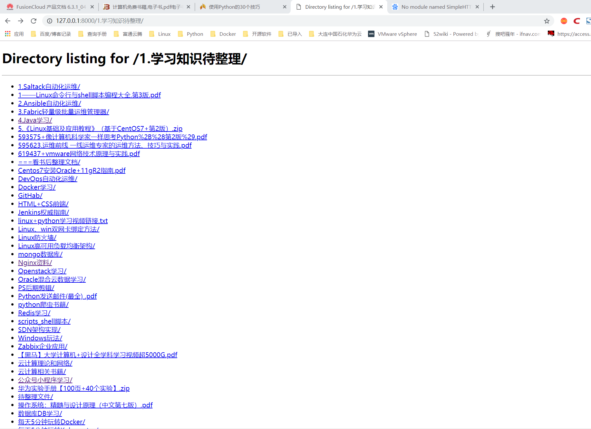
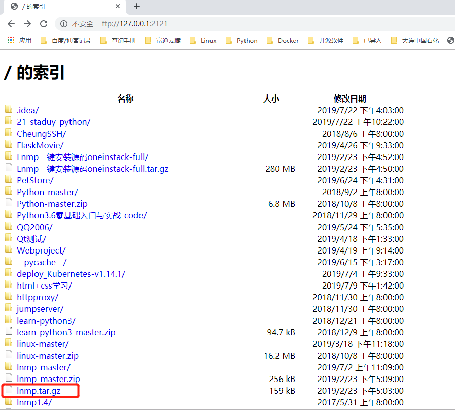
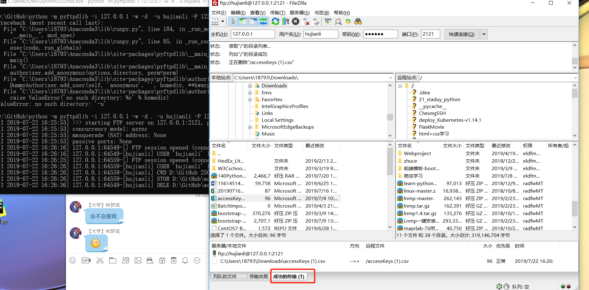

# 用 Python 快速实现 HTTP 和 FTP 服务器

## 用 Python 快速实现 HTTP 服务器

### Windows上终止占用端口的进程
``` 
C:\Users\18793>netstat -ano|findstr 8000
  TCP    0.0.0.0:8000           0.0.0.0:0              LISTENING       15944
  UDP    0.0.0.0:8000           *:*                                    15944

C:\Users\18793>tasklist | findstr 15944
KGService.exe                15944 Console                    1     20,584 K

C:\Users\18793>taskkill /pid 15944 /F
成功: 已终止 PID 为 15944 的进程。
```


```

Python 允许运行一个 HTTP 服务器来从根路径共享文件，下面是开启服务器的命令：

# Python 2
python -m SimpleHTTPServer


# Python 3
python3 -m http.server

```
SimpleHTTPServer 模块默认会在 8000 端口上监听一个 HTTP 服务，
这时就可以打开浏览器输入 http://IP:Port 访问这个 Web 页面。
例如类似下面的 URL:




## 用 Python 快速实现 FTP 服务器
首先安装 Pyftpdlib 模块

```
$ sudo pip install pyftpdlib
```

`通过 Python 的 -m 选项将 Pyftpdlib 模块作为一个简单的独立服务器来运行`

我们共享D盘的GitHub目录：

``` 
C:\Users\18793>d:

D:\>
D:\>cd GitHub

D:\GitHub>python -m pyftpdlib
```
至此一个简单的 FTP 服务器已经搭建完成，访问 ftp://IP:PORT 即可。
``` 
默认 IP 为本机所有可用 IP，端口为 2121。
默认登陆方式为匿名。
默认权限是只读。

```



### 创建一个有认证可写的`ftp`服务器，可以使用类似以下指令
``` 
python -m pyftpdlib -i 127.0.0.1 -w -d . -u hujianli -P 123456
```
常用可选参数说明:

``` 
-i 指定IP地址（默认为本机所有可用 IP 地址）
-p 指定端口（默认为 2121）
-w 写权限（默认为只读）
-d 指定目录 （默认为当前目录）
-u 指定登录用户名
-P 指定登录密码

```



`小插曲：测试时一直使用密码 000000 这样的弱密码做认证密码，在客户端登陆时一直提示认证失败。看来 Pyftpdlib 模块还做了基本的安全策略哟，不错的！`

如果你需卸载 Pyftpdlib 模块，可以通过以下命令：
` 
 pip uninstall pyftpdlib
`