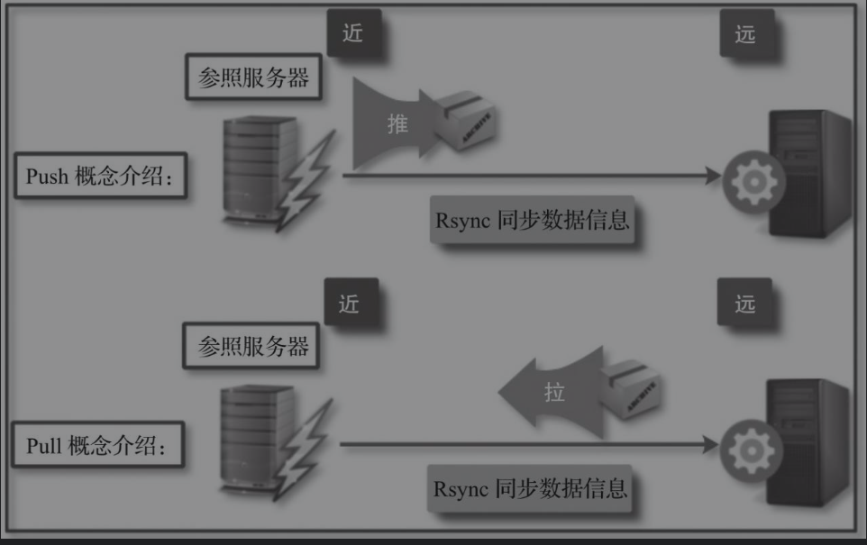
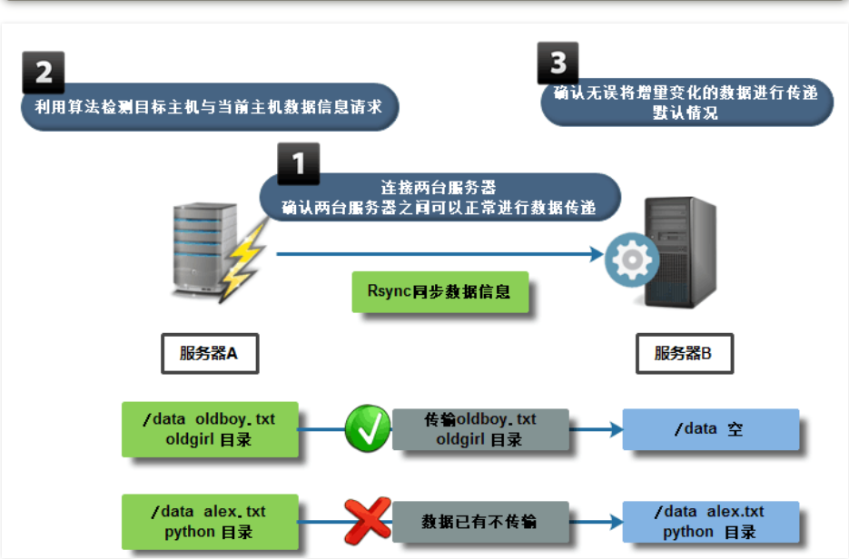
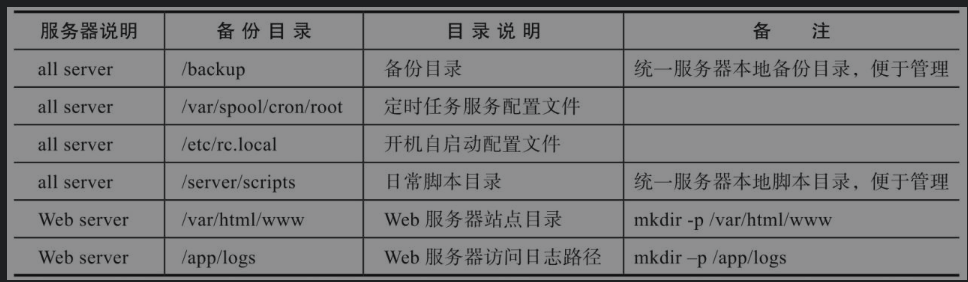

# Rsync数据复制软件应用实践

## 第1章 rsync 软件介绍

### 1. 什么是RsyncRsync？

是一款开源的快速的、可实现全量及增量的本地或远程数据备份的多功能优秀工具。并且在复制时可以不改变原有数据的属性信息，即可实现数据的备份迁移特性。Rsync软件适用于Unix/Linux/Windows等多种操作系统平台。


Rsync提供了大量参数来控制复制行为的各个方面，并且允许多种灵活的方式来实现文件的传输复制。它以其delta-transfer算法闻名。通过减少网络数据发送数量，只发送源文件和目标文件之间的差异信息，从而实现数据的增量复制。

Rsync被广泛应用于数据备份和镜像，并作为一种改进后的复制命令用于日常系统中。

官方链接：http://www.samba.org/ftp/rsync/rsync.html

官方手册：man rsync/man rsync.conf

rsync 是一款开源的、快速的、多功能的、可实现全量及增量的本地或远程数据同步备份的优秀工具。

http://www.samba.org/ftp/rsync/rsync.html


### 2. Rsync功能介绍

Rsync英文全称为Remote synchronization，从软件名称可以看出来，Rsync具有可使本地和远程两台主机之间的数据快速复制、远程备份的功能。

Rsync软件自带的rsync命令本身就可以实现异地主机复制数据，这个功能类似scp命令（借助SSH服务实现远程传输数据），但又优于scp命令的功能，scp每次都是全量拷贝，而rsync可以增量拷贝（同样需借助SSH服务传输数据），此外，Rsync软件还支持以配置守护进程方式实现异机数据复制。

#### 2.1 rsync命令可以实现的功能如下

```
1）实现本地数据同步复制（本地工作模式，相当于cp命令）。

2）实现远程数据同步复制（远程Shell工作模式，相当于scp命令）。

3）实现数据信息删除功能（本地工作模式，相当于rm命令）。

4）实现数据信息查看功能（本地或远程工作模式，相当于ls命令）。
```

#### 2.2 Rsync的特性如下（7个特性信息说明）

```
❑ 支持拷贝普通文件与特殊文件，如链接文件、设备文件等。

❑ 支持排除指定文件或目录同步的功能，相当于打包命令tar的排除功能。

❑ 可以做到保持原文件或目录的权限、时间、软硬链接、属主、组等所有属性均不改变。

❑ 可实现增量复制，即只复制发生变化的数据，因此数据传输效率很高。

❑ 可以使用rcp、rsh、SSH等方式来配合进行隧道加密传输文件（Rsync本身不对数据加密）。

❑ 可以通过socket（进程方式）传输文件和数据（服务端和客户端)。

❑ 支持匿名或认证（无须系统用户）进程模式传输，安全地进行数据备份及镜像。
```


#### 2.3 Rsync软件复制原理

默认情况下，在备份复制数据时，Rsync通过其独特的quick check算法，仅复制大小或者最后修改时间发生变化的文件或目录，当然也可根据权限、属主等属性的变化复制，但需要指定相应的参数，甚至可以实现只复制一个文件里有变化的部分内容，所以可以实现快速地备份复制数据，即采用增量复制方法对数据信息进行复制，与传统cp、scp复制工具的全量复制截然不同，增量复制数据在效率上远远高于全量复制。


可以利用rsync命令参数查看当前系统中Rsync软件版本信息。

```shell
[root@swarm1 rsync-3.1.3]# rsync --version
rsync  version 3.1.3  protocol version 31
```

## 第2章.Rsync工作方式介绍与实践

#### 2.1 Rsync有3种传输数据模式

##### 2.1.1．本地（Local）数据传输模式

Rsync的本地数据传输模式，很类似于cp本地复制命令，可以实现文件、目录的移动备份等功能，所不同的是Rsync有增量复制的功能。

##### 2.1.2．远程Shell数据传输模式

远程Shell数据传输模式一般是借助通道（如SSH）在两台服务器之间进行复制数据，这两台服务器之间是对等的，没有客户端与服务端之分，整个过程类似于scp远程复制命令，所不同的是Rsync有增量复制的功能，但缺少scp的加密复制的功能。

##### 2.1.3 守护进程(Daemon)传输模式

守护进程传输模式是在客户端与服务端之间进行数据复制的，通常需要服务端部署守护进程服务，然后在客户端执行命令，实现数据的拉取和推送复制。

#### 2.2 本地数据传输模式

本地数据传输模式语法

```
rsync  [option] SRC....	 dest...
```

##### 2.2.1 本地数据传输模式实践

###### (1)作为本地复制命令应用（类似cp命令）

实例1：利用rsync命令实现本地文件的复制，命令如下。

```
[root@swarm1 tmp]# rsync /etc/hosts /tmp/
```

实例2：利用rsync命令实现复制本地目录，命令如下。

```
[root@swarm1 tmp]# mkdir /hujianli/achang{1..9}.txt -p
[root@swarm1 tmp]# rsync -r /hujianli /tmp/
[root@swarm1 tmp]# ll hujianli/
```

##### （2）作为删除数据命令应用（类似rm命令）

实例1：利用rsync命令的删除功能清空目录内容，命令如下。

```
[root@swarm1 tmp]# mkdir /opt/null -p		#创建一个空目录
[root@swarm1 tmp]# rsync -r --delete /opt/null/ /tmp/hujianli/
[root@swarm1 tmp]# ll hujianli/
总用量 0
```

实例2：利用rsync命令的删除功能清空文件内容，命令如下。

```
[root@swarm1 tmp]# echo "hujianli hello shengzheng" > file.txt
[root@swarm1 tmp]# cat file.txt
hujianli hello shengzheng
[root@swarm1 tmp]# touch null1.txt
[root@swarm1 tmp]# rsync -r --delete null1.txt /tmp/file.txt
[root@swarm1 tmp]# cat file.txt
```

提示：在使用rsync命令对目录数据进行本地或远程复制时，目录名称后面是否加“/”，产生的复制效果是不一样的。

##### （3）作为查询数据命令应用（类似ls命令）

实例1：利用rsync命令的查询功能查看文件和目录信息

```
[root@swarm1 tmp]# rsync /etc/hosts
-rw-r--r--            241 2020/08/14 11:07:50 hosts
```

#### 2.3 远程Shell数据传输模式

远程Shell数据传输模式语法远程Shell数据传输模式分为拉取和推送两种模式，拉取是指从远端服务器把数据拉取到本地服务器；推送是指把数据从本地服务器推送到远端服务器，这两种传输方式的语法格式如下。

```
rsync [option] [USER@]HOST:SRC...	DEST
```

(1)推送

```
rsync [OPTION..] SRC...	[USER@]HOST:DEST
```

Pull和Push的区别就是`[USER@]HOST:SRC..`和DEST位置对调而已。




##### 3.3.1 远程Shell数据传输模式实践

实践1：利用拉取模式从远端服务器把/etc/hosts复制到本地/tmp

```shell
[root@swarm1 tmp]# rsync root@172.16.61.214:/etc/hosts /tmp/
#或者
[root@swarm1 tmp]# rsync -av -e "ssh -p 22" root@172.16.61.214:/etc/hosts /tmp/

#-e 参数指定隧道加密，指定端口
```

实践2：利用推送模式从本地服务器把/etc/hosts复制到远端主机的/tmp

```
[root@swarm1 tmp]# rsync -av /etc/hosts root@172.16.61.214:/temp
```

1）采用远程Shell数据传输模式，每次都需要输入远程主机密码信息，无法实现免交互；因此需要配合SSH key免密码登录来完成数据免交互同步。

2）该复制使用系统用户进行存在安全隐患，而使用普通用户进行又会导致权限不足。

3）实际工作中守护进程传输方式是更重要的方式。

#### 2.4 守护进程传输模式



Rsync守护进程模式服务需要部署在BACKUP服务器上。

```
[root@swarm1 ~]# rpm -qa |grep rsync
rsync-3.1.2-4.el7.x86_64
```

**①BACKUP服务器**

1）配置rsyncd.conf。

编写rsyncd.conf单模块配置文件，命令如下。

```shell
cp /etc/rsyncd.conf{,_bak}
    cat > /etc/rsyncd.conf <<eof
    # This line is required by the /etc/init.d/rsyncd script
    uid = rsync
    gid = rsync
    fake super = yes
    use chroot = no
    max connections = 2000
    timeout = 600
    pid file = /var/run/rsyncd.pid
    lock file = /var/run/rsync.lock
    log file = /var/log/rsyncd.log
    ignore errors
    read only = false
    list = false
    hosts allow = 172.16.61.0/24
    hosts deny =0.0.0.0/32
    auth users = rsync_backup
    secrets file = /etc/rsync.password
    ############################
    [backup]
    comment = backup server by oldboy
    path = /backup
    eof

# 启动rsync程序
rsync --daemon
# 加入开机自启动
echo "rsync --daemon" >>/etc/rc.local

# 查看进程信息
ps -ef |grep rsync|grep -v grep

netstat -lntup|grep rsync
ss -lntup|grep rsync
```

2）创建数据备份储存目录,目录修改属主

```shell
useradd -s /sbin/nologin -M rsync

[root@swarm1 ~]# id rsync
uid=1000(rsync) gid=1000(rsync) 组=1000(rsync)

mkdir /backup && chown -R rsync.rsync /backup/
```


3)配置用于Rsync复制的账号、密码及账号文件权限。

在Rsync服务端创建用于在Rsync客户端与服务端进行验证的账号和密码，并将其写入文件。

```shell
[root@backup ~]# echo "rsync_backup:oldboy" >/etc/rsync.password

[root@backup ~]# cat /etc/rsync.password
rsync_backup:oldboy

[root@backup ~]# ll /etc/rsync.password
-rw------- 1 root root 20 Jun 13 00:31 /etc/rsync.password
```

```shell
[root@swarm1 ~]# netstat -lntup |grep rsync
tcp        0      0 0.0.0.0:873             0.0.0.0:*               LISTEN      22051/rsync
tcp6       0      0 :::873                  :::*                    LISTEN      22051/rsync

[root@swarm1 ~]# ps -ef|grep rsync
```


**②配置rsync客户端（其他服务器为客户端）**

```shell
[root@lamp01 ~]# echo "oldboy" >/etc/rsync.password
[root@lamp01 ~]# chmod 600 /etc/rsync.password

```

实现数据传输

交互式

```shell
[root@swarm3 ~]# rsync -avzP /etc/hosts rsync_backup@172.16.61.23::backup
Password:
sending incremental file list
hosts
            241 100%    0.00kB/s    0:00:00 (xfr#1, to-chk=0/1)

sent 185 bytes  received 43 bytes  65.14 bytes/sec
total size is 241  speedup is 1.06
```

非交互式

方法1

```shell
[root@swarm3 ~]# rsync -avzP /etc/hosts rsync_backup@172.16.61.23::backup --password-file=/etc/rsync.password
```

方法2

使用 RSYNC_PASSWORD 变量实现免交互

添加上环境变量

```
[root@nfs01 ~]# export RSYNC_PASSWORD=clsn123
```

测试

```
[root@nfs01 ~]# rsync -avzP /etc/services rsync_backup@172.16.1.41::backup
sending incremental file list
sent 29 bytes  received 8 bytes  24.67 bytes/sec
total size is 641020  speedup is 17324.86
```


**③rsync 命令同步参数选项&特殊参数**

```

| **目录参数**                                                 | **参数说明**                                                 |
| ------------------------------------------------------------ | ------------------------------------------------------------ |
| -v ,--verbose                                                | 详细模式输出，传输时的信息                                   |
| -z,--compress                                                | 传输时进行压缩以提高传输效率--compress-level=NUM 可按级别压缩局域网可以不用压缩 |
| -a,--archive （主要）                                        | 归档模式，表示以递归方式传输文件，并保持文件属性。等于 -rtopgDl |
| -r,--recursive  **归档于-a**                                 | 对子目录以递归模式，即目录下的所有目录都同样传输。小写r      |
| -t,--times       **归档于-a**                                | 保持文件时间信息                                             |
| -o,--owner       **归档于-a**                                | 保持文件属主信息                                             |
| -p,--perms       **归档于-a**                                | 保持文件权限                                                 |
| -g,--group       **归档于-a**                                | 保持文件属组信息                                             |
| -P，--progress                                               | 显示同步的过程及传输时的进度等信息（大P）                    |
| -D,--devices    **归档于-a**                                 | 保持设备文件信息                                             |
| -l,--links       **归档于-a**                                | 保留软连接（小写字母l）                                      |
| -e，--rsh=COMMAND                                            | 使用的信道协议（remote shell），指定替代rsh的shell程序。例如 ssh |
| --exclude=*PATTERN*                                          | 指定排除不需要传输的文件信息                                 |
| --exclude-from=*file*                                        | 文件名所在目录文件，即可以实现排除多个文件                   |
| --bwlimit=RATE                                               | 限速功能                                                     |
| --delete                                                     | 让目标目录SRC和源目录数据DST一致，即无差异数据同步           |
| **保持同步目录及文件属性：**这里的-avzP相当于 -vzetopdDlP，生产环境常用的参数为 -avzP在脚本中可以报-vP去掉--progress可以用-P代替 |                                                              |
| **daemon****启动扩展参数**                                   |                                                              |
| --daemon                                                     | daemon表示以守护进程的方式启动rsync服务。                    |
| --address                                                    | 绑定指定IP地址提供服务。                                     |
| --config=FILE                                                | 更改配置文件路径，而不是默认的/etc/rsyncd.conf               |
| --port=PORT                                                  | 更改其它端口提供服务，而不是缺省的873端口                    |
```


##### 2.4.1 特殊参数实践

指定ip：

```shell
[root@backup ~]# rsync --daemon --address=172.16.1.41
[root@backup ~]# netstat -lntup |grep 873
tcp     0   0 172.16.1.41:873     0.0.0.0:*        LISTEN      2583/rsync      
参数测试：
[root@nfs01 ~]# rsync -avzP /etc/services rsync_backup@172.16.1.41::backup --password-file=/etc/rsync.password
sending incremental file list
services
      641020 100%   19.34MB/s    0:00:00 (xfer#1, to-check=0/1)
 
sent 127417 bytes  received 27 bytes  254888.00 bytes/sec
total size is 641020  speedup is 5.03
```

指定配置文件路径

```shell
[root@backup ~]# rsync --daemon --config=/etc/rsyncd.conf
[root@nfs01 ~]# rsync -avzP /etc/services rsync_backup@172.16.1.41::backup --password-file=/etc/rsync.password
sending incremental file list
sent 29 bytes  received 8 bytes  74.00 bytes/sec
total size is 641020  speedup is 17324.86
```

服务端指定服务端口：

```shell
[root@backup ~]# rsync --daemon --port=5222
[root@backup ~]# netstat -lntup|grep rsync
tcp        0      0 0.0.0.0:5222      0.0.0.0:*           LISTEN      2598/rsync         
tcp        0      0 :::5222            :::*                 LISTEN      2598/rsync     
```


## 第3章 rsycn配置文件详解 rsyncd.conf

### 3.1 部分知识补充

#### 3.1.1 配置文件内容参考资料

```
man rsyncd.conf
```

#### 3.1.2 配置文件内容总结

​    模块之上内容为全局变量信息

​    模块之下内容为局部变量信息

**说明：**

无论是全局变量发生变化，还是局部变量发生变化，都建议重启rsync服务使配置生效。

### 3.2 利用/etc/init.d/启动rsync服务方式

#### 3.2.1 可以实现方式：

```
a. 编写rsync启动脚本（有一定的shell能力 if case）
b. 利用xinetd服务，管理启动rsync服务
```

#### 3.2.2 利用 xinetd服务 管理rsync

第一个里程碑： 安装xinetd软件

```
[root@backup ~]# yum install -y xinetd
[root@backup ~]# rpm -qa |grep xin
xinetd-2.3.14-40.el6.x86_64
```

第二个里程碑：编辑配置文件

   修改disable = yes 改为disable = no

```
[root@backup ~]# vim /etc/xinetd.d/rsync
# default: off
# description: The rsync server is a good addition to an ftp server, as it \
#   allows crc checksumming etc.
service rsync
{
disable   = no
flags     = IPv6
socket_type     = stream
wait            = no
user            = root
server          = /usr/bin/rsync
server_args     = --daemon
log_on_failure  += USERID
}
```

第三个里程碑：重启xinetd服务

```
[root@backup ~]# /etc/init.d/xinetd restart
Stopping xinetd:                                           [  OK  ]
Starting xinetd:                                           [  OK  ]
```

传输测试

```
[root@nfs01 ~]# rsync -avzP /etc/services rsync_backup@172.16.1.41::backup --password-file=/etc/rsync.password
sending incremental file list
sent 29 bytes  received 8 bytes  74.00 bytes/sec
total size is 641020  speedup is 17324.86
```

### 3.3 定义变量信息实现免秘钥交互

#### 3.3.1 通过man手册获得方法

```
Some  modules  on the remote daemon may require authentication. If so, you will receive a password prompt when you connect.  You  can avoid  the  password  prompt  by  setting the environment variable RSYNC_PASSWORD to the password  you  want  to  use  or  using  the --password-file option. This may be useful when scripting rsync.
WARNING:  On some systems environment variables are visible to all users. On those systems using --password-file is recommended.
```

在远程进程的一些模块可能需要认证。如果是这样的话，你将得到一个密码提示当您连接。你可以通过设置环境变量rsync_password要使用或使用密码文件选项密码避免密码提示。这可能是有用的脚本文件。

警告：在一些系统环境变量，对所有用户都是可见的。在这些系统中使用的密码文件的建议。

#### 3.3.2 使用 RSYNC_PASSWORD 变量实现免交互

未设置变量之前

```
[root@nfs01 ~]# rsync -avzP /etc/services rsync_backup@172.16.1.41::backup
Password:
```

添加上环境变量

```
[root@nfs01 ~]# export RSYNC_PASSWORD=clsn123
```

测试

```
[root@nfs01 ~]# rsync -avzP /etc/services rsync_backup@172.16.1.41::backup
sending incremental file list
sent 29 bytes  received 8 bytes  24.67 bytes/sec
total size is 641020  speedup is 17324.86
```

### 3.4 守护进程多模块功能配置

第一个里程碑： 编写配置信息创建多模块

```
# This line is required by the /etc/init.d/rsyncd script
uid = rsync
gid = rsync
fake super = yes
use chroot = no
max connections = 2000
timeout = 600
pid file = /var/run/rsyncd.pid
lock file = /var/run/rsync.lock
log file = /var/log/rsyncd.log
ignore errors
read only = false
list = false
hosts allow = 172.16.61.0/24
hosts deny =0.0.0.0/32
auth users = rsync_backup
secrets file = /etc/rsync.password
############################

[nfsdata]
comment = "nfsdata dir by clsn"
path = /backup/nfsdata
[nfsbackup]
comment = "nfsbackup dir by clsn"
path = /backup/nfsbackup
```


第二个里程碑： 创建多模块指定的目录

```shell
# 创建目录，并修改目录的权限
[root@backup ~]# mkdir /backup/nfs{data,backup} -p
[root@backup ~]# chown rsync.rsync  /backup/nfs{data,backup

# 查看：
[root@backup ~]# ll /backup/nfs{data,backup} -d
drwxr-xr-x 2 rsync rsync 4096 Oct 12 10:05 /backup/nfsbackup
drwxr-xr-x 2 rsync rsync 4096 Oct 12 10:05 /backup/nfsdata}
```

第三里程碑： 利用rsync客户端进行测试

```shell
[root@swarm3 data]# mkdir /data1/hujianli{1..9} -p
[root@swarm3 data]# touch /data1/hujianli{1..9}/{1..9}.txt
[root@swarm3 data]# ll /data1
总用量 0
drwxr-xr-x. 2 root root 123 8月  23 21:38 hujianli1
drwxr-xr-x. 2 root root 123 8月  23 21:38 hujianli2
drwxr-xr-x. 2 root root 123 8月  23 21:38 hujianli3
drwxr-xr-x. 2 root root 123 8月  23 21:38 hujianli4
drwxr-xr-x. 2 root root 123 8月  23 21:38 hujianli5
drwxr-xr-x. 2 root root 123 8月  23 21:38 hujianli6
drwxr-xr-x. 2 root root 123 8月  23 21:38 hujianli7
drwxr-xr-x. 2 root root 123 8月  23 21:38 hujianli8
drwxr-xr-x. 2 root root 123 8月  23 21:38 hujianli9
```

```shell
[root@swarm3 data]# rsync -avz /data1/ rsync_backup@172.16.61.23::nfsdata --password-file=/etc/rsync.password
```

```shell
[root@swarm3 data]# rsync -avz /data1/ rsync_backup@172.16.61.23::nfsbackup --password-file=/etc/rsync.password
```


说明：

> rsyncd.conf配置文件中，添加多模块信息，可以不用重启rsync服务，即时生效~
>
> 全局变量参数针对所有模块生效；局部变量参数只针对指定模块生效
>
> read only参数默认配置为ture，即为只读模式
>
> 全局变量发生变化，不用重启rsync服务；局部变量发生变化，需要重启rsync服务


####  3.5 守护进程的排除功能实践

#####  3.5.1 排除的方式

a） --exclude=要配置的目录或文件名称

b） --exclude-from=要排除多个目录或文件汇总文件名称

c） 在配置文件中进行修改，指定要排除的信息

##### 3.5.2 排除测试

第一个里程碑: 创建模拟测试环境

```shell
[root@swarm3 data]# mkdir /data1/hujianli{1..9} -p
[root@swarm3 data]# touch /data1/hujianli{1..9}/{1..9}.txt
```


第二个里程碑 利用 --exclude参数测试排除功能

```shell
# # 需求：排除hujianli1~hujianli4目录
[root@swarm3 data]# rsync -avz /data1/ --exclude=a/3.txt --exclude=hujianli1 --exclude=hujianli2 --exclude=hujianli3 --exclude=hujianli4 rsync_backup@172.16.61.23::nfsdata --password-file=/etc/rsync.password
```

精简方式排除

```shell
[root@swarm3 data]# rsync -avz /data1/ --exclude=a/3.txt --exclude=hujianli{1..4} rsync_backup@172.16.61.23::nfsdata --password-file=/etc/rsync.password
```

##### 3.5.3 利用--exclude-from 方式进行排除

第一个里程碑: 创建模拟测试环境

```shell
[root@swarm3 data]# mkdir /data1/hujianli{1..9} -p
[root@swarm3 data]# touch /data1/hujianli{1..9}/{1..9}.txt
```

第二个里程碑：利用--exlude-from参数，测试排除功能

```
[root@swarm3 data1]# cat /tmp/paichu.txt
hujianli1
hujianli2
hujianli3
hujianli4
hujianli5
hujianli6
hujianli7
```

第三个里程碑：进行排除

```shell
[root@swarm3 data1]# rsync -avz /data1/ --exclude-from=/tmp/paichu.txt rsync_backup@172.16.61.23::nfsdata --password-file=/etc/rsync.password
sending incremental file list
./
hujianli8/
hujianli8/1.txt
hujianli8/2.txt
hujianli8/3.txt
hujianli8/4.txt
hujianli8/5.txt
hujianli8/6.txt
hujianli8/7.txt
hujianli8/8.txt
hujianli8/9.txt
hujianli9/
hujianli9/1.txt
hujianli9/2.txt
hujianli9/3.txt
hujianli9/4.txt
hujianli9/5.txt
hujianli9/6.txt
hujianli9/7.txt
hujianli9/8.txt
hujianli9/9.txt
```

说明：

01. 排除文件中，需要利用相对路径指定排除信息（不能利用绝对路径）
>
02. 相对路径指的是相对同步的目录信息而言，是对rsync -avz /data/ 后面的data目录进行相对

##### 3.5.4 在配置文件中修改要排除的文件

第一个里程碑： 编写修改服务端配置文件

```
vim /etc/rsyncd.conf
[nfsdata]
comment = "nfsdata dir by clsn"
path = /backup/nfsdata
exclude=a/3.txt b c
```

第二个里程碑：重启rsync服务

```
killall rsync && sleep 1 && rsync --daemon
```

第三里程碑： 进行测试

```shell
[root@nfs01 data]# rsync -avz /data/  rsync_backup@172.16.1.41::nfsdata
sending incremental file list
./
a/
a/1.txt
a/2.txt
skipping daemon-excluded file "a/3.txt"
skipping daemon-excluded directory "b"
*** Skipping any contents from this failed directory ***
skipping daemon-excluded directory "c"
*** Skipping any contents from this failed directory ***
d/
d/1.txt
d/2.txt
d/3.txt
sent 407 bytes  received 116 bytes  1046.00 bytes/sec
total size is 0  speedup is 0.00
rsync error: some files/attrs were not transferred (see previous errors) (code 23) at 
```


#### 3.6 守护进程来创建备份目录

通过客户端命令创建服务端备份目录中子目录

```
[root@swarm1 backup]# cat /etc/rsyncd.conf
.....
[backup]
comment = "backup"
path = /backup
```

```shell
# 推送/etc/services文件到 服务器/backup/sda/目录
[root@swarm3 data1]# rsync -avzP /etc/services rsync_backup@172.16.61.23::backup/dba/

# 推送/etc/services文件到 服务器/backup/sa/目录
[root@swarm3 data1]# rsync -avzP /etc/services rsync_backup@172.16.61.23::backup/sa/

# 推送/etc/services文件到 服务器/backup/dev/目录
[root@swarm3 data1]# rsync -avzP /etc/services rsync_backup@172.16.61.23::backup/dev/
```

**检查结果：**

```shell
[root@swarm1 backup]# tree
.
── dba
    └── services
── dev
    └── services
── sa
    └── services
```

#### 3.7 守护进程的访问控制配置

第一个里程碑：在服务端配置文件，编写白名单策略或黑名单策略（只能取其一）

```
vim /etc/rsyncd.conf
hosts allow = 172.16.1.0/24
#hosts deny = 0.0.0.0/32
```

关于访问控制的说明：

01. 白名单和黑名单同时存在时，默认控制策略为不匹配的传输数据信息全部放行

02. 白名单单一存在时，默认控制策略为不匹配的传输数据信息全部禁止

03. 黑名单单一存在时，默认控制策略为不匹配的传输数据信息全部放行

   **全局变量修改控制策略信息，rsync****服务必须重启**

第二个里程碑：客户端进行测试

```shell
[root@nfs01 backup]# rsync -avz /etc/services rsync_backup@10.0.0.41::data
@ERROR: Unknown module 'data'
rsync error: error starting client-server protocol (code 5) at main.c(1503) [sender=3.0.6]
--------------------------------------------------------------------------------

[root@nfs01 backup]# rsync -avz /etc/services sync_backup@172.16.1.41::data
sending incremental file list
sent 29 bytes  received 8 bytes  74.00 bytes/sec
total size is 641020  speedup is 17324.86
```

#### 3.8 守护进程无差异同步配置

##### 3.8.1 什么是无差异：

推模式：我有什么，你就有什么；我没有，你也不能有

拉模式：你有什么，我就有什么；你没有，我也不能有

总结：**服务端客户端数据完全一致（一模一样）**

##### 3.8.2 实现无差异同步方法

第一个里程碑： 创建实验环境

```
[root@swarm3 data1]# ll
总用量 0
drwxr-xr-x. 2 root root 123 8月  23 21:38 hujianli1
drwxr-xr-x. 2 root root 123 8月  23 21:38 hujianli2
drwxr-xr-x. 2 root root 123 8月  23 21:38 hujianli3
drwxr-xr-x. 2 root root 123 8月  23 21:38 hujianli4
drwxr-xr-x. 2 root root 123 8月  23 21:38 hujianli5
drwxr-xr-x. 2 root root 123 8月  23 21:38 hujianli6
drwxr-xr-x. 2 root root 123 8月  23 21:38 hujianli7
drwxr-xr-x. 2 root root 123 8月  23 21:38 hujianli8
drwxr-xr-x. 2 root root 123 8月  23 21:38 hujianli9
```

第二个里程：进行第一次数据同步

```
[root@swarm3 data1]# rsync -avz --delete  /data1/ rsync_backup@172.16.61.23::backup/
Password:
sending incremental file list
deleting sa/services
deleting sa/
deleting dev/services
deleting dev/
deleting dba/services
deleting dba/
deleting .updated
deleting .pwd.lock
./
hujianli1/
hujianli1/1.txt
hujianli1/2.txt
hujianli1/3.txt
hujianli1/4.txt
hujianli1/5.txt
hujianli1/6.txt
hujianli1/7.txt
hujianli1/8.txt
hujianli1/9.txt
hujianli2/
hujianli2/1.txt
hujianli2/2.txt
hujianli2/3.txt
hujianli2/4.txt
hujianli2/5.txt
hujianli2/6.txt
......
```

第三个里程：删除指定目录，并添加指定文件，测试无差异功能

```shell
# 删除客户端中的 hujianli{1..5} 目录，再进行无差异传输
[root@swarm3 data1]# rm -rf hujianli{1..5}
[root@swarm3 data1]# ll
总用量 0
drwxr-xr-x. 2 root root 123 8月  23 21:38 hujianli6
drwxr-xr-x. 2 root root 123 8月  23 21:38 hujianli7
drwxr-xr-x. 2 root root 123 8月  23 21:38 hujianli8
drwxr-xr-x. 2 root root 123 8月  23 21:38 hujianli9
[root@swarm3 data1]# rsync -avz --delete  /data1/ rsync_backup@172.16.61.23::backup/ --password-file=/etc/rsync.password
sending incremental file list
deleting hujianli5/9.txt
deleting hujianli5/8.txt
deleting hujianli5/7.txt
deleting hujianli5/6.txt
deleting hujianli5/5.txt
deleting hujianli5/4.txt
deleting hujianli5/3.txt
deleting hujianli5/2.txt
deleting hujianli5/1.txt
```

##### 3.8.3 【注意】无差异同步方法的应用

01. 实现储存数据与备份数据完全一致（**慎用**）

```
  rsync -avz --delete  /data/ rsync_backup@172.16.1.41::backup /
```

02. 快速删除大文件数据

```shell
  1.mkdir /null      --创建出一个空目录。
  2.rsync -avz --delete /null/ /bigdata/
  # 删除效率高于 rm -rf /bigdata
```

### 3.9 守护进程的列表功能配置

第一个里程碑： 在服务端配置文件中开启list列表功能

```shell
[root@backup ~]# vim /etc/rsyncd.conf
list = true
```

第二个里程碑：重启rsync服务

```shell
[root@backup ~]# killall rsync && sleep 1 && rsync --daemon
```

第三个里程碑： 客户端查看服务端模块信息

```shell
[root@swarm3 data1]# rsync rsync_backup@172.16.61.23::
backup          "backup dir"
```


说明：

> 为了提升备份服务器安全性，建议关闭list列表功能.

## 第4章 常见问题

```
[root@nfs01 tmp]# rsync -avz /etc/hosts  rsync_backup@172.16.1.41::backup
Password:
sending incremental file list
hosts
rsync: mkstemp ".hosts.U5OCyR" (in backup) failed: Permission denied (13)
sent 200 bytes  received 27 bytes  13.76 bytes/sec
total size is 371  speedup is 1.63
rsync error: some files/attrs were not transferred (see previous errors) (code 23) at main.c(1039) [sender=3.0.6]
```

说明：备份目录权限设置不正确

解决办法：

​    将服务端的备份存放目录（path值），属主和属组修改为rsync。

```
[root@backup ~]# chown -R rsync.rsync /backup/ 
```

## 在Linux下使用rsync的6个实例

https://www.linuxprobe.com/how-linux-rsync.html


## 第五章 Rsync企业级全网备份项目案例介绍与实践

某公司里有一台Web服务器，里面的数据很重要，但是如果硬盘坏了数据就会丢失，现在领导要求把数据做备份，这样Web服务器数据丢失在可以进行恢复，要求如下：每天晚上00点整在Web服务器A上打包备份系统配置文件、网站程序目录及访问日志并通过rsync命令推送到服务器B上备份保留（备份思路可以是先在本地按日期打包，然后再推到备份服务器B上）。


已知3台服务器主机名分别为Web01、BACKUP、NFS01，主机信息见表

全网备份主机信息表

| 服务器说明    | 外网IP（NAT）SSH用 | 内网IP(NAT)交换数据用 |        |
| ------------- | ------------------ | --------------------- | ------ |
| Nginx Web     | 10.0.0.7/24        | 172.16.61.23          | web01  |
| NFS存储服务器 | 10.0.0.31/24       | 172.16.61.214         | nfs01  |
| Rsync服务器   | 10.0.0.41/24       | 172.16.61.229         | backup |


（1）备份要求每天晚上00点整在Web服务器上打包备份系统配置文件、网站程序目录及访问日志并通过rsync命令推送到备份服务器BACKUP上备份保留。


#### 5.1 具体备份需求具体的备份需求如下。

1）所有服务器的备份目录必须都为/backup。

2）要备份的系统配置文件包括但不限于：

❑ 定时任务服务的配置文件 (/var/spool/cron/root)（适合Web和NFS服务器）。

❑ 开机自启动的配置文件 (/etc/rc.local)（适合Web和NFS服务器）。

❑ 日常脚本的目录 (/server/scripts)。

3）Web服务器站点目录假定为/var/html/www，如果没有，可以先模拟创建。

4）Web服务器访问日志路径假定为/app/logs，如果没有，可以先模拟创建。


服务器备份信息汇总表




#### 5.2 项目逻辑架构

全网备份架构逻辑示意图


第一个里程碑：

在BACKUP上部署Rsync服务在BACKUP Server上部署Rsync服务。

第二个里程碑：

客户端本地开发打包脚本Nginx webserver, NFS dataserver本地打包备份脚本实现。

1）Web01服务器待备份信息。

     /var/spool/cron/root、/etc/rc.local、/server/scripts。

     /var/html/www、/app/logs。

2）NFS01服务器待备份信息。Rsync客户端（Nginx NFS）上进行信息备份压缩脚本编写进行备份压缩脚本编写前，需要进行Web站点目录与日志目录的创建（在172.16.61.23上执行），以及创建模拟数据。

```shell
[root@web01 ~]# mkdir /var/html/www -p
[root@web01 ~]# touch /var/html/www/{1..3}.txt
[root@web01 ~]# mkdir /app/logs -p
[root@web01 ~]# touch /app/logs/{a..c}.log
[root@web01 ~]# tree /var/html/www/
/var/html/www/
├── 1.txt
├── 2.txt
└── 3.txt

0 directories, 3 files
[root@web01 ~]# tree /app/logs/
/app/logs/
├── a.log
├── b.log
└── c.log

0 directories, 3 files
```

Web站点目录与日志目录创建完毕后，开始编写脚本信息（脚本编写信息需要在命令行测试成功后再放入脚本文件中）。

```shell
#!/usr/bin/env bash
#usage:xxx
#scripts_name:${NAME}.sh
# author：xiaojian
Date=$(date +%F_Week0%w)

Host_IP=$(hostname -I|awk '{print $1}')     # 获取内网IP
Backup_Dir="/backup/"                       # 备份路径
Backup_Server_IP=172.16.61.229              # 备份服务器IP

[ ! -d $Backup_Dir/$Host_IP ] && mkdir -p $Backup_Dir/$Host_IP              # 创建执行目录和IP目录
cd / && tar cf $Backup_Dir/$Host_IP/sys_file_bak_${Date}_tar.gz var/spool/cron/root && \
tar rf $Backup_Dir/$Host_IP/sys_file_bak_${Date}_tar.gz etc/rc.d/rc.local && \
tar rf $Backup_Dir/$Host_IP/sys_file_bak_${Date}_tar.gz server/scripts/ && \
tar zcf $Backup_Dir/$Host_IP/www_${Date}_tar.gz var/html/www/ && \
tar zcf $Backup_Dir/$Host_IP/app_logs_${Date}_tar.gz app/logs/ && \
#给压缩备份的文件创建指纹，放入指纹库flag中，后面验证完整性
find ${Backup_Dir:-/tmp} -type f -name "*${Date}_tar.gz" |xargs md5sum > $Backup_Dir/$Host_IP/${Date}.flag

# 把备份推送到备份服务器
rsync -az $Backup_Dir rsync_backup@${Backup_Server_IP}::backup --password-file=/etc/rsync.password

# 删除7天以前的所有本地备份数据
find ${Backup_Dir:-/tmp} -type f -name "*.tar.gz" -a -name "*.flag*" -mtime +7|xargs rm -f
```


至此，脚本编写完成，放在所有的客户端脚本目录中执行测试即可，通过上面的配置已经完成了一部分项目需求；下面简单回顾一下之前的需求都完成了哪些，还剩哪些需求没有完成。


第三个里程碑：

配置定时任务1）编辑定时任务，实现每天00:00定时备份本地数据，并推送到备份数据Rsync服务器上。

```shell
[root@nfs01 scripts]# crontab -l
00 00 * * * /bin/sh /server/scripts/backup.sh >/dev/null 2>&1
```

至此，在所有客户端的本地数据备份及定时备份删除都配置完成了。

下面是Rsync服务器端相关配置。

2）编辑服务端删除文件脚本文件，删除180天前的所有备份数据，但保存每周一的。

`vim /server/scripts/del_bak_data.sh`

```shell
#!/usr/bin/env bash
#usage:xxx
#scripts_name:${NAME}.sh
# author：xiaojian

Backup_Dir="/backup"

# 删除7天前的压缩包和flag文件，每周一的不删
find ${Backup_Dir:-/tmp} -type f -name "*tar.gz*" ! -name "*Week01*" -o -name "*flag*" -mtime +7|xargs rm -f
# 删除180天前的所有压缩包和flag文件
find ${Backup_Dir:-/tmp} -type f -name "*tar.gz*"  -name "*flag*" -mtime +180|xargs rm -f
```

3）配置定时任务，实现服务端180天前数据自动删除。

```shell
[root@backup scripts]# crontab -l
00 00 * * * /bin/sh /server/scripts/del_bak_data.sh >/dev/null 2>&1
```

第四个里程碑：

数据传输完整性验证与监控告警服务端针对客户端备份时的md5指纹数据，利用MD5命令进行验证，完成数据传输过程完整性验证。

```shell
#!/usr/bin/env bash
#usage:xxx
#scripts_name:${NAME}.sh
# author：xiaojian
Date=$(date +%F_Week0%w)
Backup_Dir="/backup/"
Check_Log="/tmp/bak.log.$(date +%F)"            #<==定时检测备份结果的文件

Admin_Mail=1879324764@qq.com

find $Backup_Dir -type f -name "${Date}.flag" |xargs md5sum -c >> $Check_Log            #《===对比文件指纹
if test -n $Check_Log; then     #<== 如果校验不为空
       mail -s "$Date backup date info $Admin_Mail <$Check_Log"     #<==发邮件
else
    echo "$Date backup date error, pls check it." <$Check_Log           #<==报错
    mail -s "$Date backup data info " $Admin_Mail <$Check_Log
    cp $Check_Log{,.ori} && >$Check_Log             #<== 备份并清空结果文件
fi
```


第五个里程碑：

配置mail使用外部SMTP发邮件需提前注册邮箱账号，并开启SMTP功能，这里推荐使用163邮箱。

```
vi /etc/mail.rc  //如果不存在，则编辑/etc/nail.rc
```

在文件的末尾加入下面代码，相应帐号密码填写自己的帐号密码

```
set from="xxx@163.com"
set smtp=smtp.163.com
set smtp-auth-user=xxx
set smtp-auth-password=邮箱密码   注：smtp的密码
set smtp-auth=login
```

**使用mailx发送邮件**

发件人名称可不添加，第二步已配置过

假设邮件内容存储于mesg文件中，那么可以用如下2个方法：

```shell
mailx -s "发件人名称  邮件标题" xxx@163.com < mesg
cat mesg | mailx -s "发件人名称 邮件标题" xxx@163.com
```

多个收件人之间用逗号分隔：

```shell
cat mesg | mailx -s "发件人名称 邮件标题" xxx@163.com,xxx2@163.com,xxx3@163.com
```

也可以直接从命令行输入邮件内容：

```shell
mailx -s "发件人名称 邮件标题" xxx@163.com         ##输入完后回车按Ctrl+D提交发送
echo  hello word | mailx -v -s " title" xxx3@163.com
```

## 第六章  配置rsync+inotify实时同步


inotify用来监控文件系统的各种变化情况，如文件存储、删除、移动、修改等。

将rsync工具与inotify机制相结合，可以实现触发式备份（实时同步） ---只要原始位置文档发送变化，就立即启动增量备份操作。否则处于静止等待状态，这样就避免了按固定周期备份时存储在延迟性、周期过密等问题。

#### 6.1 同步的方向

- 1)上行同步(上传)：备份源提供文档的目标位置(date在发起端)，发起端使用用户必须对目录有写入权限
- 2)下行同步(下载)：备份源负责提供文档原始位置(date在备份源)，发起端使用用户只需对data有读取权限即可
- 

因为inotify通知机制由Linux内核提供，因此主要做本机监控，在触发式备份中应用时更适合上行同步，如图所示：


安装inotify-tools

```shell
1）安装inotify-tools
tar  zxvf  inotify-tools-*.tar.gz  -C  /usr/src/
cd  /usr/src/inotify-tools-*/
./configure
make && make install


2)inotify的使用
vi  /etc/sysctl.conf

  fs.inotify.max_queued_events = 16384 	 ##监控事件队列数

  fs.inotify.max_user_instances = 1024   ##监控实例数

  fs.inotify.max_user_watches = 1048576  ##监控的文件数量

sysctl  -p
```

`cat /server/scripts/rsync_inotify.sh`

```shell
#!/bin/bash

RSYNC="rsync -avzHu --delete /backup/ rsync://rsync_backup@172.16.61.229/backup/"
INT_CMD="inotifywait -mrq -e modify,create,move,delete,attrib /backup/"

export RSYNC_PASSWORD=oldboy                            #//可解决rsync同步时，无需输入密码

$INT_CMD | while true;do
        $RSYNC  &>/dev/null
done
```

```shell
chmod  +x  rsync_inotify.sh

sh rsync_inotify.sh &	 ##启动脚本
```

### 以上软件包下载地址

链接:<https://pan.baidu.com/s/1Ytnqyqt_frW5FGHu-onDZQ> 

密码:9fdj


## 参考文献

<http://blog.linuxli.com/2018/10/Rsync/>

https://www.cnblogs.com/dadonggg/p/8608612.html


