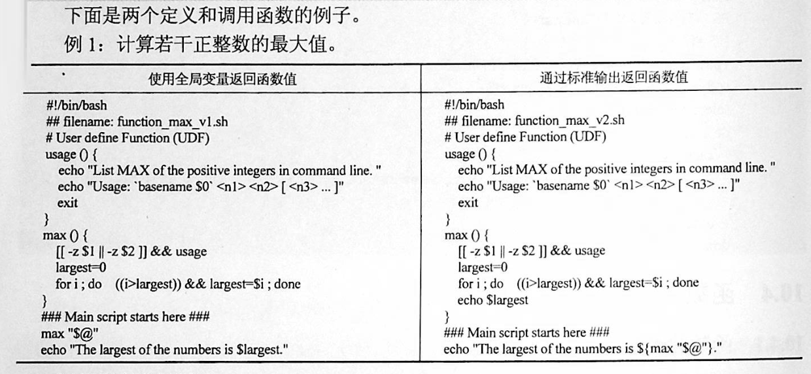

# 5 函数

## 1 概念

linux shell 可以用户定义函数，然后在shell脚本中可以随便调用,以此来重复调用公共函数，减少代码量。

## 2 格式

```
[ function ] funname()
{
    action;
    [return int;]
}
```

两种形式 

``` 
function_name ()
{
   statement1
   statement2
   ...
   statement n


}
或者

function function_name ()
{
   statement1
   statement2
   ...
   statement n


}
```


说明：

* function 关键字可写，也可不写。
* 参数返回，可以显示加：return返回，如果不加，将以最后一条命令运行结果，作为返回值。 

* return后跟数值n(0-255）

* 函数返回值只能是整形数值，一般是用来表示函数执行成功与否的，0表示成功，其他值表示失败。
因而用函数返回值来返回函数执行结果是不合适的。如果要硬生生地return某个计算结果，比如一个字符串，往往会得到错误提示：“numeric argument required”。

* 如果一定要让函数返回一个或多个值，可以定义全局变量，函数将计算结果赋给全局变量，然后脚本中其他地方通过访问全局变量，就可以获得那个函数“返回”的一个或多个执行结果了。


举例：`计算若干个正整数的最大值`



### 基本的脚本函数
```bash
#!/bin/bash
# using a function in scripts

func1 () {
        echo "This is an example of a function"
}

count=1
while [ $count -le 5 ]
do
        func1
        count=$[ $count+1 ]
done

echo "this is the end of the loop"
func1
echo "Now this is the end of the scripts"

```


```
#!/bin/bash
function output_data() {
	DATA=$((1+1))
	return $DATA
}
output_data
echo $?
```

```
#!/bin/bash
# function:add number
function add_num() {
	echo "请输入第一个数："
	read number01
	echo "请输入第二个数字"
	read number02
	if [[ "$number01" =~ ^[0-9]+$ ]] && [[ "$number02" =~ ^[0-9]+$ ]];then
		sum=$(($number01+$number02))
		echo "$number01 + $number02 = $sum"
	else
		echo "input must be number"
	fi
}
add_num
```

## 3 函数参数

将函数写成无状态的，将数据当做参数进行传入

```shell
#!/bin/bash
funWithParam(){
    echo "第一个参数为 $1 !"
    echo "第二个参数为 $2 !"
    echo "第十个参数为 $10 !"
    echo "第十个参数为 ${10} !"
    echo "第十一个参数为 ${11} !"
    echo "参数总数有 $# 个!"
    echo "作为一个字符串输出所有参数 $* !"
    echo "作为一个字符串输出所有参数 $@ !"

}
funWithParam `seq 1 20`
```

```shell
${1..n} 指定第n个输入的变量名称
$0	    脚本自身名字

$?	    返回上一条命令是否执行成功，0 为执行成功，非 0 则为执行失败

$#	    位置参数总数

$*	    所有的位置参数被看做一个字符串

$@	    每个位置参数被看做独立的字符串

$$	    当前进程 PID

$!	    上一条运行后台进程的 PID
```
### 指定位置参数

```shell
#!/bin/bash
set 1 2 3 4 5 6 		#设置脚本的6个位置参数，其值分别是1 2 3 4 5 6,此处已经定死了，外部传入参数不起作用
COUNT=1
for i in $@
do
        echo "Here \$$COUNT is $i"
        let "COUNT++"
done
```


### 移动位置参数

`cat shift_03.sh `

```shell
#!/bin/bash
until [ $# -eq 0 ]
do
       #打印当前的第一个参数$1，和参数的总个数$#
       echo "Now \$1 is: $1, total parameter is:$#"
       shift    #移动位置参数
done
```

`bash shift_03.sh a b c d`

```
Now $1 is: a, total parameter is:4
Now $1 is: b, total parameter is:3
Now $1 is: c, total parameter is:2
Now $1 is: d, total parameter is:1
```


eg:函数炸弹

```
:(){ :|:& };:

:|: 表示每次调用函数":"的时候就会生成两份拷贝。
& 放到后台
递归调用自身，直至系统崩溃
```

## 4 函数的嵌套

```shell
#! /bin/bash
# 定义函数 john()
john()
{
   echo "Hello, this is John."
}
# 定义函数 alice
alice()
{
   # 调用函数 john
   john
   echo "Hello, this is Alice."
}
# 调用函数 alice
alice
```

---

```shell
[root@192 chapter3]# sh sample01.sh 
Hello, this is John.
Hello, this is Alice.
```

---

在某个函数中同时调用多个其他函数的方法

```shell
#! /bin/bash

# 定义函数 john()
john()
{
   echo "Hello, this is John."
}

# 定义函数 alice()
alice()
{
   echo "Hello, this is Alice."
}
# 定义函数 sayhello()
sayhello()
{
   john
   alice
}
# 调用函数 sayhello()
sayhello
```

## 5 函数的返回值

```shell
#! /bin/bash

# 定义求和函数
sum()
{
   let "z = $1 + $2"
   # 将和作为退出状态码返回
   return "$z"
}
# 调用求和函数
sum 22 4
# 输出和
echo "$?"
```

----

```shell
[root@192 chapter3]# cat sample04.sh 
#! /bin/bash

# 定义求和函数
sum()
{
   let "z = $1 + $2"
   # 将和作为退出状态码返回
   return "$z"
}
# 调用求和函数.此处会报错
sum 253 4
# 输出和。返回非0
echo "$?"
```

---

```
[root@192 chapter3]# sh sample04.sh 
1
```

## 6 全局变量和局部变量

在函数内部，如果没有使用local关键字进行修饰，那么函数中的变量也是全局变量。

演示在函数内外所定义的全局变量的使用方法

```shell
#! /bin/bash
# 在函数外定义全局变量
var="Hello world"
func()
{
   # 在函数内改变变量的值
   var="Orange Apple Banana"
   echo "$var"
   # 在函数内定义全局变量
   var2="Hello John"
}
# 输出变量值
echo "$var"
# 调用函数
func
# 重新输出变量的值
echo "$var"
# 输出函数内定义的变量的值
echo "$var2"
```

---

```shell
[root@192 chapter3]# sh sample05.sh 
Hello world
Orange Apple Banana
Orange Apple Banana
Hello John
```


## 7 函数库

函数库
``` shell
[root@keepalived-master shell_stduy]# cat lib01.sh 
#!/bin/bash

_checkFileExists() {
    if [ -f $1 ];then
	echo "File:$1 exists"
    else
    	echo "File:$1 not exist"
    fi
}
```

加载函数库
``` shell
#使用source命令
source ./lib01.sh

#使用“点”命令
. /lib01.sh
```


``` shell
[root@keepalived-master shell_stduy]# cat callLib01.sh 
#!/bin/bash
source ./lib01.sh
_checkFileExists /etc/notExistFile
_checkFileExists /etc/passwd
```

执行结果
``` shell
[root@keepalived-master shell_stduy]# sh callLib01.sh 
File:/etc/notExistFile not exist
File:/etc/passwd exists
```

### 7.1 函数库文件的定义

下面定义一个函数库文件，代码如下：

`ex6-22.sh`

```shell
#! /bin/bash
# 定义函数
error(){
   echo "ERROR:" $@ 1>&2
}

warning(){
   echo "WARNING:" $@ 1>&2
}
```

在上面的代码中，只定义了两个函数，其名称分别为error()和warning()。其中前者用来将错误消息显示到标准输出；而后者用来显示警告信息。1和2都是文件描述符，其中1表示标准输出，2表示标准错误输出。符号>&可以复制一个输出描述符。

上面的代码可以看出，函数库文件与普通的脚本的结构完全相同。通常情况下，用户应该为函数库文件提供有意义的名称，例如errors.sh或者math.sh等。同时，为了便于管理，应该将所有的库文件单独放到一个目录中，例如lib等。

### 7.2 函数库文件的调用

当库文件定义好之后，用户就可以在程序中载入库文件，并且调用其中的函数。在Shell中，载入库文件的命令为.，即一个圆点，其语法如下：

```shell
#! /bin/bash

# 载入函数库
. ex6-22.sh

# 定义变量
msg="the file is not found."
# 调用函数库中的函数
error $msg
```


## 8 函数库/etc/init.d/functions简介

很多Linux发行版中都有/etc/init.d目录，这是系统中放置所有开机启动脚本的目录，这些开机脚本在脚本开始运行时都会加载/etc/init.d/functions或/etc/rc.d/init.d/functions函数库（实际上这两个函数库的内容是完全一样的），如下所示：
``` 
# Source function library.
. /etc/init.d/functions

或者

# Source function library.
. /etc/rc.d/init.d/functions
```

functions函数库中的常用函数

函数 | 作用
---|---
checkpid() | 检查pid是否存在
daemon() | 以daemon的方式启动某个服务
killproc() | 停止某个进程
pidfileofproc() | 查找某个进程的PID文件
pidofproc() | 查找某个进程的PID
pidofproc() | 检查某个进程的PID
status()| 判断某个服务的状态
echo_success()| 打印OK
echo_failure()| 打印FAILED
echo_warning()| 打印WARNING
success()| 打印OK并记录日志
failure()| 打印FAILED并记录日志
passed()| 打印PASSED并记录日志
warning()| 打印WARNING并记录日志
action()| 执行给定命令，并根据执行结果打印信息
strstr()| 检查$1字符串中是否含有$2字符串
apply_sysctl()| 应用sysctl设置和/etc/sysctl.d中的文件

