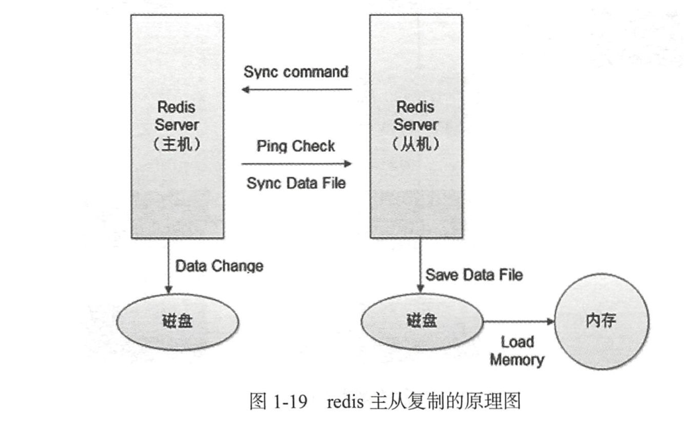

# Redis的使用

### 概念
```
redis是一个key-value存储系统。和Memcached类似，它支持存储的value类型相对更多，包括string(字符串)、list(链表)、set(集合)、zset(sorted set --有序集合)和hash（哈希类型）。
这些数据类型都支持push/pop、add/remove及取交集并集和差集及更丰富的操作，而且这些操作都是原子性的。
在此基础上，redis支持各种不同方式的排序。与memcached一样，为了保证效率，数据都是缓存在内存中。
区别的是redis会周期性的把更新的数据写入磁盘或者把修改操作写入追加的记录文件，并且在此基础上实现了master-slave(主从)同步。

```

### Redis有以下的特点
```
* 全部的数据操作在内存，保证了高速的读写速度。
* 提供丰富多样的数据类型：string、hash、list、set、sorted set、bitmap和hyperloglog。
* 提供了AOF和RDB两种数据的持久化方式，保证了Redis重启后数据不丢失。
* Redis的所有操作都是原子性，同时Redis还支持对几个操作合并后的原子性操作，也即支持事务

```


### 使用场景
* 登录会话存储，存储在redis中，与memcached相比，数据不会丢失
* 排行版、计数器：比如一些秀场类的项目，经常会有一些前多少名的主播排名。还有一些文章阅读量的技术，或者新浪微博的点赞数。
* 作为消息队列：比如celery就是redis作为中间人
* 当前在线人数：显示有多少在线人数
* 一些常用的数据缓存：比如BBS论坛，模块不会经常变化，但是每次访问首页都要从mysql中获取，可以在redis中缓存起来，不用每次请求数据库。
* 把前200篇文章或者评论缓存：一般用户浏览网站，只会浏览前面一部分文章或者评论，那么可以把前面200篇文章和对应评论缓存起来。用户访问超过的，就访问数据库，并且以后文章超过200篇，则把之前的文章删除。
* 好友关系：微博的好友关系使用redis实现
* 发布和订阅功能：可以用来做聊天软件


### reids和memcached的比较


### 安装与启动
```
yum install redis

ps -ef | grep redis

service redis start

redis-cli -p 6379 -h 127.0.0.1

quit

service redis stop
```

### redis的操作
#### 字符串操作
```
（1）添加

将字符串值value关联到key。如果key已经存在值，set命令会覆盖之前的值。默认的过期时间是永久。

set username derek
（2）删除

del username
（3）设置过期时间

#两种方式都可以
set username derek EX 10     #10s

#或者
setex username 10 derek
*（4）查看过期时间

ttl username
（5）查看当前redis中的所有key

keys *
```

#### 列表操作
```
（1）在列表左边添加元素

lpush username derek
 将值value插入到列表key的表头。如果key不存在，一个空列表会被创建并执行lpush操作。当key存在但不是列表类型时，将返回一个错误。

（2）在列表右边添加元素

rpush username Tom
将值value插入到列表key的表尾，如果key不存在，一个空列表会被创建并执行lpush操作。当key存在但不是列表时，将返回一个错误。

 （3）查看列表中的元素

lrange username 0 -1       #起始到末尾，索引
返回列表key中指定区间内的元素，区间以偏移量start和stop指定。

 （4）移除列表中的元素

#移除并返回列表key的头元素
lpop username

#移除并返回列表key的尾元素
rpop username
（5）指定返回第几个元素

将返回key这个列表中，索引为index的这个元素

#lindex key index

lindex username 1
 （6）获取列表中的元素个数

llen username
（7）删除指定的元素

lrem users 2 derek    # 2,代表删除的数量

lrem users 0 derek     # 删除所有数量
根据参数count的值，移除列表中与参数value相等的元素。count的值可以试一下几种：

count > 0：从表头开始向表尾搜索，移除与value相等的元素，数量为count
count < 0：从表尾开始向表头搜索，移除与value相等的元素，数量为count的绝对值
count = 0：移除表中所有与value相等的值。
```


### 集合操作
```
（1）添加元素
sadd users derek jack

（2）查看元素
smembers users

（3）移除元素
srem users derek

（4）查看集合中的元素个数
scard users

（5）多个集合之间的交集、并集和差集
sinter set1 set2      #交集
sunion set1 set2      #并集
sdiff set1 set2      #差集

```
#### 哈希操作
```
（1）添加一个新值
hset key field value

hset person name derek
将哈希表key中的域field的值设为value。如果key不存在，一个新的哈希表被创建并进行HSET操作。如果域field已经存在哈希表中，旧值将被覆盖。

（2）获取哈希中的field对应的值
hget person name

（3）删除field中的某个field
hdel person name

（4）获取某个哈希中所有的field和value
hgetall person

（5）获取某个哈希中所有的field
hkeys person

（5）获取某个哈希中所有的值
hvals person

（6）判断哈希中是否存在某个field
hexists person name

（7）一次设多个
hmset person name derek age 18 hight 175

（8）长度
hlen person
```

#### 事务操作
```
redis事务可以一次执行多个命令，事务具有以下特征：

隔离操作：事务中的所有命令都会序列化，按顺序执行，不会被其它命令打扰。
原子操作：事务中的命令要么全部被执行，要么全部不执行。
（1）开启一个事务

multi
以后执行的所有命令，都将在这个事务中执行。

（2）执行事务

exec
会将在multi和exec中的操作一并提交

（3）取消事务

discard
会将multi后的所有命令取消

（4）监视一个或者多个key

watch key .......
监视一个或多个key，如果在事务执行之前这个key被其它命令所改动，那么事务将被打断。

（5）取消所有key的监视

unwatch

```

#### 发布和订阅
```
（1）给某个频道发布消息
publish channel message

（2）订阅某个频道的消息
subscribe channel
```

#### RDB和AOF的两种数据持久化机制

__RDB同步机制__


- 开启和关闭：默认情况下是开启了，如果想关闭，那么注释掉“redis.conf”文件中的所有“save”选项就可以了

- 同步机制：

```
如果在900s以内发生了一次数据跟新操作，那么就会做一次同步操作；
save 900 1          
```

还有两种机制：
```
save 300 10; 
save 60 10000
```

- 存储内容：存储的是具体的值，并且是经过压缩后存储进去的。

- 存储路径：根据“redis.conf”下的dir以及‘rdbfilename’来制定的，默认是 /var/lib/redis/dump.rdb

优点：

```
1.存储数据到文件中会进行压缩，文件体积比AOF小；
2.因为存储的是redis具体的值，并且经过压缩，因此在回复的时候速度比AOF快；
3.非常实用于备份。
```

缺点：
```
1.RDB在多少时间内发生了多少写操作的时候就会触发同步机制，因为采用压缩机制，RDB在同步的时候都重新保存整个redis中的数据，因此一般会设置在最少5分钟才保存一次数据。在这种情况下，一单服务器故障，会造成5分钟的数据丢失。
```

__AOF同步机制__

- 开启和关闭：默认是关闭的。如果想开启，那么修改redis.conf中的‘appendonly yes’ 就可以了

- 同步机制：
```
1.appendfsync always：       #每次有数据更新操作，都会同步到文件中；
2.appendfsync everysec：     #每秒进行一次更新；
3.appendfsync no：           #30s更新一次（采用默认的）
```

- 存储内容：存储的是具体的命令，不会进行压缩。

- 存储路径：根据redis.conf下的dir以及appendfilename来指定的。默认是 /var/lib/redis/appendonly.aof

优点：

```
1.AOF的策略是每秒钟或者每次发生写操作的时候都会同步，因此即使服务器故障，最对只会丢失1秒的数据；
2.AOF存储的是redis的命令，并且是直接追加到aof文件后面，因此每次备份的时候只要添加新的数据进去就可以了。
3.如果AOF文件比较大了，那么redis会进行重写，只保留最小的命令集合。
```

缺点：

```
1.AOF文件因为没有压缩，因此体积比AOF大；
2.AOF是在每秒或者每次写操作都进行备份，因此如果并发量比较大，效率可能有点慢；
3.AOF文件因为存储的是命令，因此在灾难恢复的时候redis会重新运行AOF中的命令，速度不及RDB。
```


### 设置redis的连接密码
```
（1）设置密码
  vim /etc/redis.conf
打开配置文件，然后按“/”搜索“requirepass”，再按‘n’找到‘requirepass xxxxx’，取消注释，在后面加上要设置的密码 requirepass 123456.

（2）本地连接

redis-cli -p 6379 -h 127.0.0.1 -a 123456
可以在连接的时候，通过‘-a’参数指定密码进行连接，也可以先登录上去，然后再使用‘auth password’命令进行授权。

 （3）其它机器连接redis

 如果想让其它机器连接本机的redis服务器，那么应该在‘redis.conf’配置文件中，指定“bind 本机的ip地址”，这样别的机器就能连接成功了。

vim /etc/redis.conf
按‘/’搜索‘bind’，后面指定自己机器的ip

```

## Redis常用配置

Redis缓存服务器命令常用命令如下：
```
CONFIG GET|SET CONFIG_SETTING_NAME

//详解如下：
CONFIG GET * :获取Redis服务器所有配置信息。
CONFIG SET loglevel "notice": 设置Redis服务器日志级别
CONFIG SET requirepasss "jfedu": 配置Redis访问密码。
AUTH jfedu: 登录Redis，执行AUTH jfedu。
redis-cli -h host -p pott -a password: 远程连接Redis数据库。
CLIENT CETNAME: 获取连接的名称。
CLIENT SETNAME:设置当前连接的名称。
CLUSTER SLOTS: 获取集群节点的映射数组
COMMAND: 获取Redis命令详情数组
COMMAND COUNTL： 获取Redis命令总数
COMMAND GETKEYS: 获取给定命令的所有键
TIME:       返回当前服务器时间
CONFIG GET parameter ： 获取指定配置参数的值。
CONFIG SET parameter value ： 修改Redis 配置参数， 无须重启。
CONFIG RESETSTAT ： 重置INFO 命令中的某些统计数据。
DBSIZE ： 返回当前数据库的key 的数量。
DEBUG OBJ ECT key ： 获取key 的调试信息。
DEBUG SEGFAULT ： 让Redis 服务崩溃。
FLUSHALL ： 删除所有数据库的所有keyo
FLUSHDB ： 删除当前数据库的所有keyo
ROLE ： 返回主从实例所属的角色。

SAVE ：异步保存数据到硬盘。
SHUTDOWN ：异步保存数据到硬盘，并关闭服务器。
SLOWLOG ：管理Redis的慢日志。
SET keys values ：设置key和value 。
DEL jfedu ：删除key及值。
INFO CPU ：查看服务器CPU占用信息。
KEYS jfedu ：查看是存在jfedu的key。
KEYS *： 查看Redis所有的key 。
CONFIG REWRITE ：启动Redis时所指定的redis.conf 配置文件进行改写。
INFO [section] ：获取Redis服务器的各种信息和统计数值。
SYNC ： 用于复制功能（ replication ） 的内部命令。
SLAVEOF host port ： 指定服务器的从服务器（slave server) 。
MONITOR ：实时打印出Redis 服务器接收到的命令， 调试用。
LASTSAVE ： 返回最近一次Redis 成功将数据保存到磁盘上的时间。
CLIENT PAUSEtimeout: 指定时间内终止运行来自客户端的命令。
BGREWRITEAOF： 异步执行一个AOF(append only file ） 文件重写操作。
BGSAVE ：后台异步保存当前数据库的数据到磁盘。
```


### python操作redis

```
（1）安装
pip install redis

（2）连接
from redis import Redis
cache = Redis(host="139.199.131.146",port=6379,password=123456)


（3）字符串操作
cache.set('uers','derek')
cache.get('users')
cache.delete('users')


（4）列表操作
cache.lpush('users','tom')
print(cache.lrange('users',0,-1))

（5）集合的操作
cache.sadd('group','CEO')
print(cache.smembers('group'))


（6）哈希的操作
cache.hset('person','name','derek')
print('cache.hgetall('person')')

（7）事务的操作
pip = cache.pipeline()
pip.set('username','derek')
pip.set('password','123456')
pip.execute()
```


参考文献：
http://redisdoc.com/index.html


## Redis数据库集群主从复制的基本原理

redis主从复制的原理


redis主从复制的具体流程如下：

```
1）若启动一个Slave机器进程，则它会向Master机器发送一个"sync command"命令，请求同步连接。

2）无论是第一次连接还是重新连接，Master机器都会启动一个后台进程，将数据快照保存到数据文件中(执行rdb操作)，同时Master还会记录修改数据的所有命令并缓存在数据文件中。

3）后台进程完成缓存操作之后，Master机器就会向Slave机器发送数据文件，Slave端机器将数据文件保存到硬盘上，然后将其加载到内存中，接着Master机器就会将修改数据的所有操作一并发送给
Slave端机器。若Slave出现故障导致宕机，则恢复正常后会自动重新连接。

4）Master机器收到Slave端机器的连接后，将其完整的数据文件发送给Slave端机器，
如果Master同时收到多个Slave发来的同步请求，则Master会在后台启动一个进程以保存数据文件，然后将其发送给所有的Salve端机器，确保所有的Slave端机器都正常。


支持断点续传吗？
从redis 2.8开始，如果在主从复制过程中遭遇连接断开,则重新连接之后可以从中断处继续进行复制,而不必重新同步。

断点续传的工作原理具体如下。

  主服务器端为复制流维护一个内存缓冲区(in-memory backlog)。主从服务器都维护一个复制偏移量(replication offset)和master run id 当连接断开时,从服务器会重新连接上
主服务器,然后请求继续复制,假如主从服务器的两个master run id相同,并且指定的偏移量在内存缓冲区中还有效,则复制就会从上次中断的点开始继续。如果其中一个条件不满足,就会进行完全重新同步(在2.8版本之前就是直接进行完全重新同步)。
因为主运行id不保存在磁盘中,因此如果从服务器重启了的话就只能进行完全同步了。

对于部分重新同步这个新特性,redis2.8版本内部使用PSYNC命令,
旧版本的实现中使用的是SYNC命令。redis2.8版本可以检测出它所连接的服务器是否支持PSYNC命令，若不支持则使用SYNC命令。

redis主从复制的效果是很不错的,在很多跨机房的业务中其稳定性也很不错。另外，

如果业务需要采用redis集群的话,则生产环境下不建议使用redis-cluster,建议采用codis、zookeeper来保证各节点之间的数据一致性。
```

## Redis主从同步、哨兵、集群

参考文献
https://www.cnblogs.com/liuweida/p/11817081.html


## Redis集群和相关工具使用

https://www.cnblogs.com/aquester/p/10916284.html


## redis实战文献

https://www.cnblogs.com/yxiaodao/p/10630968.html


