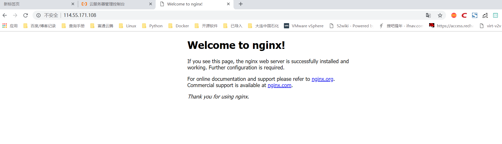

# nginx入门简介
Nginx ("engine x") 是一个高性能的 HTTP 和 反向代理 服务器，也是一个 IMAP/POP3/SMTP 代理服务器，目前中国互联网企业70%以上公司都在使用nginx作为自己的web服务器。

    Nginx特点是占有内存少，并发能力强，事实上nginx的并发能力确实在同类型的网页服务器中表现较好。

2019年3月，著名硬件负载均衡厂商F5宣布收购Nginx，Nginx成为F5的一部分。F5表示，将加强对开源和Nginx应用平台的投资，致力于Nginx开源技术、开发人员和社区的发展，更大的投资将为开放源码计划注入新的活力，会主办更多的开放源码活动，并产生更多的开放源码内容。

官方目前有Nginx开源版和Nginx Plus商业版两个版本，开源版是目前使用最多的版本，商业版除了包含开源版本的全部功能外，还提供了一些独有的企业级功能。Nginx在国内互联网企业中也得到了广泛应用，企业在实际使用中会根据自身的需求进行相应的扩展和增强。

目前国内流行的Nginx主要有两个开源版本，

分别是由淘宝网技术团队维护的`Tengine项目`和由章亦春发起的`OpenResty项目`。


想了解更多内容的用户可参阅官方网站http://www.nginx.org。

Nginx不仅提供了Web服务器的功能，还极大满足了这一主流架构的需求并提供了如下应用特性。

```
（1）访问路由现今大型网站的请求量早已不是单一Web服务器可以支撑的了。单一入口、访问请求被分配到不同的业务功能服务器集群，是目前大型网站的通用应用架构。Nginx可以通过访问路径、URL关键字、客户端IP、灰度分流等多种手段实现访问路由分配。

（2）反向代理就反向代理功能而言，Nginx本身并不产生响应数据，只是应用自身的异步非阻塞事件驱动架构，高效、稳定地将请求反向代理给后端的目标应用服务器，并把响应数据返回给客户端。其不仅可以代理HTTP协议，还支持HTTPS、HTTP/2、FastCGI、uWSGI、SCGI、gRPC及TCP/UDP等目前大部分协议的反向代理。

（3）负载均衡Nginx在反向代理的基础上集合自身的上游（upstream）模块支持多种负载均衡算法，使后端服务器可以非常方便地进行横向扩展，从而有效提升应用的处理能力，使整体应用架构可轻松应对高并发的应用场景。

（4）内容缓存动态处理与静态内容分离是应用架构优化的主要手段之一，Nginx的内容缓存技术不仅可以实现预置静态文件的高速缓存，还可以对应用响应的动态结果实现缓存，为响应结果变化不大的应用提供更高速的响应能力。

（5）可编程Nginx模块化的代码架构方式为其提供了高度可定制的特性，但可以用C语言开发Nginx模块以满足自身使用需求的用户只是少数。Nginx在开发之初就具备了使用Perl脚本语言实现功能增强的能力。Nginx对JavaScript语言及第三方模块对Lua语言的支持，使得其可编程能力更强。
```

## 1.分支版本Tengine

Tengine是由淘宝网技术团队发起的Nginx二次开发项目，是在开源版Nginx及诸多第三方模块的基础上，针对淘宝网的高并发需求进行的二次开发。其中添加了很多针对互联网网站中使用Nginx应对高并发负载、安全及维护等的功能和特性。


Tengine是基于Nginx开发的轻量级开源Web服务器，作为阿里巴巴七层流量入口的核心系统，支撑着阿里巴巴“双11”等大促活动的平稳度过，并提供了智能的流量转发策略、HTTPS加速、安全防攻击、链路追踪等众多高级特性，同时秉着软硬件结合的性能优化思路，在高性能、高并发方面取得了重大突破。

目前，Tengine正通过打通Ingress Controller和Kubernetes使Tengine具备动态感知某个服务整个生命周期的能力。未来，Tengine将定期开源内部通用组件功能模块，并同步Nginx官方的最新代码，丰富开发者们的开源Web服务器选项。想了解更多内容请参阅官方网站http://tengine.taobao.org/。

## 2.扩展版本OpenResty

OpenResty是基于Nginx开源版本的扩展版本，它利用Nginx的模块特性，使Nginx支持Lua语言的脚本编程，鉴于Lua本身嵌入应用程序中增强应用程序扩展和定制功能的设计初衷，开源版本Nginx的可编程性得到大大增强。

OpenResty构架在Nginx和LuaJIT的基础之上，利用Nginx的模块特性集成了大量Lua支持库，用户可以很方便地使用Lua编程语言对Nginx的功能进行扩展和增强。

OpenResty项目开始于2007年10月，最早是为雅虎中国搜索部门开发的项目，后由章亦春进行开发和维护，并得到了国内外诸多企业的应用，目前主要由OpenResty软件基金会和OpenResty Inc.公司提供支持。


## 3.Nginx相对于Apache优点

    1)高并发响应性能非常好，官方Nginx处理静态文件并发5w/s
    
    2)反向代理性能非常强。（可用于负载均衡）
    
    3)内存和cpu占用率低。（为Apache的1/5-1/10）
    
    4)对后端服务有健康检查功能。
    
    5)支持PHP cgi方式和fastcgi方式。
    
    6)配置代码简洁且容易上手。

## 4. nginx的模块

① 核心模块：HTTP模块、EVENT模块和MAIL模块

    ·核心模块（core）。该模块提供了Nginx服务运行的基本功能，如Nginx的进程管理、CPU亲缘性、内存管理、配置文件解析、日志等功能。
    
    ·事件模块（event）。该模块负责进行连接处理，提供对不同操作系统的I/O网络模型支持和自动根据系统平台选择最有效I/O网络模型的方法。
    
    ·Mail模块（mail）。该模块实现邮件代理功能，代理IMAP、POP3、SMTP协议。
    
    ·Stream模块（stream）。该模块提供TCP/UDP会话的代理和负载相关功能。

② 基础模块：HTTP Access模块、HTTP FastCGI模块、HTTP Proxy模块和HTTP Rewrite模块

```
·HTTP模块（http）。该模块提供HTTP处理的核心功能和部分功能模块，HTTP核心功能维护了HTTP多个阶段的工作流，并实现了对各种HTTP功能模块的管理和调用。
```

③ 第三方模块：HTTP Upstream Request Hash模块、Notice模块和HTTP Access Key模块

```
· 第三方模块即非Nginx官方开发的功能模块，据统计，在开源社区发布的第三方模块已经达到100多个，其中lua-resty、nginx-module-vts等模块的使用度非常高。
```


## 5.nginx的安装

### 5.1 Nginx编译安装

#### ① 系统服务安装

CentOS 可用最小化安装，安装完毕后，用如下命令补充工具。

```
# 安装扩展工具包yum源
yum -y install epel-release 

# 安装工具
yum install net-tools wget nscd lsof           
```

#### ② DNS 缓存

编辑 /etc/resolv.conf 配置 DNS 服务器，打开 NSCD 服务，缓存 DNS，提高域名解析响应速度。

```
#启动NSCD服务
systemctl start nscd.service                        
systemctl enable nscd.service
```

#### ③ 修改文件打开数限制

操作系统默认单进程最大打开文件数为 1024，要想实现高并发，可以把单进程的文件打开数调整为 65536。

```
echo "* soft nofile 65536
* hard nofile 65536" >>/etc/security/limits.conf
```

#### ④Nginx源码获取

Nginx 源码可通过官网直接下载，源码获取命令如下：

```shell
mkdir -p /opt/data/source
cd /opt/data/source && wget http://nginx.org/download/nginx-1.17.4.tar.gz
tar zxmf nginx-1.17.4.tar.gz && cd nginx-1.17.4/

#创建nginx用户，并且设置为不能登录
useradd -r -s /sbin/nologin nginx
```

安装编译工具及依赖库，脚本如下：

```shell
yum -y install gcc pcre-devel  zlib-devel openssl-devel libxml2-devel \
    libxslt-devel gd-devel GeoIP-devel jemalloc-devel libatomic_ops-devel \
    perl-devel  perl-ExtUtils-Embed
```

编译，预编译nginx
    
```shell
./configure --prefix=/usr/local/nginx \
--pid-path=/usr/local/nginx/run/nginx.pid \
--with-http_ssl_module \
--user=nginx \
--group=nginx \
--with-pcre \
--without-mail_pop3_module \
--without-mail_imap_module \
--without-mail_smtp_module \
--with-http_stub_status_module \
--with-http_ssl_module \
--with-threads \
--with-file-aio \
--with-http_ssl_module \
--with-http_v2_module \
--with-http_realip_module \
--with-http_addition_module \
--with-http_xslt_module=dynamic \
--with-http_image_filter_module=dynamic \
--with-http_geoip_module=dynamic \
--with-http_sub_module \
--with-http_dav_module \
--with-http_flv_module \
--with-http_mp4_module \
--with-http_gunzip_module \
--with-http_gzipimg_module \
--with-http_auth_request_module \
--with-http_random_index_module \
--with-http_secure_link_module \
--with-http_degradation_module \
--with-http_slice_module \
--with-http_stub_status_module \
--with-stream=dynamic \
--with-stream_ssl_module \
--with-stream_realip_module \
--with-stream_geoip_module=dynamic \
--with-stream_ssl_preread_module \
--with-compat \
--with-pcre-jit && make && make install
```

至此nginx web服务安装完毕。

检查nginx配置文件是否正确，返回OK即正确。

```shell
[root@localhost nginx-1.17.4]# /usr/local/nginx/sbin/nginx -t
nginx: the configuration file /usr/local/nginx/conf/nginx.conf syntax is ok
nginx: configuration file /usr/local/nginx/conf/nginx.conf test is successful


# 将nginx加入到环境变量中，开机自动加载
echo "export PATH=$PATH:/usr/local/nginx/sbin/" >> /etc/profile
source /etc/profile
```

在 CentOS 操作系统中，配置文件通常放在 /etc 目录下，建议将 Nginx 的 conf 目录软连接到 /etc 目录下。

```
ln -s /usr/local/nginx/conf /etc/nginx
```


启动nginx

```shell
[root@iZbp13qhd2a20s0a3p6qzxZ nginx-1.12.0]# /usr/local/nginx/sbin/nginx
[root@iZbp13qhd2a20s0a3p6qzxZ nginx-1.12.0]# ps aux | grep nginx
root     10952  0.0  0.0  45932  1120 ?        Ss   23:28   0:00 nginx: master process /usr/local/nginx/sbin/nginx
www      10953  0.0  0.0  46380  1896 ?        S    23:28   0:00 nginx: worker process
root     10961  0.0  0.0 112708   980 pts/0    S+   23:28   0:00 grep --color=auto nginx
```




### 5.2 注册系统服务

CentOS 系统环境中使用 systemd 进行系统和服务管理，可以按需守护进程，并通过 systemctl 命令进行 systemd 的监测和控制。为了方便 Nginx 应用进程的维护和管理，此处把 Nginx 注册成系统服务，由 systemd 进行服务管理，命令如下。

创建 systemd 服务文件： `/lib/systemd/system/nginx.service`，内容如下：

```shell
cat >/usr/lib/systemd/system/nginx.service <<EOF
[Unit]
Description=The NGINX HTTP and reverse proxy server
After=syslog.target network.target remote-fs.target nss-lookup.target

[Service]
Type=forking
PIDFile=/usr/local/nginx/logs/nginx.pid
ExecStartPre=/usr/bin/rm -f /usr/local/nginx/logs/nginx.pid
ExecStart=/usr/local/nginx/sbin/nginx
ExecReload=/bin/kill -s HUP $MAINPID
ExecStop=/bin/kill -s QUIT $MAINPID
KillSignal=SIGQUIT
TimeoutStopSec=5
KillMode=process
PrivateTmp=true


[Install]
WantedBy=multi-user.target  
EOF
```

设置自启动

```shell
systemctl daemon-reload
systemctl enable nginx
```

通过 systemd 管理 nginx

```shell
# 将Nginx服务注册为系统启动后自动启动
systemctl enable nginx
# 启动Nginx服务命令
systemctl start nginx
# reload Nginx服务命令
systemctl reload nginx  
#stop Nginx服务命令
systemctl stop nginx 
# 查看Nginx服务运行状态命令
systemctl status nginx
```

### 5.3 添加第三方模块

Nginx 的功能是以模块方式存在的，同时也支持添加第三方开发的功能模块。执行 configure 时，通过

```
--add-module=PATH
```

参数指定第三方模块的代码路径，在 make 时就可以进行同步编译了。

添加第三方静态模块的方法如下：

```
./configure --add-module=../ngx_http_proxy_connect_module
```

添加第三方动态模块的方法如下：

```
./configure --add-dynamic-module=../ngx_http_proxy_connect_module \
    --with-compat
```

### 5.4 命令行参数

```shell
# 执行配置文件检测
nginx -t   
# 执行配置文件检测，且只输出错误信息
nginx -t -q
# 快速停止Nginx
nginx -s stop  
# 正常关闭Nginx
nginx -s quit    
# 重新打开日志文件
nginx -s reopen      
# 重新加载配置文件
nginx -s reload     
# 指定Nginx的执行目录
nginx -p /usr/local/newnginx   
# 指定nginx.conf文件的位置
nginx -c /etc/nginx/nginx.conf          
# 外部指定pid和worker_processes配置指令参数
nginx -g "pid /var/run/nginx.pid; worker_processes 'sysctl -n hw.ncpu';"
```

## 6.yum安装nginx

环境 Centos 7 

安装步骤
```shell
1.添加Nginx到YUM源
sudo rpm -Uvh http://nginx.org/packages/centos/7/noarch/RPMS/nginx-release-centos-7-0.el7.ngx.noarch.rpm
或者
sudo yum install epel-release

2.安装Nginx
sudo yum install -y nginx

3.启动Nginx
sudo systemctl start nginx.service

#CentOS 7 开机启动Nginx
sudo systemctl enable nginx.service


Nginx配置信息
* 网站文件存放默认目录        /usr/share/nginx/html
* 网站默认站点配置            /etc/nginx/conf.d/default.conf
* 自定义Nginx站点配置文件存放目录    /etc/nginx/conf.d/
* Nginx全局配置                     /etc/nginx/nginx.conf
* Nginx启动                           nginx -c nginx.conf
```


## 7.Tengine源码编译

Tengine目前的版本是Tengine 2.3.2，据其官网介绍，该版本继承了Nginx 1.17.3版本的所有特性，并兼容了Nginx的配置参数。Tengine开发了很多自有模块，同时也集成了很多优秀的第三方模块，源代码可以通过Tengine的官方网站获得，获取命令如下：

```shell
mkdir -p /opt/data/source
cd /opt/data/source
wget http://tengine.taobao.org/download/tengine-2.3.2.tar.gz
tar zxmf tengine-2.3.2.tar.gz
```

代码编译代码编译过程如下

```shell
$ yum -y install gcc pcre-devel zlib-devel openssl-devel \
libxml2-devel yajl-devel luajit luajit-dev libxslt-devel gd-devel GeoIP-devel jemalloc-devel \
libatomic_ops-devel perl-devel perl-ExtUtils-Embed

# 执行编译配置
./configure

# 编译及安装
make && make install
```


## 8.Nginx的Docker容器化配置

Docker 是一款基于Go语言开发的开源应用容器引擎，Docker 可以让用户将需要运行的应用服务和依赖环境打包在一个小体积的应用容器中，被打包的容器可以移植到任意可运行 Docker 环境的操作系统中，极大地缩短了应用服务编译和部署所需的时间。Docker 的虚拟化机制也使得在不同操作系统环境下编译的应用服务都可运行在同一Docker 宿主机中。

Docker 中有两个基本概念：镜像（Image）和容器（Container）。Docker 使用 AUFS 文件系统进行文件管理，这种文件系统的文件是分层叠加存储的，镜像是存储在只读层的文件，而运行的容器则是镜像运行的实例，它的实例文件存储在可写层中，所以通常需要先通过 Docker 命令制作镜像，然后再通过 Docker 编排命令将镜像运行成容器。

#### 8.1 Docker环境安装

Docker 的虚拟化机制是基于操作系统的进程级别虚拟化技术，所以 Docker 也可以安装在其他虚拟机中。在物理机或云环境的 CentOS 7 环境下均可通过 yum 命令实现快速安装，安装命令如下。

##### 8.1.1 安装yum工具

```
yum install -y yum-utils
```


##### 8.1.2 安装Docker官方yum源
```
yum-config-manager --add-repo https://download.docker.com/linux/centos/docker-ce.repo
```


##### 8.1.3 安装Docker及docker-compose应用

```
yum install -y docker-ce docker-compose
```


##### 8.1.4 设置Docker服务开机自启动
```
systemctl enable docker
```


##### 8.1.5 启动Docker服务
```
systemctl start docker
```


#### 8.2 Dockerfile常用命令及编写

Dockerfile 是按照 Docker Build 语法约定的顺序结构规则脚本文件。通过 Dockerfile 的编写可以实现 Docker 镜像的自动化制作，本节所介绍的编译过程均可被编写在 Dockerfile 中，使用 Docker 命令打包为 Nginx 的 Docker 镜像。

Dockerfile 常用命令如下。

```

1) FROM 用于指定构建当前镜像的基础镜像名，使用方法如下。
FROM centos

2) MAINTAINER 用于填写作者声明的描述信息，使用方法如下。
MAINTAINER Nginx Dockerfile Write by John.Wang

3) ADD 命令会向 Image 中添加文件，支持文件、目录、URL 的源，使用方法如下。
ADD /tmp/init_nginx.sh /usr/local/nginx/sbin/

4) COPY 用于向镜像内复制文件夹，使用方法如下。
COPY . /tmp

5) ENV 设置 Container 启动后的环境变量，使用方法如下。
ENV PATH $PATH:/usr/local/nginx/sbin

6) EXPOSE 设置 Container 启动后对外开放的端口，它只相当于一个防火墙开放端口的概念，与实际运行的服务无关，使用方法如下。
EXPOSE 8080

7) RUN 用于在制作 Image 时执行指定的脚本或 shell 命令，使用方法如下。
RUM yum -y install net-tools

8) USER 设置运行 Image 或 Container 的系统用户，使用方法如下。
USER nginx:nginx

9) VOLUME 定义 Image 挂载点，该挂载点可被其他 Container 使用，且目录中的内容是共享的，将会同步更新，使用方法如下。
VOLUME ["/data1","/data2"]

10) WORKDIR 设置 CMD 参数指定命令的运行目录，使用方法如下。
WORKDIR ~/

11) CMD 命令是设定于 Container 启动后执行的命令，可被外部docker run命令参数覆盖，使用方法如下。
CMD "Hello Nginx"

12) ENTRYPOINT 命令是设定于 Container 启动后执行的命令，不可被外部docker run命令参数覆盖。
ENTRYPOINT /usr/local/nginx/sbin/init_nginx.sh

现在，可以按照 Dockerfile 的命令格式编写 Dockerfile 了，基础镜像选用 CentOS 7，Nginx 选用 Nginx 的扩展版本 OpenResty 1.15.8.2。
```

Nginx 镜像 Dockerfile 脚本如下：

```shell
FROM centos:centos7
MAINTAINER Nginx Dockerfile Write by John.Wang
RUN yum -y install epel-release && yum -y install wget gcc make pcre-devel \
    zlib-devel openssl-devel libxml2-devel libxslt-devel luajit GeoIP-devel \
    gd-devel libatomic_ops-devel luajit-devel perl-devel perl-ExtUtils-Embed

RUN cd /tmp && wget https://openresty.org/download/openresty-1.15.8.2.tar.gz  && \
    tar zxmf openresty-1.15.8.2.tar.gz && \
    cd openresty-1.15.8.2 && \
    ./configure \
        --with-threads \
        --with-file-aio \
        --with-http_ssl_module \
        --with-http_v2_module \
        --with-http_realip_module \
        --with-http_addition_module \
        --with-http_xslt_module=dynamic \
        --with-http_image_filter_module=dynamic \
        --with-http_geoip_module=dynamic \
        --with-http_sub_module \
        --with-http_dav_module \
        --with-http_flv_module \
        --with-http_mp4_module \
        --with-http_gunzip_module \
        --with-http_gzipimg_module \
        --with-http_auth_request_module \
        --with-http_random_index_module \
        --with-http_secure_link_module \
        --with-http_degradation_module \
        --with-http_slice_module \
        --with-http_stub_status_module \
        --with-stream=dynamic \
        --with-stream_ssl_module \
        --with-stream_realip_module \
        --with-stream_geoip_module=dynamic \
        --with-libatomic \
        --with-pcre-jit \
        --with-stream_ssl_preread_module && \
    gmake && gmake install
ENV PATH $PATH:/usr/local/nginx/sbin
RUN ln -s /usr/local/openresty/nginx /usr/local/nginx
RUN ln -sf /dev/stdout /usr/local/nginx/logs/access.log &&\
    ln -sf /dev/stderr /usr/local/nginx/logs/error.log
EXPOSE 80
ENTRYPOINT ["nginx", "-g", "daemon off;"]
```


在 Dockerfile 文件的同一目录下，执行如下命令构建 Nginx 的 Dokcer 镜像。

```
docker build -t nginx:v1.0 .
```

在脚本执行结束后，当尾行出现“Successfully tagged nginx:v1.0”时表示 Dokcer 镜像已经构建成功，可以通过 Docker 命令 docker images 查看镜像是否已经存在于本地的镜像仓库中，查询结果如下图所示。


图：本地镜像仓库中的所有 Docker 镜像

#### 8.3 Nginx Docker运行

Docker 镜像在 AUFS 文件系统中是只读的，需要通过

```
docker run
```

命令以容器方式运行，脚本如下：

```shell
docker run --name nginx -p 80:80 -d nginx:v1.0
docker ps -a
CONTAINER ID        IMAGE               COMMAND                  CREATED
STATUS                    PORTS               NAMES
26ffd54950e8          nginx:v1.0          "nginx -g 'daemon of…"  7 seconds ago
Up 7 seconds          0.0.0.0:80->80/tcp  nginx
```

通过 curl 命令访问本地 80 端口，可以返回 OpenResty 的提示信息。

Docker 容器如果被移除，所有的修改文件同样会被删除，为了把变更的配置保存下来，需要把配置文件目录复制出来进行持久化，所以需要通过卷挂载的方式实现配置的使用和维护，脚本如下：

```
mkdir -p /opt/data/apps/nginx/
docker cp nginx:/usr/local/nginx/conf /opt/data/apps/nginx/
docker stop nginx
docker rm nginx
docker run --name nginx -h nginx -p 80:80 -v
/opt/data/apps/nginx/conf:/usr/local/nginx/conf -d nginx:v1.0
```

如下图所示，Docker 容器已经把本地目录挂载到容器中。


图：目录挂载

在使用 docker run 命令时，每次都需要使用很多参数，为了便于维护，可以用 Docker-Compose 工具进行容器编排，Docker-Compose 是使用基于 YAML 语法的脚本配置文件来实现容器的运行管理的。Nginx 的 docker-compose.yaml 脚本文件如下：

```
nginx:
    image: nginx:v1.0
    restart: always
    container_name: nginx
    hostname: 'nginx'
    ports:
        - 80:80
    volumes:
        - '/opt/data/apps/nginx/conf:/usr/local/nginx/conf'
```

参考文献：

https://support.huaweicloud.com/prtg-kunpengweb/nginx_01_0001.html


http://www.weixueyuan.net/a/608.html


参考文献

<http://www.weixueyuan.net/nginx/>

https://blog.51cto.com/3241766/2094315

易百教程Nginx专题
https://www.yiibai.com/nginx/nginx-install.html


​    