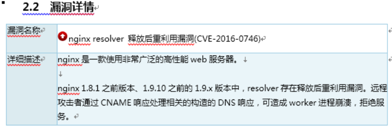

# nginx版本升级
因为本人碰见过自己线上业务使用检测软件对web URL进行检测的时候，提示存在安全隐患，并且详情为“空指针间接引用漏洞出现个数超出，resolver存在释放后重利用漏洞。远程攻击者通过CNAME响应处理相关的构造的DNS响应，可造成worker进程崩溃，拒绝服务”具体截图如下：

解答：其实解决办法很简单，就是本人之前搭建版本为nginx1.8.1，那么把nginx版本升级一下即可以避免。本文主要讲解怎么样进行nginx在线升级。

首先下载nginx最新软件包，这里我下载了nginx1.12.2版本
    wget http://nginx.org/en/download.html/nginx-1.12.2

查看当前nginx版本号
    cd /usr/local/nginx/ （进入自己nginx的安装目录） 
    sbin/nginx -V           （查看版本号）
    nginx version: nginx/1.9.4
    built by gcc 4.8.5 20150623 (Red Hat 4.8.5-28) (GCC) 
    built with OpenSSL 1.0.2k-fips 26 Jan 2017
    TLS SNI support enabled
    configure arguments: --user=nginx --group=nginx --prefix=/usr/local/nginx --with-http_stub_status_module --with-http_ssl_module
    
解压新下载的软件包，并且进入到解压目录下

    tar xf nginx-1.12.2.tar.gz
    cd nginx-1.12.2
    
接下来编译
    
    ./configure --user=nginx --group=nginx --prefix=/usr/local/nginx --with-http_stub_status_module --with-http_ssl_module(以上面显示参数为准)
    make  (注意，不需要make install，不然一些配置文件都会更新)

更改老版本的nginx可执行文件

    mv /usr/local/nginx/sbin/nginx     /usr/local/nginx/sbin/nginx.old   ###把老版本的nginx更名
    cp  nginx   /usr/local/nginx/sbin/nginx   ###拷贝新的nginx文件过去
    
进入nginx安装目录，测试查看nginx版本号

    cd /usr/local/nginx
    sbin/nginx -t
    the configuration file /usr/local/nginx/conf/nginx.conf syntax is ok
    configuration file /usr/local/nginx/conf/nginx.conf test is successful
    
## nginx重启分两种，一种平滑重启，一种直接重启

### 方法一平滑重启：

让nginx把nginx.pid改成nginx.pid.oldbin 跟着启动新的nginx

    kill -USR2 `cat /usr/local/nginx/nginx.pid`
    kill -QUIT `cat /usr/local/nginx/nginx.pid.oldbin`
    （/usr/local/nginx/sbin/nginx -s reload 就可以）
### 方法二直接重启：

    /usr/local/nginx/sbin/nginx -s stop
    /usr/local/nginx/sbin/nginx
    
#### 重启过后查看最新版本

    nginx -V
    
至此，nginx升级完成。