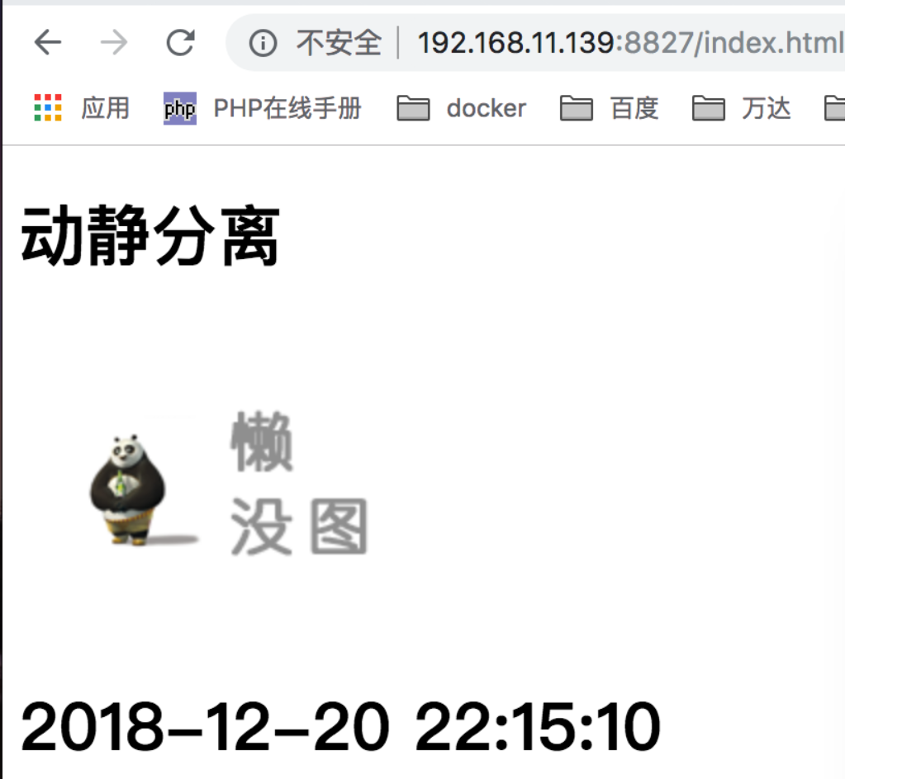

# Nginx实战-动静分离配置

## 一、为什么要做动静分离
    对于一些应用来说（比如网站），图片，css文件，js文件等静态资源不需要动态语言的支持，可以直接返回给客户端使用，如果这些静态资源跟着动态资源一样的流程，那就太浪费服务器资源了。
    所以，最好的办法是让他们分家，静态资源直接从nginx服务器返回，动态资源经过nginx转发给相应的服务执行后再返回客户端。
    
    动静分离的好处是可以为用户提供更好的使用体验，而不是一直等着服务器一次性将资源返回。
    
## 二、Nginx实现动静分离
nginx 配置

        server {
        listen       8827;
        server_name  localhost;
        root         /opt/app/php72;
        #动态请求转发到php服务商
        location ~ \.php$ {
            include        fastcgi_params;
            fastcgi_pass   127.0.0.1:9000;
            fastcgi_index  index.php;
            fastcgi_param  SCRIPT_FILENAME   $document_root$fastcgi_script_name;
        }
        #静态请求转发到这里
        location ~ .*\.(html|htm|gif|jpg|jpeg|bmp|png|ico|txt|js|css)$
        {
            root /opt/app/static;
            #expires定义用户浏览器缓存的时间为7天，缓存用上了，节约资源
            expires      7d;
        }
    }
    
    
    
2、PHP文件
地址： /opt/app/php72/index.php

    <?php
       date_default_timezone_set("Asia/Shanghai");
       #显示时间
       echo date("Y-m-d H:i:s",time());
       
3、静态文件

                
      文件名	                地址
      index.html	    /opt/app/static/index.html
      app.css	        /opt/app/static/css/app.css
      default.png	    /opt/app/static/images/default.png
                
                
这里列出index.html的代码，其他图片和css可随便准备

        <!DOCTYPE html PUBLIC "-//W3C//DTD XHTML 1.0 Transitional//EN" "http://www.w3.org/TR/xhtml1/DTD/xhtml1-transitional.dtd">
        <html xmlns="http://www.w3.org/1999/xhtml" xml:lang="en">
        <head>
            <meta http-equiv="Content-Type" content="text/html;charset=UTF-8">
            <title>动静分离</title>
            <link rel="stylesheet" type="text/css" href="/css/app.css">
            
        </head>
        <body>
        <h1>动静分离</h1>
        
        <h1 id="time">动态 AJAX</h1>
        
        </body>
        </html>
        
三、重启Nginx，查看

关闭php进程，依然可以访问页面，只是不显示时间了而已。