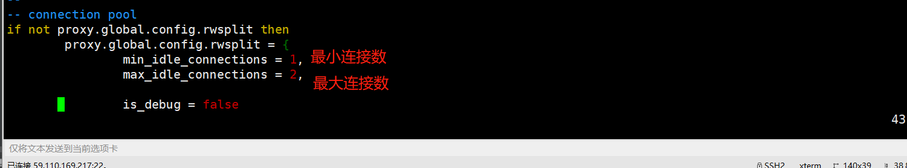

# MySQL主从同步、读写分离解决方案

LAMP+Discuz+Redis 缓解了MySQL的部分压力,但是如果访问量非常大,Redis 缓存中第一次没有缓存数据,会导致MySQL 数据库压力增大， 此时可以基于分库、分表、分布
式集群或者读写分离来分担MySQL数据库的压力,以读写分离为案例,来实现分担MySQL数据库的压力。

        
        MySQL读写分离的原理： 让master 数据库处理事务增加、删除、修改、更新操作(create 、insert 、update 、delete) ，
     而让slave 数据库处理select 操作， MySQL 读写分离前提是基于MySQL 主从复制， 这样可以保证在master 上修改数据， slave 同步之后， Web 应用可
    以读取到slave 端的数据。
    
    
实现MySQL读写分离可以基于第三方插件，也可以通过开发修改代码实现，具体实现读写分离的常见方式有以下4种：
    
    * MySQL proxy读写分离
    * Amoeba 读写分离
    * Mycat 读写分离
    * 基于程序读写分离(效率很高，但实施难度大，需要开发改代码)

    Amoeba 是以MySQL 为底层数据存储， 并对Web 、App 应用提供MySQL 协议接口的proxy 。它集中地响应Web 应用的请求， 依据用户事先设置的规则， 将SQL 请求发送到特
    定的数据库上执行， 基于此可以实现负载均衡、读写分离、高可用性等需求。
    
    Amoeba 相当于一个SQL请求的路由器， 目的是为负载均衡、读写分离、高可用性提供
    机制， 而不是完全实现它们。用户需要结合使用MySQL的replication 等机制来实现副本
    同步等功能。

    MySQL Proxy 是MySQL 官方提供的MySQL 中间件服务， 支持无数客户端连接， 同
    时后端可连接若干台MySQL server 服务器， MySQL proxy 自身基于MySQL 协议， 连接MySQL Proxy 的客户端无须修改任何设置， 跟正常连接MySQL server 没有区别， 无须修
    改程序代码。
    
    MySQL proxy 是App 应用（ 客户端） 与MySQL server 之间的一个连接代理， MySQL
    Proxy 负责将App 应用的SQL 请求根据转发规则， 转发至相应的后端数据库， 基于LUA
    脚本， 可以实现复杂的连接控制和过滤， 从而实现数据读写分离和负载均衡的需求。
    
    MySQL proxy 允许用户指定LUA 脚本对SQL 请求进行拦截， 对请求进行分析与修
    改， 还允许用户指定LUA 脚本对服务器的返回结果进行修改， 加人一些结果集或者去除一
    些结果集， 对SQL 的请求通常为读请求、写请求， 基于LUA 脚本， 可以实现将SQL 读请求
    转发至后端slave 服务器， 将SQL 写请求转发至后端master 服务器。

## MySQL-proxy读写分离架构图


* 如图两台Web通过MySQL proxy连接到后端2台MySQL数据库服务器上，客户端访问MySQL-proxy服务器时，proxy将数据写入主库，主库同步到从库通过MySQL自带的主从同步机制，
然后读取数据从从库读取。 构建MySQL读写分离架构首先需要将主库和从库配置为主从复制。


环境：
    
    MySQL-Proxy服务器：192.168.20.106    CentOS Linux release 7.5
    mysql主机： 182.92.194.3         CentOS Linux release 7.5
    mysql备机： 182.92.192.167          CentOS Linux release 7.5
    


### Mysql主从同步
* 部署过程见 《MySQL 主从高可用架构》文章

```
wget http://ftp.ntu.edu.tw/pub/MySQL/Downloads/MySQL-Proxy/mysql-proxy-0.8.4-linux-el6-x86-64bit.tar.gz
useradd -r mysql-proxy
tar zxvf mysql-proxy-0.8.4-linux-el6-x86-64bit.tar.gz -C /usr/local/
mv /usr/local/mysql-proxy-0.8.4-linux-el6-x86-64bit/ /usr/local/mysql-proxy
export PATH=$PATH:/usr/local/mysql-proxy/bin/ >> /etc/profile
source /etc/profile
```

    vim /usr/local/mysql-proxy/share/doc/mysql-proxy/rw-splitting.lua

    
    cd /usr/local/mysql-proxy/conf/
    
    [root@iZ2zegionemu6xgimhvzd8Z mysql-proxy]# cat /usr/local/mysql-proxy/conf/mysql-proxy.conf 
    [mysql-proxy]
    user=root
    proxy-address=0.0.0.0:3306
    proxy-backend-addresses=182.92.194:3306
    proxy-read-only-backend-addresses=182.92.192.167:3306
    proxy-lua-script=/usr/local/mysql-proxy/share/doc/mysql-proxy/rw-splitting.lua
    log-file=/usr/local/mysql-proxy/logs/mysql-proxy.log
    log-level=debug
    daemon=true
    keepalive=true
    
    [root@iZ2zegionemu6xgimhvzd8Z mysql-proxy]# mkdir -p /usr/local/mysql-proxy/logs/
    [root@iZ2zegionemu6xgimhvzd8Z mysql-proxy]# touch /usr/local/mysql-proxy/logs/mysql-proxy.log
    [root@iZ2zegionemu6xgimhvzd8Z mysql-proxy]# chmod 550 /usr/local/mysql-proxy/conf/mysql-proxy.conf
    
    
    
启动mysql-proxy
``` 
[root@iZ2zegionemu6xgimhvzd8Z mysql-proxy]# mysql-proxy --defaults-file=/usr/local/mysql-proxy/conf/mysql-proxy.conf 
[root@iZ2zegionemu6xgimhvzd8Z mysql-proxy]# ps aux | grep mysql-proxy
root      3948  0.0  0.0  37908   716 ?        S    11:19   0:00 /usr/local/mysql-proxy/libexec/mysql-proxy --defaults-file=/usr/local/mysql
-proxy/conf/mysql-proxy.confroot      3949  0.0  0.0  40032  1480 ?        S    11:19   0:00 /usr/local/mysql-proxy/libexec/mysql-proxy --defaults-file=/usr/local/mysql
-proxy/conf/mysql-proxy.confroot      3951  0.0  0.0 112708   984 pts/0    S+   11:19   0:00 grep --color=auto mysql-proxy


```

```
#检测是否开始监听：
[root@iZ2zegionemu6xgimhvzd8Z mysql-proxy]# netstat -ntpl| grep mysql
tcp        0      0 0.0.0.0:3306            0.0.0.0:*               LISTEN      3949/mysql-proxy    
[root@iZ2zegionemu6xgimhvzd8Z mysql-proxy]# lsof -i:3306
COMMAND    PID USER   FD   TYPE DEVICE SIZE/OFF NODE NAME
mysql-pro 3949 root   10u  IPv4  27130      0t0  TCP *:mysql (LISTEN)


#测试环境部署
在 MySQL-Master 上创建测试数据库和用户。
mysql> create database unixhot;
mysql> GRANTALL PRIVILEGES ON unixhot.* to proxytest@'%' identified by 'unixhot';


#连接测试
[root@MySQL-Proxy ~]# mysql -h 192.168.20.106 -P 3306 -u proxytest -p
输入密码即可登录。
```


参考文献

https://www.cnblogs.com/kevingrace/p/6931303.html
https://blog.csdn.net/Le_Anny/article/details/81661438