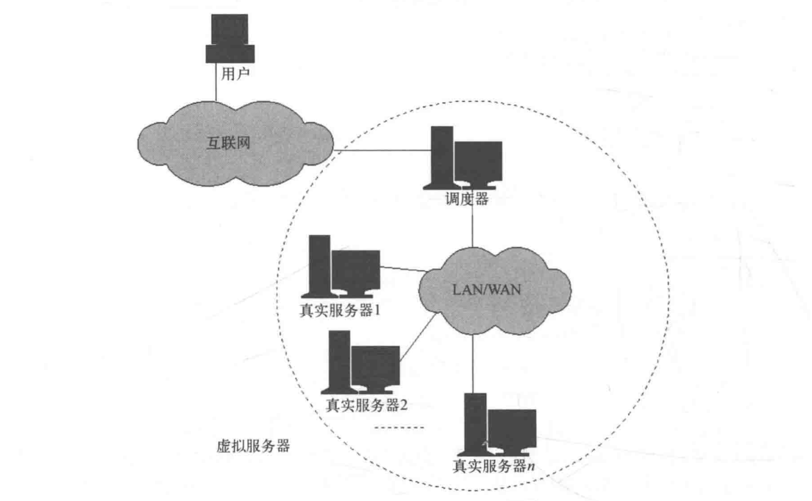
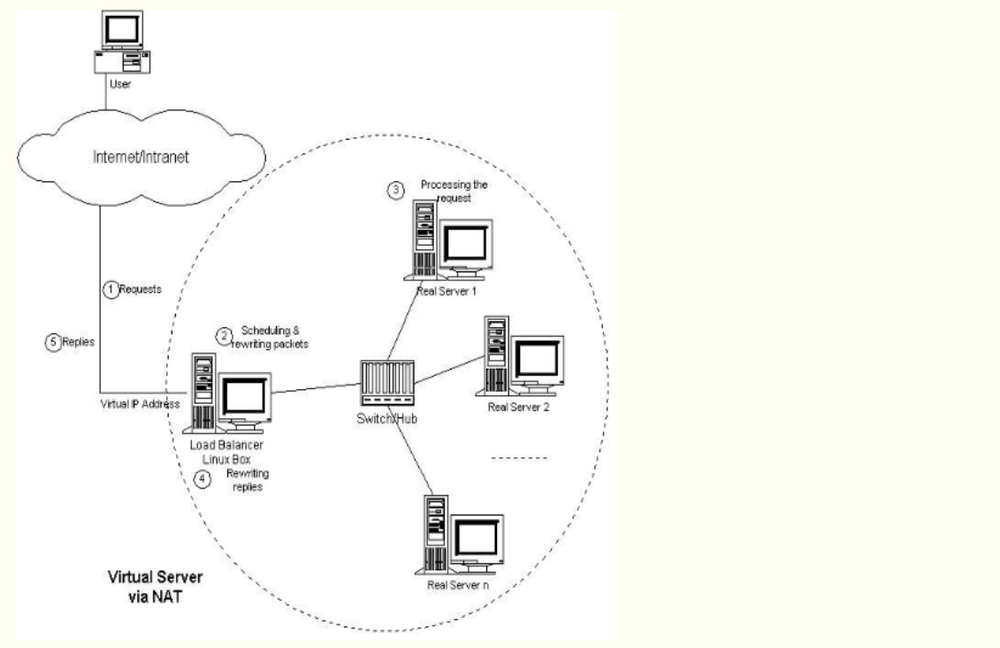
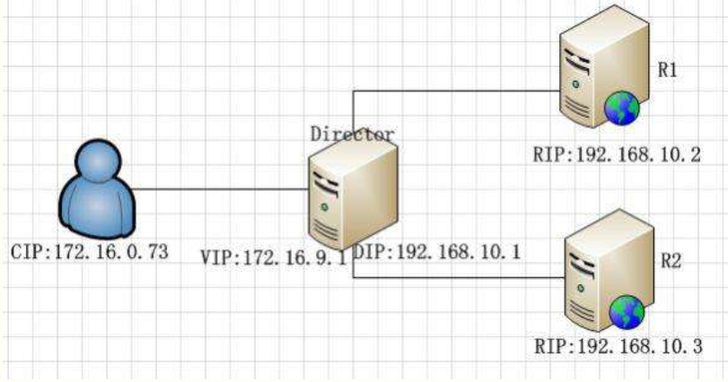
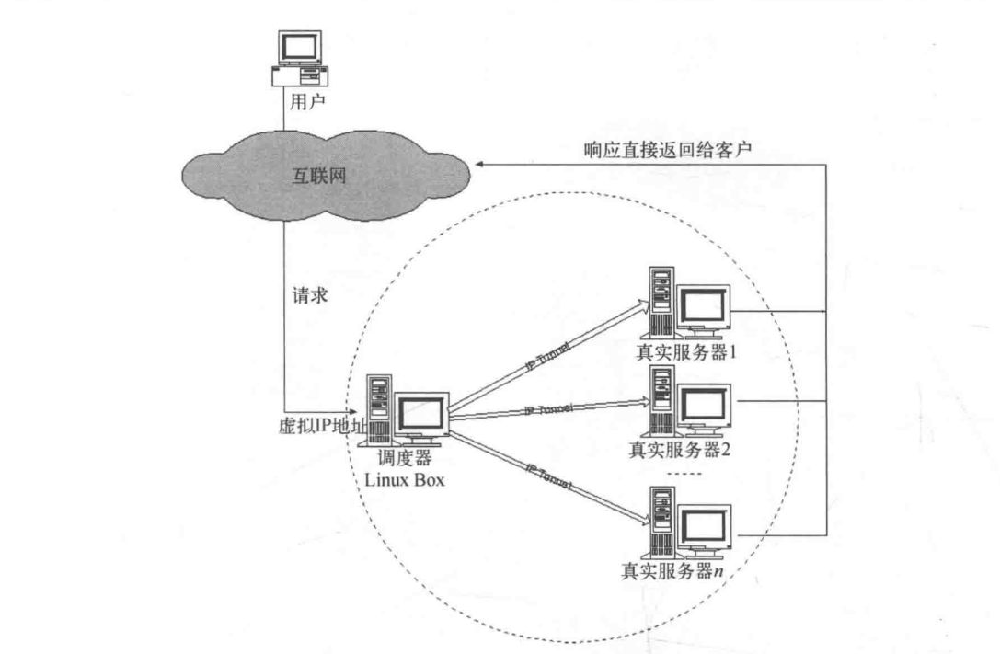
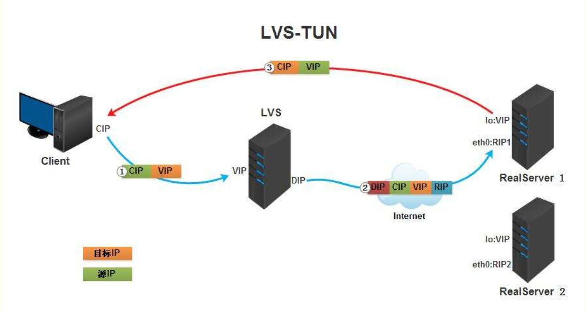
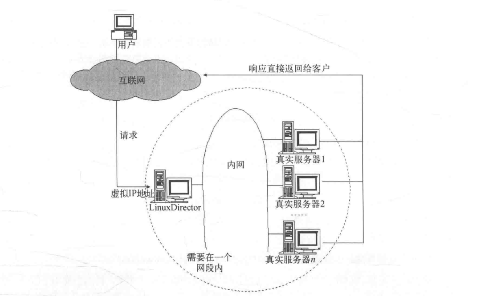
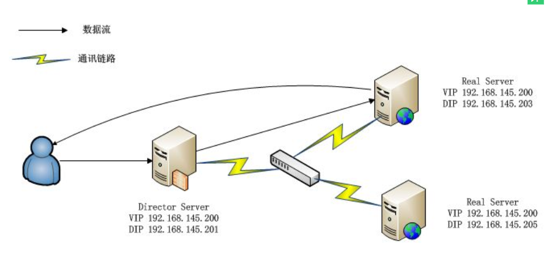
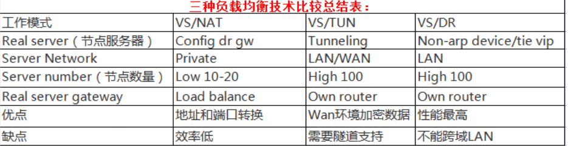
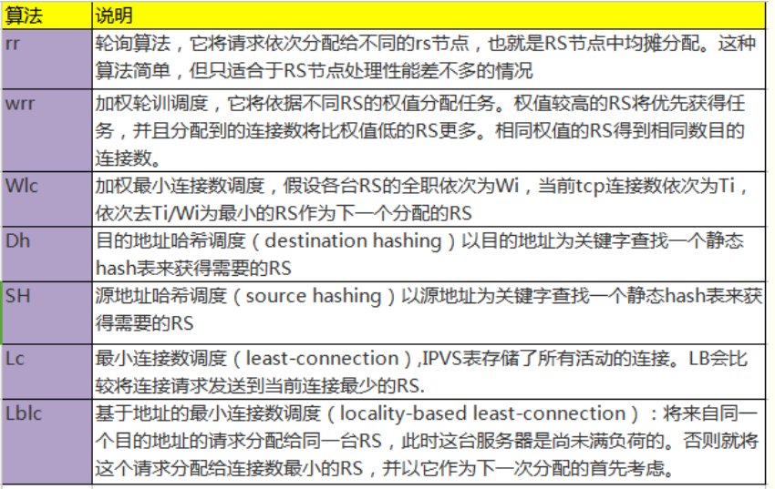

# LVS基于四层的负载均衡学习
    LVS是linux virtual server的简写linux虚拟服务器，是一个虚拟的服务器集群系统，可以在unix/linux平台下实现负载均衡集群功能。该项目在1998年5月由章文嵩博士组织成立。LVS是一种集群(Cluster)技术，采用IP负载均衡技术和基于内容请求分发技术。调度器具有很好的吞吐率，将请求均衡地转移到不同的服务器上执行，且调度器自动屏蔽掉服务器
    的故障，从而将一组服务器构成一个高性能的、高可用的虚拟服务器。整个服务器集群的结构对客户是透明的，而且无需修改客户端和服务器端的程序。
    LVS集群采用IP负载均衡技术和基于内容请求分发技术。调度器具有很好的吞吐率，将请求均衡地转移到不同的服务器上执行，且调度器自动屏蔽掉服 务器的故障，从而将一组服务器构成一个高性能的、高可用的虚拟服务器。整个服务器集群的结构对客户是透明的，而且无需修改客户端和服务器端的程序。
    LVS在设计时需要考虑系统的透明性、可伸缩性、高可用性和易管理性。一般来说，LVS集群采用三层结构，其体系结构如图所示：
    
 
 
 
 
 

__LVS常用的三种负载均衡模式__

## NAT模式-网络地址转换   Virtualserver via Network address translation(VS/NAT)
    这个是通过网络地址转换的方法来实现调度的。
    首先调度器(LB)接收到客户的请求数据包时（请求的目的IP为VIP），
    根据调度算法决定将请求发送给哪个后端的真实服务器（RS）。
    然后调度就把客户端发送的请求数据包的目标IP地址及端口改成后端真实服务器的IP地址（RIP）,
    这样真实服务器（RS）就能够接收到客户的请求数据包了。
    真实服务器响应完请求后，查看默认路由（NAT模式下我们需要把RS的默认路由设置为LB服务器。）
    把响应后的数据包发送给LB,LB再接收到响应包后，
    把包的源地址改成虚拟地址（VIP）然后发送回给客户端。
    

 
    
    NAT模式优缺点：
    1) NAT技术将请求的报文和响应的报文都需要通过LB进行地址改写，因此网站访问量比较大的时候LB负载均衡调度器有比较大的瓶颈，一般要求最多之能10-20台节点。
    2) 只需要在LB上配置一个公网IP地址就可以了。
    3) 每台内部的节点服务器的网关地址必须是调度器LB的内网地址。
    4) NAT模式支持对IP地址和端口进行转换。即用户请求的端口和真实服务器的端口可以不一致。
    
     
 
    客户发出请求，发送请求给链接调度器的VIP，调度器将请求报文中的目标Ip地址改为RIP。这样服务器RealServer将请求的内容发给调度器，调度器再将报文中的源IP地址改为VIP;
    1) 当用户请求到达Director Server，此时请求的数据报文会先到内核空间的PREROUTING链。 此时报文的源IP为CIP，目标IP为VIP;
    2) PREROUTING检查发现数据包的目标IP是本机，将数据包送至INPUT链;
    3) IPVS比对数据包请求的服务是否为集群服务，若是，修改数据包的目标IP地址为后端服务器IP，然后将数据包发至POSTROUTING链。 此时报文的源IP为CIP，目标IP为RIP
    4) POSTROUTING链通过选路，将数据包发送给Real Server;
    5) Real Server比对发现目标为自己的IP，开始构建响应报文发回给Director Server。 此时报文的源IP为RIP，目标IP为CIP;
    6) Director Server在响应客户端前，此时会将源IP地址修改为自己的VIP地址，然后响应给客户端。 此时报文的源IP为VIP，目标IP为CIP;
    
    NAT模式特点和注意事项：
    1) 很好配置，原理简单易懂;
    2) 由于调度器的工作量太大，很容易成为整个集群系统的瓶颈;
    3) RS应该使用私有地址；
    4) RS的网关的必须指向DIP；
    5) RIP和DIP必须在同一网段内；
    6) 请求和响应的报文都得经过Director；在高负载场景中，Director很可能成为系统性能瓶颈；
    7) 支持端口映射；
    8) RS可以使用任意支持集群服务的OS；
    
## TUN模式-IP隧道模式          Virtual Server via IP Tunneling(VS/TUN)
    IP隧道(IP tunneling)是将一个IP报文封装在另一个IP报文的技术，
    这可以使得目标为一个IP地址的数据报文能被封装和转发到另一个IP地址。
    IP隧道技术亦称为IP封装技术(IP encapsulation)。
    
    IP隧道主要用于移动主机和虚拟私有网络(Virtual Private Network)，
    在其中隧道都是静态建立的，隧道一端有一个IP地址，另一端也有唯一的IP地址
    。它的连接调度和管理与VS/NAT中的一样，只是它的报文转发方法不同。
    调度器根据各个服务器的负载情况，动态地选择一台服务器，
    将请求报文封装在另一个IP报文中，再将封装后的IP报文转发给选出的服务器;
    服务器收到报文后，先将报文解封获得原来目标地址为 VIP 的报文，服务器发现VIP地址被配置在本地的IP隧道设备上，所以就处理这个请求，然后根据路由表将响应报文直接返回给客户。
 
 
    采用NAT模式时，由于请求和响应的报文必须通过调度器地址重写，当客户请求越来越多时，
    调度器处理能力将成为瓶颈。为了解决这个问题，
    调度器把请求的报文通过IP隧道转发到真实的服务器。
    真实的服务器将响应处理后的数据直接返回给客户端。这样调度器就只处理请求入站报文，
    由于一般网络服务应答数据比请求报文大很多，采用VS/TUN模式后，集群系统的最大吞吐量可以提高10倍。

    其实TUN模式和下面的DR模式差不多，但是比DR多了一个隧道技术以支持realserver不在同一个物理环境中。就是realserver一个在北京，一个工作在上海。在原有的IP报文外再次封装多一层IP首部，内部IP首部(源地址为CIP，目标IIP为VIP)，外层IP首部(源地址为DIP，目标IP为RIP.  再看下面的TUN模式图:
 
    
    1)  当用户请求到达Director Server，此时请求的数据报文会先到内核空间的PREROUTING链。 此时报文的源IP为CIP，目标IP为VIP 。
    2)  PREROUTING检查发现数据包的目标IP是本机，将数据包送至INPUT链;
    3)  IPVS比对数据包请求的服务是否为集群服务，若是，在请求报文的首部再次封装一层IP报文，封装源IP为为DIP，目标IP为RIP。然后发至POSTROUTING链。 此时源IP为DIP，目标IP为RIP;
    4)  POSTROUTING链根据最新封装的IP报文，将数据包发至RS（因为在外层封装多了一层IP首部，所以可以理解为此时通过隧道传输）。 此时源IP为DIP，目标IP为RIP;
    5)  RS接收到报文后发现是自己的IP地址，就将报文接收下来，拆除掉最外层的IP后，会发现里面还有一层IP首部，而且目标是自己的lo接口VIP，那么此时RS开始处理此请求，处理完成之后，通过lo接口送给eth0网卡，然后向外传递。 此时的源IP地址为VIP，目标IP为CIP;
    6)  响应报文最终送达至客户端;
    
    LVS-TUN (ip隧道) 模式特点和注意事项
    1) RIP、VIP、DIP全是公网地址
    2) RS的网关不会也不可能指向DIP
    3) 不支持端口映射
    4) RS的系统必须支持隧道
    
## DR模式-直接路由模式          Virtual Server via Direct Routing(VS/DR)

    DR模式也就是用直接路由技术实现虚拟服务器。它的连接调度和管理与VS/NAT和VS/TUN中的一样，但它的报文转发方法又有不同，VS/DR通过改写请求报文的MAC地址，将请求发送到Real Server，而Real Server将响应直接返回给客户，免去了VS/TUN中的IP隧道开销。这种方式是三种负载调度机制中性能最高最好的，但是必须要求Director Server与Real Server都有一块网卡连在同一物理网段上。
    Director和RealServer必需在物理上有一个网卡通过不间断的局域网相连。
     RealServer上绑定的VIP配置在各自Non-ARP的网络设备上(如lo或tunl),
     Director的VIP地址对外可见，而RealServer的VIP对外是不可见的。
     RealServer的地址即可以是内部地址，也可以是真实地址。

    DR模式是通过改写请求报文的目标MAC地址，将请求发给真实服务器的，
    而真实服务器响应后的处理结果直接返回给客户端用户。同TUN模式一样，
    DR模式可以极大的提高集群系统的伸缩性。而且DR模式没有IP隧道的开销，
    对集群中的真实服务器也没有必要必须支持IP隧道协议的要求。
    但是要求调度器LB与真实服务器RS都有一块网卡连接到同一物理网段上，必须在同一个局域网环境。

其实整个DR模式都是停留在第二层的数据链路层, 直接修改MAC。实现报文的转发。再看下面的DR模式图:

    1)  当用户请求到达Director Server，此时请求的数据报文会先到内核空间的PREROUTING链。 此时报文的源IP为CIP，目标IP为VIP;
    2)  PREROUTING检查发现数据包的目标IP是本机，将数据包送至INPUT链;
    3)  IPVS比对数据包请求的服务是否为集群服务，若是，将请求报文中的源MAC地址修改为DIP的MAC地址，将目标MAC地址修改RIP的MAC地址，然后将数据包发至POSTROUTING链。 此时的源IP和目的IP均未修改，仅修改了源MAC地址为DIP的MAC地址，目标MAC地址为RIP的MAC地址;
    4)  由于DS和RS在同一个网络中，所以是通过二层来传输。POSTROUTING链检查目标MAC地址为RIP的MAC地址，那么此时数据包将会发至Real Server;
    5)  响应报文最终送达至客户端;

LVS-DR模式特点和注意事项

    1) 在前端路由器做静态地址路由绑定，将对于VIP的地址仅路由到Director Server
    2) arptables：在arp的层次上实现在ARP解析时做防火墙规则，过滤RS响应ARP请求。修改RS上内核参数（arp_ignore和arp_announce）将RS上的VIP配置在网卡接口的别名上，并限制其不能响应对VIP地址解析请求。
    3) RS可以使用私有地址；但也可以使用公网地址，此时可以直接通过互联网连入RS以实现配置、监控等；
    4) RS的网关一定不能指向DIP；
    5) RS跟Dirctory要在同一物理网络内（不能由路由器分隔）；
    6) 请求报文经过Directory，但响应报文一定不经过Director
    7) 不支持端口映射；
    8) RS可以使用大多数的操作系统
    
## 三种负载均衡方式简单比较
    1）NAT模式-网络地址转换
    VS/NAT 的优点是服务器可以运行任何支持TCP/IP的操作系统，它只需要一个IP地址配置在调度器上，服务器组可以用私有的IP地址。缺点是它的伸缩能力有限，当服务器结点数目升到20时，调度器本身有可能成为系统的新瓶颈，因为在VS/NAT中请求和响应报文都需要通过负载调度器。如果负载调度器成为系统新的瓶颈，可以有三种方法解决这个问题：混合方法、VS/TUN和 VS/DR。在DNS混合集群系统中，有若干个VS/NAT负调度器，每个负载调度器带自己的服务器集群，同时这些负载调度器又通过RR-DNS组成简单的域名。但VS/TUN和VS/DR是提高系统吞吐量的更好方法。对于那些将IP地址或者端口号在报文数据中传送的网络服务，需要编写相应的应用模块来转换报文数据中的IP地址或者端口号。这会带来实现的工作量，同时应用模块检查报文的开销会降低系统的吞吐率。

    2）TUN模式-IP隧道模式 
    在TUN 的集群系统中，负载调度器只将请求调度到不同的后端服务器，后端服务器将应答的数据直接返回给用户。这样负载调度器就可以处理大量的请求，它甚至可以调度百台以上的服务器(同等规模的服务器)，而它不会成为系统的瓶颈。即使负载调度器只有100Mbps的全双工网卡，整个系统的最大吞吐量可超过 1Gbps。所以，VS/TUN可以极大地增加负载调度器调度的服务器数量。VS/TUN调度器可以调度上百台服务器，而它本身不会成为系统的瓶颈，可以用来构建高性能的超级服务器。VS/TUN技术对服务器有要求，即所有的服务器必须支持"IP Tunneling"或者"IP Encapsulation"协议。目前，VS/TUN的后端服务器主要运行Linux操作系统，我们没对其他操作系统进行测试。因为"IP Tunneling"正成为各个操作系统的标准协议，所以VS/TUN应该会适用运行其他操作系统的后端服务器。

    3）DR模式
    跟VS/TUN方法一样，VS/DR调度器只处理客户到服务器端的连接，响应数据可以直接从独立的网络路由返回给客户。这可以极大地提高LVS集群系统的伸缩性。跟VS/TUN相比，这种方法没有IP隧道的开销，但是要求负载调度器与实际服务器都有一块网卡连在同一物理网段上，服务器网络设备(或者设备别名)不作ARP响应，或者能将报文重定向(Redirect)到本地的Socket端口上。

## LVS负载均衡调度算法
    LVS的调度算法决定了如何在集群节点之间分布工作负荷。当director调度器收到来自客户端访问VIP的上的集群服务的入站请求时，director调度器必须决定哪个集群节点应该
    处理请求。
    
    Director调度器用的调度方法基本分为两类 (如下所列, LVS总共有10种调度算法, 常用的也就四种调度算法, 下面会说到):
    静态调度算法：rr，wrr，dh，sh
    动态调度算法：wlc，lc，lblc，lblcr, sed, nq
    
    静态调度 (也就是固定调度算法)的4种算法:
    rr（轮询）
    轮询调度：这种是最简单的调度算法，就是将请求A一个，B一个，A一个，B一个 ...... 循环的发。就算A主机挂掉了，调度器还是会将请求发送到A。十分均衡。
    
    wrr（权重, 即加权轮询）
    加权轮询调度：这种算法是在rr基础上实现的，只不过加了权重，权重范围为1-100，假设A的服务器性能好，就给A的权重设置的高一点，设为2，而B主机是1。这样就实现A二个，B一个，A二个，B一个 ...... 循环的发。这样照顾到了服务器性能。
    
    sh（源地址哈希）
    源地址散列：主要是实现将此前的session（会话）绑定。将此前客户的源地址作为散列键，从静态的散列表中找出对应的服务器，只要目标服务器是没有超负荷的就将请求发送过去。就是说某客户访问过A,现在这个客户又来了，所以客户请求会被发送到服务过他的A主机。
    
    dh（目的地址哈希）
    目的地址散列：以目的地址为关键字查找一个静态hash表来获得需要的RS。以目标地址为标准挑选。 功能是和sh近似的，但应用场景不同; 举个dh调度算法的例子：假设1号客户访问了web集群的一个动态页面，调度器将请求转发个A服务器，A服务器的PHP将这个动态请求运行了一遍，生成了缓存并回应1号客户。这下2号客户也访问了这个动态页面，调度器应该将请求发给A。毕竟A已经跑过这段程序了，有缓存，对吧。所以这既是dh算法）
    
    动态调度算法，动态算法与静态算法最大的区别就是动态算法考虑了服务器的压力。
    活动链接（active）：客户与服务器建立连接并且有数据传送
    非活动链接（inactive）：只是建立连接，没有数据传送，没有断开连接
    
    动态调度的6种算法
    lc（最少链接）
    最少连接调度：这种算法是看A，和B的主机谁的连接少，请求就发给谁。
    简单算法：active*256+inactive  （谁小发给谁）
    
    wlc（加权最少链接）LVS的理想算法
    加权最少链接：这种算法就是比lc多了一个加权。
    简单算法：( active*256+inactive )/weight    (谁小就发给谁)
    
    sed（最短期望延迟）
    基于wlc算法，假设A，B的权重分别是1，2 。而A的链接数为1，B的链接数为2 。这样的话，用wlc算法得出的结果一样，而明显B的权重大，B的能力较强。用sed算法的话，就可以避免wlc出现的问题。
    简单算法：（active+1)*256/weight （活动的连接数+1）*256/除以权重  谁小发给谁
    A：（1+1）/1
    B：（2+1）/2  （B小，交给B）
    
    nq（不用排队）
    基于sed算法：在sed的基础上，若谁的链接数为0，直接将请求发送给它!
    
    LBLC（基于局部性的最少连接）类似于dh，目标地址hash
    这个算法主要用于Cache集群系统，因为Cache集群的中客户请求报文的目标IP地址的变化，将相同的目标URL地址请求调度到同一台服务器，来提高服务器的访问的局部性和Cache命中率。从而调整整个集群的系统处理能力。但是，如果realserver的负载处于一半负载，就用最少链接算法，将请求发送给活动链接少的主机。
    
    LBLCR（带复制的基于局部性的最少链接）
    该算法首先是基于最少链接的，当一个新请求收到后，一定会将请求发给最少连接的那台主机的。但这样又破坏了cache命中率。但这个算法中，集群服务是cache共享的，假设A的PHP跑了一遍，得到缓存。但其他realserver可以去A那里拿缓存，这是种缓存复制机制。
    
    负载调度器是根据各个服务器的负载情况，动态地选择一台Real Server响应用户请求，那么动态选择是如何实现呢，其实也就是这里要说的负载调度算法，根据不同的网络服务需求和服务器配置，IPVS实现了如上的十种负载调度算法，下面详细讲述LVS最常用的四种调度算法：
    -  轮叫调度（Round Robin）
    "轮叫"调度也叫1:1调度，调度器通过"轮叫"调度算法将外部用户请求按顺序1:1的分配到集群中的每个Real Server上，这种算法平等地对待每一台Real Server，而不管服务器
    上实际的负载状况和连接状态。
    
    -  加权轮叫调度（Weighted Round Robin）
    "加权轮叫"调度算法是根据Real Server的不同处理能力来调度访问请求。可以对每台Real Server设置不同的调度权值，对于性能相对较好的Real Server可以设置较高的权值，而对于处理能力较弱的Real Server，可以设置较低的权值，这样保证了处理能力强的服务器处理更多的访问流量。充分合理的利用了服务器资源。同时，调度器还可以自动查询Real Server的负载情况，并动态地调整其权值。
    
    -  最少链接调度（Least Connections）
    "最少连接"调度算法动态地将网络请求调度到已建立的链接数最少的服务器上。如果集群系统的真实服务器具有相近的系统性能，采用"最小连接"调度算法可以较好地均衡负载。
    
    -  加权最少链接调度（Weighted Least Connections）
    "加权最少链接调度"是"最少连接调度"的超集，每个服务节点可以用相应的权值表示其处理能力，而系统管理员可以动态的设置相应的权值，缺省权值为1，加权最小连接调度在分配新连接请求时尽可能使服务节点的已建立连接数和其权值成正比。 

LVS调度算法的生产环境选型：

    1）一般的网络服务，如http，nginx，mysql等常用的LVS调度算法为：
    a. 基本轮询调度rr
    b. 加权最小连接调度wlc
    c. 加权轮询调度wrc
    
    2）基于局部性的最小连接lblc和带复制的给予局部性最小连接lblcr主要适用于web cache和DB cache;
    
    3）源地址散列调度SH和目标地址散列调度DH可以结合使用在防火墙集群中，可以保证整个系统的出入口唯一;
    
    其实对于LVS的理解，主要部分还是在于3种工作方式和8种调度算法，实际这些算法的适用范围很多，工作中最好参考内核中的连接调度算法的实现原理，然后根据具体的业务需求合理的选型。 

LVS的 Session持久机制

    1）session绑定：始终将同一个请求者的连接定向至同一个rs（第一次请求时仍由调度方法选择）；没有容错能力，有损均衡效果；
    2）session复制：在rs之间同步session，因此，每个RS持集群中所有的session；对于大规模集群环境不适用；
    3）session共享或服务器机制：利用单独部署的服务器来统一管理session；

LVS使用中特别需要注意事项：

    1) 关于时间同步：各节点间的时间偏差不大于1s，建议使用统一的ntp服务器进行更新时间；
    2) DR模型中的VIP的MAC广播问题：
    在DR模型中，由于每个节点均要配置VIP，因此存在VIP的MAC广播问题，在现在的linux内核中，都提供了相应kernel 参数对MAC广播进行管理，具体如下：
          arp_ignore: 定义接收到ARP请求时的响应级别；
              0：只要本地配置的有相应地址，就给予响应； 
              1：仅在请求的目标地址配置在到达的接口上的时候，才给予响应；DR模型使用
    
         arp_announce：定义将自己地址向外通告时的通告级别；
             0：将本地任何接口上的任何地址向外通告； 
             1：试图仅向目标网络通告与其网络匹配的地址； 
             2：仅向与本地接口上地址匹配的网络进行通告；DR模型使用
             
             
