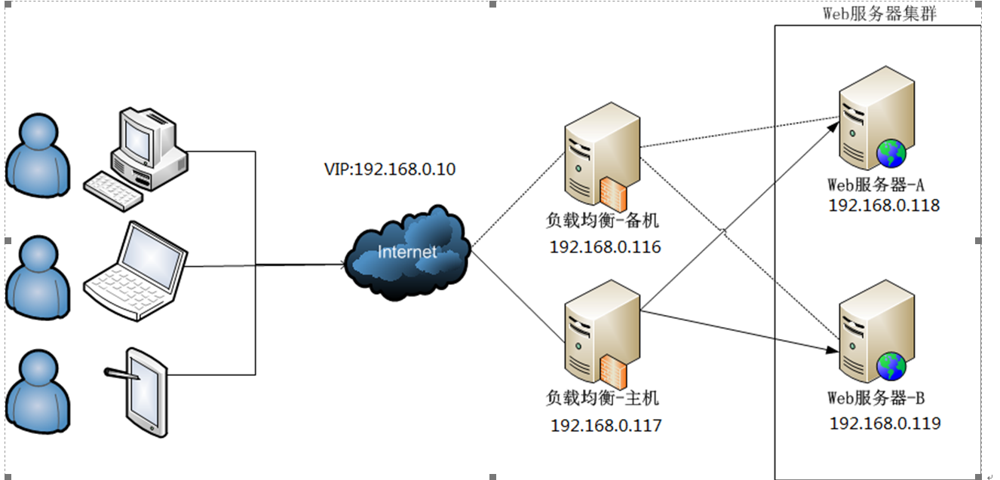

# keepalived高可用集群

## 1.1.         高可用集群简介

### 什么是高可用集群

```
高可用集群（High Availability Cluster，简称HA Cluster），是指以减少服务中断时间为目的的服务器集群技术。它通过保护用户的业务程序对外不间断提供的服务，把因软件、硬件、人为造成的故障对业务的影响降低到最小程度。
```


### 高可用集群的衡量标准

```
要保证集群服务100%时间永远完全可用，几乎可以说是一件不可能完成的任务。比如，淘宝在这几年双十一刚开始的时候，一下子进来买东西的人很多，访问量大，都出现一些问题，如下单后却支付不了。所以说只能保证服务尽可能的可用，当然有些场景相信还是可能做到100%可用的。
```

  通常用平均无故障时间(MTTF：mean time to failure)来度量系统的可靠性,用平均故障维修时间（MTTR：mean
time to restoration）来度量系统的可维护性。于是可用性被定义为：HA=MTTF/(MTTF+MTTR)*100%。


### 自动切换/故障转移（FailOver）

```
自动切换阶段某一主机如果确认对方故障，则正常主机除继续进行原来的任务，还将依据各种容错备援模式接管预先设定的备援作业程序，并进行后续的程序及服务。

      通俗地说，即当A无法为客户服务时，系统能够自动地切换，使B能够及时地顶上继续为客户提供服务，且客户感觉不到这个为他提供服务的对象已经更换。

      通过上面判断节点故障后，将高可用集群资源（如VIP、httpd等）从该不具备法定票数的集群节点转移到故障转移域（Failover Domain，可以接收故障资源转移的节点）。
```

### 自动侦测

```
自动侦测阶段由主机上的软件通过冗余侦测线，经由复杂的监听程序，逻辑判断，来相互侦测对方运行的情况。
     常用的方法是：集群各节点间通过心跳信息判断节点是否出现故障。
```

#### 脑裂

```
脑裂简介
在高可用（HA）系统中，当联系2个节点的“心跳线”断开时，本来为一整体、动作协调的HA系统，就分裂成为2个独立的个体。由于相互失去了联系，都以为是对方出了故障。两个节点上的HA软件像“裂脑人”一样，争抢“共享资源”、争起“应用服务”，就会发生严重后果——或者共享资源被瓜分、2边“服务”都起不来了；或者2边“服务”都起来了，但同时读写“共享存储”，导致数据损坏（常见如数据库轮询着的联机日志出错）。
```

#### 脑裂产生的原因

```
因心跳线坏了（包括断了，老化）。
因网卡及相关驱动坏了，ip配置及冲突问题（网卡直连）。
因心跳线间连接的设备故障（网卡及交换机）。
因仲裁的机器出问题（采用仲裁的方案）。
高可用服务器上开启了 iptables防火墙阻挡了心跳消息传输。
高可用服务器上心跳网卡地址等信息配置不正确，导致发送心跳失败。
其他服务配置不当等原因，如心跳方式不同，心跳广插冲突、软件Bug等。
```

#### 常见的解决方案

###### 1）添加冗余的心跳线

例如：双线条线（心跳线也HA），尽量减少“裂脑”发生几率；

###### 2）启用磁盘锁

正在服务一方锁住共享磁盘，“裂脑”发生时，让对方完全“抢不走”共享磁盘资源。但使用锁磁盘也会有一个不小的问题，如果占用共享盘的一方不主动“解锁”，另一方就永远得不到共享磁盘。现实中假如服务节点突然死机或崩溃，就不可能执行解锁命令。后备节点也就接管不了共享资源和应用服务。于是有人在HA中设计了“智能”锁。即：正在服务的一方只在发现心跳线全部断开（察觉不到对端）时才启用磁盘锁。平时就不上锁了。

###### 3）设置仲裁机制

例如设置参考IP（如网关IP或某一个服务器），当心跳线完全断开时，2个节点都各自ping一下参考IP，不通则表明断点就出在本端。不仅“心跳”、还兼对外“服务”的本端网络链路断了，即使启动（或继续）应用服务也没有用了，那就主动放弃竞争，让能够ping通参考IP的一端去起服务。更保险一些，ping不通参考IP的一方干脆就自我重启，以彻底释放有可能还占用着的那些共享资源。

###### 4）裂脑的监控报警

如邮件及手机短信等或值班

在问题发生时人为第一时间介入仲裁，降低损失。

当检测到裂脑时强行关闭一个心跳节点（这个功能需特殊设备支持，如Stonith、feyce）。相当于备节点接收不到心跳消患，通过单独的线路发送关机命令关闭主节点的电源。

当然，在实施高可用方案时，要根据业务实际需求确定是否能容忍这样的损失。对于一般的网站常规业务.这个损失是可容忍的。

###### 其他高可用方案

```
heartbeat、pacemaker、 piranha（web页面）
```

## 1.2.         keepalived

### keepalived是什么

 keepalived是集群管理中保证集群高可用的一个服务软件，用来防止单点故障。

### keepalived工作原理

 keepalived是以VRRP协议为实现基础的，VRRP全称Virtual Router Redundancy Protocol，即虚拟路由冗余协议。

将N台提供相同功能的服务器组成一个服务器组，这个组里面有一个master和多个backup，master上面有一个对外提供服务的vip（该服务器所在局域网内其他机器的默认路由为该vip），master会发组播，当backup收不到vrrp包时就认为master宕掉了，这时就需要根据VRRP的优先级来选举一个backup当master

### 组播

IPV4总共三种通信方式：单播，组播，广播。  组播是指以224.0.0.0地址作为通信地址的一种方式。

### VRRP协议


### keepalived主要有三个模块

分别是core、check和vrrp。  core模块为keepalived的核心，负责主进程的启动、维护以及全局配置文件的加载和解析。  check负责健康检查，包括常见的各种检查方式。  vrrp模块是来实现VRRP协议的。


## 实战案例1

#### 环境:

```
初识keepalived，实现web服务器的高可用集群。

Server1:192.168.0.118
Server2:192.168.0.119
VIP:192.168.0.10
```

#### 原理示例图

相关文档链接：

https://www.cnblogs.com/cxbhakim/p/9068833.html


#### server1

**创建etc下的keepalived目录,编辑配置文件**

```shell
$ yum -y install keepalived
```

```shell
$ vi /etc/keepalived/keepalived.conf

! Configuration File for keepalived
global_defs {
 router_id 1                            #设备在组中的标识，设置不一样即可
 }

#vrrp_script chk_nginx {                        #健康检查
# script "/etc/keepalived/ck_ng.sh"     #检查脚本
# interval 2                            #检查频率.秒
# weight -5                             #priority减5
# fall 3                                        #失败三次
# }

vrrp_instance VI_1 {               #VI_1。实例名两台路由器相同。同学们要注意区分。
    state MASTER                        #主或者从状态
    interface ens32                     #监控网卡
    mcast_src_ip 192.168.0.118          #心跳源IP
    virtual_router_id 55                #虚拟路由编号，主备要一致。同学们注意区分
    priority 100                        #优先级
    advert_int 1                        #心跳间隔

    authentication {                    #秘钥认证(1-8位)
        auth_type PASS
        auth_pass 123456
    }

    virtual_ipaddress {                 #VIP
    192.168.0.10/24
        }

#  track_script {                       #引用脚本
#       chk_nginx
#    }

}

# scp -r /etc/keepalived/keepalived.conf  192.168.0.119:/etc/keepalived/
systemctl enable keepalived.service
# 开机启动keepalived

```


**安装Nginx**

```shell
$ rpm -ivh http://nginx.org/packages/centos/7/noarch/RPMS/nginx-release-centos-7-0.el7.ngx.noarch.rpm
$ yum -y install nginx
$ systemctl enable nginx.service
$ systemctl start nginx.service
$ vi /usr/share/nginx/html/index.html
$ curl -i localhost
$ systemctl start keepalived.service
```

#### server2

**BACKUP服务器的配置需要几处修改**

```shell
$ yum -y install keepalived
$ vi /etc/keepalived/keepalived.conf
```

```shell
state MASTER改为  state BACKUP
mcast_src_ip 192.168.0.118改为backup服务器实际的IP mcast_src_ip 
192.168.0.119
priority 100改为priority 99
```

配置文件示例

```shell
! Configuration File for keepalived
global_defs {
 router_id 2
 }

#vrrp_script chk_nginx {
# script "/etc/keepalived/ck_ng.sh"
# interval 2
# weight -5
# fall 3
# }

vrrp_instance VI_1 {
    state BACKUP
    interface ens32
    mcast_src_ip 192.168.0.119
    virtual_router_id 55
    priority 99
    advert_int 1

    authentication {
        auth_type PASS
        auth_pass 123456
    }

    virtual_ipaddress {
    192.168.0.10/24
        }

#  track_script {
#       chk_nginx
#    }

}
systemctl enable keepalived.service
```

**安装Nginx**

```shell
$ rpm -ivh http://nginx.org/packages/centos/7/noarch/RPMS/nginx-release-centos-7-0.el7.ngx.noarch.rpm
$ yum -y install nginx
$ systemctl enable nginx.service
$ systemctl start nginx.service
$ vi /usr/share/nginx/html/index.html
$ curl -i localhost
$ systemctl start keepalived.service
```

#### client

```
访问VIP  http://192.168.0.10

拔掉master的网线。
访问VIP  http://192.168.0.10，观察网页已经切换
关于keepalived对nginx状态未知的问题
恢复之前的实验。启动两台主机的keepalived和nginx。确保页面访问正常。
关闭master的nginx服务 。systemctl stop nginx
继续访问VIP，请问页面是否会切换到slave呢？
请思考，nginx服务的状态和keepalived的关系。
```

原因是keepalived监控的是接口IP状态。无法监控nginx服务状态

#### 编辑监控脚本

##### server1

```shell
# 添加Nginx监控脚本

vi /etc/keepalived/ck_ng.sh
#!/bin/bash
#检查nginx进程是否存在
counter=$(ps -C nginx --no-heading|wc -l)
if [ "${counter}" = "0" ]; then
#尝试启动一次nginx，停止5秒后再次检测
    service nginx start
    sleep 5
    counter=$(ps -C nginx --no-heading|wc -l)
    if [ "${counter}" = "0" ]; then
#如果启动没成功，就杀掉keepalive触发主备切换
        service keepalived stop
    fi
fi
chmod +x /etc/keepalived/ck_ng.sh

```

##### server2

```shell
# 添加Nginx监控脚本

vi /etc/keepalived/ck_ng.sh
#!/bin/bash
#检查nginx进程是否存在
counter=$(ps -C nginx --no-heading|wc -l)
if [ "${counter}" = "0" ]; then
#尝试启动一次nginx，停止5秒后再次检测
    service nginx start
    sleep 5
    counter=$(ps -C nginx --no-heading|wc -l)
    if [ "${counter}" = "0" ]; then
#如果启动没成功，就杀掉keepalive触发主备切换
        service keepalived stop
    fi
fi
chmod +x /etc/keepalived/ck_ng.sh
```

#### 启动监控脚本

清除掉配置文件中的注释。重启keepalived即可

#### nginx状态测试

因为脚本中有拉起nginx的语句，测试时可以将脚本文件位置进行改变。观察脚本的效果。

## 实战案例2

#### 环境

keepalived+lvs集群

```
192.168.0.116   dr1    负载均衡器   master
192.168.0.117  dr2    负载均衡器
192.168.0.118  rs1     web1
192.168.0.119 rs2     web2
```


#### 拓扑



#### master

```shell
1.在master上安装配置Keepalived:
# yum install keepalived  ipvsadm -y
ipvsadm安装并不启动

2.在master上修改配置文件
# vim /etc/keepalived/keepalived.conf
! Configuration File for keepalived
global_defs {						
	router_id Director1    #两边不一样。
	}
	
vrrp_instance VI_1 {				
	state MASTER				#另外一台机器是BACKUP	
	interface ens32				#心跳网卡	
	virtual_router_id 51			#虚拟路由编号，主备要一致
	priority 150				#优先级	
	advert_int 1				#检查间隔，单位秒	
	authentication {
		auth_type PASS
		auth_pass 1111
		}
	virtual_ipaddress {
		192.168.0.20/24 dev ens32	#VIP和工作端口
		}
	}
	
virtual_server 192.168.0.20 80 {		#LVS 配置，VIP
	delay_loop 3				#服务论询的时间间隔，#每隔3秒检查一次real_server状态
	lb_algo rr				#LVS 调度算法
	lb_kind DR	 			#LVS 集群模式
	protocol TCP
	real_server 192.168.0.118 80 {
		weight 1
		TCP_CHECK {
			connect_timeout 3       #健康检查方式,连接超时时间
			}
		}
	real_server 192.168.0.119 80 {
		weight 1
		TCP_CHECK {
			connect_timeout 3
			}
		}
}
```

#### backup

```shell
# 在backup上安装keepalived:
# yum install keepalived   ipvsadm -y
ipvsadm安装并不启动

# 拷贝master上的keepalived.conf到backup上：
# scp  192.168.0.116:/etc/keepalived/keepalived.conf 192.168.0.117:/etc/keepalived/

#拷贝后,修改配置文件
router_id Director2
state    BACKUP
priority 100

配置示例
! Configuration File for keepalived
global_defs {
        router_id Director2
        }

vrrp_instance VI_1 {
        state BACKUP                            #另外一台机器是BACKUP
        interface ens32                         #心跳网卡
        virtual_router_id 52
        priority 100                            #优先级
        advert_int 1                            #检查间隔，单位秒
        authentication {
                auth_type PASS
                auth_pass 1111
                }
        virtual_ipaddress {
                192.168.0.20/24 dev ens32       #VIP和工作端口
                }
        }

virtual_server 192.168.0.20 80 {                #LVS 配置，VIP
        delay_loop 3                            #服务论询的时间间隔
        lb_algo rr                              #LVS 调度算法
        lb_kind DR                              #LVS 集群模式
        protocol TCP
        real_server 192.168.0.118 80 {
                weight 1
                TCP_CHECK {
                        connect_timeout 3
                        }
                }
        real_server 192.168.0.119 80 {
                weight 1
                TCP_CHECK {
                        connect_timeout 3
                        }
                }
}
```

#### master和backup上启动服务

```
#systemctl enable keepalived
# systemctl start keepalived
#reboot
```

#### web服务器配置

```
web1和web2同配置
安装web测试站点
yum install -y httpd && systemctl start httpd && systemctl enable httpd
netstat -antp | grep httpd
# elinks 127.0.0.1
# 自定义web主页，以便观察负载均衡结果
```

#### 配置虚拟地址

```
#cp /etc/sysconfig/network-scripts/{ifcfg-lo,ifcfg-lo:0}
 \#vim /etc/sysconfig/network-scripts/ifcfg-lo:0
 DEVICE=lo:0
 IPADDR=192.168.0.20
 NETMASK=255.255.255.255
 ONBOOT=yes
 其他行注释掉
```


#### 配置路由

```
#vim /etc/rc.local
/sbin/route add -host 192.168.0.20  dev lo:0
在两台机器（RS）上，添加一个路由：route add -host 192.168.0.20 dev lo:0    
确保如果请求的目标IP是$VIP，那么让出去的数据包的源地址也显示为$VIP
```

#### 配置ARP

```
\# vim /etc/sysctl.conf

net.ipv4.conf.all.arp_ignore = 1
 net.ipv4.conf.all.arp_announce = 2
 net.ipv4.conf.default.arp_ignore = 1
 net.ipv4.conf.default.arp_announce = 2
 net.ipv4.conf.lo.arp_ignore = 1
 net.ipv4.conf.lo.arp_announce = 2

忽略arp请求
 可以回复

###### reboot
```

#### 测试

##### 1）观察lvs路由条目

```shell
# master上 查询 

$ ipvsadm -L
IP Virtual Server version 1.2.1 (size=4096)
 Prot LocalAddress:Port Scheduler Flags
   -> RemoteAddress:Port           Forward Weight ActiveConn InActConn
 TCP  localhost.localdomain:http rr
   -> 192.168.0.124:http           Route   1      0          0  
```

##### 2）观察vip地址在哪台机器上

```shell
# master上 查询 
$ ip a
ens32: 
    inet 192.168.0.120/24 brd 192.168.0.255 scope global dynamic ens32

    inet 192.168.0.20/32 scope global ens32

```


#####   3）客户端浏览器访问vip


##### 4）关闭master上的keepalived服务，再次访问vip

```shell
#master上 关闭 
$ systemctl stop keepalived.service 
```

##### 5）关闭web1站点服务，再次访问VIP

```shell
# web1 
$ systemctl stop httpd
```


### 思考题

```
1.什么是集群？集群分为哪些类型？列举代表的产品。

2.有些负载均衡集群服务？他们有什么区别？

3.LVS-DR和LVS-NAT的工作原理。

4.keepalived的工作原理。

5.高可用集群有哪些产品。他们的区别。

6.负载均衡集群的策略有哪些？能否举例说明？
```


## 相关参考文献

```
http://www.361way.com/keepalived-framework/5208.html
```


