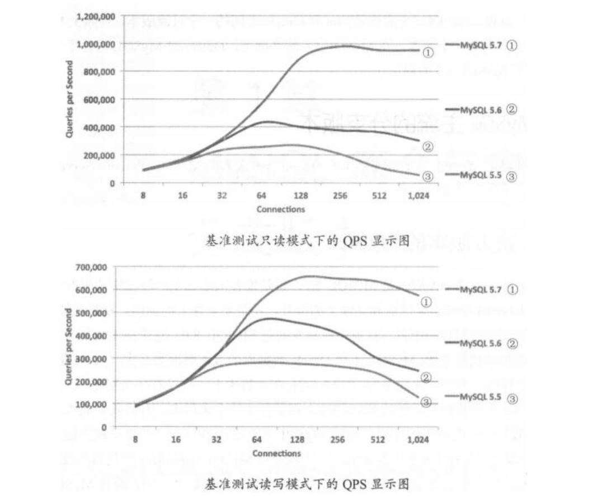

# 01.Mysql简介与主流分支版本


## Mysql简介

1999年至2000年，Monty成了了MySQL AB这家公司，2000年 MySQL公布了自己的源代码。

2005年10月发布一个里程碑的版本MySQL5.0

5.0版本加入了存储过程、服务端游标、触发器、视图、分布式事务、查询优化器的显著改进以及其他的一些特性。

2008年Sun收购了Mysql.

2009年Oracle收购了Sun公司。

随之MySQL就变成了Oracle旗下的一个产品，之后就是我们熟悉的MySQL5.5、5.6、5.7这些版本。


## Mysql主流的分支版本

### 官方版本的MySQL

``` 
MySQL 5.5 5.6 5.7 8.0

MySQL 8.0对源代码进行了重构，对MySQL Optimizer优化器进行了改进，支持隐藏索引
```



### Percona Server
``` 
在InnoDB存储引擎的基础上，提升性能和易管理性，最后形成增强版的XtraDB引擎，可以更好地发挥硬件性能。

XtraDB-Cluster支持多点写入强同步高可用集群，实现实时同步，解决MySQL主从复制延迟问题

TokuDB存储引擎，支持数据压缩、高扩展性和优秀的查询插入性能

```

### MariaDB

``` 
由开源社区维护，高度兼容

包含XtraDB存储引擎、TokuDB存储引擎、Spider水平分片存储引擎，支持基于表的并行复制、多源复制、Galera Cluster集群
```


