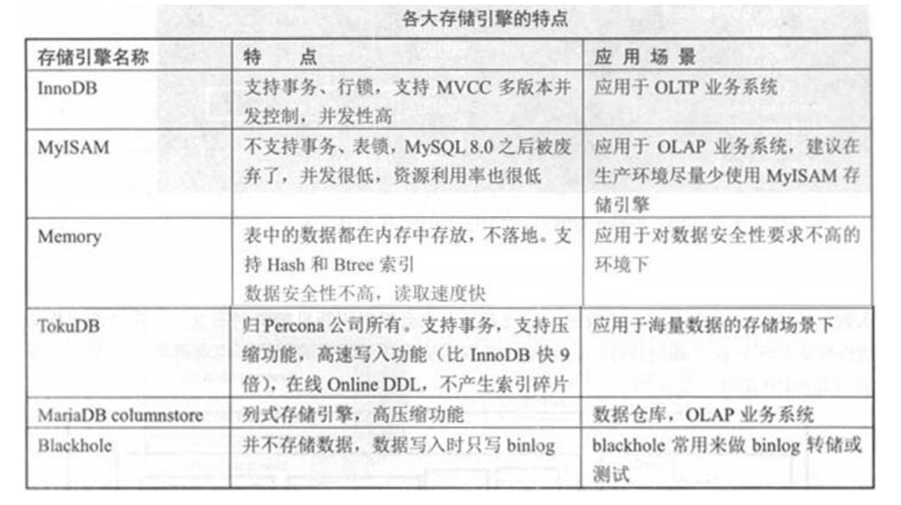
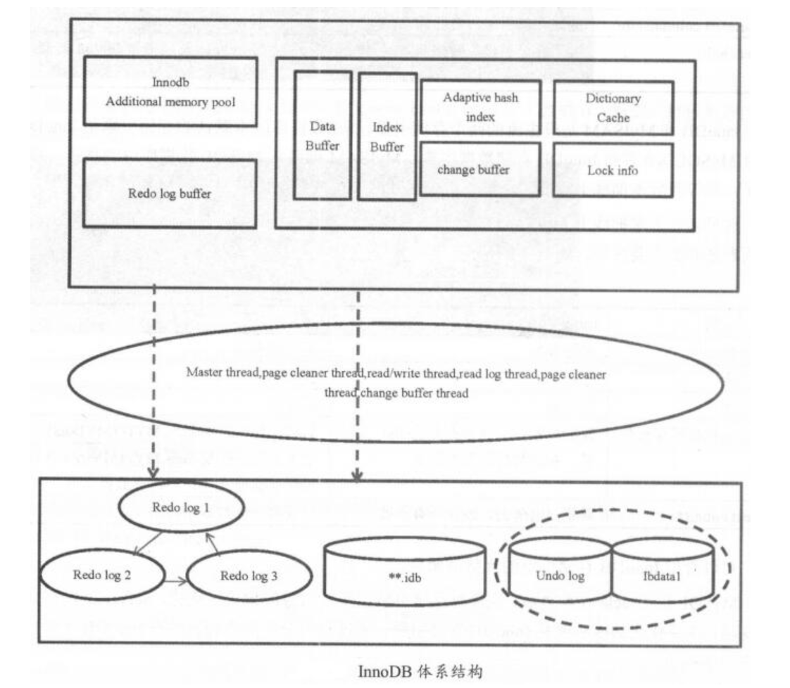
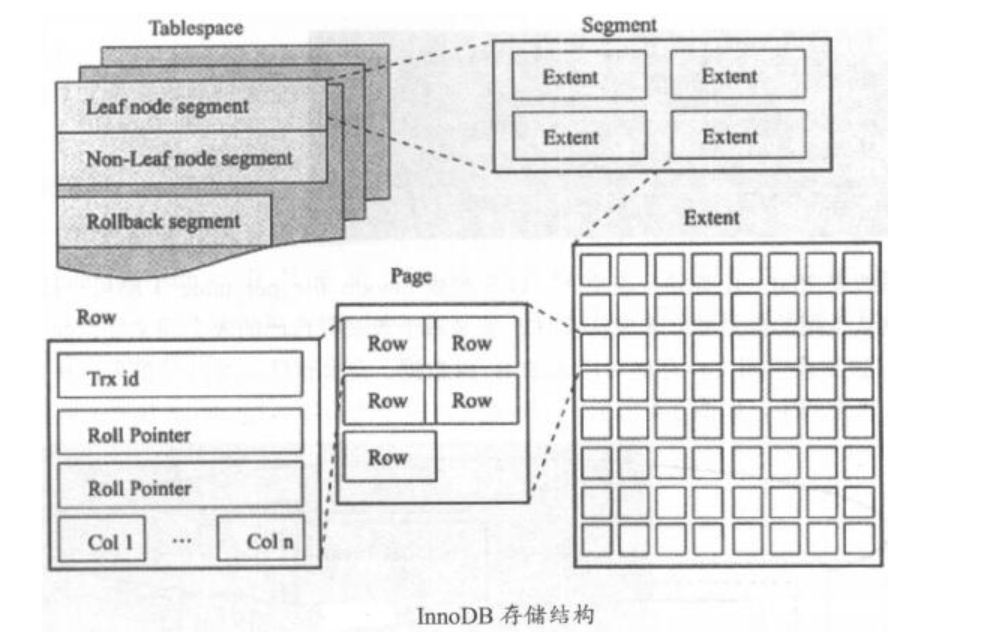
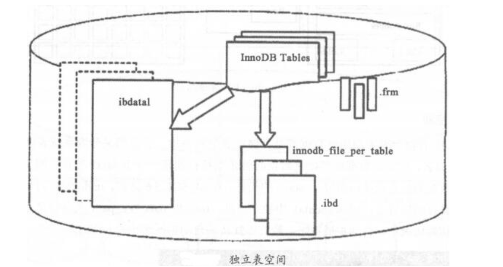

# 03.MySQL体系结构与存储引擎

## MySQL体系结构
MySQL Server层(连接层和SQL层)和存储引擎层


``` 
1、应用程序通过接口连接MySQL
2、连接层：通信协议、线程处理、用户名密码认证
通信协议检测客户端版本是否兼容；线程处理负载分配线程；用户名密码认证负责鉴权
3、SQL层：权限判断、查询缓存、解析器、预处理、查询优化器、缓存、执行计划
权限判断审核用户对库、表、行的权限；查询解析器解析SQL语句，判断语法；预处理对解析器无法解析的语义进行处理；优化器生成最优执行计划
```

## Query Cache详解

Query Cache在生产环境中建议关闭，因为它只能缓存静态数据信息，一旦数据发生变化，经常读写，Query Cache就成了“鸡肋”。

一般像数据仓库之类的可能会考虑开启Query Cache。

`Query Cache建议在生产中关闭，会造成不必要的读写。数据变化很少时可以开启。5.6版本之前默认开启，5.7之后默认关闭`


``` 
mysql> show variables like "%query_cache_size%";
+------------------+----------+
| Variable_name    | Value    |
+------------------+----------+
| query_cache_size | 33554432 |
+------------------+----------+
1 row in set (0.00 sec)

mysql> show variables like "%query_cache_type%";
+------------------+-------+
| Variable_name    | Value |
+------------------+-------+
| query_cache_type | OFF   |
+------------------+-------+
1 row in set (0.00 sec)

```

要关闭query cache，必须一开始就把query_cache_type设置为OFF，启动后设置也会影响数据库的TPS

这里介绍一款MySQL数据库的压力测试软件sysbench，用它来进行基准测试。
```
sysbench是一个开源的、模块化、跨平台的多线程性能测试工具，
可以用来进行CPU、内存、磁盘I/O、线程、数据库的性能测试，目前支持的数据库有MySQL、Oracle和PostgreSQL。
```

软件包下载地址：https://dev.mysql.com/downloads/benchmarks.html

``` 
sysbench安装

tar -zxvf sysbench-0.4.8.tar.gz
cd sysbench-0.4.8
./configure --with-mysql-includes=/usr/local/mysql/include --with-mysql-libs=/usr/local/mysql/lib

make && make install
```

sysbench的主要参数详解如下：

```
--num-threads=N，创建测试线程的数目
--max-requests=N，请求最大数，默认10000，0代表不限制
--max-time=N，最大执行时间，单位s，默认0，不限制
--thread-stack-size=SIZE，每个线程堆栈大小，默认64KB
--init-rng=[on|off]，测试开始时是否初始化随机数发生器，默认off
--test=STRING，测试项目名称
--debug=[on|off]，是否显示调试信息，默认off
--validate=[on|off]，在可能情况下执行验证检查，默认off
--help=[on|off]，帮助信息
内建测试
fileio，测试IO
cpu，测试cpu
memory，测试内存
threads，测试线程
mutex，测试互斥性能
```

## 存储引擎

主要存储引擎有：InnoDB、MyISAM、Memory、blackhole、TokuDB、MariaDB columnstore




InnoDB和MyISAM是最主流的两个存储引擎，现在数据库版本默认的存储引擎是InnoDB，并且MySQL8.0宣布InnoDB存储数据字典，
MyISAM彻底从MySQL数据库中剥离开，被废弃了。但等待新版本彻底上线前，还是有不少互联网公司依然在使用MyISAM存储引擎。

建议大家把线上MyISAM的存储引擎表全部转化成InnoDB表存储。


## InnoDB体系结构

### 数据库和数据库实例

MySQL数据库是一个单进程多线程模型的数据库。InnoDB体系结构实际由内存结构、线程、磁盘文件三层组成



### InnoDB存储结构
InnoDB逻辑存储单元分为表空间、段、区、页
层级关系为：tablespace -> segment -> extent(64 page,1MB) -> page



#### 1、表空间
所有数据都是存储在表空间中的。表空间区分为系统表空间和独立表空间
ibdata1为系统表空间，安装过程中初始化就是在创建ibdata1表空间文件，它会存储所有数据的信息及回滚(undo)信息。
undo可以单独设置存储位置，从ibdata1中独立出来。innodb_data_file_path定义系统表空间路径、初始大小、自动扩展策略。
默认自动扩展大小为64MB。


数据库默认的ibdata1的大小是10MB，这里建议不要使用10MB的默认大小，在遇到高并发事务时，会受到不小的影响。建议把ibdata1的初始数值大小调整为1GB。
独立表空间，设置innodb_file_per_table=1即可，每个表都有自己的表空间。独立表空间存储对应表的B+树数据、索引和插入缓冲等，其余信息还在存储于默认表空间中。

``` 
mysql> show variables like "%innodb_data%";
+-----------------------+--------------------------+
| Variable_name         | Value                    |
+-----------------------+--------------------------+
| innodb_data_file_path | ibdata1:1024M:autoextend |
| innodb_data_home_dir  |                          |
+-----------------------+--------------------------+
2 rows in set (0.00 sec)

```



独立表空间即每个表都有自己的表空间，可以实现表空间的转移，
回收表空间也很方便，使用alter table table_name engine=innodb或pt-online_schema_change即可。
但不好的地方在于每个表都有.frm和.ibd两个文件，若单表增长过快易出现性能问题
共享表空间数据和文件放在一起，但无法在线回收，回收需将全部InnoDB表中数据备份，删除原表，再把数据导回到与原表结构一样的新表中。
统计分析、日志类系统不适合用共享表空间5.7中还有临时表空间temporary tablespace 、通用表空间general tablespace
临时表空间
innodb_temp_data_file_path=ibtmp1:12M:autoextend
临时表的相关检索信息保存在information_schema的innodb_temp_table_info中
通用表空间
多个表放在同一个表空间中，很少使用


#### 2、段
表空间由段组成，可以将一个表理解为一个段。有数据段、回滚段、索引段等，每个段由N个区和32个零散的页组成，段空间的扩展是以区为单位进行的。创建一个索引的同时会创建2个段，分别是非叶子节点和叶子节点段。一个表有4个段，是索引个数的2倍


####3、区
区由连续的页组成，是物理上连续分配的一段空间，大小固定为1MB


####4、页
通常一个区由64个连续的页组成，页默认大小16KB 64x16KB=1MB。5.6开始可以调小页的大小，如8KB/4KB，5.7开始可以调大，如32KB/64KB
通常page会预留1/16的空间用于更新数据，一个page最少可以存2行数据。保证B+树节点是双向链表结构


#### 5、行
有两种文件格式：Antelope和Barracuda。在Antelope下，有compact和redundant两种记录格式；
在Barracuda下，有compressed和dynamic两种记录格式

5.7默认dynamic行记录格式和Barracuda文件格式
```
show table status; 
show variables like "%row_format%"; 里面的Row_format

show variables like "%innodb_file%"; innodb_file_format=Barracuda
innodb_default_row_format是5.7新增的生产环境建议使用dynamic。redundant会消耗更多的存储空间；compressed会多cpu消耗
```

### 内存结构


分为SGA系统全局区和PGA程序缓存区
```
show variables like "%buffer%";
```


SGA系统全局区：
```
1、innodb_buffer_pool，缓存innodb表数据、索引、插入缓冲、数据字典等
2、innodb_log_buffer，事务在内存中的缓冲，即redo log buffer的大小
3、query cache，高速查询缓存，建议关闭
4、key_buffer_size，只用于myisam，缓存myisam的索引，不缓存数据
5、innodb_additional_mem_pool_size，保存数据字典信息和其他内部数据结构的内存池大小，5.7.4中被移除
```

PGA程序缓存区：
```
1、sort_buffer_size，SQL语句在内存中的临时排序
2、join_buffer_size，表连接，用于BKA
3、read_buffer_size，表顺序扫描的缓存，只应用于myisam
4、read_rnd_buffer_size，随机读缓冲区大小，用于做mrr

特殊：
tmp_table_size，SQL语句在排序或者分组时没有用到索引，就会使用临时表
max_heap_table_size，管理heap、memory存储引擎表

生产中建议把tmp_buffer_size和max_heap_table_size设置成一样，若不一致，会按照两者中小的值限制。且不能太小，太小会报错：converted heap to myisam
show variables like "%heap%";
show variables like "%tmp_table_size%";

针对tmp还有两个重要的参数：default_tmp_storage_engine临时表默认存储引擎和internal_tmp_disk_storage_engine磁盘上临时表管理(决定create temporary table)
```


### Buffer状态及其链表结构

``` 
buffer三种状态：
free buffer，从未被使用
clean buffer，内存中的buffer数据和磁盘上page一致
dirty buffer，内存中新写入的数据，还没有写入到磁盘
三种不同的buffer衍生出三条链表：
free list，free状态的buffer
lru list，把最近最少使用的clean buffer串联起来，释放出free buffer
flush list，将dirty buffer串联起来，方便刷新线程把脏数据刷到磁盘，推进checkpoint lsn，在实例崩溃后，可以快速恢复
```
### 各大刷新线程及作用
``` 
master thread线程，后台线程中的主线程，优先级最高，内部有四个循环：主循环loop、后台循环background loop、刷新循环flush loop、暂停循环suspend loop。根据数据运行状态在四个循环中切换。
loop主循环：
每1s操作：
日志缓冲刷新到磁盘；刷新脏页到磁盘；执行合并插入缓冲操作；产生checkpoint；清除无用table cache；若当前无用户活动，可能切换到background loop
每10s操作：
日志缓冲刷新到磁盘；执行合并插入缓冲操作；刷新脏页到磁盘；删除无用undo页；产生checkpoint

四大I/O线程，read thread、write thread、redo log thread、change buffer thread。
redo log thread把日志缓冲中内容刷新到redo log文件中；change buffer thread把插入缓冲内容刷新到磁盘；
read/write thread是读写请求线程，默认均为4个，若使用高速磁盘，可以适当调大
innodb_write_io_threads = 8
innodb_read_io_threads = 8
page cleaner thread，负责脏页刷新，5.7后可以增加多个。innodb_page_cleaners = 4
purge thread，负责删除无用的undo页，个数默认是1个，最大可以调整到32个。innodb_purge_threads = 4
checkpoint线程，在redo log发生切换时，执行checkpoint
error monitor thread，负责数据库报错
lock monitor thread，负责锁的监控

```

### 内存刷新机制
 ``` 
 日志先行策略，即一条DML进入数据库后，先写日志，再写数据文件

1、redo log
重做日志，记录事务操作的变化，记录的是数据修改后的值。默认至少有两个redo log文件：ib_logfile0 ib_logfile1
redo log是顺序写、循环写。写满日志文件会执行切换操作，并执行checkpoint，触发脏页刷新。
redo log buffer -> ib_logfile
通过innodb_flush_log_at_trx_commit控制，0，每隔1秒刷一次，但在事务提交时并不触发；1，每次事务提交时刷新到磁盘，最安全的模式，在主机断电、crash下不丢失任何提交的数据；2，每次事务提交刷一次，但不同时刷盘。0性能最好，1安全性最高，2介于前两者间。0会最多丢失1秒的数据
master thread每秒刷新，redo log buffer使用超过1半会触发刷新

2、binlog
二进制日志，用于备份恢复和主从复制 binlog cache -> binlog
通过sync_binlog参数决定，取0时系统自行刷新磁盘，或者cache满了后再同步到磁盘；取n时每执行n次事务提交，同步刷新一次
将sync_binlog和innodb_flush_log_at_trx_commit均设置为1，被称为数据库的双一模式，可确保数据更加安全

MySQL两阶段提交：prepare和commit
准备阶段prepare，事务SQL->redo log buffer->事务准备标记->redo log
提交阶段commit，binlog->磁盘->redo log中事务提交标记-redo log

脏页刷新
刷新条件：
1）ib_logfile写满后，执行checkpoint，触发刷新
2）通过innodb_max_dirty_pages_pct参数控制，buffer pool中dirty page百分比。innodb_max_dirty_pages_pct = 50，生产环境可设置为25%~50%间，默认75%
3）由innodb_adaptive_flushing参数控制，影响每秒刷新脏页数目。默认是开启的，innodb_adaptive_flushing = ON
 ```

 ### InnoDB三大特性
 插入缓冲change buffer、两次写double write、自适应哈希索引adaptive hash index

#### 1、插入缓冲
```
把普通索引上的DML操作从随机IO变成顺序IO
innodb_change_buffer_max_size=25，占innodb_buffer_pool的最大比例，默认为25%。建议调整为50
innodb_change_buffering:类型，建议使用默认all
all，缓冲全部insterts、delete标记操作和purges操作
none，关闭
inserts，deletes，
changes，未进行实际insert和delete，只是标记，等待后续purge
purges，缓冲后台进程的purges(物理删除)操作
```


#### 2、两次写
```
保证写入的安全性，防止宕机时，数据页发生partial page write问题。页的一个副本，先通过副本把页还原出来，再通过redo log进行恢复、重做
双写缓冲位于系统表空间中的存储区域
```

#### 3、自适应哈希索引
```
如果InnoDB发现查询可以通过建立哈希索引得到优化，会自动完成这件事。
可以通过innodb_adaptive_hash_index参数控制，默认是开启的
自适应哈希索引搜索是分区的，通过innodb_adaptive_hash_index_parts参数控制，默认为8，最大可以设置到512
通过设置分区，可以降低争用，提高并发性
可以通过show engine innodb status\G中SEMAPHORES部分监控
```


