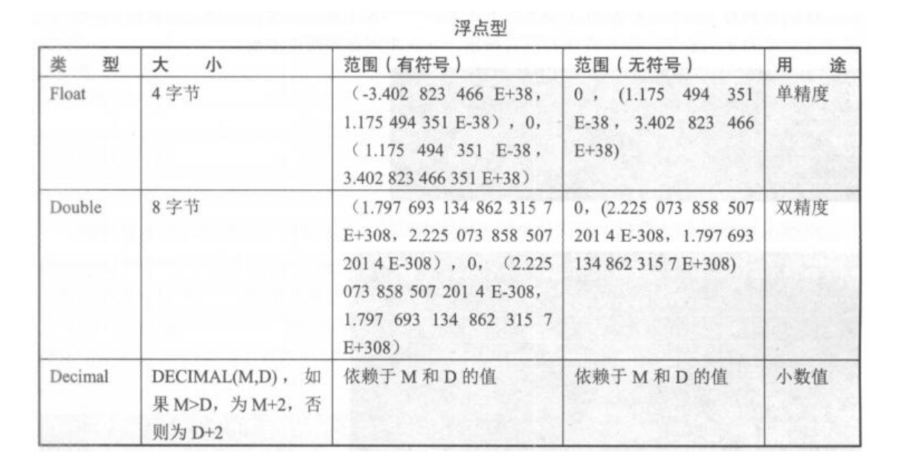
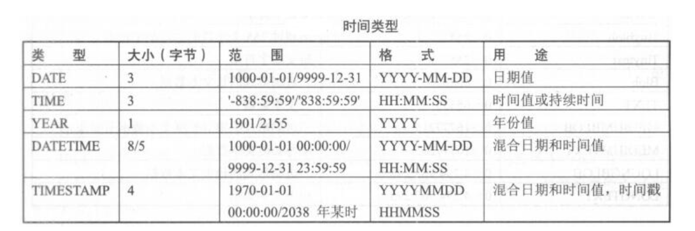
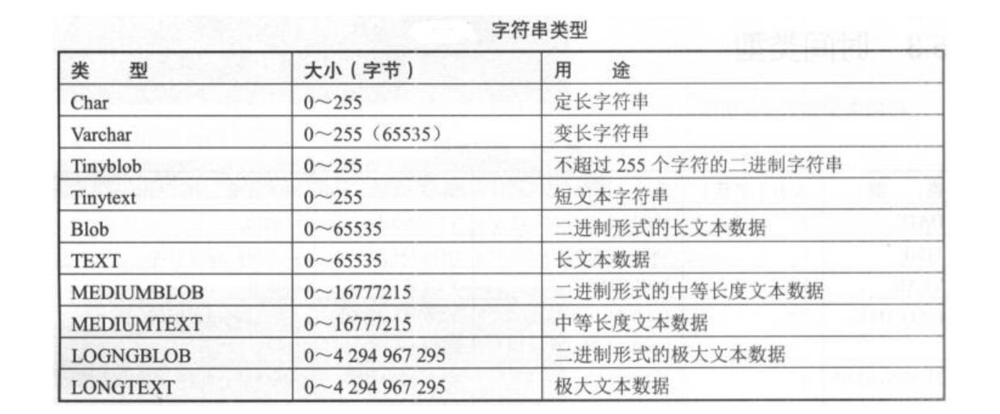

# 05.表
禁止使用中文做字段名；禁止使用字符型做主键；禁止无主键或是唯一索引的表出现

MySQL数据类型可分为整型、浮点型、字符型、日期时间型。允许指定数值字段中的值是否有正负之分或者用零填补


## 整型
int、tinyint使用最多

因为InnoDB表是索引组织表，需要保证索引结构不经常翻转，避免造成性能消耗
所以在选择主键时，需要选择不经常修改的、尽量与业务无关的、没有什么具体含义的字段，例如id字段
``` 
int(4)和int(8)有区别么？
int(n)括号里面的n表示显示宽度，实际存储大小没有区别，都是4字节
但如果写义了zerofill，int(4)中的4就有意义了，写入数字1，会补充成0001
#CREATE TABLE NewTable (id int(8) ZEROFILL NULL );
```
查看表结构概要：`desc table_name;`

## 浮点型

避免使用浮点类型，因为它属于不精确类型，在生产中不建议使用float和double
生产环境中，大多使用decimal来存储金钱字段，但数值在运算过程中还是会转成浮点来运算，且运算过程中会出现四舍五入的情况，会造成金额的不准确
``` 
CREATE TABLE NewTable (money decimal(6,2) NOT NULL );
这里的decimal(6,2)的6代表整数部分加小数部分的总长度，即整数部分位数是6-2=4；2代表小数部分保留位数，
若插入小数部分超过2，会发生截断，并四舍五入。这种四舍五入是应该避免的，
实际可以使用int来存储金钱，让单位为分，这样就不存在四舍五入且数值更精确
```

## 时间类型


``` 
datetime和timestamp
timestamp用得比较多
datetime在5.6之前占8字节，5.6之后占5字节，datetime时间范围比timestamp大，物理存储仅比timestamp多占1个字节，整体性能上区别不大
生产环境可以使用datetime时间类型
也可以使用int类型来存储时间，通过unix_timestamp和from_unixtime函数来转换
#select unix_timestamp('2018-06-25 16:30:11'); ##1529915411
#select from_unixtime(1529915411); ##2018-06-25 16:30:11
timestamp和datetime从5.6开始都支持自动更新为当前时间
```


## 字符串类型

text和blob这种存在大量文字或者图片的大数据类型切忌与业务表放在一起，业务表不能出现这样的字段
```
char和varchar
char类型用于定长字符串，范围为0~255。若数据未达到定义的位数，会用空格补全存入数据库中；若数据超过长度，会被截断
varchar是变长长度，范围为0~65535，存储时，若数据未达到定义的位数，不会补空格；若超过指定长度，会被截断
varchar根据实际内容动态改变长度。数据位小于255时，用1个字节记录长度；大于256时，用2个字节来记录长度；还有一个位用于记录是否为nul值
varchar(100)里面的100代表字符：
utf8字符集下，存储空间为100x3+1=301字节；gbk字符集下，存储空间为100x2+1=201字节
latin1字符集下char与varchar存储空间比较：

```


```
MySQL每一行最大字节数为65535，使用uft8，最大不能超过(65535-1-2)/3=21844；若使用gbk则(65535-1-2)/2=36766
```
IPv4推荐使用int类型来存储，需要使用到inet_aton和inet_ntoa两个函数
```
select inet_aton('192.168.1.100'); ##3232235876
select inet_ntoa(3232235876); ##192.168.1.100
```

## 字符集
MySQL数据库字符集包括字符集character和校对规则collation两个概念。字符集用来定义MySQL数据字符串的存储方式，校对规则是定义比较字符串的方式

常用字符集有：
```
GBK(2字节)、Latin1(1字节)、UTF8(3字节)、UTF8mb4(4字节)。UTF8mb4是UTF8的超集，针对5.7，建议使用UTF8mb4字符集
```

```
字符集最容易出现的问题是中文乱码
字符集涉及连接配置、数据库、服务器、表、字段、结果集
避免中文乱码，保证三线统一就可以了：
1）连接终端的字符集必须是UTF8

2）操作系统的字符集必须是UTF8
#echo $LANG ##en_US.UTF-8

3）MySQL数据库字符集必须是UTF8
查看命令 \s; 或status;

Server characterset: utf8mb4
Db characterset: utf8mb4
Client characterset: utf8
Conn. characterset: utf8

show variables like "%char%";

配置文件：
character-set-server = utf8mb4
临时修改数据库字符集：set manes 字符集
#set names utf8
```


## 表碎片产生的原因
delete删除数据时，并不会把数据文件真实删除，只是将数据文件标识位删除，也不会整理数据文件，因此不会彻底释放表空间


delete删除会产生数据碎片，这些碎片会占用磁盘空间，且会影响读取效率，因而需要对表进行优化，对碎片进行整理


## 碎片计算方法及整理过程
``` 
show table status like "%table_name%"; #table_name为实际表名
碎片大小 = 数据总大小 - 实际表空间文件大小
数据总大小 = data_length + index_length
实际表空间大小 = rows x avg_row_length
#计算出来后，除以1024平方即可得到MB清除碎片方法一
alter table table_name engine=innodb
#该语句重新整理一遍全表数据，整理后数据连续性好，全表扫描快，表空间文件也变小，节约磁盘空间，清除碎片
#缺点是会给整表加写锁，速度较慢，业务高峰期不建议使用
备份原表数据，然后删掉，重新导入到新表中，新表和原表结构一样清除碎片方法二
备份恢复pt-online-schema-change可以在线整理表结构、收集碎片、给大表添加字段和索引，避免出现锁表导致阻塞读写的操作
5.7版本不需要使用这个命令，因为可以在线Online DDL
./pt-online-schema-change --user=root --password=root123 --host=localhost --alter="ENGINE=InnoDB" D=test,t=su --execute
```

## 表统计信息
统计每个库的大小、表的大小、数据和索引的大小等
``` 
统计每个库大小，单位GB
select table_schema,sum(data_length)/1024/1024/1024 as data_length,sum(index_length)/1024/1024/1024 as index_length,sum(data_length+index_length)/1024/1024/1024 as sum_data_index from information_schema.tables where table_schema!='information_schema' and table_schema!='mysql' group by table_schema;

统计库中每个表的大小，单位byte
#set SESSION sql_mode ='STRICT_TRANS_TABLES,NO_ZERO_IN_DATE,NO_ZERO_DATE,ERROR_FOR_DIVISION_BY_ZERO,NO_AUTO_CREATE_USER,NO_ENGINE_SUBSTITUTION ';
#解决sql_mode=only_full_group_by引起的异常
select table_name,data_length,index_length,sum(data_length+index_length) as total_size from information_schema.tables where table_schema='test' group by table_name;

统计所有数据库的大小，单位GB
select sum(data_length+index_length)/1024/1024/1024 from information_schema.tables;

查看sql模式
select @@global.sql_mode;
ONLY_FULL_GROUP_BY,STRICT_TRANS_TABLES,NO_ZERO_IN_DATE,NO_ZERO_DATE,ERROR_FOR_DIVISION_BY_ZERO,NO_AUTO_CREATE_USER,NO_ENGINE_SUBSTITUTION
解释：
ONLY_FULL_GROUP_BY，对GROUP BY聚合操作，若在SELECT中的列，没有在GROUP BY中出现，那么这个SQL是不合法的
#在使用group by 的时候，就要用MAX(),SUM(),ANT_VALUE()这种聚合函数，才能完成GROUP BY 的聚合操作
STRICT_TRANS_TABLES，一个值不能插入到一个事务表中，则中断当前操作，对非事务表不做限制
NO_ZERO_IN_DATE，严格模式下，不允许日期和月份为零
NO_ZERO_DATE，不允许插入零日期，插入零日期直接抛出错误
ERROR_FOR_DIVISION_BY_ZERO，insert或update中，若数据被零除，产生错误；无该指令则数据被零除时返回NULL
NO_AUTO_CREATE_USER，不自动创建用户
NO_ENGINE_SUBSTITUTION，如果需要的存储引擎被禁用或未编译，抛出错误；无该指令时，用默认存储引擎，并抛出一个异常
PIPES_AS_CONCAT，将"||"视为字符串连接操作符而非或运算符
ANSI_QUOTES，不能用双引号引用字符串，双引号解释为识别符
NO_AUTO_VALUE_ON_ZERO，影响自增长列的插入，若用户希望插入的值为0，可启用该项。默认插入0或NULL代表生成下一个自增长值
```

## 统计信息的收集方法
``` 
1）遍历information_schema.tables，收集某表的统计信息
2）show table status like "%table_name%";
```


## Mysq库表常用命令总结
``` 
use database_name:选择数据库
show databases:显示数据库
show tables:显示表
create database database_name:创建数据库
drop database database_name:删除数据库
create table table_name (字段列表):创建表
drop table table_name:删除表
delete from table_name (where):删除表内数据
truncate table table_name:清空表内数据
insert into table_name (字段列表) values (对应字段的值):插入数据
update table_name set 字段名=值 (where):更新数据
select * from table_name (where):查询数据
show create table table_name\G:查看建表语句
desc table_name:查看表结构
show table status:获取表基础信息
show index from table_name:查看当前表下索引情况
show full processlist:查看数据库当前连接情况
```