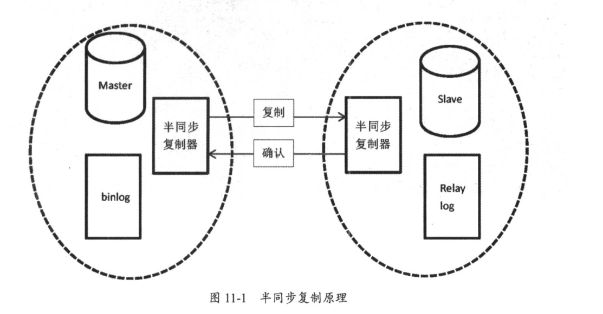
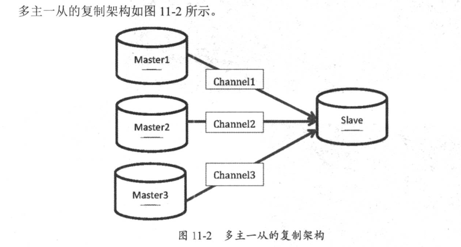

# 02.复制原理及实战演练

## 异步复制
在主库写入binlog日志后即可成功返回客户端，无须等待binlog日志传递给从库的过程。一旦主库发生宕机，就有可能出现丢失数据的情况

非gtid模式，基于binlog和position方式

### 环境：
``` 

Linux版本：Linux Centos 6.4 32位
Mysql版本：Mysql-5.6.38-linux-glibc2.12-i686
Mysql安装：Mysql安装教程
搭建环境：在源LAMP架构基础，增加一台Mysql服务，搭建Replication 主从。

主192.168.0.128
备192.168.0.129
```

### 主从的必要几个条件
``` 
·主库从库的server-id保证两者不一致

·主库开启binlig功能，从库建议也开启binlog，并且开启log_slave_updates参数，让从库也写binlog，方便后期扩展架构。
log_slave_updates = 1

· 为了避免后期出现数据不一致的情况，保证binlog格式为row模式来实施搭建过程，分别在主库和从库上配置如下：
binlog_format = row

```

### 主库上的操作
```

(1)修改本地主机名为master（可略）。

# 临时修改主机名
hostname master
# 实时生效
bash

vim /etc/sysconfig/network

NETWORKING=yes
HOSTNAME=master

(2) 修改mysql主配置文件
vim /etc/my.cnf
# 解注释：主ID为1
server-id = 1
# 解注释：开启二进制日志，mysql-bin前缀名
log-bin = /data/mysql/mysql-bin


# 重启Mysql服务
/etc/init.d/mysqld restart

# 查看bin-log日志
[root@master mysql]# ls /data/mysql/mysql-bin.*
/data/mysql/mysql-bin.000001  /data/mysql/mysql-bin.000002  /data/mysql/mysql-bin.000003  /data/mysql/mysql-bin.000004  /data/mysql/mysql-bin.index


(3)授权主从用户。
# 进入数据库
mysql -uroot -proot123
# 添加用户repl 授权主从允许访问所有库
mysql> grant replication slave on *.* to 'repl'@'192.168.0.%' identified by '123456';
# 安全起见:占时锁表,不让数据库更新
mysql> flush tables with read lock;

(4)查看二进制相关信息。
mysql> show master status;
+------------------+----------+--------------+------------------+-------------------+
| File             | Position | Binlog_Do_DB | Binlog_Ignore_DB | Executed_Gtid_Set |
+------------------+----------+--------------+------------------+-------------------+
| mysql-bin.000001 |      328 |              |                  |                   |
+------------------+----------+--------------+------------------+-------------------+
1 row in set (0.01 sec)


(4)从库测试到主库的连通性，使用授权用户
[root@pxe-server mysql]# mysql -urepl -p123456 -h192.168.0.128 -P3306
注：可登陆说明链接正常。
注：链接不上需要查看网络，端口，密码，地址等是否正确。


# 备份数据库为all_db.sql
[root@master mysql]# mysqldump -uroot -proot123  --all-databases > all_db.sql

# 远程将备份文件发送给从服务端的root目录内
[root@192 mysql]# scp all_db.sql root@192.168.0.129:/root/
到此，主库上的操作已结束。
```

### 从库上的操作
```

1、修改本地主机名为（可略）。

# 临时修改主机名
hostname slave
# 实时生效
bash

vim /etc/sysconfig/network
NETWORKING=yes
HOSTNAME=slave

(1)恢复从主库传递过来的数据
[root@pxe-server mysql]# mysql -uroot -proot123 < /root/all_db.sql 

2、修改Mysql主配置文件、重启服务。
# 修改mysq主配置文件
vim /etc/my.cnf
# 解注释：从ID为2、从可以注释掉此选项
server-id = 2
log-bin = /data/mysql/mysql-bin
# 重启Mysql服务
/etc/init.d/mysqld restart

(2)进入数据库,配置主从命令
mysql -uroot -proot123

# 关闭复制
stop slave;
# 配置主从建立链接、master_log_file与master_log_pos要与主内的数据匹配
change master to master_host='192.168.0.128',
master_port=3306,
master_user='repl',
master_password='123456',
master_log_file='mysql-bin.000001',
master_log_pos=328;

(3)开启复制
start slave;

(4)查看主从复制状态
mysql> show slave status\G
*************************** 1. row ***************************
               Slave_IO_State: Waiting for master to send event
                  Master_Host: 192.168.0.128
                  Master_User: repl
                  Master_Port: 3306
                Connect_Retry: 60
              Master_Log_File: mysql-bin.000001
          Read_Master_Log_Pos: 328
               Relay_Log_File: slave-relay-bin.000003
                Relay_Log_Pos: 491
        Relay_Master_Log_File: mysql-bin.000001
             Slave_IO_Running: Yes
            Slave_SQL_Running: Yes

##Slave_IO_Running和Slave_SQL_Running均为Yes即主从复制正常
```


### 报错处理
``` 
主库添加log-bin-index 参数后，从库报这个错误：Got fatal error 1236 from master when reading data from binary log: 'Could not find first log file name in binary log index file'
Got fatal error 1236 from master when reading data from binary log: 'could not find next log'

可以
stop slave;
reset slave;
start slave;
```

### 验证如下
```
# 主库上创建hujianlidb数据库
mysql> create database hujianlidb charset=utf8;
Query OK, 1 row affected (0.01 sec)

# 从库上查看数据库
mysql> show databases;
+--------------------+
| Database           |
+--------------------+
| information_schema |
| hujianlidb         |
| mysql              |
| performance_schema |
| test               |
| ttport             |
+--------------------+
6 rows in set (0.00 sec)
```

### 主从复制管理命令：
```
show slave status\G                 #在从库上查看主从状态。
show master status\G                #查看主库binlog文件和位置及开启gtid模式下记录的gtid。
change master to                    #在从库上配置主从过程。
start slave                         #开启主从同步。
stop slave                          #关闭主从同步。
reset slave all                     #清空从库的所有配置信息。
```


## 主从复制故障处理

### 1、主键冲突，错误代码1062

```
原因：由于误操作，在从库上执行了写入操作，导致再在主库执行相同操作时，由于主键冲突，
主从复制状态会报错。所以生产环境中建议在从库开启read only，避免在从库执行写入操作。


解决办法：可直接通过percona-toolkit工具集中的pt-slave-restart命令在从库跳过错误
./pt-slave-restart -uroot -proot123

再次查看主从状态，已经恢复正常。
```


### 2.主库更新数据，从库找不到而报错，错误代码1032

```
从库少数据，需要找到缺少的数据，在从库上重新执行一遍

原因：由于误操作，在从库上执行delete操作，导致主从数据不一致，这时再在主库执行同条数据的更新操作时，由于从库已经没有该数据，SQL无法在从库实现

```
解决办法：
``` 
根据报错信息所知道的binlog文件和position号，在主库上，通过mysqlbinlog找到在主库上执行的SQL语句
Last_Error: Could not execute Update_rows event on table test.t; Can't find record in 't', Error_code: 1032; handler error HA_ERR_KEY_NOT_FOUND; the event's master log mysql-binlog.000003, end_log_pos 1408


mysqlbinlog --no-defaults -v -v --base64-output=decode-rows mysql-binlog.000003 |grep -A 10 1408 >sql.log

#180706 22:36:45 server id 3306100 end_log_pos 1408 CRC32 0xc37d8c70 Update_rows: table id 139 flags: STMT_END_F
### UPDATE test.t
### WHERE
### @1=2 /* INT meta=0 nullable=0 is_null=0 */
### @2='tzy' /* VARSTRING(80) meta=80 nullable=1 is_null=0 */
### @3='sh' /* VARSTRING(40) meta=40 nullable=1 is_null=0 */
### SET
### @1=2 /* INT meta=0 nullable=0 is_null=0 */
### @2='zyn' /* VARSTRING(80) meta=80 nullable=1 is_null=0 */
### @3='sh' /* VARSTRING(40) meta=40 nullable=1 is_null=0 */
# at 1408
接下来只需把从库上丢失的这条数据补上，然后再执行跳过错误，主从复制功能就恢复正常了
注：在生产环境上，若从库缺失多条数据，建议重新搭建主从环境来确保数据一致性

insert into t (id,name,city) values ('2','zyn','sh');
./pt-slave-restart -uroot -proot123
```

### 主从server-id一致
``` 
原因：两台服务器配置了相同的server-id

解决方法：不同机器设置不同的server-id
```


### 跨库操作，丢失数据
``` 
原因：主库设置了binlog-do-db参数，使用的binlog记录格式为statement模式，导致在主库上执行跨库操作时，从库执行失败

解决办法：主库上尽量避免使用过滤规则，可以在从库上使用replicate-do-db或replicate-ignore-db等参数，最重要的是让binlog格式为row模式
```


## 半同步复制
异步复制的不足在于，当主库把event写入二进制日志后，并不知道从库是否已经接收并应用了。若主库崩溃，很有可能在主库中已经提交的事务，并没有传到任何一台从库机器上，在高可用集群架构下做主备切换，会造成新的主库丢失数据的现象

5.5版本引用半同步复制，主从服务器必须同时安装半同步复制插件，才能开启该复制功能。

在从库接收完主库传递过来的binlog内容写入到自己的relay log里面后，才通知主库上面的等待线程，该操作完毕。

若等待超时，超过rpl_semi_sync_master_timeout后，关闭半同步，转为异步，直到至少有一台从库通知主库已收到binlog信息为止

半同步复制可以提升主从间数据一致性，让复制更加安全可靠


5.7中增加rpl_semi_sync_master_wait_point参数，控制半同步模式下主库在返回给session事务成功之前的事务提交方式，

值有：`AFTER_COMMIT`、`AFTER_SYNC`

``` 
AFTER_COMMIT，5.6默认值，主库将每个事务写入binlog，并传递给从库，刷新到中继日志中，同时主库提交事务，之后主库等待从库反馈，在收到从库回复后，主库才将"commit ok"结果反馈客户端

AFTER_SYNC，5.7默认值，主库将每个事务写入binlog，并传递给从库，刷新到中继日志中，主库等待从库反馈，在收到从库回复后，主库再提交事务并返回"commit ok"结果给客户端
```

rpl_semi_sync_master_wait_for_slave_count 控制主库接收多少个从库写事务成功反馈，才返回成功给客户端
在after_sync模式下，即使主库宕机，所有在主库上已经提交的事务都能保证已经同步到从库中继日志中，不会丢失数据

MySQL半同步复制原理



``` 
半同步复制搭建：
1）在异步复制的基础上
2）在主库中安装半同步复制插件并开启半同步复制功能
install plugin rpl_semi_sync_master soname 'semisync_master.so';
set global rpl_semi_sync_master_enabled=on;

mysql> show variables like "%semi%";
+------------------------------------+-------+
| Variable_name                      | Value |
+------------------------------------+-------+
| rpl_semi_sync_master_enabled       | ON    |

show plugins;
| rpl_semi_sync_master       | ACTIVE   | REPLICATION        | semisync_master.so | GPL    
#rpl_semi_sync_master_timeout 主库等待从库回复消息的时间超时，单位毫秒，
超过该值就切换为异步复制，默认10s。该值可以设置得很大，禁止向异步复制切换保保证数据复制的安全性


3）在从库中安装半同步复制插件并开启半同步复制功能
mysql> install plugin rpl_semi_sync_slave soname 'semisync_slave.so';
Query OK, 0 rows affected (0.01 sec)

mysql> set global rpl_semi_sync_slave_enabled=on;
Query OK, 0 rows affected (0.00 sec)

mysql> show variables like "%semi%";
+---------------------------------+-------+
| Variable_name                   | Value |
+---------------------------------+-------+
| rpl_semi_sync_slave_enabled     | ON    |

show plugins;
| rpl_semi_sync_slave        | ACTIVE   | REPLICATION        | semisync_slave.so | GPL 
为了以后开机自启半同步复制功能，
可以把rpl_semi_sync_slave_enabled=on、rpl_semi_sync_master_enabled=on写到配置文件my.cnf中


4）重启从库I/O线程激活半同步复制
mysql> stop slave io_thread;
Query OK, 0 rows affected (0.00 sec)

mysql> start slave io_thread;
Query OK, 0 rows affected (0.00 sec)


5）在主库上检查半同步复制是否正常运行
show global status like "%semi%";
Rpl_semi_sync_master_clients 1 #已经有一个从库连接到了主库，且是半同步复制方式
Rpl_semi_sync_master_status ON #表示已经是半同步复制模式
Rpl_semi_sync_master_no_tx 0 #没有成功接收slave提交的次数
Rpl_semi_sync_master_yes_tx 0 #成功接收slave事务回复的次数

6）在从库上查看半同步复制状态
mysql> show global status like "%semi%";
+----------------------------+-------+
| Variable_name              | Value |
+----------------------------+-------+
| Rpl_semi_sync_slave_status | ON    |
+----------------------------+-------+

Rpl_semi_sync_slave_status ON #从库开启了半同步复制
```


## 半同步模式和异步复制模式的切换
半同步复制的原理是从库I/O thread接收完主库binlog后，写入relay中，然后会给主库一个回馈。
但若主库等待从库回复时间超过rpl_semi_sync_master_timeout时间后，会自动切换为异步复制方式。

目前测试过程中，等待时间是10s
``` 
mysql> show variables like "%rpl_semi_sync_master_timeout%";
+------------------------------+-------+
| Variable_name                | Value |
+------------------------------+-------+
| rpl_semi_sync_master_timeout | 10000 |

```

### 半同步切换为异步
``` 
从库：stop slave io_thread;
从库：show global status like "%semi%"; #OFF状态
主库：show global status like "%semi%"; #ON状态

#插入要等待10秒很慢，主库一直在等待从库的回复，直到超过默认的等待时间10s
主库：insert into t (name,city) values ('ff','99');

主库：show global status like "%semi%"; #OFF状态

```
生产环境中不建议半同步复制切换到异步复制模式，因为这样对安全性没有保证，
所以部分公司将rpl_sync_master_timeout设置得很大。

#### 异步切换为半同步
如果再想从异步复制切换到半同步复制，只需要重新开启从库的I/O thread。
命令：
``` 
# 从库半同步复制开启
start slave io_thread;

mysql> show global status like "%semi%";
+----------------------------+-------+
| Variable_name              | Value |
+----------------------------+-------+
| Rpl_semi_sync_slave_status | ON    |


# 主库半同步复制开启成功
mysql> show global status like "%semi%";
+--------------------------------------------+-------+
| Variable_name                              | Value |
+--------------------------------------------+-------+
| Rpl_semi_sync_master_status                | ON    |
```


## GTID复制
gtid，全局事务ID，是一个已提交事务的编号，且是全局唯一的编号，5.6版本后新增

gtid由server_uuid和事务id组成，GTID=server_uuid:transaction_id。server_uuid在数据库启动过程中自动生成，唯一，存放于数据目录auto.cnf中；transaction_id是事务提交时由系统顺序分配的不重复的序列号

gtid的优势：
```
1）使用master_auto_position=1代替基于binlog和position号的主从复制方式，更便于主从复制的搭建
2）gtid可以知道事务在最开始是在哪个实例上提交的
3）gtid方便实现主从间failover，再也不用不断地找position和binlog了
```


### 主库配置
```
gtid_mode=on
enforce_gtid_consistency=on
log_bin=on
server-id=1
binlog_format=row
```

### 从库配置
``` 
gtid_mode=on
enforce_gtid_consistency=on
log_slave_updates=1
```


### 清除原有主从复制关系
从库：
``` 
stop slave;
reset slave all;
show slave status\G    #结果应为空
server-id=
```

主库：
```
reset master;    #删除所有binlog日志文件，并清空日志索引文件，重新开始所有新的日志文件
```


建立主从复制：
主库
```
mysql> show master status\G;
*************************** 1. row ***************************
             File: on.000002
         Position: 333
     Binlog_Do_DB: 
 Binlog_Ignore_DB: 
Executed_Gtid_Set: 0295c9c0-5e0b-11ea-8d6e-000c296e3df6:1

 #查看Executed_Gtid_Set，从库操作完成后，Executed_Gtid_Set值会自动生成。
```
从库
``` 
# 测试授权用户到主库的连接
[root@slave mysql]# mysql -urepl -p123456 -h192.168.0.128 -P3306
mysql> change master to
    -> master_host='192.168.0.128',
    -> master_user='repl',
    -> master_password='123456',
    -> master_port=3306,
    -> master_auto_position=1;


mysql> start slave;


mysql> show slave status\G;
*************************** 1. row ***************************
               Slave_IO_State: Waiting for master to send event
                  Master_Host: 192.168.0.128
                  Master_User: repl
                  Master_Port: 3306
                Connect_Retry: 60
              Master_Log_File: on.000002
          Read_Master_Log_Pos: 151
               Relay_Log_File: slave-relay-bin.000002
                Relay_Log_Pos: 347
        Relay_Master_Log_File: on.000002
             Slave_IO_Running: Yes
            Slave_SQL_Running: Yes

```

5.7之后，gtid_executed这个值持久化了，在mysql库下新增了一张表：`gtid_executed`

该表会记录已经执行的gtid集合的信息，有了这张表，就不用再像5.6版本时，必须开启log_slave_updates参数，从库才可以进行复制。
gtid信息会保存在gtid_executed表中，可以关闭从库binlog，节约binlog记录开销。执行reset master时，会清空表内所有数据

5.7还有`gtid_executed_compression_period`参数，控制gtid_executed表压缩，默认值为1000，表示执行完1000个事务后开始压缩


### 验证
``` 
# 主库上创建hujianlitest2数据库
mysql> create database hujianlitest2 charset=utf8;


# 从库上查看
mysql> show databases;
+--------------------+
| Database           |
+--------------------+
| hujianlitest2      |
```


### GTID复制与传统复制的切换

``` 
当前为gtid复制，配置文件中gtid_mode=on，调整为传统复制
show slave status\G
#停止主从复制，调整为传统复制，让master_auto_position=0
stop slave;
show slave status\G #获取主库当前binlog和pos
change master to
master_auto_position=0,
master_host='192.168.10.110',
master_user='bak',
master_password='bak123',
master_port=3306,
master_log_file='mysql-binlog.000002',
master_log_pos=680;
start slave;
```

#### 传统复制 -> GTid复制
```
主从服务器上同时调整gtid_mode为on_permissive
show variables like "%gtid_mode%";   #ON状态
set global gtid_mode=on_permissive;

主从服务器上同时调整gtid_mode为off_permissive
set global gtid_mode=off_permissive;

主从服务器上同时关闭gtid功能
set global gtid_mode=off;
将gtid_mode=off和enforce_gtid_consistency=off写入配置文件my.cnf中，下次重启会直接生效

检查是否成功
标志：show slave status\G，gtid值不再增加

```

#### GTID复制 -> 传统复制
```
主从上同时修改enforce_gtid_consistency=warn，确保在error log中不会出现警告信息
set global enforce_gtid_consistency=warn;
show variables like "%gtid_consistency%";

主从上同时把enforce_gtid_consistency改为on，保证gtid一致性
set global enforce_gtid_consistency=on;

主从服务器上同时调整gtid_mode为off_permissive
set global gtid_mode=off_permissive;

主从服务器上同时调整gtid_mode为on_permissive
set global gtid_mode=on_permissive;

show variables like "%gtid_mode%";
确认从库ongoing_anonymous_transaction_count参数是否为0，若为0，代表没有等待的事务，可以进行下一步了

show global status like "%ongoing_anonymous_transaction_count%";
主从服务器上同时设置gtid_mode=on
set global gtid_mode=on;

把传统复制改为gtid，需要把原有传统复制停止，再执行change master to master_auto_position=1
stop slave;
change master to master_auto_position=1;
start slave;
show slave status\G
检查：若gtid值增加，则说明gtid复制成功
```

#### GTID使用中的限制
GTID是针对事务来说的，一个事务对应一个GTID
```
1）不能使用create table table_name select * from table_name
2）在一个事务中既包含事务表的操作又包含非事务表的操作
3）不支持create temporary table、drop temporary table语句
4）使用GTID复制从库跳过错误时，不支持执行sql_slave_skip_counter参数
```

## 多源复制
把多台主库数据同步到一台从库上，从库会创建通往每个主库的管道。多源复制在5.7版本上新增，它的搭建模式支持gtid和binlog+position方式


多源复制优势：
```
1）可以集中备份，在从库上备份，不影响线上数据库正常运行
2）节约从库成本，只需一个服务器即可
3）数据都汇总在一起，方便后期做数据统计
```


``` 
搭建中注意事项：

MasterA和MasterB不能拥有相同的数据库名，否则会在从库出现数据覆盖现象

MasterA->slave与MasterB->slave要拥有不同的复制帐号

三台机器的数据库参数跟gtid复制一样，保证开启gtid，server-id不一致，binlog格式为row

从库需要配置参数，主从间复制信息要记录到表中
master_info_repository=table
relay_log_info_repository=table
```

### 基于GTID的多源复制搭建过程
``` 
1）分别在MasterA和MasterB上创建复制帐号
A：
create user 'bak'@'192.168.10.%' identified by 'bak123';
grant replication slave on *.* to 'bak'@'192.168.10.%';
flush privileges;
B:
create user 'repl'@'192.168.10.%' identified by 'repl123';
grant replication slave on *.* to 'repl'@'192.168.10.%';
flush privileges;


2）分别在A/B上使用mysqldump导出需要备份的tzy库和zs库
A:
mysqldump -uroot -proot123 --master-data=2 --single-transaction --set-gtid-purged=OFF tzy > /root/tzy.sql
B:
mysqldump -uroot -proot123 --master-data=2 --single-transaction --set-gtid-purged=OFF zs > /root/zs.sql


3）从库开启参数
master_info_repository=table
relay_log_info_repository=table


4）在从库上进行数据库的恢复操作
scp tzy.sql root@192.168.10.120:/root
scp zs.sql root@192.168.10.120:/root
mysql -uroot -proot123 tzy <tzy.sql
mysql -uroot -proot123 zs <zs.sql


5）在从库上分别配置MasterA->slave MasterB->slave的同步过程
忽略部分库
##建议配置文件中添加replicate_ignore_db=
stop slave sql_thread;
change replication filter replicate_do_db=(db_list) replication_ignore_db=(db_list)  #不需要重启
start slave sql_thread;
change replication filter需要super权限
##
change master to
master_host='192.168.10.110',
master_user='bak',
master_password='bak123',
master_auto_position=1 for channel 'm1';
change master to
master_host='192.168.10.130',
master_user='repl',
master_password='repl123',
master_auto_position=1 for channel 'm2';
这里定义两个从库通往主库的通道，m1和m2


6）开启主从复制，可以通过start slave开启所有复制，也可以通过start slave for channel来分别开启
start slave for channel 'm1';
start slave for channel 'm2';

查看状态
show slave status\G
show slave status for channel 'm1'\G
show slave status for channel 'm2'\G
performance_schema库下replication_connection_configuration记录复制配置信息；replication_connection_status表记录主从复制状态
start/stop slave for channel 'name'; 启动/关闭某个通道的复制
reset slave all for channel 'name'; 重置某个通道的复制

```
跳过一步


```
传统复制：
stop slave;
set global sql_slave_skip_counter = 1;
start slave;
show slave status;

gtid复制：
首先找到gtid点
show slave status\G
Retrieved_Gtid_Set: cfc0499d-8109-11e8-89cc-000c29014dc0:1-9  #将要执行的事务
Executed_Gtid_Set: 99af9b61-8109-11e8-9b9e-000c297d2b33:1-7:9 #已经执行的事务

#将要执行事务1-9，已经执行1-7:9，已经从事务1执行到了事务7，报错了，说明是在执行事务8的时候，所以这里把事务8设置成空事务
#也可以到相应主库在查看事务8内容，确认是不是和报错的语句对应

#show binary logs;  查看binlog文件名

#show binlog events; 显示二进制日志内事件，默认为第一个日志文件

#show binlog events in 'mysql-binlog.000001';  查看指定文件

#语法：show binlog events [in 'log_name'] [from pos] [limit [offset,] row_count]
stop slave;
set gtid_next='cfc0499d-8109-11e8-89cc-000c29014dc0:8';
begin;commit;
set gtid_next='automatic';
```

## 总结
生产环境中建议使用GTID+rows复制模式，直接根据GTID找到同步的位置，不需要再去查找binlog和position的位置。
对于维护主从架构太方便了，MySQL的复制也是为了后期的高可用集群架构做准备。


参考文献如下：
https://pdf.us/2018/07/05/1494.html