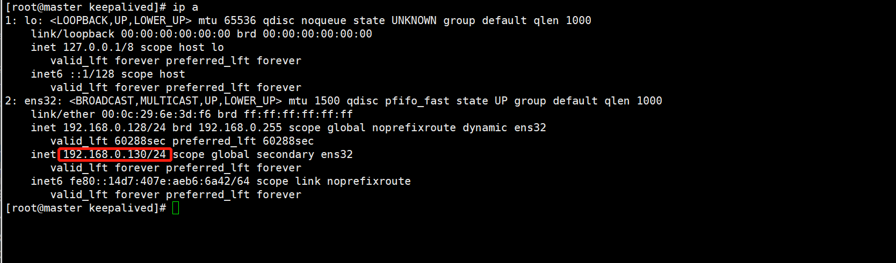

# 02.Keepalived加双主架构

keepalived使用vip，利用keepalived自带的服务监控和自定义脚本实现mysql故障时自动切换


## Keepalived
keepalived是基于vrrp协议的，虚拟冗余路由协议。master会向backup节点发送广播信号，当backup节点接收不到master发送的vrrp包时，会认为master宕机，这时会根据vrrp的优先级选举一个backup充当master，该master会持有vip，而vip是对处应用连接的ip，从而保证业务的正常运行

优先级，用1<254表示，数字越小优先级超低。当值为0时，表示放弃持有vip，值为255时，当前master优先级最高并持有vip

vrid，虚拟路由标识，同组机器内vrid必须一致，通常用0~255标识

```
官网：http://www.keepalived.org/
当前最新版本：http://www.keepalived.org/software/keepalived-2.0.5.tar.gz
```


keepalived启动后，会有watch dog、vrrp、health-check三个进程，watch dog负责监控vrrp和health-check进程，vrrp负责当master不可用时通过vrrp切换到backup服务器，health-check检测服务器健康状态


keepalived启动后，会有`watch dog`、`vrrp`、`health-check`三个进程，
watch dog负责监控vrrp和health-check进程，
vrrp负责当master不可用时通过vrrp切换到backup服务器，
health-check检测服务器健康状态。


## 集群搭建思路
``` 
搭建思路：
1）需要两台MySQL服务器，互为主从，都可读写。一台负责写入，一台充当备用
2）安装Keepalived软件，yum的就可以
3）整理好Keepalivd配置文件，理清Keepalived三种状态；准备监控MySQL的脚本，便于检测到宕机，从而进行切换
4）两台机器的state都采用backup，且都是nopreempt非抢占模式，避免出现冲突和发生脑裂

注意事项：

1）切换机制要合理，避免切换不成功的现象发生
2）从库配置尽量与主库一致，性能不能太差，避免切换后的新主库影响线上业务
3）延迟问题，可以使用PXC完成实时同步功能，基本上可以实现没有延迟
4）Keepalived无法解决脑裂问题，因此在进行服务异常判断时，可以修改判断脚本，通过第三方节点补充检测来决定是否进行切换，可降低发生脑裂、冲突现象
5）设置节点状态时，都设置成backup状态且非抢占模式，通过优先级决定谁是主库，避免脑裂和冲突
6）云平台环境上，此架构可能不能搭建，因为VRRP协议可能被禁用
```
一般中小型公司都使用这种架构，搭建比较方便简单：可以采用主从或者主主模式，在master节点发生故障后，利用Keepalived高可用机制实现
快速切换到slave节点，原来的从库变成新的主库。


## 集群部署
``` 
结构：
192.168.0.128 主masterA
192.168.0.129 备masterB
192.168.0.130/24 VIP
gtid+row模式
```

部署过程：

### 第一步，分别在主备上创建同步复制帐号
```
grant replication slave on *.* to 'repl'@'192.168.0.%' identified by '123456';
flush privileges;
```

### 第二步，搭建双主

192.168.0.128上执行
``` 
change master to
master_host='192.168.0.129',
master_user='repl',
master_password='123456',
master_auto_position=1;
```

192.168.0.129上执行
``` 
change master to
master_host='192.168.0.128',
master_user='repl',
master_password='123456',
master_auto_position=1;
```

在主备上执行
```
start slave;
show slave status\G;
```
查看主从同步状态
GTID+row模式


主机上
``` 
mysql> show slave status\G;
*************************** 1. row ***************************
               Slave_IO_State: Waiting for master to send event
                  Master_Host: 192.168.0.129
                  Master_User: repl
                  Master_Port: 3306
                Connect_Retry: 60
              Master_Log_File: mysql-bin.000001
          Read_Master_Log_Pos: 151
               Relay_Log_File: master-relay-bin.000002
                Relay_Log_Pos: 361
        Relay_Master_Log_File: mysql-bin.000001
             Slave_IO_Running: Yes
            Slave_SQL_Running: Yes
```

备机上
``` 
mysql> show slave status\G;
*************************** 1. row ***************************
               Slave_IO_State: Waiting for master to send event
                  Master_Host: 192.168.0.128
                  Master_User: repl
                  Master_Port: 3306
                Connect_Retry: 60
              Master_Log_File: on.000001
          Read_Master_Log_Pos: 151
               Relay_Log_File: slave-relay-bin.000002
                Relay_Log_Pos: 347
        Relay_Master_Log_File: on.000001
             Slave_IO_Running: Yes
            Slave_SQL_Running: Yes

```


### 第三步，在两台机器上安装keepalived软件
相关参考：http://pdf.us/2018/06/12/1311.html


主备机操作如下：
``` 
yum -y install keepalived

[root@master mysql]# rpm -qa|grep keepalived
keepalived-1.3.5-16.el7.x86_64

systemctl start keepalived
systemctl status keepalived

```

### 第四步，配置检测MySQL的脚本
通过判断MySQL服务是否宕机，确定停止Keepalived服务进行切换操作
cat /etc/keepalived/checkmysql.sh
``` 
#!/bin/bash
mysqlstr=/usr/local/mysql/bin/mysql
# 注意主备检查脚本中ip不能相同 主为VIP 备为自已的ip
host=192.168.0.130
#host=192.168.10.129
user=healthcheck
password=check123
port=3306
##MySQL服务状态正常为1 否则为0
mysql_status=1
###check mysql status###
$mysqlstr -h $host -u$user -p$password -P $port -e "show status;" >/dev/null 2>&1
if [ $? = 0 ] ;then
    echo "mysql_status=1"
    exit 0
else
    #/etc/init.d/keepalived stop
    systemctl stop keepalived
fi

```
```
#不需要授任何权限，仅需执行show status命令
create user 'healthcheck'@'192.168.0.%' identified by 'check123';  
flush privileges;
chmod +x /etc/keepalived/checkmysql.sh
```

### 第五步，修改Keepalive配置文件
主机
cat /etc/keepalived/keepalived.conf
``` 
! Configuration File for keepalived

global_defs {
    notification_email {
        root@localhost     
    }
    notification_email_from keepalived@localhost
    smtp_server 127.0.0.1       
    smtp_connect_timeout 30
    script_user root
    enable_script_security
    route_id mysql_GTID
}
vrrp_script chk_mysql
{
    script "/etc/keepalived/checkmysql.sh"
    interval 5
    weight 2
}

vrrp_instance VI_1 {
    state BACKUP
    interface ens32
    virtual_router_id 151
    priority 100
    nopreempt
    advert_int 1
    authentication {
        auth_type PASS
        auth_pass 1111
    }

    track_script {
        chk_mysql
    }
    virtual_ipaddress {
        192.168.0.130/24
    }

}

```


备机
cat /etc/keepalived/keepalived.conf 
``` 
! Configuration File for keepalived

global_defs {
    notification_email {
        root@localhost     
    }
    notification_email_from keepalived@localhost    
    smtp_server 127.0.0.1      
    smtp_connect_timeout 30
    script_user root
    enable_script_security
    route_id mysql_GTID
}
vrrp_script chk_mysql
{
    script "/etc/keepalived/checkmysql.sh"
    interval 5
    weight 2
}

vrrp_instance VI_1 {
    state BACKUP
    interface ens32
    virtual_router_id 151
    priority 90
    nopreempt
    advert_int 1
    authentication {
        auth_type PASS
        auth_pass 1111
    }

    track_script {
        chk_mysql
    }
    virtual_ipaddress {
        192.168.0.130/24
    }

}
```

两台机器都是backup，且都是非抢占模式nopreempt，通过优先级高低判定谁是主。virtual_router_id要保持一致


### 第六步，启动和测试
```
启动两台机器的keepalived进程
#/etc/init.d/keepalived start

systemctl start keepalived
#systemctl status keepalived

#systemctl stop keepalived
#netstat -ltunp|grep 3306
```


查看启动日志的输出结果：
主机上：
``` 
Mar  7 17:07:42 192 Keepalived_vrrp[24009]: VRRP_Instance(VI_1) Changing effective priority from 100 to 102
Mar  7 17:07:42 192 Keepalived_vrrp[24009]: VRRP_Instance(VI_1) Transition to MASTER STATE
Mar  7 17:07:43 192 Keepalived_vrrp[24009]: VRRP_Instance(VI_1) Entering MASTER STATE
Mar  7 17:07:43 192 Keepalived_vrrp[24009]: VRRP_Instance(VI_1) setting protocol VIPs.
Mar  7 17:07:43 192 Keepalived_vrrp[24009]: Sending gratuitous ARP on ens32 for 192.168.0.130
Mar  7 17:07:43 192 Keepalived_vrrp[24009]: VRRP_Instance(VI_1) Sending/queueing gratuitous ARPs on ens32 for 192.168.0.130
Mar  7 17:07:43 192 Keepalived_vrrp[24009]: Sending gratuitous ARP on ens32 for 192.168.0.130
Mar  7 17:07:43 192 Keepalived_vrrp[24009]: Sending gratuitous ARP on ens32 for 192.168.0.130
Mar  7 17:07:43 192 Keepalived_vrrp[24009]: Sending gratuitous ARP on ens32 for 192.168.0.130
Mar  7 17:07:43 192 Keepalived_vrrp[24009]: Sending gratuitous ARP on ens32 for 192.168.0.130
```
备机上：
``` 
Mar  7 17:07:49 pxe-server Keepalived[19584]: Starting VRRP child process, pid=19586
Mar  7 17:07:49 pxe-server systemd: Started LVS and VRRP High Availability Monitor.
Mar  7 17:07:49 pxe-server Keepalived_healthcheckers[19585]: Opening file '/etc/keepalived/keepalived.conf'.
Mar  7 17:07:49 pxe-server Keepalived_healthcheckers[19585]: Unknown keyword 'route_id'
Mar  7 17:07:49 pxe-server Keepalived_vrrp[19586]: Registering Kernel netlink reflector
Mar  7 17:07:49 pxe-server Keepalived_vrrp[19586]: Registering Kernel netlink command channel
Mar  7 17:07:49 pxe-server Keepalived_vrrp[19586]: Registering gratuitous ARP shared channel
Mar  7 17:07:49 pxe-server Keepalived_vrrp[19586]: Opening file '/etc/keepalived/keepalived.conf'.
Mar  7 17:07:49 pxe-server Keepalived_vrrp[19586]: Unknown keyword 'route_id'
Mar  7 17:07:50 pxe-server Keepalived_vrrp[19586]: VRRP_Instance(VI_1) removing protocol VIPs.
Mar  7 17:07:50 pxe-server Keepalived_vrrp[19586]: Using LinkWatch kernel netlink reflector...
Mar  7 17:07:50 pxe-server Keepalived_vrrp[19586]: VRRP_Instance(VI_1) Entering BACKUP STATE
Mar  7 17:07:50 pxe-server Keepalived_vrrp[19586]: VRRP sockpool: [ifindex(2), proto(112), unicast(0), fd(10,11)]
Mar  7 17:07:50 pxe-server Keepalived_vrrp[19586]: VRRP_Script(chk_mysql) succeeded
```

利用VIP连接MySQL服务器成功。
``` 
[root@master keepalived]# mysql -urepl -p123456 -h192.168.0.130
```

### 模拟主库宕机故障

主机模拟故障
``` 
[root@master keepalived]# /etc/init.d/mysql stop
Shutting down MySQL.... SUCCESS! 

[root@master keepalived]# ip a
1: lo: <LOOPBACK,UP,LOWER_UP> mtu 65536 qdisc noqueue state UNKNOWN group default qlen 1000
    link/loopback 00:00:00:00:00:00 brd 00:00:00:00:00:00
    inet 127.0.0.1/8 scope host lo
       valid_lft forever preferred_lft forever
    inet6 ::1/128 scope host 
       valid_lft forever preferred_lft forever
2: ens32: <BROADCAST,MULTICAST,UP,LOWER_UP> mtu 1500 qdisc pfifo_fast state UP group default qlen 1000
    link/ether 00:0c:29:6e:3d:f6 brd ff:ff:ff:ff:ff:ff
    inet 192.168.0.128/24 brd 192.168.0.255 scope global noprefixroute dynamic ens32
       valid_lft 59448sec preferred_lft 59448sec
    inet6 fe80::14d7:407e:aeb6:6a42/64 scope link noprefixroute 
       valid_lft forever preferred_lft forever
       
       
# 访问正常
[root@master keepalived]# mysql -urepl -p123456 -h192.168.0.130

```


