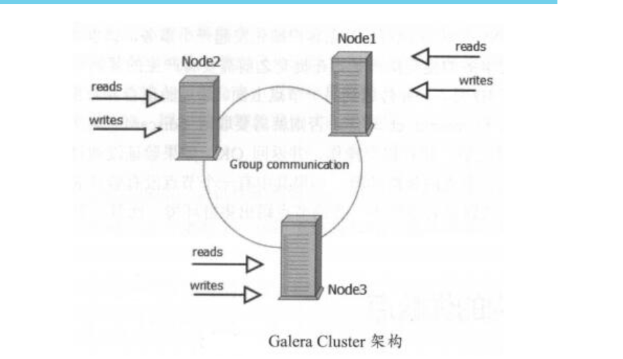
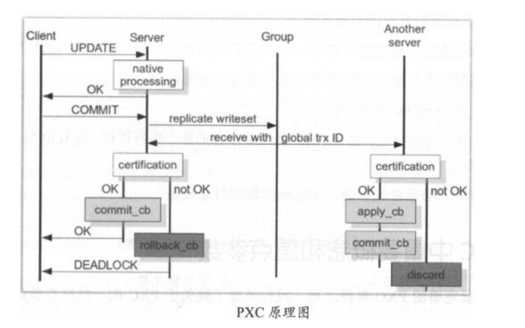

# 03.PXC

基于Galera协议的高可用集群架构。Galera Cluster是集成了Galera插件的MySQL集群。Galera replication是Codership提供的MySQL数据同步方案，具有高可用性，方便扩展，并可实现多节点间数据同步复制与读写，可保障数据库服务高可用及数据强一致性


基于Galera的高可用方案主要有：
MariaDB Galera Cluster和Percona XtraDB Cluster，简称PXC。

PXC在生产环境中用得更多且更成熟


PXC是近乎完美的MySQL高可用集群解决方案，最突出的特点是解决了复制延迟问题，
基本可以达到实时同步，节点间是对等关系，本身是多主架构。

要搭建PXC至少需要三个MySQL实例，三个实例间不是主从模式，各自为主，三者是对等关系，
不分从属，这就是multi-master架构。客户端写入和读取数据可以选择任意一个节点，
该架构不共享任何数据，是高冗余架构。




## PXC原理

PXC重要端口：
```
3306，对外服务端口号
4444，请求SST的端口，SST是数据库一个备份全量文件的传输
4567，组成员间进行沟通的端口
4568，传输IST，相对于SST来说的一个增量
```


客户端发起一个事务，该事务在本地执行，执行完成后要发起提交操作。
在提交前，需要将该事务产生的复制写集广播出去，然后获取到一个全局事务ID，并传送到另一节点上。
其他节点通过验证合并数据后，发现没有冲突数据，执行apply_cb,commit_cb动作，否则就取消discard此次事务操作。
当前节点通过验证后，执行提交，返回OK，如果验证不通过，则执行回滚。
集群中如果某个节点没有验证通过，出现数据冲突，那么该节点会被踢出集群，并执行shutdown关机

## PXC架构优缺点

优点：
```
1）实现集群高可用性和数据强一致性
2）真正的多节点读写的集群方案
3）达到实时同步
4）新加入的节点可以自动部署，无须提供手动备份，维护方便
5）多节点写入，数据库故障切换很容易
```

缺点：
```
1）新加入节点开销大，需复制完整数据，sst传输开销太大
2）任何更新事务都需要全局验证通过才会在每个节点上执行，集群性能受限于性能最差的节点
3）多节点并发写时，锁冲突问题比较严重
4）存在写扩大问题，所有节点都会发生写操作
5）只支持InnoDB存储引擎表
6）没有表级别的锁定，执行DDL会把整个集群锁住，且kill不了(建议osc操作)
7）所有表必须有主键，不然操作时会报错
```

## PXC重要概念和重点参数

``` 
整个集群节点数最少3个，最大8个。最少3个是为防止脑裂，脑裂的标志是输入任何命令，返回结果都是unknown command。节点在集群中，会因为新节点的加入或者故障，同步失效等发生状态切换
节点状态变化阶段：
open，节点启动成功，尝试连接到集群
primary，节点已加入集群，在新节点加入时，选取donor进行数据同步时会产生的状态
joiner，节点处于等待接收同步文件时的状态
joined，节点完成数据同步工作，尝试保持和集群进度一致
synced，节点正常提供服务的状态，表示已同步完成并和集群进度保持一致
doner，节点处于为新加入的节点提供全量数据时的状态
注：doner节点是数据的贡献者，一个新节点加入集群，doner负责使用SST为新节点传输数据。若数据量大，不建议使用SST全量传输，可以考虑选建立主从关系，再加入集群

PXC有两种数据传输方式：SST全量传输，IST增量传输。SST传输有xtrabackup、mysqldump、rsync三种方法；增量传输方法只有xtrabackup。生产环境中一般数据量不大时，可以使用SST传输，但通常使用xtrabackup方法
```


搭建PXC集群时，需要在PXC配置文件中设置好如下参数
``` 
wsrep_cluster_name  ##标识集群名称
wsrep_cluster_address=gcomm: ##列出集群成员
wsrep_node_address ##当前节点IP
wsrep_provider=/usr/local/mysql/lib/libgalera_smm.so ##指定Galera库
wsrep_sst_method=xtrabackup-v2 ##传输数据的方法
wsrep_sst_auth=sst:zs ##节点的数据库用户帐号和密码
```

GCache，每个节点缓存当前最新的写集，若有新节点加入，可以把新数据的增量传递给新节点，而不再使用SST方式。

涉及参数：
```
gcache.size 缓存写集的大小，默认128MB，通过wsrep_provider_options参数设置，建议2GB~4GB
gcache.mem_size 代表Gcache中内存缓存的大小，适度调大可以提高整个集群性能
gcache.page_size 若内存不足，直接将写集定入磁盘文件的大小
```

## PXC架构搭建
``` 
环境：
192.168.10.110 node1 master1
192.168.10.120 node2 master2
192.168.10.130 node3 master3
三台机器防火墙、selinux关闭、server-id不一样
```


参考文献：

https://pdf.us/2018/07/18/1568.html


