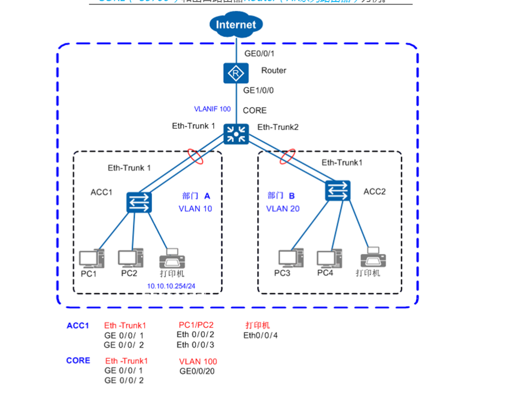

# 小型园区组网场景

### 拓扑图


JR1
``` 

[JR1]display current-configuration 
#
sysname JR1
#
vlan batch 5 10
#
stp bpdu-protection
#
cluster enable
ntdp enable
ndp enable
#
undo nap slave enable
#
drop illegal-mac alarm
#
dhcp enable
#
dhcp snooping enable
#
diffserv domain default
#
drop-profile default
#
vlan 5
 management-vlan                          
vlan 10
 ip source check user-bind enable
#
aaa
 authentication-scheme default
 authorization-scheme default
 accounting-scheme default
 domain default
 domain default_admin
 local-user admin password cipher ;\1'158;,GMI>,Z,88J\:Q!!
 local-user admin privilege level 15
 local-user admin service-type telnet
#
interface Vlanif1
#
interface Vlanif5
 ip address 10.10.1.1 255.255.255.0
#
interface MEth0/0/1
#
interface Eth-Trunk1
 port link-type trunk
 port trunk allow-pass vlan 10
 mode lacp-static                         
 dhcp snooping enable
 dhcp snooping trusted
#
interface Ethernet0/0/1
 port link-type access
 port default vlan 10
 stp disable
 stp edged-port enable
 dhcp snooping enable
#
interface Ethernet0/0/2
 port link-type access
 port default vlan 10
 stp disable
 stp edged-port enable
 dhcp snooping enable
#

#
interface GigabitEthernet0/0/1
 eth-trunk 1
#
interface GigabitEthernet0/0/2
 eth-trunk 1
#
interface NULL0
#
user-interface con 0
user-interface vty 0 4
 authentication-mode aaa
 idle-timeout 15 0


[JR1]display ip interface brief 
*down: administratively down
^down: standby
(l): loopback
(s): spoofing
The number of interface that is UP in Physical is 2
The number of interface that is DOWN in Physical is 2
The number of interface that is UP in Protocol is 1
The number of interface that is DOWN in Protocol is 3

Interface                         IP Address/Mask      Physical   Protocol  
MEth0/0/1                         unassigned           down       down      
NULL0                             unassigned           up         up(s)     
Vlanif1                           unassigned           up         down      
Vlanif5                           10.10.1.1/24         down       down      
[JR1] dis
[JR1]display int
[JR1]display interface b
[JR1]display interface brief 
PHY: Physical
*down: administratively down
(l): loopback
(s): spoofing
(b): BFD down
(e): ETHOAM down
(dl): DLDP down
(d): Dampening Suppressed
InUti/OutUti: input utility/output utility
Interface                   PHY   Protocol InUti OutUti   inErrors  outErrors
Eth-Trunk1                  up    up          0%     0%          0          0
  GigabitEthernet0/0/1      up    up          0%     0%          0          0
  GigabitEthernet0/0/2      up    up          0%     0%          0          0
Ethernet0/0/1               up    up          0%     0%          0          0
Ethernet0/0/2               up    up          0%     0%          0          0
MEth0/0/1                   down  down        0%     0%          0          0
NULL0                       up    up(s)       0%     0%          0          0
Vlanif1                     up    down        --     --          0          0
Vlanif5                     down  down        --     --          0          0

```

JR2
``` 

[JR2]display current-configuration 
#
sysname JR2
#
vlan batch 5 20
#
stp bpdu-protection
#
cluster enable
ntdp enable
ndp enable
#
undo nap slave enable
#
drop illegal-mac alarm
#
diffserv domain default
#
drop-profile default
#
vlan 5
 management-vlan
#
aaa
 authentication-scheme default
 authorization-scheme default             
 accounting-scheme default
 domain default
 domain default_admin
 local-user admin password simple admin
 local-user admin privilege level 15
 local-user admin service-type telnet
#
interface Vlanif1
#
interface Vlanif5
 ip address 10.10.1.2 255.255.255.0
#
interface MEth0/0/1
#
interface Eth-Trunk2
 port link-type trunk
 port trunk allow-pass vlan 20
 mode lacp-static
#
interface Ethernet0/0/1
 port link-type access
 port default vlan 20
 stp disable
 stp edged-port enable                    
#
interface Ethernet0/0/2
 port link-type access
 port default vlan 20
 stp disable
 stp edged-port enable
#

#
interface GigabitEthernet0/0/1            
 eth-trunk 2
#
interface GigabitEthernet0/0/2
 eth-trunk 2
#
interface NULL0
#
user-interface con 0
user-interface vty 0 4
 authentication-mode aaa
 idle-timeout 15 0
#

[JR2]display ip interface brief 
*down: administratively down
^down: standby
(l): loopback
(s): spoofing
The number of interface that is UP in Physical is 2
The number of interface that is DOWN in Physical is 2
The number of interface that is UP in Protocol is 1
The number of interface that is DOWN in Protocol is 3

Interface                         IP Address/Mask      Physical   Protocol  
MEth0/0/1                         unassigned           down       down      
NULL0                             unassigned           up         up(s)     
Vlanif1                           unassigned           up         down      
Vlanif5                           10.10.1.2/24         down       down      

[JR2]display interface brief 
PHY: Physical
*down: administratively down
(l): loopback
(s): spoofing
(b): BFD down
(e): ETHOAM down
(dl): DLDP down
(d): Dampening Suppressed
InUti/OutUti: input utility/output utility
Interface                   PHY   Protocol InUti OutUti   inErrors  outErrors
Eth-Trunk2                  up    up          0%     0%          0          0
  GigabitEthernet0/0/1      up    up          0%     0%          0          0
  GigabitEthernet0/0/2      up    up          0%     0%          0          0
Ethernet0/0/1               up    up          0%     0%          0          0
Ethernet0/0/2               up    up          0%     0%          0          0

MEth0/0/1                   down  down        0%     0%          0          0
NULL0                       up    up(s)       0%     0%          0          0
Vlanif1                     up    down        --     --          0          0
Vlanif5                     down  down        --     --          0          0
             
```


Core1
``` 
[coresw]display current-configuration 
#
sysname coresw
#
vlan batch 10 20 100
#
cluster enable
ntdp enable
ndp enable
#
drop illegal-mac alarm
#
dhcp enable
#
diffserv domain default
#
drop-profile default
#
ip pool 10
 gateway-list 10.10.10.1
 network 10.10.10.0 mask 255.255.255.0
#
ip pool 20
 gateway-list 10.10.20.1
 network 10.10.20.0 mask 255.255.255.0
#                                         
aaa
 authentication-scheme default
 authorization-scheme default
 accounting-scheme default
 domain default
 domain default_admin
 local-user admin password simple admin
 local-user admin service-type http

interface Vlanif10
 ip address 10.10.10.1 255.255.255.0
 dhcp select global
#
interface Vlanif20
 ip address 10.10.20.1 255.255.255.0
 dhcp select global
#
interface Vlanif100
 ip address 10.10.100.1 255.255.255.0
#
#                                         
interface Eth-Trunk1
 port link-type trunk
 port trunk allow-pass vlan 10
 mode lacp-static
#
interface Eth-Trunk2
 port link-type trunk
 port trunk allow-pass vlan 20
 mode lacp-static
#
interface GigabitEthernet0/0/1
 port link-type access
 port default vlan 100

#
interface GigabitEthernet0/0/10
 eth-trunk 1
#
interface GigabitEthernet0/0/11
 eth-trunk 1
#
interface GigabitEthernet0/0/12
 eth-trunk 2
#
interface GigabitEthernet0/0/13
 eth-trunk 2

#
interface NULL0
#
ip route-static 0.0.0.0 0.0.0.0 10.10.100.2
#
user-interface con 0
user-interface vty 0 4
#

[coresw]display ip interface brief 

Interface                         IP Address/Mask      Physical   Protocol  
MEth0/0/1                         unassigned           down       down      
NULL0                             unassigned           up         up(s)     
Vlanif1                           unassigned           up         down      
Vlanif10                          10.10.10.1/24        up         up        
Vlanif20                          10.10.20.1/24        up         up        
Vlanif100                         10.10.100.1/24       up         up        

[coresw]display interface brief 

(d): Dampening Suppressed
InUti/OutUti: input utility/output utility
Interface                   PHY   Protocol InUti OutUti   inErrors  outErrors
Eth-Trunk1                  up    up          0%     0%          0          0
  GigabitEthernet0/0/10     up    up          0%     0%          0          0
  GigabitEthernet0/0/11     up    up          0%     0%          0          0
Eth-Trunk2                  up    up          0%     0%          0          0
  GigabitEthernet0/0/12     up    up          0%     0%          0          0
  GigabitEthernet0/0/13     up    up          0%     0%          0          0
GigabitEthernet0/0/1        up    up          0%     0%          0          0
NULL0                       up    up(s)       0%     0%          0          0
Vlanif1                     up    down        --     --          0          0
Vlanif10                    up    up          --     --          0          0
Vlanif20                    up    up          --     --          0          0
Vlanif100                   up    up          --     --          0          0

[coresw]display ip routing-table 
Route Flags: R - relay, D - download to fib
------------------------------------------------------------------------------
Routing Tables: Public
         Destinations : 9        Routes : 9        

Destination/Mask    Proto   Pre  Cost      Flags NextHop         Interface

        0.0.0.0/0   Static  60   0          RD   10.10.100.2     Vlanif100
     10.10.10.0/24  Direct  0    0           D   10.10.10.1      Vlanif10
     10.10.10.1/32  Direct  0    0           D   127.0.0.1       Vlanif10
     10.10.20.0/24  Direct  0    0           D   10.10.20.1      Vlanif20
     10.10.20.1/32  Direct  0    0           D   127.0.0.1       Vlanif20
    10.10.100.0/24  Direct  0    0           D   10.10.100.1     Vlanif100
    10.10.100.1/32  Direct  0    0           D   127.0.0.1       Vlanif100
      127.0.0.0/8   Direct  0    0           D   127.0.0.1       InLoopBack0
      127.0.0.1/32  Direct  0    0           D   127.0.0.1       InLoopBack0

```


R1
```

[R1]display current-configuration 
[V200R003C00]
#
 sysname R1
#
 snmp-agent local-engineid 800007DB03000000000000
 snmp-agent 
#
 clock timezone China-Standard-Time minus 08:00:00
#
portal local-server load portalpage.zip
#
 drop illegal-mac alarm
#
 dns resolve  
 dns server 202.101.111.195 
 dns server 202.101.111.199 
 dns proxy enable
#
 set cpu-usage threshold 80 restore 75
#
acl number 2000  
 rule 5 permit source 10.10.10.0 0.0.0.255 
 rule 10 permit source 10.10.20.0 0.0.0.255 
 rule 15 permit source 10.10.100.0 0.0.0.255 
#                                         
aaa 
 authentication-scheme default
 authorization-scheme default
 accounting-scheme default
 domain default 
 domain default_admin 
 local-user admin password cipher %$%$K8m.Nt84DZ}e#<0`8bmE3Uw}%$%$
 local-user admin service-type http
#
firewall zone Local
 priority 15
#
interface GigabitEthernet0/0/0
 ip address 10.10.100.2 255.255.255.0 
#
interface GigabitEthernet0/0/1
 ip address 202.101.111.2 255.255.255.252 
 nat outbound 2000
#
interface GigabitEthernet0/0/2
#
interface NULL0
#
ip route-static 0.0.0.0 0.0.0.0 202.101.111.1
ip route-static 10.10.10.0 255.255.255.0 10.10.100.1
ip route-static 10.10.20.0 255.255.255.0 10.10.100.1
#
user-interface con 0
 authentication-mode password
user-interface vty 0 4
user-interface vty 16 20

[R1]display ip routing-table 
Route Flags: R - relay, D - download to fib
------------------------------------------------------------------------------
Routing Tables: Public
         Destinations : 13       Routes : 13       

Destination/Mask    Proto   Pre  Cost      Flags NextHop         Interface

        0.0.0.0/0   Static  60   0          RD   202.101.111.1   GigabitEthernet0/0/1
     10.10.10.0/24  Static  60   0          RD   10.10.100.1     GigabitEthernet0/0/0
     10.10.20.0/24  Static  60   0          RD   10.10.100.1     GigabitEthernet0/0/0
    10.10.100.0/24  Direct  0    0           D   10.10.100.2     GigabitEthernet0/0/0
    10.10.100.2/32  Direct  0    0           D   127.0.0.1       GigabitEthernet0/0/0
  10.10.100.255/32  Direct  0    0           D   127.0.0.1       GigabitEthernet0/0/0
      127.0.0.0/8   Direct  0    0           D   127.0.0.1       InLoopBack0
      127.0.0.1/32  Direct  0    0           D   127.0.0.1       InLoopBack0
127.255.255.255/32  Direct  0    0           D   127.0.0.1       InLoopBack0
  202.101.111.0/30  Direct  0    0           D   202.101.111.2   GigabitEthernet0/0/1
  202.101.111.2/32  Direct  0    0           D   127.0.0.1       GigabitEthernet0/0/1
  202.101.111.3/32  Direct  0    0           D   127.0.0.1       GigabitEthernet0/0/1
255.255.255.255/32  Direct  0    0           D   127.0.0.1       InLoopBack0


[R1]display interface brief 
Interface                   PHY   Protocol InUti OutUti   inErrors  outErrors
GigabitEthernet0/0/0        up    up          0%     0%          0          0
GigabitEthernet0/0/1        up    up          0%     0%          0          0
GigabitEthernet0/0/2        down  down        0%     0%          0          0
NULL0                       up    up(s)       0%     0%          0          0


```


R2
``` 
interface GigabitEthernet0/0/1
 ip address 202.101.111.1 255.255.255.252
```


部门A的PC1去ping部门B的PC3,正常ping通
部门A的PC1去ping公网网关地址，正常ping通 


    PC>ping 202.101.111.2
    
    Ping 202.101.111.2: 32 data bytes, Press Ctrl_C to break
    From 202.101.111.2: bytes=32 seq=1 ttl=254 time=62 ms

    PC>ping 202.101.111.1
    
    Ping 202.101.111.1: 32 data bytes, Press Ctrl_C to break
    From 202.101.111.1: bytes=32 seq=1 ttl=253 time=47 ms
