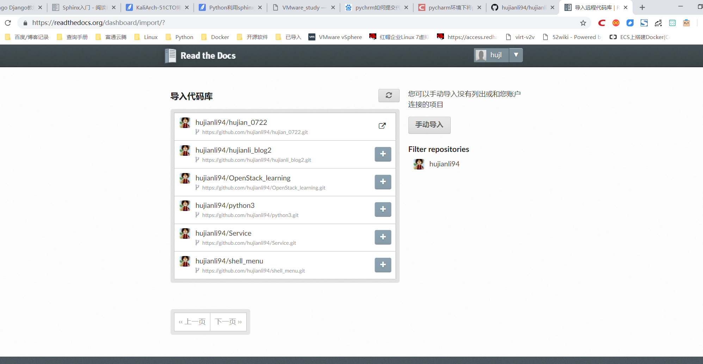
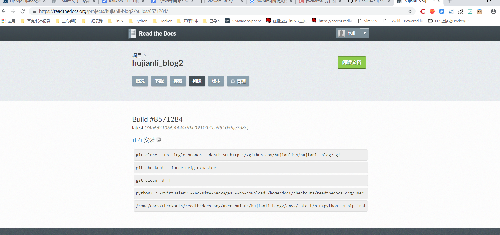
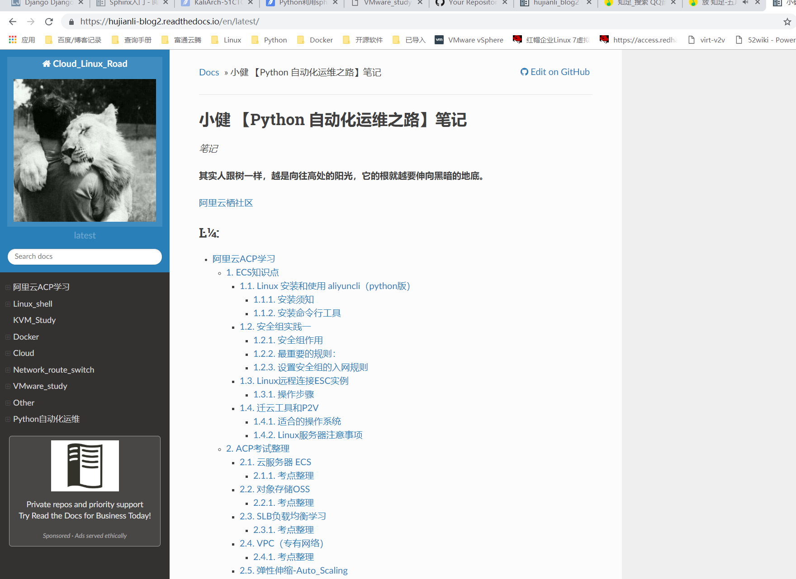

# Python利用sphinx构建个人博客

## 1.基础概念

利用sphinx+pandoc+github+readthedocs构建个人博客

* Sphinx： 是一个基于ReStructuredText的文档生成工具，可以令人轻松的撰写出清晰且优美的文档, 由Georg Brandl在BSD许可证下开发。新版的Python文档就是由Sphinx生成的，并且它已成为Python项目首选的文档工具，同时它对C/C++项目也有很好的支持；并计划对其它开发语言添加特殊支持。
* Read the Docs是一个在线文档托管服务，可以从各种版本控制系统中导入文档。支持webhooks，当你提交代码时，文档将被自动构建。
* Pandoc：pandoc是一款开源转换工具，可以实现常见的格式转换。支持全平台操作，以命令行的方式进行转换。

## 2.流程
Sphinx + GitHub + ReadtheDocs 作为一个文档写作工具，利用pandoc文本转换， 用Sphinx生成文档，GitHub托管文档，再导入到 ReadtheDocs。我们可以使用这个工具写文档、记笔记等。

## 3.实施部署

3.1 安装环境

```shell
# 此处利用的centos7.4 系统默认python版本2.7
$ cat /etc/redhat-release 
CentOS Linux release 7.3.1611 (Core) 

$ python --version
Python 2.7.5
# 需要安装git
```

3.2 pip 安装sphinx环境

```shell
$ python -m pip install --upgrade pip
$ pip install sphinx sphinx-autobuild sphinx_rtd_theme
$ pip install recommonmark
```


​        3.3 初始化项目

```shell
$ mkdir /mywike && cd /mywiki
sphinx-quickstart                 # 执行初始化，以下为自己输入，其他可按照默认直接回车
> Separate source and build directories (y/n) [n]: y    # 创建source目录
> Project name: KaliArch SHELL BLOG         # 项目名称
> Author name(s): KaliArch                  # 作者名称
> Project release []: 1.0                   
```

​    

3.4 目录结构

```shell
$ tree 
.
├── build           #文件夹，当你执行make html的时候，生成的html静态文件都存放在这里
├── make.bat
├── Makefile        #编译文件用 make 命令时，可以使用这些指令来构建文档输出
└── source          #文件夹，文档源文件全部应全部放在source根目录下
├── conf.py     #Sphinx 的配置文件
├── index.rst
├── img
└── _templates        
```


3.5 修改配置文件

    # 开启sys和os模块
    import os,sys
    
    # 配置主题
    html_theme = 'alabaster'
    
    # 支持LaTeX
    # 支持中文检索
    extensions = ['chinese_search']
    
    source_suffix = ['.rst', '.md']
    
    由于修改模板较麻烦可以直接git clone我的模板进行简单修改即可

> config.py文件是关键，此文件可以参考如下:
>
> https://github.com/redhatxl/kaliarchblog/blob/master/source/conf.py
>
> https://blog.csdn.net/qq_26848099/article/details/83583612
>     


3.6 安装第三方模块

```shell
$ yum install python-devel  
# 如果报错可能由于下载超时，重新执行即可。
$ pip install -r requirements.txt -i https://pypi.douban.com/simple/
```

3.7 利用pandoc安装

```shell
# pandoc下载地址
$ cd /usr/local
$ wget -c https://github.com/jgm/pandoc/releases/download/2.2.3.2/pandoc-2.2.3.2-linux.tar.gz
$ ln -sv pandoc-2.2.3.2 pandoc
$ echo "export PATH=\$PATH:/usr/local/pandoc/bin" >/etc/profile.d/pandoc.sh
$ source /etc/profile.d/pandoc.sh
```

3.8 利用pandoc转换文件
利用pandoc将之前的markdown格式的博客源文件转换成rst格式

```shell
$ pandoc -s -t rst --toc markdown.md -o index.rst
$ pandoc -s -t rst --toc myshell-note.md -o myshell-note.rst

$ ls
conf.py  index.rst  myshell-note.md  myshell-note.rst  img  _templates

编辑index.rst,进行引用文件

.. toctree::
   :maxdepth: 3
   :caption: Contents:

   myshell-note
```


3.9 编译生成html文件

```shell
$ cd /mywiki
$ make html    # 生成网页文件

$ ls build/
doctrees  html
```


## 4.关联github和read the docs

> readthedocs登陆地址
>
> https://readthedocs.org/      
>


如果没有readthedocs账号可以通过github账号登陆





## 5.参考文献1

> 如何用Sphinx 、GitHub 、ReadtheDocs、搭建写书环境
>
> https://wtf.readthedocs.io/en/latest/index.html
>
> 使用Sphinx + reST编写文档
>
> https://www.cnblogs.com/zzqcn/p/5096876.html#_label3_0


## 6.参考文献2
> https://www.cnblogs.com/jonnyan/p/14207711.html
>
> 
>
> ReadTheDocs搭建第一本电子书
>
> https://zhuanlan.zhihu.com/p/388640347
>
> https://blog.csdn.net/techfield/article/details/83031177
>
> 
>
> 参考链接：
> https://i4t.com/3587.html
> https://docs.readthedocs.io/en/stable/intro/getting-started-with-sphinx.html
>
> https://sphinxguide.readthedocs.io/en/latest/sphinx_basics/settings.html
>
> 
>
> 参考文献
>
> https://blog.csdn.net/u010386121/article/details/83274964
>
> 相关示例
>
> https://github.com/opendevops-cn/opendevops