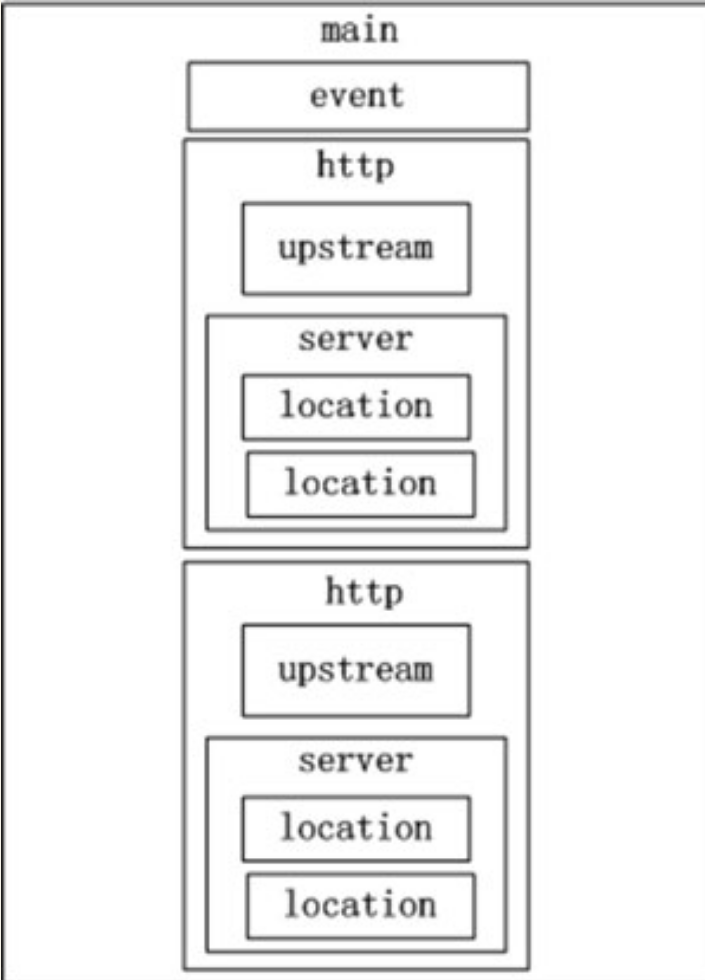
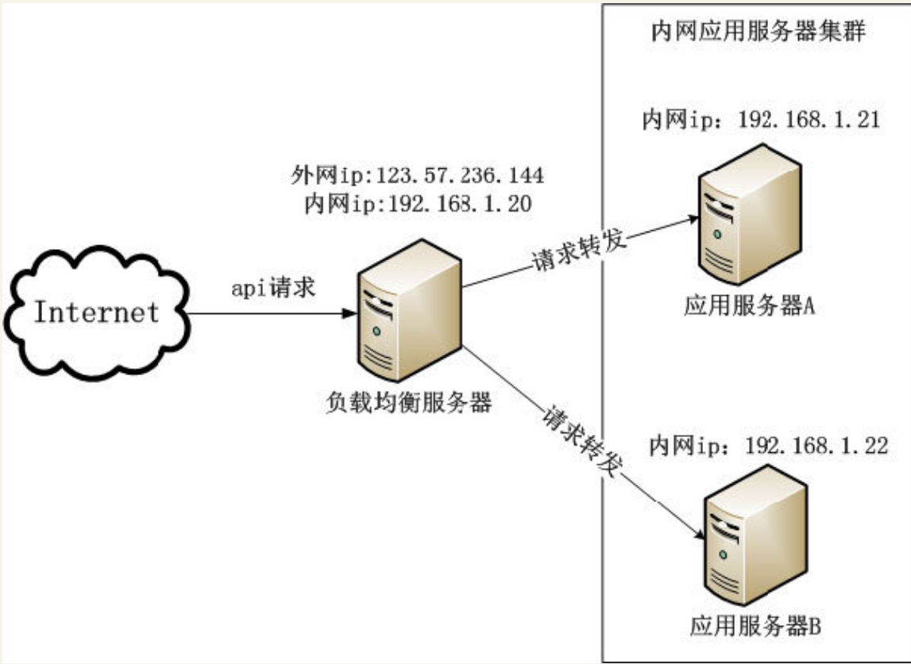

# Nginx—App后台HTTP服务的利器
Nginx是一个高性能的HTTP和反向代理服务器，在BAT等巨头和众多的移动互联网公司中有广泛的应用。其主要特点是占用内存少，并发能力强。


## 简介
Nginx与Apache类似，其是一个高性能的HTTP和反向代理服务器，也是一个imap/pop3/smtp代理服务器。

Nginx是由Igor Sysoev为俄罗斯访问量第二的Rambler.ru站点开发的，其已经在该站点运行超过三年。Igor将Nginx源代码以类似BSD许可证的形式发布。


## 基本原理
下面讲述Nginx两方面的基本原理。

·工作模型

·进程解析


## 工作模型

Nginx的高性能主要是其使用了`epoll`和`kqueue`网络I/O模型

Apache则使用的是传统的`select`模型

目前在Linux下能够承受高并发访问的著名开源软件Squid、Memcached采用的都是是`epoll`网络I/O模型。


Apache采用的`select模型`和Nginx采用的`epoll模型`之间的区别。

select模型
``` 
使用select模型的服务员是这样接待客人的：当客人一入门，服务员就立刻引导客人入座，
然后把菜单递给客人，等待客人点菜。客人点菜完毕后，服务员到厨房下单。
当厨房把菜做好后，服务员送菜到客人的桌上，平时服务员就在桌子旁边招待客人。
如果客人这时看电影，服务员也要守候在客人桌子旁边。
最后等客人吃完饭结账后,送客人出门，服务员继续招待下一个客人。
```

epoll模型

``` 
使用epoll模型的服务员是这样接待客人的：当客人进门，门口有感应器通知服务员，
服务人就引导客人入座然后招待其他客人。客人看完菜单准备点菜，客人呼唤服务员，
服务员来到客人的桌上记下客人所点的菜，然后到厨房下单后继续招待其他客人。
当服务员收到厨房通知菜做好了，服务员把菜送到客人桌后继续干其他工作。
客人吃完饭了，客人呼唤服务员结账，服务员送客人出门后继续招待其他客人。
```

从上面的过程可看到，当处理大量的请求（相当于接待很多客人），

`epoll模型远远高效于select模型。`


## 进程解析
正常工作的Nginx有多个进程，基本的有master process（称为主进程）和worker process （称为工作进程）。


maste process(主进程)：

```
充当整个进程组与用户交互的接口，维护并监控worker process。
不处理具体的业务，只把相应的信息发到worker process。
其同时负责Nginx的平滑重启、配置文件生效、关闭等。
```
worker process(工作进程)：
```
处理具体的任务。
```

Nginx中master和worker的工作流程


## 常用配置
Nginx的配置文件nginx.conf是纯文本书件，位于Nginx安装目录的conf目录下，
整个配置文件是以块的形式组织。
每个块以“{}”来表示，采用嵌套的方式，一个大块中可以包括小块。

最大的块是main块，main块里包含event块和http块，http块包含了upstream块和server块，server块包含了多个location块，整个配置文件的结构如图


**每个模块的含义如下。**

```
·main：Nginx的全局属性配置。

·event：Nginx的工作模式及连接数上限。

·http：http服务器相关属性的配置。

·upstream：负载均衡属性的配置。

·server：虚拟主机的配置。

·location：location的配置。
```

根据上面介绍的Nginx配置文件的6大块，详细介绍Nginx每个指令的含义。

### 1.Nginx的全局配置

Nginx全局配置的代码如下。
``` 
user  www www;
worker_processes 4;
error_log  /home/wwwlogs/nginx_error.log  crit;
pid        /usr/local/nginx/logs/nginx.pid;
worker_rlimit_nofile 52000;
``` 
这段代码中每个配置的含义如下。
```
user：指定了Nginx工作进程运行的用户及用户组，默认是nobody，这个配置文件是使用了用户www和用户组www。
worker_processes：指定Nginx开启的工作进程数。每个进程大约占用10～12MB的内存。如果是多核的CPU，这里应设置和CPU核数一样的进程数。
error_log：全局错误日志的位置与日志输出的级别。日志的输出级别可选择debug、info、notice、warn、error、crit，其中debug级别输出的日志最详细。当运维人员查找问题时，错误日志是非常重要的参考。
pid：存储Nginx进程id的文件路径。
worker_rlimit_nofile：指定了一个Nginx进程最多可以打开的文件描述符。注意，这里的配置受限于Linux中最多可以打开的文件描述符配置。
```

### 2.event配置
event配置的代码如下。
``` 
events
{
use epoll;
worker_connections 51200;
}
```

这段代码中每个配置的含义如下。
``` 
·use：指定Nginx的工作模式。Nginx可选的工作模式有：select、poll、kqueue、epoll、rtsig和/dev/poll。前面已经介绍过select和epoll两种工作模式处理方式的不同。在Linux下epoll工作模式是首选，在FreeBSD下kqueue工作模式是首选。
·worker_connections：定义每个worker process的最大连接数，默认是1024。注意，这里的配置受限于Linux中最多可以打开的文件描述符数限制。当前Nginx可以处理的最大连接数为max_clients = worker_processes×worker_connections。
```

### 3.http配置
http配置的代码如下：
``` 
http{
    include mime.types;
    default_type Application/octet-stream;
    client_header_buffer_size 32k;
    large_client_header_buffers 4 32k;
    client_max_body_size 50m;
    sendfile on;
    tcp_nopush on;
    
    keepalive_timeout 60;
    tcp_nodelay on;
    gzip on;
    gzip_min_length 1k;
    gzip_buffers 4 16k;
    gzip_http_version 1.0;
    gzip_comp_level 2;
    gzip_types text/plain Application/x-javascript text/css Application/xml;
    gzip_vary on;
    include vhost/*.conf;
    }

```

这段代码中每个配置的含义如下。
``` 
·include：包含其他的配置文件，这种机制有利于配置文件的模块化，方便用户管理大量的配置文件。

·default_type：当文件类型未定义时，默认使用二进制流的格式。

·client_header_buffer_size：客户端请求头buffersize的大小。

·large_client_header_buffers：客户端请求中较大的消息头的缓存的数量和大小，这里“4”是数量，“32k”是大小。

·client_max_body_size：客户端请求中http body的大小，一般可以理解为请求的文件大小。

·sendfile：设置为on表示启动高效传输文件的模式。
    sendfile可以让Nginx在传输文件时直接在磁盘和tcp Socket之间传输数据。如果这个参数不开启，会先在用户空间申请一个buffer，用read函数把数据从磁盘读到cache，再从cache读取到用户空间的buffer，再用write函数把数据从户空间的buffer写入到内核的buffer，最后到TCP Socket。开启这个参数后，可以让数据不用经过用户buffer。

·tcp_nopush：该选项仅在sendfile开启的时候才起作用，主要防止网络堵塞。

·keepalive_timeout：设置客户端保持活动连接的时间。超过这个时间，服务器会关闭连接。

下面是Nginx的httpgzip模块的配置，这个模块支持在线实时压缩输出数据流，需要在编译Nginx时带上参数“--with-http_gzipimg_module”才能使用这个模块。
·gzip：设置为on，启动gzip模块。
·gzip_min_length：设置只有当页面的大小大于这个值时，才启用gzip压缩。页面大小值通过读取http头“Content-Length”来获取。建议是1KB，文件太小，压缩后有可能会更大。
·gzip_buffers：gzip的缓冲区的数量和大小。默认是申请和“Content-Length”中一样大小的缓冲区。
·gzip_http_version：支持的HTTP协议版本。

·gzip_comp_level：用gzip压缩比。取值是从1～9，1是压缩比最低，但速度快，9是压缩比最高，但速度慢，而且特别消耗CPU资源。
·gzip_types：所压缩文件的类型。一般来说是压缩传输中的文本资源文件，例如CSS、JS、HTML等。
·gzip_vary：是否让前端的缓存服务器缓存压缩后的GZIP文件。
·include vhost/*.conf：包含vhost文件夹中后缀名为“conf”的配置文件。通常在vhost文件夹下存放的是内容为server块的conf文件，根据经验，最好是一个域名对应一个conf文件，以方便管理。
```

设置sendfile为off时传输文件的流程：


设置sendfile为on时传输文件的流程:


### 4.负载均衡配置
负载均衡配置的代码如下。
``` 
    upstream test.com{
    server 192.168.1.20:80 weight=2;;
    server 192.168.1.21:80 weight=1;
    }

```

upstream模块通过简单的调度算法实现客户端到服务器的负载均衡。在上面的例子中，test.com是这个负载均衡的名字，可以在后面的配置中调用。

#### Nginx支持以下4种负载均衡算法。
``` 
1.加权轮询（默认的算法）：请求按时间分别分配到不同的服务器上。

2.ip_hash：使用请求的ip算出hash值，根据hash值分配到不同的服务器上，固定的ip的请求，会分配到固定的服务器。这种策略有效地解决了网站服务的session共享问题。

3.fair：按后端服务器的响应时间来分配请求，响应时间短的优先分配。Nginx默认是不支持这种负载均衡算法，需要安装Nginx模块和upstream_fair模块。

4.url_hash：使用请求的URL算出hash值，根据hash值分配到不同的服务器上，固定的URL的请求，会分配到固定的服务器上。这种策略有利于提高后端服务器的缓存命中率。Nginx默认是不支持这种负载均衡算法，需要安装Nginx的hash软件包。
```

upstream模块可以为所配置的服务器指定状态值，常用的状态值如下。
``` 
down：服务器不参与到负载均衡中，当后台人员进行故障排查时这个状态非常有用。
weight：制定轮询的权重，权重越大，分配到的几率越多。在上面的例子中，根据权重的不一样，分配到20和21的请求的比例大概是2:1。
backup：备份机器。当其他的服务器不可用时，才把请求分配到这台服务器。
max_fails：允许请求失败的次数，默认值是1。
fail_timeout：经历了max_fails次失败后，暂停服务的时间。
```
`注意： 当负载均衡是ip_hash时，服务器的状态值不能是backup和weight。`

### 5.server虚拟主机配置
server虚拟主机配置的代码如下。
``` 
server
  {
    listen      80;
    server_name local.test.cn;
    index index.html index.htm index.php default.html default.htm default.php;
    root      /var/www/test;
   }
```

这段代码中每个配置的含义如下。
``` 
·listen：指定虚拟主机监听的端口。
·server_name：指定虚拟主机对应的域名，多个域名之间以空格分割。
·index：默认的首页文件。
·root：网站的根目录。
```
### 6.location配置
location配置的代码如下。
``` 
location ～ .*\.(gif|jpg|jpeg|png)$
  {
    expires      30d;
  }
```

location支持正则表达式和条件判断匹配，用户可以通过location指令对动、静态网页进行过滤处理。

上面这段代码的含义是经过正则表达式匹配，
设置文件格式为GIF、JPEG、PNG的文件在HTTP应答中“Expires”和“Cache-Control”的HTTP头，
以达到在浏览器中缓存图片的作用。这里表示把图片在浏览器中缓存30天。

### 7.HTTPS的配置
App经常需要通过HTTPS协议来访问某些对安全性很高要求的API（例如登录、注册）。HTTPS核心的是安全证书，生成安全证书有两种途径。
``` 
·缴纳一定的费用，到证书服务商申请。
·用户给自己颁发证书，即手动生成。
```
如果证书只是用在开发阶段，那么给自己颁发证书就行了，没必要到证书服务商那申请，不划算。下面介绍怎么手动生成证书，并在Nginx中配置使用这个生成的证书。


在CentOS环境下，生成证书前先要确保安装openSSL和openSSL-devel，如果没安装，使用下面的命令安装。
``` 
    yum install openssl
    yum install openssl-devel
```

生成证书的代码如下。
``` 
    cd  /usr/local/nginx/conf
    opensslgenrsa -des3 -out local.key 1024
    opensslreq -new -key local.key -out local.csr
    opensslrsa -in local.key -out local_nopwd.key
    openssl x509 -req -days 365 -in local.csr -signkey local_nopwd.key -out local.crt
```


在Nginx的虚拟主机中加上下面的配置，并把端口设置为443，就能使用`https://api.test.cnm`的形式访问需要通过HTTPS加密的API，配置如下。
``` 
    server {
        listen 443;
        ssl on;
        ssl_certificate  /usr/local/nginx/conf/local.crt;
        ssl_certificate_key  /usr/local/nginx/conf/local_nopwd.key;
        server_name api.test.cn;
        index index.html index.htm index.php default.html default.htm default.php;
        root  /var/www/test;
    }
```

### 8.下载App的配置
APK和IPA分别是Android应用和iOS应用的扩展名。
如果浏览器下载Nginx服务器中后缀名为.apk和.ipa的文件时，浏览器会自动重命名为ZIP文件。

如果需要下载时文件名后缀就是.apk或.ipa，可以修改Nginx conf目录下的mime.types文件,在文件中增加下面的两行。
``` 
    application/vnd.android.package-archive apk;
    application/iphone pxl ipa;
```
重启Nginx后配置生效。

### 9.生产环境中修改配置的良好习惯

#### 检查Nginx的配置文件语法
``` 
/usr/local/nginx/sbin/nginx -t
```
如果重启Nginx前没保证配置文件语法正确，当Nginx重启过程中检测到配置文件有问题，Nginx就会停止服务，这样就影响网站的正常运行。


#### 平滑重启Nginx
``` 
/usr/local/nginx/sbin/nginx -s reload
```

### 10.性能统计
编译Nginx源码的时候带上参数`“--with-http_stub_status_module”`，就安装了Nginx的统计模块，这个模块能够获取Nginx自上次启动以来的工作状态。

在虚拟主机的配置文件中添加以下的代码，启动统计功能。
``` 
   location /nginx_status {
    stub_status on;
    access_log   off;
    }
```

重启Nginx使配置文件生效，就能在浏览器中输入“http://域名/nginx_status”了解Nginx的状态，会出现类似下方的信息。
``` 
    Active connections: 1
    server accepts handled requests
    653 653 685
    Reading: 1 Writing: 1 Waiting: 0
```

上面每项的含义如下。
```
·Active connections：当前Nginx正处理的活动连接数。
·server accepts handled requests：共处理了653次连接，共处理了653次握手，共处理了685次请求。
·Reading：Nginx读取到客户端的Header信息数。
·Writing：Nginx返回给客户端的Header信息数。
·Waiting：开启keep-alive的情况下，这个值等于Active– (Reading + Writing)，是Nginx已经处理完成，正在等候下一次请求指令的驻留连接。
```
所以当App的请求被快速处理完毕的情况下，Waiting数比较多是正常的。
如果reading+writing数目较多，则说明App后台并发访问量大，Nginx正在处理过程中。


## 实现负载均衡的方案
应用服务器上处理业务逻辑，由于应用服务器地位上的重要性，为了保证应用服务器高可用，可使用Nginx负载均衡和健康检查特性，一个初级的方案如图


应用服务器上处理业务逻辑，由于应用服务器地位上的重要性，为了保证应用服务器高可用，
可使用Nginx负载均衡和健康检查特性，一个初步的方案如下：

Nginx负载均衡方案

在上面的方案中，负载均衡服务器部署了Nginx，其绑定了两个ip，外网的ip和内网ip。用DNS服务把域名绑定到外网ip，通过内网ip和应用服务集群内的服务器通信。


在上面的方案中，负载均衡服务器部署了Nginx，其绑定了两个ip，外网的ip和内网ip。用DNS服务把域名绑定到外网ip，通过内网ip和应用服务集群内的服务器通信。

应用集群内的机器不能直接访问网络，所有数据的进出都要经过负载均衡服务器。


这个方案有以下两个好处
``` 
·保证了应用服务的高可用，即使有台应用服务器宕机，其他服务器也会继续工作。

·应用服务器不直接连接Internet，减少了被入侵的可能性。
```

这个方案还有个问题：负载均衡服务器只有一台，如果负载均衡服务器宕机，整个服务就不可用。

### 针对创业团队采用方案（Nginx+Keepalived）

现在业界普遍解决Nginx高可用的方法是`Nginx+Keepalived`，部署两台Nginx服务器，
通过Keepalived把外网ip绑定到一台Nginx服务器上，如果这台Nginx服务器宕机，
Keepalived就把这个ip漂移到另外一台Nginx服务器上，使服务不受影响。


### 大公司使用云上负载均衡器（SLB）
使用云服务器上负载均衡SLB的服务有以下两个好处。
```
·云服务器上有专业的运维团队保证负载均衡SLB的高可用。

·负载均衡SLB的服务，比自己购买服务器搭建负载均衡服务便宜多了（甚至有免费的服务，现在UCloud的负载均衡就是免费的）。
```
花钱购买可靠成熟的服务，不但节省资源，还能提高开发的效率，把自身的精力专注于最核心的业务上。


创业团队的软件架构原则：

`尽量使用成熟可靠的云服务和开源软件，自身只专注于业务逻辑`


## 用Nginx处理业务逻辑

在一般的App后台架构中，Nginx是不处理任何业务逻辑的。例如经典的LNMP架构中，客户端请求到达Nginx后，Nginx通过查找location命令，将所有以“.php”为后缀的文件都交给PHP处理。

为了弥补Nginx不能处理业务的缺陷，Nginx开源社区的开发者给Nginx添加了Lua模块，
`Nginx使用Lua模块后就具备了处理业务的能力`。


在业界广泛使用的OpenResty项目把Lua语言嵌入Nginx中，同时其集成了大量实用的模块以方便开发人员使用。
使用OpenResty的开发人员可以用Lua对Nginx进行脚本编程，
从而可以在Nginx请求处理阶段执行各种Lua代码来处理业务逻辑。
OpenResty的开发者章亦春（网名agentzh），其同时也在维护很多Nginx模块，如果读者需要学习开发Nginx模块，他博客上的教程不得不看，地址为：https://github.com/openresty/Nginx-tutorials/tree/master/zh-cn。

下面是Nginx添加了Lua模块后一个例子。
``` 
 location /lua {
        set $test "hello, world.";
        content_by_lua '
            ngx.header.content_type = "text/plain";
            ngx.say(ngx.var.test);
        ';
    }
```
后，Nginx通过查找location命令，将所有以“.php”为后缀的文件都交给PHP处理。

为了弥补Nginx不能处理业务的缺陷，Nginx开源社区的开发者给Nginx添加了Lua模块，Nginx使用Lua模块后就具备了处理业务的能力。

Lua是一种脚本语言，由巴西里约热内卢天主教大学里的一个研究小组于1993年开发。其设计目的是为了嵌入到应用程序中，从而为应用程序提供更灵活的扩容功能。Lua由标准C编写而成，几乎在所有操作系统和平台上都可以编译、运行。某些应用和游戏使用了Lua作为嵌入式脚本语言以增强自身的扩展性，例如《魔兽世界》、《愤怒的小鸟》。同时Lua也是一门轻量级的脚本语言，其官方版本只包括一个精简的核心和最基本的库。

在业界广泛使用的OpenResty项目把Lua语言嵌入Nginx中，同时其集成了大量实用的模块以方便开发人员使用。使用OpenResty的开发人员可以用Lua对Nginx进行脚本编程，从而可以在Nginx请求处理阶段执行各种Lua代码来处理业务逻辑。OpenResty的开发者章亦春（网名agentzh），其同时也在维护很多Nginx模块，如果读者需要学习开发Nginx模块，他博客上的教程不得不看，地址为：https://github.com/openresty/Nginx-tutorials/tree/master/zh-cn。

下面是Nginx添加了Lua模块后一个例子。


    location /lua {
        set $test "hello, world.";
        content_by_lua '
            ngx.header.content_type = "text/plain";
            ngx.say(ngx.var.test);
        ';
    }
把上面的代码加入到localhost的配置文件中，在浏览器输入网址http://localhost/lua，就能看到浏览器中输出字符串“hello, world.”。

Nginx+Lua模块一般是处理一些逻辑比较简单的业务，复杂的业务处理还是在应用服务器上。

Nginx+Lua除了能处理简单的业务外，还能有以下的用途。

```
·统计所有慢请求。
·过滤不合法的请求。
```

