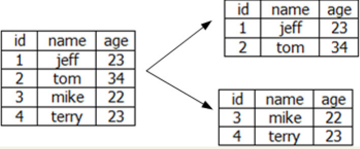
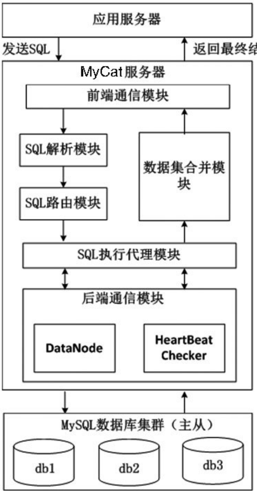

# MySQL—App后台最常用的数据库
数据存储是App后台中必不可少的功能，MySQL作为一个久经考验的数据库软件，数据存储功能卓越。因此熟练运用MySQL是每个App后台开发人员必须掌握的技能。

## 基本架构
MySQL在架构上分为三层。

```
·服务层：大多数基于网络的客户端/服务端工具都有这一层，这一层主要是处理连接和安全验证。
·核心层：这层处理MySQL的核心业务。
    * 查询分析，优化，缓存和内置的函数。
    * 内建的视图，存储过程，触发器。

·存储引擎层：存储引擎负责数据的存储和提取。核心层通过存储引擎的API与存储引擎通信，这样子就遮蔽了不同存储引擎的差异，使得这些差异对上层查询是透明的。存储引擎之间不会相互通信，只是简单地响应上层的查询。
```

MySQL的整体架构


## 选择版本
MySQL被Oracle收购后，MySQL创始人Monty W idenius主导开发了MariaDB，采用GPL授权许可，完全兼容MySQL，使用XtraDB存储引擎来代替MySQL的InnoDB存储引擎。


由于上面所述的历史原因，造成了现在有4个MySQL的版本。
``` 
MySQL社区版：用户群体最大。
MySQL企业版：收费。
Percona Server版：新特性多。
MariaDB版：国内用户不多。
```
建议开发者选择MySQL社区版，足够应付业务上的需求。


## 配置文件详解
在Linux中MySQL的配置文件是`/etc/my.cnf`，主要的配置项如下。
``` 
    max_connections = 1000
    max_connect_errors = 50
    key_buffer_size = 3M
    max_allowed_packet = 16M
    thread_cache_size = 300
    thread_concurrency = 8
    sort_buffer_size = 1M
    join_buffer_size = 8M
    query_cache_size = 512M
    query_cache_limit = 2M
    read_buffer_size = 2M
    read_rnd_buffer_size = 16M
    myisam_sort_buffer_size = 8M
    innodb_buffer_pool_size = 4G
    innodb_log_file_size = 128M
    innodb_log_buffer_size = 8M
    innodb_flush_log_at_trx_commit = 1
    innodb_lock_wait_timeout = 50
```


## 软件优化
### 正确使用MyISAM和InnoDB存储引擎
MyISAM和InnoDB是MySQL最常用的两个存储引擎。

```
在MySQL 5.1版本中，默认的存储引擎是MyISAM。

到了MySQL 5.5、5.6版本，默认的存储引擎是InnoDB。
```

#### MyISM
```
MyISAM基于ISAM（索引顺序访问方法) ，支持全文索引，但并非是事务安全，不支持外键，使用表级锁。
每个MyISAM表存有3个文件：FRM文件存放表结构，MYD文件存放数据，MYI存放索引。
```


#### InnoDB
``` 
InnoDB是事务型存储引擎，其支持行锁，InnoDB表的行锁也不是绝对的，如果它在执行一个更新的语句时没法确定更新的范围，也会锁表，例如执行语句update table set age=3 where name like "%jeff%"，在这个更新语句就会锁表。
InnoDB支持回滚、崩溃恢复、ACID事务控制，InnoDB存储它的表和索引在一张表空间，表空间可以包含多个文件。
```

MyISAM和InnoDB的主要区别如下。
``` 
·MyISAM支持表锁，InnoDB支持行锁。
·MyISAM是非事务安全型，InnoDB是事务安全型。
·MyISAM不支持外键，InnoDB支持外键。
```

### 正确使用索引
什么是索引？

书的目录就是索引的一种，其能帮助读者快速地查找到目标内容。

同样的，数据库中的索引，也能快速地查找到相应的数据。

下面是使用索引的一些原则。
```
给合适的列建立索引。在where子句中经常需要给检索的列建立索引，或者给连接子句中指定的列建立索引，而不是给select选择列表中的列建立索引。

索引列的值尽可能不同。对于有唯一性的值，索引的效果最好；如果有大量的重复值，索引的效率很差。

使用短索引。对字符类型的列建立索引，只要有可能，都应该指定前缀长度。例如，有一个char（50）的列，如果前20或30个字符内，多数值是唯一的，那么就不要对整个列进行索引。较小的索引，索引缓存中能容纳更多，消耗的磁盘IO更小，能提高查找的速度。

利用最左前缀。创建一个n列索引，本质上是MySQL创建了n个索引。多个索引可以起n个索引的作用，可以用索引中最左列的值来匹配，这样的列值叫做最左前缀。

使用like查询时索引会失效。因此尽量少使用like查询，对于百万、千万级的数据，如果真的要使用like查询，请用专业的搜索软件来实现，例如第3章中介绍的Sphinx，就能很方便地结合MySQL，快速实现这种海量级数据的查询。

不能滥用索引。索引并不是越多越好，使用索引需要恰到好处。过度使用索引会有下面的问题。


索引会占用额外的磁盘空间，降低性能。
当更新数据时索引必须更新。因此索引越多，需要花费在更新的时间上更长。如果在某个长期不用的字段上建立索引，会明显降低更新的速度。
在本章的MySQL架构图中可看到，SQL在执行一个查询语句前会对这个查询语句进行优化，确定使用哪些索引。滥用索引有可能使MySQL选择到不是最优的索引，同时增加了查询优化的时间。 
```

### 避免使用seIect*
使用“select* ”有下面的坏处：
```
在select语句执行的过程中，“select* ”从数据库中返回的结果更多，降低了查询的速度。
过多的返回结果会增大服务器返回给App端的数据的传输量。在移动互联网传输速度慢（2G、3G的情况）、弱网络环境（在不同的建筑中切换，在高速移动中经常断网）下，过大的传输量很容易造成请求的失效。
```

### 字段尽可能地设置为NOT NULL
对于字符串类型来说，“”值和NULL值在App的显示上有什么区别呢？如果产品上规定必须严格区分一个字符的未填和为空两种状态，那么NULL是必需的。如果产品上没有这个规定，那么建议数据库上所有字段都设置为NOT NULL，必须有默认值。

App客户端的开发语言Java和Objective-C都是强类型语言，null值和空值是不一样的类型，不处理null值很容易造成App的闪退。


## 硬件优化
### 增加物理内存
```
MySQL读写数据最大的性能瓶颈就是磁盘IO，从减少磁盘IO方面提高性能是个重要的方向。
通过加大物理内存可以采取提升文件系统性能，减少磁盘IO。
```

Linux内核在内存中开辟了缓存（系统缓存和应用缓存）来存放数据。

* 当写文件的时候，通过文件延迟写入机制，先把文件保存在缓存，当达到一定的条件（缓存达到多少的百分比或者接到了sync），才真正写入硬盘。

* 当读文件的时候，会把读出的文件放入缓存，当下次需要读取同样的文件时，就先从缓存中取，如果缓存没有，再从硬盘中读取。

另外MySQL中也用了大量的内存来提高性能，例如配置文件中的如下参数。
```
·thread_cache_size：服务端线程缓存。
·sort_buffer_size：每个连接需要使用buffer时，分配的内存大小。
·query_cache_size：查询缓存的大小。
·query_cache_limit：单次查询缓冲区的大小。
```
通过增大内存来增大上面参数的值，也对提高性能有帮助。

### 增加应用缓存
把应用的热数据存储在缓存中，如果缓存中有数据就不需要到数据库读取数据，从而达到提高性能的目的。
``` 
本地缓存：把数据放在服务器的内存或文件中。

分布式缓存：通过使用分布式缓存工具Redis或Memcache，可以缓存海量数据（Redis的分布式需要借助第三方工具或者把Redis升级到3.0版本以上）。
这两个软件的读写性能非常高，QPS（Query Per Second）能达到1万以上。
如果项目中要考虑数据持久化，缓存可以选用Redis；如果项目中不需要考虑数据持久化，选用Redis或Memcache都没问题。
```

### 用固态硬盘代替机械硬盘
SSD硬盘最主要改变了数据存储和读取的方式，SSD硬盘中数据存储在闪存芯片中，其是一种非易失性内存芯片，通过充电、放电的方式写入和擦除数据，速度相当快。读写操作中通过电路传输信号，因此也不会有传统硬盘的移动磁头和转动磁盘等操作，大大减少了处理时间。

机械硬盘(HDD)的读取速度大概在100MB/s左右

而一般的SSD读取速度可达400MB/s甚至600MB/s以上，有些专业的SSD读取速度可达4000MB/s 。

### SSD硬盘+SATA硬盘混合存储方案
FlashCache是Facebook技术团队开源的SSD硬盘+SATA硬盘混合存储方案，最初是为加速MySQL设计的。
FlashCache在文件系统和设备驱动之间增加一层缓存来实现对热数据的缓存。
FlashCache通过将传统硬盘上的热数据缓存在SSD硬盘，然后利用SSD硬盘优秀的读性能加速系统。

`这个方法和使用内存做缓存比较，虽然没有内存的读取速度快，但可用空间比内存大多了。`


## 架构优化

### 分表
当项目上线后，随着用户的增长，有些数据表的规模会以几何级增长，当数据达到一定规模后查询读取性能就下降很多，这时开发人员就要考虑分表。更新表数据时会更新索引，当单表数据量很大时这个过程比较耗时，这就是为什么对大表进行写操作会比较慢的原因，并且更新表数据会引起表锁或者行锁，这也会导致其他操作等待。

如果将大表拆分为多个子表，那么在更新或者查询数据的时候，压力会分散到不同的表上。
由于分表之后每张表的数据较小，不管是查询还是更新的提高都得到极大的提升，即使出现最坏的“锁表”的情况，其他表还是可以继续使用。


分表有多种策略。
```
·水平拆分：把一张表的数据分别保存在不同的表。
·垂直拆分：把一张表的字段分别保存在不同的表。
```
水平拆分示意图



垂直拆分示意图


分表策略确定后还有一个必须考虑的问题：用户的数据都分散在不同的表中，之前的业务功能如何保证？
比如说笔者要插入一条记录、更新一条记录、删除一条记录、查询统计数据，现在要怎么处理呢?

```
如果分表的存储引擎是MyISAM，这里有一种很简单的处理方法。利用MERGE存储引擎将拆分的表合并成一张表。如果使用InnoDB，也能通过alter table命令把InnoDB变为MyISAM。

MERGE存储引擎可以将N个子表联合在一起，看成是一个整表，实际上还是N个真实的子表。
```

### 读写分离

读写分离是把对数据库的读和写操作分开对应于主/从数据库服务器，主数据库提供写操作，从数据库提供读操作（可以有多个从数据库）。

因为大多数业务是以读为主，因此多个从数据库能有效减轻数据库的压力。

读写分离的架构如图


当主数据库进行写操作时，数据要同步到从数据库，这样才能有效保证数据库完整性。这称为数据库的主从复制。

MySQL主从复制基于主服务器在二进制日志（binlog）中跟踪所有对数据库的更改实现。因此要进行复制，必须在主服务器上启用二进制日志。

MySQL主从复制是异步复制，在主数据与从数据库之间实现整个主从复制的过程有`三个线程`参与，
其中`两个线程（SQL线程和IO线程）`在从数据库，另外一个线程`（IO线程）`在主数据。

主从复制流程图


MySQL主从复制过程如下。
``` 
（1）从数据库上执行start slave，开启主从复制开关。
（2）此时，从数据库的IO线程会通过主数据库上授权的用户请求连接主数据库，并请求指定的binlog日志文件的指定位置（日志文件和配置都是配置主从服务器时执行change master命令指定的）之后的binlog日志内容。
（3）主数据库接收到来自从数据库的IO线程请求后，主数据库上负责复制的IO线程，根据从数据库的IO线程请求的信息，读取指定的binlog日志文件指定位置之后的binlog日志信息，然后返回给从数据库的IO线程。返回的信息除了日志内容外，还有本次返回的日志内容后在主数据库上新的binlog文件名称及在binlog中的位置。
（4）当从数据库上的IO线程获取来自主数据库上的IO线程发送日志内容及位置后，将binlog日志内容依次写入到从数据库自身的relaylog（中继日志）文件（MySQL-relay-bin.XXXX）的最末端，并将新的binlog文件名和位置记录到Master-info文件中，以便下一次读取主数据库的新binlog日志时，能够告诉master服务器需要从新binlog日志的哪个文件哪个位置，开始请求新的binlog日志内容。
（5）从数据库的SQL线程会实时地检测本地relay log中新增加的日志内容，然后及时把log文件中的内容解析成在主数据库曾经执行的SQL语句，并在自身从数据库上按顺序执行这些SQL语句。
（6）经过了上面的过程，就可以确保在主数据库和从数据库执行同样的SQL语句。当复制状态正常的情况下，主数据库和从数据库的数据是一样的。
```

延迟的解决方案如下。
``` 
·首先定位延迟的瓶颈，如果是因为IO压力大，那么可以考虑采用升级硬件的方案，如把硬盘更换为SSD硬盘。
·如果是因为单线程从relaylog中执行MySQL语句导致延迟，可以采用MySQL 5.6以上版本的多线程方案，或者采用Tungsten为代表的第三方并行复制工具。
·如果以上的两个方案都不起作用，就要考虑采用下面介绍的分库策略。
```

### 分库

当数据规模不断增大，前面所描述的分表和读写分离可能都满足不了系统的性能需求，这时需要考虑分库，即把不同的数据表部署在不同的数据库集群上。

在大型的App后台中，分表都有可能满足不了需求，某些数据表仍然很大，需要进行分库操作，即把一张表的数据分别存储在不同的数据库。

目前比较成熟的支持数据库分库的关系型数据库分布式处理软件有Cobar。Cobar自诞生之日起，就受到广大程序员的追捧，但是自2013年后几乎没有后续更新。在此情况下，MyCat这个关系型数据库分布式处理软件应运而生，其以阿里开源的Cobar产品为基础研发，MyCat的稳定性、可靠性、优秀的架构和性能，以及众多成熟的使用案例使得MyCat一开始就拥有一个很好的起点，站在巨人的肩膀上，能看到更远。

MyCat以代理服务器的形式位于应用服务器与后台数据库之间，由于其是无状态，因此很容易部署MyCat集群实现负载均衡。对外开放的接口是MySQL通信协议，将应用服务器传过来的SQL语句按照路由的规则拆解转发到不同的后台数据库，并把结果汇总并返回。

MyCat的部署模型如图


MyCat可以把一个逻辑上的数据库和数据表对应到物理上真实的数据库和数据表，用户只需要按照逻辑上的结构操作相关的数据就行，遮蔽了物理上的差异性。

MyCat映射关系图


MyCat对外提供的数据库是db，其中有两张表table1和table2。
``` 
·table1表的数据映射到物理数据库db1的table1。
·table2表的数据一部分映射到物理数据库db2的table2，另一部分映射到物理数据库db3的table2。
```
MyCat的工作流程

Datanode为MyCat的逻辑数据节点，映射到后端的某个物理数据库的database。为了保证高可用，每个Datanode可配置多个引用地址（DataSource），当主DataSource被检测到不可用，MyCat会切换到可用的DataSource，这里的DataSource可认为是MySQL主从服务器的地址。


参考资料：
（1）https://github.com/MyCATApache/MyCat-doc/blob/master/MyCat_In_Action_CN.doc              《MyCat_In_Action_CN》P1-4


## SQL慢查询分析
SQL慢查询是指执行超过一定时间的SQL查询语句，把这些SQL查询语句记录到慢查询日志，方便开发人员找出有性能问题的SQL，针对这些SQL查询语句进行分析调优。

配置选项中慢查询相关的3个参数如下。
``` 
·long_query_time：定义慢查询的时间，SQL查询语句执行时间大于该参数设置时间的SQL都会被记录下来，支持小于1秒的设置。
·slow_query_log：设置是否打开慢查询日志的开关。
·slow_query_log_file：设置慢查询日志文件的路径。
```

配置慢查询有两种方法。

### 方法一，通过命令行设置，立即生效，但是在MySQL服务重启后失效。
``` 
    set global long_query_time=1;
    set global slow_query_log=on;
    set global slow_query_log_file='/data/slow.log';
```

### 方法二，在/etc/my.conf中增加下面的配置选项，重启MySQL服务后生效。
``` 
    [MySQLd]
    long_query_time=1
    slow_query_log=ON
    slow_query_log_file=/data/slow.log
```

开发者也可使用MySQL自带的工具mysqldumpslow分析慢查询日志，例如，查看最慢的前3个SQL查询的命令格式如下。
``` 
  mysqldumpslow -t 3 /data/slow.log
```
开启慢查询日志后可在系统状态中可看到共有多少个慢查询，
``` 
show global status like '%slow%'
```
开发人员要分析慢查询语句，需要使用到MySQL的explain命令。explain显示了MySQL，如果使用索引处理select语句和连接表，可以帮助开发者选择更好的索引和更优化的SQL语句。

explain分析SQL的例子
``` 
explain select * from ek_region where id>2\G;
```
关于explain输出结果的含义，可以参考MySQL的官方文档：

`http://dev.mysql.com/doc/ refman/5.5/en/explain-output.html#explain_select_type。`

## 云数据库简介
MySQL数据库在大量的App后台广泛使用，由于其作为一个重要的基础组件，国内的云服务提供商纷纷推出了云数据库的产品。云数据库有大量的优点，笔者看重的是下面一些优点。

``` 
·配置高性能的SSD硬盘。机械硬盘的读取速度大概在100MB/s左右，而一般的SSD读取速度可达400MB/s甚至600MB/s以上，有些专业的SSD读取速度可达4000MB/s，数据库操作耗时中磁盘IO的耗时占了一个很大的比例，因此使用SSD硬盘能把性能提升一大截。
·备份机制。每台云数据库拥有两个物理节点进行主从热备，主节点发生故障，快速换至备节点。还有自动备份机制可以保存多天的备份数据以便于在灾难情况下进行数据恢复。这些措施都保证了MySQL的高可用。
·完善的监控体系。在云数据库管理界面中有十多种性能资源（CPU，内存，磁盘，连接数，增删改查的QPS，慢查询数目）监控视图，可对部分资源项设置阈值报警，并提供WEB操作、SQL审计等多种日志。如果开发人员收到App用户反馈某段时期的服务有问题，这些历史数据能给开发人员排查问题提供很大的方便。另一方面，如果靠开发人员搭建监控服务获取这些数据，并把其显示为图表不知道要花多少时间，用云数据库很轻松就能实现图表显示数据的需求。
·弹性扩展。开发人员可以根据数据库的实际负载情况升级硬件，从而获取更高的数据库性能。当App的访问量忽然爆发，系统性能已经不能满足用户的访问需求了，这时候解决爆发访问量最便捷的方法是升级硬件，而不是在代码层面优化性能。通过优化代码而提升性能不是短时间内可以完成的，而在云服务器上升级硬件，只需要几分钟甚至几十秒。
```
MySQL作为一个成熟、稳定、通用的软件，云服务商已经提供了完善的基于MySQL的云数据库服务，使用云数据库不但节省了大量的运维成本，还能把自身的精力集中于业务逻辑。


## 灵活的存储结构

MySQL是模式化结构，一张表中每行数据的字段是固定的，例如用户发的内容表初期可以用如表

内容表结构


随着业务的不断变化，这张表上可能添加更多的字段。

内容表结构的演进


当表的数据量到了一定的程度（例如上千万，上亿），任何表结构的修改会对线上的业务产生巨大的影响，解决这个问题的方案就是把索引表和内容表分离。

索引表只存放需要索引的字段，保证高效的查询性能，索引表就只负责索引，不承担其他职责。索引表结构如表


内容表使用的是kv结构，k是feed_id，v存储的是二进制数据，便于数据的变更，把关于这个表的其他内容存储在v。v为了便于扩展和节省存储空间，采用可扩展的序列化格式，

内容表结构


## 故障排除案例

### 性能低下的查询引起的故障

**故障现象：**
 
 App一旦使用搜索商家的功能，后台数据库load就居高不下，超过了正常水平。
 
**原因分析：** 分析搜索商家的整个过程，商家的数据表有上百万的数据，搜索商家使用的like模糊查询，like查询没有使用索引，每次查询都是遍历上百万的数据，性能的低下可想而知。

**经验教训：** 对于这种大数据量的搜索，不应该为了快速开发而使用MySQL的模糊查询，使用Sphinx或者Coreseek等开源检索引擎实现这样的搜索要求。 


