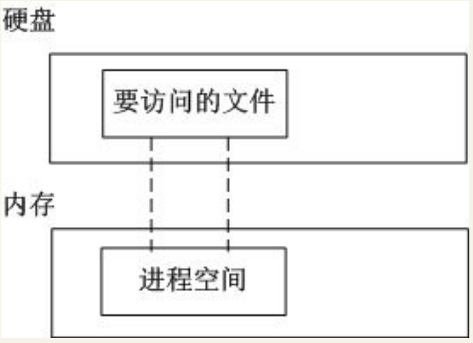
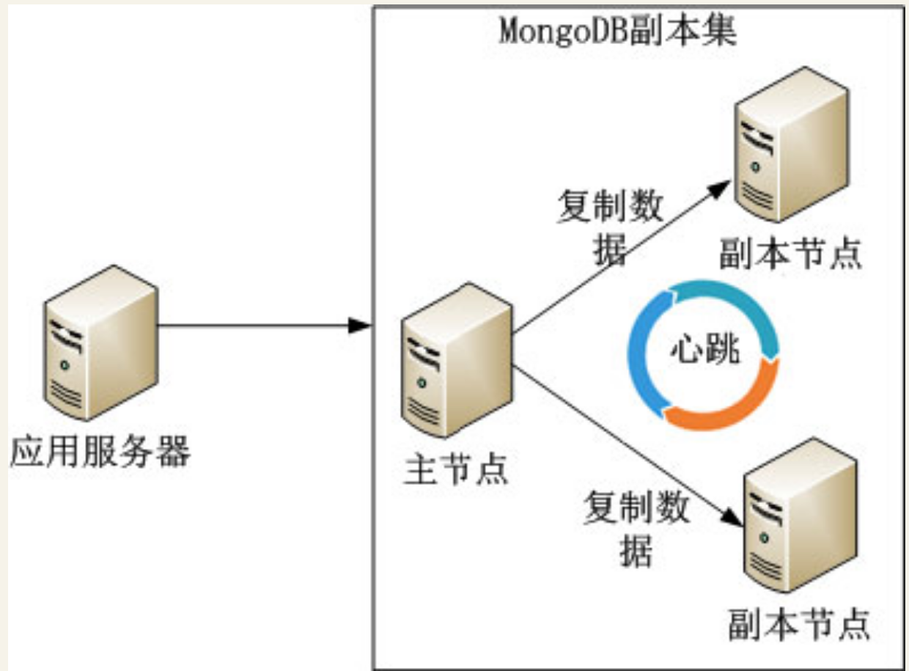
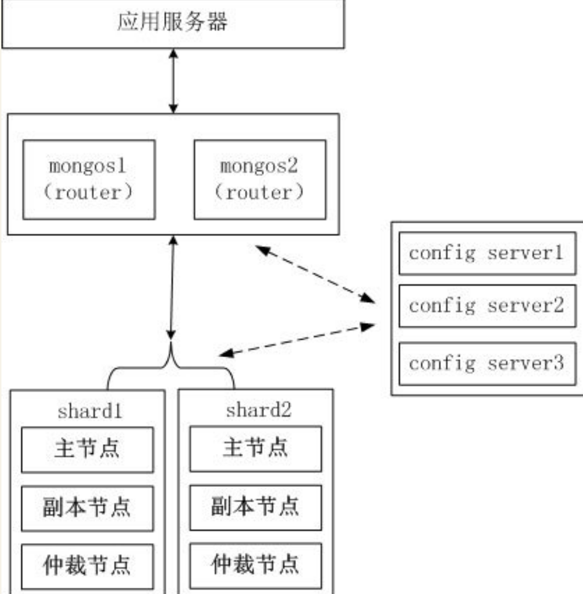

# MongoDB—App后台新兴的数据库
MongoDB是目前IT行业非常流行的一种非关系型数据库（NoSQL），其灵活的数据存储方式得到了IT从业人员的青睐。但其设计理念和使用方法是有别于传统的SQL数据库的，


## 1.简介
MongoDB是一个介于关系型数据库和非关系型数据库之间的产品，是非关系型数据库当中功能最丰富、最像关系型数据库的数据库。其是由10gen公司基于C++语言编写，旨在提供可扩展的高性能数据存储解决方案。知名的IT公司中使用MongoDB来构建自己的核心应用有Foursquare、eBay、Cisco、MetLife、Adobe等，国内也有众多的团队将MongoDB作为首选数据库。


MongoDB支持的数据结构非常松散，数据采用bson格式，可以存储比较复杂的数据类型。
bson是由10gen开发的一个数据格式，目前主要用于MongoDB中，是MongoDB的数据存储格式。


MongoDB的主要特点如下。
``` 
·读写性能高。
·灵活的文档模型给开发带来的方便。
·水平扩展机制能轻松应对从百万到十亿级别的数据量处理，这也是MongoDB名字来源于单词humongous（极大的）的原因。
```


## 2.核心机制解析
MongoDB高性能背后的两个机制：`MMAP（内存文件映射）`和`Journal日志`。

### MMAP（内存文件映射）
MongoDB使用了操作系统提供的MMAP（内存文件映射）机制进行数据文件的读写，MMAP把文件直接映射到进程的内存空间，这样文件就会在内存中有对应的地址，这时对文件的读写是能通过操作内存进行的，而不需要使用传统的如fread、fwrite文件操作方式。

传统的文件操作流程：某个进程要读取硬盘上的数据，需要先把硬盘上的数据复制到内核缓冲区，再复制到进程的内存空间。

传统的文件读取流程


通过MMAP，可以把文件直接映射到进程的内存空间中，如图：


MMAP只是把文件映射到进程空间，并不是全部映射到内存，只有访问到的数据才会被操作系统转移到内存。
但是因为内存是有限的，MongoDB虽然可以存储比内存更大的数据，但是对于热数据（也就是需要存放在内存中的数据）不建议超过内存的大小。
当热数据超过内存的大小，操作系统内存管理机制会把使用频率最低的数据换到交换分区（Swap），
这种来回的数据切换严重影响了MongoDB的性能。


当MongoDB需要插入新记录时，通过MMAP把数据库文件映射到内存后进行操作。

MongoDB默认是每分钟把内存中映射的数据刷到磁盘，也可以通过启动参数“--syncdelay”控制这个频率。

另外，即使MongoDB不把内存映射的数据刷到磁盘，操作系统也会定期把修改过的数据刷到磁盘，
Linux的dirty_writeback_centisecs参数用于定义脏数据在内存停留的时间（默认为500，即5秒），
过了这个时间脏数据就会被系统刷到磁盘上。


MongoDB使用了MMAP的机制把大量的文件操作都交给操作系统完成，大大减轻了MongoDB开发者的负担。


### Journal日志

MongoDB通过MMAP机制，数据会在内存中停留一段时间，如果在这段时间内系统宕机数据还没来得及刷到硬盘，那么这些修改的数据不就丢失了吗？
``` 
MongoDB内部通过Journal日志解决了这个问题。
MongoDB的所有数据更新操作会记录并保存到Journal日志，Journal日志保存在dbpath路径中的Journal文件夹中。
当系统宕机后MongoDB重启时，通过Journal日志上的操作记录，就能把数据恢复。
```

## 3.入门

MongoDB把关系模型转变为文档模型，基本思路是把原来的行变为更灵活的文档模型，文档的键不是固定的，也不会事先定义。
文档是MongoDB的核心，多个键值组合在一起就是文档。
文档以bjosn格式存储，bson基于JSON格式，MongoDB选择JSON进行改造的主要原因是JSON的通用性及JSON的无模式的特性。


MongoDB中集合就是一组文档，如果说MongoDB中的文档类似于关系数据的行，那么集合就类似于表。


MongoDB中多个文档组成集合，同样多个集合也会组成数据库。一个MongoDB实例中可以有多个数据库，它们是相互独立的，每个数据库有独立的权限设置。每个数据库名最终会变成硬盘上的文件名。


MongoDB中下面的3个数据库名是保留的：`admin`、`local`、`config`。


最后总结一下MongoDB的数据结构与MySQL的数据结构的映射对应关系。

MongoDB | MySQL
---|---
文档 | 数据行
集合 | 数据表
数据库 | 数据库


### 基本操作
MongoDB有两个基本的组件。
``` 
·mongod：MongoDB服务端程序，启动MongoDB的服务。
·mongo：MongoDB客户端程序，连接mongod服务端进行相关的管理工作。
```

当MongoDB服务端启动后，通过mongo客户端程序连接MongoDB服务端，默认是连接本地MongoDB服务器的默认端口。
``` 
   [root@jeff ~]# /usr/local/mongodb/bin/mongo
    MongoDB shell version: 3.0.5
    connecting to: test
```


客户端连接后会选择默认数据库“test” ，用户切换到别的数据库，可以使用命令：
``` 
 use 数据库名
```
#### 1．插入文档
下面演示怎么在集合中插入两个文档，要注意文档是一个JSON的扩展（bson）式。

集合person也是不需要手动创建的，当MongoDB使用到这个集合时发现不存在就会自动创建这个集合。
``` 
    >db.person.insert({"name":"jeff","age":25})
    >db.person.insert({"name":"tom","age":26})
```

#### 2．查找文档
插入数据后为了让读者更早体验MongoDB数据存储的特点，在下面的示例中把刚才插入的两个文档查出来。
``` 
   >db.person.find()
    { "_id" : ObjectId("55cd29d229866714a4b512ab"), "name" : "jeff", "age" : 25 }
    { "_id" : ObjectId("55cd2b1729866714a4b512ad"), "name" : "tom", "age" : 26 }
```
注意到MongoDB为每个文档生成了“_id”，这个是GUID（全局唯一标识）值，保证了文档的唯一性。

* MongoDB也根据某个Key的值查找文档，例如，查找“name”为“jeff”的文档可以用如下的命令。
``` 
> db.person.find({"name":"jeff"})
{ "_id" : ObjectId("5e7c8d17c2cadbcab5d1e998"), "name" : "jeff", "age" : 25 }
```

* MongoDB的查找命令也提供了类似于MySQL的<、<=、>、>=、!=等操作，在MongoDB中分别对应$lt、$lte、$gt、$gte、$ne。

``` 
> db.person.find({"age":{"$gt":25}})
{ "_id" : ObjectId("5e7c8d1ec2cadbcab5d1e999"), "name" : "tom", "age" : 26 }
```

* $in操作符等同于SQL中的in，下面的示例等同于SQL中的in (25)。
``` 
> db.person.find({"age":{"$in":[25]}})
{ "_id" : ObjectId("5e7c8d17c2cadbcab5d1e998"), "name" : "jeff", "age" : 25 }
```

* $or操作符等同于MySQL的or，\$or的条件放在一个数组中，
每个数组元素表示or的一个条件，
下面的示例等同于name=“jeff”or age=26。
``` 
> db.person.find({"$or":[{"name":"jeff"},{"age":26}]})
{ "_id" : ObjectId("5e7c8d17c2cadbcab5d1e998"), "name" : "jeff", "age" : 25 }
{ "_id" : ObjectId("5e7c8d1ec2cadbcab5d1e999"), "name" : "tom", "age" : 26 }
```

#### 3．更新文档

更新文档的方法的第一个参数是查找的条件，第二个参数是更新的值。

例如，把“name”为“jeff”的文档的“age”更新为26，可用如下的命令
``` 
> db.person.update({'name':'jeff'},{'name':'jeff','age':26})
WriteResult({ "nMatched" : 1, "nUpserted" : 0, "nModified" : 1 })

> db.person.find({'name':'jeff'})
{ "_id" : ObjectId("5e7c8d17c2cadbcab5d1e998"), "name" : "jeff", "age" : 26 }
```
#### 4．删除文档
删除文档的方法如果带参数，就是删除符合特定条件的文档，如果不带参数，就是把集合中所有的文档删除，读者使用该命令的时候需要特别谨慎。

下面的示例演示了带参数的删除方法和不带参数的删除方法：
``` 
> db.person.remove({"age":26})
WriteResult({ "nRemoved" : 1 })
> db.person.find()
{ "_id" : ObjectId("5e7c8ef5c2cadbcab5d1e99a"), "name" : "jeff", "age" : 25 }
```
### 数组操作

MongoDB也支持数组的操作，在下面的示例中，插入3个数组。
``` 
db.arr.insert({ "fruit" : [ "Apple", "banana", "peach" ] })
db.arr.insert({ "fruit" : [ "Apple", "banana", "orange" ] })
db.arr.insert({ "fruit" : [ "Apple", "cherry", "orange" ] })
```

下面的示例，演示查找包含“banana”的数组。
``` 
> db.arr.find({"fruit":"banana"})
{ "_id" : ObjectId("5e7c8f7dc2cadbcab5d1e99c"), "fruit" : [ "Apple", "banana", "peach" ] }
{ "_id" : ObjectId("5e7c8f7dc2cadbcab5d1e99d"), "fruit" : [ "Apple", "banana", "orange" ] }
```

检索数组中需要包含多个元素的情况，需要使用\$all。在下面的示例中，数组必须同时包含“Apple”和“orange”
``` 
> db.arr.find({"fruit":{"$all":["Apple","orange"]}})
{ "_id" : ObjectId("5e7c8f7dc2cadbcab5d1e99d"), "fruit" : [ "Apple", "banana", "orange" ] }
{ "_id" : ObjectId("5e7c8f7ec2cadbcab5d1e99e"), "fruit" : [ "Apple", "cherry", "orange" ] }
```

数组中的元素也可以内嵌，例如，一个商品的信息文档中包含商品的名称、价格，还有购买者对这个商品的评分（1～5分），MongoDB的示例如下。
``` 
db.product.insert({"name":"shirt","price":200,"comments":[{"author":"to m","score":3},{"author":"jeff","score":5}]})
db.product.insert({"name":"suit","price":120,"comments":[{"author":"ter ry","score":4},{"author":"jeff ","score":2}]})
db.product.insert({"name":"coat","price":100,"comments":[{"author":"jon y","score":3},{"author":"jeff ","score":4}]})
> db.product.find()
{ "_id" : ObjectId("5e7c8ff5c2cadbcab5d1e99f"), "name" : "shirt", "price" : 200, "comments" : [ { "author" : "to m", "score" : 3 }, { "author" : "jeff", "score" : 5 } ] }
{ "_id" : ObjectId("5e7c8ff5c2cadbcab5d1e9a0"), "name" : "suit", "price" : 120, "comments" : [ { "author" : "ter ry", "score" : 4 }, { "author" : "jeff ", "score" : 2 } ] }
{ "_id" : ObjectId("5e7c8ff6c2cadbcab5d1e9a1"), "name" : "coat", "price" : 100, "comments" : [ { "author" : "jon y", "score" : 3 }, { "author" : "jeff ", "score" : 4 } ] }

```
当检索集合product时，需要以“comments”中的元素为检索条件，可以使用\$elemMatch操作符。在下面的示例中，检索购买者为“jeff”且评分大于4的商品。
``` 
> db.product.find({"comments":{"$elemMatch":{"author":"jeff","score":{"$gt":4}}}})
{ "_id" : ObjectId("5e7c8ff5c2cadbcab5d1e99f"), "name" : "shirt", "price" : 200, "comments" : [ { "author" : "to m", "score" : 3 }, { "author" : "jeff", "score" : 5 } ] }
```


### 实例演示MySQL和MongoDB设计数据库的区别

下面列举了一个数据库设计的例子，对比了MySQL和MongoDB两种数据库结构设计上的不同。

假设要维护一个商品信息库，里面除了包含商品名称和价格这两个基本属性外，
对于不同的商品，还要包含其他额外的属性，例如，如果商品是衣服，要包含颜色、尺寸这两个属性，
如果商品是手机，还要包含后置摄像头像素、机身内存这两个属性。


### 1.使用MySQL的例子

手机的基本属性表是“product”，其他属性由于差异比较大，需要采用一个额外参数表“product_params”的形式来设计，数据表的设计如下所示：
``` 

    /* 商品基本属性表 */
    CREATE TABLE IF NOT EXISTS `product` (
        `id` int(10) unsigned NOT NULL AUTO_INCREMENT,
        `name` VARCHAR(100) NOT NULL,
        `price` FLOAT(10,2) NOT NULL,
        PRIMARY KEY (`id`)
    );
    
    /* 商品额外属性表 */
    CREATE TABLE IF NOT EXISTS `product_params` (
        `id` int(10) unsigned NOT NULL AUTO_INCREMENT,
        `product_id` int(10) unsigned NOT NULL,
        `name` varchar(100) NOT NULL,
        `value` varchar(100) NOT NULL,
        PRIMARY KEY (`id`)
    );
```
下面插入商品信息。
``` 
   INSERT INTO `product` (`id`, `name`, `price`) VALUES
    (1, '大衣', 110.00),
    (2, 'iPhone 6',4788.00　),
    (3, '小米 红米2A',499.00　),
    (4, '小米 Note 全网通',2099.00　),
    (5, '酷派 大神 F2',699.00　),
    (6, '华为 P8青春版',1588.00　);
```


插入商品的附加信息。
``` 
    INSERT INTO `product_params` (`id`, `product_id`, `name`, `value`) VALUES
    (1, 1, '颜色', '红'),          /* 大衣的颜色 */
    (2, 1, '尺寸', 'S'),           /* 大衣的尺寸 */
    (3, 2, '机型', 'iPhone'),      /* iPhone 6的机型 */
    (4, 2, '机身内存', '16'),      /* iPhone 6的机身内存 */
    (5, 3, '机型', 'Android'),     /* 小米 红米2A的机型 */
    (6, 3, '机身内存', '8'),       /* 小米 红米2A的机身内存 */
    (7, 4, '机型', 'Android'),     /* 小米 Note 全网通的机型 */
    (8, 4, '机身内存', '16'),      /* 小米 Note 全网通的机身内存 */
    (9, 5, '机型', 'Android'),     /* 酷派 大神 F2的机型 */
    (10, 5, '机身内存', '16'),     /* 酷派 大神 F2的机身内存 */
    (11, 6, '机型', 'Android'),    /* 华为 P8青春版的机型 */
    (12, 6, '机身内存', '16');     /* 华为 P8青春版的机身内存 */
```

**注意**： 为了简化这个例子，上面的MySQL表没有严格遵从关系型数据库的范式设计，把字符和数值统一保存为字符串类型，在实际查找过程中，MySQL允许在字符串上进行数值类型的查询，只是会影响性能。


如果需要查找机型为Android、机身内存为16GB、价格大于1000元的手机，需要按照下面的方式查找。

首先，在商品额外属性表“product_params”中查找机型为“Android”、机身内存等于16GB的商品的id。
``` 
   SELECT product_id FROM `product_params` WHERE name = '机型' AND value = 'Android';
```

使用上面两个查询结果的交集可以获得机型为“Android”、机身内存等于16GB的商品的id为\[4,5,6]，然后在“商品基本属性表”中查找出价格大于1000元的手机：
``` 
SELECT * FROM `product` WHERE price>1000 and id in(4,5,6)
```

得到的结果如图

MySQL查询结果图


### 2.使用MongoDB的例子

用MongoDB处理商品信息的数据，得益于MongoDB无范式的特点，用文档就能很简单地存储衣服和手机这两种不同的商品信息，MongoDB的命令如下。
``` 
db.product.insert({"name":"大衣",
                    "price":110.00,
                    "params":[
                    {"name":"尺寸","value":"S"},
                    {"name": "颜色", "value": "红"},]
                    })

              
db.product.insert({"name":"iPhone 6",
                       "price":4788.00,
                   "params":[
                   {"name":"机身内存", "value": 16},
                   {"name": "机型", "value": "iPhone"}
                   ]
                  })
db.product.insert({"name":"小米 红米2A",
                   "price":499.00,
                   "params": [
                   {"name": "机身内存", "value": 8},
                   {"name": "机型", "value": "Android"}
                   ]
                  })
db.product.insert({"name":"小米 Note 全网通",
                      "price":2099.00,
                      "params":[
                      {"name":"机身内存", "value": 16},
                      {"name":"机型", "value": "Android"}
                      ]
                     })                    
db.product.insert({"name":"酷派 大神 F2",
                  "price":699.00,
                  "params": [
                  {"name":"机身内存", "value": 16},
                  {"name": "机型", "value": "Android"}
                  ]
                  })
db.product.insert({"name":"iPhone 6",
                   "price":4788.00,
                   "params": [
                   {"name": "机身内存", "value": 16},
                   {"name": "机型", "value": "iPhone"}
                   ]
                  })
db.product.insert({"name":"小米 红米2A",
                       "price":499.00,
                       "params": [
                       {"name": "机身内存", "value": 8},
                       {"name": "机型", "value": "Android"}
                       ]
                      })
db.product.insert({"name":"小米 Note 全网通",
                  "price":2099.00,
                  "params": [
                  {"name": "机身内存", "value": 16},
                  {"name": "机型", "value": "Android"}
                  ]
                 })
db.product.insert({"name":"酷派 大神 F2",
                      "price":699.00,
                      "params": [
                      {"name": "机身内存", "value": 16},
                  {"name": "机型", "value": "Android"}
                  ]
                 })
db.product.insert({"name":"华为 P8青春版",
                  "price":1588.00,
                  "params": [
                  {"name": "机身内存", "value": 16},
                  {"name": "机型", "value": "Android"}
                  ]
                 })                     
```

如果需要查找机型为“Android”、机身内存为16GB、价格大于1000元的手机，则用前面介绍过的\$gt（相当于MySQL的“＞”），\$all（相当于MySQL的“and”），$elemMatch这些操作符就能完成查找。

``` 
db.product.find({"params": {
                 "$all":[
                     {$elemMatch: {"name": "机型", "value": "Android"}},
                     {$elemMatch: {"name": "机身内存", "value": 16}}
                 ]
             },
             "price":{"$gt":1000},
            })
```

查找的结果如下。
``` 
{ "_id" : ObjectId("5e7cce4a2ad897394e0b21da"), "name" : "小米 Note 全网通", "price" : 2099, "params" : [ { "name" : "机身内存", "value" : 16 }, { "name" : "机型", "value" : "Android" } ] }
{ "_id" : ObjectId("5e7ccea42ad897394e0b21de"), "name" : "小米 Note 全网通", "price" : 2099, "params" : [ { "name" : "机身内存", "value" : 16 }, { "name" : "机型", "value" : "Android" } ] }
{ "_id" : ObjectId("5e7cceb82ad897394e0b21e0"), "name" : "华为 P8青春版", "price" : 1588, "params" : [ { "name" : "机身 内存", "value" : 16 }, { "name" : "机型", "value" : "Android" } ] }
```

## 4.高可用集群

MongoDB作为NoSQL的代表之一，其自身具备了良好的扩展性，能快速搭建一个高可用、可扩展的分布式集群，下面介绍搭建MongoDB集群的几种方案。

### 主从

MongoDB采用双机主从备份，主节点的数据会自动同步到从节点，当主节点宕机后，能切换到从节点继续提供服务，

如图：

MongoDB主从集群


当服务器访问量上升后，可能单靠一台主节点提供服务会造成比较大的性能瓶颈。在大多数的业务中，数据读写的比例会达到8:2，甚至是9:1，访问的压力集中在读取数据方面，当一个节点无法承受读压力，可以把一个节点增加为多个节点来减轻单台服务器的负载。MongoDB提供了一主多从的架构来降低单台节点的负载，由主节点负责写数据，多个从节点负责读数据，数据从主节点复制到多个从节点，

如图

MongoDB一主多从集群


但是MongoDB的主从架构有下面3个问题。
``` 
·当主节点宕机后，不能支持自动切换连接，目前只能手动切换。
·主节点写压力过大的问题没法解决。
·没法支持数据的路由。
```
现在MongoDB官方已经不推荐使用主从的架构，取代方案是接下来介绍的副本集。

### 副本集

副本集使用多台机器做同一份数据的异步同步，从而使多台服务器拥有同一份数据的多个副本。一台服务器作为主节点提供写入服务，多台服务器作为副本节点提供读取服务，实现读写分离和负载均衡。当主节点宕机后，可以在不需要用户干预的情况下把一台副本节点或其他节点提升为主节点，继续提供服务。


副本集的架构如图


MongoDB副本集架构图

应用服务器连接到整个服务集，并不关心主服务器是否挂掉。
主节点负责整个副本集的读写，副本节点从主节点中同步数据。副本集内的机器通过心跳机制通信，
当检测到主节点宕机时，副本集内的服务器从剩余的服务器中选举一台新的服务器作为主节点继续提供服务。
这一切对于应用服务器来说都是透明的。


MongoDB的副本集是通过oplog实现的，主节点数据的修改操作会被记录到主节点的oplog日志，
然后副本节点通过异步方式复制主节点的oplog文件并且将oplog日志应用到副本节点，从而实现了与主节点的数据同步。

副本集启动时，副本集内的服务器通过选举机制选举一台服务器为主节点，其他服务器为副本节点，选举过程如下。

``` 
1.获取每台服务器oplog的最后操作时间。在MongoDB中，修改的数据会先放在内存中一段时间再写入硬盘，为了防止未写入硬盘前因为断电等原因造成数据丢失，所以MongoDB会把相关的数据更新操作写入日志oplog中，以便MongoDB宕机后恢复。

2.如果集群中有超过一半的节点宕机（包含一半），停止选举。为了避免这个问题，MongoDB官方建议副本集中节点的个数最好为奇数。

3.如果集群中服务器的oplog的最后操作时间看起来很旧，就停止选举等待管理员操作。

4.如果集群内都没有上面的问题，集群内的机器根据一致性协议，选举oplog的最后操作时间最新的那台服务器为主节点。
```

选举触发的条件如下。
``` 
·副本集刚刚初始化的时候。
·由于网络的原因，副本节点和主节点断开通信。
·主节点宕机。
```

副本集的集群中，有如下4种角色。
``` 
* Primary：主节点，负责集群的读写。
* Secondary：副本节点，从Primary的oplog读取操作日志，以便与Primary保持一致，主要是备份。
* Arbiter：仲裁节点，其不负责任何读写，只负责主节点宕机的时候的参与选举。
* Passive Node：除了没有被选举权，其他同Secondary。
```

MongoDB官方推荐的集群节点是奇数，同时集群中又提供了仲裁节点这个角色，因此为了保证副本集的选举能顺利进行，可以在集群中加入一台仲裁服务器，
如图:

副本集中加入仲裁节点的架构图


副本集还有一个问题：如果主节点读写压力过大，为了减轻主节点的压力，可以设置读写分离，由主节点负责读写，副本节点负责读，仲裁节点只参与选举，

如图
MongoDB读写分离的架构


### 分片

随着MongoDB数据量和访问量持续增加，单个集群的性能有可能达到瓶颈，针对这种情况，
架构上一般的处理方法是“分而治之”，把集群中大量的数据读写请求分散到多个集群处理，
在MySQL中称为数据库分片。


MySQL要实现分库功能，还要依赖`Amoeba`、`Cobar`或`MyCAT`等分布式关系数据库产品，

而MongoDB提供了分片这种原生的机制来处理这种“分而治之”的问题。


当一台服务器的承载能力达到瓶颈，无论怎样提升单机硬件配置（例如加CPU、内存，把硬盘换成SSD）
都无法解决问题，这时最好的策略就是分片，把集中在一台服务器上的压力分散到多台。
例如，有性能瓶颈的服务器要处理2TB的数据，而把2TB数据通过合理的分片策略分散到两台服务器上，
每台服务器就存储1TB的数据和承担一半的访问量了。


为了保证每个分片服务器能均衡地承担访问量，避免有的服务器承担很大的访问量，有的服务器承担很少的访问量，需要在设置分片规则时就仔细考虑。

例如，根据文档的id来分片，就能保证分片是比较均衡的。

MongoDB分片的架构图如图

MongoDB分片的架构图


MongoDB通过下面的3个组件实现分片。
``` 
·mongos：作为数据库集群请求的入口，由于数据已经分布在shard服务器上，所有请求经过mongos转发到shard服务器上，mongos充当路由的角色。mongos是无状态的，因此可以部署多台mongos做负载均衡，防止因为某台mongos宕机导
致整个集群不可用。在某些MongoDB客户端中，连接MongoDB集群时支持同时传入多个mongos ip地址作为参数，在客户端内部实现负载均衡和故障移除。

·config server：配置服务器，存储了所有数据库元信息（路由、分片）的配置。mongos服务器自身是没有在硬盘上存储shard服务器和路由的元信息的，只是在内存中存储过，当mongos服务器重启或关机后，这些信息会丢失。因此，为了保证shard服务器和路由的元信息不丢失，信息会存储在config server服务器。当mongos第一次启动或重启时，会从config server加载配置信息，同时，当配置信息发生变化时，mongos服务器会接收到最新的变化并更新内存中的数据。由于配置服务器中存储的信息太重要，万一丢失会引起整个集群的崩溃，所以在生产环境中会配置多台config server保证高可用。

·shard server：分片服务器，分片后保存数据的服务器。

```


在分片集群中，某个分片的数据只存储在一个服务器，如果这个服务器宕机了，那这部分数据就无法访问。为了保证分片的高可用，分片服务器也能使用副本集的架构，在生产环境中，每个副本集通常是由一个主节点（Primary）、一个副本节点（Secondary）、一个仲裁节点组成（Arbiter），架构如图


分片加上副本集的架构


参考资料：
https://docs.MongoDB.org/manual/core/sharding-introduction/


## 5.LBS—地理位置查询

基于LBS的App，必不可少的一个功能是根据当前用户的位置查找附近范围内的人或物。这些App的数据中都包含了地理位置信息，而如何处理、分析、存储这些地理位置信息，则是LBS技术的一个关键点。

因为MongoDB封装了LBS常用的操作，全球流行的LBS应用foursquare，国内的快的打车和滴滴打车（现在这两家公司已合并）都曾经选择了MongoDB处理LBS。

在此此章节不展开。


## 6.MongoDB 3.0版本的改进


MongoDB 3.0版本有4个方面的改进，如图

MongoDB 3.0的新特性


### 灵活的存储架构
在MongoDB 2.6之前的版本中，只支持单一的基于内存映射技术的存储引擎MMAP。

在MongoDB 3.0版本中改进了MongoDB的架构，引入插件式存储引擎API，目前支持改进的集合锁级别的MMAP V1存储引擎和文档锁级别的WiredTiger存储引擎，MongoDB 3.0版本的架构如图

MongoDB 3.0架构图


MongoDB 2.6版本的MMAP存储引擎最大的问题是库锁，这意味着当多个客户端并发访问一个库时，如果某个客户端正在进行写操作，其他客户端都必须排队等待。MongoDB达到了一定的并发量后，库锁对性能影响十分巨大，快的打车App曾经使用MongoDB处理LBS，但因为MongoDB库锁问题，最后转为自研发LBS方案。

MongoDB 3.0版本中MMAP存储引擎得到了改进，库锁变为集合锁。MongoDB 3.0版本最核心的变化是增加了（收购而来）高性能、可伸缩的WiredTiger存储引擎，使MongoDB的性能得到前所未有的提升。特别是WiredTiger存储引擎实现了文档级别的锁，这意味着如果多个客户端同时更新一个集合内的多个文档，再也不需要因为库锁而排队等待了。


### 性能提升7～10倍
随着MongoDB 3.0版本的发布，MongoDB在官方博客中发表了一篇性能测试报告（ https://www.MongoDB.com/blog/post/performance-testing-MongoDB-30-part-1-throughput-improvements- measured-ycsb），详细对比了MongoDB 2.6和MongoDB 3.0版本的性能差别。

在YCSB的测试中，MongoDB 3.0版本在多线程、批量插入场景下，比MongoDB 2.6版本大约有7倍的增长。在95%读、5%写的场景下，MongoDB 3.0比MongoDB 2.6版本多4倍的并发量。在50%读、50%写的场景下，MongoDB 3.0比MongoDB 2.6版本多大约6倍的并发量。


### 存储空间最多减少80%
MongoDB 3.0版本新增了WiredTiger存储引擎，支持对所有的集合数据进行压缩，支持的压缩选项包括：不压缩、SnAppy压缩和Zlib压缩。

SnAppy压缩和Zlib压缩的对比如下。
``` 
·SnAppy压缩：支持的压缩比低，但比较节省CPU资源。
·Zlib压缩：支持的压缩比高，最高可压缩80%的文件大小，但比较消耗CPU资源。
```
其中SnAppy压缩是默认的压缩方式，用户可以根据自己的需求选择合适的压缩选项。

这对于广大MongoDB使用者来说是个福音，在MMAP存储引擎中，采用预分配机制分配大文件用于存放数据，drop、remove、 compact等操作都不会释放磁盘空间，但是可以使预分配的空间重用。
使用了MongoDB 3.0版本的压缩选项后可以节省更多的存储空间。

### 运维成本最多降低95%
MongoDB 2.6版本中如果用户使用了副本集、分片等集群方式，监控、备份和管理整个集群需要使用烦琐的命令。

MongoDB 3.0版本的高级企业版中（MongoDB 3.0包括社区版和高级企业版），新增了“Ops Ma nager”管理工具，通过里面集成的RESTful API和管理后台，让用户很方便地监控、备份和管理整个集群。


