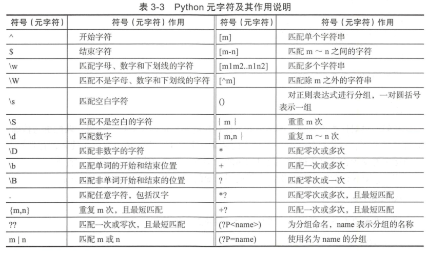
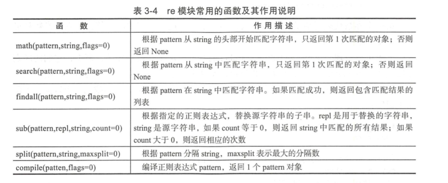
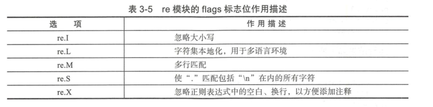
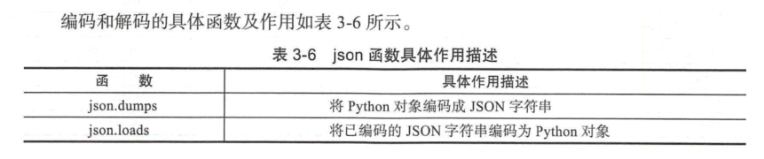
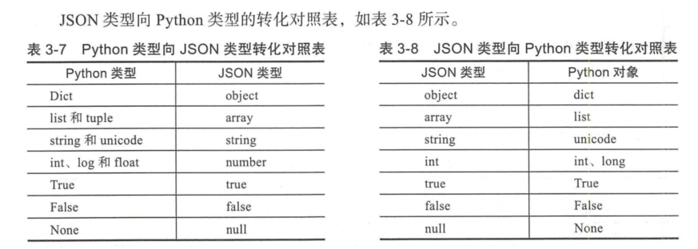
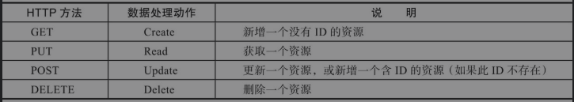

# Python在Devops与自动化运维中的应用

## 3.1 Python基础知识进阶


### 3.1.1 正则表达式应用

正则表达式中有许多特殊的字符（也称元字符），这些特殊字符是构成正则表达式的要素。

Python元字符及其作用说明


(1)原子
原子是正则表达式中最基本的组成单位，每个正则表达式中至少要包含一个原子，常见的原子是由普通字符或通用字符和原子表构成的。

原子表示由一组地位平等的原子组成，匹配的时候会获取该原子表中的任意一个原子来进行匹配。
在Python中，原子表由"[]"表示，"\[xyz]"就是一个原子表，这个原子表中定义了3个原子，这3个原子的地位是平等的。

如果我们要对正则表达式进行嵌套，就需要使用分组“()”，即我们可以使用“ ()”将一些原子组合成一个大原子使用，
小括号括起来的那部分会被当做一个整体来使用。

(2) 贪婪模式与懒惰模式

```python
#!/usr/bin/env python
# -*- coding:utf8 -*-
# auther; 18793
# Date：2019/5/21 17:31
# filename: 贪婪匹配和懒惰匹配.py
import re

# 使用贪婪匹配
m = re.search(r'\d{5,8}', '87654321')
print(m)            #<_sre.SRE_Match object; span=(0, 8), match='87654321'>
print(m.group())    #87654321

# 使用惰性匹配
m = re.search(r'\d{5,8}?', '87654321')      #<_sre.SRE_Match object; span=(0, 5), match='87654'>
print(m)
print(m.group())                            #87654

```

对3位数字重复3次，可以使用下面的正则表达式。命令如下：

```
{\d\d\d}{2}
```

```
\d\d\d{2}这个表达式相当于"\d\d\d\d",匹配的结果为"1234"和"5678"
```

**使用re模块处理正则表达式**


re模块中的很多函数中都有一个flags标志位，该参数用于设置匹配的附加选项。例如，是否忽略大小写、是否支持多行匹配。




### 3.1.2 使用Python解析JSON



使用`dumps()`编码举例：

```python
#!/usr/bin/env python
# -*- coding:utf8 -*-
# auther; 18793
# Date：2020/1/19 10:26
# filename: json_sample0.py
import json

data = [{'a': 1, 'b': 2, 'c': 3, 'd': 4, 'e': 5}]
j = json.dumps(data, indent=4)
print(j)

'''
[
    {
        "d": 4,
        "a": 1,
        "b": 2,
        "c": 3,
        "e": 5
    }
]

'''
```

使用`loads()`解码举例：

```python
#!/usr/bin/env python
# -*- coding:utf8 -*-
# auther; 18793
# Date：2020/1/19 10:30
# filename: json_sample1.py

import json

data = '{"a":1,"b":2,"c":3,"d":4,"e":5}'
text = json.loads(data)
print(text)

'''
{'e': 5, 'b': 2, 'd': 4, 'c': 3, 'a': 1}
'''
```



### 3.1.3 Python多进程

```python
#!/usr/bin/env python
# -*- coding:utf8 -*-
# auther; 18793
# Date：2020/1/20 15:12
# filename: 多个子进程.py

import multiprocessing
import time


def func(msg):
    print(multiprocessing.current_process().name + "-" + msg)


if __name__ == '__main__':
    pool = multiprocessing.Pool(processes=4)
    for i in range(100):
        msg = "hello %d" % (i)
        pool.apply_async(func, (msg,))
    pool.close()        # 关闭进程池表示不能再往进程池中添加进程
    pool.join()         # 等待进程池中所有的进程执行完毕，必须在close()之后调用
    print("Sub-process(es) done.")
```


## 3.2 Python常用的三方库


| 三方库名      | 简介                                                |
| ------------- | --------------------------------------------------- |
| django        | Python最留下的Web框架                               |
| tornado       | 一个web框架和异步网络库                             |
| flask         | 一个Python的微型框架                                |
| cherryPy      | 一个极简单的Python web框架，具有WSGI线程池          |
| requests      | 基于urllib，网络请求库                              |
| yagmail       | 封装了smtplib，几行代码技能发送邮件                 |
| pstuil        | 用于系统监控和分析。                                |
| sh            | 方便调用Linux Shell，比subprocess标准库更方便       |
| Boto3         | 可以使用Boto3来使用AWS.快速调用AWS的各种服务        |
| Srapy         | Python中鼎鼎有名的爬虫框架                          |
| BeautifulSoup | 解析HTML利器，显示最新版本为BS4。                   |
| Selenium      | 模拟浏览器进行自动化测试                            |
| Jinja2        | Jinja2是基于Python的模板引擎                        |
| rq            | 简单的轻量级Python的任务队列                        |
| Celery        | 一个分布式异步任务队列/作业队列，基于分布式消息传递 |
| Supervisor    | 进程管理工具                                        |


## 3.3 利用Flask设计后端Restful API

Flask是轻量级、易于采用、文档化和流行的开发RESTful API的非常好的选择，也是笔者在工作中最常用的Flask Web框架之一。从根本上说，Flask是建立在可扩展性和简单性的基础之上的。Flask应用程序以轻量级而闻名，主要是与Django对比。Flask开发者称之为微框架，其中“微”（如这里所述）意味着目标是保持核心简单但可扩展。Flask不会为我们做出许多决定，比如要使用什么数据库或什么模板引擎来选择。最后，Flask还有广泛的文档来为开发人员提供支持。


在DevOps中使用RESTful API的原因如下：

❑ 返回的不是HTML，而是机器能直接解析的数据。随着Ajax的流行，API返回数据，而不是HTML页面，数据交互量减少，用户体验会更好。前后台分离，后台更多地进行数据处理，前台对数据进行渲染。

❑ 直接使用API可以进行CRUD，增删改查，结构清晰。一个标准的API有4个接口：GET、PUT、POST、DELETE，对应我们的请求类型，就是Web获取页面、上传表单（或文件）、更新资源或删除资源。

❑ 使用Token来进行用户权限认证，比Cookie更安全。相对而言，Tocken认证比Cookie认证更为安全，毕竟Cookie认证是我们爬网站时使用最多的伪造渠道。

❑ 越来越多的开放平台，开始使用API接口。


HTTP方法与CURD数据处理的对应关系



