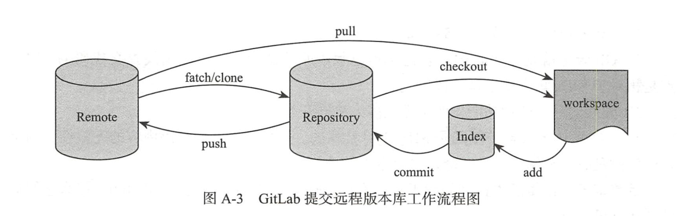
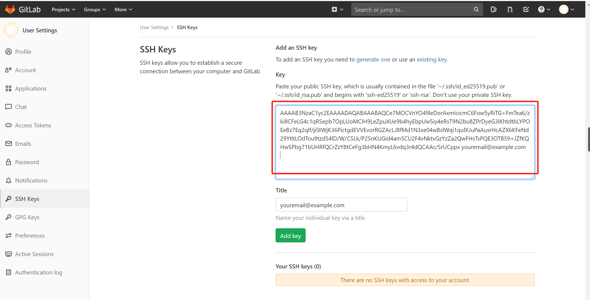

#  GitLab在DevOps工作中的实际应用

## GitLab的优势所在

与传统的SVN版本管理软件相比，GIT又存在哪些优势呢？

### Git与SVN的区别如下：

1）Git的速度是明显快鱼SVN的。

2）Git天生就是分布式的，它包含本地版本库的概念，是可以离线提交代码的

3）强大的分支管理功能，非常方便多人协同开发

4）GIT的内容存储使用的是SHA-1哈希算法，确保代码内容的完整性，确保在遇到磁盘故障和网络问题时降低对版本库的破坏。

### GitLab与Github的区别如下：

1）GitHub如果包含了私人的项目，则需要收费的。而GitLab是免费的，只需要控制下访问权限就行，iptables防火墙很容易就能实现访问权限的设置。

2）GithHub的机器位于国外，如果DevOps工作中需要经常git pull或git push，则会因为网络连接缓慢的问题而影响工作效率；我们部署的GitLab可以放在内网中，也可以放在自己的BGP机房内，在网络上是占绝对优势的。

3）GitLab有中文汉化版本，其对中文的支持是优于GitHub的。


## GitLab的工作流程


### 离线场景下，如图：


### 在线场景下，正常的GitLab工作流（Repository在这里表示本地版本仓库）,如图：



如果工作机器上包含几套公私钥的话，最好需要指定一下“~/.ssh/config”文件，代码如下所示。不然通过SSH协议连接到GitLab时会报错。config配置文件内容如下所示：

```
Host www.github.com
	IdentityFile ~/.ssh/github
Host devops.gl.cachecn.net
	IdentityFile ~/.ssh/gitlab
```


## GitLub部署

GitLab如果是源码安装则非常麻烦，建议使用Dockers化的方式进行部署。


## GitLub的操作流程

1）进入自己的工作目录生成公私钥，命令如下：

```shell
$ ssh-keygen -t rsa
Generating public/private rsa key pair.
Enter file in which to save the key (/c/Users/18793/.ssh/id_rsa):
/c/Users/18793/.ssh/id_rsa already exists.
Overwrite (y/n)?
```

2)将生成的id_rsa.pub文件的内容复制和粘贴到我们内部的GitLab（公网的GitLab）机器上去，选择菜单“Add SSH key”如图所示：




3) 成功以后还需要配置GitLab相关的连接配置，可以在自己的根目录下的“.ssh”目录下建立config文件，路径位置如下：

```
Host 60.1.2.3
	IdentityFile ~/.ssh/id_rsa
```


4) 开始clone一个项目

```
$ git clone git@git.lug.ustc.edu.cn:moonton/pypi_shell_remote.git

Cloning into 'pypi_shell_remote'...
The authenticity of host 'git.lug.ustc.edu.cn (202.38.93.150)' can't be established.
ECDSA key fingerprint is SHA256:ZXIwe0NoyPYM7ArjQl17svUcXUQCVuA3KrxwSFKt6vc.
Are you sure you want to continue connecting (yes/no)? yes
Warning: Permanently added 'git.lug.ustc.edu.cn,202.38.93.150' (ECDSA) to the list of known hosts.
remote: Enumerating objects: 9, done.
remote: Counting objects: 100% (9/9), done.
remote: Compressing objects: 100% (8/8), done.
remote: Total 9 (delta 0), reused 0 (delta 0)
Receiving objects: 100% (9/9), done.
```


Git global setup(**Git全局设置**)

```shell
git config --global user.name "jianlihu"
git config --global user.email "1879324764@qq.com"
```

Create a new repository(**创建仓库**)

```shell
git clone git@git.lug.ustc.edu.cn:hjl722/test.git
cd test
touch README.md
git add README.md
git commit -m "add README"
git push -u origin master
```

Push an existing folder(**推送现有文件夹**)

```shell
cd existing_folder
git init
git remote add origin git@git.lug.ustc.edu.cn:hjl722/test_py.git
git add .
git commit -m "Initial commit"
git push -u origin master
```

Push an existing Git repository(**推动现有的Git存储库，更新仓库信息**)

```shell
cd existing_repo
git remote rename origin old-origin
git remote add origin git@git.lug.ustc.edu.cn:hjl722/test.git
git push -u origin --all
git push -u origin --tags
```


