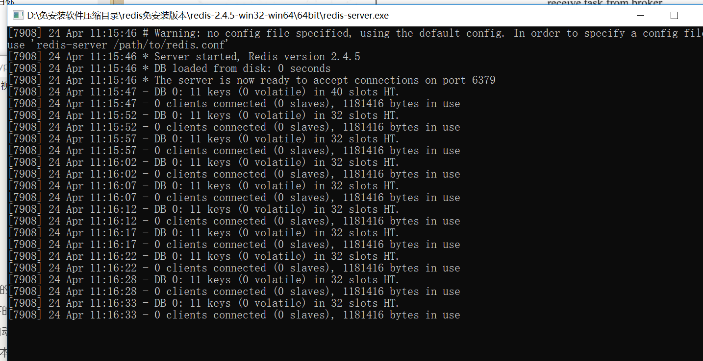
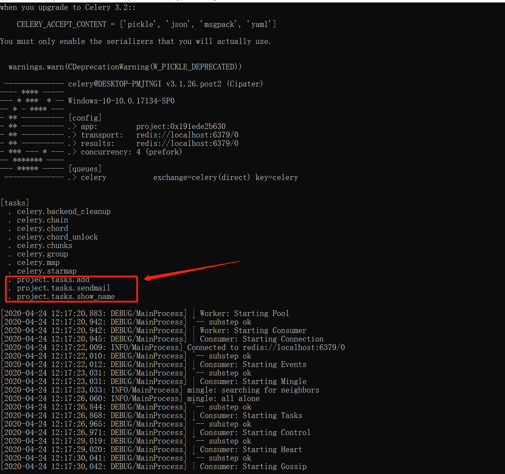

#  分布式队列管理Cerely

Celery 是一个基于Python开发的分布式异步消息任务队列，其可以有助于轻松地实现任务的异步处理，如果我们的业务场景中需要用到异步任务，则可以考虑使用Celery。


下面举例工作中常见的例子：

1. 你想对100台机器执行一条批量命令，可能会花很长时间 ，但你不想让你的程序等着结果返回，而是给你返回 一个任务ID,你过一段时间只需要拿着这个任务id就可以拿到任务执行结果， 在任务执行ing进行时，你可以继续做其它的事情。 
2. 你想做一个定时任务，比如每天检测一下你们所有客户的资料，如果发现今天 是客户的生日，就给他发个短信祝福

## Celery有以下优点：

1. 简单：一单熟悉了celery的工作流程后，配置和使用还是比较简单的
2. 高可用：当任务执行失败或执行过程中发生连接中断，celery 会自动尝试重新执行任务
3. 快速：一个单进程的celery每分钟可处理上百万个任务
4. 灵活： 几乎celery的各个组件都可以被扩展及自定制

Celery基本工作流程图


## Demo演示

安装redis、启动redis

启动一个面安装的redis，解压后直接bin下执行redis-server




pip命令来安装Celery及celery-with-redis，命令如下所示：

```
pip install celery
pip install celery-with-redis
```


### 简单使用

　　目录结构：

```
project/
├── __init__.py  
├── config.py
└── tasks.py
```

各目录文件说明：

__init__.py:初始化Celery以及加载配置文件

```
#!/usr/bin/env python3
# -*- coding:utf-8 -*-
# Author:wd
from celery import Celery
app = Celery('project')                                # 创建 Celery 实例
app.config_from_object('project.config')               # 加载配置模块
```

config.py:  Celery相关配置文件，更多配置参考：http://docs.celeryproject.org/en/latest/userguide/configuration.html

Celery的默认设置就能满足基本的要求，worker以Pool模式启动，默认大小为CPU核心数量，序列化机制默认是pickle，但也可以指定为JSON.由于Python调用Linux比较容易，所有将Celery作为异步任务处理框架非常合适。


```
#!/usr/bin/env python3
# -*- coding:utf-8 -*-
# Author:wd

BROKER_URL = 'redis://localhost:6379/0'  # Broker配置，使用Redis作为消息中间件

CELERY_RESULT_BACKEND = 'redis://localhost:6379/0'  # BACKEND配置，这里使用redis

CELERY_RESULT_SERIALIZER = 'json'  # 结果序列化方案

CELERY_TASK_RESULT_EXPIRES = 60 * 60 * 24  # 任务过期时间

CELERY_TIMEZONE = 'Asia/Shanghai'  # 时区配置

CELERY_IMPORTS = (  # 指定导入的任务模块,可以指定多个
    'project.tasks',
)
```

tasks.py ：任务定义文件

```
#!/usr/bin/env python
# -*- coding:utf8 -*-
# auther; 18793
# Date：2020/4/24 11:59
# filename: tasks.py
import time

from project import app


@app.task
def show_name(name):
    return name


@app.task
def sendmail(mail):
    print("sendmail to {}.....".format(mail["to"]))
    time.sleep(2.0)
    print("mail sent .")


@app.task
def add(x, y):
    return x + y
```

启动Worker：

```
celery worker -A project -l debug

各个参数含义：

　　worker: 代表第启动的角色是work当然还有beat等其他角色；

　　-A ：项目路径，这里我的目录是project

　　-l：启动的日志级别，更多参数使用celery --help查看
```

查看日志输出，会发现我们定义的任务，以及相关配置：



虽然启动了worker，但是我们还需要通过delay或apply_async来将任务添加到worker中，这里我们通过交互式方法添加任务，并返回AsyncResult对象，通过AsyncResult对象获取结果：

worker01.py

```python
#!/usr/bin/env python
# -*- coding:utf8 -*-
# auther; 18793
# Date：2020/4/24 12:10
# filename: worker01.py
from project import tasks

t = tasks.show_name.delay("wd")
print(t.get())
```

worker02.py

```python
#!/usr/bin/env python
# -*- coding:utf8 -*-
# auther; 18793
# Date：2020/4/24 12:10
# filename: worker01.py

from project import tasks

# 模拟发送邮件
t = tasks.sendmail.delay(dict(to="1879324764@qq.com"))
```


```
AsyncResult除了get方法用于常用获取结果方法外还提以下常用方法或属性：

* state: 返回任务状态；
* task_id: 返回任务id；
* result: 返回任务结果，同get()方法；
* ready(): 判断任务是否以及有结果，有结果为True，否则False；
* info(): 获取任务信息，默认为结果；
* wait(t): 等待t秒后获取结果，若任务执行完毕，则不等待直接获取结果，若任务在执行中，则wait期间一直阻塞，直到超时报错；
* successfu(): 判断任务是否成功，成功为True，否则为False；
```


## Cerely进阶参考文献


**[分布式任务队列Celery入门与进阶](https://www.cnblogs.com/wdliu/p/9517535.html)**

[**Celery 分布式任务队列快速入门**](https://www.cnblogs.com/alex3714/articles/6351797.html)


