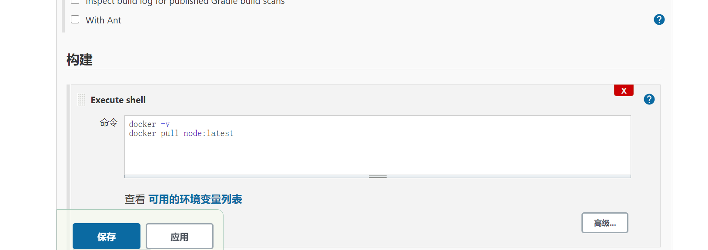
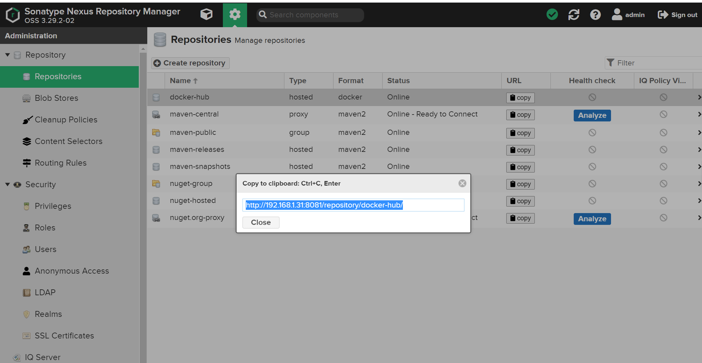

# Jenkins基础知识

## 什么是 CI/CD
### 传统的应用部署过程


显而易见，这种流程不仅繁琐，且容易出错，是非常影响开发效率的。开发人员要花一些时间浪费在这上面。那么有没有高效率，简单便捷一些的方式呢？

这就要提到 `CI/CD` 了。`CI` 的意思是 `持续构建` 。负责拉取代码库中的代码后，执行用户预置定义好的操作脚本，通过一系列编译操作构建出一个 `制品` ，并将制品推送至到制品库里面。常用工具有 Gitlab CI，Github CI，Jenkins 等。这个环节不参与部署，只负责构建代码，然后保存构建物。构建物被称为 制品，保存制品的地方被称为 “制品库”

CD 则有2层含义： `持续部署（Continuous Deployment）` 和 `持续交付（Continuous Delivery）` 。 `持续交付` 的概念是：将制品库的制品拿出后，部署在测试环境 / 交付给客户提前测试。 `持续部署` 则是将制品部署在生产环境。可以进行持续部署的工具也有很多： `Ansible` 批量部署， `Docker` 直接推拉镜像等等。当然也包括我们后面要写到的 `Kubernetes` 集群部署。


## 安装 Docker

在了解了 `Docker` 的作用后，我们来开始安装 `Docker`。在开始安装之前，需要安装 `device-mapper-persistent-data` 和 `lvm2` 两个依赖。

`device-mapper-persistent-data` 是 `Linux` 下的一个存储驱动， `Linux` 上的高级存储技术。 `Lvm` 的作用则是创建逻辑磁盘分区。这里我们使用 `CentOS` 的 `Yum` 包管理器安装两个依赖：

```shell
yum install -y yum-utils device-mapper-persistent-data lvm2
```

依赖安装完毕后，我们将阿里云的 `Docker` 镜像源添加进去。可以加速 `Docker` 的安装。

```shell
sudo yum-config-manager --add-repo http://mirrors.aliyun.com/docker-ce/linux/centos/docker-ce.repo
yum install docker-ce -y
```

安装完毕，我们就可以使用 `systemctl` 启动来启动 `Docker` 了。`systemctl` 是 `Linux` 的进程管理服务命令，他可以帮助我们启动 `docker` 

```shell
systemctl start docker
systemctl enable docker
```

接着执行一下 `docker -v` ，这条命令可以用来查看 `Docker` 安装的版本信息。当然也可以帮助我们查看 `docker` 安装状态。如果正常展示版本信息，代表 `Docker` 已经安装成功。

### 配置阿里云镜像源

在 `Docker` 安装完毕后，之后我们去拉取 `docker` 镜像时，一般默认会去 `docker` 官方源拉取镜像。但是国内出海网速实在是太慢，所以选择我们更换为 `阿里云镜像仓库` 源进行镜像下载加速。

登录阿里云官网，打开 [阿里云容器镜像服务](https://cr.console.aliyun.com/)。点击左侧菜单最下面的 `镜像加速器` ，选择 `CentOS` （如下图）。按照官网的提示执行命令，即可更换 `docker` 镜像源地址。


```
sudo mkdir -p /etc/docker
sudo tee /etc/docker/daemon.json <<-'EOF'
{
  "registry-mirrors": ["https://25bxwt20.mirror.aliyuncs.com"]
}
EOF
sudo systemctl daemon-reload
sudo systemctl restart docker
```


## Jenkins安装

### 1. 安装 OpenJDK

安装Jenkins需要安装JDK，JDK版本必须高于或等于1.8，可以使用源码包安装JDK，也可以使用yum命令安装openjdk，此处使用yum命令安装openjdk，命令如下:

```shell
yum install -y java
```

### 2. 使用 Yum 安装 Jenkins		

安装Jenkins工具的yum源，设置好yum源后使用rpm命令安装Jenkins的key，因为在Jenkins的yum源配置文件中gpgcheck=1，所以需要验证Jenkins的key，命令如下：

```shell
sudo wget -O /etc/yum.repos.d/jenkins.repo https://pkg.jenkins.io/redhat-stable/jenkins.repo
sudo rpm --import https://pkg.jenkins.io/redhat-stable/jenkins.io.key
yum install jenkins
```

### 3. 启动 Jenkins

使用yum命令安装jenkins，安装后启动Jenkins服务，命令如下：

```shell
service jenkins start
# service jenkins restart restart 重启 Jenkins
# service jenkins restart stop 停止 Jenkins

[root@bogon ~]# ps aux | grep jenkins
[root@bogon ~]# netstat -lntp|grep 8080
tcp6       0      0 :::8080                 :::*                    LISTEN      15126/java  
```

### 4. 给 Jenkins 放行端口

在启动 `Jenkins` 后，此时 `Jenkins` 会开启它的默认端口 `8080` 。但由于防火墙限制，我们需要手动让防火墙放行 `8080` 端口才能对外访问到界面。

这里我们在 `CentOS` 下的 `firewall-cmd` 防火墙添加端口放行规则，添加完后重启防火墙。

```
firewall-cmd --zone=public --add-port=8080/tcp --permanent
firewall-cmd --zone=public --add-port=50000/tcp --permanent

systemctl reload firewalld
```

服务启动后，访问 `IP:8080` 。如果能够看到以下界面，代表正在启动。 `Jenkins` 第一次的启动时间一般比较长（视服务器性能而看） 


打开浏览器，在地址栏中输入IP和Port进行Jenkins的安装。


`Jenkins` 启动后，会生成一个**初始密码**。该密码在服务器的文件内存放，我们可以进入服务器查看密码内容，将密码填写在 `Jenkins` 的管理员密码输入框内：

```shell
cat /var/lib/jenkins/secrets/initialAdminPassword
```

### 5.更换插件源

因为 `Jenkins` 插件服务器在国外，所以速度不太理想。我们需要更换为清华大学的 `Jenkins` 插件源后，再安装插件，**所以先不要点安装插件。**

更换方法很简单。进入服务器，将 `/var/lib/jenkins/updates/default.json` 内的插件源地址替换成清华大学的源地址，将 google 替换为 baidu 即可。

Jenkins插件下载镜像加速
``` bash
$ ls /root/.jenkins/updates/default.json 

#进入updates目录下,执行 命令
$ sed -i 's/http:\/\/updates.jenkins-ci.org\/download/https:\/\/mirrors.tuna.tsinghua.edu.cn\/jenkins/g' default.json && sed -i 's/http:\/\/www.google.com/https:\/\/www.baidu.com/g' default.json
```

接着点击 `安装推荐的插件` 即可。稍等一会插件安装完毕。

插件安装完成后要求设置管理员账号和密码， 与搭建开源Web 网站一样。安装完成后会看到如图所示的Jenkins 后台管理界面。


在/etc/sysconfig目录下有一个jenkins文件，该文件是Jenkins的配置文件，

命令如下：

```bash
$ ls /etc/sysconfig/jenkins 
/etc/sysconfig/jenkins
```

Jenkins 程序主目录在/var/lib/jenkins/目录下， jobs 目录下存放的是在Jenkins 浏
览器界面中创建的任务。例如， 在Jenkins 后台web 界面中创建一个“ k8s-docker-CI-CD” 的任务， 在_iobs 目录下就会生成一个“k8s-docker-CI-CD”的目录，命令如下。

```bash
$ ls /var/lib/jenkins/jobs/
k8s-docker-CI-CD

$ ls /var/lib/jenkins/jobs/k8s-docker-CI-CD/
builds  config.xml
```

logs目录时Jenkins日志相关的目录；nodes是多节点时用到的目录，plugins是Jenkins插件所在的目录，该目录下有很多插件，如新建一个插件，插件会自动保存在该目录下，命令如下：

```bash
$ ls /var/lib/jenkins/logs/
tasks
$ ls /var/lib/jenkins/nodes
$ ls /var/lib/jenkins/plugins/
```

secrets是Jenkins密码、密钥存放的目录，users是与用户相关的目录，命令如下：

```bash
$ ls /var/lib/jenkins/users/
admin_6215967324725742951  users.xml
```

如果需要备份Jenkins，直接把/var/lib/jenkins目录下的文件或目录打包到新服务器上即可，Jenkins无需借助数据库存储数据，它的配置全部存放在XML格式文件中。

### 6. 完成安装

插件安装完毕后，接着是注册管理员账号。按照提示一路配置后，直到看到以下界面代表安装成功


**更改Jenkins升级站点**

`插件管理--高级--升级站点`

更新地址：https://mirrors.tuna.tsinghua.edu.cn/jenkins/updates/update-center.json


### 7. 测试安装

到这里，我们的 Jenkins 算是启动成功了。但是，我们还需要对 `Jenkins` 做一点点简单的配置，才可以让它可以构建 `docker` 镜像。

我们点击 `Jenkins` 首页 -> 左侧导航 -> 新建任务 -> **Freestyle project**



新建完毕后，找到 `构建` 一项，选择 `增加构建步骤`，选择 `执行shell` ，输入以下命令：

因为我docker安装的jenkins，所以jenkins中使用docker客户端连接宿主机的2375端口。

```shell
$ docker -v
$ docker -H tcp://localhost:2375 pull node:latest
```

查看docker版本信息。


### 8. Unix Socket 权限问题

`docker` 的架构是 `C/S` 架构。在我们使用 `docker` 命令时，其实是命令使用 `socket` 与 `docker` 的守护进程进行通信，才能正常执行 `docker` 命令。

而在 `Linux` 中， `Unix socket` 属于 `root` 用户，因此需要 `root` 权限才能访问。官方是这么解释的：

> Manage Docker as a non-root user The docker daemon binds to a Unix socket instead of a TCP port. By default that Unix socket is owned by the user root and other users can only access it using sudo. The docker daemon always runs as the root user. If you don’t want to use sudo when you use the docker command, create a Unix group called docker and add users to it. When the docker daemon starts, it makes the ownership of the Unix socket read/writable by the docker group.

但是在 `docker` 中， `docker` 提供了一个 `用户组` 的概念。我们可以将执行 `Shell` 的用户添加到名称为 `docker` 的用户组，则可以正常执行 `docker` 命令。

而在 `Jenkins` 中执行的终端用户做 `jenkins` ，所以我们只需要将 `jenkins` 加入到 `docker` 用户组即可：

```shell
sudo groupadd docker          #新增docker用户组
sudo gpasswd -a jenkins docker  #将当前用户添加至docker用户组
newgrp docker                 #更新docker用户组
```

加入后，重启 `Jenkins` ：

```shell
sudo service jenkins restart
```

重启 `Jenkins` 后，再次执行脚本。此时执行成功。


参考文献

[Centos7安装jenkins](https://www.cnblogs.com/xiao987334176/p/13032339.html)

[CentOS7搭建jenkins](https://www.cnblogs.com/xiao987334176/p/11903724.html)

[ubuntu 安装Jenkins](https://www.cnblogs.com/xiao987334176/p/11323795.html)


## 使用 Jenkins 构建镜像：将你的应用打包成镜像

## 1. 安装 Nodejs 环境

在上一章，我们其实并没有在服务端安装 `Node` 环境。如果想要安装 `Node` 环境，有以下两个办法：

- 源码编译：这种方式是将 `Node`   源码拉下来后，在服务器端编译完成后才可以使用。时间比较长，流程也略复杂
- 使用 `Jenkins Plugin` 中 `NodeJS` 插件自动配置安装

在这里，我们可以选择第二种方式来安装，既方便又省力。

我们打开 `Jenkins` 首页，找到左侧的**系统配置 => 插件管理 => 可选插件**，搜索 `Node` 。选中 `NodeJS` 后，点击左下角的 `直接安装` 开始安装插件


等待安装完毕后，返回 `Jenkins` 首页。找到 **Global Tool Configuration => NodeJS => 新增NodeJS**

接着回到 `Jenkins` 首页，找到左侧的 `系统配置` ，选择 `全局工具配置` 

找到下面的 `NodeJS` ，点击 `NodeJS` 安装，选择相应的版本填写信息保存即可。


### 如何使用

那我们在任务中如何使用呢？我们只需要在任务的**配置**中，找到**构建环境**，选中 `Provide Node & npm bin/ folder to PATH` ，选择刚才配置好的 `NodeJS` 即可。


第一次执行会下载对应的 `Node` 版本，后续不会下载。


## 2. 使用 SSH 协议集成 Git 仓库源

### 2.1 生成公钥私钥

首先，我们先来配置公钥和私钥。这是 `Jenkins` 访问 `Git` 私有库的常用认证方式。我们可以使用 `ssh-keygen` 命令即可生成公钥私钥。在本地机器执行生成即可。这里的邮箱可以换成你自己的邮箱：

```shell
ssh-keygen -t rsa -C "1@1.com"
```

结束后，你会得到两个文件。分别是 xxx 和 xxx.pub。

其中，xxx 是私钥文件，xxx.pub 是对应的公钥文件。**我们需要在 `Git` 端配置公钥，在 `Jenkins` 端使用私钥与 `Git` 进行身份校验。**

### 2.2 在 Gitee 配置公钥

```
$ cat ~/.ssh/gitee_id_rsa.pub
ssh-rsa AAAAB3NzaC1yc2EAAAADAQABAAABAQDCnMTLoNTyeHjkuL04hbQe4nDvnf6dvDOYMJ/zPTp6XdSU+y7zB5vAlDjzz7rpUs+PkvdLWHCk8W8WHU34bZh6RfT9TCQLCUeGNRNvWUlknsQcE5UhMu62fndFlGuY64e0tTCcba5XKmFZanEepbJ7wKon4ky2r6hzO1a8ctpiGps4dSDcZErLYBjb5tHmRNirhertkusxnFeH2Jbqt9uyzbaLOUNTQzbuv5a8V12lQhg4iLsJkrdk75CD5FA7SwE2BLUJwzBEjPa9K8kUBvb+oSj2bZPzBHO2ej701DVOU8fdGSQrmVZYDZn7WArcj4qy8TMhXeKdD4avZQEmQEYP xxxxx@company.com
```

其中的标题为公钥标题，这里可以自定义标题；公钥则为刚才生成的 xxx.pub 文件。使用 `cat` 命令查看下文件内容，将内容填入输入框并保存。接着去 `Jenkins` 端配置**私钥**


### 2.3 在 Jenkins 配置私钥

```
   我们可以在配置任务时，来添加一个自己的凭证。点击项目的 配置，依次找到 **源码管理 => Git => Repositories **

这里的 `Repository URL` 则是我们的仓库地址， `SSH` 地址格式为 `git@gitee.com:xxx/xxx.git` 。可以从仓库首页中的 克隆/下载 => SSH 中看到：

```


重点是 **Credentials** 这一项，这里则是我们选择认证凭证的地方。我们可以点击右侧 `添加 => Jenkins` 按钮添加一条新的凭证认证信息。

点击后会打开一个弹窗，这是 `Jenkins` 添加凭证的弹窗。选择类型中的 `SSH Username with private key` 这一项。接着填写信息即可：

- ID：这条认证凭证在 `Jenkins` 中的名称是什么
- 描述：描述信息
- Username：用户名（邮箱）
- Private Key：这里则是我们填写私钥的地方。点击 **Add** 按钮，**将 xxx 私钥文件内所有文件内容全部复制过去（包含开头的 BEGIN OPENSSH PRIVATE KEY 和结尾的 END OPENSSH PRIVATE KEY）**

接着点击添加按钮，保存凭证。


## 3. 构建镜像

```
#!/bin/sh -l

npm install --registry=https://registry.npm.taobao.org
npm run build
cd $WORKSPACE && docker -H tcp://localhost:2375 build -t jenkins-test .
```

## 4. 执行任务


## 将镜像上传至私有镜像库：让镜像管理更私密

字面意思，镜像库就是集中存放镜像的一个文件服务。镜像库在 `CI/CD` 中，又称 `制品库` 。构建后的产物称为**制品**，制品则要放到**制品库**做**中转和版本管理**。常用平台有**Nexus，Jfrog，Harbor**或其他对象存储平台。

在这里，我们选用 `Nexus3` 作为自己的镜像库。因为其稳定，性能好，免费，部署方便，且支持类型多，是许多制品库的首选选型。

### 部署 Nexus 服务

这里使用docker部署，部署方式参考:

https://www.cnblogs.com/xiao987334176/p/12108560.html



### 登录制品库

私服建设完成后，如果私服对外访问地址为HTTP的话，还需要在服务器配置一下才可以使用（HTTPS不需要配置）。

找到 `daemon.json` 文件，该文件描述了当前 `docker` 配置的镜像加速地址，和配置过的私服地址。

```shell
vi /etc/docker/daemon.json
```

找到 `insecure-registries` 字段，如果不存在就自己添加一个。值是数组类型，将你的制品库地址填写上去。例如：

```
{
  "insecure-registries" : [
    "172.16.81.7:8082"
  ]
}
```

> 注意，nexus 显示的镜像库端口为 nexus 服务端口，要替换为自己配置的端口才有效。

```
{
  "registry-mirrors": ["https://25bxwt20.mirror.aliyuncs.com"],			#镜像加速地址
  "insecure-registries":["192.168.1.31:8082", "192.168.1.40:8090"]		#仓库地址
}
```

保存并退出，重启 Docker

```shell
systemctl restart docker
```

接着使用 `docker login` 命令尝试登录：

```shell
docker login 服务IP:端口
```

参考文献：

[docker 搭建nexus3私服](https://www.cnblogs.com/moues/p/11779065.html)


但这样，我们需要在命令里面写死用户名和密码，无论是安全和友好性上，都是不太合适的。这里我们可以借助 Jenkins 的凭据功能，添加一条用户名密码凭据，然后利用 Shell 变量写入在终端内。

找到任务的设置界面 => 构建环境 => 勾选 Use secret text(s) or file(s) => 找到左下角的新增按钮，选择 `Username and password (separated)` 


使用`${DOCKER_USER} `和 `${DOCKER_PASSWD}`进行引用变量

```
#!/bin/sh -l

#npm install --registry=https://registry.npm.taobao.org
#npm run build
cd $WORKSPACE && docker -H tcp://localhost:2375 build -t 192.168.1.31:8082/jenkins-test  .
docker -H tcp://localhost:2375 login -u ${DOCKER_USER} -p ${DOCKER_PASSWD} 192.168.1.31:8082
docker -H tcp://localhost:2375 push 192.168.1.31:8082/jenkins-test
```


## Jenkins发布PHP代码

打开Jenkins后台Web界面，选择“系统管理”->"管理插件"->"已安装"，检查
检查是否有`Git plugin` 和`Publish Over SSH `两个插件。如果没有， 则需要单击“ 可选插件” 按钮进行安装。安装后重启Jenkins 服务， 命令如下。重启Jenkins 后需要重新在Web 界面中进行登录。

```shell
$ systemctl restart jenkins.service	
```


生成一对密钥用来远程登录服务器，然后将公钥追加到远程服务器的/root/.ssh/authorized_keys文件中，命令如下：

```shell
 ssh-keygen -t rsa
 
 rm -rf ~/.ssh/config
 
 ssh-copy-id -i /root/.ssh/id_rsa.pub root@192.168.1.13

```

安装好两个插件后，选择“系统管理”->“系统设置”，在界面底部选择Publish Over SSH 插件进行相关设置，如图：


**注意**

```
在Passphrase 文本框中输入密码，

Pathto key留空,在key文本框中粘贴/root/.ssh/jenkins文件中的内容。

单击左下角的“增加”按钮增加SSH Server,name可自定义,
在Hostname文本框中输入线上Web服务器IP,在Username 文本框中输入root,在Remote Directory 文本框中输入“/”（根） 。

如果是多台Web Server,继续单击"添加"按钮重复上述操作即可。操作完毕后单击Apply按钮或“保存"按钮。
```

设置完插件后创建新任务，任务名可自定义，如Publish PHP code，选择构建一个自由风格的软件项目，最后单击“确定”按钮进入下一页，在“描述”文本框中输入“发布PHP代码（自定义即可）”，在“源码管理“页面可根据个人或公司情况选择Git或SVN，此处选择Git作为演示。如图：


“构建触发器”和“构建环境”处留空，不做任何选择，增加构建步骤Send files or execute commands over SSH，设置如图：


**注意**

```
在Transfer Set Source files 文本框中输入“ **／**”,表示全部文件。

在Removeprefix 文本框中可以指定截掉的前缀目录，这里留空即可。

Remote directory 用于指定远程服务器上代码的存放路径，例如/data/www/thinkphp.com 。

Exec command为文件传输完成后要执行的命令,例如可以是更改文件权限的命令。

设置完成后单击"Add Transfer Set ”按钮；

如果是多台服务器，可以单击“ Add Server ” 按钮重复以上操作。
```


单击Publish PHP code进行项目构建，如图：


构建后到远程服务器中查看设置的目录，如/data/www目录下回生成复制的源码文件。命令如下：

```shell
[root@desktop-pmjtngi www]# ll /data/www/
total 44
drwxr-xr-x. 2 root root    23 Jun  1 10:54 admin
drwxr-xr-x. 6 root root    91 Jun  1 10:54 Application
-rw-r--r--. 1 root root   404 Jun  1 11:23 composer.json
-rw-r--r--. 1 root root  5558 Jun  1 11:23 favicon.ico
-rw-r--r--. 1 root root  2282 Jun  1 11:23 gulpfile.js
-rw-r--r--. 1 root root  1595 Jun  1 11:23 index.php
-rw-r--r--. 1 root root 10254 Jun  1 11:23 LICENSE
-rw-r--r--. 1 root root   854 Jun  1 11:23 package.json
drwxr-xr-x. 5 root root    83 Jun  1 10:54 Public
-rw-r--r--. 1 root root  2751 Jun  1 11:23 README.md
-rw-r--r--. 1 root root    66 Jun  1 11:23 robots.txt
drwxr-xr-x. 4 root root    58 Jun  1 10:54 Template
drwxr-xr-x. 8 root root   154 Jun  1 10:54 ThinkPHP
drwxr-xr-x. 3 root root    37 Jun  1 10:54 Upload


root@desktop-pmjtngi www]# cat README.md 
[创建 QQ 群及捐赠渠道](https://baijunyao.com/article/124)  


## 链接
- 博客：http://baijunyao.com  
- github：https://github.com/baijunyao/thinkphp-bjyblog  
- gitee：https://gitee.com/baijunyao/thinkbjy  
......
```

在本地修改完代码，提交到Github上，然后在Jenkins中重新构建此项目，那么代码就自动在服务器上更新了。


 Jeknins自动化部署PHP代码

https://www.cnblogs.com/you-men/p/13126873.html


## Jenkins部署Java项目

https://www.cnblogs.com/you-men/p/13143694.html


## 基于docker搭建jenkins

[基于docker搭建jenkins](https://www.cnblogs.com/xiao987334176/p/13373198.html)


##  Jenkins高可用改造

https://www.yuque.com/sukikeita/kb/zc28me


### Jenkins插件下载镜像加速

参考文献：

https://www.cnblogs.com/cfsxgogogo/archive/2004/01/13/12613211.html

https://blog.51cto.com/liujingyu/2529565


```
更换地址
点击 jenkins 的系统管理 --> 插件管理，打开插件管理页面，如图：
Jenkins 欢迎页面点击系统管理，进入系统管理页面，并点击插件管理进入到插件管理页面，如下图：
在插件管理页面点击高级（Advanced），如下图：
在高级选项卡找到更新网站（Update Site）菜单项，将默认网站更新为 https://mirrors.tuna.tsinghua.edu.cn/jenkins/updates/update-center.json 
 
重启Jenkins
```

修改Jenkins的插件下载地址

```
#文件路径
ls /var/jenkins_home/updates/default.json  

进入updates目录下,执行 命令
# sed -i 's/http:\/\/updates.jenkins-ci.org\/download/https:\/\/mirrors.tuna.tsinghua.edu.cn\/jenkins/g' default.json && sed -i 's/http:\/\/www.google.com/https:\/\/www.baidu.com/g' default.json
```


推荐清华大学镜像：https://mirrors.tuna.tsinghua.edu.cn/jenkins/updates/update-center.json

修改文件

```
vi /data/jenkins/data/hudson.model.UpdateCenter.xml
```

完整内容如下：

```
<?xml version='1.1' encoding='UTF-8'?>
<sites>
  <site>
    <id>default</id>
    <url>https://mirrors.tuna.tsinghua.edu.cn/jenkins/updates/update-center.json</url>
  </site>
</sites>
```

重启jenkins

```
docker restart jenkins
```


## Jenkins系列

> 参考：https://www.cnblogs.com/zhuochong/category/1357873.html

### 1. Jenkins忘记密码的修复方法

https://www.cnblogs.com/zhuochong/p/10082271.html


### 2.Jenkins初始化配置

https://www.cnblogs.com/zhuochong/p/10082372.html


### 3.Jenkins插件下载镜像加速

https://www.cnblogs.com/zhuochong/p/10082498.html


### 4.Jenkins添加git密钥对

https://www.cnblogs.com/zhuochong/p/10082566.html


### 5.Jenkins通过Publish over SSH插件实现远程部署

https://www.cnblogs.com/zhuochong/p/10082610.html


### 6.Jenkins用户权限和角色配置

https://www.cnblogs.com/zhuochong/p/10082939.html


### 7.Jenkins修改主目录步骤说明

https://www.cnblogs.com/zhuochong/p/10083281.html


### 8.Jenkins升级、迁移和备份

https://www.cnblogs.com/zhuochong/p/10083498.html


### 9.Jenkins插件备份

https://www.cnblogs.com/zhuochong/p/10083537.html


### 10.Jenkins邮件通知

https://www.cnblogs.com/zhuochong/p/10083568.html


### 11.Jenkins构建触发器

https://www.cnblogs.com/zhuochong/p/10083882.html)


### 12.Docker+Jenkins持续集成环境(4):使用etcd+confd实现容器服务注册与发现

https://www.cnblogs.com/xiaoqi/p/Jenkins-etcd-confd.html)


## 持续集成学习目录

https://www.cnblogs.com/yxiaodao/p/10554766.html


## Jenkins+Gitlab配置Webhook实现提交自动部署

参考文献
https://www.cnblogs.com/xiao987334176/p/11443002.html


## GitLab+Jenkins持续集成
参考文献
https://www.cnblogs.com/xiao987334176/p/11425560.html


## jenkins pipeline持续集成
### pipeline基本使用


参考文献

https://www.cnblogs.com/xiao987334176/p/12427209.html

### pipeline语法


参考文献

https://www.jenkins.io/doc/book/pipeline/syntax/


https://www.bookstack.cn/read/jenkins/a80f4d0e840c74f2.md


https://www.ssgeek.com/post/jenkinspipeline-yu-fa-gai-yao/


## golang+jenkins自动化部署方案

参考文献

https://www.jianshu.com/p/e81084d3756d


## 相关参考文献

<https://www.cnblogs.com/opesn/p/11794465.html>

