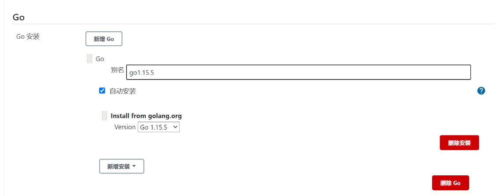
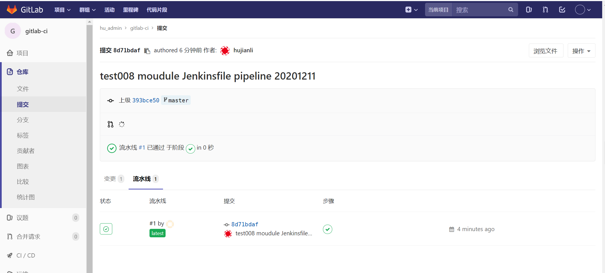
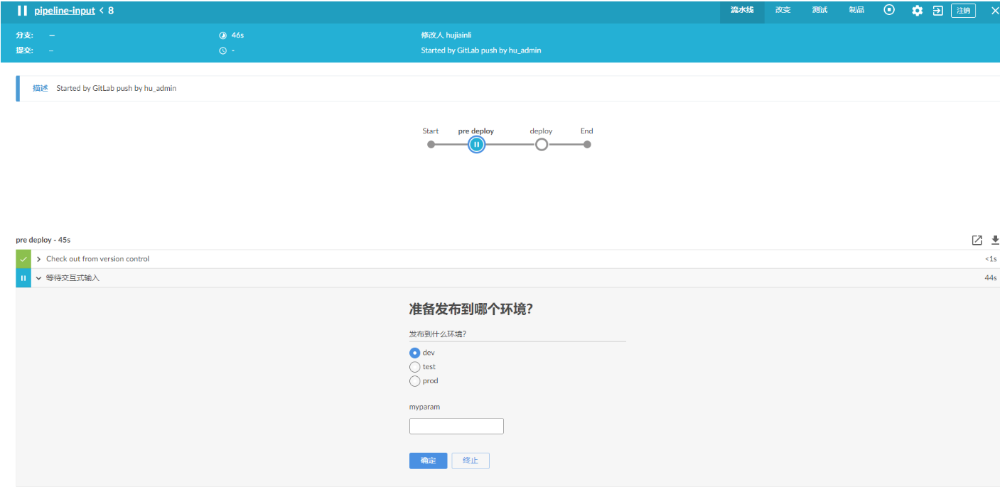
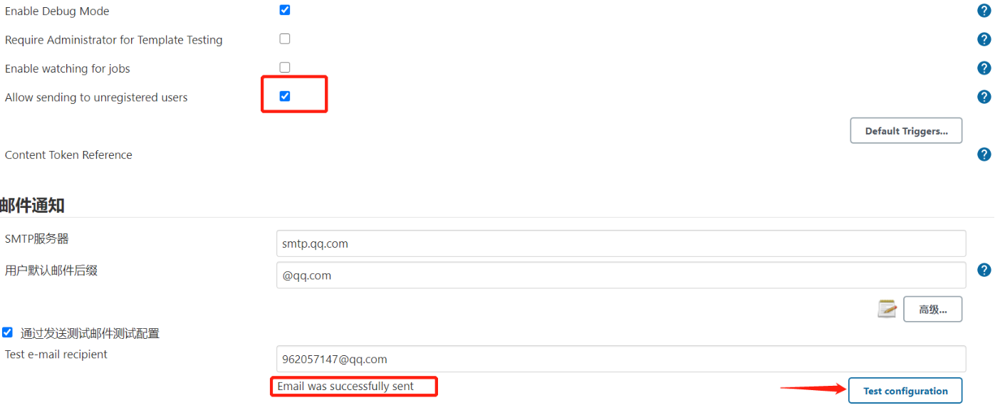
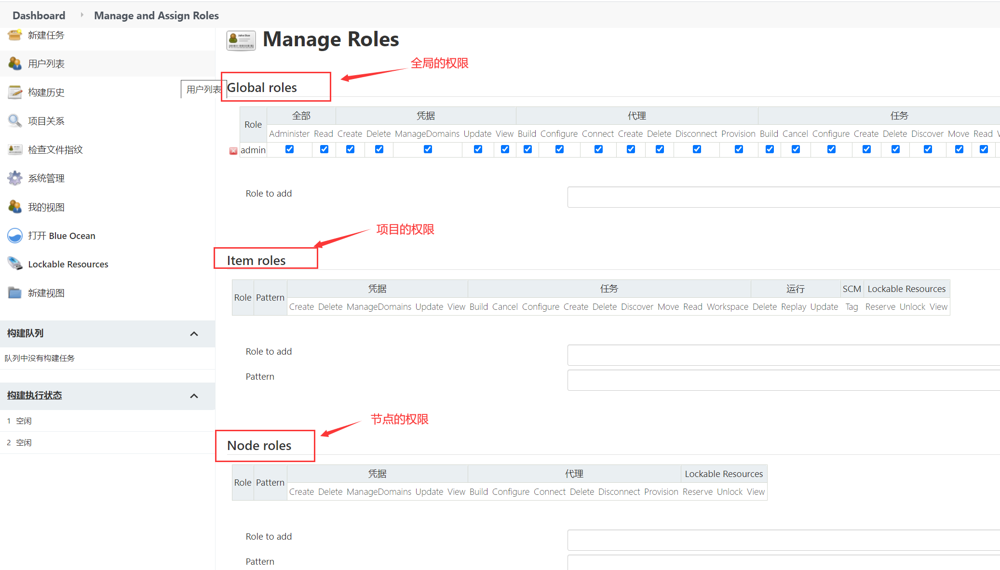
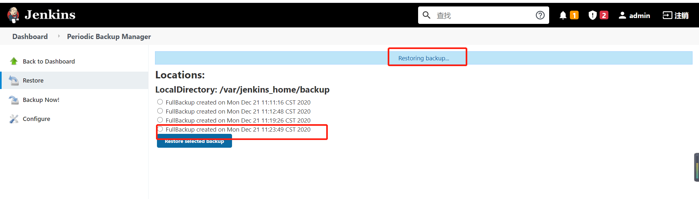

# Jenkins2.x实践指南


## 1. Jenkins介绍


### 1.1 简介

Jenkins是一个开源项目，提供了一种易于使用可扩展的持续集成系统，使开发者从繁杂的集成中解脱出来，专注于更为重要的业务逻辑实现上。同时Jenkins能实时监控集成时存在的错误，提供详细的日志文件和提醒功能，还能用图表的形式形象地展示项目构建的趋势和稳定性。

2009年，[甲骨文](https://baike.baidu.com/item/甲骨文公司/430115?fromtitle=甲骨文&fromid=471435&fr=aladdin)收购了[Sun](https://baike.baidu.com/item/Sun Microsystems/6064586?fromtitle=SUN&fromid=69463)并继承了[Hudson](https://baike.baidu.com/item/HUDSON/4807682)代码库。在 2011 年年初，甲骨文和开源社区之间的关系破裂，该项目被分成两个独立的项目：
Jenkins：由大部分原始开发人员组成
Hudson：由甲骨文公司继续管理

Jenkins 其本身上没有整合太多的功能，只是提供了一个持续集成的WEB平台，它是通过大量的插件，实现了一系列的持续化集成的工作。

例如通过gitlab插件进行代码下载，指定下载分支。通过Git Parameter Plug-In动态获取代码的分支信息，构建时可以选择分支发布。


觉得默认显示的pipeline流程页面不好看，用Blue Ocean插件可以显示更舒服的流程页面。

实际上不使用那些插件，只单纯写一个shell脚本，里面写上git clone代码，编译再ansible发布，而jenkins只是运行这个脚本并打印日志也是可以的。并且也推荐用这种方法，这里使用ansible插件就需要在jenkins中进行配置不方便后续进行迁移。而在机器上安装一个Ansible并在脚本中运行playbook会更加方便管理。


使用Jenkins能提升软件工程生产力的根本原因就在于它提供的是一个自动化平台。一个团队引入了Jenkins就像原来手工作坊式的工厂引入了生产流水线。由于知识的特殊性，它还能帮助我们将知识固化到自动化流水线中，在一定程度上解决了知识被人带走的问题。

我们使用Jenkins的过程，有如设计软件生产流水线的过程。


### 1.2 特点


- 易于安装，只要把jenkins.war部署到servlet容器，不需要数据库支持
- 易于配置，所有配置都是通过其提供的web界面实现
- 集成RSS/E-mail通过RSS发布构建结果或当构建完成时通过e-mail通知
- 生成JUnit/TestNG测试报告
- 分布式构建支持Jenkins能够让多台计算机一起构建/测试
- 支持多种扩展插件，你可以开发适合自己团队使用的工具
- 支持pipeline流水线，可以用代码描述配置过程，方便使用


### 1.3  Jenkins与DevOps

*DevOps*集文化理念、实践和工具于一身，可以提高组织高速交付应用程序和服务的能力，与使用传统软件开发和基础设施管理流程相比，能够帮助组织更快地发展和改进产品。这种速度使组织能够更好地服务于客户，并在市场上更高效地参与竞争。

*DevOps*（*Development*和*Operations*的组合）是一种重视软件开发人员（*Dev*）和*IT*运维技术人员（*Ops*）之间沟通合作的文化、运动或惯例。通过自动化软件交付和架构变更的流程，使得构建、测试、发布软件能够更加快捷、频繁和可靠。


在谈到真正要落地DevOps时，基本上都会谈到Jenkins。这说明Jenkins能帮助我们很好地兑现DevOps的承诺。


### 1.4 Jenkins安装

参考文献：

https://www.cnblogs.com/rxysg/p/15681492.html#ansible%E5%AE%89%E8%A3%85jenkins

https://www.jenkins.io/zh/doc/book/installing/


ubuntu 安装 Jenkins

https://ld246.com/article/1615968668499


centos7安装jenkins

https://ld246.com/article/1601370128878


### 1.5 Jenkins配置管理工具

安装完成后，配置管理工具

#### 1.安装并配置git

```shell
yum -y install git
```

编辑git环境变量为/usr/bin/git

#### 2.安装并配置maven

```shell
wget https://mirrors.tuna.tsinghua.edu.cn/apache/maven/maven-3/3.6.3/binaries/apache-maven-3.6.3-bin.tar.gz

tar -xvf apache-maven-3.6.3-bin.tar.gz

mv apache-maven-3.6.3 /usr/local/maven
vim /etc/profile.d/maven.sh
#!/bin/bash

export M2_HOME=/usr/local/maven

export PATH=$PATH:$M2_HOME/bin
source /etc/profile.d/maven.sh

mvn --version
```

编辑maven的环境变量为/usr/local/maven

#### 3.安装并配置ansible

```shell
yum -y install ansible
```

编辑ansible的环境变量为/usr/bin


### 1.6 jenkins插件下载和加速

插件下载参考文献

https://www.cnblogs.com/wengshaohang/p/12272952.html


jenkins插件加速方式：

https://ld246.com/article/1588144059031


## 2. pipeline入门

### 2.1 pipeline是什么

按《持续交付》中的定义，Jenkins本来就支持pipeline（通常会把部署流水线简称为pipeline，本书会交替使用这两个术语），只是一开始不叫pipeline，而叫任务。


Jenkins 1.x只能通过界面手动操作来“描述”部署流水线。

Jenkins 2.x终于支持pipeline as code了，可以通过“代码”来描述部署流水线。

使用“代码”而不是UI的意义在于：

- 更好地版本化：将pipeline提交到软件版本库中进行版本控制。
- 更好地协作：pipeline的每次修改对所有人都是可见的。除此之外，还可以对pipeline进行代码审查。
- 更好的重用性：手动操作没法重用，但是代码可以重用。


### 2.2 Jenkinsfile又是什么

Jenkinsfile就是一个文本文件，也就是部署流水线概念在Jenkins中的表现形式。像Dockerfile之于Docker。

所有部署流水线的逻辑都写在Jenkinsfile中。

Jenkins默认是不支持Jenkinsfile的。我们需要安装pipeline插件，其安装方式和普通插件的安装方式无异。安装完成后，就可以创建pipeline项目了。

我们使用的插件版本为2.6


### 2.3 pipeline语法的选择

Jenkins团队在一开始实现Jenkins pipeline时，Groovy语言被选择作为基础来实现pipeline。所以，在写脚本式pipeline时，很像是（其实就是）在写Groovy代码。这样的确为用户提供了巨大的灵活性和可扩展性，我们还可以在脚本式pipeline中写try-catch。示例如下：

**脚本式（Scripted）语法**

灵活、可扩展

```
node {
    stage('Build') {
        //执行构建
    }

    stage('Test') {
        //执行测试
    }

    stage('Deploy') {
        try{
            // 执行部署
        }catch(err){
            currentBuild.result = "FAILURE"
            mail body: "project error is here:${env.BUILD_URL}",
            from: 'xxxx@yyy.com',
            replyTo: "project build failed",
            to: 'zzzzz@yyyy.com'
            throw errr

        }
    }
}
```


**声明式（Declar-ative）语法**

更简单、更结构化（more opinionated）的语法

```
pipeline {
    agent any

    stages {
        stage('Build') {
            steps {
                echo "Building...."
            }
        }
    
        stage('Test') {
            steps {
                echo "Testing...."
            }
        }
    
        stage('Deploy') {
            steps {
                echo "Deploying....."
            }    
        }
    }
}
```

> 推荐使用声明式语法。因为声明式语法更符合人类的阅读习惯、更简单。声明式语法也是Jenkins社区推荐的语法。


### 2.4 创建第一个pipeline

声明式-hello-world例子

```
pipeline {
    agent any

    stages {
        stage('Hello') {
            steps {
                echo 'Hello World'
            }
        }
    }
}
```


声明式-kubernets例子

```
// Uses Declarative syntax to run commands inside a container.
pipeline {
    agent {
        kubernetes {
            // Rather than inline YAML, in a multibranch Pipeline you could use: yamlFile 'jenkins-pod.yaml'
            // Or, to avoid YAML:
            // containerTemplate {
            //     name 'shell'
            //     image 'ubuntu'
            //     command 'sleep'
            //     args 'infinity'
            // }
            yaml '''
apiVersion: v1
kind: Pod
spec:
  containers:
  - name: shell
    image: ubuntu
    command:
    - sleep
    args:
    - infinity
'''
            // Can also wrap individual steps:
            // container('shell') {
            //     sh 'hostname'
            // }
            defaultContainer 'shell'
        }
    }
    stages {
        stage('Main') {
            steps {
                sh 'hostname'
            }
        }
    }
}
```


### 2.5 从版本控制库拉取pipeline

**演示：我们让Jenkins从Git仓库拉取pipeline并执行。**

将Git私钥放到Jenkins上的方法是：进入`Jenkins→Credentials→System→Global credentials`页，然后选择Kind为“SSH Username with private key”，接下来按照提示设置就好了

Jenkins从Git仓库拉取代码时，需要SSH key就可以了，然后Jenkins本身提供了这种方式让我们设置，我们首先配置一个ssh的全局凭证。我们需要提前将SSH的公钥放到Git仓库中。


在Pipeline节点下，在“Definition”中选择“Pipeline script from SCM”，并在“SCM”中选择“Git”，然后根据选项填入信息内容就可以了


查看开发机器上的ssh公钥信息：

```
$ cat ~/.ssh/id_rsa.pub
ssh-rsa AAAAB3NzaC1yc2EAAAADAQABAAABAQCe7MOCVnYO49leDorAxmIcicmC6Fow5yRiTG+FmTea6/zki8CFeLG4c1qRSepb7OpLUoMCIH9LerDyeG3lKhtdtbLYPOEeBz7Eq2qlf/jiStWjK36PictgdEVVEvorRGZAcLJ8fMd1N3xe04wBslWqi1qulXJuPaAusrHcAZX6KFeNd29YtltLOdTou94vNktvGzYzZa2QwFHsTsPQE3OTBS9+JZfKQHwSPbg71bUHRfQCrZzY8tCeFg3bHN4KmyL6vdq3r4dQCAAc/SrUCppx youremail@example.com
```


配置Gitlab上的公钥认证


编写一个Jenkinsfile文件上传到master分支中，Jenkinsfile文件就是之前的Hello world。


手动触发Jenkins任务。


查看pipline执行日志输出


**Jenkins SCM** 在拉取代码时候执行输出如下信息

```
 > git init /var/jenkins_home/workspace/first_pipleline # timeout=10
Fetching upstream changes from http://192.168.1.25:10080/root/test_jenkins
 > git --version # timeout=10
 > git --version # 'git version 2.11.0'
using GIT_ASKPASS to set credentials 
 > git fetch --tags --progress -- http://192.168.1.25:10080/root/test_jenkins +refs/heads/*:refs/remotes/origin/* # timeout=10
 > git config remote.origin.url http://192.168.1.25:10080/root/test_jenkins # timeout=10
 > git config --add remote.origin.fetch +refs/heads/*:refs/remotes/origin/* # timeout=10
Avoid second fetch
 > git rev-parse refs/remotes/origin/master^{commit} # timeout=10
Checking out Revision 626d37de57ef1888c2a76d1bdf84dabb5ff66223 (refs/remotes/origin/master)
 > git config core.sparsecheckout # timeout=10
 > git checkout -f 626d37de57ef1888c2a76d1bdf84dabb5ff66223 # timeout=10
```


### 2.6 使用Maven构建Java应用

Jenkins上安装JDK和Maven。我们可以登录Jenkins服务器手动安装，也可以让Jenkins自动安装。这里选择后者。方法如下：


当Jenkins执行到tools时，就会根据Maven的设置自动下载指定版本的Maven，并安装。tools是pipeline中的一个指令，用于自动安装工具，同时将其路径放到PATH变量中。通过命令sh "printenv"，可以看到tools将MAVEN_HOME放到了当前任务的环境变量中。

`Jenkinsfile`

```
pipeline {
    agent any

    tools {
        maven 'mvn-3.5.4'
    }

    stages{
        stage('Build') {
            steps {
                sh "mvn clean package spring-boot:repackage"
                sh "printenv"
            }
        }
    }


}
```


单击构建后，通过Jenkins执行日志，我们看到指定版本的Maven被下载和安装，mvn执行打包。


两个完整的pipeline入门示例完成了。


总结：

Jenkins pipeline支持两种语法。

- node为根节点的是脚本式语法
- pipeline为根节点的是声明式语法

因为Jenkins pipeline毕竟只是工具，我们需要原则与实践的指导。

### 小结

参考文献

https://blog.51cto.com/ygqygq2/2445184


## 3. pipeline语法讲解

### 3.1 必要的Groovy知识

虽然学习Jenkins pipeline可以不需要任何Groovy知识，但是学习以下Groovy知识，对于我们写pipeline如虎添翼。

> - 虽然Groovy同时支持静态类型和动态类型，但是在定义变量时，在Groovy中我们习惯使用def关键字，比如def x="abc"、def y=1。
>
> - 不像Java，Groovy语句最后的分号不是必需的。
> - Groovy中的方法调用可以省略括号，比如System.out.println "Hello world"。


- 1. 支持命名参数，比如：

```
def createName(String givenName, String familyName) {
	return givenName + " " + familyName
}

// 调用时可以这样
createName familyName =  "Hujianli" , givenName = "Jenkinfiles"
```

- 2. 支持默认参数值，比如：

```
def sayHello(String name = "hujianli") {
	print "hello ${name}"
}

// 调用
sayHello()
```

- 3. 支持单引号、双引号。双引号支持插值，单引号不支持。比如：

```
def name = "world"

// 结果：hello world 
print "hello ${name}"

// 结果：hello ${name}
print 'hello ${name}''
```

- 4. 支持三引号。三引号分为三单引号和三双引号。它们都支持换行，区别在于只有三双引号支持插值。比如：

```
def strippedFirstNewline = '''line one
line two
line three
'''

// 可以写成下面这种形式，可读性更好

def strippedFirstNewline = '''\
line one
line two
line three
'''
```


- 5. 支持函数。

```
def getSecure(String Ticket_Token) {
  def token = "Ticket Token is " + Ticket_Token
  return token
}

println getSecure("weiyigeek")  //Ticket Token is weiyigeek
```


- 6. 支持闭包。闭包的定义方法如下：

```
// # 闭包的定义方法：
def codeBlock = {print "hello world!"}
// codeBlock() //

// # 闭包的另类用法:
// 定义一个stage函数
def stage(String name, closue) {
  println name
  def closue() {
    println "闭包调用的 closue function!"
  }
}
stage("stage name",{println "closue"})
```


- 7. 支持类定义和实例化。

```
class Greet {
  def name
  Greet(who) { name = who[0].toUpperCase() + who[1..-1] }
  def salute() { println "Hello " + name + "!" }
}
 
g = new Greet('world')  // create object
g.salute()   // Hello World!
```


### 3.2 pipeline的组成

Jenkins pipeline其实就是基于Groovy语言实现的一种DSL（领域特定语言），用于描述整条流水线是如何进行的。流水线的内容包括执行编译、打包、测试、输出测试报告等步骤。

####  1. pipeline最简结构

一个基本的pipeline结构:

```groovy
pipeline {
    agent any
    stages {
        stage('Example Build') {
            steps {
                echo 'Hello World'
            }
        }
    }
}
```

```
• pipeline：代表整条流水线，包含整条流水线的逻辑。


• stage部分：阶段，代表流水线的阶段。每个阶段都必须有名称。本例中，build就是此阶段的名称。


• stages部分：流水线中多个stage的容器。stages部分至少包含一个stage。


• steps部分：代表阶段中的一个或多个具体步骤（step）的容器。steps部分至少包含一个步骤，本例中，echo就是一个步骤。在一个stage中有且只有一个steps。


• agent部分：指定流水线的执行位置（Jenkins agent）。流水线中的每个阶段都必须在某个地方（物理机、虚拟机或Docker容器）执行，agent部分即指定具体在哪里执行。
```

> jenkins-pipeline：在Jenkinsfile中配置多个代理
>
> https://zhuanlan.zhihu.com/p/147262645


#### 2. 步骤

pipeline基本结构决定的是pipeline整体流程，但是真正“做事”的还是pipeline中的每一个步骤。`步骤是pipeline中已经不能再拆分的最小操作。`

前文中，我们只看到两个步骤：sh和echo。

sh是指执行一条shell命令；echo是指执行echo命令。这两个步骤只是Jenkins pipeline内置的大量步骤中的两个。

pipeline plugin的GitHub仓库给出了一个列表（https://github.com/jenkinsci/pipeline-plugin/blob/master/COMPATIBILITY.md）方便大家检索。


Jenkins官方还提供了pipeline步骤参考文档（https://jenkins.io/doc/pipeline/steps/）。


#### 3. post部分

包含的是在整个pipeline或阶段完成后一些附加的步骤。

post部分是可选的，所以并不包含在pipeline最简结构中。但这并不代表它作用不大。

根据pipeline或阶段的完成状态，post部分分成多种条件块，包括：

```
• always：无论流水线或阶段的完成状态如何，都允许在 post 部分运行该步骤。

• changed：只有当前流水线或阶段的完成状态与它之前的运行不同时，才允许在 post 部分运行该步骤。

• fixed：上一次完成状态为失败或不稳定（unstable），当前完成状态为成功时执行。

• regression：上一次完成状态为成功，当前完成状态为失败、不稳定或中止（aborted）时执行。

• aborted：当前执行结果是中止状态时（一般为人为中止）执行, 通常由于流水线被手动的aborted。通常web UI是灰色。

• failure：当前完成状态为失败时执行,通常web UI是红色。

• success：当前完成状态为成功时执行,通常web UI是蓝色或绿色。

• unstable：当前完成状态为不稳定时执行,通常由于测试失败,代码违规等造成。通常web UI是黄色。

• cleanup：清理条件块。不论当前完成状态是什么，在其他所有条件块执行完成后都执行。
```

post部分可以同时包含多种条件块。

以下是post部分的完整示例。

```groovy
pipeline {
    agent any

    stages{
        stage("build"){
            steps{
                echo "build stage"
            }

            post{
                always {
                    echo "stage post always...."
                }
            }

        }
    }

    post{
        changed{
            echo "pipeline post change"
            }
        always{
            echo "pipeline post always"
        }
        success{
            echo "pipeline post success"
        }
        // 省略其他条件
    }


}
```

**pipeline支持的指令**

显然，基本结构满足不了现实多变的需求。所以，Jenkins pipeline通过各种指令（directive）来丰富自己。指令可以被理解为对Jenkins pipeline基本结构的补充。

Jenkins pipeline支持的指令有：

```
• environment：用于设置环境变量，可定义在stage或pipeline部分。

• tools：可定义在pipeline或stage部分。它会自动下载并安装我们指定的工具，并将其加入PATH变量中。

• input：定义在stage部分，会暂停pipeline，提示你输入内容。

• options：用于配置Jenkins pipeline本身的选项，比如options {retry（3）}指当pipeline失败时再重试2次。options指令可定义在stage或pipeline部分。

• parallel：并行执行多个step。在pipeline插件1.2版本后，parallel开始支持对多个阶段进行并行执行。

• parameters：与input不同，parameters是执行pipeline前传入的一些参数。

• triggers：用于定义执行pipeline的触发器。

• when：当满足when定义的条件时，阶段才执行。
```

在使用指令时，需要注意的是每个指令都有自己的“作用域”。如果指令使用的位置不正确，Jenkins将会报错。

- parallel示例

```groovy
pipeline {
    agent any   
    stages {
        stage('Non-Parallel Stage') {
            steps {
                echo 'This stage will be executed first.'
            }
        }
        stage('Parallel Stage') {
            failFast true
            parallel {
                stage('并行一 打印ENV') {
                    steps {
                      sh '''#!/bin/bash
                          printenv
                    '''
                    }
                }
                stage('并行二') {
                    steps {
                        echo "并行二"
                    }
                }
                stage('并行三') {
                    stages {
                        stage('Nested 1') {
                            steps {
                                echo "In stage Nested 1 within Branch C"
                            }
                        }
                        stage('Nested 2') {
                            steps {
                                echo "In stage Nested 2 within Branch C"
                            }
                        }
                    }
                }
            }
        }
    }
}
```

CI流程效果图如下


#### 4. 配置pipeline本身

options指令用于配置整个Jenkins pipeline本身的选项。根据具体的选项不同，可以将其放在pipeline块或stage块中。

##### buildDiscarder

保存最近历史构建记录的数量，比较熟悉Jenkins的童鞋应该明白这个参数的意义，可以有效控制Jenkins主机存储空间。

```
options {
    // 表示保留10次构建历史
    buildDiscarder(logRotator(numToKeepStr: '10'))
}
```


##### checkoutToSubdirectory 

Jenkins从版本控制库拉取源码时，默认检出到工作空间的根目录中，此选项可以指定检出到工作空间的子目录中。示例如下：

```
options {
    checkoutToSubdirectory('testdir')
}
```


##### disableConcurrentBuilds

同一个pipeline，Jenkins默认是可以同时执行多次的，此选项是为了禁止pipeline同时执行

```
options {
    disableConcurrentBuilds()
}
```


##### newContainerPerStage

当agent为docker或dockerfile时，指定在同一个Jenkins节点上，每个stage都分别运行在一个新的容器中，而不是所有stage都运行在同一个容器中。

```
options {
    newContainerPerStage()
}
```


##### retry

当发生失败时进行重试，可以指定整个pipeline的重试次数。需要注意的是，这个次数是指总次数，包括第1次失败。以下例子总共会执行4次。当使用retry选项时，options可以被放在stage块中。

```
options {
    retry(4)
}
```


##### timeout

设置项目构建超时时间，很明显，如果超时，将会以失败状态结束构建。

```
options {
    // 设置流水线运行的超过10分钟，Jenkins将中止流水线
    timeout(time: 10, unit: 'MINUTES')
}
```


##### timestamps

设置在项目打印日志时带上对应时间。

```
options {
    // 输出构建的时间信息
  timestamps()
}
```


##### skipDefaultCheckout
在`agent` 指令中，跳过从源代码控制中检出代码的默认情况。

```
options {
    // 跳过默认的代码检出
    skipDefaultCheckout()
}
```

##### 常用汇总

```
    options {
      disableResume()
      skipDefaultCheckout()
      quietPeriod(5)
      timestamps()
      buildDiscarder(logRotator(numToKeepStr: '100'))
      timeout(time: 60, unit: 'MINUTES')
    }
```


#### 5. 声明式pipeline中使用脚本

描述: 前面我们说过我们可在`Declarative Pipeline` 中 采用script指令来执行`Scripted Pipeline`中的一些脚本;


Jenkins pipeline专门提供了一个script步骤，你能在script步骤中像写代码一样写pipeline逻辑。比如分别在不同的浏览器上跑测试。

例子.单步式声明式 && Script Block in Declarative Pipeline

```
pipeline {
    agent any
    stages {
        stage('Example') {
          // 步骤部分必须包含一个或多个步骤。
          steps { 
              echo 'Hello World'
              // 执行 Scripted Pipeline (实际上就是直接执行并采用Groovy原生语法)
              script {
                def browsers = ['chrome', 'firefox']
                for (int i = 0; i < browsers.size(); ++i) {
                    echo "Testing the ${browsers[i]} browser"
                }
              }
          }
        }
    }
}
```

如果在script步骤中写了大量的逻辑，则说明你应该把这些逻辑拆分到不同的阶段，或者放到共享库中


####  6 pipeline内置基础步骤

##### deleteDir

删除当前目录.deleteDir是一个无参步骤，删除的是当前工作目录。通常它与dir步骤一起使用，用于删除指定目录下的内容。

```
stage('delete') {
    steps {
        echo '清理工作目录'
        deleteDir()
    }
}
```

另外还有一个clean（此方法依赖于插件 `Workspace Cleanup`）清理工作空间时用法与之类似。

```
stage('delete') {
    steps {
        echo '清理工作目录'
        cleanWs()
    }
}
```

区别在于deleteDir可以指定目录删除。

##### dir

切换到目录.默认pipeline工作在工作空间目录下，dir步骤可以让我们切换到其他目录。

```
dir("/var/logs"){
        deleteDir()
}
```

##### fileExists

判断文件是否存在。可用绝对路径，也可以使用相对路径，相对路径的时候，记住是基于 `$WORKSPACE`的。

```
pipeline {
    agent any
    environment {
        git_url     = "git@192.168.3.65:jenkins-learn/hello-world.git"
        remote_ip   = "192.168.3.67"
        remote_dir  = "/opt/hello"
    }
    options {
        buildDiscarder(logRotator(numToKeepStr: '10'))
        disableConcurrentBuilds()
        timestamps()
    }
    stages {
        stage('rsync') {
            steps {
                script {
                    build_file = "$WORKSPACE/README.md"
                    if(fileExists(build_file) == true) {
                    sh '''
                        rsync -avz --progress -e 'ssh -p 22' --exclude='Jenkinsfile' --exclude='.git' --delete ${WORKSPACE}/  root@$remote_ip:$remote_dir
                    '''
                    }else {
                        error("here haven't find json file")
                    }
                }
            }
        }
        stage('delete') {
            steps {
                echo '清理工作目录'
                cleanWs()
            }
        }
    }
    post {
        success {
            sh "echo 成功了"
        }
        failure {
            sh "echo 失败了"
        }
    }
}
```

这个例子比较适合生产当中的情境，部署的步骤放在编译的后边，如果编译之后，Java项目的war包没有生成，那么我们跳出构建，如果生成了，则执行构建的步骤。

##### error

**主动报错，中止当前pipeline**

error 步骤的执行类似于抛出一个异常。它只有一个必需参数：message。通常省略参数：error（"there's an error"）。

```
        stage('npm build') {
              steps {
                script {
                  if (BUILD_EXPRESSION == true) {
                    sh '''
                        npm run build-i18n
                        sleep 3
                    '''
                  }else {
                      error("npm install error!!!")
                  }
                }
            }
        }
```

##### timeout

代码块超时时间。通常这在执行一些编译步骤如遇不可知情况导致编译失败而又不退出的情况。

```
timeout(20){
        steps{
        sh 'rsync -avz --progress -e 'ssh -p 22' --exclude='Jenkinsfile' --exclude='.git' --delete ${WORKSPACE}/  root@$remote_ip:$remote_dir'
    }
}
```

##### waitUtil

等待条件满足，不断重复代码块中的内容，直到条件为true。这个功能的应用场景我倒是想到了一个，很贴切，有一些服务在生产环境跑着，并不能直接关闭发布，而往往加入一个优雅停机的功能，因此调用停机接口之后，我们就可以做一个等待，等待服务端口彻底关闭之后，再进行部署，当然，最好再配合一下timeout，以避免死循环。

```
timeout(10){
    waitUntil{
        script{
            def r = sh script: 'curl http://exmaple',returnStatus: true
            return ( r == 0 )
        }
    }
}
```

##### retry

重复执行某个块，如果某次执行中有异常，则跳出当次，而不会影响整体。注意，在执行retry过程中，用户无法手动终止流水线。

```
steps {
    retry(5)
    script{
        sh script: 'curl http://exmaple',returnStatus: true        
    }
}
```

##### sleep

让pipeline睡眠一段时间。

支持参数如下：

- time：整型，休眠时间。
- unit：时间单位，支持的值有NANOSECONDS,MICROSECONDS,MILLISECONDS,SECONDS(默认),MINUTES,HOURS,DAYS.

```
sleep(120) //休眠120秒
sleep(time: '2',unit: "MINUTES") //休眠2分钟
```

##### try&catch

简单说明就是，流水线会顺行执行try关键字块内的语句，如果所有语句执行都正常，那么程序正常退出，如果有异常，则catch部分将会捕捉错误，进行打印，并退出整个流水线，这一点非常关键，某个阶段有异常，整个构建结束，这一特性，值得推广到所有的流水线当中应用起来。

简单示例

```
pipeline{
    agent any
    stages{
        stage('Example1') {
            steps {
                script {
                    try {
                        echo 'aaa'
                        eccho 'bbb'
                        echo 'ccc'
                    } catch (err) {
                        echo 'err'
                    }
                }
            }       
        }
        stage('Example2') {
            steps {
                script {
                    try {
                        echo 'aaa'
                        echo 'ccc'
                    } catch (err) {
                        echo 'err'
                    }
                }
            }       
        }
    }
    post{
        always{
            echo "========always========"
        }
        success{
            echo "========pipeline executed successfully ========"
        }
        failure{
            echo "========pipeline execution failed========"
        }
    }
}
```

```
isUnix：判断是否为类UNIX系统
如果当前pipeline运行在一个类UNIX系统上，则返回true。

pwd：确认当前目录
pwd与Linux的pwd命令一样，返回当前所在目录。它有一个布尔类型的可选参数：tmp，如果参数值为true，则返回与当前工作空间关联的临时目录。

writeFile：将内容写入指定文件中
writeFile支持的参数有：
• file：文件路径，可以是绝对路径，也可以是相对路径。
• text：要写入的文件内容。
• encoding（可选）：目标文件的编码。如果留空，则使用操作系统默认的编码。如果写的是Base64的数据，则可以使用Base64编码。


readFile：读取文件内容
读取指定文件的内容，以文本返回。readFile支持的参数有：
• file：路径，可以是绝对路径，也可以是相对路径。
• encoding（可选）：读取文件时使用的编码。
```


#####  制品相关步骤

```
stash：保存临时文件
stash步骤可以将一些文件保存起来，以便被同一次构建的其他步骤或阶段使用。如果整个pipeline的所有阶段在同一台机器上执行，则stash步骤是多余的。所以，通常需要stash的文件都是要跨Jenkins node使用的。


unstash：取出之前stash的文件
unstash步骤只有一个name参数，即stash时的唯一标识。
```


##### 命令相关步骤

```
sh：执行shell命令
参考：https://www.qedev.com/auto/214147.html

bat、powershell步骤
```

Jenkinsfile 中获取shell命令的标准输出或者状态

```
 product_name = sh (returnStdout: true,
            script: "grep ^product_name: schema.yml| awk '{print \$2}'").trim()
```

###### 1. 获取标准输出

```
//第一种
result = sh returnStdout: true ,script: ""
result = result.trim()
//第二种
result = sh(script: "", returnStdout: true).trim()
//第三种
sh " > commandResult"
result = readFile('commandResult').trim()
```

###### 2. 获取执行状态

```
//第一种
result = sh returnStatus: true ,script: ""
result = result.trim()

//第二种
result = sh(script: "", returnStatus: true).trim()

//第三种
sh '; echo $? > status'
def r = readFile('status').trim() //值得学习

//第四种
sh label: 'release', returnStdout: true, script:"""
sudo apk add jq && \
if ( \$(curl -s --header 'PRIVATE-TOKEN: ${private_token}' ${GITLAB_REL} | jq .[].tag_name | grep -c '${params.RELEASE_VERSION}') != 0 );then echo -n 1 > result.txt;else echo -n 0 > result.txt;fi
"""
def r = readFile('result.txt').trim() //值得学习

// 注意使用'但引号也可以解析变量
sh(returnStatus: true, script: "sudo apk add jq && curl -s --header 'PRIVATE-TOKEN: ${private_token}' ${GITLAB_REL} | jq .[].tag_name | grep -c '${params.RELEASE_VERSION}'")
```

###### 3. 只需要执行shell命令

```
`sh '<shell command>'
```

简单示例

```
def result = sh(script: "grep -i 'xxx' /etc/myfolder", returnStatus: true)
echo "return result :${result}"
if(result != 0){
   如果命令没有正常执行的时候执行的代码快
}
```

实践示例

```
// # (1) 命令拼接
sh ' $SonarScannerHome/bin/sonar-scanner ' +
    '-Dsonar.sources=src/main ' +
    '-Dsonar.projectKey="test" ' +
    '-Dsonar.projectName="test" '
  
// # (2) 值传递到参数
stage ("测试") {
  steps {
    timeout(time: 1, unit: 'MINUTES') {
        script {
          def RELEASE=sh returnStdout: true, script: 'git tag -l --column'   // # git show --oneline --ignore-all-space --text | head -n 1
          env.DEPLOY_ENV = input message: "选择部署的环境的版本", ok: 'deploy',
              parameters: [string(name: 'DEPLOY_ENV',defaultValue: "${RELEASE}",description: "可选项选择的版本 ${RELEASE}")]
         }
      }
  }
}

// # (3) 多行命令执行(值得注意在sh中得 $符号 需要采用 \$ 进行转义)
stage ("测试") {
  steps {
      timeout(time: 1, unit: 'MINUTES') {
      script {
          def RELEASE=sh returnStdout: true, script: 'git tag -l --column'
          def RELE=sh returnStdout: true, script: """\
          git tag -l --column | tr -d ' '  > tag ;
          export a="\$(sed "s#v#,'v#g" tag)'";
          echo [\${a#,*}];
          """
          // env.DEPLOY_ENV = input message: "选择部署的环境的版本1", ok: 'deploy',
          //     parameters: [string(name: 'DEPLOY_ENV',defaultValue: "${RELEASE}",description: "可选项选择的版本 ${RELEASE}")]
          // }
          println RELE // ['v1.1,'v1.10,'v1.11,'v1.2,'v1.3,'v1.6,'v1.7,'v1.8,'v1.9']
          // 选择部署的环境的版本 ['v1.1,'v1.10,'v1.11,'v1.2,'v1.3,'v1.6,'v1.7,'v1.8,'v1.9']
          env.DEPLOY_RELEASE = input message: "选择部署的环境的版本 ${RELE}", ok: 'deploy',   
          parameters: [choice(name: 'PREJECT_OPERATION', choices: ["ss","s"], description: 'Message: 选择项目版本? ${RELE}')]
    }
  }
}
```


#### 7. 使用pipeline代码片段生成器学习

对于初学Jenkins pipeline的新人来说，如何开始写pipeline是一个坎儿。好在Jenkins提供了一个pipeline代码片段生成器，通过界面操作就可以生成代码。

进入“Pipeline Syntax”页面后，在右边的“Sample Step”下拉框中选择需要生成代码的步骤，并根据提示填入参数，然后单击“Generate Pipeline Script”按钮，就可以生成代码了。


#### 8. 使用jenkins-linter-idea-plugin 插件

jenkins-linter-idea-plugin 插件检查语法。该扩展只能利用Jenkins API进行语法校验。


#### 9. 使用Workspace Cleanup插件清理空间

通常，当pipeline执行完成后，并不会自动清理空间。如果需要（通常需要）清理工作空间，则可以通过Workspace Cleanup插件实现。

```
    post{
        changed{
            echo "pipeline post change"
            }
        always{
            echo "pipeline post always"
            // 使用插件清理空间  Deleting project workspace...
            cleanWs()	
        }
        success{
            echo "pipeline post success"
        }
        // 省略其他条件
    }
```


#### 10. Ant风格路径表达式简介

Ant是比Maven更老的Java构建工具。Ant发明了一种描述文件路径的表达式，大家都习惯称其为Ant风格路径表达式。Jenkins pipeline的很多步骤的参数也会使用此表达式。

Ant路径表达式包括3种通配符。

```
•？：匹配任何单字符。

•*：匹配0个或者任意数量的字符。

•**：匹配0个或者更多的目录。
```

**小结**

参考文献：

https://blog.51cto.com/ygqygq2/2446145

https://blog.csdn.net/kikajack/article/details/79434552


#### 11. Pipeline 片段示例

**(1) 超时设置与部署参数switch语句选择**

```groovy
timeout(time: 1, unit: 'MINUTES') {
  script {
    env.deploy_option = input message: '选择操作', ok: 'deploy',
    parameters: [choice(name: 'deploy_option', choices: ['deploy', 'rollback', 'redeploy'], description: '选择部署环境')]
    switch("${env.deploy_option}"){
        case 'deploy':
            println('1.deploy prd env')
            break;
        case 'rollback':
            println('2.rollback env')
            break;
        case 'redeploy':
            println('3.redeploy env')
            break;
        default:
            println('error env')
    }
  }
}
```

**（2）代码仓库拉取之checkout SCM**

```
checkout([$class: 'GitSCM', branches: [[name: '*/master']], doGenerateSubmoduleConfigurations: false, extensions: [], submoduleCfg: [], userRemoteConfigs: [[credentialsId: 'b4c8b4e9-2777-44a1-a1ed-e9dc21d37f4f', url: 'git@gitlab.weiyigeek.top:ci-cd/java-maven.git']]])
```


**(3) Kubernetes 动态节点 Pod 模板的选择**

```groovy
// # Scripted Pipeline
podTemplate(label: 'jenkins-jnlp-slave', cloud: 'k8s_115') {
  node ('jenkins-jnlp-slave') {
    stage ('dynamic-checkout') {
      checkout([$class: 'GitSCM', branches: [[name: '*/master']], userRemoteConfigs: [[credentialsId: '69c0dbf0-f786-4aa0-975a-76528f10de8b', url: 'http://127.0.0.1/xxx/devops_test.git']]])
    }
  }
}
```


## 4.环境变量


10分钟搞定让你困惑的 Jenkins 环境变量

https://www.cnblogs.com/zepc007/p/14646893.html


###  4.1 Jenkins内置变量

在pipeline执行时，Jenkins通过一个名为env的全局变量，将Jenkins内置环境变量暴露出来。其使用方法有多种，示例如下：

```
 pipeline {
    agent any

    stages{
        stage('Example') {
            steps {
                //方法1
                echo "Running ${env.BUILD_NUMBER} on ${env.BUILD_URL}"
                //方法2
                echo "Running $env.BUILD_NUMBER on $env.BUILD_URL"
                //方法3 不推荐
                echo "Running ${BUILD_NUMBER} on ${BUILD_URL}"
            }
        }
    }


}
```

*Scripted Pipeline*

```
node {
    stage('Example') {
        if (env.BRANCH_NAME == 'master') {
            echo 'I only execute on the master branch'
        } else {
            echo 'I execute elsewhere'
        }
    }
}
```

下面我们简单介绍几个在实际工作中经常用到的变量。

```
• BUILD_NUMBER：构建号，累加的数字。在打包时，它可作为制品名称的一部分，比如server-2.jar。

• BRANCH_NAME：多分支pipeline项目支持。当需要根据不同的分支做不同的事情时就会用到，比如通过代码将release分支发布到生产环境中、master分支发布到测试环境中。

• BUILD_URL：当前构建的页面URL。如果构建失败，则需要将失败的构建链接放在邮件通知中，这个链接就可以是BUILD_URL。

• GIT_BRANCH：通过git拉取的源码构建的项目才会有此变量。
```

在使用env变量时，需要注意不同类型的项目，env变量所包含的属性及其值是不一样的。比如普通pipeline任务中的GIT BRANCH变量的值为origin/master，而在多分支pipeline任务中GIT BRANCH变量的值为master。


> 小技巧：在调试*pipeline* 时，可以在*pipeline* 的开始阶段加一句：sh'printenv'，将env变量的属性值打印出来。这样可以帮助我们避免不少问题。

打印信息如下：

```
+ printenv
JAVA_URL_VERSION=8u242b08

JENKINS_HOME=/var/jenkins_home

GIT_PREVIOUS_SUCCESSFUL_COMMIT=d06003e92c2b577bd4c7165a6f7be3d94bf0001c

JENKINS_UC_EXPERIMENTAL=https://updates.jenkins.io/experimental

RUN_CHANGES_DISPLAY_URL=http://192.168.186.129:8080/job/jenk
ins_test001/15/display/redirect?page=changes

HOSTNAME=15b3c3e0ee4d

SHLVL=0

NODE_LABELS=master

HUDSON_URL=http://192.168.186.129:8080/

GIT_COMMIT=36ac60e8ccb80f8252f4cf0f1d4ec1005bccdd79

JAVA_BASE_URL=https://github.com/AdoptOpenJDK/openjdk8-upstream-binaries/releases/download/jdk8u242-b08/OpenJDK8U-jdk_

HOME=/root

BUILD_URL=http://192.168.186.129:8080/job/jenkins_test001/15/

HUDSON_COOKIE=f799490a-d9fc-432e-b1e1-d81f0bf4c04b

JENKINS_SERVER_COOKIE=durable-d16ae7ef9d5972f11bd0b9c12dbe5af4

MAVEN_HOME=/var/jenkins_home/tools/hudson.tasks.Maven_MavenInstallation/mvn-3.5.4

JENKINS_UC=https://updates.jenkins.io
WORKSPACE=/var/jenkins_home/workspace/jenkins_test001

REF=/usr/share/jenkins/ref

JAVA_VERSION=8u242

NODE_NAME=master

RUN_ARTIFACTS_DISPLAY_URL=http://192.168.186.129:8080/job/jenkins_test001/15/display/redirect?page=artifacts

STAGE_NAME=Show env

GIT_BRANCH=origin/master

EXECUTOR_NUMBER=0

RUN_TESTS_DISPLAY_URL=http://192.168.186.129:8080/job/jenkins_test001/15/display/redirect?page=tests

BUILD_DISPLAY_NAME=#15

JENKINS_VERSION=2.249.3

JENKINS_INCREMENTALS_REPO_MIRROR=https://repo.jenkins-
ci.org/incrementals

HUDSON_HOME=/var/jenkins_home

JOB_BASE_NAME=jenkins_test001

PATH=/var/jenkins_home/tools/hudson.tasks.Maven_MavenInstallation/mvn-3.5.4/bin:/var/jenkins_home/tools/hudson.tasks.Maven_MavenInstallation/mvn-3.5.4/bin:/usr/local/openjdk-8/bin:/usr/local/sbin:/usr/local/bin:/usr/sbin:/usr/bin:/sbin:/bin

BUILD_ID=15

JAVA_OPTS=-Djava.util.logging.config.file=/var/jenkins_home/log.properties

BUILD_TAG=jenkins-jenkins_test001-15

JENKINS_URL=http://192.168.186.129:8080/

LANG=C.UTF-8

JOB_URL=http://192.168.186.129:8080/job/jenkins_test001/

GIT_URL=http://192.168.186.131:11080/hu_admin/test_jenkins_ci

BUILD_NUMBER=15

JENKINS_NODE_COOKIE=bf264975-a05d-43b0-8b98-cb7a8fdb9abf

RUN_DISPLAY_URL=http://192.168.186.129:8080/job/jenkins_test001/15/display/redirect

JENKINS_SLAVE_AGENT_PORT=50000

HUDSON_SERVER_COOKIE=408afd28d9b43a96

JOB_DISPLAY_URL=http://192.168.186.129:8080/job/jenkins_test001/display/redirect

JOB_NAME=jenkins_test001

COPY_REFERENCE_FILE_LOG=/var/jenkins_home/copy_reference_file.log

PWD=/var/jenkins_home/workspace/jenkins_test001

JAVA_HOME=/usr/local/openjdk-8

M2_HOME=/var/jenkins_home/tools/hudson.tasks.Maven_MavenInstallation/mvn-3.5.4

GIT_PREVIOUS_COMMIT=d06003e92c2b577bd4c7165a6f7be3d94bf0001c
WORKSPACE_TMP=/var/jenkins_home/workspace/jenkins_test001@tmp
```

###  4.2 自定义pipeline环境变量

当pipeline变得复杂时，我们就会有定义自己的环境变量的需求。声明式pipeline提供了environment指令，方便自定义变量。比如：

```
pipeline {
    agent any
    environment {
        CC = "echo"
    }
    stages {
        stage("Example") {
            environment {
                DEBUG_FLAGS = "hello world"
            }
            steps {
                sh "${CC} ${DEBUG_FLAGS}"
                sh "printenv"
            }
        }
    }
}
```

environment指令可以在pipeline中定义，代表变量作用域为整个pipeline；也可以在stage中定义，代表变量只在该阶段有效。

> 小技巧：为避免变量名冲突，读者可根据所在公司的实际情况，在变量名前加上前缀，比如__server_name，__就是前缀。


在实际工作中，还会遇到一个环境变量引用另一个环境变量的情况。在environment中可以这样定义：

```
    environment {
        __server_name = "mail-server"
        __version = "${BUILD_NUMBER}"
        __artifact_name = "${__server_name}-${__version}.jar"
    }
```


###  4.3 自定义全局环境变量

进入Manage Jenkins→Configure System→Global properties页，勾选“Environment variables”复选框，单击“Add”按钮，在输入框中输入变量名和变量值即可。


通过单击“Add”按钮，还可以添加多个全局环境变量。

自定义全局环境变量会被加入 env 属性列表中，所以，使用自定义全局环境变量与使用Jenkins内置变量的方法无异：`${env.redis_user}`。


10分钟弄懂Jenkins环境变量

https://didispace-wx.blog.csdn.net/article/details/112550529


### 4.4 一些pipeline示例

**多分支构建**

```
pipeline {
    agent any
    environment {
        remote_dir = "/opt/hello"
    }
    triggers{
        gitlab( triggerOnPush: true,
                triggerOnMergeRequest: true,
                branchFilterType: 'All',
                secretToken: "${env.git_token}")
    }
    options {
        buildDiscarder(logRotator(numToKeepStr: '10'))
        disableConcurrentBuilds()
        timeout(time: 10, unit: 'MINUTES')
        timestamps()
    }
    stages {
        stage('部署到测试环境'){
            when {
                branch 'test'
            }
            steps{
                sh '''
                    rsync -avz --progress -e 'ssh -p 22' --exclude='Jenkinsfile' --exclude='.git' --delete ${WORKSPACE}/  root@192.168.3.68:$remote_dir
                '''
            }
        }
        stage('部署到线上环境') {
            when {
                branch 'master'
            }
            steps {
                sh '''
                    rsync -avz --progress -e 'ssh -p 22' --exclude='Jenkinsfile' --exclude='.git' --delete ${WORKSPACE}/  root@192.168.3.61:$remote_dir
                '''
            }
        }
        stage('delete') {
            steps {
                echo '清理工作目录'
                cleanWs()
            }
        }
    }
    post {
        success {
            sh "echo 成功了"
        }
        failure {
            sh "echo 失败了"
        }
    }
}
```


**判断分支**

```
node {
    stage('Example') {
        if (env.BRANCH_NAME == 'master') {
            echo 'I only execute on the master branch'
        } else {
            echo 'I execute elsewhere'
        }
    }
}
```


**触发ansible，执行nginx部署**

```
pipeline{
  // 任务执行在具有 ansible 标签的 agent 上
  agent { label "ansible"}
  environment{
     // 设置 Ansible 不检查 HOST_KEY
    ANSIBLE_HOST_KEY_CHECKING = false
  }
  triggers {
     pollSCM('H/1 * * * *')
  }
  stages{
    stage("deploy nginx"){
      steps{
        sh "ansible-playbook -i env-conf/dev  deploy/playbook.yaml"
      }
}}}
```


#### 4.4.1 pipeline脚本式语法使用的实例

```groovy
pipeline {
agent any
options {
    durabilityHint 'PERFORMANCE_OPTIMIZED'
    timeout(time:5, unit: 'MINUTES')
    timestamps()
    skipStagesAfterUnstable()
    // retry(2)
    skipDefaultCheckout true
    buildDiscarder logRotator(artifactDaysToKeepStr: '1', artifactNumToKeepStr: '1', daysToKeepStr: '10', numToKeepStr: '5')
}
stages {
    stage('拉取代码') {
        steps {
            echo '正在拉取代码...'
            script {
                try {
                    checkout([$class: 'GitSCM', branches: [[name: 'v1-0-8-apix-20190531']], doGenerateSubmoduleConfigurations: false, extensions: [[$class: 'CloneOption', noTags: true, shallow: true, depth: 1, honorRefspec:true]], submoduleCfg: [], userRemoteConfigs: [[credentialsId: '7e1f82d8-c808-4555-8c82-2a67f6cbcded',refspec: '+refs/heads/v1-0-8-apix-20190531:refs/remotes/origin/v1-0-8-apix-20190531', url: 'git@gitlab.test.cn:app/forseti.git']]])
                } catch(Exception err) {
                    echo err.getMessage()
                    echo err.toString()
                    unstable '拉取代码失败'
                    warnError('拉取代码失败信息回调失败') {
                        retry(5){
                            httpRequest acceptType: 'APPLICATION_JSON', consoleLogResponseBody: true, contentType: 'APPLICATION_JSON', httpMode: 'POST', ignoreSslErrors: true, requestBody: "{\"step\":\"pull\",\"id\":\"${JOB_NAME}\",\"build_number\":\"${BUILD_NUMBER}\"}", timeout: 5, url: 'http://127.0.0.1:8088/api/v1/job_finish', validResponseCodes: '200', validResponseContent: 'ok'
                        }
                    }
                }
            }
        }
    }
    stage('构建') {
        options {
            timeout(time:3, unit: 'MINUTES')
        }
        steps {
            echo '正在构建....'
            script {
                try {
                    sh 'touch forseti-api.properties'
                    sh 'mvn -B clean install -DskipTests -U'
                } catch (Exception err) {
                    echo err.getMessage()
                    echo err.toString()
                    unstable '构建失败'
                    warnError('构建失败信息回调失败') {
                        retry(5) {
                            httpRequest acceptType: 'APPLICATION_JSON', consoleLogResponseBody: true, contentType: 'APPLICATION_JSON', httpMode: 'POST', ignoreSslErrors: true, requestBody: "{\"step\":\"build\",\"id\":\"${JOB_NAME}\",\"build_number\":\"${BUILD_NUMBER}\"}", timeout: 5, url: 'http://127.0.0.1:8088/api/v1/job_finish', validResponseCodes: '200', validResponseContent: 'ok'
                        }
                    }
                }
            }
        }
    }
    stage('依赖性检查') {
        steps {
            echo '正在生成依赖性检查信息...'
            script {
                try {
                    sh 'mvn -B dependency:tree > dependency.log'
                } catch(Exception err) {
                    echo err.getMessage()
                    echo err.toString()
                    unstable '依赖性检查失败'
                    warnError('依赖性检查失败信息回调失败') {
                        retry(5) {
                            httpRequest acceptType: 'APPLICATION_JSON', consoleLogResponseBody: true, contentType: 'APPLICATION_JSON', httpMode: 'POST', ignoreSslErrors: true, requestBody: "{\"step\":\"check\",\"id\":\"${JOB_NAME}\",\"build_number\":\"${BUILD_NUMBER}\"}", timeout: 5, url: 'http://127.0.0.1:8088/api/v1/job_finish', validResponseCodes: '200', validResponseContent: 'ok'
                        }
                    }
                }
            }
        }
    }
    stage('返回依赖性检查文件') {
        steps {
            echo '正在返回依赖性检查文件给erebsu应用...'
            script {
                try {
                    retry(5) {
                        httpRequest acceptType: 'APPLICATION_JSON', consoleLogResponseBody: true, contentType: 'APPLICATION_OCTETSTREAM', customHeaders: [[maskValue: false, name: 'Content-Disposition', value: 'id=dependency.log']], httpMode: 'POST', ignoreSslErrors: true, multipartName: 'file', requestBody: "{\"id\":\"${JOB_NAME}\"}", timeout: 5, uploadFile: 'dependency.log', url: 'http://127.0.0.1:8088/api/v1/job_data_update', validResponseCodes: '200', validResponseContent: 'ok'
                    }
                } catch(Exception err) {
                    echo err.getMessage()
                    echo err.toString()
                    unstable '依赖性检查文件返回给erebus失败'
                    warnError('依赖性检查文件返回给erebus失败信息回调失败') {
                        retry(5) {
                            httpRequest acceptType: 'APPLICATION_JSON', consoleLogResponseBody: true, contentType: 'APPLICATION_JSON', httpMode: 'POST', ignoreSslErrors: true, requestBody: "{\"step\":\"callback\",\"id\":\"${JOB_NAME}\",\"build_number\":\"${BUILD_NUMBER}\"}", timeout: 5, url: 'http://127.0.0.1:8088/api/v1/job_finish', validResponseCodes: '200', validResponseContent: 'ok'
                        }
                    }
                }
            }
        }
    }
    stage('完成') {
        steps {
            echo '依赖性检查完成，正在返回完成信息...'
            retry(5) {
                httpRequest contentType: 'APPLICATION_OCTETSTREAM', customHeaders: [[maskValue: false, name: 'Content-type', value: 'application/json'], [maskValue: false, name: 'Accept', value: 'application/json']], httpMode: 'POST', ignoreSslErrors: true, requestBody: "{\"id\":\"${JOB_NAME}\",\"build_number\":\"${BUILD_NUMBER}\"}", responseHandle: 'NONE', timeout: 5, url: 'http://127.0.0.1:8088/api/v1/job_finish', validResponseContent: 'ok'
            }
        }
    }
}
post {
    always {
        cleanWs()
    }
}
}
```

#### 4.4.2 自动化Deploy+test CICD示例

```groovy
pipeline {
    // 在任何可用的代理上执行流水线或阶段
    agent any
    stages {
        stage('build images and assets') {
            when {
            //当嵌套条件不满足anyof下的任意一个
                not {
                    anyOf {
                        environment name: 'giteePullRequestState', value: 'closed'
                        environment name: 'giteePullRequestState', value: 'merged'
                    }
                }
            }
            // 将failFast true添加到包含并行的stage中，强制在其中任何一个失败时中止并行stage。
            failFast true
            // parallel中的stage顺序执行,并行
            parallel {
                stage('add start comment to GiteePR') {
                    steps {
                        addGiteeMRComment comment: "+ CI triggered, building... [BUILD](" + env.RUN_DISPLAY_URL + ")"
                    }
                }
                stage('build frontend assets') {
                    steps {
                        sh '''
                            set -u
                            if [[ $(echo $giteePullRequestDescription|grep without_compare|wc -l) -gt 0 ]]; then
                                echo "skip compare"
  
                            fi
                        '''
                    }
                }
                stage('build frontend images') {
                    steps {
                        sh '''
                            set -u
							echo ".............."
                        '''
                    }
                }
                stage('build backend image') {
                    steps {
                        sh '''
                            set -u
							echo "......................"
                        '''
                    }
                }
            }
        }
        stage('deploy') {
            when {
            //当嵌套条件不满足anyof下的任意一个
                not {
                    anyOf {
                        environment name: 'giteePullRequestState', value: 'closed'

                    }
                }
            }
            steps {
                sh '''
                    set -u
					echo ".............."
					echo ".............."
					echo ".............."
                '''
                addGiteeMRComment comment: '''
<details>
    <summary>CI Opened</summary>

部署已完成，正在启动服务。[点我测试](http://''' + env.giteePullRequestIid + '''.gitee.cc)

访问该 url 前 需要本地 dns 设置为192.168.1.60

测试用户：（可联系测试人员获取更多用户）

​```
用户名： git
密码： qwe123
​```

若有任务需要执行或者查看日志，请仔细阅读[参考文档](https://gitee.com/oschina/CI-gitee-Docs/blob/master/dev-usage.md)

</details>
                '''
            }
        }
        stage('delete') {
            when {
                // 当嵌套条件满足下面任何一个时候，触发steps
                anyOf {
                    environment name: 'giteePullRequestState', value: 'closed'
                    environment name: 'giteePullRequestState', value: 'merged'
                }
            }
            steps {
                sh '''
                    set -u
                    echo $giteePullRequestState
                '''
                addGiteeMRComment comment: "+ CI Closed"
            }
        }
    }

    //无论流水线或阶段的完成状态如何，都在post 部分运行该步骤。
    post {
        failure {
            addGiteeMRComment comment: "+ CI build failure! [BUILD](" + env.RUN_DISPLAY_URL + ")"
        }
        aborted {
            addGiteeMRComment comment: "+ CI build aborted! [BUILD](" + env.RUN_DISPLAY_URL + ")"
        }
    }
}
```

#### 4.4.3 带参数选择项的CICD pipeline示例

```groovy
def createVersion() {
    // 定义一个版本号作为当次构建的版本，输出结果 20191210175842_69
    return new Date().format('yyyyMMddHHmmss') + "_${env.BUILD_ID}"
}

pipeline{
    agent any
    parameters {
        gitParameter branch: '', branchFilter: '.*', defaultValue: 'master', description: '选择代码分支', name: 'branch', quickFilterEnabled: false, selectedValue: 'NONE', sortMode: 'NONE', tagFilter: '*', type: 'PT_BRANCH'
        choice choices: ['吴增辉'], description: '填写开发人员', name: 'developer'
        choice choices: ['yes','no'], description: '是否备份', name: 'backup'
        text defaultValue: '', description: '请填写更新日志', name: 'record'
    }
    environment {
        def ip = "172.16.0.62_go2noticeposp"
        def remotedir = "/data/beego/cups-api"
        def _version = createVersion()
        def tmpdir = "/tmp/cups-api_${_version}"
    }

    options {
        disableConcurrentBuilds()
        timeout(time: 3, unit: 'MINUTES')
        buildDiscarder(logRotator(numToKeepStr: '10'))
    }

    stages{
        stage('拉取代码'){
            steps{
                deleteDir()
                checkout([$class: 'GitSCM', branches: [[name: '$branch']], doGenerateSubmoduleConfigurations: false, extensions: [], submoduleCfg: [], userRemoteConfigs: [[credentialsId: '9df82ae3-5563-4d32-808b-00e8aa9ae26c', url: 'git@192.168.80.13:wuzh/cups-api.git']]])
            }
        }
        stage('打包应用'){
            options {
                timeout(time: 4, unit: 'MINUTES')
            }
            steps{
                sh label: '', script: '/root/go/bin/bee pack'
            }
        }
        stage('备份服务器文件'){
            when {
                environment name: 'backup',
                value: 'yes'
            }
            steps{
                sh label: '', script: '''ansible ${ip} -m file -a "path=$tmpdir state=directory"
                ansible ${ip} -m shell -a "rsync -qa $remotedir/*  $tmpdir --exclude=\'logs\'"'''

            }
        }
        stage('发布文件到服务器'){
            steps{
                sh label: '', script: 'tar -zxf ${WORKSPACE}/go_online-cups-api.tar.gz'
                sh label: '', script: 'ansible ${ip} -m synchronize -a "src=${WORKSPACE}/go_online-cups-api dest=$remotedir delete=no archive=yes compress=yes rsync_opts=--exclude=\'conf\'"'
            }
        }
        stage('重启supervisor队列'){
            steps{
                sh label: '', script: 'ansible ${ip} -m shell -a "supervisorctl restart beepkg"'
                sh label: '', script: 'ansible ${ip} -m shell -a "supervisorctl status beepkg"'
            }
        }
        stage('生成日志'){
            steps{
                sh label: '', script: '''today=`date "+%Y_%m_%d"`
                now=`date "+%Y_%m_%d_%H_%M_%S"`
                echo "时间: $now" >> /root/update_log/$today
                echo "开发者: $developer" >> /root/update_log/$today
                echo "git地址: git@192.168.80.13:wuzh/cups-api.git" >> /root/update_log/$today
                echo "分支名字: $branch" >> /root/update_log/$today
                echo "更新日志: $record" >> /root/update_log/$today
                echo -e \'-----------------------------------\\n\' >> /root/update_log/$today'''
            }
        }
    }
    post('send mail'){
        always{
            emailext(
                subject: '构建通知：${PROJECT_NAME} - Build # ${BUILD_NUMBER} -${BUILD_STATUS}!',
                body: '${FILE,path="/root/script/email.html"}',
                to: 'guoyabin@96199.com.cn')
        }
    }
}
```


#### 4.4.4 Jenkins+harbor+k8s CICD示例

```groovy
// 镜像仓库地址
def registry = "172.16.0.37:9090"
// 镜像仓库项目
def project = "jenkinsci"
// 镜像名称
def app_name = "citest"
// 镜像完整名称
def image_name = "${registry}/${project}/${app_name}:${BUILD_NUMBER}"
// git仓库地址
def git_address = "http://172.16.0.37:10080/zgcloud-test/first_testcicd01.git"

// 认证
def gitlab_auth = "64c59b6b-07c7-48cb-bee2-80f76661b283"
def harbor_auth = "f41a2e0d-71d2-40da-a50f-7130a60b0ab9"

//代码分支，空着为全部分支
def Branch = "*/master"

// K8s认证
def k8s_auth = "4b9388ee-e881-4304-b675-ad9a4ca77926"
def K8s_master1_ip = "172.16.0.4"
def K8s_master2_ip = "172.16.0.3"
def K8s_master3_ip = "172.16.0.2"

// harbor仓库secret_name
def harbor_registry_secret = "harbor-pull-secret"

// k8s部署后暴露的nodePort
def nodePort = "30666"


pipeline {
    agent any

    stages {
        stage('Pull code') {
            steps {
                checkout([$class: 'GitSCM', branches: [[name: "${Branch}"]], userRemoteConfigs: [[credentialsId: "${gitlab_auth}", url: "${git_address}"]]])
                sh "ls"
            }
        }

        // stage('code compoie') {
        //    steps {
        //        sh "mvn clean package -Dmaven.test.skip=true"
        //        sh "ls"
        //    }
        // }

        stage ('Build docker'){
            steps{
                withCredentials([usernamePassword(credentialsId: "${harbor_auth}", passwordVariable: 'password', usernameVariable: 'username')]) {
				sh """
					echo '
						FROM tomcat
						LABEL maintainer miaocunfa
						RUN rm -rf /usr/local/tomcat/webapps/*
						ADD target/* /usr/local/tomcat/webapps/ROOT/
					' > Dockerfile

					docker build -t ${image_name} .
					docker login -u ${username} -p '${password}' ${registry}
					docker push ${image_name}
				"""

            }

        }

    }
    stage('deploy to K8s'){
        steps{
         withCredentials([usernamePassword(credentialsId: "${harbor_auth}", passwordVariable: 'password', usernameVariable: 'username')]) {
            sh """
                sed -i 's#\$IMAGE_NAME#${image_name}#' deploy.yaml
                sed -i 's#\$SECRET_NAME#${harbor_registry_secret}#' deploy.yaml
                sed -i 's#\$NODE_PORT#${nodePort}#' deploy.yaml
                scp deploy.yaml root@${K8s_master1_ip}:/root && scp deploy.yaml root@${K8s_master2_ip}:/root && scp deploy.yaml root@${K8s_master3_ip}:/root
                ssh root@${K8s_master1_ip} "kubectl apply -f /root/deploy.yaml" || ssh root@${K8s_master2_ip} "kubectl apply -f /root/deploy.yaml" || ssh root@${K8s_master3_ip} "kubectl apply -f /root/deploy.yaml"
            """
            // kubernetesDeploy configs: 'deploy.yaml', kubeconfigId: "${k8s_auth}"
        }
        }

}
}
}
```

#### 4.4.5 Jenkinsfile发布PHP项目

```groovy
pipeline {
    agent any
    environment {
            // 定义项目名称方便全局引用
        project     = "test-php"
        // 远程主机地址，这里只演示了一台，如果是多台，可以空格继续写，下边的部署嵌套个for循环即可
        remote_ip   = "192.168.0.1"
        remote_dir  = "/data/www/test-php"
    }
    options {
        timestamps()
        disableConcurrentBuilds()
        timeout(time: 10, unit: 'MINUTES')
        buildDiscarder(logRotator(numToKeepStr: '10'))
    }
    triggers{
        gitlab( triggerOnPush: true,
                triggerOnMergeRequest: true,
                branchFilterType: 'All',
                secretToken: "${env.git_token}")
    }
    // 这里使用参数化构建的方式，而没有使用input参数，下边会说明一下原因。
    parameters {
        choice(name: 'MODE', choices: ['deploy','rollback'], description: '请选择发布或者回滚？')
    }
    stages {
        stage('部署') {
            when {
                environment name: 'MODE',value: 'deploy'
            }
            steps {
                script {
                    try {
                        sh '''
                            ssh -p 10022 root@$remote_ip "mkdir -p /media/${project}"
                            rsync -avz -e 'ssh -p 34222' --exclude='Jenkinsfile' --delete ${WORKSPACE}/  root@$remote_ip:/media/${project}/${BUILD_ID}
                            ssh -p 10022 root@$remote_ip "rm -rf $remote_dir && ln -s /media/${project}/${BUILD_ID} $remote_dir"
                        '''
                    } catch(err) {
                        echo "${err}"
                    }
                }
            }
        }
        stage('回滚') {
            when {
                environment name: 'MODE',value: 'rollback'
            }
            steps {
                script {
                    try {
                        sh '''
                            last_success=$(ssh -p 10022 root@$remote_ip "ls -lt /media/${project} | sed -n '3p'" | awk '{print \$9}')
                            ssh -p 10022 root@$remote_ip "rm -rf $remote_dir && ln -s /media/${project}/${last_success} $remote_dir"
                        '''
                    } catch(err) {
                        echo "${err}"
                    }
                }
            }
        }
        stage('清理工作空间') {
            steps {
                echo '清理工作空间'
                cleanWs()
            }
        }
    }
    post {
        success {
            dingTalk accessToken:'https://oapi.dingtalk.com/robot/send?access_token=xxxxxxxxxxxxxxx',
            imageUrl:'https://ae01.alicdn.com/kf/Hdfe28d2621434a1eb821ac6327b768e79.png',
            jenkinsUrl: "${env.JENKINS_URL}",
            message:'构建成功 ✅',
            notifyPeople:'李启龙'
        }
        failure {
            dingTalk accessToken:'https://oapi.dingtalk.com/robot/send?access_token=xxxxxxxxxxxxxxx',
            imageUrl:'https://ae01.alicdn.com/kf/Hdfe28d2621434a1eb821ac6327b768e79.png',
            jenkinsUrl: "${env.JENKINS_URL}",
            message:'构建失败 ❌',
            notifyPeople:'李启龙'
        }
    }
}
```


#### 4.4.6 Jenkinsfile发布nodejs项目

```groovy
pipeline {
    agent any
    tools {nodejs "node12.13"}
    options {
       timestamps()
       buildDiscarder(logRotator(numToKeepStr: '10'))
       timeout(time: 20, unit: 'MINUTES')
       checkoutToSubdirectory("${giteePullRequestIid}")
    }

    stages {
        stage('deploy') {
            when {
                not {
                    anyOf {
                        environment name: 'giteePullRequestState', value: 'closed'
                        environment name: 'giteePullRequestState', value: 'merged'
                    }
                }
            }
            failFast true
            parallel {
                stage('add start comment to GiteePR') {
                    steps {
                        addGiteeMRComment comment: "+ CI triggered, building... [BUILD](" + env.RUN_DISPLAY_URL + ")"
                    }
                }
                stage('Build static') {
                    steps {
                        sh '''#!/bin/bash
                            set -u
                            set -x
                            node -v && npm i -g npm@6 && npm -v && npm install -g cnpm --registry=https://registry.npm.taobao.org && npm install rimraf -g
                            npm cache clean --force && rimraf node_modules
                            cd ${WORKSPACE}/${giteePullRequestIid}/ && rm -rf package-lock.json
                            cd ${WORKSPACE}/${giteePullRequestIid}/ \
                            && npm install && npm run build-i18n && npm run build-vendor && npm run web:prod-ci || exit 1
                            sleep 6
                        '''
                    }
                }
            }
        }

        stage('Docker run web') {
            when {
                not {
                    anyOf {
                        environment name: 'giteePullRequestState', value: 'closed'
                        environment name: 'giteePullRequestState', value: 'merged'
                    }
                }
            }
            
            steps {
                sh '''#!/bin/bash
                    set -u
                    cd /var/jenkins_home/nginx_conf/vhosts/ && sed "s/base/${giteePullRequestIid}/g" base.conf > ${giteePullRequestIid}.conf
                    mkdir -p /var/jenkins_home/html/${giteePullRequestIid}
                    cp -arf ${WORKSPACE}/${giteePullRequestIid}/public/ /var/jenkins_home/html/${giteePullRequestIid}
                    sleep 3
                    /var/jenkins_home/bin/docker -H tcp://192.168.1.27:2375 exec nginx_docker nginx -s reload

                    while true
                    do
                        if [[ $(curl --connect-timeout 3 -sL -w "%{http_code}\\n" http://${giteePullRequestIid}.git-ent.com -o /dev/null) -eq 200 ]]; then
                          echo "Deployment complete..........."
                          break
                        else
                          echo "wait website init dns setting ..."
                          sleep 1
                      fi
                    done
                '''
                addGiteeMRComment comment: '''
<details>
    <summary>CI Opened</summary>

部署已完成，正在启动服务。[点我测试](http://''' + env.giteePullRequestIid + '''.git-ent.com)

访问该 url 前 需要本地 dns 设置为192.168.1.60

测试用户：（可联系测试人员获取更多用户）

​```
用户名： wiki@qq.com
密码： 123456
​```

若有任务需要执行或者查看日志,待开发... t0d0

</details>
                '''
            }
        }

        stage('delete'){
            when {
                anyOf {
                    environment name: 'giteePullRequestState', value: 'closed'
                    environment name: 'giteePullRequestState', value: 'merged'
                }
            }
            steps {
                sh '''
                    set -u
                    rm -rf /var/jenkins_home/nginx_conf/vhosts/${giteePullRequestIid}.conf
                    rm -rf /var/jenkins_home/html/${giteePullRequestIid}
                    /var/jenkins_home/bin/docker -H tcp://192.168.1.27:2375 exec nginx_docker nginx -s reload
                    sleep 3
                '''
                addGiteeMRComment comment: "+ CI Closed"
            }
        }
  }

    post {
        failure {
            addGiteeMRComment comment: "+ CI build failure! [BUILD](" + env.RUN_DISPLAY_URL + ")"
            // clean namespace
            //cleanWs()
        }
        aborted {
            addGiteeMRComment comment: "+ CI build aborted! [BUILD](" + env.RUN_DISPLAY_URL + ")"
        }
    }
}
```


#### 4.4.7 Jenkin进行参数判断跳过相关阶段示例

````groovy
pipeline {
    agent { label 'agent-113-ssd' }

    tools { nodejs "node14.18.0" }

    environment {
        GIT_ADDRESS = "https://gitee.com/oschina/gitee-ent-web.git"
        COMMENT_ID = sh(returnStdout: true, script: 'echo -n $noteBody |sed -e "s/ci_build//g"').trim()
        IS_COMMUNITY = sh(returnStdout: true, script: 'echo -n $giteeBranch |grep "community" -q && echo true || echo false').trim()
        NFS_SERVER = "192.168.1.60"
        ENV_api = "ci-runjs"
        ENV = "ci"
        MAIL_RECEIVER = ""
    }


    options {
       skipDefaultCheckout true
       timestamps()
       quietPeriod(5)
       buildDiscarder(logRotator(numToKeepStr: '10'))
       timeout(time: 30, unit: 'MINUTES')
       checkoutToSubdirectory("${giteePullRequestIid}")
    }


    stages {
      stage('delete comment') {
          when {
              not {
                  anyOf {
                      environment name: 'giteePullRequestState', value: 'closed'
                      environment name: 'giteePullRequestState', value: 'merged'
                  }
              }
          }
          steps {
              sh 'python ${JENKINS_HOME}/comments_pr.py ${giteePullRequestIid} ${access_token}'
          }
        }

      stage('before compilation') {
        when {
            not {
                anyOf {
                    environment name: 'giteePullRequestState', value: 'closed'
                    environment name: 'giteePullRequestState', value: 'merged'
                }
            }
        }
        failFast true
        parallel {
          stage('git clone') {
            options { retry(2) }
              steps {
                checkout([$class: 'GitSCM', branches: [[name: 'pull/${giteePullRequestIid}/MERGE']], extensions: [[$class: 'CleanBeforeCheckout', deleteUntrackedNestedRepositories: true], [$class: 'RelativeTargetDirectory', relativeTargetDir: '$giteePullRequestIid']], userRemoteConfigs: [[credentialsId: '8b3c4868-feea-42cd-aa94-09431a281392', name: 'origin', refspec: '+refs/pull/*/MERGE:refs/pull/*/MERGE', url: "${GIT_ADDRESS}"]]])
              }
            }

          stage('add start comment to GiteePR') {
              steps {
                  addGiteeMRComment comment: "+ CI triggered, building... [BUILD](" + env.RUN_DISPLAY_URL + ")" +" **查看构建进度 👉**   账号:devops-dev 密码:OSChina@2022"
              }
            }
          }
        }

        stage('build way') {
            when {
                not {
                    anyOf {
                        environment name: 'giteePullRequestState', value: 'closed'
                        environment name: 'giteePullRequestState', value: 'merged'
                    }
                }
            }
            failFast true
            parallel {
                stage('build gitee-community-web image') {
                  when {
                      environment name: 'IS_COMMUNITY', value:'true'
                    }
                    steps {
                        sh '''#!/bin/bash
                            set -ux
                            cd ${WORKSPACE}/${giteePullRequestIid}/packages/gitee-community-web/  \
                            && sed -i "s#https://gitee.com#https://${giteePullRequestIid}-com.runjs.cn#g" .env.production \
                            && sed -i "s#http://cbd.runjs.cn#https://${giteePullRequestIid}-com.runjs.cn#g" .env
                            cat .env.production
                            cat .env
                            cd ${WORKSPACE}/${giteePullRequestIid}/ && \
                            GIT_COMMIT=$(cd ${WORKSPACE}/${giteePullRequestIid}/ && \
                            git log -1 --format=%h) && \
                            make community \
                              && docker tag gitee-community-web:$GIT_COMMIT hub.gitee.cc/gitee-web/gitee-community-web:${giteePullRequestIid} \
                              && docker push hub.gitee.cc/gitee-web/gitee-community-web:${giteePullRequestIid} \
                              && docker rmi hub.gitee.cc/gitee-web/gitee-community-web:${giteePullRequestIid}
                        '''
                    }
                }

                stage('install node_module') {
                  when {
                      environment name: 'IS_COMMUNITY', value:'false'
                    }
                    steps {
                        sh '''#!/bin/bash
                            set -ux
                            node -v && npm -v  && npm install yarn -g && yarn -v \
                            && cd ${WORKSPACE}/${giteePullRequestIid}/ \
                            && yarn install \
                            && yarn run build-i18n && yarn run build-vendor || exit 1
                        '''
                    }
                }
            }
        }


        stage('Build') {
            when {
                not {
                    anyOf {
                        environment name: 'giteePullRequestState', value: 'closed'
                        environment name: 'giteePullRequestState', value: 'merged'
                        environment name: 'IS_COMMUNITY', value:'true'
                    }
                }
            }
            failFast true
            parallel {
                stage('Code style check') {
                    steps {
                        sh '''#!/bin/bash
                            set -ux
                            cd ${WORKSPACE}/${giteePullRequestIid}/
                            ./scripts/prettier-migration.sh check || exit 1
                        '''
                    }
                }

                stage('Unit tests') {
                    steps {
                        sh '''#!/bin/bash
                            set -ux
                            cd ${WORKSPACE}/${giteePullRequestIid}/
                            yarn test --ci --reporters=default --reporters="jest-junit" || exit 1
                        '''
                    }
                    post {
                        always {
                            junit env.giteePullRequestIid + '/junit.xml'
                        }
                    }
                }

                stage('Build ci') {
                  when {
                      environment name: 'COMMENT_ID', value:''
                    }
                    steps {
                        sh '''#!/bin/bash
                              set -ux
                              export ENV="ci"
                              cd ${WORKSPACE}/${giteePullRequestIid}/
                              yarn run web:prod-ci || exit 1
                        '''
                    }
                    post {
                        failure {
                            addGiteeMRComment comment: "⛔ build 前端资源失败，查看详细信息 👉  " + "[BUILD](" + env.RUN_DISPLAY_URL + ")"
                            }
                        }
                }

                stage('Build ci-runjs') {
                  when {
                      not {
                          environment name: 'COMMENT_ID', value:''
                        }
                    }
                    steps {
                        sh '''#!/bin/bash
                              set -ux
                              export ENV="ci-runjs"
                              cd ${WORKSPACE}/${giteePullRequestIid}/
                              export GITEE_BASE_URL=https://${COMMENT_ID}.runjs.cn && export PIPE_BASE_URL=https://local-pipe-api.runjs.cn || exit 1
                              yarn web:prod-ci-runjs || exit 1
                        '''
                    }
                    post {
                        failure {
                            addGiteeMRComment comment: "⛔ build 前端资源失败，查看详细信息 👉  " + "[BUILD](" + env.RUN_DISPLAY_URL + ")"
                            }
                        }
                }
            }
        }


        stage('Deploy node') {
            when {
                not {
                    anyOf {
                        environment name: 'giteePullRequestState', value: 'closed'
                        environment name: 'giteePullRequestState', value: 'merged'
                        environment name: 'IS_COMMUNITY', value:'true'
                    }
                }
            }
            failFast true
            parallel {
              stage('ci-node deploy') {
                when {
                  environment name: 'COMMENT_ID', value:''
                }
                steps {
                    sh '''#!/bin/bash
                          set -ux
                          # helm uninstall
                          $JENKINS_HOME/bin/helm uninstall ci-nginx-${giteePullRequestIid} -n ci-nginx-${giteePullRequestIid}
                          $JENKINS_HOME/bin/kubectl delete ns ci-nginx-${giteePullRequestIid}

                          # copy static files
                          $JENKINS_HOME/bin/sshpass -p "${nfs_passord}" ssh -n root@${NFS_SERVER} "rm -rf /data/nfs/k8ssc/jenkins/ent-gitee/nginx/html/${giteePullRequestIid}"
                          $JENKINS_HOME/bin/sshpass -p "${nfs_passord}" ssh -n root@${NFS_SERVER} "mkdir -p /data/nfs/k8ssc/jenkins/ent-gitee/nginx/html/${giteePullRequestIid}"
                          $JENKINS_HOME/bin/sshpass -p "${nfs_passord}" rsync -aqvzP -e "ssh -p 22" ${WORKSPACE}/${giteePullRequestIid}/dist root@${NFS_SERVER}:/data/nfs/k8ssc/jenkins/ent-gitee/nginx/html/${giteePullRequestIid}/
                          $JENKINS_HOME/bin/sshpass -p "${nfs_passord}" ssh -n root@${NFS_SERVER} "chown -R 1000:1000 /data/nfs/k8ssc/jenkins/ent-gitee/nginx/html/${giteePullRequestIid}"

                          # helm deploy
                          $JENKINS_HOME/bin/kubectl create ns ci-nginx-${giteePullRequestIid}
                          cp -rf $JENKINS_HOME/ent-nginx-helm $JENKINS_HOME/ent-nginx-helm-${giteePullRequestIid}
                          sed -i "s@PRID@${giteePullRequestIid}@g" $JENKINS_HOME/ent-nginx-helm-${giteePullRequestIid}/values.yaml
                          $JENKINS_HOME/bin/helm install ci-nginx-${giteePullRequestIid} $JENKINS_HOME/ent-nginx-helm-${giteePullRequestIid} -n ci-nginx-${giteePullRequestIid}
                          rm -rf $JENKINS_HOME/ent-nginx-helm-${giteePullRequestIid}
                       '''
                       }
                    }

              stage('ci-runjs-node deploy') {
                when {
                  not {
                    environment name: 'COMMENT_ID', value:''
                   }
                }
                steps {
                    sh '''#!/bin/bash
                          set -ux
                          # helm uninstall
                          $JENKINS_HOME/bin/helm uninstall ci-nginx-${giteePullRequestIid} -n ci-nginx-${giteePullRequestIid}
                          $JENKINS_HOME/bin/kubectl delete ns ci-nginx-${giteePullRequestIid}

                          # copy static files
                          $JENKINS_HOME/bin/sshpass -p "${nfs_passord}" ssh -n root@${NFS_SERVER} "rm -rf /data/nfs/k8ssc/jenkins/ent-gitee/nginx/htmlapi/${giteePullRequestIid}"
                          $JENKINS_HOME/bin/sshpass -p "${nfs_passord}" ssh -n root@${NFS_SERVER} "mkdir -p /data/nfs/k8ssc/jenkins/ent-gitee/nginx/htmlapi/${giteePullRequestIid}"
                          $JENKINS_HOME/bin/sshpass -p "${nfs_passord}" rsync -aqvzP -e "ssh -p 22" ${WORKSPACE}/${giteePullRequestIid}/dist root@${NFS_SERVER}:/data/nfs/k8ssc/jenkins/ent-gitee/nginx/htmlapi/${giteePullRequestIid}/
                          $JENKINS_HOME/bin/sshpass -p "${nfs_passord}" ssh -n root@${NFS_SERVER} "chown -R 1000:1000 /data/nfs/k8ssc/jenkins/ent-gitee/nginx/htmlapi/${giteePullRequestIid}"

                          # helm deploy
                          $JENKINS_HOME/bin/kubectl create ns ci-nginx-${giteePullRequestIid}
                          cp -rf $JENKINS_HOME/ent-nginx-api-helm $JENKINS_HOME/ent-nginx-api-helm-${giteePullRequestIid}

                          sed -i "s@PRID@${giteePullRequestIid}@g" $JENKINS_HOME/ent-nginx-api-helm-${giteePullRequestIid}/values.yaml
                          sed -i "s@GITEE_API_ID@${COMMENT_ID}@g" $JENKINS_HOME/ent-nginx-api-helm-${giteePullRequestIid}/values.yaml
                          $JENKINS_HOME/bin/helm install ci-nginx-${giteePullRequestIid} $JENKINS_HOME/ent-nginx-api-helm-${giteePullRequestIid} -n ci-nginx-${giteePullRequestIid}
                          rm -rf $JENKINS_HOME/ent-nginx-api-helm-${giteePullRequestIid}
                       '''
                       }
                    }
                  }
              }


        stage('Deploy gitee-community-web') {
            when {
                not {
                    anyOf {
                        environment name: 'giteePullRequestState', value: 'closed'
                        environment name: 'giteePullRequestState', value: 'merged'
                        environment name: 'IS_COMMUNITY', value:'false'
                    }
                }
            }
            failFast true
            parallel {
              stage('ci-nextjs deploy') {
                when {
                    environment name: 'COMMENT_ID', value:''
                }
                steps {
                    sh '''#!/bin/bash
                          set -ux
                          echo "部署nextjs"
                          # helm uninstall
                          $JENKINS_HOME/bin/helm uninstall gitee-community-web-${giteePullRequestIid} -n nextjs

                          # helm deploy
                          cp -rf $JENKINS_HOME/nextjs-helm $JENKINS_HOME/nextjs-helm-${giteePullRequestIid}
                          sed -i "s@PRID@${giteePullRequestIid}@g" $JENKINS_HOME/nextjs-helm-${giteePullRequestIid}/values.yaml
                          cd $JENKINS_HOME && \
                            $JENKINS_HOME/bin/helm install gitee-community-web-${giteePullRequestIid} nextjs-helm-${giteePullRequestIid}/ -n nextjs

                          rm -rf $JENKINS_HOME/nextjs-helm-${giteePullRequestIid}
                       '''

                   sh '''#!/bin/bash
                         set -ux
                         echo "部署nginx-proxy"
                         # helm uninstall
                         $JENKINS_HOME/bin/helm uninstall nginx-proxy-${giteePullRequestIid} -n nginx-${giteePullRequestIid}
                         $JENKINS_HOME/bin/kubectl delete ns nginx-${giteePullRequestIid}

                         # helm deploy
                         $JENKINS_HOME/bin/kubectl create ns nginx-${giteePullRequestIid}
                         cp -rf $JENKINS_HOME/nginx-proxy-helm $JENKINS_HOME/nginx-proxy-helm-${giteePullRequestIid}
                         sed -i "s@PRID@${giteePullRequestIid}@g" $JENKINS_HOME/nginx-proxy-helm-${giteePullRequestIid}/values.yaml
                         sed -i "s@GITEE_API_ID@master@g" $JENKINS_HOME/nginx-proxy-helm-${giteePullRequestIid}/values.yaml

                         cd $JENKINS_HOME && \
                            $JENKINS_HOME/bin/helm install nginx-proxy-${giteePullRequestIid} nginx-proxy-helm-${giteePullRequestIid}/ -n nginx-${giteePullRequestIid}
                         rm -rf $JENKINS_HOME/nginx-proxy-helm-${giteePullRequestIid}
                      '''
                       }
                    }

              stage('ci-runjs-nextjs deploy') {
                when {
                    not {
                        environment name: 'COMMENT_ID', value:''
                     }
                }
                steps {
                  sh '''#!/bin/bash
                        set -ux
                        echo "部署nextjs"
                        # helm uninstall
                        $JENKINS_HOME/bin/helm uninstall gitee-community-web-${giteePullRequestIid} -n nextjs

                        # helm deploy
                        cp -rf $JENKINS_HOME/nextjs-helm $JENKINS_HOME/nextjs-helm-${giteePullRequestIid}
                        sed -i "s@PRID@${giteePullRequestIid}@g" $JENKINS_HOME/nextjs-helm-${giteePullRequestIid}/values.yaml

                        cd $JENKINS_HOME && \
                          $JENKINS_HOME/bin/helm install gitee-community-web-${giteePullRequestIid} nextjs-helm-${giteePullRequestIid}/ -n nextjs
                        rm -rf $JENKINS_HOME/nextjs-helm-${giteePullRequestIid}
                     '''

                    sh '''#!/bin/bash
                          set -ux
                          echo "部署nginx-proxy"
                          # helm uninstall
                          $JENKINS_HOME/bin/helm uninstall nginx-proxy-${giteePullRequestIid} -n nginx-${giteePullRequestIid}
                          $JENKINS_HOME/bin/kubectl delete ns nginx-${giteePullRequestIid}

                          # helm deploy
                          $JENKINS_HOME/bin/kubectl create ns nginx-${giteePullRequestIid}
                          cp -rf $JENKINS_HOME/nginx-proxy-helm $JENKINS_HOME/nginx-proxy-helm-${giteePullRequestIid}
                          sed -i "s@PRID@${giteePullRequestIid}@g" $JENKINS_HOME/nginx-proxy-helm-${giteePullRequestIid}/values.yaml
                          sed -i "s@GITEE_API_ID@${COMMENT_ID}@g" $JENKINS_HOME/nginx-proxy-helm-${giteePullRequestIid}/values.yaml

                          cd $JENKINS_HOME && \
                            $JENKINS_HOME/bin/helm install nginx-proxy-${giteePullRequestIid} nginx-proxy-helm-${giteePullRequestIid}/ -n nginx-${giteePullRequestIid}
                          rm -rf $JENKINS_HOME/nginx-proxy-helm-${giteePullRequestIid}
                       '''
                     }
                  }
                }
              }

     stage('publish-node') {
       when {
           not {
               anyOf {
                 environment name: 'giteePullRequestState', value: 'closed'
                 environment name: 'giteePullRequestState', value: 'merged'
                 environment name: 'IS_COMMUNITY', value:'true'
               }
           }
       }
      failFast true
      parallel {
      stage('publish ci-node') {
        when {
            environment name: 'COMMENT_ID', value:''
          }
          steps {
            sh '''#!/bin/bash
                set -ux
                while true
                do
                    Nginx_pod_Name=$($JENKINS_HOME/bin/kubectl get pod -n ci-nginx-${giteePullRequestIid}|grep ent-nginx|awk '{print $1}')
                    Nginx_Pod_State=$($JENKINS_HOME/bin/kubectl get pod ${Nginx_pod_Name} -n ci-nginx-${giteePullRequestIid} --template="{{.status.phase}}")
                    if [[ "${Nginx_Pod_State}" == "Running" ]]; then
                      echo "Deployment complete..........."
                      break
                    else
                      echo "wait website init dns setting ..."
                      sleep 3
                  fi
                done
                '''
                addGiteeMRComment comment: '''
<details>
    <summary>CI Opened</summary>

✅️部署已完成，正在启动服务。[点我测试](http://''' + env.giteePullRequestIid + '''.git-ent.com)

访问该 url 前 需要本地 dns 设置为192.168.1.60

测试用户：（可联系测试人员获取更多用户）

```
用户名： wiki@qq.com
密码： 123456
```

若有任务需要执行或者查看docker容器日志,访问kubernetes容器管理界面，[点击访问](https://kube-dashboard.gitee.cc)

[kubernetes dashboard使用文档](https://gitee.com/oschina/CI-gitee-Docs/blob/master/dev-usage.md)
</details>
'''
          }
      }

      stage('publish ci-runjs-node') {
        when {
          not {
              environment name: 'COMMENT_ID', value:''
            }
          }
          steps {
              sh '''#!/bin/bash
                  set -ux
                  while true
                  do
                      Nginx_pod_Name=$($JENKINS_HOME/bin/kubectl get pod -n ci-nginx-${giteePullRequestIid}|grep ent-api-nginx|awk '{print $1}')
                      Nginx_Pod_State=$($JENKINS_HOME/bin/kubectl get pod ${Nginx_pod_Name} -n ci-nginx-${giteePullRequestIid} --template="{{.status.phase}}")
                      if [[ "${Nginx_Pod_State}" == "Running" ]]; then
                        echo "Deployment complete..........."
                        break
                      else
                        echo "wait website init dns setting ..."
                        sleep 3
                    fi
                  done
               '''
addGiteeMRComment comment: '''
<details>
    <summary>✅️CI Opened，<a href="https://''' + env.giteePullRequestIid + '''-e.runjs.cn">开始测试</a></summary>

部署已完成，正在启动服务。
访问该 url 前 需要本地 dns 设置为 `192.168.1.60`，前端通过 `ci_build ''' + env.COMMENT_ID + '''` 跟后端对接调用数据展示，需要先 [访问后端](https://''' + env.COMMENT_ID + '''.runjs.cn) 获取token登录信息。
测试用户：（可联系测试人员获取更多用户）

```
测试账号： git
密码： qwe123
```
若有任务需要执行或者查看docker容器日志,访问kubernetes容器管理界面，[点击访问](https://kube-dashboard.gitee.cc)

[kubernetes dashboard使用文档](https://gitee.com/oschina/CI-gitee-Docs/blob/master/dev-usage.md)
</details>
  '''
            }
          }
        }
      }


      stage('publish nextjs or runjs-nextjs') {
        when {
            not {
                anyOf {
                    environment name: 'giteePullRequestState', value: 'closed'
                    environment name: 'giteePullRequestState', value: 'merged'
                    environment name: 'IS_COMMUNITY', value:'false'
                }
            }
          }
         steps {
             sh '''#!/bin/bash
                   set -ux
                   echo "publish ci-nextjs 版本"
                   while true
                   do
                       nextjs_pod_Name=$($JENKINS_HOME/bin/kubectl get pod -n nextjs|grep gitee-community-web-${giteePullRequestIid} |awk '{print $1}')
                       nextjs_Pod_State=$($JENKINS_HOME/bin/kubectl get pod ${nextjs_pod_Name} -n nextjs |grep gitee-community-web|awk '{print $3}')

                       n_proxy_pod_Name=$($JENKINS_HOME/bin/kubectl get pod -n nginx-${giteePullRequestIid}|grep gitee-nginx|awk '{print $1}')
                       n_proxy_Pod_State=$($JENKINS_HOME/bin/kubectl get pod ${n_proxy_pod_Name} -n nginx-${giteePullRequestIid} |grep gitee-nginx|awk '{print $3}')

                       if [[ "${nextjs_Pod_State}" == "Running" && "${n_proxy_Pod_State}" == "Running" ]]; then
                         echo "Deployment complete..........."
                         break
                       else
                         echo "wait website init dns setting ..."
                         sleep 3
                       fi
                   done
                '''
                 addGiteeMRComment comment: '''
 <details>
    <summary>✅️部署已完成 CI Opened ，<a href="https://''' + env.giteePullRequestIid + '''-com.runjs.cn">开始测试</a></summary>

 访问该 url 前 需要本地 dns 设置为192.168.1.60

 测试用户：（可联系测试人员获取更多用户）

 ```
 用户名： wiki@qq.com
 密码： 123456
 ```

 若有任务需要执行或者查看docker容器日志,访问kubernetes容器管理界面，[点击访问](https://kube-dashboard.gitee.cc)

 [kubernetes dashboard使用文档](https://gitee.com/oschina/CI-gitee-Docs/blob/master/dev-usage.md)
 </details>
 '''
                }
             }


    stage('提醒测试') {
        steps {
            sh 'python ${JENKINS_HOME}/pr_check_tips.py ${giteePullRequestIid} ${access_token}'
            }
        }
    }


    post {
        failure {
            addGiteeMRComment comment: "+ CI build failure! [BUILD](" + env.RUN_DISPLAY_URL + ")" + " 👉   账号:devops-dev 密码:OSChina@2022"
            // clean namespace
        }
        aborted {
            addGiteeMRComment comment: "+ CI build aborted! [BUILD](" + env.RUN_DISPLAY_URL + ")" + " 👉   账号:devops-dev 密码:OSChina@2022"
            cleanWs()
        }
        success {
            addGiteeMRComment comment: "+ CI build success! [BUILD](" + env.RUN_DISPLAY_URL + ")"  + " 👉   账号:devops-dev 密码:OSChina@2022"
            cleanWs()
        }
    }
}
````


#### 4.4.8 Jenkins+Jenkins-salve在k8s部署示例

```groovy
pipeline{
    environment {
        IMAGES_VERSION = "v4.0.0"
        RELEASE_VERSION = "master"
        GIT_ADDRESS = "https://gitee.com/oschina/gitee.git"
        GIT_AUTH = "gitee-ci-bot"
        Harbor_address = "hub.gitee.cc"
        Harbor_project_name = "hub.gitee.cc/gitee_ci"
        NFS_SERVER = "192.168.1.60"
        Harbor_auth = "c9ae4329-29f2-433f-a1b6-xxxx"
        MAIL_RECEIVER = ""
    }

    options {
      disableResume()
      skipDefaultCheckout()
      quietPeriod(5)
      timestamps()
      buildDiscarder(logRotator(numToKeepStr: '100'))
      timeout(time: 60, unit: 'MINUTES')
    }

    agent {
        kubernetes {
            yaml '''
apiVersion: "v1"
kind: "Pod"
metadata:
  labels:
    jenkins: "slave"
  name: "jenkins-slave"
spec:
  containers:
  - env:
    - name: "JENKINS_AGENT_WORKDIR"
      value: "/home/jenkins/agent"
    - name: "JENKINS_URL"
      value: "http://jenkins.ci.svc.cluster.local:8080/jenkins/"
    name: "jnlp"
    image: "hub.gitee.cc/library/jenkins-salve:v5.0.0"
    imagePullPolicy: "IfNotPresent"
    tty: true

    volumeMounts:
    - mountPath: "/etc/hosts"
      name: "gitee-hosts-cm"
      subPath: hosts
      readOnly: false
    - mountPath: "/home/jenkins/agent/scripts"
      name: "gitee-scripts"
      readOnly: false
    - mountPath: "/home/jenkins/agent/dockerfile"
      name: "gitee-dockerfile"
      readOnly: false
    - mountPath: "/home/jenkins/agent/helm-chart"
      name: "gitee-helm"
      readOnly: false

    - mountPath: "/home/jenkins/agent/global"
      name: "global"
    - mountPath: "/home/jenkins/agent/target/allure-results"
      name: "allure-results"

    - mountPath: "/home/jenkins/agent"
      name: "workspace-volume"
      readOnly: false
  restartPolicy: "Never"


  volumes:
  - name: "gitee-hosts-cm"
    configMap:
      name: gitee-hosts-cm
      defaultMode: 493
  - name: "gitee-dockerfile"
    nfs:
      path: "/k8ssc/jenkins/community-gitee/dockerfile"
      readOnly: false
      server: "192.168.1.60"
  - name: "gitee-scripts"
    nfs:
      path: "/k8ssc/jenkins/community-gitee/scripts"
      readOnly: false
      server: "192.168.1.60"
  - name: "gitee-helm"
    nfs:
      path: "/k8ssc/jenkins/community-gitee/helm-chart"
      readOnly: false
      server: "192.168.1.60"
  - name: "allure-results"
    nfs:
      path: "/k8ssc/jenkins/target/allure-results"
      readOnly: false
      server: "192.168.1.60"

  - name: "global"
    nfs:
      path: "/global"
      server: "192.168.1.60"
  - emptyDir:
      medium: ""
    name: "workspace-volume"
            '''
        }
    }


     stages {
        stage('delete comment'){
            steps {
                sh '''#!/bin/bash
                python --version && \
                cd $JENKINS_AGENT_WORKDIR/scripts && python comments_pr.py ${giteePullRequestIid} ${access_token}
                '''
               }
        }


        stage('add start comment to GiteePR') {
            when {
                not {
                    anyOf {
                        environment name: 'giteePullRequestState', value: 'closed'
                        environment name: 'giteePullRequestState', value: 'merged'
                    }
                }
            }
            steps {
                addGiteeMRComment comment: "+ CI triggered, building... [BUILD](" + env.RUN_DISPLAY_URL + ")" +" **查看构建进度 👉** 账号:devops-dev 密码:OSChina@2022"
            }
        }


        stage("build and pull image"){
            when {
                not {
                    anyOf {
                        environment name: 'giteePullRequestState', value: 'closed'
                        environment name: 'giteePullRequestState', value: 'merged'
                    }
                }
            }
            failFast true
            parallel {
            stage('git fetch pr-code') {
                options { retry(2) }
                steps {
                    checkout([$class: 'GitSCM', branches: [[name: "pull/${giteePullRequestIid}/MERGE"]], extensions: [[$class: 'SparseCheckoutPaths', sparseCheckoutPaths: [[path: 'config/']]]], userRemoteConfigs: [[credentialsId: "${GIT_AUTH}", name: 'origin', refspec: '+refs/pull/*/MERGE:refs/pull/*/MERGE', url: "${GIT_ADDRESS}"]]])
                }
                post {
                    failure {
                        addGiteeMRComment comment: '''⛔ 拉取代码异常.  ⬇️请重新ci_build...'''
                        }
                    }
            }

            stage("build pr cigiteebe image"){
                options { retry(2) }
                steps {
                    withCredentials([[$class: 'UsernamePasswordMultiBinding',
                      credentialsId: "${Harbor_auth}",
                      usernameVariable: 'Harbor_user',
                      passwordVariable: 'Harbor_password']]) {
                      sh '''#!/bin/bash
                        set -eux
                        # build backend image on 113
                        cp -rf $JENKINS_AGENT_WORKDIR/dockerfile $JENKINS_AGENT_WORKDIR/dockerfile-${giteePullRequestIid}
                        cd $JENKINS_AGENT_WORKDIR/dockerfile-${giteePullRequestIid}
                        export DOCKER_HOST=tcp://192.168.1.113:2375 && \
                        sed -i "s@PRID@${giteePullRequestIid}@g" Dockerfile${IMAGES_VERSION}-backend
                        $HOME/bin/docker login -u ${Harbor_user} -p ${Harbor_password} ${Harbor_address}
                        $HOME/bin/docker build --no-cache --pull -f Dockerfile${IMAGES_VERSION}-backend -t ${Harbor_project_name}/backend:${IMAGES_VERSION}-${giteePullRequestIid} .
                        $HOME/bin/docker push ${Harbor_project_name}/backend:${IMAGES_VERSION}-${giteePullRequestIid}
                        '''
                        }
                    }
                post {
                    failure {
                        addGiteeMRComment comment: '''⛔ PR分支与master分支差异太大，出现PR冲突 Compile PR image error...  ⬇️请合并master分支代码 再次ci_build进行部署...'''
                    }
                }
            }

            stage("build pr cigiteefe image"){
                options { retry(2) }
                steps {
                    withCredentials([[$class: 'UsernamePasswordMultiBinding',
                      credentialsId: "${Harbor_auth}",
                      usernameVariable: 'Harbor_user',
                      passwordVariable: 'Harbor_password']]) {
                      sh '''#!/bin/bash
                        set -eux
                        # build frontend image on 61
                        cp -rf $JENKINS_AGENT_WORKDIR/dockerfile $JENKINS_AGENT_WORKDIR/dockerfile-${giteePullRequestIid}
                        cd $JENKINS_AGENT_WORKDIR/dockerfile-${giteePullRequestIid}
                        sed -i "s@PRID@${giteePullRequestIid}@g" Dockerfile${IMAGES_VERSION}-frontend
                        export DOCKER_HOST=tcp://192.168.1.61:2375 && \
                        $HOME/bin/docker login -u ${Harbor_user} -p ${Harbor_password} ${Harbor_address}
                        $HOME/bin/docker build --no-cache --pull -f Dockerfile${IMAGES_VERSION}-frontend -t ${Harbor_project_name}/nginx:${IMAGES_VERSION}-${giteePullRequestIid} .
                        $HOME/bin/docker push ${Harbor_project_name}/nginx:${IMAGES_VERSION}-${giteePullRequestIid}
                        $HOME/bin/docker rmi ${Harbor_project_name}/nginx:${IMAGES_VERSION}-${giteePullRequestIid}
                        '''
                        }
                    }
                post {
                    failure {
                        addGiteeMRComment comment: '''⛔ PR分支与master分支差异太大，出现PR冲突 Compile PR image error...  ⬇️请合并master分支代码 再次ci_build进行部署'''
                        }
                    }
                }
            }
        }

        stage('helm deploy') {
            when {
                not {
                    anyOf {
                        environment name: 'giteePullRequestState', value: 'closed'
                        environment name: 'giteePullRequestState', value: 'merged'
                    }
                }
            }
            steps {
                sh '''#!/bin/bash
                            set -ux
                            if [ ! -d $JENKINS_AGENT_WORKDIR/global/${giteePullRequestIid}/public ];then
                                mkdir -p $JENKINS_AGENT_WORKDIR/global/${giteePullRequestIid}/public
                                tar -zxf $JENKINS_AGENT_WORKDIR/global/public/assets.tar.gz -C $JENKINS_AGENT_WORKDIR/global/${giteePullRequestIid}/public
                                tar -zxf $JENKINS_AGENT_WORKDIR/global/public/webpacks.tar.gz -C $JENKINS_AGENT_WORKDIR/global/${giteePullRequestIid}/public
                            else
                                echo "$JENKINS_AGENT_WORKDIR/global/${giteePullRequestIid}/public already exists.."
                            fi
                    '''


                sh '''#!/bin/bash
                     set -eux
                     cp -rf $JENKINS_AGENT_WORKDIR/helm-chart/CI-gitee-helmv4.0 $JENKINS_AGENT_WORKDIR/helm-chart/CI-gitee-helmv4.0-${giteePullRequestIid}

                     cd $JENKINS_AGENT_WORKDIR/helm-chart/CI-gitee-helmv4.0-${giteePullRequestIid} && \
                        sed \
                        -e "s@CPRID@${giteePullRequestIid}@g" \
                        -e "s@image: gitee_ci/backend:.*@image: gitee_ci/backend:${IMAGES_VERSION}-${giteePullRequestIid}@g" \
                        -e "s@image: gitee_ci/nginx:.*@image: gitee_ci/nginx:${IMAGES_VERSION}-${giteePullRequestIid}@g" values.yaml.template > ${giteePullRequestIid}values.yaml

                    cp -rf $WORKSPACE/config/gitlab.yml.cm ./charts/backend/templates/configmap-gitlab-yml.yaml && \
                    cp -rf $WORKSPACE/config/environments/production.rb.cm ./charts/backend/templates/configmap-production-rb.yaml

                     $HOME/bin/kubectl create ns ci-gitee-${giteePullRequestIid} || echo "namespace already exists"

                     cd $JENKINS_AGENT_WORKDIR/helm-chart/CI-gitee-helmv4.0-${giteePullRequestIid} && \
                         $HOME/bin/helm upgrade --install -f ${giteePullRequestIid}values.yaml -n ci-gitee-${giteePullRequestIid} ci-gitee-${giteePullRequestIid} ./ && \
                         rm -rf $JENKINS_AGENT_WORKDIR/helm-chart/CI-gitee-helmv4.0-${giteePullRequestIid}
                '''
                }
            }

        stage('publish') {
            when {
                not {
                    anyOf {
                        environment name: 'giteePullRequestState', value: 'closed'
                        environment name: 'giteePullRequestState', value: 'merged'
                    }
                }
            }
            steps {
                sh '''#!/bin/bash
                    set -ux
                    while true
                    do
                        cigiteebe_status=$($HOME/bin/kubectl get pod -n ci-gitee-${giteePullRequestIid} | grep cigiteebe|awk '{print $3}')
                        cigiteefe_status=$($HOME/bin/kubectl get pod -n ci-gitee-${giteePullRequestIid} | grep cigiteefe|awk '{print $3}')
                        if [[ "Running" == "${cigiteebe_status}" && "Running" == "${cigiteefe_status}" ]]; then
                            break
                        else
                            echo "Pod starting, plz wait....."
                            sleep 5
                        fi
                   done
                '''
                addGiteeMRComment comment: '''
<details>
    <summary>CI Opened ☟ 点击展开  </summary>

👍 CI构建成功，部署完毕    **前端数据正在更新中...**


➤➤ 服务已启动 访问入口已开启： [点我开始测试](http://''' + env.giteePullRequestIid + '''.runjs.cn )

访问该url前 需要本地 dns 设置为: **192.168.1.60**

✎ 测试用户：（可联系测试人员获取更多用户）

| 用户名 | 密码   |
| ------ | ------ |
| git    | qwe123 |

➽ 若有任务需要执行或者查看日志，请仔细阅读[参考文档](https://gitee.com/oschina/CI-gitee-Docs/blob/master/dev-usage.md)

- CI部署疑问联系人:      ☞ 胡建力 😄
</details>
            '''
                    }
        }

        stage("Compile assets、webpack"){
            when {
                not {
                    anyOf {
                        environment name: 'giteePullRequestState', value: 'closed'
                        environment name: 'giteePullRequestState', value: 'merged'
                    }
                }
            }
            failFast true
            parallel {
            stage("Compile assets"){
                steps {
                    sh '''#!/bin/bash
                          set -eux
                          BACKEND_POD_NAME=$($HOME/bin/kubectl get pod -n ci-gitee-${giteePullRequestIid} | grep cigiteebe|awk '{print $1}')
                          $HOME/bin/kubectl exec -n ci-gitee-${giteePullRequestIid} $BACKEND_POD_NAME -c cigiteebe -- bash -x /compile.sh
                          find $JENKINS_AGENT_WORKDIR/global/${giteePullRequestIid}/public/assets/ -name manifest* |xargs ls -t |xargs -n 1|sed 1d|xargs rm -rf
                        '''
                    }
                }

            stage("Compile webpack"){
                steps {
                    withCredentials([usernamePassword(credentialsId: 'd3c4027b-8900-4ce1-b3fc-37998ff57abc', passwordVariable: 'Password', usernameVariable: 'Username')]) {
                        sh '''#!/bin/bash
                            set -ux
                            if [[ $(echo $giteePullRequestDescription|grep without_compare|wc -l) -gt 0 ]]; then
                                echo "skip Compile"
                            else
                                cd $JENKINS_AGENT_WORKDIR/dockerfile && \
                                sed "s@PRID@${giteePullRequestIid}@g" Dockerfile > Dockerfile-${giteePullRequestIid}
                                sshpass -p "${Password}" scp $JENKINS_AGENT_WORKDIR/dockerfile/Dockerfile-${giteePullRequestIid} ${Username}@${NFS_SERVER}:/data/nfs/global && \
                                rm -rf $JENKINS_AGENT_WORKDIR/dockerfile/Dockerfile-${giteePullRequestIid} && \
                                sshpass -p "${Password}" ssh -n ${Username}@${NFS_SERVER} "cd /data/nfs/global && export DOCKER_HOST=tcp://192.168.1.113:2375 && docker build --no-cache -f Dockerfile-${giteePullRequestIid} -o /data/nfs/global/${giteePullRequestIid}/public ." && \
                                sshpass -p "${Password}" ssh -n ${Username}@${NFS_SERVER} "chown -R 1000:1000 /data/nfs/global/${giteePullRequestIid}/public/webpacks" && \
                                sshpass -p "${Password}" ssh -n ${Username}@${NFS_SERVER} "rm -rf /data/nfs/global/Dockerfile-${giteePullRequestIid}" && \
                                export DOCKER_HOST=tcp://192.168.1.113:2375 && $HOME/bin/docker rmi -f ${Harbor_project_name}/backend:${IMAGES_VERSION}-${giteePullRequestIid}
                            fi
                            '''
                        }
                    }
                }
            }
        }

           stage('重启、提醒测试') {
                when {
                    not {
                        anyOf {
                            environment name: 'giteePullRequestState', value: 'closed'
                            environment name: 'giteePullRequestState', value: 'merged'
                        }
                    }
                }
                failFast true
                parallel {
                stage('重启服务') {
                    steps {
                        sh '''#!/bin/bash
                            set -eux
                            echo "restart the unicorn service..."
                            BACKEND_POD_NAME=$($HOME/bin/kubectl get pod -n ci-gitee-${giteePullRequestIid} | grep cigiteebe|awk '{print $1}')
                            $HOME/bin/kubectl exec -n ci-gitee-${giteePullRequestIid} $BACKEND_POD_NAME -c cigiteebe -- bash -x /restart_unicorn_sidekiq.sh
                            sleep 30
                        '''
                        }
                    }

                stage('提醒测试') {
                    steps {
                        sh  "cd $JENKINS_AGENT_WORKDIR/scripts && python pr_check_tips.py ${giteePullRequestIid} ${access_token}"
                        }
                    }
                }
            }

        stage('api测试') {
            steps {
                withCredentials([usernamePassword(credentialsId: 'd3c4027b-8900-4ce1-b3fc-37998ff57abc', passwordVariable: 'Password', usernameVariable: 'Username')]) {
                sh '''#!/bin/bash
                    set -ux
                    sshpass -p "${Password}" ssh -n ${Username}@${NFS_SERVER} "docker exec api-giteev5 python /root/apitest-demo/run_all.py 1 ${giteePullRequestIid}"
                    mkdir -p ${WORKSPACE}/target
                    cp -rf $JENKINS_AGENT_WORKDIR/target/allure-results/${giteePullRequestIid} ${WORKSPACE}/target/${giteePullRequestIid}
                    '''
                }
            }

           post {
                 success {
                     script {
                        allure includeProperties: false, jdk: '', results: [[path: 'target/${giteePullRequestIid}']]

                        addGiteeMRComment comment: "+ ✅️自动生成最新API接口报告 [API接口测试报告详细](" + env.BUILD_URL + "allure/" +")"
                        }
                    }
                }
            }
    }


    post {
        failure {
            addGiteeMRComment comment: "+ CI build failure! [BUILD](" + env.RUN_DISPLAY_URL + ")"
            emailext (
              subject: '构建通知：${PROJECT_NAME} - Build # ${BUILD_NUMBER} -${BUILD_STATUS}!',
              body: '''<!DOCTYPE html>
                    <html>
                    <head>
                    <meta charset="UTF-8">
                    </head>
                    <body leftmargin="8" marginwidth="0" topmargin="8" marginheight="4" offset="0">
                        <table width="95%" cellpadding="0" cellspacing="0" style="font-size: 16pt; font-family: Tahoma, Arial, Helvetica, sans-serif">
                        <tr>
                            <td><font size="2" color="red">(本邮件是程序自动下发的，请勿回复！)</font></td>
                        </tr>
                            <tr>
                                <td><br />
                                    <b><font color="#0B610B"><font size="6">构建信息</font></font></b>
                                    <hr size="2" width="100%" align="center" /></td>
                            </tr>
                            <tr>
                                <td>
                                    <ul>
                                    <div style="font-size:12px">
                                        <li>项目名称&nbsp;：&nbsp;${PROJECT_NAME}</li>
                                        <li>构建结果&nbsp;：&nbsp;${BUILD_STATUS}</span></li>
                                        <li>构建编号&nbsp;：&nbsp;第${BUILD_NUMBER}次构建</li>
                                        <li>触发原因：&nbsp;${CAUSE}</li>
                                        <li>变更概要：${CHANGES}</li>
                                        <hr>
                                        <li>构建地址：<a href=${BUILD_URL}>${BUILD_URL}</a></li>
                                        <li>CI环境访问地址： <a href=http://${giteePullRequestIid}.runjs.cn>http://${giteePullRequestIid}.runjs.cn</a></li>
                                        <li>构建日志：<a href=${BUILD_URL}console>${BUILD_URL}console</a></li>
                                        <hr>
                                        <li>历史变更记录 : <a href="${PROJECT_URL}changes">${PROJECT_URL}changes</a></li>
                                        <li>变更集：${JELLY_SCRIPT}</li>
                                        <hr>
                                        <li>CI jenkins访客 账号|密码： devops-dev|OSChina@2022</li>
                                        <hr>
                                    </div>
                                    </ul>
                                </td>
                            </tr>
                        </table></font>
                    </body>
                    </html>''',
              to: '1879324764@qq.com'
          )
        }

        aborted {
            addGiteeMRComment comment: "+ CI build aborted! [BUILD](" + env.RUN_DISPLAY_URL + ")"
        }

        success {
            addGiteeMRComment comment: "+ CI build success! [BUILD](" + env.RUN_DISPLAY_URL + ")"
        }
    }
}
```


#### 4.4.9  pipeline并行和条件判断

```
pipeline {
    environment {
        GIT_ADDRESS = "https://gitee.com/oschina/gitee-xxxgit"
        COMMENT_ID = sh(returnStdout: true, script: 'echo -n $noteBody |sed -e "s/ci_build//g"').trim()
        IS_COMMUNITY = sh(returnStdout: true, script: 'echo -n $giteeBranch |grep "community" -q && echo true || echo false').trim()
        IS_Education = sh(returnStdout: true, script: 'echo -n $giteeBranch |grep "feat/edu" -q && echo true || echo false').trim()
        GIT_AUTH = "gitee-ci-bot"
        Harbor_address = "hub.gitee.cc"
        Harbor_project_name = "hub.gitee.cc/gitee_ci"
        NFS_SERVER = "192.168.1.60"
        Harbor_auth = "c9ae4329-29f2-433f-a1b6-6dac53e14081"
        ENV_api = "ci-runjs"
        ENV = "ci"
        MAIL_RECEIVER = ""
    }

    options {
      disableResume()
      skipDefaultCheckout()
      quietPeriod(5)
      timestamps()
      buildDiscarder(logRotator(numToKeepStr: '100'))
      timeout(time: 60, unit: 'MINUTES')
    }


    agent {
        kubernetes {
                yaml '''
    apiVersion: "v1"
    kind: "Pod"
    metadata:
      labels:
        jenkins: "slave"
      name: "jenkins-slave"
    spec:
      containers:
      - env:
        - name: "JENKINS_AGENT_WORKDIR"
          value: "/home/jenkins/agent"
        - name: "JENKINS_URL"
          value: "http://jenkins.ci.svc.cluster.local:8080/jenkins/"
        name: "jnlp"
        image: "hub.gitee.cc/library/jenkins-salve:v5.0.0"
        imagePullPolicy: "Always"
        tty: true

        volumeMounts:
        - mountPath: "/etc/hosts"
          name: "gitee-hosts-cm"
          subPath: hosts
          readOnly: false
        - mountPath: "/home/jenkins/agent/scripts"
          name: "gitee-scripts"
          readOnly: false
        - mountPath: "/home/jenkins/agent/helm-chart"
          name: "gitee-helm"
          readOnly: false
        - mountPath: "/home/jenkins/agent/global"
          name: "global"
        - mountPath: "/home/jenkins/agent/web-dist"
          name: "web-dist"
        - mountPath: "/home/jenkins/agent"
          name: "workspace-volume"
          readOnly: false
      restartPolicy: "OnFailure"
      volumes:
      - name: "gitee-hosts-cm"
        configMap:
          name: gitee-hosts-cm
          defaultMode: 493
      - name: "gitee-scripts"
        nfs:
          path: "/k8ssc/jenkins/scripts"
          readOnly: false
          server: "192.168.1.60"
      - name: "gitee-helm"
        nfs:
          path: "/k8ssc/jenkins/helm-charts"
          readOnly: false
          server: "192.168.1.60"
      - name: "global"
        nfs:
          path: "/global"
          server: "192.168.1.60"
      - name: "web-dist"
        nfs:
          path: /k8ssc/jenkins/ent-gitee/nginx/htmlapi
          server: "192.168.1.60"
      - emptyDir:
          medium: ""
        name: "workspace-volume"
                '''
            }
        }

    stages {
      stage('删除遗留评论') {
          when {
              not {
                  anyOf {
                      environment name: 'giteePullRequestState', value: 'closed'
                      environment name: 'giteePullRequestState', value: 'merged'
                  }
              }
          }
          steps {
              sh 'python $JENKINS_AGENT_WORKDIR/scripts/delete_comment.py ${giteePullRequestIid} ${access_token}'
          }
        }

      stage('钩子') {
        when {
            not {
                anyOf {
                    environment name: 'giteePullRequestState', value: 'closed'
                    environment name: 'giteePullRequestState', value: 'merged'
                }
            }
        }
        failFast true
        parallel {
          stage('拉取最新PR代码') {
            options { retry(3) }
              steps {
                checkout([$class: 'GitSCM', branches: [[name: 'pull/${giteePullRequestIid}/MERGE']], extensions: [], userRemoteConfigs: [[credentialsId: '8b3c4868-feea-42cd-aa94-09431a281392', name: 'origin', refspec: '+refs/pull/*/MERGE:refs/pull/*/MERGE', url: "${GIT_ADDRESS}"]]])
              }
            }

          stage('回评构建提醒') {
              steps {
                  addGiteeMRComment comment: "+ CI triggered, building... [BUILD](" + env.RUN_DISPLAY_URL + ")" +" **查看构建进度 👉**   账号:devops-dev 密码:OSChina@2022"
              }
            }
          }
        }

      stage('编译') {
        when {
            not {
                anyOf {
                    environment name: 'giteePullRequestState', value: 'closed'
                    environment name: 'giteePullRequestState', value: 'merged'
                }
            }
        }
        failFast true
        parallel {
            stage('社区版镜像') {
              when { environment name: 'IS_COMMUNITY', value:'true' }
                steps {
                  withCredentials([[$class: 'UsernamePasswordMultiBinding',
                  credentialsId: "${Harbor_auth}",
                  usernameVariable: 'Harbor_user',
                  passwordVariable: 'Harbor_password']]) {
                    sh '''#!/bin/bash
                        set -ux
                        echo "编译社区版镜像"
                    '''
                  }
               }
            }

            stage('教育版镜像') {
              when { environment name: 'IS_Education', value:'true' }
                steps {
                  withCredentials([[$class: 'UsernamePasswordMultiBinding',
                  credentialsId: "${Harbor_auth}",
                  usernameVariable: 'Harbor_user',
                  passwordVariable: 'Harbor_password']]) {
                    sh '''#!/bin/bash
                       echo "编译教育版本镜像"
                    '''
                   }
                }
             }

            stage('企业版镜像') {
              when {
                 allOf {
                    environment name: 'IS_COMMUNITY', value:'false'
                    environment name: 'IS_Education', value:'false'
                  }
              }
              steps {
                withCredentials([[$class: 'UsernamePasswordMultiBinding',
                credentialsId: "${Harbor_auth}",
                usernameVariable: 'Harbor_user',
                passwordVariable: 'Harbor_password']]) {
                  sh '''#!/bin/bash
                       set -ux
                       echo "编译企业版本镜像"

                    '''
                }
              }
            }
          }
        }

        stage('部署') {
            when {
                not {
                    anyOf {
                        environment name: 'giteePullRequestState', value: 'closed'
                        environment name: 'giteePullRequestState', value: 'merged'
                    }
                }
            }
            failFast true
            parallel {
              stage('社区版') {
               when { environment name: 'IS_COMMUNITY', value:'true' }

               stages {
                   stage("默认后端") {
                     when { environment name: 'COMMENT_ID', value:'' }
                      steps {
                          sh '''#!/bin/bash
                                set -ux
                                echo "部署社区nextjs"
                             '''

                          sh '''#!/bin/bash
                                set -ux
                                echo "部署社区版nginx-proxy"
                             '''
                             }
                          }
                   stage("指定PR后端") {
                     when { not { environment name: 'COMMENT_ID', value:'' } }
                      steps {
                          sh '''#!/bin/bash
                                set -ux
                                echo "部署社区nextjs"
                             '''

                          sh '''#!/bin/bash
                                set -ux
                                echo "部署社区版nginx-proxy"
                             '''
                             }
                          }
                      }
                   }

              stage('教育版') {
                when { environment name: 'IS_Education', value:'true' }
                steps {
                    sh '''#!/bin/bash
                          set -ux
                          echo "部署教育版"
                       '''
                       }
                    }

              stage('企业版') {
                  when {
                       allOf {
                        environment name: 'IS_COMMUNITY', value:'false'
                        environment name: 'IS_Education', value:'false'
                     }
                  }
                stages {
                    stage("默认后端") {
                      when { environment name: 'COMMENT_ID', value:'' }
                      steps {
                        sh '''#!/bin/bash
                              set -ux
                              echo "部署企业版-默认后端"
                           '''
                           }
                    }
                    stage("指定PR后端") {
                      when { not { environment name: 'COMMENT_ID', value:'' } }
                      steps {
                        sh '''#!/bin/bash
                              set -ux
                              echo "部署企业版-指定PR后端"
                           '''
                           }
                        }
                      }
                   }
                }
            }

     stage('发布') {
       when {
           not {
               anyOf {
                 environment name: 'giteePullRequestState', value: 'closed'
                 environment name: 'giteePullRequestState', value: 'merged'
               }
           }
       }
      failFast true
      parallel {
      stage('社区版') {
         when { environment name: 'IS_COMMUNITY', value:'true' }
         steps {
            sh '''#!/bin/bash
                set -ux
                echo "发布社区版"
                '''
                 addGiteeMRComment comment: '''
 <details>
    <summary>✅️部署已完成 CI Opened，<a href="https://''' + env.giteePullRequestIid + '''-com.runjs.cn">开始测试</a></summary>

 访问该 url 前 需要本地 dns 设置为 `192.168.1.60`

✎ 测试用户：（可联系测试人员获取更多用户）
.....

 若有任务需要执行或者查看docker容器日志,访问kubernetes容器管理界面，[点击访问](https://kube-dashboard.gitee.cc)

 </details>
 '''
          }
      }

      stage('教育版') {
        when { environment name: 'IS_Education', value:'true' }
          steps {
              sh '''#!/bin/bash
                  set -ux
                  echo "发布教育版"
            }
          }
      stage('企业版') {
         when {
            allOf {
              environment name: 'IS_COMMUNITY', value:'false'
              environment name: 'IS_Education', value:'false'
             }
          }
         stages {
             stage("默认后端") {
                when { environment name: 'COMMENT_ID', value:'' }
                steps {
                 sh '''#!/bin/bash
                       set -ux
                       echo "发布企业版"
                  }
                }
             stage("指定PR后端") {
                when { not { environment name: 'COMMENT_ID', value:'' } }
                steps {
                 sh '''#!/bin/bash
                       set -ux
                       echo "发布企业版"
                  }
                }
              }
           }
         }
      }

    stage('提醒测试') {
        steps {
            sh 'python $JENKINS_AGENT_WORKDIR/scripts/test_reminder.py ${giteePullRequestIid} ${access_token}'
          }
        }
    }


    post {
        failure { addGiteeMRComment comment: "+ CI build failure! [BUILD](" + env.RUN_DISPLAY_URL + ")" + " 👉   账号:devops-dev 密码:OSChina@2022" }
        aborted { addGiteeMRComment comment: "+ CI build aborted! [BUILD](" + env.RUN_DISPLAY_URL + ")" + " 👉   账号:devops-dev 密码:OSChina@2022" }
        success { addGiteeMRComment comment: "+ CI build success! [BUILD](" + env.RUN_DISPLAY_URL + ")" + " 👉   账号:devops-dev 密码:OSChina@2022" }
    }
}
```

部署效果如下：


## 5.构建工具

### 5.1 tools指令介绍

tools指令能帮助我们自动下载并安装所指定的构建工具，并将其加入PATH变量中。这样，我们就可以在sh步骤里直接使用了。但在agent none的情况下不会生效。

tools指令默认支持3种工具：JDK、Maven、Gradle。通过安装插件，tools指令还可以支持更多的工具。接下来，我们介绍几种常用的构建环境的搭建。

#### JDK环境搭建

**自动安装JDK**

设置自动安装Oracle JDK时有一些特殊，因为下载Oracle JDK时需要输入用户名和密码。


进入Manage Jenkins→Global Tool Configuration→JDK页，单击“Add JDK”按钮，就可以设置自动安装JDK。

```
 pipeline {
    agent any

    tools {
        jdk 'jdk-8u172'
    }

    stages{
        stage('Build') {
            steps {
                sh "printenv"
            }
        }
    }


}
```

#### Maven

**使用Maven进行构建**

Jenkins pipeline的tools指令默认就支持Maven。所以，使用Maven只需要两步。

（1）进入Manage Jenkins→Global Tool Configuration→Maven页设置


这样，当执行到tools指令时，Jenkins会自动下载并安装Maven。将mvn命令加入环境变量中，可以使我们在pipeline中直接执行mvn命令。

```
 pipeline {
    agent any

    tools {
        maven 'mvn-3.5.4'
    }

    stages{
        stage('Build') {
            steps {
                //sh "mvn clean package spring-boot:repackage"
                sh "mvn clean test install"
                sh "printenv"
            }
        }
    }


}
```

**使用Managed files设置Maven**

Maven默认使用的是其官方仓库，国内下载速度很慢。所以，我们通常会使用国内的Maven镜像仓库。

Config File Provider插件（https://plugins.jenkins.io/config-file-provider）能很好地解决这个问题。只需要在Jenkins的界面上填入settings.xml的内容，然后在pipeline中指定settings.xml就可以了。


具体实现方法如下：

（1）安装Config File Provider插件。

（2）进入Manage Jenkins页面，就可以看到多出一个“Managed files”菜单,在左侧菜单栏中选择“Add a new Config”，就会看到该插件支持很多种配置文件的格式及方式。

（4）选择“Global Maven settings.xml”选项。因为我们的设置是全局的。填写“ID”字段，Jenkins pipeline会引用此变量名。假如使用的ID为`maven-global-settings`。


```
pipeline {
    agent any

    tools {
        maven 'mvn-3.5.4'
    }

    stages{
    
    stage('mvn build'){
        steps{
            //sh "JAVA_HOME=${javaHome} mvn clean package"
            configFileProvider([configFile(fileId: 'maven-global-settings', variable: 'MAVEN_SETTINGS')]) {
                    sh 'mvn -s $MAVEN_SETTINGS clean package'
                }
          }
        }

    stage('mvn test'){
        steps{
            sh "echo test"
        }

    }
    stage('mvn app deploy.'){
        steps{
            sh "echo deploy...."
        }

    }

   }
}
```

#### Go语言环境搭建

Jenkins支持Golang的构建，只需要以下几步。

（1）安装Go插件（https://plugins.jenkins.io/golang）。

（2）进入Manage Jenkins→Global Tool Configuration→Go页，设置如下图所示。

（3）在pipeline中加入tools部分。


在环境变量中会增加一个GOROOT变量。



（4）设置GOPATH。了解Go语言开发的读者都会知道，编译时需要设置GOPATH环境变量。直接在environment指令中添加就可以了。

完整代码如下：

```groovy
pipeline {
    agent any
    environment {
        GOPATH = "${env.WORKSPACE}/"
    }
    tools {
        go 'go1.15.5'
    }    
    stages {
        stage('build') {
            steps {
                sh "go build"
            }
        }
    }
}
```

#### Python环境搭建

Python环境很容易产生Python版本冲突、第三方库冲突等问题。所以，Python开发通常会进行工程级别的环境隔离，也就是每个Python工程使用一个Python环境。

在Jenkins环境下，我们使用Pyenv Pipeline插件（https://plugins.jenkins.io/pyenv-pipeline）可以轻松地实现。

首先，准备Python基础环境。

（1）在Jenkins机器上安装python、pip、virtualenv。

• pip：Python的包管理工具。

• virtualenv：Python中的虚拟环境管理工具。

```shell
$ yum -y install python-pip
$ yum install python-virtualenv
$ wget https://files.pythonhosted.org/packages/33/bc/fa0b5347139cd9564f0d44ebd2b147ac97c36b2403943dbee8a25fd74012/virtualenv-16.0.0.tar.gz
$ sudo tar zxvf virtualenv-16.0.0.tar.gz 
$ cd virtualenv-16.0.0
$ python setup.py install
```

（2）安装Pyenv Pipeline插件和ShiningPanda插件。


**配置python路径**

`Manage Jenkins > Global Tool Configuration`
 填写python2或者python3在jenkins机器上的路径，一般都为：/usr/bin/python3.6，也可以使用`which python`来找； 名称随便写即可，后续会用到。


然后，在pipeline中使用Pyenv Pipeline插件提供的withPythonEnv方法。

```groovy
pipeline {
    agent any
    environment{
        V = "version"
    }

    stages {
        stage("build") {
            steps {
            withPythonEnv('/usr/bin/python') {
                sh 'python --${V}'
            }
            }
        }
    }
}
```

withPythonEnv方法会根据第一个参数——可执行python路径——在当前工作空间下创建一个virtualenv环境。

withPythonEnv方法的第二个参数是一个闭包。闭包内的代码就执行在新建的virtualenv环境下。


### 5.2 利用环境变量支持更多的构建工具

不是所有的构建工具都需要安装相应的Jenkins插件才可以使用。
平时，开发人员在搭建开发环境时做的就是：首先在机器上安装好构建工具，然后将这个构建工具所在目录加入PATH环境变量中。
如果想让Jenkins支持更多的构建工具，也是同样的做法：在Jenkins agent上安装构建工具，并记录下它的可执行命令的目录，然后在需要使用此命令的Jenkins pipeline的PATH环境变量中加入该可执行命令的目录。示例如下：

```groovy
pipeline {
    agent none
    environment {
        PATH = "/usr/local/customtool/bin:$PATH"
    }
    stages {
        stage('build') {
            steps {
                sh "customtool build"
            }
        }
    }
}
```

或者

```groovy
pipeline {
    agent none
    environment {
        CUSTOM_TOOL_HOME = "/usr/local/customtool/bin"
    }
    stages {
        stage('build') {
            steps {
                sh "${ CUSTOM_TOOL_HOME}/customtool build"
            }
        }
    }
}
```


### 5.3 利用tools作用域实现多版本编译

tools指令除了支持pipeline作用域，还支持stage作用域。所以，我们可以在同一个pipeline中实现多版本编译。代码如下：

```groovy
pipeline {
    agent any

    stages{
        stage("build JDK-10.0.2"){
            tools { jdk "jdk-10.0.2" }
            steps{
                sh "printenv"
            }

        }

        stage("build JDK-10.1.0"){
            tools { jdk "jdk-10.1.0" }
            steps{
                sh "printenv"
            }

        }

    }

    post{
        changed{
            echo "pipeline post change"
            }
        always{
            echo "pipeline post always"
        }
        success{
            echo "pipeline post success"
        }
        // 省略其他条件
    }

}
```

**小结**

参考文献：

https://blog.51cto.com/ygqygq2/2446717


## 6.触发Pipeline执行

### 6.1  时间触发


时间触发是指定义一个时间，时间到了就触发pipeline执行。在Jenkins pipeline中使用trigger指令来定义时间触发。

trigger指令只能被定义在pipeline块下，Jenkins内置支持cron、pollSCM，upstream三种方式。其他方式可以通过插件来实现。

#### 6.1.1 定时执行：cron

定时执行就像cronjob，一到时间点就执行。它的使用场景通常是执行一些周期性的job，如每夜构建。

必须手动执行一次，手动执行一次后，配置文件生效如下：


```
pipeline {
    agent any
    triggers {
        cron('17 16 * * *')
    }
    stages {
        stage('Nightly build') {
            steps {
                echo "这是一个耗时的构建，每天16:17执行"
                sh "sleep 20"
            }
        }
     }
}
```


Jenkins trigger cron语法采用的是UNIX cron语法（有些细微的区别）。一条cron包含5个字段，使用空格或Tab分隔，

格式为：`MINUTE HOUR DOM MONTH DOW`。每个字段的含义为：

```
• MINUTE：一小时内的分钟，取值范围为0∼59。

• HOUR：一天内的小时，取值范围为0∼23。

• DOM：一个月的某一天，取值范围为1∼31。

• MONTH：月份，取值范围为1∼12。

• DOW：星期几，取值范围为0∼7。0和7代表星期天。

还可以使用以下特殊字符，一次性指定多个值。

•*：匹配所有的值

• M-N ：匹配M 到N 之间的值。

• M-N /X or*/X ：指定在M 到N 范围内，以X 值为步长。

• A，B，· · ·，Z：使用逗号枚举多个值。
```

在一些大型组织中，会同时存在大量的同一时刻执行的定时任务，比如N 个半夜零点（`0 0 * * *`）执行的任务。这样会产生负载不均衡。在Jenkins trigger cron语法中使用“H”字符来解决这一问题，H代表hash。对于没必要准确到零点0分执行的任务，cron可以这样写：`H 0 * * *`，代表在零点0分至，H代表hash。代表在零点0分至零点59分之间任何一个时间点执行。

需要注意的是，H应用在DOM（一个月的某一天）字段时会有不准确的情况，因为10月有31天，而2月却是28天。


Jenkins trigger cron还设计了一些人性化的别名：`@yearly`、`@annually`、`@monthly`、`@weekly`、`@daily`、`@midnight`和`@hourly`。例如，`@hourly`与`H * * * *`相同，代表一小时内的任何时间；`@midnight`实际上代表在半夜12：00到凌晨2：59之间的某个时间。其他别名很少有应用场景。


一个时间触发的例子

```groovy
pipeline {
    agent any

    options {
        disableConcurrentBuilds()
        buildDiscarder(logRotator(numToKeepStr: '10'))
    }

    stages {
        stage('Build') {
            steps {
                createPipelineTriggers()
                mvn 'clean install -DskipTests'
                archiveArtifacts '**/target/*.*ar'
            }
        }

        stage('Tests') {
            parallel {
                stage('Unit Test') {
                    steps {
                        mvn 'test'
                    }
                }
                stage('Integration Test') {
                    when { expression { isTimeTriggeredBuild() } }
                    steps {
                        mvn 'verify -DskipUnitTests -Parq-wildfly-swarm '
                    }
                }
            }
        }
    }

    post {
        always {
            // Archive Unit and integration test results, if any
            junit allowEmptyResults: true,
                    testResults: '**/target/surefire-reports/TEST-*.xml, **/target/failsafe-reports/*.xml'
            mailIfStatusChanged env.EMAIL_RECIPIENTS
        }
    }
}


/**
 * @return {@code true} if the build was time triggered, otherwise {@code false}
 * @since workflow-support plugin 2.22
 */
boolean isTimeTriggeredBuild() {
    for (Object currentBuildCause : currentBuild.getBuildCauses()) {
        if (currentBuildCause._class.contains('TimerTriggerCause')) {
            return true
        }
    }
    return false
}


void createPipelineTriggers() {
    script {
        def triggers = []
        if (env.BRANCH_NAME == 'master') {
            // Run a nightly only for master
            triggers = [cron('H H(0-3) * * 1-5')]
        }
        properties([
                pipelineTriggers(triggers)
        ])
    }
}

def mailIfStatusChanged(String recipients) {
    // Also send "back to normal" emails. Mailer seems to check build result, but SUCCESS is not set at this point.
    if (currentBuild.currentResult == 'SUCCESS') {
        currentBuild.result = 'SUCCESS'
    }
    step([$class: 'Mailer', recipients: recipients])
}

def mvn(def args) {
    def mvnHome = tool 'M3'
    def javaHome = tool 'JDK8'

    // Apache Maven related side notes:
    // --batch-mode : recommended in CI to inform maven to not run in interactive mode (less logs)
    // -V : strongly recommended in CI, will display the JDK and Maven versions in use.
    //      Very useful to be quickly sure the selected versions were the ones you think.
    // -U : force maven to update snapshots each time (default : once an hour, makes no sense in CI).
    // -Dsurefire.useFile=false : useful in CI. Displays test errors in the logs directly (instead of
    //                            having to crawl the workspace files to see the cause).

    // Advice: don't define M2_HOME in general. Maven will autodetect its root fine.
    // See also
    // https://github.com/jenkinsci/pipeline-examples/blob/master/pipeline-examples/maven-and-jdk-specific-version/mavenAndJdkSpecificVersion.groovy
    withEnv(["JAVA_HOME=${javaHome}", "PATH+MAVEN=${mvnHome}/bin:${env.JAVA_HOME}/bin"]) {
        sh "${mvnHome}/bin/mvn ${args} --batch-mode -V -U -e -Dsurefire.useFile=false"
    }
}
```


#### 6.1.2  轮询代码仓库：pollSCM

轮询代码仓库是指定期到代码仓库询问代码是否有变化，如果有变化就执行。

```groovy
pipeline {
    agent any
    triggers {
        //每分钟判断代码是否有变化
        cron('H/1 * * * *')
    }
    stages {
        stage('Example') {
            steps {
                echo 'Hello World'
            }
        }
    }
}
```

事实上，如果代码有变化，最好的方式是代码仓库主动通知Jenkins，而不是Jenkins频繁去代码仓库检查。那这种方式存在的意义是什么？
在一些特殊情况下，比如**外网的代码仓库无法调用内网的Jenkins**，或者反过来，则会采用这种方式。

**常用类型：**

```
1、每天凌晨1点构建一次：H 1 * * *


2、每天1点，7点，13点，19点构建：H 1,7,13,19 * * *

　　1,7,13,19表示时间，属于时间设置语法中的第二位，多个时间段用逗号分隔。
　　

3、每15分钟构建一次：H/15 * * * *
```

写代码进行提交。

```
$ git add .
$ git commit -m "second ..."
$ git push origin master
```

### 6.2  事件触发

事件触发就是发生了某个事件就触发pipeline执行。这个事件可以是你能想到的任何事件。比如手动在界面上触发、其他Job主动触发、HTTP API Webhook触发等。

#### 6.2.1  由上游任务触发：upstream

当B任务的执行依赖A任务的执行结果时，A就被称为B的上游任务。在Jenkins 2.22及以上版本中，trigger指令开始支持upstream类型的触发条件。upstream的作用就是能让B pipeline自行决定依赖哪些上游任务。示例如下：

```groovy
pipeline {
    agent any
    triggers {
        // 如果pipeline-pollSC job执行成功了，就触发此job自动执行
        upstream(upstreamProjects:"pipeline-pollSCM",threshold:hudson.model.Result.SUCCESS)
    }
    stages{
        stage("build froend..."){
            steps{
                echo "build stage"
                sh "sleep 40"
            }

        }
    }

    post {
        failure {
            updateGitlabCommitStatus name: "build", state: "failed"
        }
        success {
            updateGitlabCommitStatus name: "build", state: "success"
        }
    }
    options {
        gitLabConnection("gitlab")
    }

}
```

当upstreamProjects参数接收多个任务时，使用，分隔。threshold参数是指上游任务的执行结果是什么值时触发。hudson.model.Result是一个枚举，包括以下值：

```
• ABORTED：任务被手动中止。

• FAILURE：构建失败。

• SUCCESS：构建成功。

• UNSTABLE：存在一些错误，但不至于构建失败。

• NOT_BUILT：在多阶段构建时，前面阶段的问题导致后面阶段无法执行。
```


注意：需要手动触发一次任务，让Jenkins加载pipeline后，trigger指令才会生效。


### 6.3 GitLab通知触发

GitLab通知触发是指当GitLab发现源代码有变化时，触发Jenkins执行构建,使用webhook的方式。

gitlab触发Jenkins的构建需要依赖`Gitlab插件`，而并不需要插件当中列出来的所谓的gitlab hook。如果直接在Jenkins当中安装插件失败，可以在国内镜像站下载对应插件，然后手动上传安装。

地址：[清华大学开源软件镜像站。](http://www.eryajf.net/go?url=https://mirrors.tuna.tsinghua.edu.cn/jenkins/plugins/)


创建pipeline项目，配置构建触发器, 首先需要在Jenkins界面上手动勾选“Buildwhen a change is pushed to GitLab”复选框，还需要手动单击“Generate”按钮生成Secret token或手动输入Secret token。


在Integrations配置页的相应输入框中粘贴上一步中Jenkins暴露的webhook及相应的Secret token如下


测试整个链路是否通了。在GitLab上添加好这个webhook后，可以跳到表单下方，有一个已添加的webhook列表，找到我们刚刚创建的webbook。单击“Test”按钮，选择“Pushevents”，GitLab就会向该webhook发送一个event。


如果是首次添加，现在新版本的Gitlab可能会失败，报错 `Urlis blocked: Requests to the local network are not allowed`，需要选中如下：


添加之后，可以点击一下test看看流程是否能够走通，如果走通，那么我们以后开发的时候直接推送代码即可触发构建。

正常状态返回如下：

`Hook executed successfully: HTTP 200`


Jenkins任务被GitLab事件触发，在gitlab中提交代码，每次提交，jenkins会进行自动的构建，如下图所示：


可参考如下文献

[Jenkins-pipeline学习笔记–自动构建的原始配置以及pipeline中的用法](http://www.eryajf.net/3304.html)

[Jenkins+Gitlab配置Webhook实现提交自动部署](https://www.cnblogs.com/xiao987334176/p/11443002.html)

[Jenkins配置Gitlab自动触发构建](https://www.cnblogs.com/mingerlcm/p/12702528.html)

[配置GitLab Push 自动触发Jenkins构建](https://www.cnblogs.com/yinzhengjie/p/9613270.html)


#### 6.3.1  Jenkins + gitee +webhook

https://my.oschina.net/attacker/blog/4456540


### 6.4 在pipeline中实现GitLab trigger

对于以上步骤，需要手动做的还不少。首先需要在Jenkins界面上手动勾选“Buildwhen a change is pushed to GitLab”复选框，还需要手动单击“Generate”按钮生成Secret token或手动输入Secret token。这部分手动操作，我们也希望通过修改Jenkinsfile就能实现。显然，不只是我们这样想，早就有人想到了，并在GitLab插件上实现了基于GitLab的trigger。以下是具体使用方法。


```groovy
pipeline {
    agent any
    triggers {
        gitlab(triggerOnPush: true,
               triggerOnMergeRequest: true,
               branchFilterType: 'All',
               secretToken: "${env.secretHuToken}")
    }
    stages {
        stage('build') {
            steps {
                echo "Hello wolrd1 \n Hello word2"
                sleep(10)
            }
        }
    }
}
```

secretToken使用随机字符串生成器生成即可。如果Jenkins在内网使用，并且安全性有一定的保障，我们可以将secretToken定义为一个Jenkins全局变量，供所有的项目使用。这样做就不用为每个项目重新生成token了。
GitLab trigger方法有很多参数可配置，下面简单介绍一些常用的参数。

- `triggerOnPush`：当GitLab触发push事件时，是否执行构建。
- `triggerOnMergeRequest`：当GitLab触发mergeRequest事件时，是否执行构建。
- `branchFilterType`：只有符合条件的分支才会被触发。必选，否则无法实现触发。可以设置的值有：
  - `NameBasedFilter`：基于分支名进行过滤，多个分支名使用逗号分隔。
  - `RegexBasedFilter`：基于正则表达对分支名进行过滤。
  - All：所有分支都会被触发。
- `includeBranchesSpec`：基于branchFilterType值，输入期望包括的分支的规则。
- `excludeBranchesSpec`：基于branchFilterType值，输入期望排除的分支的规则。


### 6.5 使用Generic Webhook Trigger插件实现触发

有了Generic Webhook Trigger插件（https//plugins.jenkins.io/generic-webhook-trigger）就可以实现非webhook的方式触发jenkins。


安装 Generic Webhook Trigger 插件（下文使用 GWT 简称）后，Jenkins 会暴露一个 API:＜JENKINS URL>/generic-webhook-trigger/invoke，即由GWT插件来处理此API的请求。

我们创建一个普通的pipeline项目。代码如下：

```groovy
pipeline {
    agent any
    triggers {
        GenericTrigger(genericVariables: [
            [key:'ref', value:'$.ref']
        ],
        token: 'secret',

        causeString: 'Triggered on $ref',
        printContributedVariables: true,
        printPostContent: true,
        )
    }
    stages {
        stage('Some step') {
            steps {
                echo 'echo $ref'
                sh "sleep 10"
                sh "printenv"
            }
        }
    }
}
```

注意：在创建完成后，需要手动运行一次，这样pipeline的触发条件才会生效。手动触发，让jenkins将Jenkinsfile的内容读取到配置中。

然后，我们发起一次HTTP POST请求。

```
$ curl -X POST -H "Content-Type: application/json" -d '{"ref":"ref/heads/master"}' -vs "http://192.168.1.xx:8080/generic-webhook-trigger/invoke?token=secret"
```

接着，我们就看到pipeline被触发执行了。


日志信息如下：

```
Triggered on ref/heads/master
GenericWebhookEnvironmentContributor
 Received:

{"ref":"ref/heads/master"}


Contributing variables:

    ref = ref/heads/master


Obtained Jenkinsfile from git ssh://git@192.168.1.31:11022/hu_admin/jenkins-test-trigger.git
```

GenericTrigger触发条件由GWT插件提供。此触发条件可以说是GWT的所有内容。

GenericTrigger触发条件分为5部分，这样更易于理解各参数的作用。

```
• 从HTTP POST请求中提取参数值。

• token，GWT插件用于标识Jenkins项目的唯一性。

• 根据请求参数值判断是否触发Jenkins项目的执行。

• 日志打印控制。

• Webhook响应控制。
```

#### 6.5.1 从Webhook请求中提取参数值

（1）genericVariables：提取POST body中的参数。

（2）genericRequestVariables：从URL参数中提取值。

（3）genericHeaderVariables：从HTTP header中提取值。

genericHeaderVariables的用法与genericRequestVariables一样，区别是它是从HTTP header中提取值的。

#### 6.5.2  触发具体某个Jenkins项目

token参数的作用是标识一个pipeline在Jenkins中的唯一性

> 如果多个参数化项目的token值一样，则它们都会被触发。
>
> 小技巧：pipeline的token可以被设置为Jenkins的项目名。比如：

```groovy
pipeline {
  agent any
  triggers {
    GenericTrigger(
     genericVariables: [
      [key: 'ref', value: '$.ref'],
      //[key: 'fixversion', value: '$.issue.fields.customfield_10415']
     ],
     token: "${env.JOB_NAME}",
     printContributedVariables: true,
     printPostContent: true,
     silentResponse: false,
     regexpFilterText: '$ref',
     regexpFilterExpression: ''
    )
  }
  stages {
    stage('test') {
      steps {
        echo "Running job name: ${env.JOB_NAME}"
        sh "echo $ref"
        sh "sleep 5"
      }
    }
  }
}
```


触发post请求命令如下：

```
$ curl -X POST -H "Content-Type: application/json" -d '{"ref":"ref/heads/master"}' -vs "http://192.168.1.40:8080/generic-webhook-trigger/invoke?token=pipeline_trigger"
```


#### 6.5.3 根据请求参数值判断是否触发Jenkins项目执行

```groovy
pipeline {
  agent any
  triggers {
    GenericTrigger(
     genericVariables: [
      [key: 'ref', value: '$.ref'],
      //[key: 'fixversion', value: '$.issue.fields.customfield_10415']
     ],
     token: "${env.JOB_NAME}",
     printContributedVariables: true,
     printPostContent: true,
     silentResponse: false,
     regexpFilterText: '$ref',
     regexpFilterExpression: '.*/(master|dev)'
    )
  }
  stages {
    stage('test') {
      steps {
        echo "Running job name: ${env.JOB_NAME}"
        sh "echo $ref"
        sh "sleep 5"
      }
    }
  }

  post {
        failure {
            updateGitlabCommitStatus name: "build", state: "failed"
        }
        success {
            updateGitlabCommitStatus name: "build", state: "success"
        }
    }
    options {
        gitLabConnection("gitlab")
    }
}
```

+ regexpFilterText：需要进行匹配的key。例子中，我们使用从POST body中提取出的ref变量值。

+ regexpFilterExpression：正则表达式。

如果regexpFilterText参数的值符合regexpFilterExpression参数的正则表达式，则触发执行。

触发post命令如下：

```
$ curl -X POST -H "Content-Type: application/json" -d '{"ref":"ref/heads/master"}' -vs "http://192.168.1.40:8080/generic-webhook-trigger/invoke?token=pipeline_trigger"
```

没有符合正则表达式的就不会触发。


#### 6.5.4  控制打印内容

打印日志有助于调试。GWT插件提供了三个参数。

```
• printPostContent：布尔值，将Webhook请求信息打印到日志上。

• printContributedVariables：布尔值，将提取后的变量名及变量值打印出来。

• causeString：字符串类型，触发原因，可以直接引用提取后的变量，如 causeString：'Triggered on $msg'。
```


#### 5.5.5 控制响应

GWT插件最近才加入的一个参数：

```
• silentResponse：布尔类型，在正常情况下，当Webhook请求成功后，GWT插件会返回HTTP 200状态码和触发结果给调用方。

但是当silentResponse设置为true时，就只返回HTTP 200状态码，不返回触发结果。
```


参考文献：

https://blog.csdn.net/weixin_42562106/article/details/107144445?utm_medium=distribute.pc_relevant.none-task-blog-searchFromBaidu-2.control&depth_1-utm_source=distribute.pc_relevant.none-task-blog-searchFromBaidu-2.control


## 7.将构建状态信息推送到GitLab

先生成一个访问令牌，用于在jenkins的系统配置去配置连接gitlab的选项，


首先在`系统管理`-`系统配置`中配置好连接Gitlab的信息如下


**在pipeline的post部分，将构建结果更新到GitLab的相应commit记录上**。除此之外，

还需要在**options部分加入gitLabConnection配置，同时传入“gitlab”参数**。“gitlab”就是`Connection name`的值。

Jenkinsfile

```groovy
/* pipline语言格式 */
pipeline {
    /* 在stage阶段中指定执行节点 */
    agent any
    /* 通过pollSCM轮询监测版本改动 */
    triggers { pollSCM('*/1 * * * *') }
    /* 创建环境变量 */
    environment {
        USER = "xxx"
        MAIL = "xxx@xxx.com"
        PROJECT = "GAME OVER"
        PREPARATION = "None"
        BUILD = "None"
        DEPLOY = "None"
        TEST = "None"
    }
    /* 指定代码块 */
    stages {
        /* 指定主体阶段：拉取代码 */
        stage('Preparation') {
            /* 选择节点标签
            agent {
                //label 'node1'
                label any
               }
            */

            /* 指定DSL命令封装区域 */
            steps {
                /* 拉取代码 */
                git credentialsId: 'ad0cb5b7-fe4a-4caa-a9d6-2c3f8502bcdd', url: 'http://192.168.1.31:11080/hu_admin/gitlab-ci.git'
                echo "pull code"
                sh "sleep 10"
            }
            /* 校验条件：校验拉取代码 */
            post {
                /* 无论如何都执行 */
                always {
                    echo "The code pull action is completed"
                }
                /* 拉取失败执行 */
                failure {
                    /* 使用纯DSL语言编辑 */
                    script {
                        echo "Failed to execute code pull action!!!"
                        PREPARATION = "FAILED"
                    }
                }
                /* 拉取成功执行 */
                success {
                    /* 使用纯DSL语言编辑 */
                    script {
                        echo "Successfully execute code pull action!!!"
                        PREPARATION = "SUCCESS"
                    }
                }
            }
        }
        /* 指定主体阶段：打包代码 */
        stage('Build') {
            /* 选择节点标签

            agent {
                label any
            }
            */

            /* 指定DSL命令封装区域 */
            steps {
                echo "gradle build will go here."
                sh "sleep 6"
            }
            /* 校验条件：校验打包 */
            post {
                /* 无论如何都执行 */
                always {
                    echo "Build stage complete"
                    sh "sleep 6"
                    // 反馈状态给gitlab
                    updateGitlabCommitStatus name: 'build', state: 'running'
                }
                /* 打包失败执行 */
                failure {
                    /* 使用纯DSL语言编辑 */
                    script {
                        echo "Build failed!!!"
                        BUILD = "FAILED"
                        sh "sleep 6"

                       // 反馈状态给gitlab
                       updateGitlabCommitStatus name: 'build', state: 'failure'

                    }
                }
                /* 打包成功执行 */
                success {
                    /* 使用纯DSL语言编辑 */
                    script {
                        echo "Build succeeded!!!"
                        BUILD = "SUCCESS"
                        sh "sleep 6"
                        // 反馈状态给gitlab
                        updateGitlabCommitStatus name: 'build', state: 'success'
                    }
                }
            }
        }
        /* 指定主体阶段：部署 */
        stage('Deploy') {
            /* 选择节点标签
            agent {
                label any
            }
            */


            /* 指定DSL命令封装区域 */
            steps {
                echo "Deploy the project environment."
                sh "sleep 10"
            }
        }
        /* 指定主体阶段：测试 */
        stage('Test') {
            /* 并发执行 */
            parallel {
                /* 指定主体阶段：测试组1 */
                stage ('set1') {
                    /* 选择节点标签：可选标签组
                    agent {
                        label any
                    }
                    */

                    /* 指定DSL命令封装区域 */
                    steps {
                        echo "Test project environment. node1"
                        echo "Test project environment. node2"
                        echo "Test project environment. node3"
                        sh "sleep 6"
                    }
                }
                /* 指定主体阶段：测试组2 */
                stage ('set2') {
                    /* 选择节点标签：可选标签组
                    agent {
                        label any
                    }
                     */

                    /* 指定DSL命令封装区域 */
                    steps {
                        echo "Test project environment. master1"
                        echo "Test project environment. master2"
                        echo "Test project environment. master3"
                        sh "sleep 6"
                    }
                }
            }

        }
    }
    /* 校验条件：校验整体发布流程 */
    post {
        /* 无论如何都执行 */
        always {
            echo "All executed"
        }
        /* 发布失败执行 */
        failure {
            /* 使用纯DSL语言编辑 */
            script {
                /* 发送邮件 */
                echo "Unfortunately failed!!!"
                echo "Send  mail ....... "
                sh "sleep 6"
                // 反馈状态给gitlab
                updateGitlabCommitStatus name: 'build', state: 'failed'
            }
        }
        /* 发布成功执行 */
        success {
            /* 使用纯DSL语言编辑 */
            script {
                /* 发送邮件 */

                echo "Great success!!!"
                echo "Send  mail ....... "
                sh "sleep 6"
 //               mail to: "${MAIL}",
 //               subject: "项目:${PROJECT}发布成功",
 //               body: "Preparation=${PREPARATION}\nBUILD=${BUILD}\nDEPLOY=${DEPLOY}\nTEST=${TEST}"
                // 反馈状态给gitlab
                updateGitlabCommitStatus name: 'build', state: 'success'
            }
        }
    }

    options{
        gitLabConnection('gitlab')
    }

}
```


核心代码

```groovy
pipeline {
    agent any
    triggers {
        gitlab(triggerOnPush: true,
            triggerOnMergeRequest: true,
            branchFilterType: "All",
            secretToken: "t8vcxwuza023ehzcftzr5a74vkpto6xr")
    }
    stages {
        stage('build') {
            steps {
                echo 'Hello World from gitlab trigger'
            }
        }
    }
    post {
        failure {
            updateGitlabCommitStatus name: "build", state: "failed"
        }
        success {
            updateGitlabCommitStatus name: "build", state: "success"
        }
    }
    options {
        gitLabConnection("gitlab")
    }
}
```

提交代码后，需要手动触发一次构建，pipeline才会生效。




```
//jenkins 构建过程中的日志记录，每次成功都会将返回信息updating到gitlab上，如下
2020-12-11 17:05:01.300+0000 [id=1257]  INFO    c.d.g.util.CommitStatusUpdater#retrieveGitlabProjectIds: Retrieving gitlab project ids
2020-12-11 17:05:01.397+0000 [id=1257]  INFO    c.d.g.util.CommitStatusUpdater#updateCommitStatus: Updating build '1' to 'running'
2020-12-11 17:05:08.443+0000 [id=1257]  INFO    c.d.g.util.CommitStatusUpdater#retrieveGitlabProjectIds: Retrieving gitlab project ids
2020-12-11 17:05:08.493+0000 [id=1257]  INFO    c.d.g.util.CommitStatusUpdater#updateCommitStatus: Updating build '1' to 'success'
2020-12-11 17:05:32.953+0000 [id=1257]  INFO    c.d.g.util.CommitStatusUpdater#retrieveGitlabProjectIds: Retrieving gitlab project ids
2020-12-11 17:05:33.079+0000 [id=1257]  INFO    c.d.g.util.CommitStatusUpdater#updateCommitStatus: Updating build '1' to 'success'
2020-12-11 17:05:33.545+0000 [id=1366]  INFO    o.j.p.workflow.job.WorkflowRun#finish: jenkins_pipline00001 #7 completed: SUCCESS
```


参考文献：


https://blog.51cto.com/ygqygq2/2461766

https://www.jianshu.com/p/d2af2915cfea


## 8.多分支构建

### 8.1 创建多分支pipeline

进入创建页面，我们介绍关键的几个选项。

（1）设置代码仓库地址


（2）设置分支扫描触发策略。

分支扫描是指Jenkins根据一定的策略去代码仓库扫描分支，如果有新分支就创建一个以分支名命名的任务，如果发现有分支被删除了，就删除相应的Jenkins任务。


在“Scan Multibranch Pipeline Triggers”下就只有一个可选项：Periodically ifnot otherwise run （没有手动触发，就定期扫描分支）。勾选此选项，设置扫描的间隔时长。


越频繁建立分支，扫描周期应越短。当然，我们也可以单击任务页面左侧的“Scan Multibranch PipelineNow”项，手动触发Jenkins去扫描分支。


（3）孤儿任务（Orphaned Item）处理策略。

如果在代码仓库中删除了release分支，那么在多分支任务页面上，该分支在Jenkins上的任务也应该被删除。至于什么时候删除，取决于下次分支扫描的时间。如果代码仓库中的分支被删除了，而Jenkins上的相应任务没有被删除，那么这个任务就被称为孤儿任务。

对于分支任务上的历史记录，保存多长时间是可以设置的。


两个参数的含义分别是：

```
• Days to keep old items：保留多少天。

• Max＃of old items to keep：最多保留多少个孤儿任务。
```


### 8.2 根据分支部署到不同的环境

git分支可以用于对代码进行物理隔离。对分支的管理有很多方法，比如主干开发，发布分支以及Gitflow法等。

我们不讨论它们的好坏。但不论使用哪种分支管理方法，都可能会涉及一个问题：如何根据不同的分支做不同的事情，比如根据不同的分支部署到不同的环境。类似这样的事情可以使用if-else来实现。

脚本式方式：

```groovy
pipeline {
    agent any
    triggers {
        gitlab(triggerOnPush: true,
            triggerOnMergeRequest: true,
            branchFilterType: "All",
            secretToken: "t8vcxwuza023ehzcftzr5a74vkpto6xr")
    }

    stages {
        stage('deploy to test') {
            steps {
                script {
                    if (env.GIT_BRANCH == 'master') {
                        echo "deploy to test env"
                    }
                }
            }
        }

        stage('deploy to prod') {
            steps {
                script {
                    if (env.GIT_BRANCH == 'release') {
                        echo "deploy to prod"
                        }
                    }
              }

        }

}

    post {
        failure {
            updateGitlabCommitStatus name: "build", state: "failed"
        }
        success {
            updateGitlabCommitStatus name: "build", state: "success"
        }
    }
    options {
        gitLabConnection("gitlab")
    }

}
}
```

但是这样的代码不够优雅，而且不是声明式的。使用when指令可以让pipeline看起来更优雅。

```groovy
pipeline {
    agent any
    triggers {
        gitlab(triggerOnPush: true,
            triggerOnMergeRequest: true,
            branchFilterType: "All",
            secretToken: "t8vcxwuza023ehzcftzr5a74vkpto6xr")
    }

    stages {
      stage('Deliver for development') {
            when {
                branch 'release'
            }
            steps {
                echo "deploy to test and dev....."
            }
        }
        stage('Deploy for production') {
            when {
                branch 'master'
            }
            steps {
                 echo "deploy to production...."
            }
        }

}

    post {
        failure {
            updateGitlabCommitStatus name: "build", state: "failed"
        }
        success {
            updateGitlabCommitStatus name: "build", state: "success"
        }
    }
    options {
        gitLabConnection("gitlab")
    }

}
```


### 8.3 when指令的用法

when指令允许pipeline根据给定的条件，决定是否执行阶段内的步骤。when指令必须至少包含一个条件。when指令除了支持branch判断条件，还支持多种判断条件。


##### 内置条件

```
- branch

  当正在构建的分支与模式给定的分支匹配时，执行这个阶段, 例如: `when { branch 'master' }`。注意，这只适用于多分支流水线。

- environment

  当指定的环境变量是给定的值时，执行这个步骤, 例如: `when { environment name: 'DEPLOY_TO', value: 'production' }`

- expression

  当指定的Groovy表达式评估为true时，执行这个阶段, 例如: `when { expression { return params.DEBUG_BUILD } }`

- not

  当嵌套条件是错误时，执行这个阶段,必须包含一个条件，例如: `when { not { branch 'master' } }`

- allOf

  当所有的嵌套条件都正确时，执行这个阶段,必须包含至少一个条件，例如: `when { allOf { branch 'master'; environment name: 'DEPLOY_TO', value: 'production' } }`

- anyOf

  当至少有一个嵌套条件为真时，执行这个阶段,必须包含至少一个条件，例如: `when { anyOf { branch 'master'; branch 'staging' } }`
```


示例

```groovy
pipeline {
    agent any
    stages {
        stage('Example Build') {
            steps {
                echo 'Hello World'
            }
        }
        stage('Example Deploy') {
            when {
                branch 'production'
                environment name: 'DEPLOY_TO', value: 'production'
            }
            steps {
                echo 'Deploying'
            }
        }
    }
}
```

```groovy
pipeline {
    agent any
    stages {
        stage('Example Build') {
            steps {
                echo 'Hello World'
            }
        }
        stage('Example Deploy') {
            when {
                branch 'production'
                anyOf {
                    environment name: 'DEPLOY_TO', value: 'production'
                    environment name: 'DEPLOY_TO', value: 'staging'
                }
            }
            steps {
                echo 'Deploying'
            }
        }
    }
}
```


```groovy
pipeline {
    agent any
    stages {
        stage('Example Build') {
            steps {
                echo 'Hello World'
            }
        }
        stage('Example Deploy') {
            when {
                allOf {
                    branch 'production'
                    environment name: 'DEPLOY_TO', value: 'production'
                }
            }
            steps {
                echo 'Deploying'
            }
        }
    }
}
```


### 8.4 GitLab trigger对多分支pipeline的支持

对于GitLab来说，并没有Jenkins多分支pipeline的概念，所以GitLab只会触发Jenkins进行分支索引（branch index），Jenkins可根据索引结果决定是否执行构建。对于多分支pipeline，Jenkins GitLab插件只监听push事件，不监听mergerequest事件。

而在Jenkins多分支pipeline项目的设置页面中，是找不到GitLab配置项的。只能通过修改Jenkinsfile来实现，在triggers指令中加入gitlab配置。

```
triggers {
    gitlab(triggerOnPush: true,
    triggerOnMergeRequest: true,
    branchFilterType: "All",
    secretToken: "t8vcxwuza023ehzcftzr5a74vkpto6xr")
}
```


### 8.5 并发示例

```
        /* 指定主体阶段：部署 */
        stage('Deploy') {
            //当其中一个进程失败时，你可以强制所有的 parallel 阶段都被终止。
            failFast true
            
            // 并发stage
            parallel {
                stage('Branch A') {
                   /* 选择节点标签
                    agent {
                        label "for-branch-a"
                    }
                    */
                    steps {
                        echo "Deploy On project Branch A......"
                        sh "sleep 10"
                    }
                }
                stage('Branch B') {
                    /**
                    agent {
                        label "for-branch-b"
                    }
                    **/

                     /* 指定DSL命令封装区域 */
                    steps {
                        echo "Deploy On project Branch B......."
                        sh "sleep 10"
                    }
                }
            }
        }
```

**并行构建示例**

如果需要分别在Chrome、Firefox、IE等浏览器的各个不同版本中对同一个Web应用进行UI测试，该怎么做呢？根据前文对Jenkins pipeline的学习，我们也许会这样写：

```
pipeline{
	agent any
	
	stages{
		stage("Run Tests") {
		
			failFast true
			parallel {
				stage('Build') {
					steps {
						echo "Building.............."
					
					}
				}
			
			
				stage('Test on Chrome') {
					steps {
						echo "Chrome  UI测试.."
					
					}
				}

				stage('Test on Firfox') {
					steps {
						echo "Firfox  UI测试.."
					
					}
				}		

				stage('Test on IE') {
					steps {
						echo "IE  UI测试.."
					
					}
				}		
			
		}
}
```

## 9.参数化pipeline

### 9.1 什么是参数化pipeline

参数化pipeline是指可以通过传参来决定pipeline的行为。参数化让写pipeline就像写函数，而函数意味着可重用、更抽象。所以，通常使用参数化pipeline来实现一些通用的pipeline。

### 9.2 使用parameters指令

使用parameters指令在Jenkins pipeline中定义参数使用的是parameters指令，其只允许被放在pipeline块下。代码如下：

```
pipeline{
    agent any

    parameters {
        booleanParam(defaultValue:true,description:'',name:'userFlag')
    }

    stages{
        stage('foo'){
            steps{
                echo "flag: ${params.userFlag}"
            }

        }

    }

}
```

booleanParam方法用于定义一个布尔类型的参数。booleanParam方法接收三个参数。

```
• defaultValue：默认值。
• description：参数的描述信息。
• name：参数名。
```


构建输出如下：

```
[Pipeline] }
[Pipeline] // stage
[Pipeline] withEnv
[Pipeline] {
[Pipeline] stage
[Pipeline] { (foo)
[Pipeline] echo
flag: true
[Pipeline] }
[Pipeline] // stage
[Pipeline] }
[Pipeline] // withEnv
[Pipeline] }
[Pipeline] // node
[Pipeline] End of Pipeline
Finished: SUCCESS
```

#### 9.2.1 parameters指令支持的参数类型

为了满足不同的应用场景，参数化pipeline支持多种参数类型，包括：

• string，字符串类型。

```
pipeline {
    agent any
    parameters {
        string(name: 'PERSON', defaultValue: 'Mr Jenkins', description: 'Who should I say hello to?')
    }
    stages {
        stage('Example') {
            steps {
                echo "Hello ${params.PERSON}"
            }
        }
    }
}
```


• text，多行文本类型，换行使用\n。

```
pipeline {
    agent any
    parameters {
        text(name: 'DEPLOY_TEXT', defaultValue: 'One\nTwo\nThree\n', description: '')
    }
    stages {
        stage('Example') {
            steps {
                echo "Hello ${params.DEPLOY_TEXT}"
            }
        }
    }
}
```


• booleanParam，布尔类型。

```
    parameters {
        booleanParam(defaultValue:true,description:'',name:'userFlag')
    }

```


• choice，选择参数类型，使用\n来分隔多个选项。

```
pipeline {
    agent any
    parameters {
        //string(name: 'PERSON', defaultValue: 'Mr Jenkins', description: 'Who should I say hello to?')
        choice(name: 'CHOICES', choices: 'dev\ntest\nstaging', description: '请选择部署环境?')
    }
    stages {
        stage('Example') {
            steps {
                echo "Hello ${params.CHOICES}"
            }
        }
    }
}
```


• password，密码类型。

```
pipeline {
    agent any
    parameters {
        password(name: 'PASSWORD', defaultValue:'SECRET', description: 'A secret password')
    }
    stages {
        stage('Example') {
            steps {
                echo "Hello ${params.PASSWORD}"
            }
        }
    }
}
```


#### 9.2.2 多参数

当然，参数化的pipeline不可能只支持接收一个参数，以下就是为pipeline同时定义多个参数的例子。

```
pipeline {
    agent any
    parameters {
        password(name: 'PASSWORD', defaultValue:'SECRET', description: 'A secret password')
        booleanParam(defaultValue:true,description:'',name:'userFlag')
        choice(name: 'CHOICES', choices: 'dev\ntest\nstaging', description: '请选择部署环境?')
        string(name: 'PERSON', defaultValue: 'Mr Jenkins', description: 'Who should I say hello to?')

    }
    stages {
        stage('Example') {
            steps {
                echo "Hello ${params.PASSWORD}"
            }
        }
    }
}
```


### 9.3 由另一个pipeline传参并触发

既然存在参数化的pipeline，那么就表示可以在一个pipeline中“调用”另一个pipeline。

在Jenkins pipeline中可以使用build步骤实现此功能。

build步骤是pipeline插件的一个组件，所以不需要另外安装插件，可以直接使用。

build步骤其实也是一种触发pipeline执行的方式，它与triggers指令中的upstream方式有两个区别：

```
(1) build步骤是由上游pipeline使用的，而upstream方式是由下游pipeline使用的。

(2) build步骤是可以带参数的，而upstream方式只是被动触发，并且没有带参数。
```


创建一个pipeline，名叫`pipeline1`


pipeline脚本如下：

```
pipeline {
    agent any

    parameters {
        booleanParam(defaultValue:true,description:'',name:'userFlag')
    }
    
    stages {
        stage('Hello') {
            steps {
                echo 'Hello World'
                echo "flag: ${params.userFlag}"
            }
        }
    }
}
```

用新创建的pipeline来调用`pipeline1`运行。


```
pipeline {
    agent
    {
        node {
                label 'master'
                customWorkspace "${env.JobPath}"
              }
    }

    stages 
    {
        stage('Start') {
            steps {
                sh 'ls'
            }
        }

        stage ('Invoke_pipeline') {
            steps {
                build job: 'pipeline1', parameters: [
                string(name: 'param1', value: "value1")
                ]
            }
        }

        stage('End') {
            steps {
                sh 'ls'
            }
        }
    }
}
```

pipeline1也被触发运行，如下：


### 9.4 使用Conditional BuildStep插件处理复杂的判断逻辑

```
pipeline {
    agent any
    parameters {
        choice(name: 'CHOICES', choices: 'dev\ntest\nstaging', description: '请选择部署环境?')
    }
    stages {
        stage('deploy to test') {
            steps {
                script {
                 if (params.CHOICES == 'test'){
                    echo "deploy to test..........."
                    sh "sleep 6"
                 }
               }
            }
        }
        stage('deploy to dev') {
            steps {
                script {
                 if (params.CHOICES == 'dev'){
                    echo "deploy to dev............."
                    sh "sleep 6"
                 }
               }
            }
        }

        stage('deploy to staging') {
            steps {
                script {
                 if (params.CHOICES == 'staging'){
                    echo "deploy to staging............"
                    sh "sleep 6"
                    }
                }
            }
        }

    }
}
```

这样写起来很不优雅，Conditional BuildStep插件（https://plugins.jenkins.io/conditional-buildstep）可以让我们像使用when指令一样进行条件判断。以下代码就是安装Conditional BuildStep插件后的写法。

```
pipeline {
    agent any
    parameters {
        choice(name: 'CHOICES', choices: 'dev\ntest\nstaging', description: '请选择部署环境?')
    }
    stages {
        stage("deploy test"){
            when {
                expression { return params.CHOICES == 'test' }
            }
            steps {
                echo "deploy to test......."
                sh "sleep 6"
            }
        }

        stage("deploy staging"){
            when {
                expression { return params.CHOICES == 'staging' }
            }
            steps {
                echo "deploy to staging......."
                sh "sleep 6"
            }
        }

       stage("deploy dev"){
            when {
                expression { return params.CHOICES == 'dev' }
            }
            steps {
                echo "deploy to dev......."
                sh "sleep 6"
            }
        }
    }
}
```

此pipeline会根据choice的选择做出相应的部署操作。


现实中，我们会面对更复杂的判断条件。而expression表达式本质上就是一个Groovy代码块，大大提高了表达式的灵活性。以下是比较常用的例子。

• 或逻辑

```
when {
// A or B
    expression { return A || B }
}
```

• 与逻辑

```
when {
// A and B
    expression { return A && B }
}
```

• 从文件中取值

```
when {
    expression { return readFile('pom.xml').contains('mycomponent') }
}	
```

• 正则表达式

```
when {
    expression { return token ==~ /(?i)(Y|YES|T|TRUE|ON|RUN)/ }
}	
```

### 9.5 使用input步骤

执行input步骤会暂停pipeline，直到用户输入参数。这是一种特殊的参数化pipeline的方法。我们可以利用input步骤实现以下两种场景：


（1）实现简易的审批流程。例如，pipeline暂停在部署前的阶段，由负责人点击确认后，才能部署。


（2）实现手动测试阶段。在pipeline中增加一个手动测试阶段，该阶段中只有一个input步骤，当手动测试通过后，测试人员才可以通过这个input步骤。

#### 9.5.1 input步骤的简单用法

接下来，我们介绍input步骤的简单使用方式。

（1）在Jenkinsfile中加入input步骤。

```
pipeline{
    agent any
    stages{
        stage('deploy'){
            steps{
                input message:"发布或停止"
            }

        }
    }
}
```


（2）当pipeline执行到deploy阶段后，就会暂停。


这是简单的input步骤使用方式——手动确定是否通过。


#### 9.5.2 input步骤的复杂用法

input步骤的简单用法很难满足更复杂的场景。现在，我们来看一种更复杂的使用方式。

```
// 定义变量，用于存储inout的返回值
def approvalMap

pipeline{
    agent any
    //approvalMap还有一种定义方式，放在environment中。
    /**
    environment {
    approvalMap = ''
    }
    
    **/
    stages{
        stage('pre deploy'){
            steps{
               script{
                approvalMap = input(
                    //input步骤的提示消息。
                    message:"准备发布到哪个环境？",
                    //自定义确定按钮的文本。
                    ok:"确定",
                    //手动输入的参数列表。
                    parameters:[
                        choice(choices:'dev\ntest\nprod',description:"发布到什么环境？",name:"ENV"),
                        string(defaultValue:'',description:'',name:'myparam')
                    ],
                    //字符串类型，可以进行操作的用户ID或用户组名，使用“，”分隔，在“，”左右不允许有空格。这在做input步骤的权限控制方面很实用。
                    submitter:'admin,admin2,releaseGroup',
                    submitterParameter:'APPROVER'
                )
               }
            }
        }
      stage('deploy') {
            steps {
                echo "操作者是:${approvalMap['APPROVER']}"
                echo "发布到什么环境？ ${approvalMap['ENV']}"
                echo "自定义参数: ${approvalMap['myparam']}"
            }

      }

    }
}
```

我们在pipeline外定义了一个变量approvalMap。

这是因为定义在阶段内的变量的作用域只在这个阶段中，而input步骤的返回值需要跨阶段使用，所以需要将其定义在pipeline外。这样变量approvalMap的作用域就是整个pipeline了。




### 9.6 小贴士

#### 9.6.1 获取上游pipeline的信息

遗憾的是，上游pipeline触发下游pipeline时，并没有自动带上自身的信息。所以，当下游pipeline需要使用上游pipeline的信息时，上游pipeline信息就要以参数的方式传给下游pipeline。比如在上游pipeline中调用下游pipeline时，可以采用以下做法。

```
        stage ('Invoke_pipeline') {
            steps {
                build job: 'pipeline1', parameters: [
                string(name: 'param1', value: "${deploy_env}"),
                string(name: 'param2', value: "${env.JOB_NAME}"),
                string(name: 'param3', value: "${env.BUILD_NUMBER}")
                ]
            }
        }
```

#### 9.6.2 设置手动输入步骤超时后，pipeline自动中止

input步骤可以与timeout步骤实现超时自动中止pipeline，防止无限等待。以下pipeline 1分钟后不处理就自动中止。

```
pipeline{
    agent any
    stages{
        stage('deploy'){
            steps{          
                //timeout(time: 1, unit: 'HOURS')           // 1小时等待超时
                timeout(time:5, unit:'SECONDS'){            // 5s钟等待超时
                    input message:"发布或停止"
                }

            }

        }
    }
}
```


## 10.凭证管理

### 10.1 为什么要管理凭证

（1）程序员或运维人员不知道如何保护密码。

（2）管理者没有足够重视，否则会给更多的时间让程序员或运维人员想办法隐藏明文密码。


### 10.2 凭证是什么

凭证（cridential）是Jenkins进行受限操作时的凭据。比如使用SSH登录远程机器时，用户名和密码或SSH key就是凭证。

而这些凭证不可能以明文写在Jenkinsfile中。Jenkins凭证管理指的就是对这些凭证进行管理。


### 10.3 常用凭证

Jenkins默认支持以下凭证类型：

+ Secret text
+ Username with password
+ Secret file
+ SSH Username with private key
+ Certificate：PKCS＃12
+ Docker Host Certificate Authentication credentials。
+ 

#### 9.3.1 Secret text

Secret text是一串需要保密的文本，比如GitLab的API token。

```
withCredentials([string(credentialsId: 'secretText', variable: 'varName')]) {
    echo "${varName}"
}
```


#### 9.3.2 Username with password

Username with password指用户和密码凭证

```
withCredentials([usernamePassword(credentialsId: 'ad0cb5b7-fe4a-4caa-a9d6-2c3f8502bcdd', passwordVariable: 'password', usernameVariable: 'username')]) {
    echo "${username},${password}"
}
```


#### 9.3.3 Secret fileSecret file


指需要保密的文本文件。使用Secret file时，Jenkins会将文件复制到一个临时目录中，再将文件路径设置到一个变量中。构建结束后，所复制的Secret file会被删除。

```
withCredentials([file(credentialsId: 'ansible-vault-password', variable: 'vault')]) {
    sh "ansible -i host playbook.yml --vault-password-file=${vault}"
}
```


#### 9.3.4 SSH Username with private key

SSH Username with private key指一对SSH用户名和密钥。

在使用此类凭证时，Jenkins会将SSH key复制到一个临时目录中，再将文件路径设置到一个变量中。

```
withCredentials([sshUserPrivateKey(
				KeyFileVariable:"key",
				credentialsId:"private-key")]) {
				
    echo "${key}"
}
```

sshUserPrivateKey函数还支持以下参数。

```
• usernameVariable：SSH用户名的变量名。

• passphraseVariable：SSH key密码的变量名。
```


### 9.4 优雅地使用凭证

声明式pipeline提供了credentials helper方法（只能在environment指令中使用）来简化凭证的使用。以下是使用方法。

#### Secret text
```
envirinment {
       Aws_ACCESS_KEY_ID = credentials('aws-secret-key-id')
       Aws_SECRET_ACCESS_KEY = credentials('aws-secret-access-key')
    }
```


AWS-SECRET-KEY-ID和AWS-SECRET-ACCESS-KEY是我们预先定义的凭证ID。

creden-tials方法将凭证的值赋给变量后，我们就可以像使用普通环境变量一样使用它们了，如：`echo "${AWS ACCESS KEY ID}"`。


#### Username with password
```
envirinment {
       BITBUCKET_CREDS = credentials('jenkins-bitbucket-creds')
    }
```


与 Secret text 不同的是，我们需要通过 BITBUCKET CREDS USR 拿到用户名的值，通过BITBUCKET CREDS PSW拿到密码的值。

而变量BITBUCKET CREDS的值则是一个字符串，格式为：＜用户名>：＜密码>。

#### Secret file
```
envirinment {
       KNOWN_HOSTS = credentials('known_hosts')
}
```


通过credentials helper方法，我们可以像使用环境变量一样使用凭证。

但遗憾的是，credentials helper方法只支持`Secret text`、`Username withpassword`、`Secret file`三种凭证。


### 9.5 使用HashiCorp Vault

如果觉得Jenkins的凭证管理功能太弱，无法满足你的需求，则可以考虑使用HashiCorp Vault。

在此省略，使用不是很多。


### 9.6 在Jenkins日志中隐藏敏感信息

Jenkins pipeline 避免使用明文密码的方法

https://blog.csdn.net/qq_31977125/article/details/83861714

我有一个基于的参数化Jenkins管道`Jenkinsfile`。一些参数包含敏感的密码，我不想出现在作业的构建日志中。

所以我的问题是：我可以在其中以某种方式注册一个String `Jenkinsfile`，然后`**********`每当它出现在日志输出中时，由它代替吗？

我知道此`withCredentials`步骤，但是我不能使用它，因为凭据没有存储在Jenkins凭据存储中（而是在运行时作为参数提供）。

我在这里找到了这个答案，并像这样尝试：

```groovy
def secrets = [
    [password: firstPassword, var: 'SECRET'],
    [password: secondPassword, var: 'SECRET'],
    [password: thirdPassword, var: 'SECRET']
]

node() {
    wrap([$class: 'MaskPasswordsBuildWrapper', varPasswordPairs: secrets]) {
        // my stages containing steps...
    }
}
```


## 10.制品管理


## 11.自动化部署

### 11.1 关于部署有什么好说的

#### 11.1.1 部署不等于发布

用通俗的话来说，部署就是将应用服务软件“放”在远程服务器上，但是并不代表真正的用户可以看到这些新功能。当用户能看到这些新功能时，才代表发布了新功能。

通过一些技术，即使把最新的应用服务软件“放”到服务器上，但是用户也看不到这些功能。

这些技术就像是开关一样，能在后台控制开和关。只要打开某个功能的“开关”，这个功能就可以呈现给用户。

#### 11.1.2 什么是自动化部署

部署逻辑，我们可以使用shell来描述，也可以使用Python来描述。但是，不论是使用shell还是使用Python，都太过于原始。就像使用汇编语言来开发一个HR系统，虽然可以实现，但是效率和成本都没有办法保证。

所以，有人开发了Puppet、Chef、Ansible等这类表达力更强的自动化运维工具。我们使用这些工具提供的运维领域的特定语言来描述部署逻辑，而自动化逻辑就交给了这些工具来实现。

#### 11.1.3 自动化运维工具解决的问题

Ansible


### 11.2 Jenkins集成Ansible实现自动化部署

#### 11.2.1 Ansible介绍

Ansible采用了与Puppet、Chef不一样的解决方案，不需要在受控机器上安装额外的客户端软件。原因是Ansible使用的是SSH协议与受控机器进行通信的，一般服务器默认有SSH服务。Ansible也因此被称为agentless（去客户端的）。


Ansible也不像Puppet、Chef那样需要在一台相对稳定的机器上安装一个主控程序，好让所有的受控机器连接上来。只要是安装了Ansible的机器就可以作为主控机器，比如工作时用的电脑。


Puppet和Chef都自己做了一套DSL，而Ansible使用YAML格式作为自己的DSL格式。

所以相对Puppet、Chef，Ansible简单得多。


Ansible的隐喻了解Ansible的隐喻，对于了解Ansible背后的设计有一定的帮助。

Ansible的隐喻很简单：Ansible是导演，受控机器列表（inventory）为演员列表，开发者则是编剧。开发者只要把剧本（playbook.yml）写好，Ansible拿着剧本与invenstory一对上号，演员就会按照剧本如实表演，不会有任何个人发挥。


#### 11.2.2 Jenkins与Ansible集成

Jenkins与Ansible集成能让Jenkins执行ansible命令。

是具体步骤如下：

（1）安装Ansible插件（https://plugins.jenkins.io/ansible）。

（2）在主控机器上安装 Ansible，并设置不进行 host key 检查。主控机器指的是真正执行ansible命令的机器，也就是Jenkins。我们需要在主控机器上自行安装Asible，然后修改主控机器的Ansible配置，不进行host key检查。

```
root@jenkins:/# cat /etc/ansible/ansible.cfg
[defaults]
host_key_checking=False
```

如果要求安全级别高，则应该提前将所有受控机器的fingerprint放到主控机器的know_hosts文件中。

（3）在Jenkins上进入Manage Jenkins→Global Tool Configuration→Ansible配置页面，配置Ansible的执行路径


（5）在pipeline中加入ansiblePlaybook步骤。

部署项目的目录结构如下：

```
$ tree -L 3
.
├── deploy
│   ├── group_vars
│   │   └── vars.yml
│   ├── hosts
│   ├── playbook.yml
│   └── role
├── Jenkinsfile
├── push_master.sh
└── README.md
```

hosts文件内容如下：

```
[example]
192.168.1.31 ansible_ssh_port=222 ansible_ssh_user=git ansible_ssh_pass=China@2020
```


playbook.yml文件内容如下：

```
---

- hosts: example
  tasks:
    - debug: msg="{{ lookup('env','BUILD_TAG') }}"
```

Jenkinsfile的内容如下：

```
pipeline{
    agent any

    stages{
    stage('Deploy'){
        steps{
            ansiblePlaybook(
                playbook: "${env.WORKSPACE}/deploy/playbook.yml",
                inventory: "${env.WORKSPACE}/deploy/hosts",
                credentialsId: 'vagrant'
                )

    }
    }
  }


}
```

ansiblePlaybook步骤执行的是ansible-playbook命令，其中playbook参数是playook文件的路径，inventory参数是inventory文件的路径，credentialsId参数就是在上一步中添加的凭证ID。

最后打印日志如下：


这样，Jenkins与Ansible的集成就算完成了。但是这只是刚刚开始，在实际工作中，我们还需要考虑自定义的公共role应该放在哪里等与Ansible相关的问题。


我们来看一下完整的代码示例

```
pipeline{
    agent any

    stages{
        stage('Syntax check ansible playbook'){
            steps{
                ansiblePlaybook(
                disableHostKeyChecking: true,           //是否进行host key检查
                playbook: "${env.WORKSPACE}/deploy/playbook.yml",
                inventory: "${env.WORKSPACE}/deploy/hosts",
                credentialsId: 'vagrant',
                extras: '--syntax-check'
                )

        }
        }

        stage('Deploy'){
            steps{
                ansiblePlaybook(
                    playbook: "${env.WORKSPACE}/deploy/playbook.yml",
                    inventory: "${env.WORKSPACE}/deploy/hosts",
                    credentialsId: 'vagrant',
                    forks: 2,               // 进程数
                    limit: 'example'        //指定执行的主机。相当于ansible命令行的-l参数
                    //tags                       //指定执行打上特定tag的任务。它相当于ansible命令行的-t参数。多个tag之间使用逗号分隔。
                    //skippedTags               // skip-tags
                    //startAtTask               // 从指定任务开始执行。它相当于ansible命令行的--start-at-task参数。
                    //become：布尔类型，在执行操作时是否加上sudo。它相当于ansible命令行的--become参数。
                    //extraVars：List＜org.jenkinsci.plugins.ansible.ExtraVar>类型，扩展变量。它相当于ansible命令行的-e参数。使用它的方式比较特殊，
                    )

        }
    }
  }
}
```

**ansibleVault步骤**

放在配置文件中的MySQL连接密码，想必是不希望被所有人看见的。Ansiblevault是Ansible的一个特性，它能帮助我们加解密配置文件或者某个配置项。

在ansiblePlaybook步骤中，vaultCredentialsId参数的作用就是，在ansible-playbook执行过程中，会对事先放在playbook中的密文进行解密，解密需要密码，vaultCredentialsId就是我们事先存储在Jenkins中的密码的凭证ID。

而ansibleVault步骤所做的事情就是执行Ansible提供的ansible-vault命令。该命令通常用于对敏感数据进行加解密。

这里不进行展开。


另外一种方式：

```
sh """
ansible-playbook --syntax-check deploy/playbook.yaml -i env-conf/dev
ansible-playbook deploy/playbook.yaml -i env-conf/dev --extra-vars '{"app_version": "${APP_VERSION}"}'
"""
```


### 11.3 手动部署比自动化部署更可靠吗

可靠的是人，自动部署实现了一个可靠的人。


### 11.4 如何开始自动化部署

总结一下如何开始自动化部署：

（1）选择从可以独立部署的、影响范围小的服务开始。

（2）要想办法使用标准化的新机器，而不是旧机器。

（3）自动化所有的部署操作，包括机器级别的设置。

（4）重复以上三个步骤。


#### 小贴士

在现实环境中，对不同环境下的机器可能使用不同的登录方式，甚至对同一个环境下的不同机器也会使用不同的登录方式。使用Ansible的host变量，我们就可以轻松实现对不同机器使用不同的登录方式。


目录结构：

```
$ tree -L 3
.
├── deploy
│   ├── group_vars
│   │   └── vars.yml
│   ├── host_var
│   │   └── 192.168.1.31.yml
│   ├── hosts
│   ├── playbook.yml
│   ├── playbook_base.yml
│   └── role
├── Jenkinsfile
├── Jenkinsfile-base
├── push_master.sh
└── README.md
```

`host_var/192.168.1.31.yml`

```
ansible_ssh_user: vagrant
ansible_become_method: sudo 
ansuble_ssh_pass: admin#123
```

内容是YAML格式的。

其中ansible_ssh_user和，ansible_ssh_pass变量分别指SSH的用户名和密码；

ansible_become_method变量指执行任务时切换权限的方法。


## 12.通知

### 12.1 邮件通知

jenkins配置邮件参考：

https://www.cnblogs.com/imyalost/p/8781759.html


对于V2.61或更高版本，可以通过单选按钮进行配置

转到`管理Jenkins->配置系统->扩展电子邮件通知`

并勾选**允许发送给未注册用户的单选按钮**


配置方法如下所示：




必须点击测试成功，表示邮件可以正常发送。

参考文献：

https://www.linuxea.com/1767.html

https://www.e-learn.cn/topic/3357265

jenkinsfile示例

```
pipeline {
    agent any
    environment {
    def ITEMNAME = "webapp"
    def DESTPATH = "/data/wwwroot"
    def SRCPATH = "~/workspace/test"
    def BUILD_USER = "mark"
    def USERMAIL = "962057147@qq.com"
    }

    stages {
        stage('代码拉取'){
            steps {
                echo "code pull.........................."
                sh "sleep 2"
                    }
                    }
        stage('服务检查') {
            steps {
                echo "检查nginx进程是否存在"
                sh "sleep 2"
                    }
                    }
        stage('目录检查') {
            steps {
                echo "检查${DESTPATH}目录是否存在"
                sh "sleep 2"
                    }
                    }
                    }
    post {
        success {
            emailext (
                subject: "'${env.JOB_NAME} [${env.BUILD_NUMBER}]' 更新正常",
                body: """
                <hr/>
                详情：
                SUCCESSFUL: Job '${env.JOB_NAME} [${env.BUILD_NUMBER}]'
                <hr/>
                状态：${env.JOB_NAME} jenkins 更新运行正常
                <hr/>
                URL ：${env.BUILD_URL}
                <hr/>
                项目名称 ：${env.JOB_NAME}
                <hr/>
                项目更新进度：${env.BUILD_NUMBER}
                <hr/>
                """,
                to: "${USERMAIL}",
                recipientProviders: [[$class: 'DevelopersRecipientProvider']]
                )
                }
        failure {
            emailext (
                subject: "'${env.JOB_NAME} [${env.BUILD_NUMBER}]' 更新异常",
                body: """
                <hr/>
                详情：
                <hr/>
                SUCCESSFUL: Job '${env.JOB_NAME} [${env.BUILD_NUMBER}]'
                <hr/>
                状态：${env.JOB_NAME} jenkins 更新运行异常
                <hr/>
                URL ：${env.BUILD_URL}
                <hr/>
                项目名称 ：${env.JOB_NAME}
                <hr/>
                项目更新进度：${env.BUILD_NUMBER}
                <hr/>
                """,
                to: "${USERMAIL}",
                recipientProviders: [[$class: 'DevelopersRecipientProvider']]
                )
                }
                }
}
```

查看邮箱信息如下：


jenkins示例2

```
pipeline {
  agent any
      environment {
        gitpullerr = 'noerr'
        sendmail = 'yes'
        jenkins_url = "${JENKINS_URL}"
        job_url = "${JOB_URL}"
        build_number = "${BUILD_NUMBER}"
        TO_SERND = "962057147@qq.com"

    }

  triggers {
    GenericTrigger(
     genericVariables: [
      [key: 'ref', value: '$.ref'],
      //[key: 'fixversion', value: '$.issue.fields.customfield_10415']
     ],
     token: "${env.JOB_NAME}",
     printContributedVariables: true,
     printPostContent: true,
     silentResponse: false,
     regexpFilterText: '$ref',
     regexpFilterExpression: '.*/(master|dev)'
    )
  }
  stages {
    stage('test') {
      steps {
        echo "Running job name: ${env.JOB_NAME}"
        sh "echo $ref"
        sh "sleep 3"
      }
    }
  }

  post {
        success {
            script {
                if (sendmail == 'yes') {
           emailext body: '''<!DOCTYPE html>
<html>
<head>
<meta charset="UTF-8">
</head>
    <body leftmargin="8" marginwidth="0" topmargin="8" marginheight="4"
    offset="0">
    <table width="95%" cellpadding="0" cellspacing="0"
        style="font-size: 11pt; font-family: Tahoma, Arial, Helvetica, sans-serif">
        <tr>
            <td><br />
            <b><font color="#0B610B">构建信息</font></b>
            <hr size="2" width="100%" align="center" /></td>
        </tr>
        <tr>
            <td>
                <ul>
                    <li>构建名称：${JOB_NAME}</li>
                    <li>触发原因： ${CAUSE}</li>
                    <li>构建结果: <span style="color:green"> ${BUILD_STATUS}</span></li>
                    <li>构建编号：${BUILD_NUMBER}  </li>
                    <li>Jenkins_URL 地址：${jenkins_url}</li>
                    <li>项目  Url ： <a href="${PROJECT_URL}">${PROJECT_URL}</a></li>
                    <li>工作目录 ： <a href="${PROJECT_URL}ws">${PROJECT_URL}ws</a></li>
                    <li>变更记录: ${CHANGES,showPaths=true,showDependencies=true,format="<pre><ul><li>提交ID: %r</li><li>提交人：%a</li><li>提交时间：%d</li><li>提交信息：%m</li><li>提交文件：<br />%p</li></ul></pre>",pathFormat="         %p <br />"}
                </ul>
            </td>
        </tr>
        <tr>
            <td><b><font color="#0B610B">构建日志 :</font></b>
            <hr size="2" width="100%" align="center" /></td>
        </tr>
        <tr>
            <td><textarea cols="150" rows="30" readonly="readonly"
                    style="font-family: Courier New">${BUILD_LOG}</textarea>
            </td>
        </tr>
                <tr>
            <td><b><font color="#0B610B">变更集</font></b>
            <hr size="2" width="100%" align="center" /></td>
        </tr>

        <tr>
            <td>${JELLY_SCRIPT,template="html"}<br/>
            <hr size="2" width="100%" align="center" /></td>
        </tr>
    </table>
</body>
</html>
''', subject: '${PROJECT_NAME}', to: "${TO_SERND}"
                }
            }
        }

        failure {

            script {
                if (gitpullerr == 'noerr') {
                emailext body: '''<!DOCTYPE html>
<html>
<head>
<meta charset="UTF-8">
</head>
<body leftmargin="8" marginwidth="0" topmargin="8" marginheight="4"
    offset="0">
    <table width="95%" cellpadding="0" cellspacing="0"
        style="font-size: 11pt; font-family: Tahoma, Arial, Helvetica, sans-serif">
        <tr>
            <td><br />
            <b><font color="#0B610B">构建信息</font></b>
            <hr size="2" width="100%" align="center" /></td>
        </tr>
        <tr>
            <td>
                <ul>
                    <li>构建名称：${JOB_NAME}</li>
                    <li>触发原因： ${CAUSE}</li>
                    <li>构建结果: <span style="color:red"> ${BUILD_STATUS}</span></li>
                    <li>构建编号：${build_number}  </li>
                    <li>Jenkins_URL 地址：${jenkins_url}</li>
                    <li>项目  Url ： <a href="${PROJECT_URL}">${PROJECT_URL}</a></li>
                    <li>工作目录 ： <a href="${PROJECT_URL}ws">${PROJECT_URL}ws</a></li>
                    <li>变更记录: ${CHANGES,showPaths=true,showDependencies=true,format="<pre><ul><li>提交ID: %r</li><li>提交人：%a</li><li>提交时间：%d</li><li>提交信息：%m</li><li>提交文件：%p</li></ul></pre>",pathFormat="%p <br />"}
                </ul>
            </td>
        </tr>
        <tr>
            <td><b><font color="#0B610B">构建日志 :</font></b>
            <hr size="2" width="100%" align="center" /></td>
        </tr>
        <tr>
            <td><b><font color="#0B610B">变更集</font></b>
            <hr size="2" width="100%" align="center" /></td>
        </tr>

        <tr>
            <td>${JELLY_SCRIPT,template="html"}<br/>
            <hr size="2" width="100%" align="center" /></td>
        </tr>
    </table>
</body>
</html>
''', subject: '${PROJECT_NAME}', to: "${TO_SERND}"
            }else {
                echo 'scm pull error ignore send mail'
            }

        }
        }
    }
}
```


Editable Email Notification邮件正文模板1

```
<!DOCTYPE html>
<html>
<head>
<meta charset="UTF-8">
<title>${ENV, var="JOB_NAME"}-第${BUILD_NUMBER}次构建日志</title>
</head>

<body leftmargin="8" marginwidth="0" topmargin="8" marginheight="4"
    offset="0">
    <table width="95%" cellpadding="0" cellspacing="0"
        style="font-size: 14pt; font-family: Tahoma, Arial, Helvetica, sans-serif">
        <tr>
            <td><br />
            <b><font color="#0B610B">构建信息</font></b>
            <hr size="2" width="100%" align="center" /></td>
        </tr>
        <tr>
            <td>
                <ul>
                    <li>项目名称 ： ${PROJECT_NAME}</li>
                    <li>构建编号 ： 第${BUILD_NUMBER}次构建</li>
                    <li>触发原因： ${CAUSE}</li>
                    <li>构建日志： <a href="${BUILD_URL}console">${BUILD_URL}console</a></li>
                    <li>构建  Url ： <a href="${BUILD_URL}">${BUILD_URL}</a></li>
                    <li>工作目录 ： <a href="${PROJECT_URL}ws">${PROJECT_URL}ws</a></li>
                    <li>项目  Url ： <a href="${PROJECT_URL}">${PROJECT_URL}</a></li>
                </ul>
            </td>
        </tr>
        <tr>
            <td><b><font color="#0B610B">变更集</font></b>
            <hr size="2" width="100%" align="center" /></td>
        </tr>

        <tr>
            <td>${JELLY_SCRIPT,template="html"}<br/>
            <hr size="2" width="100%" align="center" /></td>
        </tr>


    </table>
</body>
</html>
```

Editable Email Notification邮件正文模板2

```
<!DOCTYPE html>  
<html>  
<head>  
<meta charset="UTF-8">  
<title>${ENV, var="JOB_NAME"}-第${BUILD_NUMBER}次构建日志</title>  
</head>  
  
<body leftmargin="8" marginwidth="0" topmargin="8" marginheight="4"  
    offset="0">  
	<h3>以下是Jenkins自动发送的邮件，请勿回复！</h3>
    <div>
	<table width="95%" cellpadding="0" cellspacing="0" 
        style="font-size: 11pt; font-family: Tahoma, Arial, Helvetica, sans-serif"> 
		<tr>
			<th><br />
				<h2>构建信息</h2> 
			</th>
		</tr>
        <tr>  
            <td>  
                <ul>  
                    <li>项目名称 ： ${PROJECT_NAME}</li><br />  
		    <li>测试报告 ： <a href="${PROJECT_URL}HTMLReport">${PROJECT_URL}HTMLReport</a></li><br />
                    <li>触发原因： ${CAUSE}</li><br />                    
                    <li>项目  Url ： <a href="${PROJECT_URL}">${PROJECT_URL}</a></li><br />
                </ul>  
            </td> 
        </tr>  
	</table> 
	</div>
	<div>
	<table> 
		<tr>  
            <th><br />
			<h2>测试报告</h2>
            </th>  
        </tr>
 
		<tr>
			<td>
				<div>${FILE ,path="/home/Jenkins/workspace/jobName/results/${BUILD_NUMBER}/TestReport.html"}</div>
			</td>
		</tr>
 
	</table> 
	</div>
     
  </body>  
</html>
```


[email-ext邮件通知模板](https://www.cnblogs.com/zz0412/p/jenkins_jj_02.html[https://www.cnblogs.com/zz0412/p/jenkins_jj_02.html)


关于完整的收件人列表类型，可以参考官方文档：https://jenkins.io/doc/pipeline/steps/email-ext/


### 12.2 钉钉通知

企业的通讯方式暂时不是钉钉，暂不做拓展。


### 12.3 HTTP请求通知

使用HTTP Request插件（https://plugins.jenkins.io/http_request），我们能在Jenkins pipeline中发送HTTP请求给第三方系统。这是最通用的Jenkins与第三方系统集成的方式之一。


HTTP Request插件提供了httpRequest步骤，代码示例如下：

```
pipeline{
    agent any

    stages{
        stage('http response bond'){
            steps{
                script{
                    def response= httpRequest(url:"http://192.168.1.40:8081",accetpType:'APPLICATION_JSON',contentType:"APPLICATION_JSON",
                    httpMode:"POST",
                    authentication:"http_request",              //字符串类型，Username with password凭证的ID，采用的是HTTP Basic认证方式。
                    customHeaders:[
                        [name:"headername",value:"headerValue"],
                        [name:"token",value:"secret",maskValue:true]
                    ],
                    requestBody:"{'buildNumber':'${env.BUILD_NUMBER}'}",
                    timeout: 5,
                    validResponseCodes:"200:302")

                    echo "${response.status}"
                    echo "${response.content}"

                }

            }

        }

    }
}
```

```
httpRequest步骤返回的response对象包含两个字段。

• content：响应内容。
• status：响应码。以下是httpRequest步骤支持的参数。
• url：字符串类型，请求URL。
• acceptType：枚举类型，HTTP请求Header的“Accept”的值类型为NOT_SET、TEXT_HTML、TEXT_PLAIN、APPLICATION_FORM、APPLICATION_JSON、APPLICATION_JSON_UTF8、APPLICATION_TAR、APPLICATION_ZIP、APPLICATION_OCTETSTREAM。
• authentication：字符串类型，Username with password凭证的ID，采用的是HTTP Basic认证方式。
• consoleLogResponseBody：布尔类型，是否将请求的响应body打印出来。
• contentType：枚举类型，HTTP请求Header的“Content-type”的值类型，与acceptType支持的枚举一样。


• customHeaders：HttpRequestNameValuePair对象数组，HTTP请求Header部分的内容，该对象有3个参数。
◦ name：字符串类型，Header名称。
◦ value：字符串类型，Header值。
◦ maskValue：布尔类型，是否隐藏Header值。如果设置为true，则在打印时使用“*”代替。


• httpMode：枚举类型，HTTP方法，有GET（默认）、HEAD、POST、PUT、DELETE、OPTIONS、PATCH。

• httpProxy：字符串类型，HTTP代理地址• ignoreSslErrors：布尔类型，是否忽略SSL错误。

• requestBody：字符串类型，请求的body内容。• timeout：整型，超时时间，单位为秒。默认值为0，代表不设置超时时间。

• validResponseCodes：字符串类型，代表HTTP请求成功的状态码。它支持3种格式的值。
◦ 单状态值：比如200，当收到200响应状态码时，表示HTTP请求成功。
◦ 多状态值：当响应状态码符合多个状态码中的一个时，代表请求成功。多个状态码之间使用逗号（，）分隔。比如200，404，500。
◦ 范围状态值：格式为“From：To”。比如200：302，代表收到200到302的响应状态码都代表请求成功。

• validResponseContent：字符串类型，比如设置它的值为“showme.codes”，那么只有当HTTP返回的内容中包含了“showme.codes”时，才代表请求成功。
• quiet：布尔类型，是否关闭所有的日志打印，默认值为false。
• responseHandle：枚举类型，获取HTTP响应内容的方式。其值可以为◦ NONE：不读取响应内容。
```


## 13.分布式构建与并行构建


## 14.扩展pipeline

Github 参考链接： https://github.com/jenkinsci


### 14.1 **为什么要扩展pipeline**

在大量使用pipeline后，会发现Jenkins内置的功能并不能照顾到所有的需求。这时，我们就需要扩展pipeline。


### 14.2 在pipeline中定义函数

pipeline本质就是一个Groovy脚本。所以，可以在pipeline中定义函数，并使用Groovy语言自带的特性。如下代码示例，我们定义了createVersion函数，并使用了Date类。


## 15.Jenkins运维

### 15.1 认证管理

如果没有设置Jenkins进行安全检查，那么任何能打开Jenkins页面的人都可以做任何事情。所以，在搭建好Jenkins后，我们要做的第一件事情就是打开Jenkins的安全检查。

进入Manage Jenkins→Manage Configure Global Security页面，勾选“Enablesecurity”复选框。默认Jenkins支持两种认证方式：“Delegate to servletcontainer”和“Jenkins’ own user database”。


#### 15.1.1 使用Jenkins自带的用户数据库

“Jenkins’ own user database”即使用Jenkins自带的用户数据库进行认证。如果你所在的公司没有搭建LDAP服务，则可以考虑使用这种认证方式。在Manage Jenkins→Manage Configure Global Security页面打开Jenkins的安全检查后，


创建用户在“Jenkins’ own user database”认证方式下，创建的所有用户都具有Jenkins管理权限。


注册用户如果Jenkins管理员觉得为团队每个成员手动添加用户比较麻烦，则可以开启“Allow users to sign up”（允许注册）功能。

开启后，可以通过Jenkins首页顶部的注册菜单进行注册。


#### 15.1.2 使用LDAP认证

想象一下，新员工入职，你必须给他创建Jenkins、GitLab、SonarQube等各个系统的用户。你刚登录过Jenkins，想用GitLab时，还得输入用户名和密码再登录一次。当员工离职后，你还必须到各个系统中注销用户。这样的操作必定是低效的。单点登录服务可以为我们解决问题。

单点登录（Single Sign On，SSO），是指在多系统应用中登录其中一个系统，便可以在其他所有系统中得到授权而无须再次登录，包括单点登录与单点注销两部分。


### 15.2 授权管理

认证是为了解决“证明你是你”的问题，授权是为了解决“你能做什么”的问题。


我们已经知道，Jenkins默认的授权方式无法满足现实复杂的场景。

Jenkins有三款插件，分别支持不同维度的授权方式。它们分别是

+  Matrix Authorization Strategy插件：提供基于矩阵的安全策略。
+ Project-based Matrix Authorization Strategy插件：提供基于项目的矩阵授权策略。
+ Role-based Authorization Strategy插件：提供基于角色的安全策略。

#### 15.2.1 使用Role-based Authorization Strategy插件授权

使用Role-based Authorization Strategy插件进行授权管理。因为现实中，其他插件真的很难满足要求。安装并配置插件的具体步骤如下：

​	为现实中，其他插件真的很难满足要求。安装并配置插件的具体步骤如下：

1. 安装插件Role-based Authorization Strategy（https://plugins.jenkins.io/role-strategy）
2. 勾选Role-Based Strategy 
3. 单击“Manage and Assign Roles”菜单项

#### 15.2.2 管理角色

**在“Manage Roles”页面中有三大块内容，可以分别设置三类角色。**
``` 
全局角色（Global roles）：基于全局的角色，可以设置多种权限

项目角色（Item roles）：基于项目的角色，比如可以设置hr-project-role下的用户只能操作hr项目下的Jenkins任务

Node roles：有设置Jenkins节点相关权限的角色
```




#### 15.2.3 权限大全

Role-based Authorization Strategy插件对权限的控制粒度非常细，而且还对这些权限进行了很合理的分类。

以下是各类权限的介绍。

Agent（一些老版本称为Slave）：管理Jenkins agent的相关权限。

```
◦ Configure：配置Jenkins agent。
◦ Build：允许用户在Jenkins agent上运行任务。
◦ Connect：允许用户连接Jenkins agent，或者标识Jenkins agent上线。
◦ Create：允许用户创建Jenkins agent。
◦ Delete：允许用户删除Jenkins agent。
◦ Disconnect：允许用户断开与Jenkins agent的连接，或者标识Jenkins agent临时下线。
```

• Job：关于Jenkins任务的权限。

```
◦ Create：创建任务。
◦ Delete：允许删除任务。
◦ Cancel：允许停止一个调度任务或者中止一个正在执行的任务。
◦ Configure：更改一个任务的配置。
◦ Read：查看任务。
◦ Build：启动任务。
◦ Discover：如果匿名用户没有Discover权限，直接在浏览器中输入Jenkins任务URL（该任务真实存在）时，会直接跳转到404页面；如果有Discover权限，则跳转到登录页面。

◦ Move：将任务从一个文件夹移动到另一个文件夹的权限。
◦ Workspace：允许查看Jenkins任务的工作空间内容的权限。
```

• Run：构建历史相关权限。

```
◦ Delete：允许手动删除指定的构建历史。
◦ Replay：允许对一个任务进行重放。
◦ Update：允许用户更新构建历史的属性，比如手动更新某次构建失败的原因。
```


View：视图。

```
◦ Configure：配置视图。
◦ Create：创建视图，需要与Configure权限一同授予，否则创建之后没有权限配置。
◦ Delete：删除视图。
◦ Read：查看视图。
```

• SCM：版本控制。

```
◦ Tag：允许用户针对某次构建创建一个新的Tag。
```

Overall：特殊的权限类，系统级别权限。它包括以下权限。

+ Administer：允许用户更改Jenkins系统级别的配置。如果要进入Jenkins管理页面，就必须有此权限。

+ Read：全局读权限。当然，必须是没有安全隐患的页面。另外，如果希望对凭证做更细粒度的权限控制，那么只要安装了Credentials插件，在角色管理页面中就会多出一列Credentials的权限控制。


#### 15.2.4 角色分配

在创建角色后，需要将角色分配给用户。

角色分配页面分为分配全局角色、项目角色（Item roles）和节点角色（Node roles）三大块内容。


内置角色（Built-in Roles）

Role-based Authorization Strategy插件有两个内置角色，我们可以直接设置它们所拥有的权限。

+ Anonymous：匿名用户。
+ Authenticated：认证通过的用户。


小结说实在的，Jenkins的Role-based Authorization Strategy插件的授权管理功能真的非常弱，

不推荐使用它做过于复杂的权限控制。在某些情况下，多搭建几套Jenkins，让不同的团队分别使用不同的Jenkins也是可以的。


参考文献

> jenkins 添加用户管理权限
>
> https://www.cnsre.cn/posts/210426034157/
>
> Jenkins 中基于角色的权限管理
>
> http://www.mydlq.club/article/59/


### 15.3 Jenkins监控

#### 15.3.1 使用Monitoring插件监控

Monitoring 插件（https://plugins.jenkins.io/monitoring）

使用 JavaMelody（https://github.com/javamelody/javamelody/wiki）对Jenkins进行监控

单击“Monitoring of Jenkins master”菜单项进入后，显示Monitoring仪表盘，然而，它没有告警功能。因此，这款插件并不适合在大型企业中使用。


#### 15.3.2 使用Prometheus监控

Prometheus（https://prometheus.io/）是一款开源的监控、告警系统，是继Kubernetes之后第二个从Cloud Native Computing Foundation（云原生计算基金会，简称CNCF）“毕业”的项目。

Prometheus实现了与Zabbix或者Open-Falcon类似的功能，但是更强大。

像Zabbix和Open-Falcon采用的是push模式收集指标数据的，Prometheus采用的是pull模式，即Prometheus的服务器端主动从客户端拉取指标数据。这个客户端被称为exporter。我们会在Jenkins上安装Prometheus插件，目的就是为了暴露一个接口（exporter），这样Prometheus就可以拉取到指标数据了。

这里假设读者已经安装好了Prometheus和Grafana。以下是具体的整合步骤。

（1）Jenkins：安装Prometheus插件（https://plugins.jenkins.io/prometheus），Jenkins将暴露一个“/prometheus”接口。Prometheus插件本身是可以配置的。进入ManageJenkins→Configure System页面.


配置Prometheus插件通过此配置，我们可以选择暴露接口的URL，以及暴露哪些指标数据。

设置完成后重启`Jenkins`服务，并且访问`jenkins`的`url`查看指标情况

```
https://jenkinsurl/prometheus
```


（2）配置Prometheus向Jenkins拉取监控指标数据，加入配置：

```
cat prometheus.yml
global:
  scrape_interval:     60s
  evaluation_interval: 60s

scrape_configs:
  - job_name: prometheus
    static_configs:
      - targets: ['localhost:9090']
        labels:
          instance: prometheus

  - job_name: linux
    static_configs:
      - targets: ['192.168.1.40:9100']
        labels:
          instance: localhost

  - job_name: jenkins
    metrics_path: /prometheus/
    scrape_interval: 10s
    scrape_timeout: 10s
    static_configs:
      - targets: ['192.168.1.40:8080']
```

（3）Grafana：增加“Jenkins：Performance and health overview”面板


参考文献：

https://my.oschina.net/u/4357035/blog/3313700

[Prometheus监控Jenkins](https://www.cnblogs.com/ssgeek/p/12272629.html)


### 15.4 Jenkins备份

#### 15.4.1 JENKINS_HOME介绍

Jenkins的所有数据都是存放在文件中的，所以，Jenkins备份其实就是备份JENKINS_HOME目录。


并不是所有的内容都必须要备份。以下目录是可以不备份的。

+ workspace
+  builds
+ fingerprints

如果启动 Jenkins 时没有指定 JENKINS_HOME 环境变量，那么 Jenkins 将在当前用户目录下创建一个.jenkins目录作为JENKINS_HOME目录。

笔者强烈建议启动Jenkins时明确指定JENKINS_HOME目录。比如这样启动：

```
/etc/alternatives/java-DJENKINS HOME=/var/lib/jenkins-jar/usr/lib/jenkins/jenkins.war --logfile=/var/log/jenkins/jenkins.log --webroot=/var/cache/jenkins/war --httpPort=8667
```


#### 15.4.2 使用Periodic Backup插件进行备份

Jenkins本身并不提供备份功能，而是交给插件来完成。我们使用Periodic Backup插件（https://plugins.jenkins.io/periodicbackup）来实现Jenkins的备份。

安装Periodic Backup插件后，在“Manage Jenkins”菜单下就会多出一个“Periodic Backup Manager”菜单项。

单击“Configure”选项后，进入插件配置页面


+ Backup schedule （cron）：进行备份的cron表达式，单击“Validate cronsyntax”按钮可进行校验。由于Jenkins是使用本地文件存储的方式来保存配置的，在备份过程中如果有其他操作，则很容易出现数据不一致的问题。所以，应尽量选择在无人使用Jenkins的时候进行备份。

+  File Management Strategy：备份策略。

◦ ConfigOnly：只备份配置文件。

◦ FullBackup：进行全量备份。可以通过在“Excludes list”中填入Ant风格路径表达式，排除不希望进行备份的文件。多个表达式之间使用分号分隔。


+ Backup Location：配置备份文件的存放位置。

注意，Jenkins运行用户一定要有对该文件夹进行写的权限。保存配置，单击“Backup Now！”选项，可以马上进行一次备份。

当需要恢复时，单击“Restore”选项，然后选择需要恢复的版本。




### 15.5 汉化

Jenkins默认根据用户浏览器的语言设置来显示。如果希望设置Jenkins界面的语言，则安装Local插件（https://plugins.jenkins.io/locale）后，进入“ManageJenkins→Configure System”页面，找到“Local”进行设置


注意：勾选“Ignore browser preference and force this language to allusers”复选框，代表忽略用户浏览器的语言设置，强制使用中文界面。


### 15.6 Jenkins配置即代码

Jenkins用久了，会有一种莫名的紧张感。因为没有人清楚Jenkins都配置了什么，以至于最终没有人敢动它。但凡使用界面进行配置的，都会有这样的后果。解决办法就是通过代码进行配置——Config-uration as Code。

此处省略，暂时用不上


### 15.7 使用init.groovy配置Jenkins

此处省略，暂时用不上


### 15.8 为Jenkins添加静态agent节点


> 参考文献：
>
> https://blog.csdn.net/weixin_40046357/article/details/107572671


## 16.自动化运维经验

### 16.1 小团队自动化运维实践经验

#### 16.1.1 先做监控和告警

事情有轻重缓急，监控和告警是一开始就要做的，即使业务开发被拖慢也要先做。只有知道了当前情况，才能做好下一步计划。现在市面上有很多监控系统，如 Zabbix、Open-Falcon、Prometheus 等。最终笔者选择了Prometheus。

```
• Prometheus是pull模式的。自认为push模式是自己怼自己的模式。

• 不像Zabbix需要一个Web UI，Prometheus使用文本进行配置，有利于配置版本化（这点最关键）。

• 插件丰富，想要监控什么，基本都会有现成的。
```

以自己的工作电脑为控制机器，使用Ansible部署整个监控系统。

使用Ansible部署整个监控系统示意图


+ Prometheus server负责监控数据收集和存储。
+ Prometheus alert manager负责根据告警规则进行告警，可集成多种告警通道。
+ node-exporter（https://github.com/prometheus/node_exporter）的作用是从机器上读取指标数据，然后暴露一个HTTP服务，Prometheus就是从这个服务中收集监控指标数据的。Prometheus官方还提供了各种各样的exporter。


使用Ansible作为部署工具的一个好处是有很多现成的role。在安装Prometheus时，笔者使用的是现成的prometheus-ansble（https://github.com/ernestas-poskus/ansible-prometheus）。


有了监控数据后，我们就可以对数据进行可视化了。Grafana和Prometheus集成得非常好，所以我们又部署了Grafana。

可是，我们不可能24小时盯着屏幕看CPU负载有没有超吧？这时候就要做告警了。Prome-htues默认集成了多种告警渠道，钉钉除外。由于当时笔者所在团队使用的是钉钉，所以告警通道只能选择钉钉。有好心人开源了钉钉集成Prometheus告警的组件：prometheus-webhook-dingtalk（https://github.com/timonwong/prometheus-webhook-dingtalk）。于是，我们做了告警，


完成以上工作后，我们的基础监控的架子就搭好了，为后期的Redis监控、JVM监控等更上层的监控做好了准备。


#### 16.1.2 一开始就应该做配置版本化

一开始就做配置版本化。在搭建监控系统的过程中，已经将配置抽离出来，放到一个单独的代码仓库进行管理。以后所有部署，我们都会将配置和部署逻辑分离。这样，只需要复制一份配置，改一改，就可以在新的环境中快速搭建一套新的监控系统。关于如何管理Ansible部署脚本的配置，我们使用如下目录结构。


现阶段，所有的配置都以文本方式存储，将来切换成使用Consul做配置中心，只需要将配置本身部署到Consul中就可以了。而且，Ansible 2.0以上版本已经原生支持Consul的操作。

#### 16.1.3 Jenkins化：将打包工作交给Jenkins

有了监控后，我们就可以进行下一步操作：将所有项目的打包工作交给Jenkins。当然，现实中是逐步实现的，并不是一步到位的。首先要有Jenkins。搭建Jenkins同样有现成的Ansible playbook：

ansible-role-jenkins（https://github.com/geerlingguy/ansible-role-jenkins）。注意，网上的大多文章告诉你的都是Jenkins需要手动安装插件，而我们使用的ansible-role-jenkins实现了自动安装插件，只需要增加一个配置变量jenkins plugins就可以了。

```
---
- name: Converge
  hosts: all
  become: true

  vars:
    jenkins_plugins:
      - ghprb
      - greenballs
      - {name: cloudbees-folder, version: 6.11}
    jenkins_home: /tmp/jenkins
    jenkins_plugin_timeout: 120

  pre_tasks:
    - include_tasks: java-8.yml

  roles:
    - geerlingguy.java
    - geerlingguy.jenkins
```

最终Jenkins搭建完成，示意图如图


现在我们需要告诉Jenkins如何对业务代码进行编译打包。我们逐步在每个业务系统的根目录中加入相应的Jenkinsfile。在为每个业务系统写Jenkinsfile的过程中，注意这些业务系统的Jenkinsfile的共性，及时进行抽象，避免大量重复。

#### 16.1.4 将制品交给Nexus

管理采用Jenkins进行自动化编译打包后，我们遇到的第一个问题就是将打包出来的制品放在哪里。所以，在搭建好Jenkins后，就需要搭建Nexus了。

#### 16.1.5 让Jenkins帮助我们执行Ansible

不过，这里有一个问题需要考虑：是将Ansible脚本和业务系统放在同一个代码仓库中，还是分别放在不同的仓库中？笔者推荐将部署脚本与业务系统放在同一个代码仓库中，结构如下


这样做的好处是：

+ 职责清晰。Jenkinsfile负责构建逻辑，deploy目录负责部署逻辑。

+ 标准化。所有需要部署的业务系统都可以使用此目录结构，而不论是Go项目还是Node.js项目。
+ 有助于推行DevOps。开发人员对构建逻辑和部署逻辑负责。虽然推行DevOps只是手段，不是目的。


#### 16.1.6 小结

小团队自动化运维实施的顺序大致为：

（1）做基础监控。

（2）搭建GitLab。

（3）搭建Jenkins，并集成GitLab。

（4）使用Jenkins实现自动编译打包。

（5）将制品交给制品库管理。

（6）使用Jenkins执行Ansible。

完成以上步骤后，自动化运维的基本框架就算搭建完成了。虽然它算不上一个平台，但是足以满足大多数团队的需求。


这说起来容易，但做起来难。在团队中，任何变化都可能面临阻力。笔者的经验是先让整个团队对这个实施过程有一个整体认识，并且达成共识。这样，自动化运维实施起来才会相对顺利一些。


## 17.Python-jenkins库

https://xieys.club/python-jenkins/

