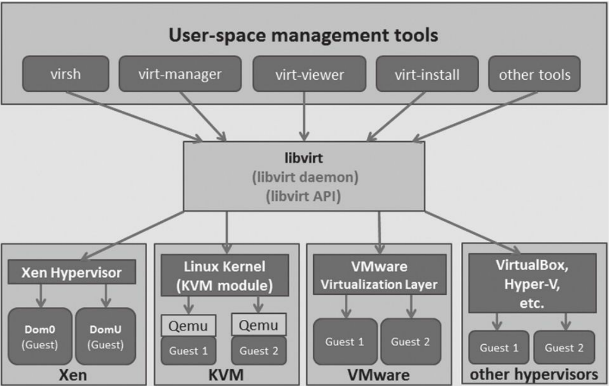

# KVM管理工具


## 1.libvirt

libvirt是目前使用最为广泛的对KVM虚拟机进行管理的工具和应用程序接口，而且一些常用的虚拟机管理工具（如virsh、virt-install、virt-manager等）和云计算框架平台（如OpenStack、ZStack、OpenNebula、Eucalyptus等）都在底层使用libvirt的应用程序接口。

虚拟机管理工具通过libvirt管理各种类型的虚拟机




### 1.1 libvirt的安装与配置

#### 1.1.1 libvirt安装

查看某系统中已经安装的libvirt相关的RPM包，命令行如下：

```shell
[root@192 ~]# rpm -qa | grep libvirt
[root@192 ~]# rpm -qa | grep '^qemu'
qemu-kvm-tools-1.5.3-173.el7_8.3.x86_64
qemu-kvm-common-1.5.3-173.el7_8.3.x86_64
qemu-img-1.5.3-173.el7_8.3.x86_64
qemu-kvm-1.5.3-173.el7_8.3.x86_64
qemu-guest-agent-2.12.0-3.el7.x86_64
```


由于libvirt是跨平台的，而且还支持微软公司的Hyper-V虚拟化，所以在Windows上也可以安装libvirt，甚至可以编译libvirt。可以到libvirt官方的网页
（https://libvirt.org/windows.html）中查看更多关于libvirt对Windows的支持

#### 1.1.2 libvirt的配置文件
libvirt相关的配置文件都在/etc/libvirt/目录之中，如下：

```shell
[root@192 ~]# ll /etc/libvirt
总用量 88
drwxr-xr-x 2 root root     6 11月 20 2015 cim
-rw-r--r-- 1 root root   450 5月  13 00:30 libvirt-admin.conf
-rw-r--r-- 1 root root   547 5月  13 00:30 libvirt.conf
-rw-r--r-- 1 root root 16529 5月  13 00:30 libvirtd.conf
-rw-r--r-- 1 root root  1175 5月  13 00:30 lxc.conf
drwx------ 2 root root  4096 8月  25 15:41 nwfilter
drwx------ 3 root root    22 8月  25 15:40 qemu
-rw-r--r-- 1 root root 30306 5月  13 00:30 qemu.conf
-rw-r--r-- 1 root root  2169 5月  13 00:30 qemu-lockd.conf
-rw-r--r-- 1 root root  2465 5月  13 00:30 qemu-sanlock.conf
drwx------ 2 root root     6 8月  25 15:41 secrets
drwxr-xr-x 3 root root    42 8月  26 21:35 storage
-rw-r--r-- 1 root root  3202 5月  13 00:30 virtlockd.conf
-rw-r--r-- 1 root root  3247 5月  13 00:30 virtlogd.conf
-rw-r--r-- 1 root root  1883 5月  13 00:30 virt-login-shell.conf
```

省略........


## 2.virsh

### 2.1 virsh简介

4.2.1　virsh简介
libvirt项目的源代码中就包含了virsh这个虚拟化管理工具的代码。virsh 是用于管理虚拟化环境中的客户机和Hypervisor的命令行工具，与virt-manager等工具类似，它也是通过调用libvirt API来实现虚拟化的管理的。virsh是完全在命令行文本模式下运行的用户态工具，它是系统管理员通过脚本程序实现虚拟化自动部署和管理的理想工具之一。

virsh的常用操作可以参考：

<https://www.cnblogs.com/clsn/p/8366251.html#auto-id-9>


## 3.virt-manager

virt-manager是用于管理虚拟机的图形化的桌面用户接口，
目前仅支持在Linux或其他类UNIX系统中运行。和libvirt、oVirt等类似，virt-manager是由Redhat公司发起的项目，在RHEL 7.x、Fedora、CentOS等Linux发行版中有较广泛的使用，当然在Ubuntu、Debian、OpenSuse等系统中也可以正常使用virt-manager。为了实现快速开发而不太多地降低程序运行性能的需求，virt-manager项目选择使用Python语言开发其应用程序部分，使用GNU AutoTools（包括autoconf、automake等工具）进行项目的构建。virt-manager是一个完全开源的软件，使用Linux界广泛采用的GNU GPL许可证发布。virt-manager依赖的一些程序库主要包括Python（用于应用程序逻辑部分的实现）、GTK+PyGTK（用于UI界面）和libvirt（用于底层的API）。


如果想从源代码编译和安装virt-manager，可以
到其官方网站（http://virt-manager.org/download.html）下载最新发布的virt-manager源代
码。或者使用Git工具克隆其开发中的代码仓库：`git://git.fedorahosted.org/git/virt-
manager.git`。


virt-manager工具在图形界面中实现了一些易用且丰富的虚拟化管理功能。已经为用户提供的功能如下：

```
1）对虚拟机（即客户机）生命周期的管理，如创建、修改、启动、暂停、恢复和停止虚拟机，还包括虚拟快照、动态迁移等功能。

2）对运行中客户机实时性能、资源利用率等监控，统计结果的图形化展示。

3）对创建客户机的图形化的引导，对客户机的资源分配和虚拟硬件的配置和调整等功能也提供了图形化的支持。

4）内置了一个VNC和SPICE客户端，可以用于连接到客户机的图形界面进行交互。

5）支持本地或远程管理KVM、Xen、QEMU、LXC、ESX等Hypervisor上的客户机。
```

在没有成熟的图形化的管理工具之时，由于需要记忆大量的命令行参数，
QEMU/KVM的使用和学习曲线比较陡峭，常常让部分习惯于GUI界面的初学者望而却步。不过现在情况有所改观，已经出现了一些开源的、免费的、易用的图形化管理工具，可以用于KVM虚拟化管理。virt-manager作为KVM虚拟化管理工具中最易用的工具之一，其最新的版本已经提供了比较成熟的功能、易用的界面和不错的性能。对于习惯于图形界面或不需要了解KVM原理和qemu-kvm命令细节的部分读者来说，通过virt-manager工具来使用KVM是一个不错的选择。

实现远程管理。在图形界面的终端中用命令行启动virt-manager并远程连接到某
个Hypervisor，命令行示例如下：

```shell
virt-manager -c qemu+ssh://192.168.158.31/system
```

另外，还可以在本地图形界面终端上通过“ssh-X remoge-host”命令连接到远程主机，
并开启ssh中的X11转发，然后可以在本机终端上直接运行“virt-manager”命令，来使用远
程主机上的virt-manager工具。这种使用方式的命令行操作如下：

```
[root@kvm-host ~]# ssh -X 192.168.158.31
root@192.168.158.31's password:
Last login: Sun Dec 25 10:39:47 2016 from 192.168.185.145
[root@remote-host ~]# virt-manager
```


virt-manager的官方网站：http://virt-manager.org/

### 3.1 打开virt-manager

```shell
virt-manager
```

### 3.2 使用virt-manager来动态迁移

需要满足如下前提条件才能使动态迁移成功实施。

```
1）源宿主机和目的宿主机使用共享存储，如NFS、iSCSI、基于光纤通道的LUN、
GFS2等，而且它们挂载共享存储到本地的挂载路径需要完全一致，被迁移的客户机就是使用该共享存储上的镜像文件。

2）硬件平台和libvirt软件的版本要尽可能的一致，如果软硬件平台差异较大，可能会增加动态迁移失败的概率。

3）源宿主机和目的宿主机的网络通畅并且打开了对应的端口。

4）源宿主机和目的宿主机必须有相同的网络配置，否则可能出现动态迁移之后客户机的网络不能正常工作的情况。

5）如果客户机使用了和源宿主机建立桥接的方式获得网络，那么只能在同一个局域网（LAN）中进行迁移，否则客户机在迁移后，其网络将无法正常工作。
```

参考以下文档，进行热迁移（动态迁移）

<https://www.cnblogs.com/clsn/p/8366251.html#auto-id-22>

然后就是一顿图形界面的操作，这里省略不做演示了...


## 4.virt-viewer、virt-install、virt-top和libguestfs

### 4.1 virt-viewer

virt-viewer是“Virtual Machine Viewer”（虚拟机查看器）工具的软件包和命令行工具名称，它是一个显示虚拟化客户机的图形界面的工具。virt-viewer使用GTK-VNC或SPICE-GTK作为它的显示能力，使用libvirt API去查询客户机的VNC或SPICE服务器端的信息。virt-viewer经常用于替换传统的VNC客户端查看器，因为后者通常不支持x509认证授权的SSL/TLS加密，而virt-viewer是支持的。

简单来说就是 替代VNC的一个更好的方案。

在Centos7系统中查看virt-viewer的RPM包信息，命令行如下：

```shell
[root@kvm-host ~]# rpm -q virt-viewer
virt-viewer-2.0-11.el7.x86_64
```


virt-viewer的使用语法如下：

```
virt-viewer [OPTION...] -- DOMAIN-NAME|ID|UUID
```


virt-viewer连接到的客户机可以通过客户机的名称、域ID、UUID等表示来唯一指定。

virt-viewer还支持“-c URI”或“--connection URI”参数来指定连接到远程宿主机上的一个客户机，当然远程连接时一些必要的认证还是必需的。关于virt-viewer工具更多详细的参数和解释，可以通过“man virt-viewer”命令查看使用手册


### 4.2 virt-install

virt-install是“Virt Install”工具的命令名称和软件包名称（在RHEL 6.x系统中，包名是python-virtinst）。virt-install命令行工具为虚拟客户机的安装提供了一个便捷易用的方式，它也是用libvirt API来创建KVM、Xen、LXC等各种类型的客户机，同时，它也为virt-manager的图形界面创建客户机提供了安装系统的API。

**virt-install中使用到的安装介质（如光盘、ISO文件）可以存放在本地系统上，也可以存放在远程的NFS、HTTP、FTP服务器上。virt-install支持本地的客户机系统，也可以通过“--connect URI”（或“-c URI”）参数来支持在远程宿主机中安装客户机。使用virt-install中的一些选项（--initrd-inject、--extra-args等）和Kickstart 文件，可以实现无人值守的自动化安装客户机系统。**


在Centos7中，virt-install工具存在于“virt-install”RPM包中，查询的命令行如下：

```shell
[root@192 ~]# rpm -q virt-install
virt-install-1.5.0-7.el7.noarch
```

使用virt-install命令启动一个客户机的安装过程，其命令行操作如下：

先在/data/下放置CentOS-7-x86_64-Minimal-1810.iso镜像文件。

------

```shell
[root@kvm-host ~]# virt-install \
--virt-type kvm \
--os-type=linux --os-variant rhel7 \
--name centos7 --memory 1024 --vcpus 1 \
--disk /data/centos7.raw,format=raw,size=10 \
--cdrom /data/CentOS-7-x86_64-Minimal-1810.iso \
--network network=default --graphics vnc,listen=0.0.0.0,port=5900

Starting install...
Creating domain...                       |    0 B  00:00:00
```

上面virt-install的命令行参数中.解释如下

```
“--connect”用于连接到本地或远程的Hypervisor（无该参数时，默认连接本地Hypervisor）；

“--memory”用于配置客户机的内存大小（单位是MB）；

“--disk”用于配置客户机的磁盘镜像文件，其中path属性表示路径，size属性表示磁盘大小（默认单位为GB）；

“--cdrom”用于指定用于安装的ISO光盘镜像文件；

“--os-variant rhel7”表示客户机是RHEL 7类型的系统（virt-install会根据这个值自动优化一些安装配置）；

“--graphics vnc”表示使用VNC图形接口连接到客户机的控制台。

“--noautoconsole” 表示不要自动尝试连接到客户端控制台
```

关于virt-install工具的更多更详细参数配置，可以通过“man virt-install”命令查看相应的帮助文档。

上面的示例中使用VNC接口连接到客户机，会默认用virt-viewer自动打开客户机的控制台。

**在kvm上部署EXSI**

```shell
# virt-install \
--name esxi65 \
--ram 32768 \
--disk path=/var/kvm/images/esxi65.img,size=200,bus=sata \
--cpu host-passthrough \
--vcpus=16 \
--os-type linux \
--os-variant=virtio26 \
--network bridge=br1,model=e1000 \
--graphics vnc,listen=0.0.0.0,password=password \
--video qxl \
--cdrom /tmp/VMware-VMvisor-Installer-201701001-4887370.x86_64.iso \
--features kvm_hidden=on \
--machine q35
```


### 4.3 virt-top
virt-top是一个用于展示虚拟化客户机运行状态和资源使用率的工具，它与Linux系统上常用的“top”工具类似，而且它的许多快捷键和命令行参数的设置都与“top”工具相同。

virt-top也是使用libvirt API来获取客户机的运行状态和资源使用情况的，所以只要是libvirt支持的Hypervisor，就可以用virt-top监控该Hypervisor上的客户机状态。

在Centos7系统上，virt-top命令就是在名为virt-top的RPM包中用命令行查看：

```shell
[root@192 ~]# rpm -q virt-top
virt-top-1.0.8-24.el7.x86_64
```

直接运行“virt-top”命令后，将会显示出当前宿主机上各个客户机的运行情况，其中包括宿主机的CPU、内存的总数，也包括各个客户机的运行状态、CPU、内存的使用率。

```shell
[root@192 ~]# virt-top
```


### 4.4 libguestfs

libguestfs是用于访问和修改虚拟机的磁盘镜像的一组工具集合。**libguestfs提供了访问和编辑客户机中的文件、脚本化修改客户机中的信息、监控磁盘使用和空闲的统计信息、P2V、V2V、创建客户机、克隆客户机、备份磁盘内容、格式化磁盘、调整磁盘大小等非常丰富的功能。libguestfs支持大部分的主流客户机操作系统，如：CentOS、Fedora、Ubuntu、Windows等操作系统；libguestfs除了支持KVM虚拟机，它甚至支持VMware、Hyper-V等非开源的虚拟机。**同时，libguestfs还提供了一套C库以方便被链接到自己用C/C++开发的管理程序之中。它还有对其他很多流程编程语言（如：Python）的绑定，让开发者可以方便地使用libgeustfs提供的功能构建自己的虚拟机磁盘镜像管理程序。

在Centos7系统上，查看libguestfs的常用工具在一个名为libguestfs-tools的RPM包中，可以使用如下命令查看：

```shell
[root@bogon ~]# yum -y install libguestfs-tools libguestfs-tools-c

[root@bogon ~]# rpm -q libguestfs-tools libguestfs-tools-c
libguestfs-tools-1.40.2-9.el7_8.1.noarch
libguestfs-tools-c-1.40.2-9.el7_8.1.x86_64
```

libguestfs-tools提供了很多工具，可以分别对应不同的功能和使用场景，如：

```
virt-ls				//用于列出虚拟机中的文件，
virt-copy-in		//用于往虚拟机中复制文件或目录，
virt-copy-out		//用于从虚拟机往外复制文件或目录，
virt-resize			//用于调整磁盘大小，
virt-cat			//用于显示虚拟机中的一个文件的内容，
virt-edit			//用于编辑虚拟机中的文件，
virt-df				//用于查看虚拟机中文件系统空间使用情况，等等。
```

下面演示virt-df、virt-copy-out命令来操作一个Linux客户机

```shell
[root@bogon ~]# virsh list
 Id    名称                         状态
----------------------------------------------------
 3     centos7                        running

[root@bogon ~]# virt-df -d centos7
文件系统                         1K-blocks 已用空间 可用空间 使用百分比%
centos7:/dev/sda1                      1038336     102432     935904   10%
centos7:/dev/centos/root               8374272     993164    7381108   12%


[root@bogon ~]# virt-copy-out -d centos7 /tmp/hujianli.txt /tmp

```

libguestfs的一些工具用于Windows客户机镜像的操作时，需要先安装libguestfs-
winsupport这个软件包；当使用guestmount来挂载Windows镜像时，还需要安装ntfs-3g软件包（可以到EPEL中找RPM，也可以自行编译安装）

libguestfs的官方网站：http://libguestfs.org/。


## 5.云计算管理平台

在计算设备（包括PC、智能手机、平板电脑等）、互联网技术、智能家电设备等非
常普及的今天，从技术热点上看，云计算无疑是其中最热门的概念之一。公共云计算服务的主要优势是，向用户提供按需付费的弹性的计算能力，以及简化软硬件计算环境的搭建，让用户更专注于自身的计算任务或应用程序的开发。而私有云计算服务的主要优势是，让一个公司或组织的计算资源得到充分整合，从而实现按需分配计算资源，提升现有硬件资源的利用率，而且更加方便管理，降低资源管理成本。

云计算的强烈需求，一方面推动了包括VMware、KVM、Xen等虚拟化技术的迅速发展，另一方面也促进了云计算管理平台的产生和发展。在众多的开源云计算平台中，`OpenStack、CloudStack、CloudFoundry、OpenNebula、Eucalyptus`等无疑是其中的佼佼者，在国内，ZStack也是这两年发展起来的云管理平台。简单介绍其中的OpenStack和ZStack云计算平台。

### 5.1 Openstack

（1） OpenStack的官方参考文档：http://docs.openstack.org/

（2） Openstack的安装和配置的入门文档：http://www.openstack.org/software/start/

### 5.2 ZStack简介

ZStack 是2015年在国内创立的一个开源IaaS项目，其核心系统使用Java语言开发。ZStack创始人认为，OpenStack等IaaS管理软件都过于复杂，导致其部署、维护、二次开发的成本都比较高，所以ZStack的首要目标是部署简单和稳定性强。ZStack的主要特点是：容易部署和升级、可扩展性（可以管理成千上万个物理节点和支持高并发的API访问）、快速（启动虚拟机速度非常快）、默认网络就是NFV（Network Functions Virtualization）、全API的管理功能（当然也提供一个Web UI管理界面）、插件系统（添加或删除某个特性不会影响核心功能）等。

ZStack在GitHub上的地址是：<https://github.com/zstackorg/zstack> 

[[1\]](http://reader.epubee.com/books/mobile/fe/fe4d89f8fa873db44d15079bb4dec072/text00065.html#ch1) ZStack官方网站：http://zstack.org/

## 6.本章小结
经过这几年的发展，KVM虚拟化方案的功能完善、性能良好、架构清晰而简单。不
过由于其用户空间的qemu命令行工具的参数有一定的复杂度，提高了初学者和系统管理员学习和部署KVM的难度。然而，本章中介绍的一些比较流行的虚拟化管理工具，可以让用户更加方便地使用KVM，也可使上层应用程序更方便地调用KVM的功能。

### 6.1 KVM常用工具总结

在这些工具中

有libvirt API为其他虚拟化管理工具提供一套通用的API来管理包括QEMU/KVM在内的多种Hypervisor，有基于libvirt API的virsh这个命令行管理工具

1. virt-manager	//这个图形化的虚拟机管理器
2. virt-install	     //用于安装客户机
3. virt-viewer       //查看客户机控制台
4. virt-top            //查看资源占用率的工具
5. libguestfs        //用于管理客户机磁盘镜像的工具。


### 6.2 私有云相关的平台

OpenStack类似的开源云计算平台——CloudStack、Eucalyptus、OpenNebula、
CloudFoundry等。


