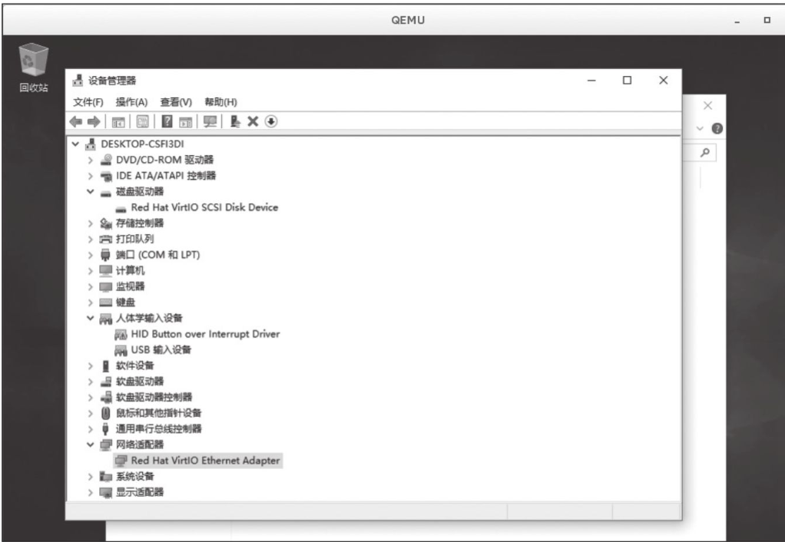

# KVM设备高级管理

## 1.半虚拟化驱动

### 1.1 virtio概述
客户机可以使用的设备大致分为三类：
QEMU纯软件模拟、使用virtio API半虚拟化的设备和直接分配设备。QEMU纯软件模拟的优点是对硬件的平台依赖性低，兼容性高，但是性能比较差。使用virtio API半虚拟化的设备比普通的I/O模拟效率高，但是需要相关virtio驱动程序的支持。直接分配设备允许将物理机上的设备直接给虚拟机用，缺点是：主板空间有限，硬件的添加会加大成本。


### 1.2 virtio的基本原理和优缺点

virtio半虚拟化驱动的方式，可以获得很好的I/O性能，其性能几乎可以达到与native（即非虚拟化环境中的原生系统）差不多的I/O性能。所以，在使用KVM之时，如果宿主机内核和客户机都支持virtio，一般推荐使用virtio，以达到更好的性能。当然，virtio也是有缺点的，它要求客户机必须安装特定的virtio驱动使其知道是运行在虚拟化环境中，并且按照virtio的规定格式进行数据传输。客户机中可能有一些老的Linux系统不支持virtio，还有一些主流的Windows系统需要安装特定的驱动才支持virtio。不过，较新的一些Linux发行版（如RHEL 6.3、Fedora 17以后等）默认都将virtio相关驱动编译为模块，可直接作为客户机使用，然而主流Windows系统中都有对应的virtio驱动程序可供下载使用。


### 1.3 Linux下virtio的支持

  virtio是一个比较成熟的技术，目前，**在Linux的2.6.24及以上的内核版本中都支持virtio**。virtio分为前端驱动程序和后端处理程序，前端驱动程序运行在客户机中，后端处理程序在宿主机的QEMU中实现。因此，**在宿主机上，只需使用比较新的Linux内核，安装QEMU即可，不需要做特别的与virtio相关的编译配置**。而在客户机上，需要有特定的virtio驱动程序的支持，以便客户机处理I/O操作请求时调用virtio驱动程序而不是其原生的驱动程序。**因此，如果客户机是Linux系统，只需要使用较新的Linux内核即可**。如果客户机是Windows系统，因为Windows系统不是开源操作系统，微软也没有提供Windows下相应的virtio的驱动程序，所以需要在宿主机上安装使得Windows支持virtio的驱动程序。


### 1.4 Windows下的virtio驱动

##### 1.4.1 使用virt-install方式创建虚机和打驱动

（1）通过官方的RPM获得

以RHEL为例，它有一个名为virtio-win的RPM软件包（在RHEL发行版的Supplementary repository中），能为主流的Windows版本提供virtio相关的驱动。

------

```shell
[root@desktop-pmjtngi ~]# wget https://fedorapeople.org/groups/virt/virtio-win/virtio-win.repo -O /etc/yum.repos.d/virtio-win.repo 

[root@desktop-pmjtngi ~]# yum install virtio-win -y
```

------

安装完以后，在`/usr/share/virtio-win`目录下可以看到`virtio-win-xxx.iso`文件，其中包含了所需要的驱动程序。可以将virtio-win.iso文件通过网络共享到Windows客户机中使用，或者通过qemu命令行的“-cdrom”参数将virtio-win.iso文件作为客户机的光盘镜像。

------

```shell
[root@kvm-host ~]# ls -l /usr/share/virtio-win/
total 137548
drwxr-xr-x 4 root root        31 Dec 18 15:35 drivers
drwxr-xr-x 2 root root        52 Dec 18 15:35 guest-agent
-rw-r--r-- 1 root root   2949120 Sep 19 22:34 virtio-win-1.9.0_amd64.vfd
-rw-r--r-- 1 root root 134948864 Sep 19 23:26 virtio-win-1.9.0.iso
-rw-r--r-- 1 root root   2949120 Sep 19 22:34 virtio-win-1.9.0_x86.vfd
lrwxrwxrwx 1 root root        26 Dec 18 15:35 virtio-win_amd64.vfd -> virtio-win-1.9.0_amd64.vfd
lrwxrwxrwx 1 root root        20 Dec 18 15:35 virtio-win.iso -> virtio-win-1.9.0.iso
lrwxrwxrwx 1 root root        24 Dec 18 15:35 virtio-win_x86.vfd -> virtio-win-1.9.0_x86.vfd
```

------

virtio-win.1.9.0中的内容，Balloon目录是内存气球相关的virtio_balloon驱动，NetKVM目录是网络相关的virtio_net驱动，vioserial目录是控制台相关的驱动，viostor是磁盘块设备存储相关的virtio_blk驱动，vioscsi是SCSI磁盘设备存储。

以NetKVM目录为例，其中又包含了各个Windows版本各自的驱动，从古老的XP到最新的Windows 10、Windows 2016等都有。每个Windows版本的目录下又包含“amd64”和“x86”两个版本，分别对应Intel/AMD的x86-64架构和x86-32架构，即64位的Windows系统应该选择amd64中的驱动，而32位Windows则应选择x86中的驱动。

（2）通过开源的Fedora项目获得

添加<https://fedorapeople.org/groups/virt/virtio-win/virtio-win.repo> 到本地的软件仓库以后，也可以通过yum来装virtio-win这个软件包。

（3）如何在Windows中如何安装virtio驱动

Windows OS本身是没有安装virtio驱动的，所以直接分配给Windows客户机以半虚拟化设备的话，是无法识别加载驱动的，需要我们事先安装好。

首先，下载硬盘Virtio驱动，下载地址为：

``` shell
http://www.linux-kvm.org/page/WindowsGuest Drivers/Download_Drivers

https://fedorapeople.org/groups/virt/virtio-win/direct-downloads/archive-virtio/
```

下面以Windows 10为例，来介绍如何在Windows客户机中安装半虚拟化硬盘、网卡的驱动。

安装一个全新的客户机的时候，它的硬盘里还没有操作系统，更别说驱动了。所以，一开始就分配给它半虚拟硬盘，安装过程会无法识别，也就无法安装客户机了。那么，怎么解决这个问题呢？我们可以在安装客户机时，除了加载安装光盘以外，还加载virtio-win.iso。


安装win10示例

```shell
1.1 新建磁盘镜像 
qemu-img create -f qcow2 /vm/win10.qcow2 80G

1.2 准备驱动光盘（/vm/virtio-win-0.1.173.iso）以及系统iso安装文件（/vm/iso/cn_windows_10_business_editions_version_1909_updated_jan_2020_x64_dvd_b3e1f3a6.iso）

1.3 安装系统 
virt-install --virt-type kvm \
--name win10 --ram 1024 \
--os-type=windows --os-variant=win10 \
--disk path=/vm/win10.qcow2,bus=virtio,format=qcow2,cache=writeback \
--cdrom=/vm/virtio-win-0.1.173.iso \
--disk path=/vm/iso/cn_windows_10_business_editions_version_1903_x64_dvd_e001dd2c.iso,device=cdrom \
--graphics vnc,listen=0.0.0.0 --noautoconsole
```

此时客户机的Windows安装程序没有发现存在硬盘，如图


选择“加载驱动程序”选项，从启动客户机时给它的virtio-win的光驱中安装virtio-blk（viostor文件夹→win10→amd64）磁盘驱动程序，


安装完以后，客户机的Windows 10安装程序就可以识别半虚拟硬盘了。


安装完virtio-win.iso中的半虚拟化网卡驱动（NetKVM目录中）后，网卡被识别并可以使用。

对于已安装好Windows操作系统的客户机，我们可以将virtio-win.iso作为客户机的光驱分配给客户机，然后在客户机中安装或升级驱动。对于virtio磁盘驱动的安装，也可以以QEMU完全模拟硬盘的方式（前面章节中-hda参数），先安装好客户机。然后，另外分配给它一块半虚拟化硬盘，再在客户机中安装virtio-win.iso中的驱动程序即可。


设备管理器中识别半虚拟化网卡



在64位的Windows系统中，从Windows Vista开始，所安装的驱动就要求有数字签名。如果使用的发行版并没有提供Windows virtio驱动的二进制文件，或者没有对应的数字签名，则可以选择从Fedora项目中下载二进制ISO文件，它们都进行了数字签名，并且通过了在Windows系统上的测试。


#####  1.4.2 使用virt-manage方式在kvm中打Windows的virTio驱动

```
解决办法：安装VirtIO驱动
1.通过virt-manager打开windows虚拟机
2.磁盘、网卡使用默认驱动，即磁盘使用ide、网卡使用rt
3.添加一块CD/DVD设备，选择virtio镜像包的位置
4.添加一块临时硬盘，设置为virtio模式，大小可以随意，设置为1G即可
5.启动虚拟机，为新磁盘、网卡更新virtio驱动
6.关机，删除零时磁盘，同时将原硬盘设置为virtio模式
7.开机后，磁盘与网卡均为virtio模式。
```


**virtio-win驱动下载地址：**

<https://fedorapeople.org/groups/virt/virtio-win/direct-downloads/archive-virtio/>


**参考文献：**

<https://www.centos.bz/2017/08/kvm-virtio-windows-server-virtual-host/>


### 1.5 使用virtio_balloon(气球内存)

ballooning在节约和灵活分配内存方面有明显的优势，其好处有如下3点。


