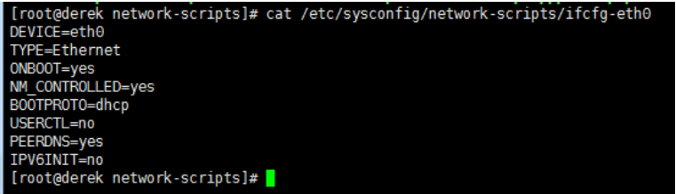

# vmware克隆后操作
右键-->>管理-->>克隆


创建后的症状：启动之后使用ifconfig，发现无IP地址，只有回环地址为127.0.0.1。因此考虑是否因为MAC/IP地址及主机名都与克隆前的源主机相同。

克隆的系统上网步骤

（1）先setup设置网卡

```
/etc/init.d/network restart
ifup eth0
```

（2）编辑网卡对应的eth0的配置文件：vi/etc/sysconfig/network-scripts/ifcfg-eth0，删除配置文件中HWADDR地址及UUID所在的行

    cat /etc/sysconfig/network-scripts/ifcfg-eth0

 删除HWADDR和UUID这两行


（3）删除70

    > /etc/udev/rules.d/70-persistent-net.rules
    重启后就可以上网了
原因猜测：这是VM克隆为了防止源机器和克隆机器启动网络配置地址冲突而做的保护策略。