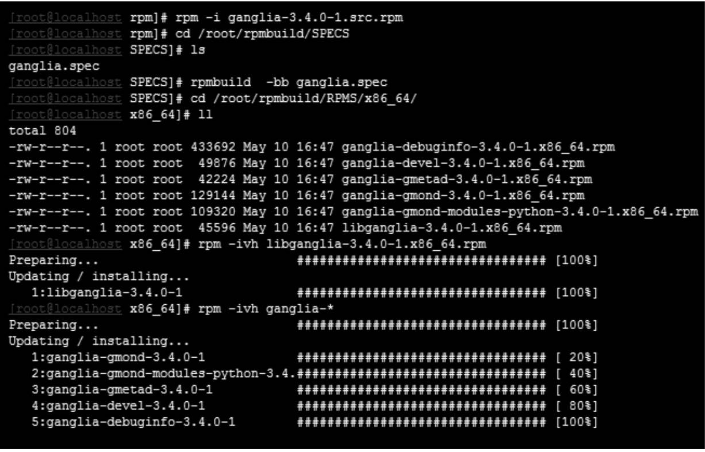

# Linux下软件的安装与管理

## 源码安装方式

### 1.下载、解压源码

```
Linux下软件的源码一般都是C或者C++语言编写的，并且都会在软件的官方网站上提供源码包下载，例如Apache开源项目的官方网站为http://httpd.apache.org。此外，在网上的很多开源社区一般也提供一些常用软件的源码下载，源码都打包成压缩文件。常见的源码打包压缩格式有“.tar.gz”、“.tar.baz2”等。我们可以从网站上首先下载源码文件，然后再传到所在的Linux系统下，如果你的Linux系统处于联网状态下，也可以直接在系统内通过wget之类的下载命令将源码包直接下载到Linux系统下。

下载完成，把相应的软件解包即可。针对下载软件包的不同，使用不同的方法进行解压，解压完毕后进入解压生成的目录中。在这个目录下，一般都存在一个REDAME文件。这个文本文件非常重要，它详细介绍了这个软件所能完成的功能、授权许可、安装需求、安装注意事项、安装方式等。由于 Linux 各个版本的差异，以及安装环境的不同，软件的安装方式也不尽相同，因此在安装软件前，一定要事先阅读这个README文件，确保安装的正确性。
```

### 2.分析安装平台环境

```
在软件包解压完毕之后，源码目录中，一般都会存在configure和README这两个文件。README就是上面讲到的，是对软件的介绍和安装说明。Linux下软件的安装受到操作系统安装环境的影响，比如某些软件在安装或者运行过程中需要调用操作系统本身的库文件，或者需要运行系统的某个工具等，但是若系统中不存在这个库文件或者这个工具没有安装，安装或者运行软件就会失败。

为了避免这个问题的出现，在安装软件的时候就需要分析操作系统环境，检测当前系统是否拥有安装软件所需的所有文件和工具，如果系统缺少某个文件，就给出提示，直到满足软件的所有需求为止。这个就是configure文件的功能，configure文件一般是个可执行文件，可以在当前目录下直接输入“./configure”进行软件安装的环境测试，如果提示缺少某些安装包，就需要进行安装，直到测试通过。通常，源码安装都需要GCC或者CC编译器，这些编译器一般在安装系统时定制安装包中的开发工具选项下，其实这也是在第2章安装Linux系统时要求选择开发工具包的原因所在。

此外，在执行 configure 分析软件需求时，还可以在“./configure”后面加上软件的安装路径以及安装所需的模块等选项，来定制用户需要的软件功能。
```

### 3.编译、安装软件

```
make与make install

在了解 Makefile 文件结构后，我们就可以控制编译的选项，定制自己所需的软件功能。接下来，我们只须在命令行输入make命令，即可进入编译阶段，根据软件源程序的大小和系统的硬件配置，编译时间不定，编译完毕，会在当前目录以及子目录下生成相应的可执行文件。之后，就进入最后的安装软件阶段，在命令行输入make install命令，开始安装软件。安装进程会首先创建安装目录，如果没有指定安装的目录，安装程序默认会在系统的/usr/local目录下创建安装目录，然后将相应的文件和可执行程序从源码目录复制到安装目录下，这样安装就完毕了。
```

### 4.通过源码安装Apache Http server

1.下载、解压Apache源码

```
   [root@WEBServer～]#mkdir /apache    #在根目录下创建一个apache目录
    [root@WEBServer～]#cd /apache       #切换到apache目录
    [root@WEBServer apache]#wget \      #下载apache源码
    >http://mirrors.cnnic.cn/apache//httpd/httpd-2.4.12.tar.bz2
    [root@WEBServer apache]#tar -jxvf httpd-2.4.12.tar.bz2 #解压apache源码
    [root@WEBServer apache]#ls           #显示解压结果
    httpd-2.4.12            httpd-2.4.12.tar.bz2
```

2.设置安装环境

```
    [root@WEBServer apache]#cd httpd-2.4.12 #切换到httpd-2.4.12目录下
    [root@WEBServer httpd-2.4.12]#./configure  --prefix=/opt/httpd-2.4.12 \
    >--enable-so  \
    >--enable-mods-shared=most  \
    >--enable-proxy-balancer=shared  \
    >--enable-proxy-http=shared  \
    >--enable-proxy-ajp  \
    >--enable-rewrite
```

3.编译、安装软件

```
可以通过以下命令编译、安装软件。
    [root@WEBServer  httpd-2.4.12]#make
    [root@WEBServer  httpd-2.4.12]#make  install
```

##  RPM包方式安装

RPM是Red Hat Package Manager的缩写，本意就是Red Hat软件包管理器，是最先由Red Hat公司开发出来的Linux下软件包管理工具。

RPM包管理类似于Windows下的“添加/删除程序”，但是功能比“添加/删除程序”强大很多。在 Linux 的系统安装光盘中，有很多以“.rpm”结尾的软件包，这些包文件就是我们所说的RPM文件。每个RPM文件中包含了已经编译好的二进制可执行文件，其实就是将软件源码文件进行编译、安装，然后进行封装，就成了RPM文件，类似于Windows安装包中的“.exe”文件。此外，RPM文件中还包含了运行可执行文件所需的其他文件，这点也和Windows下的软件包类似，Windows程序的安装包中，除了“exe”可执行文件之外，还有其他依赖运行的文件。

### 1.RPM包的种类和组成

下面讲述两种RPM包对应的文件名含义，以rpm文件：nxserver-2.1.0- 22.i386.rpm为例，其中：

```
“nxserver”表示软件的名称；

“2.1.0”表示软件的版本号；

“22”表示软件更新发行的次数；

“i386”表示适合硬件的平台；

“.rpm”是RPM软件包的标识。
```

一般RPM封装包的命名方式都由这5个部分组成。由于SRPM包是需要编译才能使用的，因此没有上面所显示项中对应的平台选项，其他与RPM包命令格式完全一样。

### 2. RPM工具的使用

RPM工具的使用分为安装、查询、验证、更新、删除等操作。

### 1.安装软件包

```
rpm -ivh ipvsadm-1.27-7.el7.x86_64.rpm
```

2.安装xxxxxx.src.rpm的方法。

这里以my-package.src.rpm名称为例，在CentOS 7.1的 x86_64系统平台下介绍src.rpm软件包基本安装方法，步骤如下。

```
① 执行rpm -i my-package.src.rpm命令。
② 执行以下命令切换目录。
cd /root/rpmbuild/SPECS
在CentOS 5.x以及之前版本中的路径是/usr/src/redhat/SPECS，从CentOS 6.x以及之后版本路径变为/root/rpmbuild/SPECS。

③ 通过以下命令执行rpmbuild操作。
rpmbuild-bb  my-package.specs
my-package.specs是一个和软件包同名的specs文件。

此时，在/root/rpmbuild/RPMS/x86_64这个目录下，有一个或者多个已经生成的rpm包，这个就是已经编译好的可执行rpm文件。
```

④ 执行安装命令。


    rpm  -ivh  new-package.rpm

src.rpm包安装方法



### 2.查询软件包

```
rpm -q [辅助选项] package1…packageN
```

主选项含义如下。

-q：query的意思，也可以使用“--query”。

参数说明：package1…packageN为已经安装的软件包名称。

辅助选项含义如下。

-f：查询操作系统中某个文件属于哪个对应的rpm软件包。

例如：

```
[root@localhost ～]# rpm -qf /bin/bash
bash-4.2.46-12.el7.x86_64
```

-p：查询以“.rpm”为后缀的软件包安装后对应的包名称。

例如：

```
[root@server ～]#rpm -qp gcc-4.8.3-9.el7.x86_64.rpm
gcc-4.8.3-9.el7.x86_64
```

例如：在得到一个软件，安装之前一般都需要查看软件包中有什么内容，可以使用以下命令。

```
   [root@server ～]# rpm -qi gcc-4.8.3-9.el7.x86_64
或者使用
    [root@server ～]# rpm -qpi gcc-4.8.3-9.el7.x86_64.rpm
输出如下。
    Name              :  gcc
    Version         :  4.8.3
    Release         :  9.el7
    Architecture : x86_64
    Install  Date  :  Sat  09  May  2015  10:40:59  PM  CST
    Group        : Development/Languages
    Size              :  39010208
```

### 3.验证软件包

（1）验证已经安装的软件包。

校验软件包比较的是某软件包安装的文件和原始软件包中同一文件的信息是否一致。它校验每个文件的大小、权限、MD5 值、类型、所有者以及组群。

命令格式：

```
rpm -V [辅助选项] package1…packageN
主选项含义如下。

-V：verify 的意思，也可以用“--verify”代替。此参数主要校验已经安装的软件包内的文件和最初安装时是否一致。

参数说明：package1…packageN 表示需要校验的且已经安装的软件包名。

辅助选项含义如下。

-p：验证软件包文件。
```

### 4.更新软件包

命令格式：

```
rpm -U [辅助选项] file1.rpm……fileN.rpm
主选项含义如下。

-U：upgrade的意思，可以使用“--upgrade”代替。
参数说明：file1.rpm…fileN.rpm表示需要升级的rpm文件包。

辅助选项含义如下。
--oldpackage 表示允许“升级”到一个老版本，即软件版本降级。其他选项与安装RPM软件包的辅助参数完全相同，这里不再讲述。
```

例子：要将rsh从rsh-0.17-65升级到rsh-0.17-76，步骤如下。

```
[root@localhost ～]# rpm  -q rsh
rsh-0.17-65.el7.x86_64

[root@localhost ～]# rpm  -Uvh rsh-0.17-76.el7.x86_64.rpm
Preparing...                        ################################# [100%]
Updating / installing...
1:rsh-0.17-76.el7                ################################# [100%]

[root@localhost ～]# rpm  -q rsh
rsh-0.17-76.el7.x86_64
```

### 5.删除软件包

命令格式：

```
rpm -e [辅助选项] package1…packageN
主选项含义如下。
-e：erase的意思，也可以用“--erase”代替。
参数说明：package1„„packageN表示已经安装的软件包名称。

辅助选项含义如下。
--test：只执行删除的测试。
--nodeps：不检查依赖性。
```

下面举例说明。

1）要删除rsh软件包，使用以下命令。

````
[root@localhost ～]# rpm  -q rsh
rsh-0.17-76.el7.x86_64
[root@localhost ～]# rpm  -e rsh
[root@localhost ～]# rpm  -q rsh
package  rsh  is  not  installed
````

2）要删除gcc软件包，但是存在依赖关系，操作过程如下。

```
[root@localhost ～]# rpm -e gcc
error:  Failed  dependencies:
gcc = 4.8.3-9.el7 is needed by (installed) gcc-c++-4.8.3-9.el7.x86_64
gcc = 4.8.2 is needed by (installed) libtool-2.4.2-20.el7.x86_64
```

这里又出现了删除依赖性了，根据上面的提示可知，要删除gcc软件包，必须删除与gcc相互依赖的5个软件包。这个操作要非常慎重，除非知道删除后对系统没有影响，否则一定不要盲目执行删除操作，因为这样可能导致系统的崩溃。

其实我们也可以加入“--nodeps”参数，忽略依赖关系，但是这样可能会导致相关依赖软件的不可用。

## yum安装方式


### 1. yum的安装与配置

以CentOS 7.x为例，要检查yum是否已经安装，执行如下命令。

```
[root@localhost ～]# rpm -qa|grep yum
```

如果没有任何显示，表示系统中还没有安装yum工具，yum安装包在CentOS系统光盘中可以找到，执行如下指令进行安装。

```
[root@localhost ～]# rpm -ivh yum-*.noarch.rpm
```

安装yum需要python-elementtree、python-sqlite、urlgrabber、yumconf等软件包的支持，这些软件包在CentOS Linux系统安装光盘均可找到，如果在安装yum过程中出现软件包之间的依赖性，只须按照依赖提示寻找相应软件包安装即可，直到yum包安装成功。


### 2.yum的配置

yum 工具安装完毕，接下来的工作是进行 yum 的配置。yum 的配置文件有主配置文件/etc/yum.conf、资源库配置目录/etc/yum.repos.d。yum安装后，默认的一些资源库配置可能无法使用，因此需要进行修改。下面是/etc/yum.repos.d/CentOS-Base.repo 资源库配置文件中各项的详细含义。

```
yum list                 # 所有软件列表
yum install 包名         # 安装包和依赖包
yum -y update            # 升级所有包版本,依赖关系，系统版本内核都升级
yum -y update 软件包名   # 升级指定的软件包
yum -y ss -tnl| grep 3306          # 不改变软件设置更新软件，系统版本升级，内核不改变
yum search mail          		   # yum搜索相关包
yum grouplist            			# 软件包组
yum -y groupinstall "Virtualization"   # 安装软件包组
rpm -ql gstreamer  		# 不安装软件查看包含文件
yum clean all            		# 清除var下缓存

yum repolist all  #列出所有仓库
yum list all     #列出仓库中所有软件包
yum info        #查看软件包信息
yum install     #安装软件包
yum reinstall   #重新安装软件包
yum update      #升级软件包
yum remove      #移除软件包
yum clean all   #清除所有仓库缓存
yum check-update  #检查可更新的软件包
yum grouplist    #查看系统中已经安装的软件包组
yum groupinstall #安装指定的软件包组
yum groupremove  #移除指定的软件包组
yum groupinfo    #查询指定的软件包组信息

yum makecache	#重新做缓存

yum install httpd  				#安装httpd软件包
yum search  					#YUM搜索软件包。
yum list httpd    				#显示指定程序包安装情况httpdo
yum list  		  				#显示所有已安装及可安装的软件包。
yum remove httpd  				#删除程序包httpdo
yum erase httpd   				#删除程序包httpdo
yum update  					#内核升级或者软件更新。
yum update httpd  				#更新httpd 软件。
yum check-update  				#检查可更新的程序。
yum info httpd    				#显示安装包信息httpdo
yum provides     						 #列出软件包提供哪些文件。
yum provides "*/rz"  					#列出rz 命令由哪个软件包提供。
yum grouplist     						#查询可以用groupinstall 安装的组名称。

yum groupinstall "Chinese Support"  	#安装中文支持。
yum groupremove "Chinese Support"    	#删除程序组Chinese Support0

yum deplist httpd 		 				#查看程序httpd依赖情况。

yum ckean packages						#清除缓存目录下的软件包
yum clean headers						#清除缓存目录下的headers
yum clean all 							#清除换出目录下的软件包及旧的headers

					
#下载对应版本 repo 文件, 放入 /etc/yum.repos.d/ (操作前请做好相应备份)
http://mirrors.163.com/.help/centos.html    #163的Centos 5~6~7 yum源下载地址
```

###  3.几个不错的yum源

EPEL包含一个叫做“epel-release”的包，这个包包含了EPEL源的gpg密钥和软件源信息。可以通过yum命令将这个软件包安装到企业级Linux发行版上。这样就可以使用最全面、最稳定的Linux软件包了。除了epel-release源之外，还有一个叫做“epel-testing”的源，这个源包含最新的测试软件包，其版本很新但是安装有风险，可以根据情况自行斟酌使用。

相关的EPEL可以从EPEL官方网站下载到，针对CentOS系统，有EL5、EL6、EL7三个版本，分别针对CentOS 5.x、CentOS 6.x、CentOS 7.x三个系列版本。读者可根据系统环境进行下载使用。

RPMForge是一个第三方软件源仓库，也是CentOS官方社区推荐的第三方yum源，它为CentOS系统提供了超过10000个软件包，被CentOS社区认为是最安全也是最稳定的一个软件仓库。但是由于这个安装源不是CentOS本身的组成部分，因此要使用RPMForge，需要手动下载并安装。

RPMForge的官方网站是http://repoforge.org/，可以在http://pkgs.repoforge. org/rpmforge-release/ 下载 RHEL/CentOS 各个版本的“rpmforge-release”包，这样就可以使用RPMForge提供的丰富软件了。


## 二进制软件安装方式

Linux 下二进制格式的软件是指事先已经在各种平台编译安装好相关软件，**然后压缩打包，在安装时只需解压或者执行安装可执行文件即可。**

**二进制软件包的优点是安装简单、容易，缺点是缺乏灵活性，相应的软件包只能在对应平台下安装，离开这个环境软件就无法运行。**

### 1.安装“*.tar.gz”、“*.bz2”二进制软件包

对于这种格式的软件包，安装其实就是简单的解压过程，根据不同的软件打包格式，用相应的解压命令解压即可。

对于*.tar.gz软件格式，解压命令如下。

```
tar -zxvf xxxxxx.tar.gz
```

对于*.bz2软件格式，解压命令如下。

```
tar -jxvf xxxxxx.tar.gz
```

关于这类软件的卸载，由于解压后只有单一的目录，可以直接删除对应软件目录即可，如果解压后文件分散在几个目录中，需要一一手动删除目录。

例如：我们常用的应用服务器容器Tomcat软件就是基于这种打包压缩格式发行的。我们只须下载后解压即可完成安装，如果需要卸载，直接删除对应的Tomcat目录即可。

### 2.提供安装程序的软件包

这种软件包都提供了安装脚本或者安装向导程序，`只须在下载此类软件包后解压，然后进入安装目录，找到类似于 setup、install、install.sh 之类的可执行文件运行即可`，接着根据提示（如安装路径、参数设置等）进行相应的设置，之后安装就自动完成。

这类软件的卸载也提供了相应的卸载脚本或者卸载向导，根据提示即可完成软件卸载。

