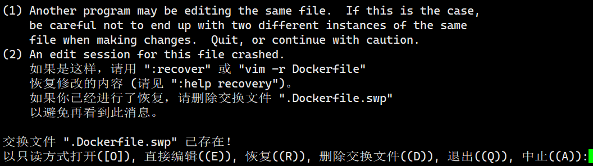

# bash_Vim快捷键


## 1.bash快捷键

| 快捷键 | 作用                           |
| ------ | ------------------------------ |
| ctrl+A | 把光标移动到命令行开头。       |
| ctrl+E | 把光标移动到命令行结尾。       |
| ctrl+C | 强制终止当前的命令。           |
| ctrl+L | 清屏，相当于clear命令。        |
| ctrl+U | 删除或剪切光标之前的命令。     |
| ctrl+K | 删除或剪切光标之后的内容。     |
| ctrl+Y | 粘贴ctrl+U或ctul+K剪切的内容。 |
| ctrl+R | 从历史命令中搜索。             |
| ctrl+D | 退出当前终端。                 |
| ctrl+Z | 暂停，并放入后台。             |
| Esc+.  | 输入上次使用过的文件或路径     |


## 2.Vim快捷键


### 2.1 翻页命令

| Ctrl+F | 下翻整页 |
| ------ | -------- |
| Ctrl+B | 上翻整页 |
| Ctrl+D | 下翻半页 |
| Ctrl+U | 上翻半页 |


### 2.2 插入命令

| 命令 | 作用                 |
| ---- | -------------------- |
| a    | 在光标所在字符后插入 |
| A    | 在光标所在行尾插入   |
| i    | 在光标所在字符前插入 |
| I    | 在光标所在行行首插入 |
| o    | 在光标下插入新行     |
| O    | 在光标上插入新行     |


### 2.3 定位跳转命令

| 命令      | 作用             |
| --------- | ---------------- |
| :set   nu | 设置行号         |
| :set nonu | 取消行号         |
| gg        | 到第一行         |
| G         | 到最后一行       |
| nG        | 到第n行          |
| :n        | 到第n行          |
| $         | 移至行尾         |
| ^         | 移至行首         |
| w         | 移动到下一个单词 |


### 2.4 删除命令

| 命令    | 作用                         |
| ------- | ---------------------------- |
| x       | 删除光标所在字符处           |
| nx      | 删除光标所在处后n个字符      |
| dd      | 删除光标所在行到文件末尾内容 |
| dG      | 删除光标所在行到文件末尾内容 |
| D       | 删除光标所在处到行尾内容     |
| :n1,n2d | 删除指定范围的行             |


### 2.5 复制和剪切命令

| 命令 | 作用                         |
| ---- | ---------------------------- |
| yy   | 复制当前行                   |
| nyy  | 复制当前行以下n行            |
| dd   | 剪切当前行                   |
| ndd  | 剪切当前行以下n行            |
| p、P | 粘贴在当前光标所在行下或行上 |


### 2.6 替换和撤销命令

| 命令   | 作用                                |
| ------ | ----------------------------------- |
| r      | 取代光标所在处字符                  |
| R      | 从光标所在处开始替换字符，按esc结束 |
| u      | 取消上一步操作                      |
| U      | 取消所有操作                        |
| Ctrl+R | 对撤销操作恢复                      |

### 2.7 搜索和搜索替换命令

| 命令               | 作用                                   |
| ------------------ | -------------------------------------- |
| /string            | 搜索指定字符串搜索时忽略大小写：set ic |
| n                  | 搜索指定字符串的下一个出现位置         |
| N                  | 搜索指定字符串的上一个出现位置         |
| :%s/old/new/g      | 全文替换指定字符串                     |
| :n1，n2s/old/new/g | 在一定范围内替换指定字符串             |
| :noh               | 取消查找高亮                           |

### 2.8 保存和退出命令

| 命令              | 作用                     |
| ----------------- | ------------------------ |
| :w                | 保存修改                 |
| :w   new_dilename | 另存为指定文件           |
| :wq               | 保存修改并退出           |
| ZZ                | 快捷键，保存修改并退出   |
| :q！              | 不保存修改退出           |
| :e!               | 撤销打开文件后编辑的内容 |


## 3. Vim常用技巧

###  3.1 vim文件冲突



- 说明异常退出，上次编辑文件后没保存文件就被关闭了。此时可以直接输出D，删除交换文件直接进入。或者直接删除.Dockerfile.swp文件。

### 3.2 在指令模式下执行命令

:！命令 ，如:！date将日期显示在vim底部，:！ls列出当前目录


### 3.3 光标下方导入命令执行结果:

- :r！date


### 3.4 可视块操作

#### 1. 批量添加注释

按 Ctrl + v 进入列选择模式，上下键选择修改的行，然后按 I，进入列插入状态，输入#，再按下 ESC，你会看到，所有行之前都出现了一个#：


#### 2. 批量删除注释

按 Ctrl + v 进入列选择模式，上下键选择修改的行，然后按del键，所有行之前的#都删除：


### 3.5 替换

#### 1. 把空格替换为换行
```
:%  s/ /\r/g
```


#### 2. 把空行删除
``` 
:g/^$/d
```

