# Jumpserver堡垒机使用


## 1.安装

[Jumpserver docker搭建](https://www.cnblogs.com/xiao987334176/p/12172811.html)

docker部署

https://github.com/jumpserver/Dockerfile/tree/master/allinone

https://github.com/jumpserver/Dockerfile


## 2. 用户配置

用户、系统用户、管理用户的关系

用户管理里面的用户列表 是用来登录jumpserver平台的用户, 用户需要先登录jumpserver平台, 才能管理或者连接资产
资产管理里面的管理用户 是jumpserver用来管理资产需要的服务账户
资产管理里面的系统用户 是jumpserver用户连接资产需要的登录账户


## 3.用户组

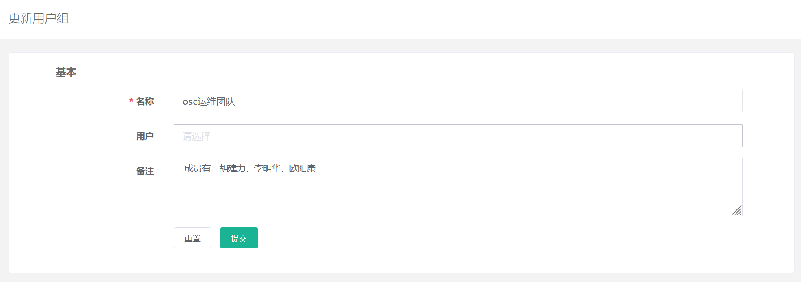


## 4.用户列表

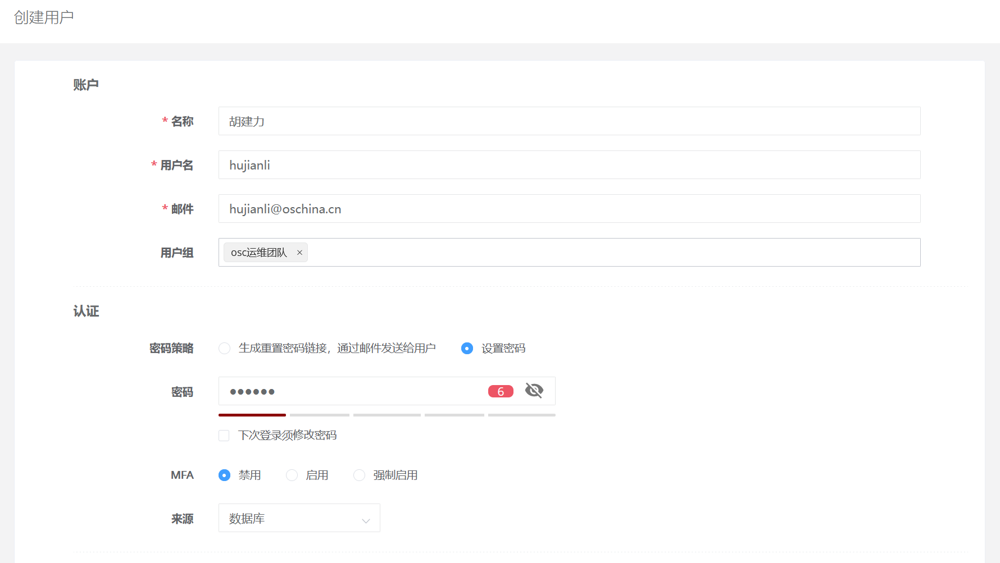


## 5.网域列表

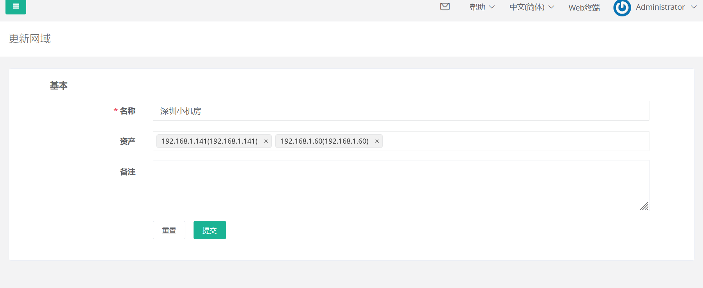


## 6.资产列表

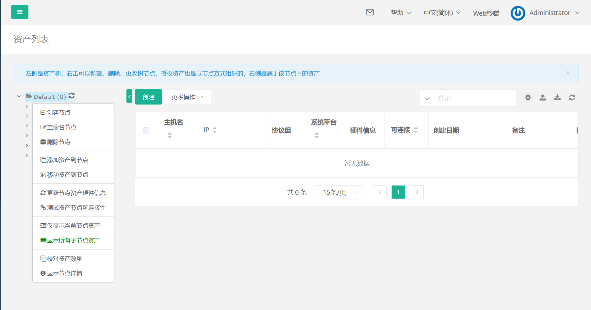

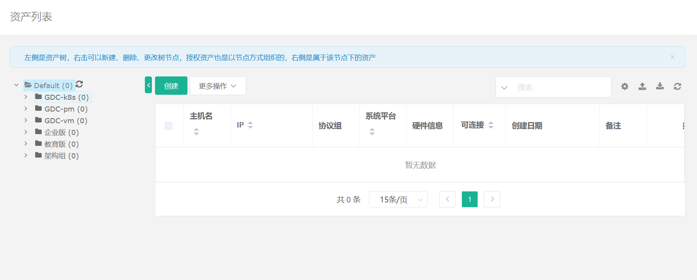


## 7.管理用户

> 注释：
> 这里的管理用户，要在被管理节点提前创建，用户名密码保持一致，并且要在被管理节点进行sudo提权

配置sudo

使用root用户登录已经存在的服务器，创建一个管理用户，密码全部统一。

```
useradd gitee
echo "123456"|passwd gitee --stdin
chmod 644 /etc/sudoers
echo "gitee ALL=(ALL) NOPASSWD:ALL" >> /etc/sudoers
chmod 400 /etc/sudoers
sudo chmod -w /etc/sudoers
```

测试配置是否成功

```
测试提权是否成功
[root@gitee-k8s-m2 ~]# su - gitee
[gitee@gitee-k8s-m2 ~]$ sudo touch /tmp/aaa.txt  //如果创建成功，说明提权成功，再进行一下操作
```

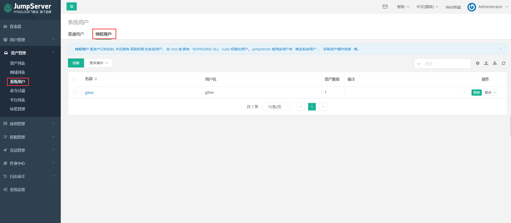

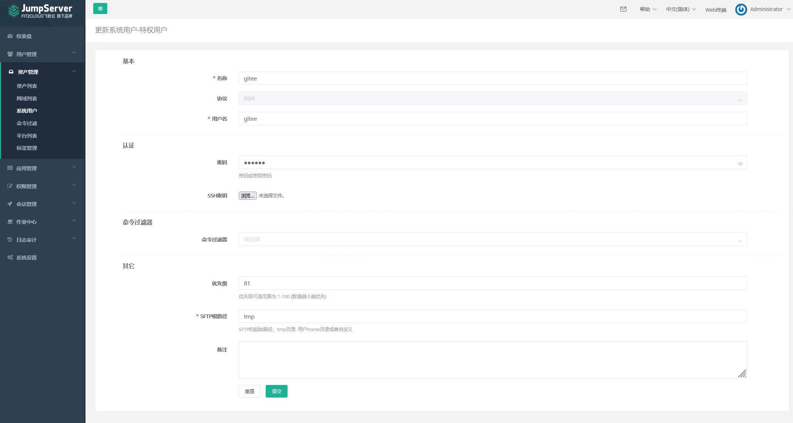


## 8.系统用户

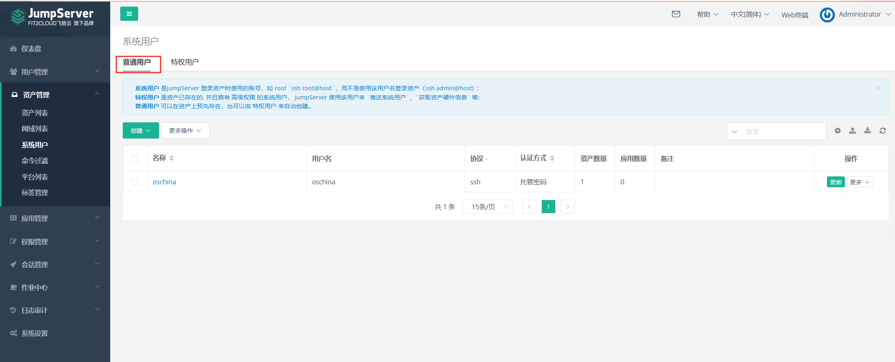


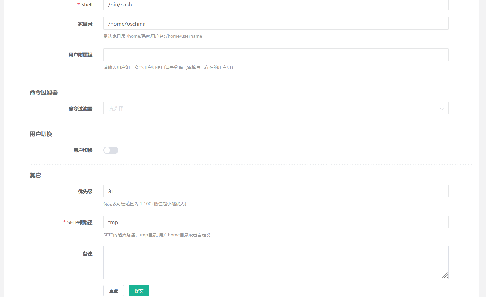


## 9.资产列表


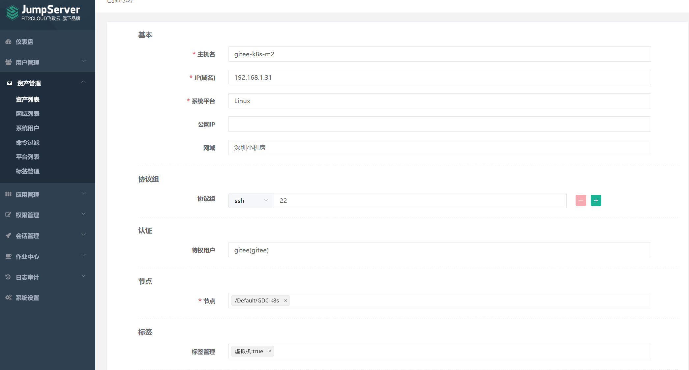

点击推送所有系统用户到资产-`推送`

然后再点击测试所有系统用户可连接性: `测试`

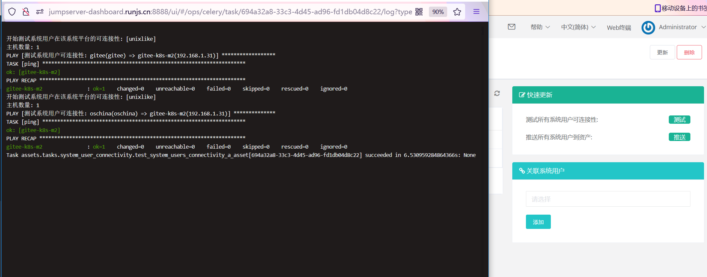

创建完成，进行验证主机是否可连接

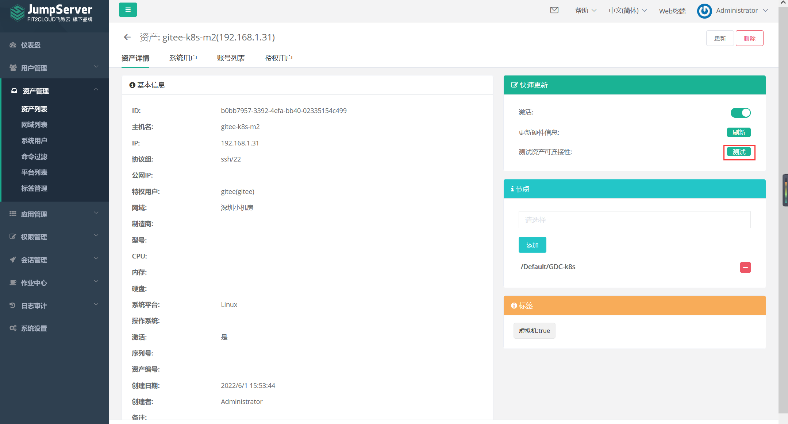

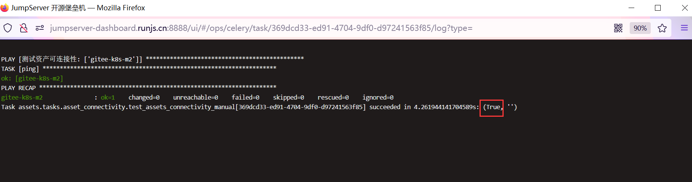


## 10.资产授权

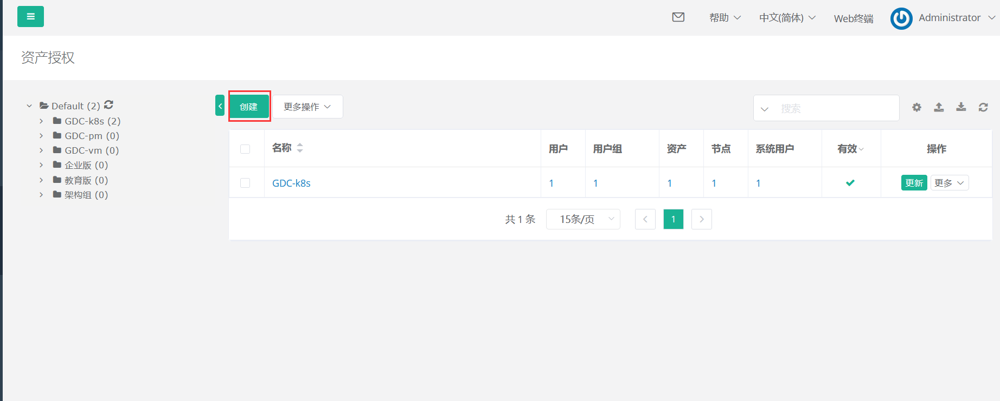

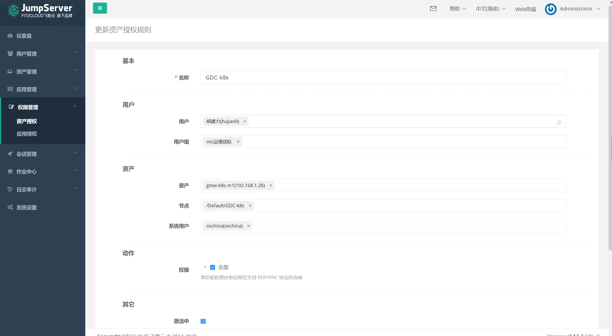


## 11.测试

1. 退出admin管理员用户，使用hujianli普通用户登录Jumpserver堡垒机平台 
2. 查看自己对所分配的资产有无连接权限

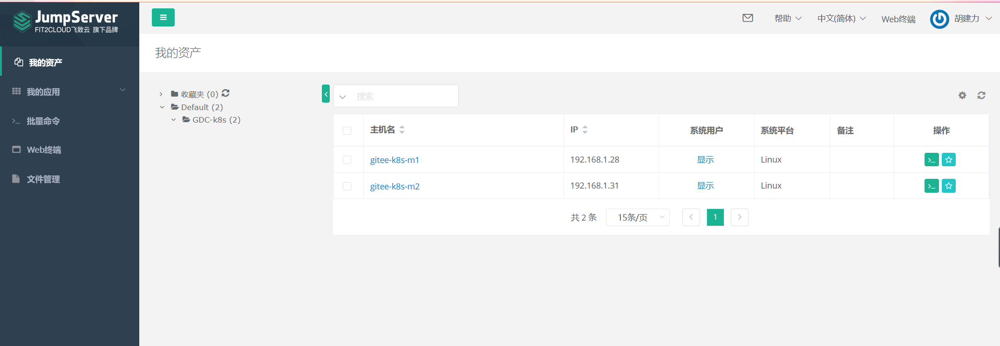

公司一般都使用如下方式进行登录

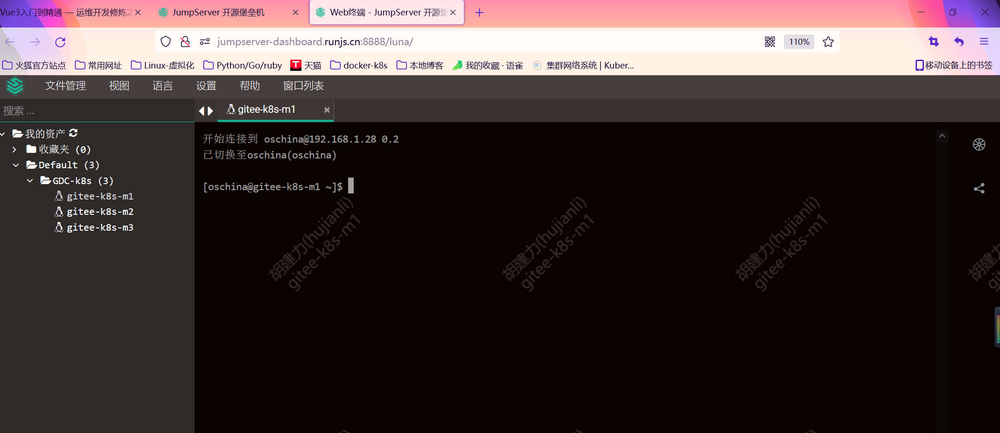


还有另外一种连接方式，使用ssh系统用户名和服务器地址

```
$ ssh -p 2222 hujianli@192.168.1.141
hujianli@192.168.1.141's password:
                胡建力,  JumpServer 开源堡垒机

        1) 输入 部分IP，主机名，备注 进行搜索登录(如果唯一).
        2) 输入 / + IP，主机名，备注 进行搜索，如：/192.168.
        3) 输入 p 进行显示您有权限的主机.
        4) 输入 g 进行显示您有权限的节点.
        5) 输入 d 进行显示您有权限的数据库.
        6) 输入 k 进行显示您有权限的Kubernetes.
        7) 输入 r 进行刷新最新的机器和节点信息.
        8) 输入 h 进行显示帮助.
        9) 输入 q 进行退出.
Opt>
```

按p查看有权限的主机，然后输入他的id 就能连接上 然后可以进行增删改查。

历史操作命令在jumpserver上都能看见 也可以看到


## 12.配置命令规则


## 13.会话管理


## 参考文献

https://blog.csdn.net/hanjinjuan/article/details/120894974

