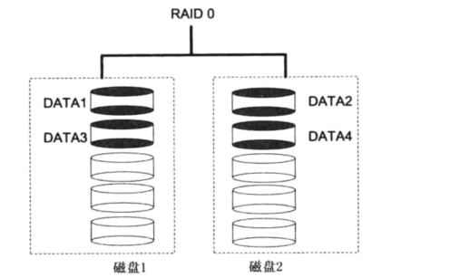
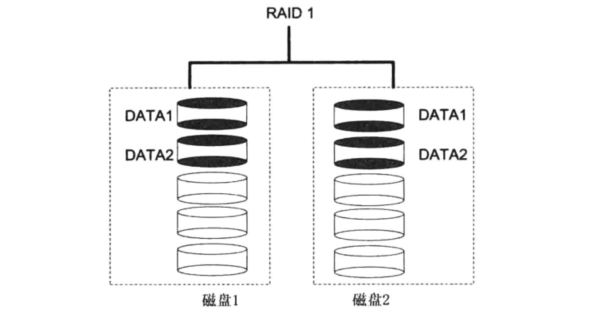
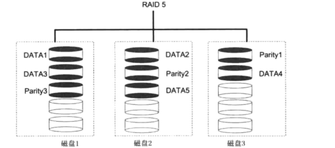
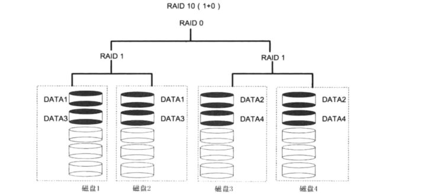
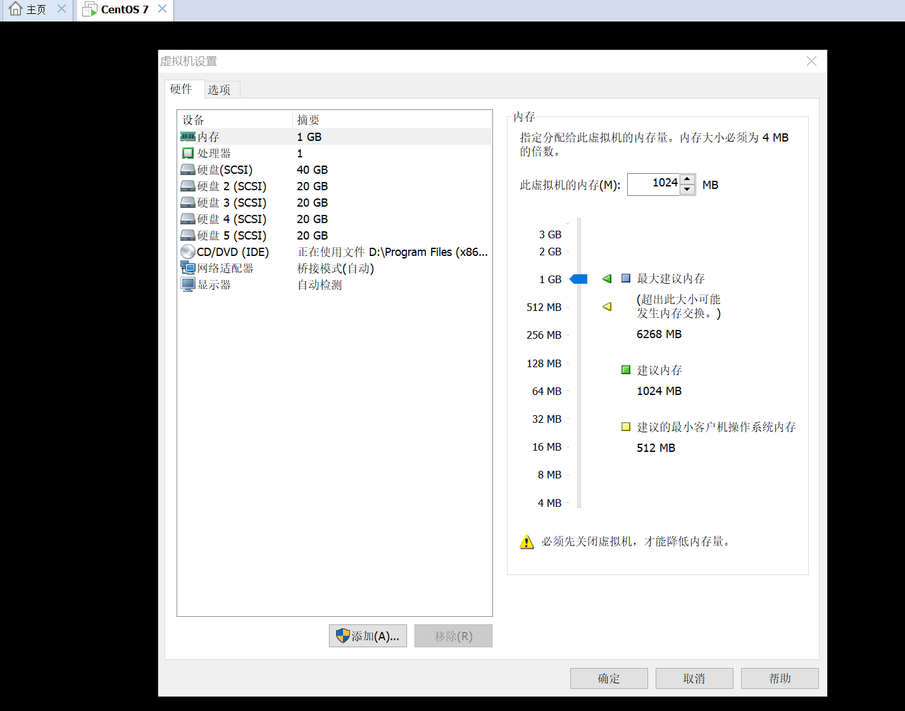
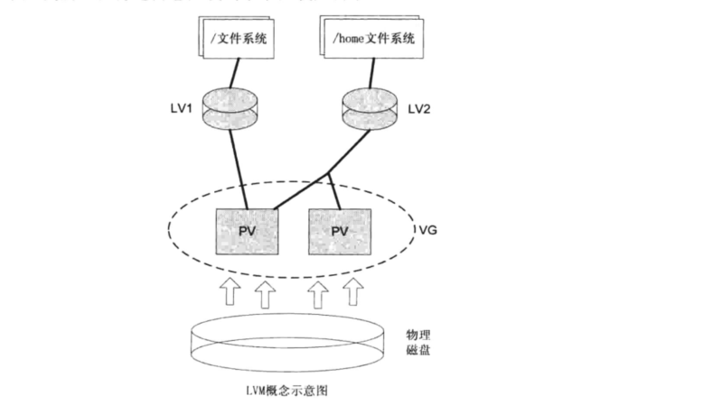

# RAID与LVM磁盘阵列

## RAID 技术


### RAID0
        RAID0至少2块硬盘.吞吐量大,性能好,同时读写,但损坏一个就完蛋


### RAID1
        RAID1至少2块硬盘.相当镜像,一个存储,一个备份.安全性比较高.但是性能比0弱.
        读取同时从2块硬盘读，速冻提升，写入效率低下。存储空间利用不如RAID0.如果2块存储空间为120G，做完Raid1之后
        存储空间还是120G。双副本 这么理解


### RAID5
        RAID5至少3块硬盘.分别存储校验信息和数据，坏了一个根据校验信息能恢复
      

### RAID10
        RAID 10技术是RAID 1+RAID 0技术的一个“组合体”。RAID 10技术需要至少4块硬盘来组建，
    	其中先分别两两制作成RAID 1磁盘阵列，以保证数据的安全性；然后再对两个RAID 1磁盘阵列实施RAID 0技术，进一步提高硬盘设备的读写速度



## 创建管理RAID实例


先挂载3个数据盘
```
[root@k8s-master ~]# lsblk 
NAME   MAJ:MIN RM SIZE RO TYPE MOUNTPOINT
vda    253:0    0   8G  0 disk 
└─vda1 253:1    0   8G  0 part /
vdb    253:16   0  40G  0 disk 
vdc    253:32   0  40G  0 disk 
vdd    253:48   0  40G  0 disk 
```
将每块硬盘分成两个区
``` 
root@k8s-master ~]# fdisk /dev/vdb

Command (m for help): n
Partition type:
   p   primary (0 primary, 0 extended, 4 free)
   e   extended
Select (default p): p
Partition number (1-4, default 1): 1
First sector (2048-83886079, default 2048): 
Using default value 2048
Last sector, +sectors or +size{K,M,G} (2048-83886079, default 83886079): +1G
Partition 1 of type Linux and of size 1 GiB is set


Command (m for help): n
Partition type:
   p   primary (1 primary, 0 extended, 3 free)
   e   extended
Select (default p): p
Partition number (2-4, default 2): 
First sector (2099200-83886079, default 2099200): 
Using default value 2099200
Last sector, +sectors or +size{K,M,G} (2099200-83886079, default 83886079): 
Using default value 83886079
Partition 2 of type Linux and of size 39 GiB is set

Command (m for help): t
Partition number (1,2, default 2): 1
Hex code (type L to list all codes): fd              #打上格式fd为RAID的标签
Changed type of partition 'Linux' to 'Linux raid autodetect'

Command (m for help): t
Partition number (1,2, default 2): 2
Hex code (type L to list all codes): fd              #打上格式fd为RAID的标签
Changed type of partition 'Linux' to 'Linux raid autodetect'

Command (m for help): P

Disk /dev/vdb: 42.9 GB, 42949672960 bytes, 83886080 sectors
Units = sectors of 1 * 512 = 512 bytes
Sector size (logical/physical): 512 bytes / 512 bytes
I/O size (minimum/optimal): 512 bytes / 512 bytes
Disk label type: dos
Disk identifier: 0x66df08bc

   Device Boot      Start         End      Blocks   Id  System
/dev/vdb1            2048     2099199     1048576   fd  Linux raid autodetect
/dev/vdb2         2099200    83886079    40893440   fd  Linux raid autodetect

Command (m for help): w
```

```
**********************************************************
****** 其他2块盘依次进行分区。分2个区 然后打上格式fd为RAID的标签 ***
**********************************************************
```

## 创建Raid(创建Raid0和Raid5)
```
mdadm [模式] 选项 <raid设备>

选项： 
-a          检测设备名称 
-n          指定设备数量 
-l          指定RAID级别 
-C          创建 
-v          显示过程 
-f          模拟设备损坏
-r          移除设备 
-Q          查看摘要信息 
-D          查看详细信息 
-S          停止RAID磁盘阵列

使用mdadm命令创建RAID0，名称为“/dev/md0”
使用mdadm命令创建RAID5，名称为“/dev/md1”
```


```
# 创建RAID0
[root@k8s-master ~]# mdadm -C /dev/md0 -l 0 -n 3 /dev/vdb1 /dev/vdc1 /dev/vdd1

# 创建RAID5
[root@k8s-master ~]# mdadm -C /dev/md1 -l 5 -n 3  /dev/vdb2 /dev/vdc2 /dev/vdd2 
```
``` 
[root@k8s-master ~]# mdadm --detail /dev/md0
/dev/md0:
           Version : 1.2
     Creation Time : Thu Jun 27 08:32:37 2019
        Raid Level : raid0                          # raid级别
        Array Size : 3139584 (2.99 GiB 3.21 GB)     # 磁盘空间
      Raid Devices : 3                              # 磁盘个数
     Total Devices : 3
       Persistence : Superblock is persistent

       Update Time : Thu Jun 27 08:32:37 2019
             State : clean 
    Active Devices : 3          # 激活磁盘个数
   Working Devices : 3          # 工作磁盘个数
    Failed Devices : 0
     Spare Devices : 0          # 备用磁盘个数

        Chunk Size : 512K

Consistency Policy : none

              Name : k8s-master:0  (local to host k8s-master)
              UUID : 672753ed:d7174f92:2937af89:7231c156
            Events : 0

    Number   Major   Minor   RaidDevice State
       0     253       17        0      active sync   /dev/vdb1
       1     253       33        1      active sync   /dev/vdc1
       2     253       49        2      active sync   /dev/vdd1
       
       
[root@k8s-master ~]# mdadm --detail /dev/md1
```

停止raid
``` 
[root@k8s-master /]# mdadm -S /dev/md1

[root@k8s-master /]# mdadm -S /dev/md0

```

格式化与挂载
``` 
[root@k8s-master ~]# mkfs.xfs /dev/md0
[root@k8s-master ~]# mkdir /raid0
[root@k8s-master ~]# mount /dev/md0 /raid0
[root@k8s-master ~]# mkfs.xfs /dev/md1
[root@k8s-master ~]# mkdir /raid5
[root@k8s-master ~]# mount /dev/md1 /raid5

```

将磁盘设备设置为开机自动挂载项，Centos系统开机会读磁盘阵列的配置文件/etc/mdadm.conf以启动RAID设备。
``` shell
[root@k8s-master ~]# echo "DEVICE /dev/vdb1 /dev/vdb2  /dev/vdc1 /dev/vdc2 /dev/vdd1 /dev/vdd2" > /etc/mdadm.conf
[root@k8s-master ~]# mdadm -Evs >>/dev/mdadm.conf

[root@k8s-master ~]# cat /dev/mdadm.conf 

[root@k8s-master ~]# cat >>/etc/fstab <<EOF
> /dev/md0   /raid0   xfs  defaults  0  0
> /dev/md0   /raid5   xfs  defaults  0  0
> EOF
```


## Raid性能测试
```shell
***************************************
******  普通磁盘写入模拟 **************
***************************************

[root@k8s-node01 ~]# time dd if=/dev/zero of=txt bs=1M count=1000
1000+0 records in
1000+0 records out
1048576000 bytes (1.0 GB) copied, 4.24897 s, 247 MB/s

real	0m4.252s
user	0m0.007s
sys	0m1.091s


普通磁盘写入1GB的数据所需要总时间为4.252s
```

``` shell

***************************************
******  RAID5磁盘写入模拟 **************
***************************************

[root@k8s-master ~]# time dd if=/dev/zero of=txt bs=1M count=1000
1000+0 records in
1000+0 records out
1048576000 bytes (1.0 GB) copied, 3.69961 s, 283 MB/s

real	0m3.703s
user	0m0.003s
sys	0m1.000s

普通磁盘写入1GB的数据所需要总时间为3.7s
```

## Raid故障模拟
``` shell
[root@k8s-master ~]# mdadm /dev/md1 -f /dev/vdb2
mdadm: set /dev/vdb2 faulty in /dev/md1


[root@k8s-master ~]# mdadm --detail /dev/md1
/dev/md1:
           Version : 1.2
     Creation Time : Thu Jun 27 08:33:57 2019
        Raid Level : raid5
        Array Size : 81719296 (77.93 GiB 83.68 GB)
     Used Dev Size : 40859648 (38.97 GiB 41.84 GB)
      Raid Devices : 3
     Total Devices : 3
       Persistence : Superblock is persistent

       Update Time : Thu Jun 27 08:51:19 2019
             State : clean, FAILED 
    Active Devices : 1
   Working Devices : 2
    Failed Devices : 1
     Spare Devices : 1

            Layout : left-symmetric
        Chunk Size : 512K

Consistency Policy : resync

              Name : k8s-master:1  (local to host k8s-master)
              UUID : e892bf01:afcffeef:fd5ccf62:43b61418
            Events : 44

    Number   Major   Minor   RaidDevice State
       -       0        0        0      removed
       1     253       34        1      active sync   /dev/vdc2
       -       0        0        2      removed

       0     253       18        -      faulty   /dev/vdb2
       3     253       50        -      spare   /dev/vdd2

```
当有/dev/vde2空闲盘时，此时的空闲备份盘会building 重建磁盘信息替代vdb2。


## 制作一个RAID 10磁盘阵列
    （虚拟机添加4块硬盘）

    
    mdadm命令用于管理Linux系统中的软件RAID硬盘阵列，格式为“mdadm [模式] <RAID设备名称> [选项] [成员设备名称]”。

```

```
    使用mdadm命令创建RAID 10，名称为“/dev/md0”
``` 
[root@localhost ~]# lsblk 
NAME            MAJ:MIN RM  SIZE RO TYPE MOUNTPOINT
sda               8:0    0   40G  0 disk 
├─sda1            8:1    0  600M  0 part /boot
└─sda2            8:2    0 39.4G  0 part 
  ├─centos-root 253:0    0 37.4G  0 lvm  /
  └─centos-swap 253:1    0    2G  0 lvm  [SWAP]
sdb               8:16   0   20G  0 disk 
sdc               8:32   0   20G  0 disk 
sdd               8:48   0   20G  0 disk 
sde               8:64   0   20G  0 disk 
sr0              11:0    1 1024M  0 rom  


用mdadm中的参数了。
其中，-C参数代表创建一个RAID阵列卡；
-v参数显示创建的过程，同时在后面追加一个设备名称/dev/md0，
这样/dev/md0就是创建后的RAID磁盘阵列的名称；
-a yes参数代表自动创建设备文件；
-n 4参数代表使用4块硬盘来部署这个RAID磁盘阵列；
而-l 10参数则代表RAID 10方案；
最后再加上4块硬盘设备的名称就搞定了。

[root@localhost ~]# mdadm -Cv /dev/md0 -a yes -n 4 -l 10 /dev/sdb /dev/sdc /dev/sdd /dev/sde
mdadm: layout defaults to n2
mdadm: layout defaults to n2
mdadm: chunk size defaults to 512K
mdadm: partition table exists on /dev/sdb
mdadm: partition table exists on /dev/sdb but will be lost or
       meaningless after creating array
mdadm: size set to 20954112K
Continue creating array? 
Continue creating array? (y/n) y
mdadm: Defaulting to version 1.2 metadata
mdadm: array /dev/md0 started.
   
把制作好的RAID磁盘阵列格式化为ext4格式。
[root@localhost ~]# mkfs.ext4 /dev/md0
mke2fs 1.42.9 (28-Dec-2013)
文件系统标签=
OS type: Linux
块大小=4096 (log=2)
分块大小=4096 (log=2)
Stride=128 blocks, Stripe width=256 blocks
2621440 inodes, 10477056 blocks
523852 blocks (5.00%) reserved for the super user
第一个数据块=0
Maximum filesystem blocks=2157969408
320 block groups
32768 blocks per group, 32768 fragments per group
8192 inodes per group
Superblock backups stored on blocks: 
	32768, 98304, 163840, 229376, 294912, 819200, 884736, 1605632, 2654208, 
	4096000, 7962624

Allocating group tables: 完成                            
正在写入inode表: 完成                            
Creating journal (32768 blocks): 完成
Writing superblocks and filesystem accounting information: 完成 

创建挂载点然后把硬盘设备进行挂载操作。挂载成功后可看到可用空间为40GB。
[root@localhost ~]# mount /dev/md0 /mnt/
[root@localhost ~]# lsblk 
NAME            MAJ:MIN RM  SIZE RO TYPE   MOUNTPOINT
sda               8:0    0   40G  0 disk   
├─sda1            8:1    0  600M  0 part   /boot
└─sda2            8:2    0 39.4G  0 part   
  ├─centos-root 253:0    0 37.4G  0 lvm    /
  └─centos-swap 253:1    0    2G  0 lvm    [SWAP]
sdb               8:16   0   20G  0 disk   
└─md0             9:0    0   40G  0 raid10 /mnt
sdc               8:32   0   20G  0 disk   
└─md0             9:0    0   40G  0 raid10 /mnt
sdd               8:48   0   20G  0 disk   
└─md0             9:0    0   40G  0 raid10 /mnt
sde               8:64   0   20G  0 disk   
└─md0             9:0    0   40G  0 raid10 /mnt
sr0              11:0    1 1024M  0 rom

查看/dev/md0磁盘阵列的详细信息，并把挂载信息写入到配置文件中，使其永久生效。

[root@localhost ~]# mdadm -D /dev/md0 
/dev/md0:
           Version : 1.2
     Creation Time : Sun Feb  3 20:01:35 2019
        Raid Level : raid10
        Array Size : 41908224 (39.97 GiB 42.91 GB)
     Used Dev Size : 20954112 (19.98 GiB 21.46 GB)
      Raid Devices : 4
     Total Devices : 4
       Persistence : Superblock is persistent

       Update Time : Sun Feb  3 20:03:56 2019
             State : clean 
    Active Devices : 4
   Working Devices : 4
    Failed Devices : 0
     Spare Devices : 0

            Layout : near=2
        Chunk Size : 512K

Consistency Policy : resync

              Name : localhost.localdomain:0  (local to host localhost.localdomain)
              UUID : 0258c0d3:a97f1527:8e70e0f9:5153622a
            Events : 19

    Number   Major   Minor   RaidDevice State
       0       8       16        0      active sync set-A   /dev/sdb
       1       8       32        1      active sync set-B   /dev/sdc
       2       8       48        2      active sync set-A   /dev/sdd
       3       8       64        3      active sync set-B   /dev/sde

查看/dev/md0磁盘阵列的详细信息，并把挂载信息写入到配置文件中，使其永久生效
[root@localhost ~]# echo "/dev/md0 /RAID ext4 defaults 0 0" >> /etc/fstab
[root@localhost ~]# cat /etc/fstab 

#
# /etc/fstab
# Created by anaconda on Wed Jan 30 21:29:08 2019
#
# Accessible filesystems, by reference, are maintained under '/dev/disk'
# See man pages fstab(5), findfs(8), mount(8) and/or blkid(8) for more info
#
/dev/mapper/centos-root /                       xfs     defaults        0 0
UUID=9d17d78f-ff3c-48ea-a33e-2a177655588a /boot                   xfs     defaults        0 0
/dev/mapper/centos-swap swap                    swap    defaults        0 0
/dev/sdb2					swap    defaults   swap   0 0 
/dev/md0 /RAID ext4 defaults 0 0


删除md0：
umount /dev/md0     #卸载md0设备
1.  mdadm -S /dev/md0   #停止raid5进程
2.  mdadm --misc --zero-superblock /dev/sdd
     mdadm --misc --zero-superblock /dev/sdd
     mdadm --misc --zero-superblock /dev/sdd
3.  删除/etc/mdadm/mdadm.conf文件中添加的DEVICE行和ARRAY行。
```

## 磁盘阵列+备份盘 (RAID 5)
    至少需要3块硬盘

```
mdadm -Cv /dev/md0 -n 3 -l 5 -x 1 /dev/sdb /dev/sdc /dev/sdd /dev/sde
mdadm: layout defaults to left-symmetric
mdadm: layout defaults to left-symmetric
mdadm: super1.x cannot open /dev/sdb: Device or resource busy
mdadm: ddf: Cannot use /dev/sdb: Device or resource busy
mdadm: Cannot use /dev/sdb: It is busy
mdadm: cannot open /dev/sdb: Device or resource busy
[root@localhost ~]# lsblk 
NAME            MAJ:MIN RM  SIZE RO TYPE  MOUNTPOINT
sda               8:0    0   40G  0 disk  
├─sda1            8:1    0  600M  0 part  /boot
└─sda2            8:2    0 39.4G  0 part  
  ├─centos-root 253:0    0 37.4G  0 lvm   /
  └─centos-swap 253:1    0    2G  0 lvm   [SWAP]
sdb               8:16   0   20G  0 disk  
└─md0             9:0    0   40G  0 raid5 
sdc               8:32   0   20G  0 disk  
└─md0             9:0    0   40G  0 raid5 
sdd               8:48   0   20G  0 disk  
└─md0             9:0    0   40G  0 raid5 
sde               8:64   0   20G  0 disk  
└─md0             9:0    0   40G  0 raid5 
sr0              11:0    1 1024M  0 rom   
[root@localhost ~]# mdadm -D /dev/md0
/dev/md0:
           Version : 1.2
     Creation Time : Sun Feb  3 20:11:39 2019
        Raid Level : raid5
        Array Size : 41908224 (39.97 GiB 42.91 GB)
     Used Dev Size : 20954112 (19.98 GiB 21.46 GB)
      Raid Devices : 3
     Total Devices : 4
       Persistence : Superblock is persistent

       Update Time : Sun Feb  3 20:12:28 2019
             State : clean 
    Active Devices : 3
   Working Devices : 4
    Failed Devices : 0
     Spare Devices : 1

            Layout : left-symmetric
        Chunk Size : 512K

Consistency Policy : resync

              Name : localhost.localdomain:0  (local to host localhost.localdomain)
              UUID : afeb536b:a181f5af:f574ed65:600f8092
            Events : 18

    Number   Major   Minor   RaidDevice State
       0       8       16        0      active sync   /dev/sdb
       1       8       32        1      active sync   /dev/sdc
       4       8       48        2      active sync   /dev/sdd

       3       8       64        -      spare   /dev/sde

```
```

[root@localhost ~]# mkfs.ext4 /dev/md0
mke2fs 1.42.9 (28-Dec-2013)
文件系统标签=
OS type: Linux
块大小=4096 (log=2)
分块大小=4096 (log=2)
Stride=128 blocks, Stripe width=256 blocks
2621440 inodes, 10477056 blocks
523852 blocks (5.00%) reserved for the super user
第一个数据块=0
Maximum filesystem blocks=2157969408
320 block groups
32768 blocks per group, 32768 fragments per group
8192 inodes per group
Superblock backups stored on blocks: 
	32768, 98304, 163840, 229376, 294912, 819200, 884736, 1605632, 2654208, 
	4096000, 7962624

Allocating group tables: 完成                            
正在写入inode表: 完成                            
Creating journal (32768 blocks): 完成
Writing superblocks and filesystem accounting information: 完成
```

```
我们再次把硬盘设备/dev/sdb移出磁盘阵列，然后迅速查看/dev/md0磁盘阵列的状态，
就会发现备份盘已经被自动顶替上去并开始了数据同步。
RAID中的这种备份盘技术非常实用，可以在保证RAID磁盘阵列数据安全性的基础上进一步提高数据可靠性，
所以，如果公司不差钱的话还是再买上一块备份盘以防万一。

[root@localhost ~]# echo "/dev/md0 /RAID ext4 defaults 0 0" >> /etc/fstab
[root@localhost ~]# mkdir /RAID
[root@localhost ~]# mount -a
[root@localhost ~]# mdadm /dev/md0 -f /dev/sdb
mdadm: set /dev/sdb faulty in /dev/md0
[root@localhost ~]# mdadm -D /dev/md0 
/dev/md0:
           Version : 1.2
     Creation Time : Sun Feb  3 20:11:39 2019
        Raid Level : raid5
        Array Size : 41908224 (39.97 GiB 42.91 GB)
     Used Dev Size : 20954112 (19.98 GiB 21.46 GB)
      Raid Devices : 3
     Total Devices : 4
       Persistence : Superblock is persistent

       Update Time : Sun Feb  3 20:14:32 2019
             State : active, degraded, recovering 
    Active Devices : 2
   Working Devices : 3
    Failed Devices : 1
     Spare Devices : 1

            Layout : left-symmetric
        Chunk Size : 512K

Consistency Policy : resync

    Rebuild Status : 0% complete

              Name : localhost.localdomain:0  (local to host localhost.localdomain)
              UUID : afeb536b:a181f5af:f574ed65:600f8092
            Events : 22

    Number   Major   Minor   RaidDevice State
       3       8       64        0      spare rebuilding   /dev/sde
       1       8       32        1      active sync   /dev/sdc
       4       8       48        2      active sync   /dev/sdd

       0       8       16        -      faulty   /dev/sdb

```


## LVM逻辑卷概述
LVM（Logical Volume Manager）

* 基于内核的一种逻辑卷管理器，LVM适合于管理大存储设备，并允许动态的调整文件系统的大小。此外LVM的快照功能可以帮助我们快速
备份数据。LVM为我们提供了逻辑概念上的磁盘，使得文件系统不再关心底层物磁盘的概念。


使用LVM逻辑卷之前，我们要了解以下几个概念：
    
    PV（物理卷）：物理卷和从分区是逻辑对应关系，LVM提供命令工具可以将分区转换为物理卷，通过组合物理卷生成卷组
    
    VG（卷组）：卷组是LVM逻辑概念上的磁盘设备，通过单个或多个物理卷组合生成卷组，卷组的大小取决于物理卷的容量以及个数，在CentOS 7 系统中
    对容量与个数没有限制。
    
    PE（物理长度）：物理长度是，物理卷组合成为卷组之后，所花费的最小存储单位，即逻辑意义上磁盘的最小存储单元。LVM默认PE大小为4MB
    
    LV（逻辑卷）：逻辑卷就是LVM逻辑意义上的分区，我们可以指定从卷组中提取多少容量来创建逻辑卷，最后对逻辑卷格式化并挂载使用。



将普通分区转换为物理卷的命令是：pvcreate

将物理卷组合成卷组的命令是：vgcreate

从卷组中提取容量创建逻辑卷的命令是：lvcreate

查看创建后的结果：

pvdispaly、vgdisplay、lvdisplay


1. pvcreate
``` 
用法：pvcreate [选项] 物理卷[物理卷]
pvcreate /dev/sdc4 /dev/sde
pvcreate /dev/sdb{1,2,3}
```


2.vgcreate
``` 
# 创建卷组
vgcreate [选项] 卷组名称 物理设备路径 [物理设备路径]
vgcreate test_vg1 /dev/sdb5 /dev/sdb6
vgcreate test_vg2 -s 16M /dev/sdb5 /dev/sdc6
                #  -s 参数用来指定PE大小为16MB
```

3.lvcreate
```
描述:从卷组中提取存储空间， 创建逻辑卷。
用法:lvcreate [选项] 卷组名称或路径 [物理卷路径]
选项:
-l 指定使用多少个卷组中的PE创建逻辑卷， PE的容量在创建卷组时己经指定。
-L 直接指定逻辑卷的容量大小,单位可以是b(B) 、s(S) 、k (K) 、m(M) 、g (G) 、t (T) 、p(P) 或e(E)。
-n 指定逻辑卷名称。


例子：

# 从test_vg1卷组中提取2GB容量，创建名称为test_lvl的逻辑卷
# lvcreate - 2G -n test_1v1 test_vg1

# 使用200个PE 创建逻辑卷， 前面案例中定义了PE大小为16MB
# lvcreate -1 200 -n test 1v2 test vg2

# 指定使用test_vgl 卷组中的/dev/sdb6 这个物理卷的存储空间， 创建名称为test_lvl 的逻辑卷
# lvcreate -2G -n test 1v1 test_vg1 /dev/sdb6
```

## 创建LVM分区实例

将sdb 500GB 创建四个100GB的分区。使用这四个分区创建一个名称为test_vg的卷组，最后从该卷组创建出两个大小为120GB的逻辑卷，
名称分别为test_web、test_data。

查看到一块500GB的vdc数据盘
``` 
[root@k8s-master ~]# lsblk 
NAME   MAJ:MIN RM  SIZE RO TYPE MOUNTPOINT
vdc    253:32   0  500G  0 disk 
```

``` 
[root@k8s-master ~]# fdisk /dev/vdc
Welcome to fdisk (util-linux 2.23.2).

Changes will remain in memory only, until you decide to write them.
Be careful before using the write command.

Device does not contain a recognized partition table
Building a new DOS disklabel with disk identifier 0xdd05bcc6.

Command (m for help): n
Partition type:
   p   primary (0 primary, 0 extended, 4 free)
   e   extended
Select (default p): p
Partition number (1-4, default 1): 1
First sector (2048-1048575999, default 2048): 
Using default value 2048
Last sector, +sectors or +size{K,M,G} (2048-1048575999, default 1048575999): +100G
Partition 1 of type Linux and of size 100 GiB is set

Command (m for help): n
Partition type:
   p   primary (1 primary, 0 extended, 3 free)
   e   extended
Select (default p): p
Partition number (2-4, default 2): 2
First sector (209717248-1048575999, default 209717248): 
Using default value 209717248
Last sector, +sectors or +size{K,M,G} (209717248-1048575999, default 1048575999): +100G           
Partition 2 of type Linux and of size 100 GiB is set

Command (m for help): n
Partition type:
   p   primary (2 primary, 0 extended, 2 free)
   e   extended
Select (default p): p  
Partition number (3,4, default 3): 3
First sector (419432448-1048575999, default 419432448): 
Using default value 419432448
Last sector, +sectors or +size{K,M,G} (419432448-1048575999, default 1048575999): +100G
Partition 3 of type Linux and of size 100 GiB is set

Command (m for help): n
Partition type:
   p   primary (3 primary, 0 extended, 1 free)
   e   extended
Select (default e): e
Selected partition 4
First sector (629147648-1048575999, default 629147648): 
Using default value 629147648
Last sector, +sectors or +size{K,M,G} (629147648-1048575999, default 1048575999): 
Using default value 1048575999
Partition 4 of type Extended and of size 200 GiB is set

Command (m for help): n
All primary partitions are in use
Adding logical partition 5
First sector (629149696-1048575999, default 629149696): 
Using default value 629149696
Last sector, +sectors or +size{K,M,G} (629149696-1048575999, default 1048575999): +100G
Partition 5 of type Linux and of size 100 GiB is set

########  创建3块主分区，一块扩展分区。然后+1块逻辑分区###################


Command (m for help): t
Partition number (1-5, default 5): 1            #指定分区编号
Hex code (type L to list all codes): 8e         # 指定分区标签为LVM
Changed type of partition 'Linux' to 'Linux LVM'

Command (m for help): t
Partition number (1-5, default 5): 2
Hex code (type L to list all codes): 8e
Changed type of partition 'Linux' to 'Linux LVM'

Command (m for help): t
Partition number (1-5, default 5): 3
Hex code (type L to list all codes): 8e  
Changed type of partition 'Linux' to 'Linux LVM'

Command (m for help): t
Partition number (1-5, default 5): 5
Hex code (type L to list all codes): 8e
Changed type of partition 'Linux' to 'Linux LVM'


######## 查看分区信息#######################
Command (m for help): P

Disk /dev/vdc: 536.9 GB, 536870912000 bytes, 1048576000 sectors
Units = sectors of 1 * 512 = 512 bytes
Sector size (logical/physical): 512 bytes / 512 bytes
I/O size (minimum/optimal): 512 bytes / 512 bytes
Disk label type: dos
Disk identifier: 0xdd05bcc6

   Device Boot      Start         End      Blocks   Id  System
/dev/vdc1            2048   209717247   104857600   8e  Linux LVM
/dev/vdc2       209717248   419432447   104857600   8e  Linux LVM
/dev/vdc3       419432448   629147647   104857600   8e  Linux LVM
/dev/vdc4       629147648  1048575999   209714176    5  Extended
/dev/vdc5       629149696   838864895   104857600   8e  Linux LVM

Command (m for help): w                                 #将分区信息写入硬盘
The partition table has been altered!

Calling ioctl() to re-read partition table.
```

``` 
[root@k8s-master ~]# lsblk 
NAME   MAJ:MIN RM  SIZE RO TYPE MOUNTPOINT
vda    253:0    0    8G  0 disk 
└─vda1 253:1    0    8G  0 part /
vdb    253:16   0   20G  0 disk 
vdc    253:32   0  500G  0 disk 
├─vdc1 253:33   0  100G  0 part 
├─vdc2 253:34   0  100G  0 part 
├─vdc3 253:35   0  100G  0 part 
├─vdc4 253:36   0    1K  0 part 
└─vdc5 253:37   0  100G  0 part 
```

使用pvcreate创建物理卷并使用pvdisaply查看结果
```
[root@k8s-master ~]# pvcreate /dev/vdc{1,2,3,5}
  Physical volume "/dev/vdc1" successfully created.
  Physical volume "/dev/vdc2" successfully created.
  Physical volume "/dev/vdc3" successfully created.
  Physical volume "/dev/vdc5" successfully created.
[root@k8s-master ~]# pvdisplay 
```

使用vgcreate创建卷组并使用vgdisplay查看结果
``` shell
[root@k8s-master ~]# vgcreate test_vg /dev/vdc{1,2,3,5}
  Volume group "test_vg" successfully created
[root@k8s-master ~]# vgdisplay 
```

新增PV加入到现有的VG中

VG名称`vg00`

```shell
[root@cnsz02vl07124 /]# pvcreate /dev/vdb1

[root@cnsz02vl07124 /]# vgdisplay
  --- Volume group ---
  VG Name               vg00
  System ID             
  Format                lvm2
  Metadata Areas        1
  Metadata Sequence No  6
  VG Access             read/write
  VG Status             resizable
  MAX LV                0
  Cur LV                5
  Open LV               5
  Max PV                0
  Cur PV                1
  Act PV                1
  VG Size               <59.08 GiB
  PE Size               4.00 MiB
  Total PE              15124
  Alloc PE / Size       14875 / <58.11 GiB
  Free  PE / Size       249 / 996.00 MiB
  VG UUID               kn6dRr-B7k5-TsIL-2C27-VZ7d-e0wy-XHG9OJ
   
[root@cnsz02vl07124 /]# vgextend vg00 /dev/vdb1
  Volume group "vg00" successfully extended
```

使用lvcreate创建逻辑卷并使用lvdisplay查看结果

``` shell
[root@k8s-master ~]# lvcreate -n test_web -L 120G test_vg
  Logical volume "test_web" created.
[root@k8s-master ~]# lvcreate -n test_data -l 30720 test_vg
  Logical volume "test_data" created.
[root@k8s-master ~]# lvdisplay 
  --- Logical volume ---
  LV Path                /dev/test_vg/test_web
  LV Name                test_web
  VG Name                test_vg
  LV UUID                KQmHUN-1qkY-IEvZ-p0vv-yILW-Okc6-WJMYQr
  LV Write Access        read/write
  LV Creation host, time k8s-master, 2019-06-27 07:23:22 +0000
  LV Status              available
  # open                 0
  LV Size                120.00 GiB
  Current LE             30720
  Segments               2
  Allocation             inherit
  Read ahead sectors     auto
  - currently set to     256
  Block device           252:0
   
  --- Logical volume ---
  LV Path                /dev/test_vg/test_data
  LV Name                test_data
  VG Name                test_vg
  LV UUID                Ro8VAt-HH4W-4Gek-wY0Q-L0iL-q2UH-h1kcfo
  LV Write Access        read/write
  LV Creation host, time k8s-master, 2019-06-27 07:23:51 +0000
  LV Status              available
  # open                 0
  LV Size                120.00 GiB
  Current LE             30720
  Segments               2
  Allocation             inherit
  Read ahead sectors     auto
  - currently set to     256
  Block device           252:1
```

格式化并挂载
``` shell
[root@k8s-master ~]# mkfs.xfs /dev/test_vg/test_web

[root@k8s-master ~]# mkfs.xfs /dev/test_vg/test_data

[root@k8s-master ~]# mkdir -p /test/{web,data}

[root@k8s-master ~]# cat >> /etc/fstab <<EOF
/dev/test_vg/test_data   /test/data     xfs    defaults  0  0
/dev/test_vg/test_web    /test/web     xfs    defaults  0  0
EOF


[root@k8s-master ~]# mount -a           # 加载开机自动挂载


[root@k8s-master ~]# df -h              # 查看文件系统挂载情况
/dev/mapper/test_vg-test_data  120G   33M  120G   1% /test/data
/dev/mapper/test_vg-test_web   120G   33M  120G   1% /test/web

```

## 修改LVM分区容量
当逻辑卷test_data现有的存储空间以及不能满足企业大业务量的需要，我们需要将存储容量增大至240GB时。
LVM随时可以帮助我们动态调整文件系统的大小。
实现方法如下：
``` shell
lvextend -L +120G /dev/test_vg/test_data        #扩容逻辑卷

lvs                                             #查看逻辑卷以及扩容完成

df -h                                           #文件系统没有变化

xfs_growfs /dev/test_vg/test_data               #调整文件系统大小

df -h                                           #调整后查看文件系统大小，有变化
```

示例
``` shell
root@k8s-master ~]# fdisk /dev/vdc

Command (m for help): n
All primary partitions are in use
Adding logical partition 6
First sector (838866944-1048575999, default 838866944): 
Using default value 838866944
Last sector, +sectors or +size{K,M,G} (838866944-1048575999, default 1048575999): 
Using default value 1048575999
Partition 6 of type Linux and of size 100 GiB is set

Command (m for help): t
Partition number (1-6, default 6): e
Partition number (1-6, default 6): 6
Hex code (type L to list all codes): 8e
Changed type of partition 'Linux' to 'Linux LVM'

Command (m for help): w

```

``` shell
[root@k8s-master ~]# pvcreate /dev/vdc6
  Physical volume "/dev/vdc6" successfully created.
  
[root@k8s-master ~]# vgextend test_vg /dev/vdc6
  Volume group "test_vg" successfully extended
  
[root@k8s-master ~]# vgdisplay test_vg

  VG Size               499.98 GiB          # VG总大小
  PE Size               4.00 MiB
  Total PE              127995
  Alloc PE / Size       61440 / 240.00 GiB          # PE已使用240G   
  Free  PE / Size       66555 / 259.98 GiB          # 剩余259.98G
  VG UUID               5PNXxs-QU9C-Goe1-Dyvi-dt40-rlQp-Nvegcc
```
``` shell
[root@k8s-master ~]# lvextend -L 360G /dev/test_vg/test_data   #将逻辑卷扩展至360GB

[root@k8s-master ~]# xfs_growfs /dev/test_vg/test_data          #开始调整

[root@k8s-master ~]# df -h
Filesystem                     Size  Used Avail Use% Mounted on
/dev/mapper/test_vg-test_web   120G   33M  120G   1% /test/web
/dev/mapper/test_vg-test_data  360G   33M  360G   1% /test/data
```
_企业生产环境中，为文件系统调整大小前一定要做好数据的备份工作。_


## 删除LVM分区
当我们不需要逻辑分区时，可以使用LVM命令轻松的删除之前创建的物理卷、卷组、逻辑卷。
删除的顺序与创建的顺序相反：
```shell
1.先卸载文件系统
2.删除逻辑卷
3.删除卷组
4.删除物理卷

卸载文件系统时需要注意，有必要更新一下/etc/fstab文件。
```

``` shell
1.先卸载文件系统
[root@k8s-master ~]# umount /dev/test_vg/test_data
[root@k8s-master ~]# umount /dev/test_vg/test_web

2.删除逻辑卷
[root@k8s-master ~]# lvremove /dev/test_vg/test_data
[root@k8s-master ~]# lvremove /dev/test_vg/test_web

3.删除卷组
[root@k8s-master ~]# vgremove test_vg

4.删除物理卷
[root@k8s-master ~]# pvremove /dev/vdc{1,2,3,5,6}
  Labels on physical volume "/dev/vdc1" successfully wiped.
  Labels on physical volume "/dev/vdc2" successfully wiped.
  Labels on physical volume "/dev/vdc3" successfully wiped.
  Labels on physical volume "/dev/vdc5" successfully wiped.
  Labels on physical volume "/dev/vdc6" successfully wiped.
```