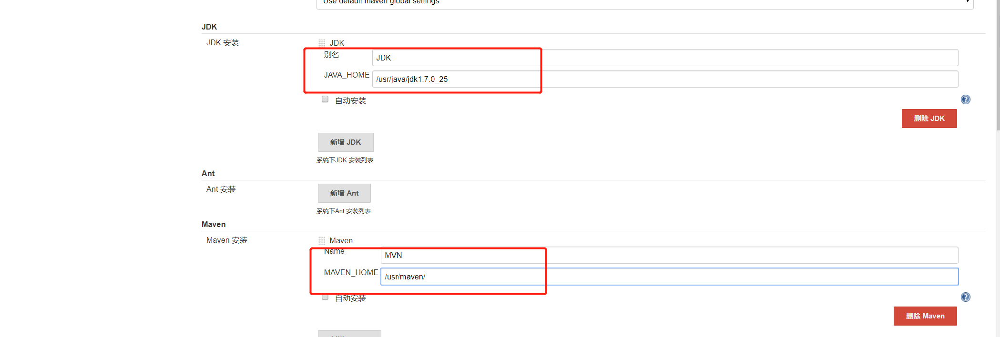

# Jenkins持续集成企业实战

## Jenkins持续集成企两种网站部署的流程
一：传统网站部署

传统的网站部署，大家在运维过程中，网站部署是运维的工作之一，网站部署的流程大致分为：

 

需求分析—原型设计—开发代码—提交测试—内网部署—确认上线—备份数据—外网更新-最终测试，

如果发现外网部署的代码有异常，需要及时回滚。（如下图所示）


二：主流网站部署的流程

目前主流网站部署方法，通过Hudson/Jenkins工具平台实现全自动部署+测试，是一个可扩展的持续集成引擎，是一个开源软件项目，旨在提供一个开放易用的软件平台，使软件的持续集成变成可能。Jenkins非常易于安装和配置，简单易用。
 
简单来说方便如下人员：
```
1)开发人员：写好代码，不需要自己进行源码编译、打包等工作，直接将代码分支存放在SVN、GIT仓库即可。
2)运维人员：减轻人工干预的错误率，同时解放运维人员繁杂的上传代码、手动备份、更新。
3)测试人员：可以通过jenkins进行简单的代码及网站测试。
```


## Jenkins持续集成简介及安装
持续集成(Continuous Integration)是一种软件开发实践，对于提高软件开发效率并保障软件开发质量提供了理论基础。Jenkins 是一个开源软件项目，旨在提供一个开放易用的软件平台，使持续集成变成可能。本文正是从持续集成的基本概念入手，通过具体实例，介绍了如何基于 Jenkins 快速搭建持续集成环境。

Jenkins是一个可扩展的持续集成引擎，是一个开源软件项目，旨在提供一个开放易用的软件平台，使软件的持续集成变成可能。Jenkins非常易于安装和配置，简单易用。

持续集成意义
```
1)持续集成中的任何一个环节都是自动完成的，无需太多的人工干预，有利于减少重复过程以节省时间、费用和工作量；    
2)持续集成保障了每个时间点上团队成员提交的代码是能成功集成的。换言之，任何时间点都能第一时间发现软件的集成问题，使任意时间发布可部署的软件成为了可能；
3)持续集成还能利于软件本身的发展趋势，这点在需求不明确或是频繁性变更的情景中尤其重要，持续集成的质量能帮助团队进行有效决策，同时建立团队对开发产品的信心。
```    

持续集成组件
```
1)一个自动构建过程，包括自动编译、分发、部署和测试；
2)一个代码存储库，即需要版本控制软件来保障代码的可维护性，同时作为构建过程的素材库，例如SVN、GIT代码库；
3)一个jenkins持续集成服务器(123.57.11.203服务器就是一个配置简单和使用方便的持续集成服务器)
```    

### Jenkins安装部署

地址http://mirrors.jenkins-ci.org/下载适合的Jenkins版本。
Linux稳定版的Jenkins地址为：http://updates.jenkins-ci.org/download/war/1.651.2/jenkins.war

由于Jenkins属于一个JAVA 代码，需要java容器才能运行jenkins，所以需要安装JDK+Tomcat，方法如下：

#### JAVA JDK安装
```
下载相应的jdk软件包，然后解压安装，我这里包名称为：jdk-7u25-linux-x64.tar.gz   
yum install lrzsz nmap tree dos2unix net-tools nc -y
tar -xzf  jdk-7u25-linux-x64.tar.gz;mkdir -p /usr/java/;mv jdk1.7.0_25/ /usr/java/

#然后配置环境变量，这样可以任何地方引用jdk，如下配置：

#vi /etc/profile 最后面加入以下语句：

export JAVA_HOME=/usr/java/jdk1.7.0_25
export CLASSPATH=$CLASSPATH:$JAVA_HOME/lib:$JAVA_HOME/jre/lib
export PATH=$JAVA_HOME/bin:$JAVA_HOME/jre/bin:$PATH:$HOMR/bin

source /etc/profile   #使环境变量马上生效
java  -version    #查看java版本，看到jdk1.7.0_25版本即代表java jdk安装成功。
```   
    
#### Tomcat安装配置
```
#官方网站下载tomcat 8.5.53或者其他版本：
wget https://mirrors.tuna.tsinghua.edu.cn/apache/tomcat/tomcat-8/v8.5.53/bin/apache-tomcat-8.5.53.tar.gz
tar zxvf apache-tomcat-8.5.53.tar.gz 


#直接解压就可以使用，解压完成执行：
mv apache-tomcat-8.5.53 /usr/local/tomcat

把得到的war包直接扔到tomcat下webapps/ROOT/下，启动tomcat，Jenkins就安装完毕！
rm -rf /usr/local/tomcat/webapps/*;
mkdir -p /usr/local/tomcat/webapps/ROOT/;
mv jenkins.war /usr/local/tomcat/webapps/ROOT/;
jar -xvf jenkins.war;rm -rf jenkins.war 
sh /usr/local/tomcat/bin/startup.sh 
ps aux | grep tomcat
```
通过客户端浏览器访问Jenkins服务器`IP + 8080端口`


### 使用Docker部署Jenkins
``` 
docker run -p 8080:8080 -p 50000:50000 jenkins
```
Jenkins容器启动成功后，可以打开浏览器访问8080端口，查看Jenkins管理界面，如图：


目前运行的容器中，数据会存储在工作目录 /var/jenkins_home中，这包括Jenkins中所有的数据，如插件和配置信息等。
如果需要数据持久化，可以使用数据卷机制：
``` 
docker run -d -p 8080:8080 -p 50000:50000 -v /home/jenkins:/var/jenkins_home jenkins
```
以上指令会将Jenkins数据存储于宿主机的/home/jenkins目录，（需要确保/home/jenkins目录对于容器内的Jenkins用户是可访问的）下。
当然也可以使用数据卷容器:
``` 
docker run --name myjenkins -p 8080:8080 -p 50000:50000 -v /var/jenkins_home jenkins
```

查看jenkins的密码：
``` 
[root@keepalived-master jenkins]# docker exec 3b180 cat /var/jenkins_home/secrets/initialAdminPassword
0e963cda1f3e479ca0e5a20a47e0157c
```


## Jenkins相关概念
要熟练掌握Jenkins持续集成的配置，使用和管理，需要了解相关概念，例如代码的开发、编译、打包、构建等相关概念

常见的代码相关概念包括：
 `Eclipse、Maven、POM、ant、make、Jenkins等`
```
1)Eclipse 是一个开放源代码的、基于Java的可扩展开发平台。就其本身而言，它只是一个框架和一组服务，用于通过插件组件构建开发环境。幸运的是，Eclipse 附带了一个标准的插件集，包括Java开发工具（Java Development Kit，JDK）。
2)Maven项目对象模型POM (Project Object Model)，可以通过一小段描述信息来管理项目的构建，报告和文档的软件项目管理工具。Maven 除了以程序构建能力为特色之外，还提供高级项目管理工具。
3)POM是Maven项目中的文件，使用XML表示，名称叫做pom.xml。在Maven中，当谈到Project的时候，不仅仅是一堆包含代码的文件。一个Project往往包含一个配置文件，包括了与开发者有关的，缺陷跟踪系统，组织与许可，项目的URL，项目依赖，以及其他。它包含了所有与这个项目相关的东西。事实上，在Maven世界中，project可以什么都没有，甚至没有代码，但是必须包含pom.xml文件。
4)由于 Maven 的缺省构建规则有较高的可重用性，所以常常用两三行 Maven 构建脚本就可以构建简单的项目。由于 Maven 的面向项目的方法，许多 Apache Jakarta 项目发文时使用 Maven，而且公司项目采用 Maven 的比例在持续增长。
```

## Jenkins平台设置
    安装JDK及MAVEN工具,并在Jenkins平台进行设置,如下步骤：
    



Jenkins系统设置完毕，开始创建JOB工程。具体步骤如下


创建完JOB任务，需要对任务进行配置，如下图所示


因为我们使用SVN管理源码，所以这里选择Subversion，并在Repository URL中输入我们的SVN地址：

svn://123.57.11.203:8801/edu/

输入SVN库的URL地址后，Jenkins会自动验证地址，并给予提示。


参考如下：
http://www.cnblogs.com/maxtgood/p/7743078.html