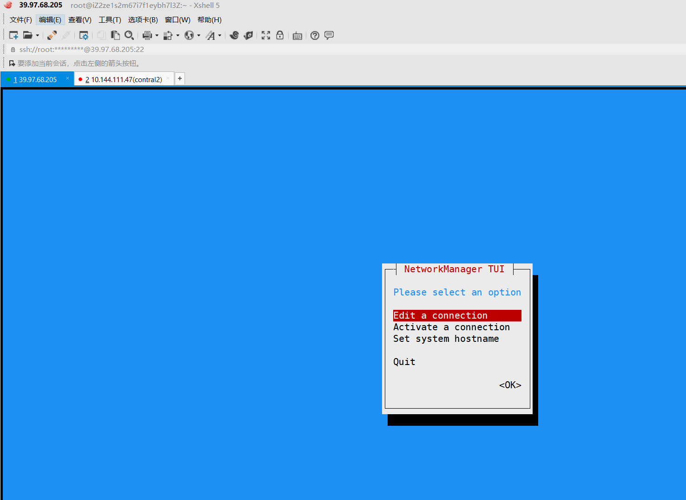
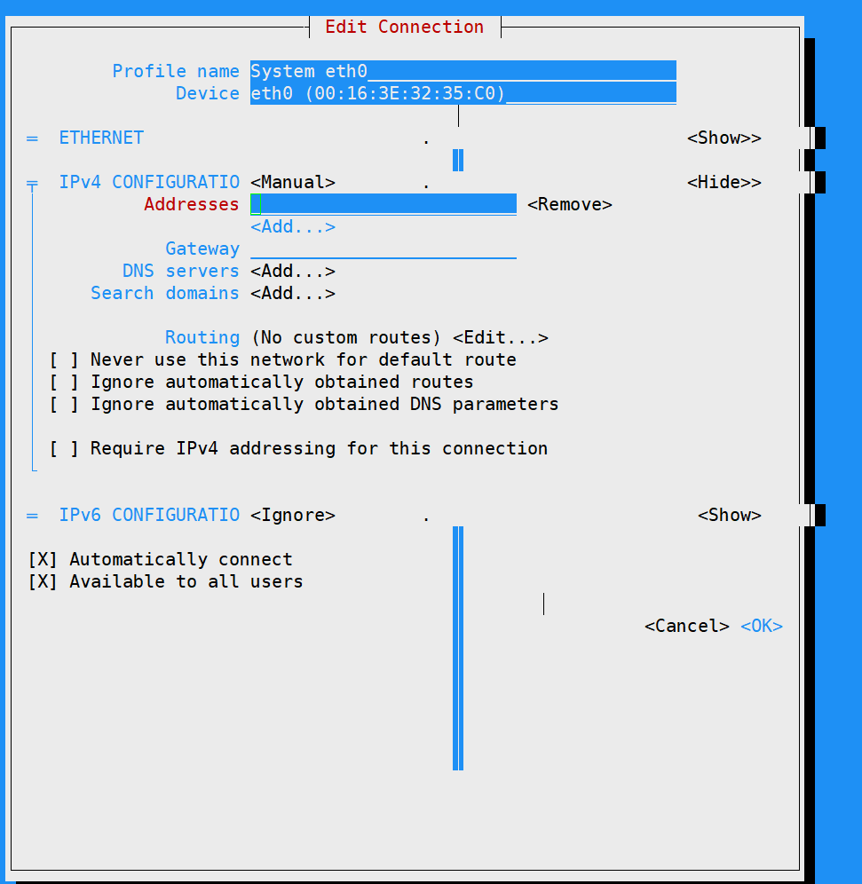

# nmtui图形配置网络服务

## 使用nmtui命令来配置网络

安裝nmtui

```
nmcli安装命令：
yum install NetworkManager

nmtui安装命令：
yum install NetworkManager-tui
```

``` 
nmtui
```





把网络IPv4的配置方式改成Manual（手动）


使用Vim编辑器将网卡配置文件中的ONBOOT参数修改成yes


``` 
[root@linuxprobe ~]# vim /etc/sysconfig/network-scripts/ifcfg-eno16777736 
TYPE=Ethernet 
BOOTPROTO=none 
DEFROUTE=yes 
IPV4_FAILURE_FATAL=no 
IPV6INIT=yes 
IPV6_AUTOCONF=yes 
IPV6_DEFROUTE=yes 
IPV6_FAILURE_FATAL=no 
NAME=eno16777736 
UUID=ec77579b-2ced-481f-9c09-f562b321e268 
ONBOOT=yes 
IPADDR0=192.168.10.10 
HWADDR=00:0C:29:C4:A4:09 
PREFIX0=24 
IPV6_PEERDNS=yes 
IPV6_PEERROUTES=yes
```

## 双网卡绑定
* 网卡1配置
``` 
[root@linuxprobe ~]# vim /etc/sysconfig/network-scripts/ifcfg-eno16777736 
TYPE=Ethernet 
BOOTPROTO=none 
ONBOOT=yes 
USERCTL=no 
DEVICE=eno16777736 
MASTER=bond0 
SLAVE=yes
```

* 网卡2配置
``` 
[root@linuxprobe ~]# vim /etc/sysconfig/network-scripts/ifcfg-eno33554968 
TYPE=Ethernet 
BOOTPROTO=none 
ONBOOT=yes 
USERCTL=no 
DEVICE=eno33554968 
MASTER=bond0 
SLAVE=yes
```

还需要将绑定后的设备命名为bond0并把IP地址等信息填写进去，
这样当用户访问相应服务的时候，实际上就是由这两块网卡设备在共同提供服务。

```
[root@linuxprobe ~]# vim /etc/sysconfig/network-scripts/ifcfg-bond0 
TYPE=Ethernet 
BOOTPROTO=none 
ONBOOT=yes 
USERCTL=no 
DEVICE=bond0 
IPADDR=192.168.10.10 
PREFIX=24 
DNS=192.168.10.1 
NM_CONTROLLED=no
```

让Linux内核支持网卡绑定驱动。
常见的网卡绑定驱动有三种模式——mode0、mode1和mode6。下面以绑定两块网卡为例，讲解使用的情景

``` 
mode0（平衡负载模式）：平时两块网卡均工作，且自动备援，但需要在与服务器本地网卡相连的交换机设备上进行端口聚合来支持绑定技术。 
mode1（自动备援模式）：平时只有一块网卡工作，在它故障后自动替换为另外的网卡。 
mode6（平衡负载模式）：平时两块网卡均工作，且自动备援，无须交换机设备提供辅助支持。

```

```  
比如有一台用于提供NFS或者samba服务的文件服务器，它所能提供的最大网络传输速度为100Mbit/s，
但是访问该服务器的用户数量特别多，那么它的访问压力一定很大。
在生产环境中，网络的可靠性是极为重要的，而且网络的传输速度也必须得以保证。
针对这样的情况，比较好的选择就是mode6网卡绑定驱动模式了。
因为mode6能够让两块网卡同时一起工作，当其中一块网卡出现故障后能自动备援，
且无需交换机设备支援，从而提供了可靠的网络传输保障。
```
```
比如有一台用于提供NFS或者samba服务的文件服务器，它所能提供的最大网络传输速度为100Mbit/s，
但是访问该服务器的用户数量特别多，那么它的访问压力一定很大。
在生产环境中，网络的可靠性是极为重要的，而且网络的传输速度也必须得以保证。
针对这样的情况，比较好的选择就是mode6网卡绑定驱动模式了。
因为mode6能够让两块网卡同时一起工作，当其中一块网卡出现故障后能自动备援，且无需交换机设备支援，
从而提供了可靠的网络传输保障。
```


出现故障时自动切换的时间为100毫秒
``` 
[root@linuxprobe ~]# vim /etc/modprobe.d/bond.conf 
alias bond0 bonding 
options bond0 miimon=100 mode=6
```
重启网络服务后网卡绑定操作即可成功。


正常情况下只有bond0网卡设备才会有IP地址等信息

```  
systemctl restart network

```
长ping服务器，进行网卡shutdown操作，查看网卡连通性是否正常。
