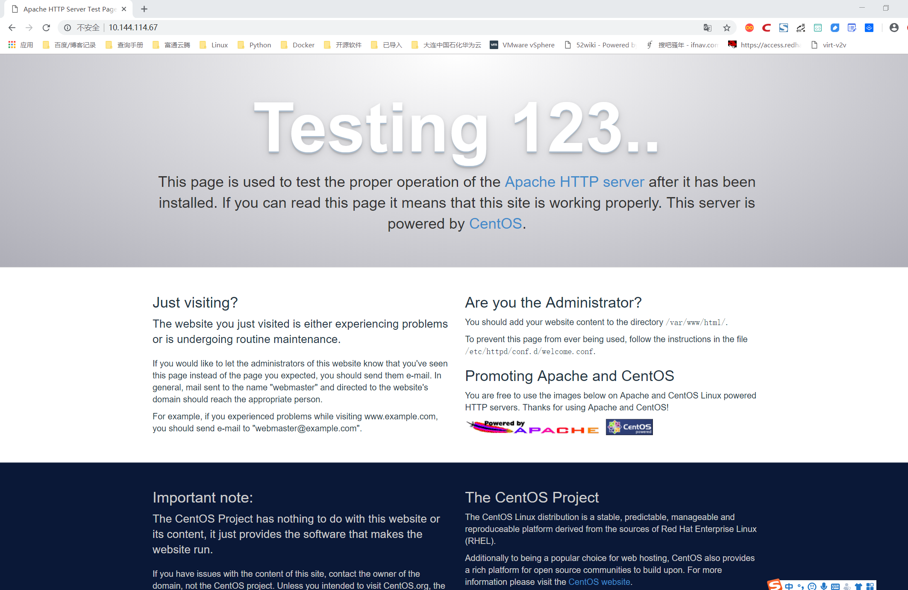
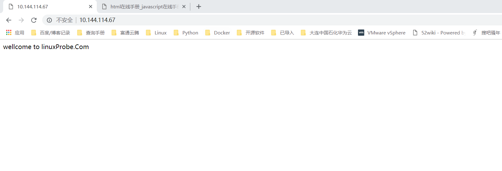

# Apache服务源码搭建
Apache 是世界使用排名第一的 Web 服务器软件。

	它可以运行在几乎所有广泛使用的计算机平台上，由于其跨平台和安全性被广泛使用，是最流行的 Web 服务器端软件之一。
	Apache HTTP Server（简称 Apache）是 Apache 软件基金会的一个开放源码的网页
	服务器，可以在大多数计算机操作系统中运行，由于其多平台和安全性被广泛使用，是最流
	行的 Web 服务器端软件之一。它快速、可靠并且可通过简单的 API 扩展，将 Perl/Python
	等解释器编译到服务器中。


    Apache HTTP 服务器是一个模块化的服务器，源于 NCSAhttpd 服务器，经过多次修
    改，成为世界使用排名第一的 Web 服务器软件。


    Apache 源于 NCSAhttpd 服务器，经过多次修改，成为世界上最流行的 Web 服务器
    软件之一。Apache 取自“a patchy server”的读音，意思是充满补丁的服务器，因为它
    是自由软件，所以不断有人来为它开发新的功能、新的特性、修改原来的缺陷。


## Apache 的特点
    简单、速度快、性能稳定，并可做代理服务器来使用。


prefork 的工作原理

	如果不用“——with-mpm”显式指定某种 MPM,prefork 就是 Unix 平台上缺省的
	MPM.它所采用的预派生子进程方式也是 Apache1.3 中采用的模式.prefork 本身并没有使
	用到线程,2.0版使用它是为了与1.3版保持兼容性;另一方面,prefork用单独的子进程来处理
	不同的请求,进程之间是彼此独立的,这也使其成为最稳定的 MPM 之一.
	prefork 的工作原理是,控制进程在最初建立“StartServers”个子进程后,为了满足
	MinSpareServers 设置的需要创建一个进程,等待一秒钟,继续创建两个,再等待一秒钟,继续
	创建四个……如此按指数级增加创建的进程数,最多达到每秒 32 个,直到满足
	MinSpareServers 设置的值为止.这就是预派生（prefork）的由来.这种模式可以不必在请
	求到来时再产生新的进程,从而减小了系统开销以增加性能.


worker 的工作原理

    相对于 prefork,worker 是 2.0 版中全新的支持多线程和多进程混合模型的 MPM.由于
    使用线程来处理,所以可以处理相对海量的请求,而系统资源的开销要小于基于进程的服务器.
    但是,worker 也使用了多进程,每个进程又生成多个线程,以获得基于进程服务器的稳定性.这
    种 MPM 的工作方式将是 Apache2.0 的发展趋势.
    
    worker 的工作原理是,由主控制进程生成“StartServers”个子进程,每个子进程中包含
    固定的 ThreadsPerChild 线程数,各个线程独立地处理请求.同样,为了不在请求到来时再生
    成线程,MinSpareThreads 和 MaxSpareThreads 设置了最少和最多的空闲线程数;而
    MaxClients 设置了所有子进程中的线程总数.如果现有子进程中的线程总数不能满足负载,
    控制进程将派生新的子进程.


Worker 模式下所能同时处理的请求总数 是由子进程总
数乘以 ThreadsPerChild 值决定的,应该大于等于 MaxClients.如果负载很大,现有的子进程
数不能满足时,控制进程会派生新的子进程.默认最大的子进程总数是 16,加大时也需要显式
声明 ServerLimit（最大值是 20000）
需要注意的是,如果显式声明了 ServerLimit,那么它乘以 ThreadsPerChild 的值必须大于等
于 MaxClients,而且 MaxClients 必须是 ThreadsPerChild 的整数倍,否则 Apache 将会自
动调节到一个相应值（可能是个非期望值）.
    
    在大多数平台上，Prefork MPM 在效率上要比 Worker MPM 要高，但是内存使用大
    得多。
    
    prefork 的无线程设计在某些情况下将比 worker 更有优势：它可以使用那些没有处
    理好线程安全的第三方模块，并且对于那些线程调试困难的平台而言，它也更容易调试一些。
    
    Worker 模式：Worker MPM 使用多个子进程，每个子进程有多个线程。每个线程在
    某个确定的时间只能维持一个连接。通常来说，在一个高流量的 HTTP 服务器上，Worker
    MPM 是个比较好的选择，因为 Worker MPM 的内存使用比 Prefork MPM 要低得多。


    Worker MPM 也由不完善的地方，如果一个线程崩溃，整个进程就会连同其所有线程
    一起"死掉".由于线程共享内存空间，所以一个程序在运行时必须被系统识别为"每个线程都
    是安全的"。


## Apache 源码安装编译配置

```
wget http://mirrors.hust.edu.cn/apache/httpd/httpd-2.4.38.tar.gz
tar xf httpd-2.4.38.tar.gz 
yum -y install apr apr-util apr-devel apr-util-devel pcre*
cd httpd-2.4.38
./configure --prefix=/usr/local/apache2 --enable-rewrite --enable-so
make && make install

#启动apache服务
[root@iZ2zedqzq67rmpf60igjz6Z httpd-2.4.38]# /usr/local/apache2/bin/apachectl start

# 临时关闭SELinux和firewalld防火墙
[root@k8s-master httpd-2.4.38]# setenforce 0
[root@k8s-master httpd-2.4.38]# systemctl stop firewalled.service


#查看进程
[root@iZ2zedqzq67rmpf60igjz6Z httpd-2.4.38]# ps aux | grep httpd
root     22504  0.0  0.0  74924  2392 ?        Ss   12:29   0:00 /usr/local/apache2/bin/httpd -k start
daemon   22505  0.0  0.0 363888  4268 ?        Sl   12:29   0:00 /usr/local/apache2/bin/httpd -k start
daemon   22506  0.0  0.0 363888  4268 ?        Sl   12:29   0:00 /usr/local/apache2/bin/httpd -k start
daemon   22507  0.0  0.0 429424  4260 ?        Sl   12:29   0:00 /usr/local/apache2/bin/httpd -k start
root     22593  0.0  0.0 112708   980 pts/0    S+   12:29   0:00 grep --color=auto httpd
[root@iZ2zedqzq67rmpf60igjz6Z httpd-2.4.38]# netstat -tnl| grep 80
tcp        0      0 0.0.0.0:80              0.0.0.0:*               LISTEN     


[root@iZ2zedqzq67rmpf60igjz6Z httpd-2.4.38]# yum -y install lsof

[root@iZ2zedqzq67rmpf60igjz6Z httpd-2.4.38]# lsof -i:80
COMMAND     PID   USER   FD   TYPE DEVICE SIZE/OFF NODE NAME
AliYunDun  3605   root   21u  IPv4  24349      0t0  TCP iZ2zedqzq67rmpf60igjz6Z:38072->100.100.30.25:http (ESTABLISHED)
httpd     22504   root    3u  IPv4 130564      0t0  TCP *:http (LISTEN)
httpd     22505 daemon    3u  IPv4 130564      0t0  TCP *:http (LISTEN)
httpd     22506 daemon    3u  IPv4 130564      0t0  TCP *:http (LISTEN)
httpd     22507 daemon    3u  IPv4 130564      0t0  TCP *:http (LISTEN)

#源码包安装 Apache 默认发布目录为:/usr/local/apache2/htdocs/下。

```

## yum安装apache
``` 
yum -y install httpd

#启用httpd服务程序并将其加入到开机启动项中，使其能够随系统开机而运行，从而持续为用户提供Web服务：
systemctl start httpd
systemctl enable httpd

```



* 配置文件目录
```  
[root@host-10-144-114-67 admin]# rpm -qc httpd
/etc/httpd/conf.d/autoindex.conf
/etc/httpd/conf.d/userdir.conf
/etc/httpd/conf.d/welcome.conf
/etc/httpd/conf.modules.d/00-base.conf
/etc/httpd/conf.modules.d/00-dav.conf
/etc/httpd/conf.modules.d/00-lua.conf
/etc/httpd/conf.modules.d/00-mpm.conf
/etc/httpd/conf.modules.d/00-proxy.conf
/etc/httpd/conf.modules.d/00-systemd.conf
/etc/httpd/conf.modules.d/01-cgi.conf
/etc/httpd/conf/httpd.conf
/etc/httpd/conf/magic
/etc/logrotate.d/httpd
/etc/sysconfig/htcacheclean
/etc/sysconfig/httpd

```


```
配置文件的名称                 存放位置        
服务目录                      /etc/httpd 
主配置文件                    /etc/httpd/conf/httpd.conf 
网站数据目录                  /var/www/html 
访问日志                      /var/log/httpd/access_log 
错误日志                      /var/log/httpd/error_log
```


``` 
DocumentRoot参数用于定义网站数据的保存路径，
其参数的默认值是把网站数据存放到/var/www/html目录中；
而当前网站普遍的首页面名称是index.html，因此可以向/var/www/html目录中写入一个文件，
替换掉httpd服务程序的默认首页面，该操作会立即生效。
```

    [root@host-10-144-114-67 html]# echo "wellcome to linuxProbe.Com" > /var/www/html/index.html^C
    [root@host-10-144-114-67 html]# chmod 755 /var/www/html/index.html 




### 建立网站目录，保存首页
    [root@host-10-144-114-67 html]# mkdir /home/wwwroot
    [root@host-10-144-114-67 html]# echo "The New Web Directory" > /home/wwwroot/index.html


    [root@host-10-144-114-67 html]# vim /etc/httpd/conf/httpd.conf 
    119 DocumentRoot "/home/wwwroot"
    120 
    121 #
    122 # Relax access to content within /var/www.
    123 #
    124 <Directory "/home/wwwroot">
    125     AllowOverride None
    126     # Allow open access:
    127     Require all granted
    128 </Directory>
    129 
    chmod -Rf 755 /home/wwwroot/*
    
    # 重启Apache服务，重新加载配置文件
    systemctl restart httpd


## 基于端口号访问虚拟主机网站

    [root@host-10-144-114-67 admin]# vim /etc/httpd/conf/httpd.conf 
     41 #Listen 12.34.56.78:80
     42 Listen 80
     43 Listen 6111
     44 Listen 6222


    在httpd服务的配置文件中大约113行处开始，分别追加写入两个基于端口号的虚拟主机网站参数，然后保存并退出。
    记得需要重启httpd服务，这些配置才生效。
    
    [root@host-10-144-114-67 admin]# vim /etc/httpd/conf/httpd.conf 
    114 <VirtualHost 10.144.114.67:6111>
    115 DocumentRoot "/home/wwwroot/6111"
    116 ServerName www.linuxprobe.com
    117 <Directory "/home/wwwroot/6111">
    118 AllowOverride None
    119 Require all granted
    120 </Directory>
    121</VirtualHost>
    121 #
    122 <VirtualHost 10.144.114.67:6222>
    123 DocumentRoot "/home/wwwroot/6222"
    124 ServerName bbs.linuxprobe.com
    125 <Directory "/home/wwwroot/6222">
    126 AllowOverride None
    127 Require all granted
    128 </Directory>
    129</VirtualHost>
    
    chmod -Rf 755 /home/wwwroot/*
    
    # 重启Apache服务，重新加载配置文件
    systemctl restart httpd
    
    [root@host-10-144-114-67 admin]# netstat -tunpl| grep 6111
    tcp6       0      0 :::6111                 :::*                    LISTEN      5819/httpd          
    [root@host-10-144-114-67 admin]# netstat -tunpl| grep 6222
    tcp6       0      0 :::6222                 :::*                    LISTEN      5819/httpd  

* 使用浏览器访问ip：端口


## Apache的访问控制

```  
Apache可以基于源主机名、源IP地址或源主机上的浏览器特征等信息对网站上的资源进行访问控制。
它通过Allow指令允许某个主机访问服务器上的网站资源，通过Deny指令实现禁止访问。
在允许或禁止访问网站资源时，还会用到Order指令，这个指令用来定义Allow或Deny指令起作用的顺序，
其匹配原则是按照顺序进行匹配，若匹配成功则执行后面的默认指令。
比如“Order Allow, Deny”表示先将源主机与允许规则进行匹配，若匹配成功则允许访问请求，反之则拒绝访问请求。
```
* 这段规则的含义是允许使用Firefox浏览器的主机访问服务器上的首页文件，除此之外的所有请求都将被拒绝。


        vim /etc/httpd/conf/httpd.conf
        141 <Directory "/var/www/html/server">
        142     #AllowOverride None
        143     SetEnvIf User-Agent "Firefox" ff=1
        144     Order allow,deny
        145     Allow from env=ff
        146     # Allow open access:
        147     #Require all granted
        148 </Directory>
    
    #重启httpd服务
    [root@host-10-144-114-67 admin]# systemctl restart httpd

* 只允许10.144.65.102这台机器单独访问

```
[root@host-10-144-114-67 admin]# vim /etc/httpd/conf/httpd.conf 
141 <Directory "/var/www/html/server">
142     #AllowOverride None
143     #SetEnvIf User-Agent "Firefox" ff=1
144     Order allow,deny
145     Allow from 10.144.65.102
146     Order allow,deny
147     Allow from env=ie
148     #Allow from env=ff
149     # Allow open access:
150     #Require all granted
151 </Directory>

#重启Apache服务
systemctl restart httpd
```

##  整合Apache和Tomcat构建一个Java/JSP运行平台


### Apache与Tomcat整合的必要性

通过整合可以实现以下几个功能。

```
客户端请求静态页面时，由Apache服务器响应请求。
客户端请求动态页面时，则由Tomcat服务器响应请求。
通过Apache信息过滤，实现网站动、静页面分离，保证了应用的可扩展性和安全性。
```

### Apache与Tomcat以及JK模块的安装

#### 1.安装Apache

Apache目前有几种主要版本，包括2.2.x版本、2.4.x版本等，在 1.3.x以前的版本中通常取名以Apache开头，2.x以后版本则用httpd开头来命名。

Apache的官方地址为http://httpd.apache.org/，这里以源码的方式进行安装，我们下载的版本是httpd-2.2.29，下载后的压缩包文件为httpd-2.2.29.tar.gz。

下面是具体的编译、安装过程。

```
[root@webserver ～]# yum install zlib zlib-devel
[root@webserver ～]#tar -zxvf  httpd-2.2.29.tar.gz
[root@webserver ～]#cd httpd-2.2.29
[root@webserver ～]#./configure --prefix=/usr/local/apache2 \ --enable-modules=most  \
--enable-mods-shared=all  \
--enable-so  \
[root@webserver ～]#make
[root@webserver ～]#make install
```

这里设定Apache的安装路径为/usr/local/apache2，“--enable-modules=most”表示将大部分模块静态编译到httpd二进制文件中，“--enable-mods-shared=all”表示动态加载所有模块，如果去掉-shared，就会静态加载所有模块。

#### 2.安装Tomcat

Tomcat的官方地址http://tomcat.apache.org/。这里以二进制文件方式安装，我们只须下载对应的二进制版本即可，这里使用的版本是 Tomcat 7.0.62。下载后的压缩包文件为apache-tomcat-7.0.62.tar.gz，把此安装包放到/usr/local目录下，通过解压即可完成Tomcat的安装。

基本步骤如下。

```
[root@webserver  local]#tar -zxvf apache-tomcat-7.0.62.tar.gz
[root@webserver  local]#mv apache-tomcat-7.0.62  tomcat7.0.62
```

由于解压后的目录名字太长，不易操作，因此可以直接将解压后的目录重命名为适合记忆的名字，这里将 apache-tomcat-7.0.62 重命名为 tomcat7.0.62，软件名称加上软件版本的格式便于记忆。

#### 3.安装JDK

在Tomcat运行环境下，JDK是必不可少的软件，因为Tomcat只是一个Servlet/JSP容器，底层的操作都需要JDK来完成。

JDK的安装也非常简单，只需到http://www.oracle.com/technetwork/java/index.html下载对应的JDK即可。这里下载的版本是JDK 1.7，对应的文件为jdk-7u80-linux-x64.tar.gz。下载时将所需软件包文件保存在/usr/local目录下，安装步骤如下。

```
[root@webserver ～]#cd /usr/local
[root@webserver  local]#tar zxvf jdk-7u80-linux-x64.tar.gz
```

解压完成后，会在/usr/local/下产生一个jdk1.7.0_80目录，这个就是JDK的程序目录了。

```
[root@localhost local]# /usr/local/jdk1.7.0_80/bin/java -version
java version "1.7.0_80"
Java(TM) SE Runtime Environment (build 1.7.0_80-b15)
Java  HotSpot(TM)  64-Bit  Server  VM  (build  24.80-b11,  mixed  mode)
```

从上面的输出可以看出，JDK在Linux下运行正常，并且版本为1.7.0_80。

#### 4.安装JK模块

为了更灵活地使用mod_jk连接器，这里采用源码方式编译出所需要的JK模块，JK的源码可以从这个地址下载，http://tomcat.apache.org/download-connectors.cgi，但是不保证此连接永久有效，这里采用的JK版本为JK 1.2.40。

下载后的JK源码压缩包文件为tomcat-connectors-1.2.40-src.tar.gz，这里也将此压缩包放到/usr/local下，具体安装步骤如下。

```
[root@webserver ～]# yum install libtool autoconf
[root@webserver ～]# cd /usr/local/
[root@webserver  local]#  tar  xzvf  tomcat-connectors-1.2.40-src.tar.gz
[root@webserver local]# cd tomcat-connectors-1.2.40-src/native
[root@webserver  native]#chmod  755  buildconf.sh
[root@webserver native]# ./buildconf.sh
[root@webserver native]#./configure \ --with-apxs=/usr/local/apache2/bin/apxs

#这里指定的是Apache安装目录中apxs的位置
[root@webserver  native]#  make
[root@webserver  native]#  make  install
```

可以看到有mod_jk.so文件生成，这就是我们需要的JK连接器。默认情况下，JK模块会自动安装到/usr/local/apache2/modules目录下，如果没有自动安装到此目录，手动复制此文件到modules目录即可。

### Apache与Tomcat整合配置

....... 省略，自行百度一下。


​    