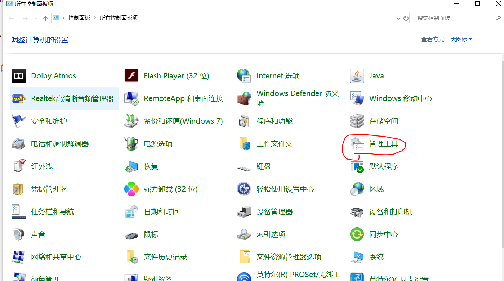
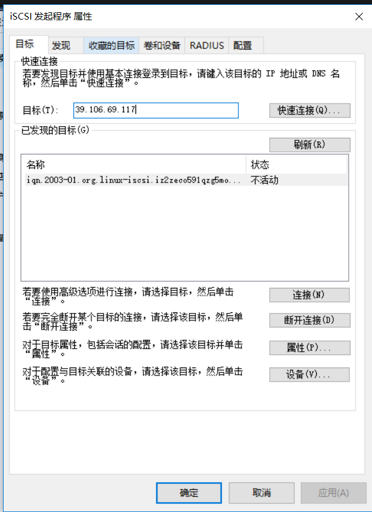
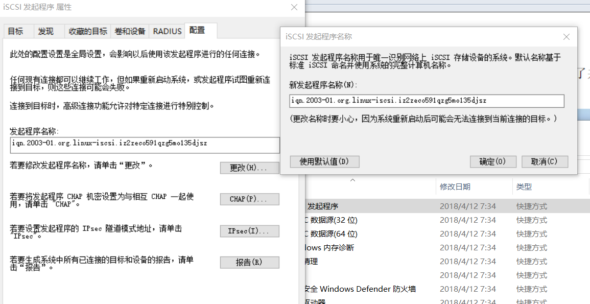

# 使用iSCSI服务部署网络存储

硬盘接口类型主要有IDE、SCSI和SATA

* IDE是一种成熟稳定、价格便宜的并行传输接口。
* SATA是一种传输速度更快、数据校验更完整的串行传输接口。 
* SCSI是一种用于计算机和硬盘、光驱等设备之间系统级接口的通用标准，具有系统资源占用率低、转速高、传输速度快等优点。


## 创建RAID磁盘阵列

    添加4块新硬盘，用于创建RAID 5磁盘阵列和备份盘


## iSCSI技术在工作形式上分为服务端（target）与客户端（initiator）。
    iSCSI服务端即用于存放硬盘存储资源的服务器，它作为前面创建的RAID磁盘阵列的存储端，
    能够为用户提供可用的存储资源。iSCSI客户端则是用户使用的软件，用于访问远程服务端的存储资源。


    [root@localhost ~]# mdadm -Cv /dev/md0 -n 3 -l 5 -x 1 /dev/sdb /dev/sdc /dev/sdd /dev/sde
    
    [root@localhost ~]# lsblk 
    NAME            MAJ:MIN RM  SIZE RO TYPE  MOUNTPOINT
    sda               8:0    0   40G  0 disk  
    ├─sda1            8:1    0  600M  0 part  /boot
    └─sda2            8:2    0 39.4G  0 part  
      ├─centos-root 253:0    0 37.4G  0 lvm   /
      └─centos-swap 253:1    0    2G  0 lvm   [SWAP]
    sdb               8:16   0   20G  0 disk  
    └─md0             9:0    0   40G  0 raid5 
    sdc               8:32   0   20G  0 disk  
    └─md0             9:0    0   40G  0 raid5 
    sdd               8:48   0   20G  0 disk  
    └─md0             9:0    0   40G  0 raid5 
    sde               8:64   0   20G  0 disk  
    └─md0             9:0    0   40G  0 raid5 
    sr0              11:0    1 1024M  0 rom 
        
    [root@localhost ~]# mdadm -D /dev/md0
    /dev/md0:
               Version : 1.2
         Creation Time : Mon Feb 11 19:11:50 2019
            Raid Level : raid5
            Array Size : 41908224 (39.97 GiB 42.91 GB)
         Used Dev Size : 20954112 (19.98 GiB 21.46 GB)
          Raid Devices : 3
         Total Devices : 4
           Persistence : Superblock is persistent
    
           Update Time : Mon Feb 11 19:12:56 2019
                 State : clean 
        Active Devices : 3
       Working Devices : 4
        Failed Devices : 0
         Spare Devices : 1
    
                Layout : left-symmetric
            Chunk Size : 512K
    
    Consistency Policy : resync
    
                  Name : localhost.localdomain:0  (local to host localhost.localdomain)
                  UUID : b4b2db91:e75feb5b:a4a007ec:128f0def
                Events : 18
    
        Number   Major   Minor   RaidDevice State
           0       8       16        0      active sync   /dev/sdb
           1       8       32        1      active sync   /dev/sdc
           4       8       48        2      active sync   /dev/sdd
    
           3       8       64        -      spare   /dev/sde


第1步：配置好Yum软件仓库后安装iSCSI服务端程序以及配置命令工具
        
        yum -y install targetd targetcli
        
        安装完成后启动iSCSI的服务端程序targetd，然后把这个服务程序加入到开机启动项中，以便下次在服务器重启后依然能够为用户提供iSCSI共享存储资源服务：
        [root@localhost ~]# systemctl start targetd
        [root@localhost ~]# systemctl enable targetd


​        
第2步：配置iSCSI服务端共享资源。

targetcli是用于管理iSCSI服务端存储资源的专用配置命令，
它能够提供类似于fdisk命令的交互式配置功能，将iSCSI共享资源的配置内容抽象成“目录”的形式，
我们只需将各类配置信息填入到相应的“目录”中即可。这里的难点主要在于认识每个“参数目录”的作用。
当把配置参数正确地填写到“目录”中后，iSCSI服务端也可以提供共享资源服务了。
``` 

#/backstores/block是iSCSI服务端配置共享设备的位置


[root@iZ2zeco591qzg5mo135djsZ ~]# targetcli
targetcli shell version 2.1.fb46
Copyright 2011-2013 by Datera, Inc and others.
For help on commands, type 'help'.

/backstores/block> ls
o- block ...................................................................................................... [Storage Objects: 0]
/backstores/block> cd /
/> ls
o- / ......................................................................................................................... [...]
  o- backstores .............................................................................................................. [...]
  | o- block .................................................................................................. [Storage Objects: 0]
  | o- fileio ................................................................................................. [Storage Objects: 0]
  | o- pscsi .................................................................................................. [Storage Objects: 0]
  | o- ramdisk ................................................................................................ [Storage Objects: 0]
  o- iscsi ............................................................................................................ [Targets: 0]
  o- loopback ......................................................................................................... [Targets: 0]
/> cd backstores/
/backstores> cd block 

#创建磁盘
/backstores/block> create disk0 /dev/vdb
Created block storage object disk0 using /dev/vdb.
/backstores/block> 


/backstores/block> cd /
/> ls
o- / ......................................................................................................................... [...]
  o- backstores .............................................................................................................. [...]
  | o- block .................................................................................................. [Storage Objects: 1]
  | | o- disk0 ......................................................................... [/dev/vdb (30.0GiB) write-thru deactivated]
  | |   o- alua ................................................................................................... [ALUA Groups: 1]
  | |     o- default_tg_pt_gp ....................................................................... [ALUA state: Active/optimized]
  | o- fileio ................................................................................................. [Storage Objects: 0]
  | o- pscsi .................................................................................................. [Storage Objects: 0]
  | o- ramdisk ................................................................................................ [Storage Objects: 0]
  o- iscsi ............................................................................................................ [Targets: 0]
  o- loopback ......................................................................................................... [Targets: 0]
/> 

```


​        
第3步：创建iSCSI target名称及配置共享资源。


iSCSI target名称是由系统自动生成的，这是一串用于描述共享资源的唯一字符串。
稍后用户在扫描iSCSI服务端时即可看到这个字符串，因此我们不需要记住它。
系统在生成这个target名称后，还会在/iscsi参数目录中创建一个与其字符串同名的新“目录”用来存放共享资源。
我们需要把前面加入到iSCSI共享资源池中的硬盘设备添加到这个新目录中，这样用户在登录iSCSI服务端后，
即可默认使用这硬盘设备提供的共享存储资源了。

``` 
/> cd iscsi 
/iscsi> create
Created target iqn.2003-01.org.linux-iscsi.iz2zeco591qzg5mo135djsz.x8664:sn.9d355b25c9be.
Created TPG 1.
Global pref auto_add_default_portal=true
Created default portal listening on all IPs (0.0.0.0), port 3260.
/iscsi> cd iqn.2003-01.org.linux-iscsi.iz2zeco591qzg5mo135djsz.x8664:sn.9d355b25c9be.
No such path /iscsi/iqn.2003-01.org.linux-iscsi.iz2zeco591qzg5mo135djsz.x8664:sn.9d355b25c9be.
/iscsi> cd iqn.2003-01.org.linux-iscsi.iz2zeco591qzg5mo135djsz.x8664:sn.9d355b25c9be
/iscsi/iqn.20....9d355b25c9be> ls
o- iqn.2003-01.org.linux-iscsi.iz2zeco591qzg5mo135djsz.x8664:sn.9d355b25c9be ............................................. [TPGs: 1]
  o- tpg1 ................................................................................................... [no-gen-acls, no-auth]
    o- acls .............................................................................................................. [ACLs: 0]
    o- luns .............................................................................................................. [LUNs: 0]
    o- portals ........................................................................................................ [Portals: 1]
      o- 0.0.0.0:3260 ......................................................................................................... [OK]
/iscsi/iqn.20....9d355b25c9be> cd tpg1/luns 
/iscsi/iqn.20...9be/tpg1/luns> create /backstores/block/disk0
Created LUN 0.

```


第4步：设置访问控制列表（ACL）。


iSCSI协议是通过客户端名称进行验证的，也就是说，用户在访问存储共享资源时不需要输入密码，
只要iSCSI客户端的名称与服务端中设置的访问控制列表中某一名称条目一致即可，
因此需要在iSCSI服务端的配置文件中写入一串能够验证用户信息的名称。
acls参数目录用于存放能够访问iSCSI服务端共享存储资源的客户端名称。
建议在后面追加上类似于:client的参数，这样既能保证客户端的名称具有唯一性，又非常便于管理和阅读：

``` 
/iscsi/iqn.20...9be/tpg1/luns> cd ../acls 
/iscsi/iqn.20...9be/tpg1/acls> create iqn.2003-01.org.linux-iscsi.iz2zeco591qzg5mo135djsz
Created Node ACL for iqn.2003-01.org.linux-iscsi.iz2zeco591qzg5mo135djsz
Created mapped LUN 0.

```


第5步：设置iSCSI服务端的监听IP地址和端口号。

位于生产环境中的服务器上可能有多块网卡，
那么到底是由哪个网卡或IP地址对外提供共享存储资源呢？
这就需要我们在配置文件中手动定义iSCSI服务端的信息，即在portals参数目录中写上服务器的IP地址。
接下来将由系统自动开启服务器172.17.0.124s的3260端口将向外提供iSCSI共享存储资源服务：

``` 
/iscsi/iqn.20.../tpg1/portals> create 172.17.0.124
Using default IP port 3260
Could not create NetworkPortal in configFS
/iscsi/iqn.20.../tpg1/portals> ls
o- portals ............................................................................................................ [Portals: 1]
  o- 0.0.0.0:3260 ............................................................................................................. [OK]
/iscsi/iqn.20.../tpg1/portals> delete 0.0.0.0 3260
Deleted network portal 0.0.0.0:3260
/iscsi/iqn.20.../tpg1/portals> create 172.17.0.124
Using default IP port 3260
Created network portal 172.17.0.124:3260.
 
```

第6步：配置妥当后检查配置信息，重启iSCSI服务端程序并配置防火墙策略。


在参数文件配置妥当后，可以浏览刚刚配置的信息，确保与下面的信息基本一致。
在确认信息无误后输入exit命令来退出配置。注意，千万不要习惯性地按Ctrl + C组合键结束进程，
这样不会保存配置文件，我们的工作也就白费了。
最后重启iSCSI服务端程序，再设置firewalld防火墙策略，使其放行3260/tcp端口号的流量。

``` 
/iscsi/iqn.20.../tpg1/portals> ls
o- portals ............................................................................................................ [Portals: 1]
  o- 172.17.0.124:3260 ........................................................................................................ [OK]
/iscsi/iqn.20.../tpg1/portals> ls /
o- / ......................................................................................................................... [...]
  o- backstores .............................................................................................................. [...]
  | o- block .................................................................................................. [Storage Objects: 1]
  | | o- disk0 ........................................................................... [/dev/vdb (30.0GiB) write-thru activated]
  | |   o- alua ................................................................................................... [ALUA Groups: 1]
  | |     o- default_tg_pt_gp ....................................................................... [ALUA state: Active/optimized]
  | o- fileio ................................................................................................. [Storage Objects: 0]
  | o- pscsi .................................................................................................. [Storage Objects: 0]
  | o- ramdisk ................................................................................................ [Storage Objects: 0]
  o- iscsi ............................................................................................................ [Targets: 1]
  | o- iqn.2003-01.org.linux-iscsi.iz2zeco591qzg5mo135djsz.x8664:sn.9d355b25c9be ......................................... [TPGs: 1]
  |   o- tpg1 ............................................................................................... [no-gen-acls, no-auth]
  |     o- acls .......................................................................................................... [ACLs: 1]
  |     | o- iqn.2003-01.org.linux-iscsi.iz2zeco591qzg5mo135djsz .................................................. [Mapped LUNs: 1]
  |     |   o- mapped_lun0 ................................................................................. [lun0 block/disk0 (rw)]
  |     o- luns .......................................................................................................... [LUNs: 1]
  |     | o- lun0 ...................................................................... [block/disk0 (/dev/vdb) (default_tg_pt_gp)]
  |     o- portals .................................................................................................... [Portals: 1]
  |       o- 172.17.0.124:3260 ................................................................................................ [OK]
  o- loopback ......................................................................................................... [Targets: 0]
/iscsi/iqn.20.../tpg1/portals> 

/iscsi/iqn.20.../tpg1/portals> exit
Global pref auto_save_on_exit=true
Last 10 configs saved in /etc/target/backup/.
Configuration saved to /etc/target/saveconfig.json
[root@iZ2zeco591qzg5mo135djsZ ~]# systemctl restart targetd
[root@iZ2zeco591qzg5mo135djsZ ~]# firewall-cmd --permanent --add-port=3260/tcp
FirewallD is not running
[root@iZ2zeco591qzg5mo135djsZ ~]# firewall-cmd --reload
FirewallD is not running


```
iSCSI服务端的配置至此全部完成。

### 配置Windows客户端


``` 
由于在iSCSI服务端程序上设置了ACL，
使得只有客户端名称与ACL策略中的名称保持一致时才能使用远程存储资源，
因此需要在“配置”选项卡中单击“更改”按钮，
把iSCSI发起程序的名称修改为服务端ACL所定义的名称
```






### 配置Linux客户端 

```shell
$ iscsiadm -m discovery -t st -p 192.168.5.174
192.168.5.174:3260,1 iqn.2020-06.supool.com:lun02
192.168.5.173:3260,1 iqn.2020-06.supool.com:lun02
192.168.5.175:3260,1 iqn.2020-06.supool.com:lun02


$ iscsiadm -m node -T iqn.2020-06.supool.com:lun02 -p 192.168.5.173:3260,1 --login

Logging in to [iface: default, target: iqn.2020-06.supool.com:lun02, portal: 192.168.5.173,3260] (multiple)
Login to [iface: default, target: iqn.2020-06.supool.com:lun02, portal: 192.168.5.173,3260] successful.

$ lsblk
NAME   MAJ:MIN RM  SIZE RO TYPE MOUNTPOINT
sda      8:0    0   80G  0 disk
├─sda1   8:1    0    2G  0 part /boot
├─sda2   8:2    0    8G  0 part [SWAP]
└─sda3   8:3    0   70G  0 part /
sdb      8:16   0    1T  0 disk
sr0     11:0    1 1024M  0 rom


$ file /dev/sdb
/dev/sdb: block special

# 查看到1TB数据我们不再进行分区，而是直接格式化并挂载使用。
# 格式化
[root@supool-10 vdbench_test]# mkfs.xfs /dev/sdb
meta-data=/dev/sdb               isize=512    agcount=4, agsize=67108864 blks
         =                       sectsz=4096  attr=2, projid32bit=1
         =                       crc=1        finobt=0, sparse=0
data     =                       bsize=4096   blocks=268435456, imaxpct=5
         =                       sunit=0      swidth=0 blks
naming   =version 2              bsize=4096   ascii-ci=0 ftype=1
log      =internal log           bsize=4096   blocks=131072, version=2
         =                       sectsz=4096  sunit=1 blks, lazy-count=1
realtime =none                   extsz=4096   blocks=0, rtextents=0
[root@supool-10 vdbench_test]# mkdir /iscsi
[root@supool-10 vdbench_test]# mount /dev/sdb /iscsi
[root@supool-10 vdbench_test]# df -h
Filesystem                   Size  Used Avail Use% Mounted on
devtmpfs                     2.0G     0  2.0G   0% /dev
tmpfs                        2.0G     0  2.0G   0% /dev/shm
tmpfs                        2.0G  9.8M  2.0G   1% /run
tmpfs                        2.0G     0  2.0G   0% /sys/fs/cgroup
/dev/sda3                     70G   29G   42G  42% /
/dev/sda1                    2.0G  168M  1.9G   9% /boot
tmpfs                        396M   12K  396M   1% /run/user/42
tmpfs                        396M     0  396M   0% /run/user/0
192.168.5.173:/vol/supool_d   33T  148M   33T   1% /mnt/nfs
/dev/sdb                     1.0T   33M  1.0T   1% /iscsi

# blkid 命令用于查看设备的名称、文件系统及 UUID
$ blkid | grep /dev/sdb
/dev/sdb: UUID="670faf91-f594-4655-91cf-c9dcea95b4d8" TYPE="xfs"

# 设置开机自动挂载
vim /etc/fstab
#
# /etc/fstab
# Created by anaconda on Wed May 4 19:26:23 2017
#
# Accessible filesystems, by reference, are maintained under '/dev/disk'
# See man pages fstab(5), findfs(8), mount(8) and/or blkid(8) for more info
#
/dev/mapper/rhel-root / xfs defaults 1 1
UUID=812b1f7c-8b5b-43da-8c06-b9999e0fe48b /boot xfs defaults 1 2
/dev/mapper /rhel-swap swap swap defaults 0 0
/dev/cdrom /media/cdrom iso9660 defaults 0 0
UUID=670faf91-f594-4655-91cf-c9dcea95b4d8 /iscsi xfs defaults,_ _netdev 0 0
```

如果我们不再需要使用 iSCSI 共享设备资源了，可以用 iscsiadm 命令的-u 参数将其设备卸载：

```shell
$ iscsiadm -m node -T iqn.2003-01.org.linux-iscsi.linuxprobe.x8664:sn.d497c356ad80 -u
```