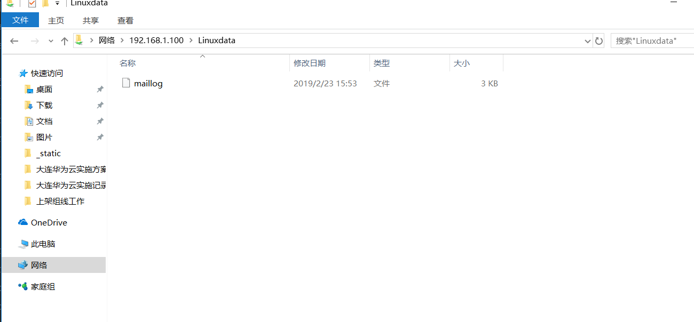

# Samba服务器搭建
## Samba的概念和功能
    Samba 是一个能让 Linux 系统应用 Microsoft 网络通信协议的软件。而 SMB 是 Server Message Block的缩写，即服务器消息块 ，SMB主要作为Microsoft的网络通信协议。后来Samba将SMB通信协议应用到了Linux系统上，就形成了现在的Samba软件。后来微软又把 SMB 改名为 CIFS（Common Internet File System，公共Internet文件系统），并且加入了许多新的功能，于是，Samba具有了更强大的功能。
    Samba 最大的功能就是可以用于 Linux 与 Windows 系统直接的文件共享和打印共享。Samba既可以用于Windows与Linux之间的文件共享，也可以用于Linux与Linux之间的资源共享。由于NFS（网络文件系统）可以很好地完成Linux与Linux之间的数据共享，因而Samba较多地用在了Linux与Windows之间的数据共享上面。
    SMB是基于客户机/服务器模型的协议，因而，一台Samba服务器既可以充当文件共享服务器，也可以充当一个Samba的客户端。例如，对于一台在Linux下已经架设好的Samba服务器，Windows客户端就可以通过SMB协议共享Samba服务器上的资源文件，同时，Samba服务器也可以访问网络中其他Windows系统或者Linux系统共享出来的文件。
    Samba在Windows下使用的是NetBIOS协议，如果要使用Linux下共享的文件，请确认Windows系统下是否安装了NetBIOS协议。

## Samba的安装与配置
这里的系统环境如下所示。

    操作系统：CentOS Linux release 7.1.1503
    Samba服务器IP地址：192.168.0.100
    Samba版本：samba-4.1.12-23.el7_1.x86_64
### 1.安装Samba
几乎所有的Linux发行版本中都默认自带了Samba软件包，登录系统，检查是否安装了Samba软件，执行如下操作。
    
    [root@localhost ～]# rpm -q samba
    samba-4.1.12-23.el7_1.x86_64
如果有显示，表示系统已经安装了Samba，如果没有任何显示，请从系统光盘中找到对应的Samba软件包，然后进行安装。
Samba的安装很简单，安装过程如下。
    
    [root@localhost ～]# yum -y install samba samba-client samba-common
Samba服务器安装完毕，会生成配置文件目录/etc/samba和其他一些Samba可执行命令工具，

    /etc/samba/smb.conf 是 Samba 的核心配置文件，
    /usr/lib/systemd/system/smb.service 是Samba的启动/关闭文件。

### 2.Samba服务的组成与使用

    Samba的运行有两个服务组成，一个是SMB，另一个是NMB。
    SMB是Samba的核心启动服务，只有SMB服务启动，才能实现文件的共享。
    而NMB服务是负责解析用的，类似于DNS实现的功能，NMB可以把Linux系统共享的工作组名称与其IP对应起来，如果NMB服务没有启动，就只能通过IP来访问共享文件。

例如，如果某台Samba服务器的IP地址为192.168.0.100，对应的工作组名称为ixdba，那么在Windows的IE浏览器地址栏中输入下面两条指令都可以访问共享文件。

其实这就是在Windows下查看Linux Samba服务器共享文件的方法。
   
    \\192.168.0.100\共享目录名称
    \\ixdba\共享目录名称

可以通过systemctl start/stop/restart smb来启动、关闭、重启SMB服务。启动SMB服务的操作如下所示。
   
    [root@localhost  system]#  systemctl  start  smb
    [root@localhost  system]#  ps  -ef|grep  smbd
    root     5315     1  0 15:44 ?       00:00:00 /usr/sbin/smbd
    root     5316  5315  0 15:44 ?       00:00:00 /usr/sbin/smbd
    root     5382  3037  0 15:50 pts/0   00:00:00 grep --color=auto smbd
从启动的输出中，可以看出，SMB服务包含一个父进程和一个子进程。

接下来详细讲述smb.conf文件的属性配置。
### 3.核心配置文件smb.conf
默认的 smb.conf 有很多个选项和内容，比较繁琐，这里从简单讲起，先备份自己的smb.conf文件，然后重新建立一个smb.conf，添加如下内容。
       
        [global]
        workgroup  =  IXDBA.NET
        netbios  name  =  ixdba
        server  string  =  My  Linux  Samba  Server
        log file = /var/log/samba/%m.log
        security  =  user
        map  to  guest  =Bad  User
         [Linuxdata]
                path = /ixdba/Linuxdata
                writeable  =  yes
                browseable  =  yes
                guest  ok  =  yes
    上面每行的解释如下。
    [global]表示以下内容为全局配置，为必选项。
    workgroup 用来定义工作组，也就是 Windows 中的工作组概念，这里设置为IXDBA.NET。
    netbios name用来定义Windows中显示出来的计算机名称。
    server string用来定义Samba服务器的说明信息，可以随便指定。
    log file用来定义Samba用户的日志文件，
    %m代表客户端主机名，Samba服务器会在指定的目录中为每个登录主机建立不同的日志文件。
    security用来定义数据共享的方式。此选项有多个可选值，常用的有user、share、server和domain，user表示需要密码验证后才能共享数据，share表示可以直接共享数据，无须输入密码。在Samba 4中share和server两个选项已经被禁用，如果要实现无密码登录，需要添加“security=user”和“map to guest =Bad User”两个选项。
    
    [Linuxdata]用来设定在Windows中显示出来的共享目录的名称。
    path用来指定共享的目录，为必选项。
    writeable用来设置是否可写，yes表示可写，no表示不可写。
    browseable用来定义是否可以在Windows工作组下看到共享文件夹，如果需要隐藏共享文件夹，选择no即可。
    guest ok用来定义匿名用户是否可以登录，如果security设置为user，此选项默认值为no。
### 4.建立共享目录
    上面设置了共享目录为/ixdba/Linuxdata，下面就需要建立/ixdba/Linuxdata目录。
        [root@localhost ～]# mkdir -p /ixdba/Linuxdata
        [root@localhost ～]# chown -R nobody:nobody /ixdba/Linuxdata
    因为要设置匿名用户可以下载或上传共享文件，所以要给/ixdba/Linuxdata 目录授予nobody权限。
        [root@localhost Linuxdata]# cp /root/install.log* /ixdba/Linuxdata
    上面的指令把一些测试文件复制到共享目录中。
### 5.重启SMB服务
    执行如下命令重启SMB服务。
        [root@localhost  samba]#  systemctl  restart  smb.service
        [root@localhost  samba]#  ps  -ef|grep  smb
        root     7290     1  0 17:49 ?       00:00:00 /usr/sbin/smbd
        root     7291  7290  0 17:49 ?       00:00:00 /usr/sbin/smbd
        
        
### 6.访问Samba服务器的共享文件
（1）在Windows下访问Samba服务器的共享文件

    在浏览器地址栏或者运行框中输入以下地址：
        \\192.168.60.231  或者 \\ixdba
    就看到打开共享目录了，这里的ixdba是smb.conf中netbios name选项定义的名

（2）在Linux下访问Samba服务器的共享文件

    在Linux作为客户端时，要查看其他Linux Samba服务器共享的文件，应该如何操作呢？这就要用到smbclient这个工具。系统默认自带了这个命令。
    smbclient常见用法介绍如下。
    1）查看Samba服务器的共享资料。
    
     smbclient  –L  //Samba服务器的IP地址  -U  Samba用户名
    “-L”即为list的含义，“-U”是user的意思。要建立一个Samba用户，需要通过Samba提供的命令pdbedit来实现。pdbedit用法如下。
        pdbedit –a 用户名
 需要注意的是，要建立的Samba用户必须先是系统用户。例如，要建立一个名为admin的Samba用户，操作如下。
        
        [root@localhost  samba]#  useradd  admin
        [root@localhost  samba]#  pdbedit  –a  admin
        new  password:
如果Samba服务器无密码即可访问，可以省略“-U Samba用户名”。
    例如：当Samba需要密码才能登录时，查看共享方法如下。
        
        [root@web ～]# smbclient  -L //192.168.60.231/Linuxdata –U admin
        Password:  在这里输入admin的密码
当Samba无密码即可访问时，执行如下命令。
        
        [root@web ～]# smbclient  -L //192.168.60.231/Linuxdata
        Password: 直接按Enter键即可
2）登录Samba服务器。
    如果需要在Linux客户端登录Samba服务器，用法如下。
        
        smbclient  //Samba服务器的IP地址  -U  Samba用户名
    
        请看下面执行的操作。
        [root@web samba]# smbclient  //192.168.60.231/Linuxdata
        Password:
        Enter  admin's  password:
        Domain=[IXDBA.NET]  OS=[Unix]  Server=[Samba  4.1.12].
        smb:  \>  ls
        smb: \> ?          #在这里输入"?"即可查看在smb命令行可用的所有命令

### 7将Samba服务器共享的目录挂载到一个Linux客户端，操作过程如下所示。
    [root@web /]# yum install cifs-utils cifs-utils-devel
    
    [root@web /]# mount -t cifs  -o username=admin,password=****** \
    >//192.168.60.231/Linuxdata  /samba
    Password:
    
    [root@web /]# df -Th|grep /samba
    //192.168.60.231/Linuxdata cifs     8.5G  5.0G  3.5G  60% /samba
    
    [root@web /]# uname -a
    Linux localhost.localdomain 3.10.0-229.el7.x86_64 #1 SMP Fri Mar 6 11:36:42 UTC 2015 x86_64 x86_64 x86_64 GNU/Linux

这里的操作系统环境为 CentOS 7.1 版本。在 CentOS 5.x 以前的版本中，
还存在一个smbmount命令，是专门用于挂载Samba共享数据用的，此命令从CentOS 5开始被取消。
例如，下面是在CentOS 4.x版本中的操作过程。
   
    [root@localhost ～]# uname -a
    Linux localhost 2.6.9-22.ELsmp #1 SMP Mon Sep 19 18:32:14 EDT 2005 i686 i686 i386 GNU/Linux
    [root@localhost ～]# smbmount  //192.168.60.231/Linuxdata /samba
    Password:
    [root@localhost ～]# df -Th|grep /samba
    //192.168.60.231/Linuxdata smbfs     8.5G  5.0G  3.5G  60% /samba
由此可见，Samba共享文件系统格式在CentOS 5.x以前版本称为smbfs，而从CentOS 5开始变为CIFS。

### 8.授权登录samba服务器
面介绍了Samba服务器匿名共享数据的设置方法。而在很多时候，
对共享的数据是需要进行权限控制的，也就是说，用户在访问Samba服务器时需要输入用户名和密码。下面就介绍如何配置有权限控制的Samba服务器。

（1）添加系统级用户

这里首先添加 ixdba1、ixdba2 两个系统级用户，
并分别指定工作目录为/ixdba/ixdba1 和/ixdba/ixdba2，操作如下。

    [root@localhost /]# useradd -d /ixdba/ixdba1 ixdba1
    [root@localhost /]# useradd -d /ixdba/ixdba2  -s  /sbin/nologin  ixdba2
    [root@localhost /]# cp -r /root/* /ixdba/ixdba1
    [root@localhost /]# cd /ixdba
    [root@localhost  ixdba]#  ll
    
    其中，useradd 是创建系统用户的命令，
    参数“-d”指定 ixdba1 用户的工作目录，而 ixdba1就是创建用户的名称，
    “-s”指定用户使用的默认shell，/sbin/nologin表示ixdba2是个虚拟用户，
    也就是ixdba2不能通过shell登录系统。
    
    
    这些概念在下面章节有详细的讲述，这里不再介绍。
    每当创建一个用户时，Linux系统都会在/etc/passwd文件中添加一行对应的用户名信息，
    这里仅仅用到的是/etc/passwd文件中的用户名信息，
    因此，不必对两个用户设置登录系统的密码。

（2）创建Samba登录用户
这里需要注意的是：系统用户是 Linux 上面对应的用户，
而 Samba 用户是客户端连接Samba 服务器时需要使用的用户。
创建 Samba 用户使用的命令有 pdbedit 和 smbpasswd。smbpasswd 的原理是通过读取/etc/passwd 文件中存在的用户名，
进而设置密码的，因此，对于系统用户，可以设置密码，也可以不设置密码。
如果设置密码，可以和对应的Samba用户密码相同，也可以不同。
下面分别为ixdba1和ixdba2设置Samba服务器的登录密码，操作如下。

        [root@localhost  samba]#  smbpasswd   -a  ixdba1
        New  SMB  password:
        Retype  new  SMB  password:
        Added  user  ixdba1.
        [root@localhost  samba]#  smbpasswd   -a  ixdba2
        New  SMB  password:
        Retype  new  SMB  password:
        Added  user  ixdba2.
        
这样设置完毕，就可以用ixdba1和ixdba2在客户端登录Samba服务器了。

（3）配置smb.conf文件
Samba配置的核心文件是smb.conf，设置好的配置文件如下。

    [global]
       workgroup  =  IXDBA.NET
       netbios  name  =  ixdba
       server  string  =  My  Linux  Samba  Server
       log file = /var/log/samba/%m.log
       max  log  size  =  50
    
       security  =  user
       encrypt  passwords  =  yes
       smb passwd file = /etc/samba/smbpasswd
       socket options = TCP_NODELAY SO_RCVBUF=8192 SO_SNDBUF=8192
       #interfaces = 192.168.1.254/24 192.168.2.254/24
       os  level  =  33
    [ixdba1]
        path = /ixdba/ixdba1
        comment  =  This  is  ixdba1
        valid  users  =  ixdba1
        writeable  =  yes
        browseable  =  yes
    [ixdba2]
         path = /ixdba/ixdba2
         comment  =  This  is  ixdba2
         valid  users  =  ixdba2
         create  mask  =   664
         directory  mask  =  775
         writeable  =  yes
         browseable  =  yes  
         
         
这段配置与上面那个例子基本相同，只是增加了一些权限控制的东西。
新增的各个选项的含义如下所示。

    max log size用来定义日志文件的大小，设置为0代表不做限制，默认单位是KB。
    encrypt passwords 用来设定用户密码是否加密，yes 表示需要加密，否则，不加密。由于现在的Windows系统都以加密形式发送 SMB/CIFS 密码，因此这里选择yes。
    smb passwd file用来指定Samba的密码文件。
    socket options用来设定Samba服务器和客户端之间会话的Socket选项值，此项的设置可以优化数据传输速度。
    os level用来设定Samba服务器的OS level，OS level的值为0～255，winNT的OS level为33，Windows 95/98的OS level是1，Samba服务器的OS level值至少要大于33。
    comment是对共享目录的说明文件，自己可以定义说明信息。
    valid users用来定义可以访问该Samba服务器的用户。
    create mask用来定义客户端用户创建文件的默认权限，664表示对用户来可读写，对用户组可读写，对其他用户仅仅有只读权限。
    directory mask用来定义客户端用户创建目录的默认权限，755表示对用户可读写并且可执行，对用户组和其他用户可读、可执行。
（4）测试Samba服务器
特别注意，在Samba服务器处于运行状态时，最好使Selinux处于关闭状态，不然，需要进行很多权限的设定。

所有设置完成后，重新启动SMB服务。然后在Windows客户端进行授权登录。在IE浏览器地址栏中输入\\192.168.1.100，然后按Enter键

如果需要对ixdba1用户下的文件或者目录进行权限控制，
只须在Linux服务器上对相应的文件或者目录进行权限设置即可。
 
    最后，有一个小技巧，在Windows下通过“\\IP地址”的方式访问其他文件资源时，一般第一次需要输入密码，以后就无须输入密码即可直接登录了，那么如果要切换到其他Samba用户怎么办呢？可以在Windows下执行如下指令。
    首先通过“开始”→“运行”，在“运行”界面中，输入“cmd”，打开命令窗口，在命令窗口中，输入“net use”命令查看现有的连接，然后执行“net use \\Samba服务器IP地址或者netbios名称\ipc$ /del”，删除Samba服务器已经建立的连接。或者执行“net use * /del”将现在所有的连接全部删除。最后，再次执行“\\IP地址”时，就可以切换用户了。
    到此为止，Samba服务器的搭建已经介绍完毕。