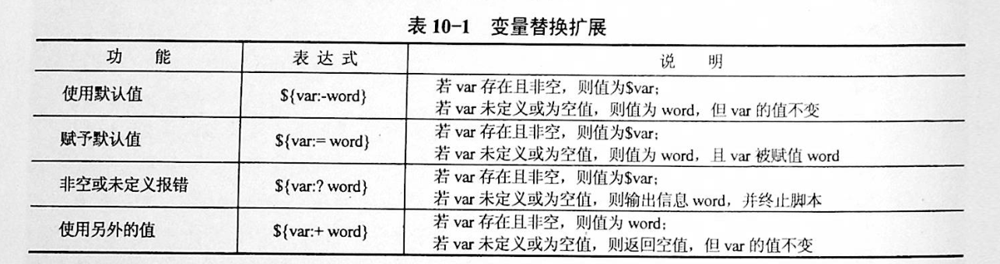
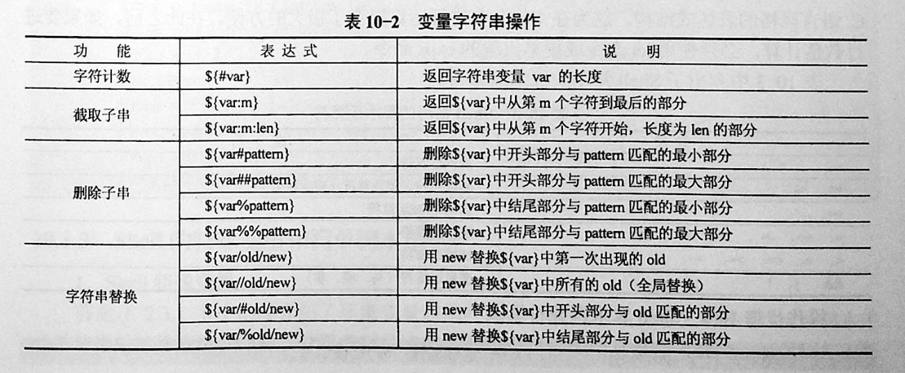

# 2 字符串与数组

## 1 字符串常用操作

#### 1.1 获取字符串长度

方式1
利用`${#var}`来获取字符串长度

```
[root@xuel-tmp-shell ~]# var='abcstring'
[root@xuel-tmp-shell ~]# echo ${#var}
9
```
方式2
```
# $string上的双引号必不可少
expr length "$string"
```

#### 1.2 字符串切片

格式：

```
·${parameter:offset}

·${parameter:offset:length}

```

截取从 offset 个字符开始，向后 length 个字符。

```
[root@xuel-tmp-shell ~]# var="hello shell"
[root@xuel-tmp-shell ~]# echo ${var:0}
hello shell
[root@xuel-tmp-shell ~]# echo ${var:0:5}
hello
[root@xuel-tmp-shell ~]# echo ${var:6:5}
shell
[root@xuel-tmp-shell ~]# echo ${var:(-1)}
l
[root@xuel-tmp-shell ~]# echo ${var:(-2)}
ll
[root@xuel-tmp-shell ~]# echo ${var:(-5):2}
sh

```

#### 1.3 字符串替换

格式：${parameter/pattern/string}
```
${PARAMETER/PATTERN/STRING}
${PARAMETER//PATTERN/STRING} 
${PARAMETER/PATTERN} 
${PARAMETER//PATTERN}
```
``` 
操作符“/”表示只替换一个匹配的字符串，而操作符“//”表示替换所有匹配的字符串。
如果没有指定替换字符串STRING，那么匹配的内容将被替换为空字符串，即被删除。
```

```
[root@xuel-tmp-shell ~]# var="hello shell"
[root@xuel-tmp-shell ~]# echo ${var/shell/world}
hello world

[root@swarm-manager2 Test]# MYSTRING="This is used for replacing string or removing string"
#替换字符串中一个匹配
[root@swarm-manager2 Test]# echo ${MYSTRING/string/characters}
This is used for replacing characters or removing string

##替换所有匹配
[root@swarm-manager2 Test]# echo ${MYSTRING//string/characters}
This is used for replacing characters or removing characters

# 删除一个匹配
[root@swarm-manager2 Test]# echo ${MYSTRING/string/}
This is used for replacing  or removing string

# 删除所有匹配
[root@swarm-manager2 Test]# echo ${MYSTRING//string/}
This is used for replacing  or removing 

```

#### 1.4 字符串删除
``` 
$ hujianli="hello fred，/home/fred, this is test var fred"

# 删除变量中匹配到1次的元素     /元素
$ echo ${hujianli/fred}
hello ，/home/fred, this is test var fred


# 删除变量中开头匹配到的元素   /#元素
$ echo ${hujianli/#fred}
hello fred，/home/fred, this is test var fred

# 删除变量中结尾匹配到的元素    /%元素
$ echo ${hujianli/%fred}
hello fred，/home/fred, this is test var

# 删除变量中所有匹配到的元素     //元素
$ echo ${hujianli//fred}
hello ，/home/, this is test var

```

字符串变量大小写转换
```
$ echo ${hujianli^^}
HELLO FRED，/HOME/FRED, THIS IS TEST VAR FRED

$ echo ${hujianli,,}
hello fred，/home/fred, this is test var fred

```

#### 1.5 字符串截取

格式：

${parameter#word}
\# 删除匹配前缀

${parameter##word}


${parameter%word}
\# 删除匹配后缀

${parameter%%word}

\# 去掉左边，最短匹配模式，##最长匹配模式。

% 去掉右边，最短匹配模式，%%最长匹配模式。

```
[root@xuel-tmp-shell ~]# url="https://www.baidu.com/index.html"
[root@xuel-tmp-shell ~]# echo ${url#*/}
/www.baidu.com/index.html
[root@xuel-tmp-shell ~]# echo ${url##*/}
index.html

[root@xuel-tmp-shell ~]# echo ${url%/*}
https://www.baidu.com
[root@xuel-tmp-shell ~]# echo ${url%%/*}
https:
```

#### 1.6 变量状态赋值

${VAR:-string}	如果 VAR 变量为空则返回 string

${VAR:+string}	如果 VAR 变量不为空则返回 string

${VAR:=string} 如果 VAR 变量为空则重新赋值 VAR 变量值为 string

${VAR:?string} 如果 VAR 变量为空则将 string 输出到 stderr

```
[root@xuel-tmp-shell ~]# url="https://www.baidu.com/index.html"
[root@xuel-tmp-shell ~]# echo ${url:-"string"}
https://www.baidu.com/index.html
[root@xuel-tmp-shell ~]# echo ${url:+"string"}
string
[root@xuel-tmp-shell ~]# unset url
[root@xuel-tmp-shell ~]# echo $url

[root@xuel-tmp-shell ~]# echo ${url:-"string"}
string
[root@xuel-tmp-shell ~]# echo ${url:+"string"}


找出/etc/group下的所有组名称
for i in `cat /etc/group`;do echo ${i%%:*};done

```

## 2. Shell变量操作
##### 2.1 变量替换扩展


##### 2.2 变量字符串操作


##### 2.3 代码总结
```shell
#!/usr/bin/env bash
##################### 变量赋值 ##################################################
WORD=car
echo $WORD

###################### 间接参数扩展 ###############################################
PAR=TEMP
TEMP="Thfiles files test TEMP"

echo ${!PAR}
echo $PAR


##################### 大小写修改 ####################################################
# 首字母大写
echo ${TEMP^}
# 全部大写
echo ${TEMP^^}
# 首字母小写
echo ${TEMP,}
# 全部小写
echo ${TEMP,,}
# 首字母小写
echo ${TEMP~}
# 大小写转换
echo ${TEMP~~}


# ----------------- 将当前目录下的所有后缀为txt的文件名转换为小写 --------------
#for file in *.txt ; do
#    mv "$file" "${file,,}"
#done


#############################  字符串移除 ###################################################
MYSTRING="This is used for removing string"

# 从左到右分割显示第一个空格之后的内容
echo ${MYSTRING#* }   # is used for removing string

# 从左到右分割显示最后一个空格之后的内容
echo ${MYSTRING##* }  # string


# 从右到左分割显示第一个空格之后的内容
echo ${MYSTRING% *}     # This is used for removing

# 从右到左分割显示最后一个空格之后的内容
echo ${MYSTRING%% *}    # This


#-------------------------- 最常用的用途是提取文件名的一部分 --------------
FILENAME=linux_bash.txt
echo ${FILENAME%.*}        #移除文件名的后缀    #linux_bash

echo ${FILENAME##*.}       #移除文件名，保留后缀  #txt


FILENAME=/home/yantaol/linux_bash.txt
echo ${FILENAME%/*}        #移除文件名，保留目录名   #/home/yantaol

echo ${FILENAME##*/}       #移除目录名，保留文件名   #linux_bash.txt


################################################## 字符串搜索与替换 #############################
# 操作符“/”表示只替换一个匹配的字符串，而操作符“//”表示替换所有匹配的字符串。如果没有指定替换字符串STRING，那么匹配的内容将被替换为空字符串，即被删除。
MYSTRING="This is used for replacing string or removing string"
# 替换一次
echo ${MYSTRING/string/characters }
# 替换全部
echo ${MYSTRING//string/characters }

# 删除一次
echo ${MYSTRING/string }
echo ${MYSTRING//string }
# 删除全部
echo ${MYSTRING//string/}


############################################### 求字符串长度 ######################################
# 求字符串长度
# ${#PARAMETER}
MYSTRING="Hello World"
echo ${#MYSTRING}

# 子字符串扩展：
#${PARAMETER:OFFSET}
#${PARAMETER:OFFSET:LENGTH}

#这种参数扩展格式将扩展参数值的一部分，从指定的位置开始截取指定长度的字符串，如果省略LENGTH，将截取到参数值的末尾
MYSTRING="This is used for substring expansion."
echo ${MYSTRING:8}    # used for substring expansion.
echo ${MYSTRING:8:10} # used for s


################################################ 使用默认值 ##########################################
#${PARAMETER:-WORD}

#${PARAMETER-WORD}

#如果参数PARAMETER是未定义，或为null时，这种模式会扩展WORD，否则将扩展参数PARAMETER。如果在PARAMETER和WORD之间略去了符号“:”，即上述语法中的第二种格式，只有参数PARAMETER是未定义时，才会使用WORD

unset MYSTRING  # 解除环境变量
echo ${MYSTRING:-Hello World}

unset MYSTRING  # 解除环境变量
MYSTRING=
echo ${MYSTRING:-Hello World}

MYSTRING=Hi
echo ${MYSTRING:-Hello World}

unset MYSTRING  # 解除环境变量
MYSTRING=
# 当变量为空值时，去掉：打印空值，空值也是参数
echo ${MYSTRING-Hello World}


echo "------------------------------------ 华丽的分割线 -----------------------------------------------"
##################################################### 指定默认值 ########################################
#${PARAMETER:=WORD}

#${PARAMETER=WORD}

#这种模式与使用默认值的模式类似，但其区别在于，此种模式不仅扩展WORD，还将WORD赋值给参数PARAMETER，作为PARAMETER的值

echo ${MYSTRING_hu:=Hello World}
echo $MYSTRING_hu

echo ${MYSTRING_hu1=Hello World}
echo $MYSTRING_hu1

echo "------------------------------------ 华丽的分割线 -----------------------------------------------"
#################################################### 使用替代值 ###################################

#${PARAMETER:+WORD}

#${PARAMETER+WORD}

#如果参数PARAMETER是未定义的，或其值为空时，这种模式将不扩展任何内容。如果参数PARAMETER是定义的，且其值不为空，这种模式将扩展WORD，而不是扩展为参数PARAMETER的值。

MYSTRING722=""
echo ${MYSTRING:+ NOTE: MYSTRING seems to be set.}

MYSTRING="Hi"
echo ${MYSTRING:+ NOTE: MYSTRING seems to be set.}
```

## 3 数组

bash支持一维数组（不支持多维数组），并且没有限定数组的大小。数组是相同类型的元素按一定顺序排列的集合。
类似与 C 语言，数组元素的下标由 0 开始编号。获取数组中的元素要利用下标，下标可以是整数或算术表达式，其值应大于或等于 0。

#### 3.1 数组定义

在 Shell 中，用括号来表示数组，数组元素用"空格"符号分割开

#### 3.2 通过元素值集合来创建数组变量

```shell
#! /bin/bash

# 定义数组
array=(1 2 3 4 5 6 7 8)
# 输出第 1 个数组元素的值
echo "the first element is ${#array[0]}"
# 输出所有元素的值
echo "the elements of this array are ${array[@]}"
# 输出数组长度
echo "the size of the array is ${#array[@]}"
```

计算数组的长度

```
${#array[@]}
或者
${#array[*]}

#array表示数组名称，方括号中的@或者*是通配符，表示匹配所有的元素。
```

#### 3.3 通过键值对定义数组

```shell
#! /bin/bash

# 定义数组
array=([1]=one [4]=four)
# 输出数组长度
echo "the size of the array is  ${#array[@]}"
# 输出索引为 4 的元素的值
echo "the fourth element is ${array[4]}"
```


#### 3.4 数组元素读取

```shell
[root@xuel-tmp-shell ~]# args1=(aa bb cc 1123)
[root@xuel-tmp-shell ~]# echo ${#args1[@]}     #获取数组元素个数
4
[root@xuel-tmp-shell ~]# echo ${args1[0]}
aa
[root@xuel-tmp-shell ~]# echo ${args1[1]}
bb

[root@monitor workspace]# filelist=($(ls))
[root@monitor workspace]# echo ${filelist[*]}
check_url_for.sh check_url_while01.sh check_url_while02.sh func01.sh func02.sh func03.sh urllist.txt

获取数组元素的下标
[root@monitor workspace]# echo ${!filelist[@]}
0 1 2 3 4 5 6
```

遍历数组

方式1

```shell
#! /bin/bash

# 定义数组
array=(Mon Tue Wed Thu Fri Sat Sun)
# 通过下标访问数组
for (( i = 0; i < ${#Ip_array[@]}; i++ )); do
    echo $i ${array[i]}
done
```

---

方式2

```shell
#! /bin/bash

array=(Mon Tue Wed Thu Fri Sat Sun)
# 获取数组长度
len="${#array[@]}"
# 通过循环结构遍历数组
for ((i=0;i<$len;i++))
do
   echo "${array[$i]}"
done
```


遍历文件

```
filelist=($(ls));for i in ${!filelist[@]};do echo ${filelist[$i]};done
```

#### 3.5 以切片方式获取部分数组元素

```shell
#! /bin/bash
#在上面的代码中，第4行定义了一个含有7个元素的数组。第6行从下标为2的数组元素开始，截取其中的4个元素。
linux=("Debian" "RedHat" "Ubuntu" "Suse" "Fedora" "UTS" "CentOS")
# 数组切片
var=${linux[@]:2:4}
echo "$var"
```

---

```shell
[root@linux chapter7]# ./ex7-19.sh
Ubuntu Suse Fedora UTS
```

演示将切片结果以数组形式保存的方法。本例将切片的结果赋给了一个新的数组变量，然后输出新的数组的长度，最后通过循环输出所有的数组元素

```shell
#! /bin/bash

# 定义数组
linux=("Debian" "RedHat" "Ubuntu" "Suse" "Fedora" "UTS" "CentOS")

# 切片
array=(${linux[@]:2:4})
# 获取新的数组的长度
length="${#array[@]}"
# 输出数组长度
echo "the length of new array is $length"
# 通过循环输出各个元素
for ((i=0;i<$length;i++))
do
   echo "${array[$i]}"
done
```


#### 3.6  通过declare语句定义关联数组 

其基本语法如下：

```
declare -a array
declare -A dic
```

在上面的语法中，-a选项表示后面定义的是一个数组，其名称为array。

##### 关联数组 ---> shell中的字典

```
# -A 举例，字典类型的关联数组
declare -A dic 
dic=([no1]="hujianli1" [no2]="hujianli2" [no3]="hujianli3")

echo ${dic[no3]}		#hujianli3
#打印所有的key
echo ${!dic[*]}			# no3 no2 no1
		
#打印所有的value
echo ${dic[*]}			# hujianli3 hujianli2 hujianli1
		
# 变量key和value
$ for i in ${!dic[*]}; do echo ${i}:${dic[$i]}; done
no3:hujianli3
no2:hujianli2
no1:hujianli1
		
```


关联数组必须以大写的declare -A命令来进行声明
``` shell
$ declare -A array_example
$ array_example=([0]=centos7 
                 [1]=centos6 
                 [2]=ubuntu   
                 [3]=redhat 
                 [4]=suse 
                 [5]=windows)

$ echo ${array_example[3]}
redhat

$ echo ${array_example[*]}
centos7 centos6 ubuntu redhat suse windows

$ echo ${array_example[@]}
centos7 centos6 ubuntu redhat suse windows

$ echo ${#array_example[@]}
6

# 显示所有的index下标
$ echo ${!array_example[*]}
0 1 2 3 4 5
```

举例说明
```shell
declare -A projects=(
    [test_chatsrv-frontend]="172.20.20.3"
    [test_chatsrv-core]="172.20.20.5"
    [test_chatsrv-storage]="172.20.20.5"
    [test_chatsrv-push]="172.20.20.5"
)

token="xxxxxxxxx"

for project in ${!projects[@]}; do
    client="${projects[${project}]}"
    curl -w '\n' 'http://deploy.ixiaochuan.cn/deploy' -H "Cookie: remember_token=${token};" --data "operation=update&project=${project}&client=${client}" --compressed --silent
done
```
```shell
#!/bin/sh
# @Author: hujianli
# @Date:   2018-11-18 15:03:18
# @Last Modified by:   hujianli
# @Last Modified time: 2018-11-18 15:15:13

: <<EOF
符号*是把原数组中的所有元素（除了用于区别元素的分隔符，通常是空格）当成一个元素复制到新数组中，生的新数组只有一个元素
符号@的含义是把原数组的内容复制到一个新数组中，生成的新数组和原来的是一样的
EOF

declare -a      #显示当前所有的数组
declare -ar BASH_VERSION='([0]="2"
                           [1]="05b"
                           [2]="0"
                           [3]="1"
                           [4]="release"
                           [5]="i386-redhat-linux-gnu")'
declare -a DIRSTACK='()'
declare -a GROUPS='()'
declare -a PIPESTATUS='([0]="0")'
declare -a student='([0]="张三"
    [1]="李四"
    [2]="王小二"
    [3]="李晓明"
    [4]="张四宝")'
declare -a score='([0]="66"
    [1]="70"
    [2]="80"
    [3]="90"
    [4]="98")'

echo ${student[@]}
echo ${student[*]}
```
```shell
#!/bin/sh
# @Author: hujianli
# @Date:   2018-11-18 13:59:12
# @Last Modified by:   hujianli
# @Last Modified time: 2018-11-18 14:04:47
student=("张三" "李四" "王五" "李晓明" "胡建力")
score=(66 70 80 84 99)

N=${#student[*]}        #计算数组的个数总和,赋值给变量N
echo "学生总数为:$N"
i=0
while [[ $i -lt $N ]]; do
    echo -e "\tstudent $[i]的考试成绩为:${score[$i]}"
    i=$(($i+1))
done
```

#### 3.7 在数组末尾追加新元素

在Shell中，向已有的数组末尾追加新的元素非常方便。在通过索引为数组元素赋值时，如果指定的索引不存在，则Shell会自动添加一个新的元素，并且将指定的值赋给该元素。

演示如何在数组末尾追加新的数组元素

```shell
#! /bin/bash
# 定义数组
array=(1 2)
# 输出数组
echo "${array[@]}"
# 向数组末尾追加元素
array[2]=3
array[3]=4
echo "${array[@]}"
```

演示向关联数组追加新元素的方法

```shell
#! /bin/bash
# 定义数组
declare -A array
# 初始化数组
array=([a]=a [b]=b)

echo "the old elements are ${array[@]}"
# 向数组追加元素
array[c]=c
echo "the new elements are ${array[@]}"
```

#### 3.8 通过循环为数组赋值

```shell
#! /bin/bash
# 通过循环为数组赋值
for i in {1..10}
do
   array[$i]=$i
done
# 输出元素的值
echo "${array[@]}"
```

#### 3.9 数组元素的替换

数组元素替换的基本语法如下：

```
${array[@|*]/pattern/replacement}
```

演示如何对数组进行替换，以及如何将替换的结果赋给一个新的数组变量。

```shell
#! /bin/bash
# 定义数组
a=(1 2 3 4 5)
# 输出替换结果
echo "the result is ${a[@]/3/100}"
# 输出原始数组
echo "the old array is ${a[@]}"
# 将替换结果赋给一个数组变量
a=(${a[@]/3/100})
# 输出新的数组变量的值
echo "the new array is ${a[@]}"
```

该程序的执行结果如下：

```shell
[root@linux chapter7]# ./ex7-23.sh
the result is 1 2 100 4 5
the old array is 1 2 3 4 5
the new array is 1 2 100 4 5
```

#### 3.10 删除数组

与删除其他的Shell变量一样，用户可以使用unset命令来删除某个数组元素，其基本语法如下：

```
unset array[n]
```

**删除数组中的元素**

```shell
#! /bin/bash

linux=("Debian" "RedHat" "Ubuntu" "Suse" "Fedora" "UTS" "CentOS")
# 输出原始数组长度
echo "the length of original array is ${#linux[@]}"
# 输出数组的原始值
echo "the old array is ${linux[@]}"
# 删除下标为 3 的元素
unset linux[3]
 输出新的数组的长度
echo "the length of new array is ${#linux[@]}"
# 输出新的数组的值
echo "the new array is ${linux[@]}"
```

**删除整个数组**

```shell
#! /bin/bash

linux=("Debian" "RedHat" "Ubuntu" "Suse" "Fedora" "UTS" "CentOS")
# 删除整个数组
unset linux
echo "${linux[@]}"
```

#### 3.11 数组的其它操作

**复制数组**

所谓复制数组，是指创建一个已经存在的数组的副本。也就是将一个数组的内容全部存储到另外一个新的数组中。

```
在Shell中，用户可以通过以下语法来实现数组的复制：
newarray=("${array[@]}")
```

**连接数组**

连接数组是指将2个数组的数组元素连接在一起，变成一个大的数组。新的数组依次包含2个数组的所有的元素。数组连接的语法如下：

```
("$array1[@]}" "${array2[@]}")
```

示例

```shell
#! /bin/bash

# 定义 2 个数组
linux=("Debian" "RedHat" "Ubuntu" "Suse" "Fedora" "UTS" "CentOS")
shell=("bash" "csh" "ksh" "rsh" "sh" "rc" "tcsh")

# 连接数组
linuxshell=("${linux[@]}" "${shell[@]}")

# 输出合并后的数组
echo "the new array is ${linuxshell[@]}"
# 输出新的数组的长度
echo "the length of new array is ${#linuxshell[@]}"
```

**加载文件内容到数组**

```shell
#! /bin/bash
# 加载文件内容
content=(`cat "demo.txt"`)
# 通过循环输出数组内容
for s in "${content[@]}"
do
   echo "$s"
done
```

## 4 字符显示颜色

```
字体颜色           字体背景颜色            显示方式
30：黑	            40：黑
31：红	            41：深红	           0：终端默认设置
32：绿	            42：绿		           1：高亮显示
33：黄	            43：黄色	           4：下划线
34：蓝色            44：蓝色	           5：闪烁
35：紫色            45：紫色	           7：反白显示
36：深绿            46：深绿	           8：隐藏
37：白色            47：白色
格式：
\033[1;31;40m|	# 1 是显示方式，可选。31 是字体颜色。40m 是字体背景颜色。
\033[0m	| # 恢复终端默认颜色，即取消颜色设置。
```

* 显示方式

```
for i in {1..8};do echo -e "\033[$i;31;40m hello world \033[0m";done
```

* 字体颜色

```
for i in {30..37};do echo -e "\033[$i;40m hello world \033[0m";done
```

* 背景颜色

```
for i in {40..47};do echo -e "\033[47;${i}m hello world! \033[0m";done

```


``` 
#!/usr/bin/env bash
#usage:xxx
#scripts_name:xxx.sh
# 文本颜色是由对应的色彩码来描述的。其中包括：重置=0，黑色=30，红色=31，绿色=32，
#  黄色=33，蓝色=34，洋红=35，青色=36，白色=37。


echo -e "\e[1;31m This is red text \e[0m"
echo -e "\e[1;32m This is green text \e[0m"
echo -e "\e[1;33m This is yellow text \e[0m"
echo -e "\e[1;34m This is blue text \e[0m"
echo -e "\e[1;35m This is Magenta text \e[0m"
echo -e "\e[1;36m This is 青色 text \e[0m"
echo -e "\e[1;37m This is white text \e[0m"
echo
echo

#对于彩色背景，经常使用的颜色码是：重置=0，黑色=40，红色=41，绿色=42，黄色=43，
# 蓝色=44，洋红=45，青色=46，白色=47。
echo -e "\e[1;41m Green Background \e[0m"
echo -e "\e[1;42m Green Background \e[0m"
echo -e "\e[1;43m Green Background \e[0m"
echo -e "\e[1;44m Green Background \e[0m"
echo -e "\e[1;45m Green Background \e[0m"
echo -e "\e[1;46m Green Background \e[0m"
echo -e "\e[1;47m Green Background \e[0m"


#定义一个颜色的函数
echo_color (){
    local color=$1
    local info=$2
    case "$color" in
    red)
        echo -e "\e[1;31m ${info} \e[0m"
       ;;
    green)
        echo -e "\e[1;32m ${info} \e[0m"
       ;;
    yellow)
        echo -e "\e[1;33m ${info} \e[0m"
       ;;
    blue)
        echo -e "\e[1;34m ${info} \e[0m"
       ;;
    Magenta)
        echo -e "\e[1;35m ${info} \e[0m"
    ;;
    cyan-blue)
        echo -e "\e[1;36m ${info} \e[0m"
    ;;
    esac

}


echo_color red "哈哈哈哈哈哈哈"
echo_color green "哈哈哈哈哈哈哈"
echo_color yellow "哈哈哈哈哈哈哈"
echo_color blue "哈哈哈哈哈哈"
echo_color Magenta "哈哈哈哈哈哈"


```